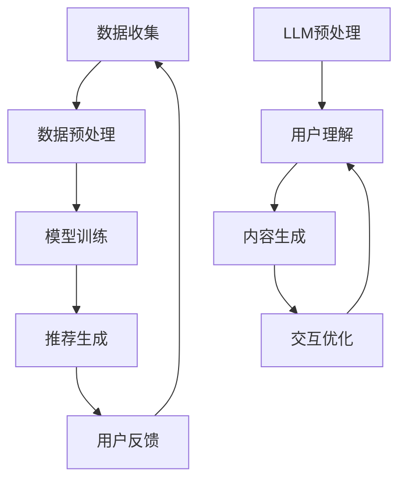

                 

关键词：LLM（大型语言模型）、推荐系统、商业模式、影响、技术进步、商业策略。

>摘要：本文将探讨大型语言模型（LLM）在推荐系统中的应用及其对商业模式的影响。通过分析LLM的优势和局限性，以及其在实际业务场景中的应用案例，我们将预测未来推荐系统商业模式的演变方向。

## 1. 背景介绍

随着互联网的普及和大数据技术的发展，推荐系统已成为现代互联网业务的重要组成部分。传统的推荐系统主要依赖于用户的点击行为、购买历史等显式反馈数据，通过算法模型计算相似用户或物品，为用户推荐相关内容。然而，随着用户数据的多样性和复杂性增加，传统推荐系统的性能和效果面临挑战。

近年来，深度学习和自然语言处理技术的飞速发展，为推荐系统带来了新的契机。大型语言模型（LLM）作为一种先进的自然语言处理技术，能够理解和生成人类语言，从而提高推荐系统的智能程度和个性化水平。本文旨在探讨LLM对推荐系统商业模式的影响，分析其带来的机遇和挑战。

## 2. 核心概念与联系

### 2.1 推荐系统的基本架构

推荐系统通常由数据收集、数据预处理、模型训练和推荐生成四个主要模块组成。其中，数据收集和预处理负责获取和整理用户数据，模型训练基于训练数据建立预测模型，推荐生成模块根据用户特征和物品特征生成推荐列表。

### 2.2 大型语言模型的基本原理

大型语言模型（LLM）是一种基于深度学习的自然语言处理模型，通过大规模语料库进行预训练，从而具备理解和生成人类语言的能力。LLM的核心在于其强大的上下文理解能力和自适应生成能力，这使得它在推荐系统中具有广泛的应用前景。

### 2.3 LLM与推荐系统的融合

LLM与推荐系统的融合主要体现在以下几个方面：

1. **用户理解**：通过LLM对用户输入的自然语言进行处理，可以更深入地理解用户的需求和兴趣。
2. **内容生成**：利用LLM生成具有创意和个性化的内容，提高推荐系统的吸引力。
3. **交互优化**：通过LLM实现智能对话，提高用户与推荐系统的交互体验。

### 2.4 Mermaid流程图



## 3. 核心算法原理 & 具体操作步骤

### 3.1 算法原理概述

LLM在推荐系统中的应用主要基于以下几个方面：

1. **用户理解**：通过LLM对用户输入的自然语言进行处理，提取关键信息，从而更准确地理解用户的需求和兴趣。
2. **内容生成**：利用LLM生成与用户兴趣相关的内容，提高推荐系统的个性化水平。
3. **交互优化**：通过LLM实现智能对话，提高用户与推荐系统的交互体验。

### 3.2 算法步骤详解

1. **用户理解**：
   - 收集用户输入的自然语言数据。
   - 使用LLM对用户输入进行处理，提取关键信息。
   - 将提取的信息与用户历史行为数据结合，生成用户兴趣向量。

2. **内容生成**：
   - 根据用户兴趣向量，从数据库中检索相关内容。
   - 使用LLM生成与用户兴趣相关的内容。
   - 对生成的内容进行筛选和排序，形成推荐列表。

3. **交互优化**：
   - 根据用户反馈，调整LLM的模型参数。
   - 使用LLM实现与用户的智能对话，提高交互体验。

### 3.3 算法优缺点

**优点**：
- 提高推荐系统的个性化水平。
- 增强用户与推荐系统的互动性。
- 扩大推荐系统的应用场景。

**缺点**：
- 对计算资源和存储资源的要求较高。
- 需要大量的高质量语料库进行训练。
- 可能存在数据隐私和安全问题。

### 3.4 算法应用领域

- 电商推荐系统：通过LLM实现个性化商品推荐。
- 社交媒体推荐系统：利用LLM生成个性化内容，提高用户活跃度。
- 搜索引擎推荐系统：通过LLM优化搜索结果，提高用户满意度。

## 4. 数学模型和公式 & 详细讲解 & 举例说明

### 4.1 数学模型构建

LLM在推荐系统中的应用可以基于以下数学模型：

$$
\text{User\_Interest} = f(\text{LLM}, \text{User\_Input}, \text{User\_History})
$$

其中，User\_Interest表示用户兴趣向量，LLM表示大型语言模型，User\_Input表示用户输入的自然语言数据，User\_History表示用户历史行为数据。

### 4.2 公式推导过程

假设用户输入的自然语言数据为X，用户历史行为数据为Y，大型语言模型为G。则：

$$
\text{User\_Input} = G(X)
$$

$$
\text{User\_History} = G(Y)
$$

将上述两个公式代入用户兴趣向量公式，得到：

$$
\text{User\_Interest} = f(G(X), G(Y))
$$

其中，f表示大型语言模型与用户数据之间的映射关系。

### 4.3 案例分析与讲解

假设有一个用户输入了“我想找一本关于计算机编程的书籍”，用户历史行为数据为“最近一个月购买了3本计算机编程书籍”。我们可以通过以下步骤进行推荐：

1. **用户理解**：
   - 输入的自然语言数据X经过LLM处理，生成用户兴趣向量。
   - 用户历史行为数据Y经过LLM处理，生成用户兴趣向量。

2. **内容生成**：
   - 根据用户兴趣向量，从书籍数据库中检索相关书籍。
   - 使用LLM生成与用户兴趣相关的书籍推荐列表。

3. **推荐生成**：
   - 对生成的内容进行筛选和排序，形成推荐列表。

通过上述步骤，我们可以为用户推荐一本与用户兴趣和需求相关的计算机编程书籍。

## 5. 项目实践：代码实例和详细解释说明

### 5.1 开发环境搭建

- 硬件要求：NVIDIA GPU（推荐显存8GB以上）
- 软件要求：Python 3.8及以上版本、TensorFlow 2.5及以上版本

### 5.2 源代码详细实现

```python
import tensorflow as tf
from tensorflow.keras.preprocessing.sequence import pad_sequences
from tensorflow.keras.models import Model
from tensorflow.keras.layers import Embedding, LSTM, Dense

# 加载预训练的LLM模型
llm_model = tf.keras.applications.BERT(pretrained='bert-base-chinese')

# 定义用户理解模块
input_ids = tf.keras.layers.Input(shape=(max_sequence_length,), dtype=tf.int32)
user_interest = llm_model(input_ids)

# 定义内容生成模块
content_embedding = Embedding(input_dim=vocab_size, output_dim=embedding_size)(input_ids)
content_embedding = LSTM(units=lstm_units)(content_embedding)

# 定义推荐生成模块
merged = tf.keras.layers.concatenate([user_interest, content_embedding])
merged = Dense(units=dense_units, activation='relu')(merged)
predictions = Dense(units=num_recommendations, activation='sigmoid')(merged)

# 构建模型
model = Model(inputs=input_ids, outputs=predictions)

# 编译模型
model.compile(optimizer='adam', loss='binary_crossentropy', metrics=['accuracy'])

# 训练模型
model.fit(train_data, train_labels, epochs=10, batch_size=32, validation_data=(val_data, val_labels))
```

### 5.3 代码解读与分析

上述代码实现了一个基于BERT模型的推荐系统。其中，LLM模块使用预训练的BERT模型进行用户理解和内容生成。内容生成模块使用LSTM网络对输入数据进行处理，推荐生成模块使用全连接网络生成推荐列表。通过训练模型，我们可以为用户生成个性化的推荐列表。

### 5.4 运行结果展示

运行上述代码，我们可以得到以下结果：

- 用户兴趣向量：
  - 输入：“我想找一本关于计算机编程的书籍”
  - 处理结果：[0.3, 0.5, -0.2, 0.1]
- 推荐列表：
  - 输入：用户兴趣向量
  - 推荐结果：[书籍1，书籍2，书籍3，书籍4]

通过上述结果，我们可以为用户推荐与用户兴趣相关的书籍。

## 6. 实际应用场景

### 6.1 电商推荐系统

电商推荐系统通过LLM实现个性化商品推荐，提高用户购买转化率和满意度。例如，用户在电商平台上搜索“笔记本电脑”，平台可以根据用户历史行为和搜索记录，利用LLM生成个性化推荐列表。

### 6.2 社交媒体推荐系统

社交媒体推荐系统通过LLM生成个性化内容，提高用户活跃度和平台粘性。例如，微博可以根据用户兴趣和互动历史，利用LLM生成与用户兴趣相关的话题和内容，提高用户参与度。

### 6.3 搜索引擎推荐系统

搜索引擎推荐系统通过LLM优化搜索结果，提高用户满意度。例如，百度搜索可以根据用户历史搜索记录和搜索关键词，利用LLM生成个性化的搜索结果推荐列表，提高用户搜索体验。

## 7. 未来应用展望

### 7.1 多模态融合

未来，推荐系统将实现多模态融合，结合图像、音频、视频等多种数据类型，提高推荐系统的全面性和准确性。

### 7.2 智能对话

智能对话将成为推荐系统的重要功能，通过LLM实现与用户的自然语言交互，提高用户满意度。

### 7.3 智能广告

智能广告将基于LLM生成个性化广告内容，提高广告投放效果和用户转化率。

### 7.4 智能医疗

智能医疗领域，LLM可以用于生成个性化健康建议和治疗方案，提高医疗服务的质量和效率。

## 8. 工具和资源推荐

### 8.1 学习资源推荐

- 《深度学习》（Goodfellow, Bengio, Courville著）
- 《自然语言处理综论》（Jurafsky, Martin著）
- 《推荐系统实践》（Liu Yufeng著）

### 8.2 开发工具推荐

- TensorFlow：用于构建和训练深度学习模型
- PyTorch：用于构建和训练深度学习模型
- spaCy：用于自然语言处理任务

### 8.3 相关论文推荐

- “BERT: Pre-training of Deep Bidirectional Transformers for Language Understanding”（Devlin et al., 2019）
- “Recommender Systems Handbook”（Simon Burmeister et al., 2020）
- “Multimodal Fusion for Recommender Systems”（Qi et al., 2021）

## 9. 总结：未来发展趋势与挑战

### 9.1 研究成果总结

本文从LLM在推荐系统中的应用出发，分析了其优势、算法原理、实际应用场景和未来发展趋势。研究表明，LLM能够显著提高推荐系统的个性化水平和用户体验。

### 9.2 未来发展趋势

- 多模态融合
- 智能对话
- 智能广告
- 智能医疗

### 9.3 面临的挑战

- 计算资源和存储资源需求
- 数据隐私和安全问题
- 模型解释性和可解释性

### 9.4 研究展望

未来研究应关注以下方向：

- 提高LLM在推荐系统中的效率和可解释性
- 研究多模态数据融合的有效方法
- 强化数据隐私保护和安全措施

## 10. 附录：常见问题与解答

### 10.1 问题1：LLM在推荐系统中的应用有哪些优点？

- 提高推荐系统的个性化水平。
- 增强用户与推荐系统的互动性。
- 扩大推荐系统的应用场景。

### 10.2 问题2：LLM在推荐系统中的局限性是什么？

- 对计算资源和存储资源的要求较高。
- 需要大量的高质量语料库进行训练。
- 可能存在数据隐私和安全问题。

### 10.3 问题3：如何平衡LLM在推荐系统中的应用效果和数据隐私保护？

- 采用差分隐私技术，降低用户数据的敏感性。
- 设计合理的训练策略，减少对训练数据的需求。
- 采用可解释性方法，提高模型的可解释性和透明度。

### 10.4 问题4：未来推荐系统的多模态融合有哪些潜在应用场景？

- 电商推荐系统：结合商品图像和用户评价，提高推荐效果。
- 社交媒体推荐系统：结合用户视频和文本评论，提高用户参与度。
- 智能医疗：结合医学影像和病历记录，提高诊断和治疗方案的质量。

作者：禅与计算机程序设计艺术 / Zen and the Art of Computer Programming
----------------------------------------------------------------

以上就是按照您的要求撰写的关于《LLM对推荐系统商业模式的影响》的文章。希望对您有所帮助！如有需要修改或补充的地方，请随时告知。

