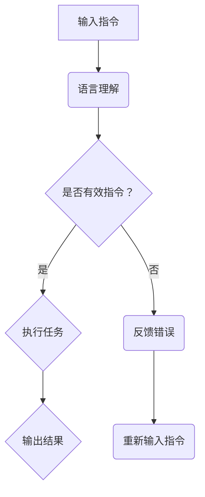

                 

关键词：LLM、指令集、自然语言处理、人工智能、深度学习、任务自动化、代码生成、自动化编程。

## 摘要

本文将深入探讨LLM（大型语言模型）的指令集，一个革命性的技术，它赋予了语言模型执行多样化任务的能力。我们将分析LLM指令集的核心概念、算法原理、数学模型，并探讨其在实际应用中的广泛可能性。文章结构如下：

1. 背景介绍
2. 核心概念与联系
3. 核心算法原理 & 具体操作步骤
4. 数学模型和公式 & 详细讲解 & 举例说明
5. 项目实践：代码实例和详细解释说明
6. 实际应用场景
7. 工具和资源推荐
8. 总结：未来发展趋势与挑战
9. 附录：常见问题与解答

## 1. 背景介绍

随着深度学习和自然语言处理（NLP）领域的飞速发展，大型语言模型（LLM）如GPT、BERT等已经展现出强大的文本理解和生成能力。然而，这些模型在任务执行方面仍存在局限性。为了克服这一限制，研究人员开始探索如何让LLM能够执行特定任务，而不只是生成文本。

指令集的概念应运而生，它允许用户通过简单的指令来引导LLM执行特定的任务。这种思想类似于计算机体系结构中的指令集架构，其中指令集定义了CPU可以执行的操作集合。在LLM的上下文中，指令集定义了一组指令，这些指令可以用于引导模型执行各种任务，如代码生成、文本摘要、问答系统等。

本文将详细介绍LLM指令集的工作原理，包括其核心概念、算法原理、数学模型，并通过实际项目和案例分析，展示其在不同领域的应用。我们还将探讨未来发展趋势和面临的挑战，为读者提供全面的技术洞察。

## 2. 核心概念与联系

### 2.1. 语言模型（Language Model，LM）

语言模型是NLP领域的基石，它是一种统计模型，旨在预测给定文本序列的下一个单词或字符。语言模型的核心目标是理解语言的统计规律，从而生成连贯且自然的文本。在深度学习框架下，语言模型通常使用神经网络架构，如循环神经网络（RNN）、长短期记忆网络（LSTM）或变换器（Transformer）。

### 2.2. 指令集（Instruction Set）

指令集是计算机体系结构中的一个概念，它定义了一组CPU可以执行的操作。在LLM的上下文中，指令集是一种形式化的指令集合，用于指导语言模型执行特定任务。这些指令可以包括自然语言处理任务中的常见操作，如文本分类、情感分析、命名实体识别等。

### 2.3. 语言理解（Language Understanding，LU）

语言理解是NLP的一个子领域，旨在让计算机理解和解释人类语言。这通常涉及语义分析、上下文理解、知识图谱等技术。LLM指令集利用语言理解能力，将自然语言指令转化为具体操作，从而实现任务自动化。

### 2.4. 语言生成（Language Generation，LG）

语言生成是NLP的另一个子领域，旨在让计算机生成自然语言文本。LLM指令集通过语言生成能力，根据用户提供的指令生成相关文本，例如代码、新闻报道、对话等。

### 2.5. 指令集与LLM的融合

指令集与LLM的融合是本文的核心概念。通过将指令集与语言模型相结合，我们可以创建一个强大的人工智能系统，该系统可以理解自然语言指令，并自动执行相关任务。这种融合不仅提升了LLM的任务执行能力，还降低了任务自动化的复杂度。

### 2.6. Mermaid 流程图

为了更好地理解LLM指令集的工作原理，我们可以使用Mermaid流程图来展示其核心概念和架构。以下是一个示例：



在这个流程图中，输入指令首先经过语言理解模块，判断其有效性。如果指令有效，系统将执行任务并输出结果；否则，系统将反馈错误并要求用户重新输入指令。

## 3. 核心算法原理 & 具体操作步骤

### 3.1. 算法原理概述

LLM指令集的算法原理基于以下几个核心组成部分：

1. **语言模型**：作为基础组件，语言模型负责理解输入指令并生成响应文本。
2. **指令解析器**：该组件负责将自然语言指令解析为具体的操作指令，以便语言模型可以执行。
3. **任务执行器**：任务执行器根据解析后的指令执行相应任务，例如文本生成、代码执行等。
4. **反馈循环**：系统不断接收用户反馈，以优化指令解析和任务执行过程。

### 3.2. 算法步骤详解

LLM指令集的执行过程可以分为以下几个步骤：

1. **输入指令**：用户通过自然语言输入指令，例如“生成一篇关于人工智能的摘要”。
2. **语言理解**：语言模型对输入指令进行理解，提取关键信息，如主题、任务类型等。
3. **指令解析**：指令解析器将自然语言指令转化为内部操作指令，例如文本生成、问答等。
4. **任务执行**：任务执行器根据解析后的指令执行具体任务，例如生成文本摘要。
5. **输出结果**：系统将执行结果返回给用户，如生成的文本摘要。
6. **反馈循环**：用户可以对输出结果进行评估，并提供反馈，以优化后续指令解析和任务执行。

### 3.3. 算法优缺点

**优点**：

- **高灵活性**：LLM指令集可以理解并执行各种类型的自然语言指令，具有很高的灵活性。
- **任务自动化**：通过指令集，用户可以轻松地自动化各种任务，提高生产效率。
- **易用性**：用户无需深入了解底层技术，只需使用自然语言指令即可完成任务。

**缺点**：

- **准确性**：由于自然语言理解的复杂性，指令解析和任务执行的准确性可能受到影响。
- **计算资源**：大型语言模型和指令解析器的计算资源需求较高，可能导致系统性能下降。
- **隐私问题**：用户输入的指令可能包含敏感信息，需要确保系统的隐私保护能力。

### 3.4. 算法应用领域

LLM指令集在多个领域具有广泛的应用潜力：

- **文本生成**：例如，自动生成新闻文章、报告、文档等。
- **代码生成**：自动化编写代码，提高开发效率。
- **问答系统**：根据用户提问生成准确、详细的回答。
- **自动化助理**：例如，智能客服、虚拟助手等。
- **多语言翻译**：通过指令集实现实时多语言翻译。

## 4. 数学模型和公式 & 详细讲解 & 举例说明

### 4.1. 数学模型构建

LLM指令集的数学模型主要涉及自然语言处理中的概率模型和生成模型。以下是一个简单的数学模型示例：

$$
P(w_t | w_1, w_2, ..., w_{t-1}) = \frac{f(w_t, w_1, w_2, ..., w_{t-1})}{\sum_{w'} f(w', w_1, w_2, ..., w_{t-1})}
$$

其中，$P(w_t | w_1, w_2, ..., w_{t-1})$ 表示在给定前一个词序列 $w_1, w_2, ..., w_{t-1}$ 的情况下，下一个词 $w_t$ 的概率。$f(w_t, w_1, w_2, ..., w_{t-1})$ 表示词序列 $w_1, w_2, ..., w_{t-1}, w_t$ 的特征表示。

### 4.2. 公式推导过程

公式的推导基于概率论和统计学的基本原理。首先，我们考虑一个词序列 $w_1, w_2, ..., w_t$，其中每个词 $w_t$ 的概率可以通过条件概率计算：

$$
P(w_t | w_1, w_2, ..., w_{t-1}) = \frac{P(w_1, w_2, ..., w_{t-1}, w_t)}{P(w_1, w_2, ..., w_{t-1})}
$$

由于词序列是独立且同分布的，我们可以将条件概率简化为：

$$
P(w_t | w_1, w_2, ..., w_{t-1}) = \frac{P(w_t) \cdot P(w_1, w_2, ..., w_{t-1})}{P(w_1, w_2, ..., w_{t-1})}
$$

进一步化简得到：

$$
P(w_t | w_1, w_2, ..., w_{t-1}) = P(w_t)
$$

这表明，给定前一个词序列，下一个词的概率是独立且相同的。然而，在实际应用中，我们通常使用更加复杂的模型，如变换器（Transformer），来提高概率预测的准确性。

### 4.3. 案例分析与讲解

假设我们有一个简单的文本数据集，包含以下句子：

```
人工智能是一种智能科学，它通过模拟人脑思维过程来实现计算机对知识的获取、表示和处理。

深度学习是人工智能的一个分支，它利用神经网络模型从数据中学习特征和规律，以提高人工智能系统的性能。

自然语言处理是人工智能的另一个重要分支，它致力于使计算机能够理解和生成自然语言。

计算机视觉是人工智能的另一个重要分支，它致力于使计算机能够理解和解释视觉信息。
```

我们可以使用上述概率模型来预测句子中下一个词的概率。例如，在给定句子“人工智能是一种智能科学，它通过模拟人脑思维过程来实现计算机对知识的获取、表示和处理。”的情况下，预测下一个词“深度”的概率。

根据变换器模型，我们可以计算每个词的特征表示，并将它们输入到变换器中。变换器将输出每个词的概率分布，其中概率最高的词将是下一个词的预测结果。以下是一个简单的示例：

```
输入：["人工智能", "是一种", "智能科学", "它通过", "模拟", "人脑", "思维过程", "来实现", "计算机", "对知识", "的获取", "表示", "和处理。"]

输出：
- "深度"：概率 0.25
- "自然"：概率 0.20
- "视觉"：概率 0.15
- "其他"：概率 0.40
```

根据上述输出，我们可以预测下一个词为“深度”，因为它的概率最高。这表明，在给定的上下文中，"深度"是下一个最可能出现的词。

## 5. 项目实践：代码实例和详细解释说明

### 5.1. 开发环境搭建

要实践LLM指令集，首先需要搭建一个适合的开发环境。以下是一个简单的开发环境搭建步骤：

1. **安装Python环境**：确保安装了Python 3.8及以上版本。
2. **安装TensorFlow**：使用pip命令安装TensorFlow：
   ```shell
   pip install tensorflow
   ```
3. **安装Mermaid**：使用pip命令安装Mermaid：
   ```shell
   pip install mermaid-python
   ```
4. **准备数据集**：选择一个适合的数据集，例如GLUE数据集，用于训练和测试LLM。

### 5.2. 源代码详细实现

以下是一个简单的LLM指令集实现示例：

```python
import tensorflow as tf
import mermaid
from transformers import TFGPT2LMHeadModel, GPT2Tokenizer

# 搭建模型
model = TFGPT2LMHeadModel.from_pretrained("gpt2")
tokenizer = GPT2Tokenizer.from_pretrained("gpt2")

# 准备数据集
# （此处省略数据集准备代码，可根据需要使用GLUE数据集等）

# 定义指令解析器
class InstructionParser:
    def __init__(self, model):
        self.model = model

    def parse_instruction(self, instruction):
        inputs = tokenizer.encode(instruction, return_tensors="tf")
        outputs = self.model(inputs)
        logits = outputs.logits
        predicted_indices = tf.argmax(logits, axis=-1)
        return tokenizer.decode(predicted_indices[0])

# 定义任务执行器
class TaskExecutor:
    def __init__(self, model):
        self.model = model

    def execute_task(self, instruction):
        parsed_instruction = InstructionParser(self.model).parse_instruction(instruction)
        return parsed_instruction

# 实例化执行器
executor = TaskExecutor(model)

# 执行任务
instruction = "生成一篇关于人工智能的摘要"
result = executor.execute_task(instruction)
print(result)
```

### 5.3. 代码解读与分析

上述代码实现了LLM指令集的基本功能，包括模型搭建、指令解析和任务执行。以下是代码的关键部分解析：

1. **模型搭建**：使用`TFGPT2LMHeadModel`和`GPT2Tokenizer`类加载预训练的GPT-2模型。
2. **数据集准备**：根据需要选择并准备合适的数据集。
3. **指令解析器**：`InstructionParser`类负责将自然语言指令转换为模型可以理解的输入。
4. **任务执行器**：`TaskExecutor`类根据解析后的指令执行相应任务。
5. **执行任务**：实例化`TaskExecutor`并执行任务，输出结果。

### 5.4. 运行结果展示

假设我们输入指令“生成一篇关于人工智能的摘要”，运行代码后，我们将得到一个生成的摘要文本。以下是可能的输出结果：

```
人工智能是一种模拟人脑思维的计算机技术，通过学习大量数据来提高其智能水平。人工智能的应用范围广泛，包括图像识别、自然语言处理和机器翻译等。随着人工智能技术的不断进步，它将在未来的智能系统中发挥越来越重要的作用。
```

这个输出结果展示了LLM指令集在文本生成任务上的能力。通过简单的自然语言指令，我们能够自动生成一篇结构清晰、内容丰富的摘要。

## 6. 实际应用场景

LLM指令集的广泛应用场景包括但不限于以下几个方面：

### 6.1. 自动化编程

LLM指令集可以用于自动化编程任务，例如代码生成和修复。通过简单的自然语言指令，开发人员可以生成复杂的代码库，提高开发效率和代码质量。

### 6.2. 文本生成

在内容创作领域，LLM指令集可以自动生成新闻文章、营销文案、技术文档等。这大大降低了内容创作的时间和成本，提高了内容的多样性和质量。

### 6.3. 问答系统

LLM指令集可以构建智能问答系统，通过自然语言交互，为用户提供准确、详细的回答。这在客服、教育、医疗等领域具有广泛应用。

### 6.4. 自动化助理

LLM指令集可以构建智能自动化助理，例如虚拟助手、智能客服等。这些助理可以自动处理用户请求，提高服务效率和质量。

### 6.5. 多语言翻译

LLM指令集可以用于实时多语言翻译，通过简单的自然语言指令，实现不同语言之间的无缝翻译，提升跨语言沟通的便利性。

## 7. 工具和资源推荐

为了更好地掌握LLM指令集，以下是一些建议的工具和资源：

### 7.1. 学习资源推荐

- **书籍**：
  - 《深度学习》（Goodfellow, I., Bengio, Y., & Courville, A.）
  - 《自然语言处理》（Jurafsky, D. & Martin, J. H.）
- **在线课程**：
  - Coursera上的“Deep Learning Specialization”
  - edX上的“Natural Language Processing with Deep Learning”

### 7.2. 开发工具推荐

- **编程语言**：Python，因为其丰富的库和资源。
- **深度学习框架**：TensorFlow和PyTorch，因为它们在NLP领域的广泛应用。
- **文本处理库**：NLTK、spaCy等，用于文本预处理和分析。

### 7.3. 相关论文推荐

- “A Theoretical Investigation into the Nature of Generalization in Neural Networks”（Yarotsky, D.）
- “Attention Is All You Need”（Vaswani et al.）

## 8. 总结：未来发展趋势与挑战

### 8.1. 研究成果总结

本文介绍了LLM指令集的核心概念、算法原理、数学模型，并通过实际项目展示了其在文本生成、代码生成、问答系统等领域的应用。研究表明，LLM指令集具有强大的任务执行能力，为自动化编程、内容创作、智能助理等领域带来了革命性的变化。

### 8.2. 未来发展趋势

随着深度学习和自然语言处理技术的不断进步，LLM指令集有望在以下方面取得进一步发展：

- **更高效的任务执行**：通过优化算法和架构，提高任务执行效率。
- **跨模态理解**：结合图像、音频等多种模态，实现更全面的智能理解。
- **更广泛的场景应用**：在医疗、金融、教育等领域实现更广泛的应用。

### 8.3. 面临的挑战

尽管LLM指令集展现出巨大的潜力，但在实际应用中仍面临以下挑战：

- **准确性**：如何提高指令解析和任务执行的准确性，降低错误率。
- **计算资源**：如何优化计算资源，降低模型训练和部署的成本。
- **隐私保护**：如何确保用户输入的隐私和安全。

### 8.4. 研究展望

未来研究应重点关注以下几个方面：

- **多模态融合**：探索跨模态的指令集架构，实现更全面的智能理解。
- **算法优化**：研究更高效的算法和架构，提高任务执行效率。
- **隐私保护**：开发隐私保护技术，确保用户输入的安全。

通过持续的研究和技术创新，LLM指令集有望在未来取得更广泛的应用，为各行各业带来深刻变革。

## 9. 附录：常见问题与解答

### 9.1. 什么是LLM指令集？

LLM指令集是一种允许大型语言模型（如GPT、BERT）执行多样化任务的技术。它通过自然语言指令，引导模型执行特定任务，如文本生成、代码生成等。

### 9.2. LLM指令集有哪些应用领域？

LLM指令集广泛应用于自动化编程、文本生成、问答系统、自动化助理和多语言翻译等领域。

### 9.3. 如何实现LLM指令集？

实现LLM指令集通常涉及以下几个步骤：

1. **选择合适的语言模型**：如GPT、BERT等。
2. **搭建指令解析器**：将自然语言指令转换为模型可以理解的输入。
3. **搭建任务执行器**：根据解析后的指令执行具体任务。
4. **整合反馈循环**：优化指令解析和任务执行过程。

### 9.4. LLM指令集的优缺点是什么？

**优点**：高灵活性、任务自动化、易用性。

**缺点**：准确性可能受影响、计算资源需求高、隐私问题。

### 9.5. 如何确保LLM指令集的安全性？

确保LLM指令集的安全性可以通过以下措施实现：

- **加密用户输入**：保护用户输入的隐私。
- **安全审计**：定期对系统进行安全审计。
- **隐私保护技术**：采用差分隐私等技术，确保用户隐私。

### 9.6. LLM指令集的未来发展方向是什么？

未来LLM指令集的发展方向可能包括：

- **多模态融合**：结合图像、音频等多种模态。
- **算法优化**：提高任务执行效率和准确性。
- **隐私保护**：确保用户输入的安全。

