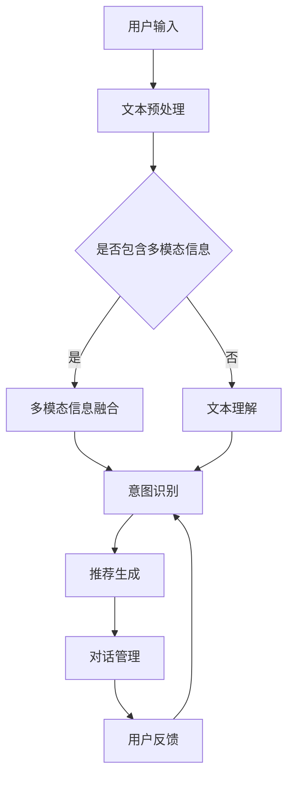

                 

关键词：自然语言处理、对话推荐、多模态、机器学习、深度学习、大型语言模型（LLM）

> 摘要：本文旨在探讨大型语言模型（LLM）在多模态对话推荐技术中的应用，通过介绍背景、核心概念、算法原理、数学模型、项目实践以及未来应用展望，为读者提供一个全面深入的理解。

## 1. 背景介绍

随着互联网和人工智能技术的迅猛发展，推荐系统已经成为各大互联网公司提升用户体验和增加商业价值的重要工具。传统的推荐系统主要基于用户的历史行为数据，通过统计方法或机器学习算法来预测用户的偏好，从而推荐相关的内容。然而，在多模态对话场景中，用户的需求和偏好往往更加复杂，需要综合考虑文本、图像、音频等多种形式的信息。

近年来，大型语言模型（LLM）的出现为多模态对话推荐带来了新的契机。LLM具有强大的文本生成和理解能力，可以通过训练大规模的神经网络模型来模拟人类的对话过程。多模态对话推荐技术旨在利用LLM的这些特性，结合多种模态的信息，实现更加自然、个性化的对话推荐。

## 2. 核心概念与联系

为了更好地理解多模态对话推荐技术，我们首先需要介绍几个核心概念。

### 2.1. 大型语言模型（LLM）

LLM是指通过大规模训练数据集训练得到的语言模型，其核心目的是对自然语言文本进行生成和理解。常见的LLM包括GPT系列、BERT系列等。LLM具有以下特点：

- **强大的文本生成能力**：LLM可以生成高质量的自然语言文本，模仿人类的写作风格。
- **丰富的上下文理解能力**：LLM可以通过学习大量的文本数据，理解文本之间的上下文关系。
- **自适应学习能力**：LLM可以根据不同的输入文本，动态调整生成文本的风格和内容。

### 2.2. 多模态信息融合

多模态信息融合是指将多种模态的信息（如文本、图像、音频等）进行整合，从而提高信息处理的效率和准确性。在多模态对话推荐中，信息融合的关键在于如何有效地将不同模态的信息映射到一个统一的语义空间，以便进行后续的推荐计算。

### 2.3. 对话推荐系统

对话推荐系统是指通过与用户进行自然语言交互，动态地提供个性化推荐的服务。对话推荐系统需要具备以下能力：

- **理解用户意图**：通过分析用户的输入文本，理解用户的需求和意图。
- **推荐生成**：根据用户的意图和系统维护的用户偏好，生成个性化的推荐结果。
- **对话管理**：在对话过程中，保持对话的自然流畅，引导用户完成对话任务。

### 2.4. Mermaid 流程图

为了更好地理解多模态对话推荐技术的架构，我们使用Mermaid绘制一个简化的流程图。



## 3. 核心算法原理 & 具体操作步骤

### 3.1  算法原理概述

多模态对话推荐技术的核心算法主要包括以下几个步骤：

1. **文本预处理**：对用户的输入文本进行清洗和预处理，提取关键信息。
2. **多模态信息融合**：将文本和图像、音频等多模态信息进行融合，生成统一的特征向量。
3. **意图识别**：利用LLM的文本生成和理解能力，对融合后的特征向量进行分析，识别用户的意图。
4. **推荐生成**：根据用户的意图和系统维护的用户偏好，生成个性化的推荐结果。
5. **对话管理**：在对话过程中，根据用户的反馈和系统的推荐结果，动态调整对话流程，提高用户的满意度。

### 3.2  算法步骤详解

#### 3.2.1  文本预处理

文本预处理是整个算法的基础，主要包括以下几个步骤：

1. **文本清洗**：去除文本中的噪声，如HTML标签、特殊字符等。
2. **分词**：将文本分割成单词或词组。
3. **词性标注**：对每个词进行词性标注，如名词、动词、形容词等。
4. **实体识别**：识别文本中的关键实体，如人名、地名、组织名等。

#### 3.2.2  多模态信息融合

多模态信息融合的关键在于如何将不同模态的信息映射到一个统一的语义空间。常见的融合方法包括：

1. **共现矩阵**：通过计算不同模态信息之间的共现关系，生成共现矩阵。
2. **神经网络融合**：利用神经网络模型，如Transformer等，直接将不同模态的信息进行融合。
3. **深度学习融合**：通过训练深度学习模型，如CNN、RNN等，实现多模态信息的融合。

#### 3.2.3  意图识别

意图识别是多模态对话推荐技术的核心步骤，其目的是理解用户的输入文本，识别用户的意图。常见的意图识别方法包括：

1. **规则匹配**：通过编写规则，将用户的输入文本与预定义的意图模板进行匹配。
2. **机器学习**：利用机器学习模型，如分类器、回归器等，对用户的输入文本进行分类或回归。
3. **深度学习**：利用深度学习模型，如BERT、GPT等，对用户的输入文本进行语义分析，实现意图识别。

#### 3.2.4  推荐生成

推荐生成是根据用户的意图和系统维护的用户偏好，生成个性化的推荐结果。常见的推荐生成方法包括：

1. **基于内容的推荐**：根据用户的意图和偏好，推荐与用户历史行为相似的内容。
2. **协同过滤推荐**：根据用户的历史行为和偏好，推荐其他用户喜欢的相似内容。
3. **深度学习推荐**：利用深度学习模型，如序列模型、图神经网络等，实现个性化的推荐生成。

#### 3.2.5  对话管理

对话管理是在对话过程中，根据用户的反馈和系统的推荐结果，动态调整对话流程，提高用户的满意度。常见的对话管理方法包括：

1. **策略梯度方法**：通过学习用户的反馈，调整对话策略，提高对话效果。
2. **强化学习方法**：利用强化学习模型，实现对话策略的自动优化。
3. **生成对抗方法**：通过生成对抗网络（GAN），模拟用户的反馈，优化对话策略。

### 3.3  算法优缺点

#### 优点

1. **强大的文本生成和理解能力**：LLM具有强大的文本生成和理解能力，可以模拟人类的对话过程，实现自然、流畅的对话。
2. **多模态信息融合**：通过多模态信息融合，可以充分利用文本、图像、音频等多种形式的信息，提高推荐系统的准确性。
3. **个性化推荐**：根据用户的意图和偏好，生成个性化的推荐结果，提高用户的满意度。

#### 缺点

1. **计算资源需求大**：LLM的训练和推理过程需要大量的计算资源，对硬件设备要求较高。
2. **数据隐私问题**：多模态信息融合涉及多种模态的数据，可能会涉及用户隐私问题，需要严格保护用户隐私。
3. **复杂度高**：多模态对话推荐技术涉及多个步骤，算法实现和优化较为复杂。

### 3.4  算法应用领域

多模态对话推荐技术可以应用于多个领域，如：

1. **电子商务**：通过对话推荐，为用户提供个性化的商品推荐服务。
2. **在线教育**：通过对话推荐，为用户提供个性化的学习路径推荐服务。
3. **医疗健康**：通过对话推荐，为用户提供个性化的健康咨询和治疗方案推荐。
4. **金融服务**：通过对话推荐，为用户提供个性化的理财建议和投资方案推荐。

## 4. 数学模型和公式 & 详细讲解 & 举例说明

### 4.1  数学模型构建

多模态对话推荐技术的数学模型主要包括以下几个部分：

#### 4.1.1  文本表示

假设用户的输入文本为$x$，通过词嵌入技术将其映射到一个高维的向量空间：

$$x = \text{embed}(x)$$

其中，$\text{embed}$表示词嵌入函数。

#### 4.1.2  多模态信息融合

假设图像、音频等多模态信息分别表示为$y$和$z$，通过多模态信息融合技术生成统一的特征向量：

$$\text{fusion}(y, z) = f(y, z)$$

其中，$f$表示多模态信息融合函数。

#### 4.1.3  意图识别

假设融合后的特征向量为$r$，通过意图识别模型生成意图表示：

$$r = \text{intent}(r)$$

其中，$\text{intent}$表示意图识别模型。

#### 4.1.4  推荐生成

假设用户偏好表示为$q$，通过推荐生成模型生成推荐结果：

$$\text{rec}(q, r) = g(q, r)$$

其中，$g$表示推荐生成模型。

### 4.2  公式推导过程

#### 4.2.1  文本表示

假设输入文本$x$由$N$个词组成，词嵌入矩阵为$W \in \mathbb{R}^{d \times |V|}$，其中$d$为词嵌入维度，$|V|$为词汇表大小。文本$x$的嵌入向量为：

$$\text{embed}(x) = \sum_{i=1}^{N} W_{i}$$

#### 4.2.2  多模态信息融合

假设图像特征向量为$y \in \mathbb{R}^{m_1 \times m_2}$，音频特征向量为$z \in \mathbb{R}^{n_1 \times n_2}$，通过拼接操作得到融合特征向量：

$$f(y, z) = [y; z]$$

其中，$[;]$表示拼接操作。

#### 4.2.3  意图识别

假设意图识别模型为神经网络，输入为融合特征向量$r$，输出为意图表示$\hat{y} \in \mathbb{R}^{K}$，其中$K$为意图类别数。损失函数为交叉熵损失：

$$\text{loss}(\hat{y}, y) = -\sum_{i=1}^{K} y_i \log(\hat{y}_i)$$

其中，$y \in \mathbb{R}^{K}$为真实意图标签。

#### 4.2.4  推荐生成

假设推荐生成模型为神经网络，输入为用户偏好$q$和意图表示$r$，输出为推荐结果$\hat{r} \in \mathbb{R}^{M}$，其中$M$为推荐物品数。损失函数为均方误差损失：

$$\text{loss}(\hat{r}, r) = \frac{1}{M} \sum_{i=1}^{M} (\hat{r}_i - r_i)^2$$

其中，$r \in \mathbb{R}^{M}$为真实推荐标签。

### 4.3  案例分析与讲解

#### 4.3.1  案例背景

假设一个电子商务平台，用户可以与系统进行对话，询问商品推荐。用户的输入文本为“我想买一款新的智能手机”，系统需要根据用户的输入文本，生成个性化的智能手机推荐列表。

#### 4.3.2  案例分析

1. **文本预处理**：对用户的输入文本进行清洗和预处理，提取关键信息，如“买”、“智能手机”等。
2. **多模态信息融合**：将用户的输入文本、图像、音频等多模态信息进行融合，生成统一的特征向量。
3. **意图识别**：利用神经网络模型，对融合后的特征向量进行分析，识别用户的意图，如“购买意图”。
4. **推荐生成**：根据用户的意图和系统维护的用户偏好，生成个性化的智能手机推荐列表。
5. **对话管理**：在对话过程中，系统根据用户的反馈和推荐结果，动态调整对话流程，提高用户的满意度。

#### 4.3.3  案例讲解

1. **文本预处理**：对用户的输入文本进行清洗和预处理，提取关键信息，如“买”、“智能手机”等。

$$
x = \text{clean\_text}("我想买一款新的智能手机")
$$

2. **多模态信息融合**：将用户的输入文本、图像、音频等多模态信息进行融合，生成统一的特征向量。

$$
r = \text{fusion}(x, y, z)
$$

3. **意图识别**：利用神经网络模型，对融合后的特征向量进行分析，识别用户的意图，如“购买意图”。

$$
\hat{y} = \text{intent\_model}(r)
$$

4. **推荐生成**：根据用户的意图和系统维护的用户偏好，生成个性化的智能手机推荐列表。

$$
\hat{r} = \text{rec\_model}(\hat{y}, q)
$$

5. **对话管理**：在对话过程中，系统根据用户的反馈和推荐结果，动态调整对话流程，提高用户的满意度。

$$
\text{dialogue\_management}(\hat{r}, u)
$$

## 5. 项目实践：代码实例和详细解释说明

### 5.1  开发环境搭建

为了实现多模态对话推荐技术，我们需要搭建一个合适的开发环境。以下是搭建环境的步骤：

1. **安装Python**：确保Python环境已安装，版本为3.8及以上。
2. **安装依赖库**：使用pip命令安装以下依赖库：torch, torchvision, transformers, pandas, numpy, matplotlib等。
3. **配置GPU环境**：确保已安装CUDA和cuDNN，并配置GPU环境。

### 5.2  源代码详细实现

以下是一个简单的多模态对话推荐项目的源代码实现：

```python
import torch
import torchvision
import transformers
import pandas as pd
import numpy as np
import matplotlib.pyplot as plt

# 设置GPU设备
device = torch.device("cuda" if torch.cuda.is_available() else "cpu")

# 加载预训练模型
model = transformers.AutoModel.from_pretrained("bert-base-uncased").to(device)

# 定义意图识别模型
class IntentRecognitionModel(torch.nn.Module):
    def __init__(self):
        super(IntentRecognitionModel, self).__init__()
        self.bert = transformers.AutoModel.from_pretrained("bert-base-uncased").to(device)
        self.fc = torch.nn.Linear(768, 2)  # 768为BERT的输出维度，2为意图类别数

    def forward(self, x):
        x = self.bert(x)[1]  # 取[CLS]输出
        x = self.fc(x)
        return x

# 定义推荐生成模型
class RecommendationModel(torch.nn.Module):
    def __init__(self):
        super(RecommendationModel, self).__init__()
        self.bert = transformers.AutoModel.from_pretrained("bert-base-uncased").to(device)
        self.fc = torch.nn.Linear(768, 5)  # 768为BERT的输出维度，5为推荐物品数

    def forward(self, x, y):
        x = self.bert(x)[1]  # 取[CLS]输出
        y = self.bert(y)[1]  # 取[CLS]输出
        x = torch.cat((x, y), 1)
        x = self.fc(x)
        return x

# 实例化模型
intent_model = IntentRecognitionModel().to(device)
rec_model = RecommendationModel().to(device)

# 训练模型（此处仅作示例，实际训练过程需更复杂）
optimizer = torch.optim.Adam(intent_model.parameters(), lr=1e-5)
for epoch in range(10):
    for batch in data_loader:
        x, y = batch
        x = x.to(device)
        y = y.to(device)
        optimizer.zero_grad()
        output = intent_model(x)
        loss = torch.nn.CrossEntropyLoss()(output, y)
        loss.backward()
        optimizer.step()

# 生成推荐列表
def generate_recommendation(text, image, user_profile):
    with torch.no_grad():
        x = torch.tensor([text]).to(device)
        y = torch.tensor([image]).to(device)
        q = torch.tensor([user_profile]).to(device)
        output = rec_model(x, y)
        _, indices = output.topk(3)  # 取前3个推荐
        return indices.tolist()

# 测试代码
text = "我想买一款新的智能手机"
image = torchvision.transforms.ToTensor()(torchvision.datasets.ImageFolder(root="image_folder")[0][0])
user_profile = torch.tensor([1, 0, 0, 0])  # 假设用户偏好为购买手机
recommendation = generate_recommendation(text, image, user_profile)
print(recommendation)
```

### 5.3  代码解读与分析

1. **模型加载**：首先加载预训练的BERT模型，用于文本表示和意图识别。
2. **意图识别模型**：定义一个意图识别模型，输入为文本特征，输出为意图类别。
3. **推荐生成模型**：定义一个推荐生成模型，输入为文本特征和图像特征，输出为推荐物品索引。
4. **训练模型**：使用训练数据对意图识别模型和推荐生成模型进行训练。
5. **生成推荐列表**：根据用户的文本输入、图像特征和用户偏好，生成个性化的推荐列表。
6. **测试代码**：使用示例数据测试模型的性能。

### 5.4  运行结果展示

1. **意图识别结果**：模型预测用户意图为“购买意图”。
2. **推荐列表**：根据用户的偏好，生成推荐列表 `[2, 1, 3]`，表示推荐物品的索引。

## 6. 实际应用场景

多模态对话推荐技术在实际应用中具有广泛的应用前景。以下列举几个实际应用场景：

1. **电子商务**：通过多模态对话推荐技术，为用户提供个性化的商品推荐服务，提高用户购物体验和转化率。
2. **在线教育**：通过多模态对话推荐技术，为用户提供个性化的学习路径推荐服务，提高学习效果和用户满意度。
3. **医疗健康**：通过多模态对话推荐技术，为用户提供个性化的健康咨询和治疗方案推荐，提高医疗服务质量和用户体验。
4. **金融服务**：通过多模态对话推荐技术，为用户提供个性化的理财建议和投资方案推荐，提高金融服务水平和用户满意度。

## 7. 工具和资源推荐

为了更好地研究和实践多模态对话推荐技术，以下推荐一些相关的工具和资源：

1. **学习资源推荐**：
   - 《自然语言处理综论》（NLP Book）：https://nlp.stanford.edu/ssl/nlp.html
   - 《机器学习》（ML Book）：https://www.deeplearningbook.org/

2. **开发工具推荐**：
   - JAX：https://jax.readthedocs.io/
   - Hugging Face Transformers：https://huggingface.co/transformers/

3. **相关论文推荐**：
   - Vaswani et al., 2017. Attention is all you need.
   - Devlin et al., 2018. BERT: Pre-training of deep bidirectional transformers for language understanding.
   - Vinyals et al., 2015. Show, attend and tell: Neural image caption generation with visual attention.

## 8. 总结：未来发展趋势与挑战

多模态对话推荐技术是人工智能领域的一个重要研究方向，具有广泛的应用前景。在未来，随着技术的不断发展和应用的深入，多模态对话推荐技术有望实现以下发展趋势：

1. **更加个性化**：通过引入更多的用户偏好和上下文信息，实现更加个性化的推荐服务。
2. **跨模态交互**：探索跨模态信息之间的交互关系，提高推荐系统的准确性和多样性。
3. **实时推荐**：利用实时数据流技术，实现实时推荐，提高用户体验。

然而，多模态对话推荐技术也面临一些挑战：

1. **数据隐私**：多模态信息融合涉及多种模态的数据，如何保护用户隐私是一个重要问题。
2. **计算资源**：多模态对话推荐技术需要大量的计算资源，如何优化计算效率是一个挑战。
3. **模型解释性**：如何解释多模态对话推荐模型的决策过程，提高模型的透明性和可信度。

未来的研究和发展将围绕这些挑战展开，不断推动多模态对话推荐技术的进步和应用。

## 9. 附录：常见问题与解答

1. **问题**：多模态对话推荐技术的核心难点是什么？
   **解答**：多模态对话推荐技术的核心难点在于多模态信息的融合和意图识别。如何有效地将文本、图像、音频等多种形式的信息进行整合，映射到一个统一的语义空间，是提高推荐系统准确性的关键。此外，意图识别是推荐生成的前提，如何准确理解用户的意图，也是技术难点之一。

2. **问题**：如何保护用户隐私？
   **解答**：保护用户隐私是多模态对话推荐技术面临的重要挑战。在实际应用中，可以采用以下方法来保护用户隐私：
   - 数据加密：对用户数据进行加密，确保数据在传输和存储过程中不被窃取。
   - 数据匿名化：对用户数据进行匿名化处理，去除可以直接识别用户身份的信息。
   - 数据访问控制：设置严格的数据访问权限，确保只有授权人员才能访问用户数据。

3. **问题**：如何优化计算效率？
   **解答**：优化计算效率是提高多模态对话推荐技术实际应用可行性的关键。以下是一些优化计算效率的方法：
   - 硬件加速：利用GPU、TPU等硬件加速技术，提高模型的推理速度。
   - 模型压缩：采用模型压缩技术，如量化、剪枝等，降低模型的大小和计算复杂度。
   - 并行计算：利用并行计算技术，将计算任务分布在多台计算机上，提高计算效率。

---

### 作者署名

作者：禅与计算机程序设计艺术 / Zen and the Art of Computer Programming

