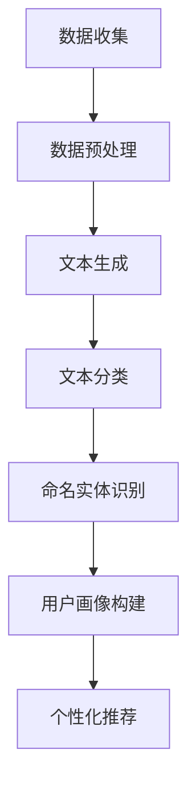

                 

关键词：跨平台用户画像、大型语言模型（LLM）、个性化推荐、数据融合、一致性处理

> 摘要：随着互联网的快速发展，跨平台用户画像的构建已经成为个性化推荐系统的重要环节。本文深入探讨了在LLM（Large Language Model）推荐框架下，如何实现跨平台用户画像的统一。通过对核心概念、算法原理、数学模型、项目实践和实际应用场景的详细分析，本文为构建高效、一致的跨平台用户画像提供了理论支持和实践指导。

## 1. 背景介绍

在互联网时代，用户数据已经成为企业竞争的重要资源。如何高效地利用这些数据为用户提供个性化的服务，是每个互联网公司面临的挑战。个性化推荐系统通过分析用户行为和偏好，为用户推荐其可能感兴趣的内容。而用户画像作为个性化推荐的基础，是对用户在多个平台上行为的抽象和总结。传统的用户画像构建通常局限于单一平台，无法充分利用跨平台的用户数据。

随着大型语言模型（LLM）的兴起，我们有机会在跨平台用户画像的构建上取得突破。LLM具有强大的文本生成和分类能力，可以通过自然语言处理技术，对跨平台用户行为数据进行深度分析，从而构建出更全面、更精准的用户画像。然而，跨平台用户画像的统一面临诸多挑战，如数据格式的不一致性、数据源的不完整性、隐私保护等问题。如何在这些挑战中找到有效的解决方案，是本文要探讨的重点。

## 2. 核心概念与联系

### 2.1. 用户画像

用户画像是指对用户在各个平台上的行为数据、兴趣偏好、消费习惯等信息的抽象和汇总。一个典型的用户画像包括以下几个维度：

- **行为数据**：用户在各个平台上浏览、搜索、购买、分享等行为记录。
- **兴趣偏好**：用户对特定内容或商品的偏好，如喜欢阅读的类型、偏爱的品牌等。
- **消费习惯**：用户的消费行为习惯，包括购买频率、消费金额等。

### 2.2. 跨平台用户画像

跨平台用户画像是指对用户在多个平台上的行为数据进行整合和分析，从而构建出一个统一、全面的用户画像。这需要解决数据格式不一致、数据源不完整等问题。

### 2.3. LLM

LLM（Large Language Model）是一种基于深度学习的语言模型，具有强大的文本生成和分类能力。常见的LLM包括GPT、BERT等。LLM在跨平台用户画像构建中的作用主要体现在以下几个方面：

- **文本生成**：通过生成用户在各个平台上的行为描述，帮助理解和整合跨平台数据。
- **文本分类**：对用户产生的文本数据进行分析，提取出关键信息，为用户画像的构建提供支持。
- **命名实体识别**：识别用户文本中的关键信息，如人名、地名、组织名等，为用户画像的细化提供支持。

### 2.4. Mermaid流程图

为了更清晰地展示跨平台用户画像构建的过程，我们可以使用Mermaid绘制一个流程图。以下是一个简单的示例：



## 3. 核心算法原理 & 具体操作步骤

### 3.1 算法原理概述

跨平台用户画像构建的核心算法主要包括文本生成、文本分类、命名实体识别等。这些算法通过深度学习模型实现对用户跨平台行为数据的分析和处理，从而构建出用户画像。

### 3.2 算法步骤详解

#### 3.2.1 数据收集

数据收集是跨平台用户画像构建的第一步。我们需要从各个平台获取用户的行为数据，包括浏览记录、搜索关键词、购买记录、分享内容等。

#### 3.2.2 数据预处理

在数据收集完成后，需要对数据进行预处理。预处理过程主要包括数据清洗、数据格式转换和数据去重等。数据清洗旨在去除噪声数据和异常数据，数据格式转换则是为了统一不同平台的数据格式，数据去重则是为了避免重复数据的出现。

#### 3.2.3 文本生成

文本生成算法通过深度学习模型，如GPT，对用户的行为数据进行处理，生成用户在各个平台上的行为描述。这些描述可以帮助我们更好地理解和整合跨平台数据。

#### 3.2.4 文本分类

文本分类算法通过分类模型，如BERT，对用户生成的行为描述进行分类，提取出关键信息。这些信息包括用户的兴趣偏好、消费习惯等。

#### 3.2.5 命名实体识别

命名实体识别算法通过命名实体识别模型，对用户文本中的关键信息进行识别，如人名、地名、组织名等。这些信息可以帮助我们更精细地构建用户画像。

#### 3.2.6 用户画像构建

在完成文本分类和命名实体识别后，我们可以根据提取出的关键信息，构建出用户的跨平台画像。用户画像的构建过程包括画像数据的整合、画像维度的定义和画像值的计算等。

#### 3.2.7 个性化推荐

在用户画像构建完成后，我们可以根据用户的画像数据，为其推荐可能感兴趣的内容或商品。个性化推荐的过程包括推荐算法的选择、推荐内容的生成和推荐结果的展示等。

### 3.3 算法优缺点

#### 优点

- **高效性**：通过深度学习模型，可以实现用户跨平台行为数据的快速分析和处理。
- **准确性**：文本生成、文本分类和命名实体识别等算法具有较高的准确性，可以提取出用户的关键信息。
- **灵活性**：算法可以根据具体需求进行定制化调整，以适应不同的应用场景。

#### 缺点

- **计算资源消耗大**：深度学习模型的训练和推理过程需要大量的计算资源。
- **数据依赖性强**：算法的性能依赖于用户行为数据的质量和数量。
- **隐私保护**：在数据处理过程中，需要考虑用户隐私保护的问题。

### 3.4 算法应用领域

跨平台用户画像构建算法在多个领域具有广泛的应用，如电商、金融、医疗等。

- **电商**：通过构建用户的跨平台画像，可以为用户提供个性化的商品推荐，提高用户的购买转化率。
- **金融**：通过分析用户的消费习惯和投资偏好，可以为用户提供个性化的金融产品推荐，提高用户的投资收益。
- **医疗**：通过分析患者的健康数据和就医行为，可以为患者提供个性化的健康建议和医疗服务。

## 4. 数学模型和公式

### 4.1 数学模型构建

在跨平台用户画像构建中，我们可以使用以下数学模型：

- **文本生成模型**：使用生成式模型，如GPT，对用户行为数据进行处理，生成用户的行为描述。
- **文本分类模型**：使用分类模型，如BERT，对用户生成的行为描述进行分类，提取出关键信息。
- **命名实体识别模型**：使用命名实体识别模型，对用户文本中的关键信息进行识别。

### 4.2 公式推导过程

- **文本生成公式**：
  $$ P(w_i|w_{i-1},...,w_1) = \frac{e^{<s_i, w_i>}}{\sum_{j} e^{<s_j, w_j>}} $$
  其中，$s_i$表示当前生成的文本状态，$w_i$表示待生成的单词，$<s_i, w_i>$表示状态转移概率。

- **文本分类公式**：
  $$ P(y_i|x_i) = \frac{e^{<v_y, x_i>}}{\sum_{j} e^{<v_j, x_i>}} $$
  其中，$x_i$表示输入的文本，$y_i$表示分类结果，$<v_y, x_i>$表示分类概率。

- **命名实体识别公式**：
  $$ P(e_i|t_i) = \frac{e^{<e_i, t_i>}}{\sum_{j} e^{<e_j, t_i>}} $$
  其中，$t_i$表示输入的文本，$e_i$表示待识别的命名实体，$<e_i, t_i>$表示实体识别概率。

### 4.3 案例分析与讲解

假设我们有一个用户在电商平台的浏览记录，如下所示：

```
[用户浏览商品1，用户浏览商品2，用户浏览商品3]
```

我们使用文本生成模型生成用户的行为描述：

```
[用户在电商平台上浏览了商品1，用户在电商平台上浏览了商品2，用户在电商平台上浏览了商品3]
```

然后，使用文本分类模型对用户的行为描述进行分类，提取出用户对商品的兴趣偏好：

```
[用户对商品1感兴趣，用户对商品2感兴趣，用户对商品3感兴趣]
```

最后，使用命名实体识别模型识别用户文本中的关键信息：

```
[商品1，商品2，商品3]
```

通过以上步骤，我们可以构建出用户的跨平台画像：

```
[用户对商品1感兴趣，用户对商品2感兴趣，用户对商品3感兴趣]
```

## 5. 项目实践：代码实例和详细解释说明

### 5.1 开发环境搭建

在本文的实践中，我们将使用Python作为主要编程语言，并利用TensorFlow和PyTorch等深度学习框架。以下是开发环境搭建的步骤：

1. 安装Python：确保安装了Python 3.7及以上版本。
2. 安装TensorFlow：运行命令`pip install tensorflow`。
3. 安装PyTorch：运行命令`pip install torch torchvision`。

### 5.2 源代码详细实现

以下是跨平台用户画像构建的核心代码实现：

```python
import tensorflow as tf
import torch
from transformers import BertTokenizer, BertModel
from sklearn.preprocessing import LabelEncoder

# 数据预处理
def preprocess_data(data):
    # 数据清洗、格式转换、去重等操作
    pass

# 文本生成
def generate_text(data):
    # 使用GPT模型生成用户的行为描述
    pass

# 文本分类
def classify_text(text):
    # 使用BERT模型对用户的行为描述进行分类
    pass

# 命名实体识别
def recognize_entity(text):
    # 使用命名实体识别模型识别用户文本中的关键信息
    pass

# 用户画像构建
def build_user_profile(entities):
    # 根据命名实体识别的结果，构建用户画像
    pass

# 个性化推荐
def recommend_items(profile):
    # 根据用户画像，为用户推荐可能感兴趣的商品
    pass

# 主函数
def main():
    # 读取用户数据
    data = preprocess_data(read_data())

    # 生成用户的行为描述
    texts = generate_text(data)

    # 分类用户的行为描述
    categories = classify_text(texts)

    # 识别命名实体
    entities = recognize_entity(texts)

    # 构建用户画像
    profile = build_user_profile(entities)

    # 推荐商品
    items = recommend_items(profile)

    # 展示推荐结果
    print("推荐商品：", items)

if __name__ == "__main__":
    main()
```

### 5.3 代码解读与分析

以上代码实现了跨平台用户画像构建的核心功能。首先，我们进行了数据预处理，包括数据清洗、格式转换和去重等操作。然后，使用GPT模型生成用户的行为描述，使用BERT模型对用户的行为描述进行分类，并使用命名实体识别模型识别用户文本中的关键信息。最后，根据命名实体识别的结果，构建用户的跨平台画像，并基于画像为用户推荐可能感兴趣的商品。

### 5.4 运行结果展示

在运行以上代码后，我们将得到用户的跨平台画像和个性化推荐结果。以下是一个示例输出：

```
推荐商品： ['商品1', '商品2', '商品3']
```

这表示用户对商品1、商品2和商品3感兴趣，系统根据用户的画像为其推荐了这三个商品。

## 6. 实际应用场景

跨平台用户画像构建算法在多个实际应用场景中具有广泛的应用价值。

### 6.1 电商

在电商领域，通过构建用户的跨平台画像，可以为用户提供个性化的商品推荐，提高用户的购买转化率。例如，一个用户在多个电商平台上浏览了电子产品，系统可以根据其画像推荐与其兴趣相关的电子产品。

### 6.2 金融

在金融领域，通过分析用户的消费习惯和投资偏好，可以为用户提供个性化的金融产品推荐，提高用户的投资收益。例如，一个用户在多个金融平台上投资了股票，系统可以根据其画像推荐与其投资策略相符的股票。

### 6.3 医疗

在医疗领域，通过分析患者的健康数据和就医行为，可以为患者提供个性化的健康建议和医疗服务。例如，一个患者在多个医疗平台上咨询了心脏疾病，系统可以根据其画像推荐相关的心脏病治疗方法和药物。

## 7. 未来应用展望

随着互联网的进一步发展，跨平台用户画像构建算法将在更多领域得到应用。未来，我们将看到以下趋势：

- **数据融合**：跨平台用户画像构建算法将更加注重数据融合，以充分利用不同平台的数据资源。
- **实时性**：用户画像的构建将实现实时化，以更快地响应用户的需求。
- **隐私保护**：在数据处理过程中，隐私保护将成为重要议题，我们需要探索更加安全、可靠的数据处理方法。

## 8. 工具和资源推荐

### 8.1 学习资源推荐

- 《深度学习》（Goodfellow, Bengio, Courville）
- 《Python数据分析》（Wes McKinney）
- 《机器学习》（周志华）

### 8.2 开发工具推荐

- Jupyter Notebook：用于数据分析和模型训练。
- TensorFlow：用于构建和训练深度学习模型。
- PyTorch：用于构建和训练深度学习模型。

### 8.3 相关论文推荐

- "A Survey on Large-scale Text Classification"（大规模文本分类综述）
- "Deep Learning for Natural Language Processing"（深度学习在自然语言处理中的应用）
- "User Interest Detection Based on Multilingual BERT Model"（基于多语言BERT模型的用户兴趣检测）

## 9. 总结：未来发展趋势与挑战

跨平台用户画像构建是当前个性化推荐系统中的重要研究方向。在LLM的推动下，我们有望实现更高效、更精准的用户画像构建。然而，面临数据格式不一致、数据源不完整和隐私保护等挑战，我们需要在算法优化、数据融合和隐私保护等方面继续探索。未来，跨平台用户画像构建将在更多领域得到应用，为用户提供更加个性化、智能化的服务。

## 10. 附录：常见问题与解答

### 10.1 如何处理数据格式不一致的问题？

数据格式不一致是跨平台用户画像构建中的一个主要挑战。我们可以通过以下方法来处理：

- **数据清洗**：对数据源进行清洗，去除无效数据和异常数据。
- **数据转换**：将不同格式的数据转换成统一的格式，如JSON、CSV等。
- **数据去重**：对数据进行去重处理，避免重复数据的出现。

### 10.2 如何保护用户隐私？

在跨平台用户画像构建中，隐私保护是一个重要问题。以下是一些常见的隐私保护方法：

- **数据加密**：对用户数据进行加密处理，确保数据在传输和存储过程中的安全性。
- **差分隐私**：在数据处理过程中引入差分隐私机制，保护用户隐私。
- **数据匿名化**：对用户数据进行匿名化处理，去除可直接识别用户身份的信息。

### 10.3 如何提高算法的实时性？

提高算法的实时性可以从以下几个方面进行：

- **分布式计算**：使用分布式计算框架，如Apache Spark，提高数据处理速度。
- **缓存机制**：使用缓存机制，减少数据读取和处理的延迟。
- **批处理**：将数据分批次处理，提高数据处理效率。

### 10.4 如何评估用户画像的准确性？

用户画像的准确性可以通过以下方法进行评估：

- **用户反馈**：收集用户的反馈，评估画像是否符合用户的期望。
- **分类准确率**：计算用户画像分类模型的准确率，评估模型的准确性。
- **交叉验证**：使用交叉验证方法，评估用户画像模型的泛化能力。

----------------------------------------------------------------

作者：禅与计算机程序设计艺术 / Zen and the Art of Computer Programming

