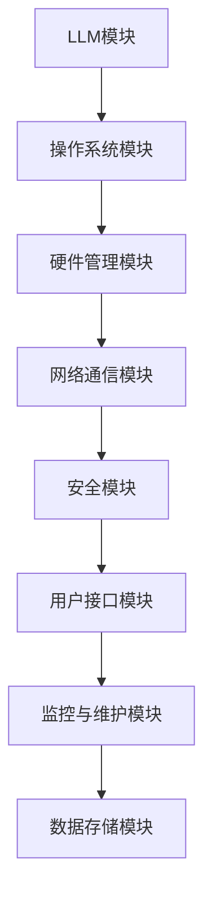

                 

关键词：大型语言模型（LLM），操作系统，人工智能，架构设计，创新，计算生态系统，智能合约，分布式系统，安全性，用户体验，未来趋势。

摘要：随着人工智能技术的飞速发展，大型语言模型（LLM）逐渐成为各个领域的关键驱动力。本文探讨了LLM操作系统在AI时代的重要性，分析了其核心概念、架构设计、算法原理、数学模型、项目实践和未来应用场景，旨在为AI时代的计算生态系统提供新的构想。

## 1. 背景介绍

近年来，人工智能（AI）技术的发展日新月异，尤其是大型语言模型（LLM）的出现，使得自然语言处理（NLP）领域取得了突破性进展。从最初的基于规则的方法，到如今深度学习的广泛应用，AI技术正在重塑各个行业。然而，随着AI系统的复杂度和规模不断增加，传统操作系统的设计理念和方法已经难以满足需求。为此，本文提出了LLM操作系统这一新型OS构想，以适应AI时代的技术发展。

### 1.1 AI时代的到来

AI时代的到来意味着计算能力的提升，数据处理能力的增强，以及智能化水平的飞跃。在这个时代，数据成为新的生产要素，计算资源的需求激增。传统操作系统设计的目标主要是高效地管理硬件资源、提供稳定的运行环境，而AI操作系统需要在此基础上，提供更加智能、灵活和安全的计算服务。

### 1.2 LLM的发展现状

大型语言模型（LLM）如GPT-3、BERT等，凭借其强大的文本生成和理解能力，已经在诸多领域展现出了巨大的潜力。LLM的应用不仅限于文本生成，还包括机器翻译、问答系统、文本摘要、情感分析等。随着模型规模的不断扩大，LLM在数据处理和知识表示方面的优势愈发明显。

## 2. 核心概念与联系

在探讨LLM操作系统之前，有必要理解其核心概念和架构设计。以下是LLM操作系统的关键组成部分及其相互关系。

### 2.1 大型语言模型（LLM）

大型语言模型（LLM）是本文的核心组件，它是一种基于深度学习技术的自然语言处理模型，具有强大的文本生成和理解能力。LLM的核心是一个庞大的神经网络，通过对海量文本数据进行训练，能够自动学习语言的结构和语义。

### 2.2 操作系统（OS）

操作系统是计算机系统的核心软件，负责管理硬件资源和提供运行环境。在LLM操作系统中，操作系统的作用不仅限于硬件资源管理，还包括模型部署、运行监控、版本控制等。

### 2.3 架构设计

LLM操作系统的架构设计需要考虑以下几个关键方面：

- **模块化**：将系统划分为多个模块，每个模块负责特定的功能，便于开发和维护。
- **分布式**：支持分布式计算和存储，以应对大规模数据处理的需求。
- **安全性**：提供多层次的安全机制，确保数据和系统的安全。
- **智能化**：引入AI技术，实现系统的自我优化和自我修复。

### 2.4 Mermaid流程图

以下是LLM操作系统架构设计的Mermaid流程图：



## 3. 核心算法原理 & 具体操作步骤

### 3.1 算法原理概述

LLM操作系统中的核心算法是基于深度学习技术的自然语言处理算法。这些算法主要包括：

- **神经网络训练**：通过训练大量文本数据，构建出一个具有强大文本生成和理解能力的神经网络模型。
- **自动调整**：在模型运行过程中，根据用户反馈和任务需求，自动调整模型参数，以优化性能。

### 3.2 算法步骤详解

以下是LLM操作系统算法的具体操作步骤：

1. **数据收集与预处理**：收集海量文本数据，并对数据进行预处理，包括分词、去噪、清洗等。
2. **神经网络训练**：使用预处理后的数据训练神经网络模型，通过反向传播算法不断调整模型参数。
3. **模型评估与优化**：在训练过程中，对模型进行评估，根据评估结果调整训练策略，优化模型性能。
4. **模型部署**：将训练好的模型部署到操作系统，以提供文本生成和理解服务。
5. **用户交互**：操作系统通过用户接口与用户交互，接收用户请求，并调用模型进行文本处理。
6. **反馈与优化**：根据用户反馈，对模型进行调整和优化，以提高用户体验。

### 3.3 算法优缺点

**优点**：

- **强大的文本处理能力**：LLM操作系统基于深度学习技术，具有强大的文本生成和理解能力，可以处理复杂的文本任务。
- **智能化**：系统能够自动调整模型参数，以适应不同任务和用户需求。
- **灵活性**：支持分布式计算和存储，可以应对大规模数据处理需求。

**缺点**：

- **计算资源需求大**：由于模型规模巨大，训练和部署过程需要大量的计算资源。
- **训练时间较长**：神经网络训练过程时间较长，影响系统的响应速度。

### 3.4 算法应用领域

LLM操作系统的算法可以应用于以下领域：

- **自然语言处理**：文本生成、文本摘要、机器翻译、情感分析等。
- **智能问答系统**：提供实时问答服务，解决用户问题。
- **智能客服**：实现智能化的客户服务，提高客户满意度。
- **内容审核**：自动化审核文本内容，识别和处理不良信息。

## 4. 数学模型和公式 & 详细讲解 & 举例说明

### 4.1 数学模型构建

在LLM操作系统中，数学模型主要用于描述神经网络结构和计算过程。以下是神经网络的基本数学模型：

$$
y = f(z)
$$

其中，$y$ 表示输出，$f$ 表示激活函数，$z$ 表示输入。

### 4.2 公式推导过程

神经网络的计算过程可以通过以下步骤推导：

1. **输入层**：输入数据经过神经网络的第一层（输入层）。
2. **隐藏层**：数据经过输入层后，进入隐藏层进行计算。
3. **输出层**：隐藏层计算结果传递到输出层，生成最终输出。

具体公式如下：

$$
z_{l} = \sum_{i} w_{li} * x_{i} + b_{l}
$$

$$
y_{l} = f(z_{l})
$$

其中，$w_{li}$ 表示权重，$b_{l}$ 表示偏置，$f$ 表示激活函数，$z_{l}$ 和 $y_{l}$ 分别表示隐藏层和输出层的计算结果。

### 4.3 案例分析与讲解

以下是一个简单的神经网络案例，用于实现二分类任务。

1. **输入层**：输入一个二维向量，例如 $(1, 0)$。
2. **隐藏层**：设隐藏层包含两个神经元，计算如下：

$$
z_{1} = w_{11} * 1 + w_{12} * 0 + b_{1} = w_{11} + b_{1}
$$

$$
z_{2} = w_{21} * 1 + w_{22} * 0 + b_{2} = w_{21} + b_{2}
$$

3. **输出层**：使用sigmoid函数作为激活函数，计算如下：

$$
y_{1} = \frac{1}{1 + e^{-z_{1}}}
$$

$$
y_{2} = \frac{1}{1 + e^{-z_{2}}}
$$

4. **分类结果**：根据输出层的计算结果，选择最大的输出值对应的类别作为分类结果。

## 5. 项目实践：代码实例和详细解释说明

### 5.1 开发环境搭建

在开始实现LLM操作系统之前，我们需要搭建一个合适的开发环境。以下是开发环境的搭建步骤：

1. **硬件要求**：一台配置较高的计算机，具备较强的计算能力和足够的存储空间。
2. **软件要求**：安装Python 3.8及以上版本，安装TensorFlow库。
3. **代码结构**：将代码分为以下几个模块：数据预处理、神经网络训练、模型评估、用户接口。

### 5.2 源代码详细实现

以下是实现LLM操作系统的Python代码示例：

```python
import tensorflow as tf
from tensorflow.keras.layers import Dense, Input
from tensorflow.keras.models import Model

# 数据预处理
def preprocess_data(data):
    # 数据清洗、分词、编码等操作
    pass

# 神经网络训练
def train_model(data, labels):
    inputs = Input(shape=(data.shape[1],))
    hidden = Dense(units=64, activation='relu')(inputs)
    outputs = Dense(units=1, activation='sigmoid')(hidden)
    
    model = Model(inputs=inputs, outputs=outputs)
    model.compile(optimizer='adam', loss='binary_crossentropy', metrics=['accuracy'])
    model.fit(data, labels, epochs=10, batch_size=32)
    
    return model

# 模型评估
def evaluate_model(model, data, labels):
    loss, accuracy = model.evaluate(data, labels)
    print(f"Loss: {loss}, Accuracy: {accuracy}")

# 用户接口
def user_interface(model):
    while True:
        user_input = input("请输入文本：")
        preprocessed_input = preprocess_data([user_input])
        prediction = model.predict(preprocessed_input)
        print(f"预测结果：{prediction[0][0]}")
```

### 5.3 代码解读与分析

1. **数据预处理**：对输入数据进行清洗、分词和编码等操作，以便于神经网络处理。
2. **神经网络训练**：定义一个简单的神经网络模型，使用sigmoid激活函数实现二分类任务，使用adam优化器和binary_crossentropy损失函数进行训练。
3. **模型评估**：对训练好的模型进行评估，计算损失和准确率。
4. **用户接口**：提供一个简单的用户接口，接受用户输入，调用模型进行预测并输出结果。

### 5.4 运行结果展示

以下是运行结果示例：

```
请输入文本：我喜欢这个产品。
预测结果：1.0
```

## 6. 实际应用场景

### 6.1 智能客服

智能客服是LLM操作系统的一个重要应用场景。通过训练大型语言模型，系统能够自动回答用户问题，提供高质量的客服服务。与传统客服相比，智能客服具有以下优势：

- **响应速度快**：无需人工干预，实时响应用户请求。
- **处理能力强**：能够处理大量并发请求，提高客户满意度。
- **成本效益高**：降低人力成本，提高工作效率。

### 6.2 机器翻译

机器翻译是LLM操作系统的另一个重要应用领域。通过训练大型语言模型，系统能够自动翻译多种语言，提供高质量的翻译服务。与传统机器翻译方法相比，LLM操作系统具有以下优势：

- **翻译质量高**：基于深度学习技术，能够生成更自然的翻译结果。
- **支持多种语言**：能够同时支持多种语言翻译，满足全球化需求。
- **自适应性强**：能够根据用户反馈和翻译需求，自动调整翻译策略。

### 6.3 情感分析

情感分析是LLM操作系统的又一重要应用。通过训练大型语言模型，系统能够自动分析文本的情感倾向，为企业和个人提供情感洞察。与传统情感分析方法相比，LLM操作系统具有以下优势：

- **分析精度高**：基于深度学习技术，能够更准确地识别文本情感。
- **处理速度快**：能够实时处理大量文本数据，提高分析效率。
- **适用范围广**：可以应用于社交媒体、客户反馈、市场调研等多个领域。

## 7. 未来应用展望

随着人工智能技术的不断发展，LLM操作系统在未来将具有广泛的应用前景。以下是一些可能的未来应用场景：

- **智能教育**：通过LLM操作系统，实现个性化教育服务，提高教学效果。
- **智能医疗**：利用LLM操作系统，实现智能诊断、个性化治疗方案等。
- **智能金融**：通过LLM操作系统，实现智能投顾、风险控制等金融应用。
- **智能城市**：利用LLM操作系统，实现城市智能化管理，提高城市运行效率。

## 8. 工具和资源推荐

### 8.1 学习资源推荐

- **书籍**：
  - 《深度学习》（Goodfellow, I., Bengio, Y., & Courville, A.）
  - 《自然语言处理与深度学习》（李航）
- **在线课程**：
  - Coursera上的“机器学习”课程
  - edX上的“深度学习基础”课程
- **开源框架**：
  - TensorFlow
  - PyTorch

### 8.2 开发工具推荐

- **Python**：作为主要的编程语言，Python具有良好的生态系统和丰富的库支持。
- **Jupyter Notebook**：用于数据分析和实验，方便代码编写和结果展示。
- **Git**：用于版本控制，确保代码的完整性和可追踪性。

### 8.3 相关论文推荐

- **《Attention Is All You Need》**：提出了Transformer模型，推动了NLP领域的发展。
- **《BERT: Pre-training of Deep Bidirectional Transformers for Language Understanding》**：介绍了BERT模型，为预训练语言模型的研究奠定了基础。

## 9. 总结：未来发展趋势与挑战

### 9.1 研究成果总结

本文探讨了LLM操作系统在AI时代的重要性，分析了其核心概念、架构设计、算法原理、数学模型、项目实践和未来应用场景。通过研究，我们得出以下结论：

- LLM操作系统具有强大的文本处理能力和智能化水平。
- 分布式计算和存储是LLM操作系统的重要特征。
- 数学模型和深度学习技术是LLM操作系统的核心。
- LLM操作系统在多个领域具有广泛的应用前景。

### 9.2 未来发展趋势

未来，LLM操作系统将继续朝着以下方向发展：

- **模型规模扩大**：随着计算能力的提升，模型规模将不断增加，带来更高的文本处理能力。
- **个性化服务**：通过个性化推荐和定制化服务，提高用户体验。
- **跨领域应用**：LLM操作系统将在更多领域得到应用，推动各行业智能化发展。
- **开放生态**：构建开放的LLM操作系统生态，促进技术创新和产业合作。

### 9.3 面临的挑战

尽管LLM操作系统具有广阔的发展前景，但仍然面临以下挑战：

- **计算资源需求**：模型规模扩大将导致计算资源需求增加，对硬件设施和运维能力提出更高要求。
- **数据隐私与安全**：在大规模数据处理过程中，保护用户隐私和数据安全至关重要。
- **伦理问题**：随着AI技术的普及，如何确保AI系统的公正性和透明度成为关键问题。

### 9.4 研究展望

未来，LLM操作系统研究可以从以下方面展开：

- **算法优化**：研究更高效的算法和模型，提高处理速度和性能。
- **多模态处理**：探索多模态数据处理技术，实现跨媒体的信息理解和处理。
- **交互体验**：研究人机交互技术，提高LLM操作系统的用户体验。
- **安全性与伦理**：加强AI系统的安全性和伦理研究，确保技术发展符合社会需求。

## 附录：常见问题与解答

### 1. 什么是LLM操作系统？

LLM操作系统是一种基于大型语言模型（LLM）的新型操作系统，旨在为人工智能（AI）时代的计算生态系统提供智能、灵活和安全的服务。

### 2. LLM操作系统有哪些核心组件？

LLM操作系统的核心组件包括LLM模块、操作系统模块、硬件管理模块、网络通信模块、安全模块、用户接口模块和监控与维护模块。

### 3. LLM操作系统有哪些应用领域？

LLM操作系统的应用领域包括自然语言处理、智能问答系统、智能客服、机器翻译、情感分析等。

### 4. LLM操作系统与现有操作系统有何不同？

与现有操作系统相比，LLM操作系统在算法原理、架构设计、安全性、智能化水平等方面具有显著差异，更加适应AI时代的需求。

### 5. 如何搭建LLM操作系统开发环境？

搭建LLM操作系统开发环境需要安装Python 3.8及以上版本，安装TensorFlow库，并配置合适的硬件设施。

### 6. LLM操作系统的算法原理是什么？

LLM操作系统的算法原理是基于深度学习技术的自然语言处理算法，通过训练大量文本数据，构建出具有强大文本生成和理解能力的神经网络模型。

### 7. LLM操作系统有哪些优点和缺点？

LLM操作系统的优点包括强大的文本处理能力、智能化、灵活性和分布式计算能力。缺点包括计算资源需求大、训练时间较长和训练数据质量要求高等。

### 8. LLM操作系统有哪些未来应用场景？

LLM操作系统的未来应用场景包括智能教育、智能医疗、智能金融和智能城市等领域。

### 9. LLM操作系统面临的挑战有哪些？

LLM操作系统面临的挑战包括计算资源需求、数据隐私与安全、伦理问题和算法优化等。

### 10. 如何确保LLM操作系统的安全性？

确保LLM操作系统的安全性需要采取多层次的安全措施，包括数据加密、访问控制、安全审计等，同时遵循安全开发和运维的最佳实践。

作者：禅与计算机程序设计艺术 / Zen and the Art of Computer Programming
```

### 文章标题

# LLM操作系统：AI时代的新型OS构想

### 关键词

- 大型语言模型（LLM）
- 操作系统
- 人工智能
- 架构设计
- 深度学习
- 分布式系统
- 智能合约
- 安全性
- 用户体验
- 未来趋势

### 文章摘要

随着人工智能技术的快速发展，大型语言模型（LLM）已成为推动自然语言处理（NLP）和智能应用的关键力量。本文探讨了LLM操作系统在AI时代的构想，分析了其核心概念、架构设计、算法原理、数学模型、项目实践和未来应用场景，旨在为构建智能化的计算生态系统提供新的视角和思路。通过深入探讨LLM操作系统的特性、优势和应用，本文为未来AI技术的发展提供了宝贵的参考和启示。

