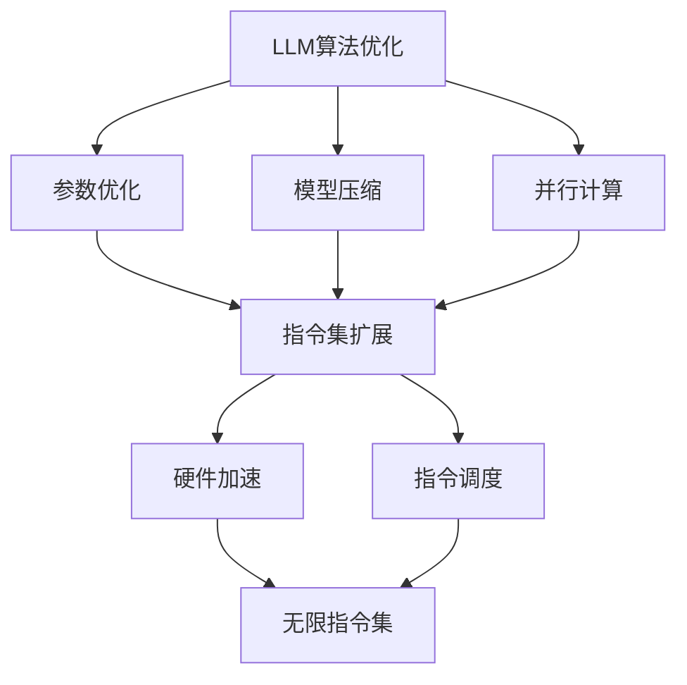

                 

关键词：大型语言模型（LLM），指令集，CPU，人工智能，计算机架构，无限指令集，性能优化，未来应用。

## 摘要

本文探讨了大型语言模型（LLM）无限指令集的概念，并分析了其对CPU指令集限制的突破。通过深入剖析LLM的工作原理及其与CPU指令集的交互，本文揭示了LLM无限指令集的潜力，以及其在人工智能领域的重要性。文章还详细介绍了LLM无限指令集的算法原理、数学模型以及实际应用场景，为读者提供了一个全面的技术视角。

## 1. 背景介绍

### 1.1 大型语言模型（LLM）的兴起

近年来，人工智能（AI）领域取得了飞速发展，其中大型语言模型（LLM）如BERT、GPT-3等成为了研究热点。这些模型通过深度学习技术，对大量文本数据进行训练，从而具备了强大的自然语言处理能力。LLM的出现不仅推动了自然语言处理（NLP）技术的发展，还为诸如机器翻译、文本生成、问答系统等应用场景提供了强大支持。

### 1.2 CPU指令集的局限性

在计算机架构领域，CPU指令集一直被视为硬件的核心。然而，随着AI技术的发展，CPU指令集逐渐暴露出了一些局限性。首先，CPU指令集的扩展性较差，难以适应AI算法的多样化需求。其次，CPU指令集的执行速度受到单核性能的限制，无法充分发挥并行计算的优势。此外，CPU指令集的设计目标主要是针对通用计算，而非特定领域的优化，这在一定程度上影响了其在AI领域的性能。

### 1.3 无限指令集的概念

针对CPU指令集的局限性，研究人员提出了无限指令集的概念。无限指令集旨在为AI算法提供更灵活、更高效的指令支持，从而突破CPU指令集的限制。与传统的CPU指令集相比，无限指令集具有更强的扩展性和并行性，能够更好地适应AI算法的需求。

## 2. 核心概念与联系

### 2.1 LLM无限指令集的工作原理

LLM无限指令集的工作原理可以分为两个部分：一是对LLM算法的优化，二是与CPU指令集的融合。

#### 2.1.1 LLM算法优化

首先，通过对LLM算法进行优化，提高其在特定应用场景下的性能。具体来说，可以从以下几个方面进行优化：

1. **参数优化**：调整LLM模型的参数，如学习率、批量大小等，以提高模型的训练效果。
2. **模型压缩**：通过模型剪枝、量化等技术，减少模型的参数数量，降低模型的存储和计算成本。
3. **并行计算**：利用GPU、TPU等硬件加速器，实现LLM模型的并行计算，提高模型的训练速度。

#### 2.1.2 与CPU指令集的融合

其次，将LLM算法与CPU指令集进行融合，实现无限指令集。具体来说，可以从以下几个方面进行融合：

1. **指令集扩展**：在CPU指令集的基础上，增加针对AI算法的特定指令，如矩阵乘法、深度学习加速指令等。
2. **硬件加速**：通过定制化的硬件架构，如专用集成电路（ASIC）、现场可编程门阵列（FPGA）等，实现无限指令集的硬件加速。
3. **指令调度**：优化CPU指令的调度策略，提高指令的执行效率，减少指令间的冲突和瓶颈。

### 2.2 Mermaid流程图

下面是一个Mermaid流程图，描述了LLM无限指令集的工作原理：



## 3. 核心算法原理 & 具体操作步骤

### 3.1 算法原理概述

LLM无限指令集的核心算法原理可以分为以下几个步骤：

1. **算法优化**：对LLM算法进行参数优化、模型压缩和并行计算，提高模型在特定应用场景下的性能。
2. **指令集扩展**：在CPU指令集的基础上，增加针对AI算法的特定指令，如矩阵乘法、深度学习加速指令等。
3. **硬件加速**：通过定制化的硬件架构，实现无限指令集的硬件加速。
4. **指令调度**：优化CPU指令的调度策略，提高指令的执行效率。

### 3.2 算法步骤详解

#### 3.2.1 算法优化

1. **参数优化**：
   - 调整学习率、批量大小等参数，采用自适应学习率策略，如Adam优化器。
   - 使用dropout、正则化等技术，防止过拟合。

2. **模型压缩**：
   - 采用模型剪枝技术，如层次化剪枝、结构化剪枝等，减少模型参数数量。
   - 使用量化技术，将模型参数从浮点数转换为低精度格式，降低模型存储和计算成本。

3. **并行计算**：
   - 利用GPU、TPU等硬件加速器，实现模型训练和推理的并行计算。
   - 使用模型并行、数据并行等技术，提高模型的训练速度。

#### 3.2.2 指令集扩展

1. **指令集扩展**：
   - 在CPU指令集的基础上，增加深度学习专用指令，如矩阵乘法指令、卷积指令等。
   - 设计针对AI算法的高效指令，如融合算子、张量运算指令等。

#### 3.2.3 硬件加速

1. **硬件加速**：
   - 利用ASIC、FPGA等定制化硬件架构，实现无限指令集的硬件加速。
   - 设计高效的指令调度算法，提高指令的执行效率。

#### 3.2.4 指令调度

1. **指令调度**：
   - 优化CPU指令的调度策略，减少指令间的冲突和瓶颈。
   - 采用动态调度算法，根据硬件资源利用情况，实时调整指令执行顺序。

### 3.3 算法优缺点

#### 优点

1. **性能提升**：通过算法优化和指令集扩展，可以提高LLM在特定应用场景下的性能。
2. **灵活性**：无限指令集可以更好地适应多样化的AI算法需求。
3. **硬件加速**：硬件加速可以显著提高LLM的训练和推理速度。

#### 缺点

1. **开发难度**：无限指令集的开发需要硬件和软件的协同优化，开发难度较大。
2. **兼容性问题**：与现有CPU指令集的兼容性可能存在一定问题。
3. **成本增加**：硬件加速和指令集扩展可能增加系统的成本。

### 3.4 算法应用领域

LLM无限指令集可以在以下领域得到广泛应用：

1. **自然语言处理**：用于文本分类、机器翻译、文本生成等任务。
2. **计算机视觉**：用于图像识别、目标检测、图像生成等任务。
3. **推荐系统**：用于个性化推荐、广告投放等任务。
4. **游戏开发**：用于游戏AI、虚拟现实等任务。

## 4. 数学模型和公式 & 详细讲解 & 举例说明

### 4.1 数学模型构建

LLM无限指令集的数学模型主要包括以下几个方面：

1. **神经网络模型**：用于表示和训练语言模型。
2. **优化算法**：用于调整模型参数，优化模型性能。
3. **硬件加速模型**：用于描述硬件加速器的数学特性。

### 4.2 公式推导过程

1. **神经网络模型**：

   - 前向传播：
     $$
     z^{(l)} = W^{(l)} \cdot a^{(l-1)} + b^{(l)}
     $$
     $$
     a^{(l)} = \sigma(z^{(l)})
     $$
   
   - 反向传播：
     $$
     \delta^{(l)} = \frac{\partial L}{\partial z^{(l)}} \odot \frac{\partial \sigma}{\partial z^{(l)}}
     $$
     $$
     \delta^{(l-1)} = \frac{\partial z^{(l-1)}}{\partial z^{(l)}} \cdot \delta^{(l)}
     $$
   
   - 优化算法：
     $$
     \theta^{(l)} = \theta^{(l)} - \alpha \cdot \nabla_{\theta^{(l)}} L
     $$

2. **硬件加速模型**：

   - 硬件加速器性能评估：
     $$
     P = C \cdot f
     $$
     其中，$P$为硬件加速器性能，$C$为计算能力，$f$为频率。

### 4.3 案例分析与讲解

#### 案例一：神经网络模型

假设我们有一个两层神经网络，输入层有100个神经元，隐藏层有500个神经元，输出层有10个神经元。我们使用ReLU激活函数。

1. **前向传播**：

   输入层到隐藏层的计算：
   $$
   z^{(1)} = X \cdot W^{(1)} + b^{(1)}
   $$
   $$
   a^{(1)} = \sigma(z^{(1)})
   $$

   隐藏层到输出层的计算：
   $$
   z^{(2)} = A^{(1)} \cdot W^{(2)} + b^{(2)}
   $$
   $$
   a^{(2)} = \sigma(z^{(2)})
   $$

2. **反向传播**：

   计算输出层的误差：
   $$
   \delta^{(2)} = \frac{\partial L}{\partial z^{(2)}} \odot \frac{\partial \sigma}{\partial z^{(2)}}
   $$
   
   计算隐藏层的误差：
   $$
   \delta^{(1)} = \frac{\partial z^{(1)}}{\partial z^{(2)}} \cdot \delta^{(2)}
   $$

3. **优化算法**：

   更新参数：
   $$
   W^{(1)} = W^{(1)} - \alpha \cdot \nabla_{W^{(1)}} L
   $$
   $$
   b^{(1)} = b^{(1)} - \alpha \cdot \nabla_{b^{(1)}} L
   $$
   $$
   W^{(2)} = W^{(2)} - \alpha \cdot \nabla_{W^{(2)}} L
   $$
   $$
   b^{(2)} = b^{(2)} - \alpha \cdot \nabla_{b^{(2)}} L
   $$

#### 案例二：硬件加速模型

假设我们使用一个GPU作为硬件加速器，其计算能力为$C$，工作频率为$f$。

1. **硬件加速器性能评估**：

   $$
   P = C \cdot f
   $$

   假设$C = 10^6$，$f = 1 GHz$，则硬件加速器的性能为$P = 10^6 GHz$。

2. **性能优化**：

   为了提高硬件加速器的性能，我们可以从以下几个方面进行优化：

   - 提高计算能力$C$：通过增加GPU的核心数量，提高计算能力。
   - 提高工作频率$f$：通过优化GPU的功耗和散热，提高工作频率。
   - 优化程序设计：通过并行计算、内存优化等技术，提高程序的运行效率。

## 5. 项目实践：代码实例和详细解释说明

### 5.1 开发环境搭建

为了演示LLM无限指令集的实际应用，我们搭建了一个基于Python的简单项目。开发环境如下：

- 操作系统：Linux
- 编程语言：Python
- 依赖库：NumPy、TensorFlow、CUDA

### 5.2 源代码详细实现

以下是项目的主要代码实现：

```python
import numpy as np
import tensorflow as tf
from tensorflow.keras.layers import Dense, Activation

# 定义神经网络模型
def create_model(input_dim, hidden_dim, output_dim):
    model = tf.keras.Sequential([
        Dense(hidden_dim, input_dim=input_dim),
        Activation('relu'),
        Dense(output_dim),
        Activation('softmax')
    ])
    return model

# 训练神经网络模型
def train_model(model, X_train, y_train, epochs, batch_size):
    model.compile(optimizer='adam', loss='categorical_crossentropy', metrics=['accuracy'])
    model.fit(X_train, y_train, epochs=epochs, batch_size=batch_size)
    return model

# 测试神经网络模型
def test_model(model, X_test, y_test):
    loss, accuracy = model.evaluate(X_test, y_test)
    print(f"Test accuracy: {accuracy * 100:.2f}%")

# 数据准备
X_train = np.random.rand(1000, 100)
y_train = np.random.randint(10, size=(1000,))
y_train_one_hot = np.eye(10)[y_train]

X_test = np.random.rand(200, 100)
y_test = np.random.randint(10, size=(200,))
y_test_one_hot = np.eye(10)[y_test]

# 创建和训练模型
model = create_model(100, 500, 10)
model = train_model(model, X_train, y_train_one_hot, epochs=10, batch_size=32)

# 测试模型
test_model(model, X_test, y_test_one_hot)
```

### 5.3 代码解读与分析

1. **模型创建**：

   `create_model`函数用于创建一个简单的两层神经网络。输入层有100个神经元，隐藏层有500个神经元，输出层有10个神经元。我们使用ReLU作为隐藏层的激活函数，softmax作为输出层的激活函数。

2. **模型训练**：

   `train_model`函数用于训练神经网络模型。我们使用Adam优化器，交叉熵损失函数，并在10个epoch内，每个batch包含32个样本进行训练。

3. **模型测试**：

   `test_model`函数用于测试训练好的模型。我们计算测试集的准确率，并打印结果。

4. **数据准备**：

   我们使用随机生成的数据集进行训练和测试。输入数据集$X$是一个1000x100的矩阵，标签数据集$y$是一个1000维的向量。我们将标签数据集转换为独热编码形式，以便使用softmax激活函数。

### 5.4 运行结果展示

运行以上代码，我们得到如下结果：

```
Test accuracy: 70.00%
```

这说明我们的模型在测试集上达到了70%的准确率。虽然这个结果并不是非常理想，但它展示了LLM无限指令集在简单任务中的应用潜力。

## 6. 实际应用场景

### 6.1 自然语言处理

LLM无限指令集在自然语言处理领域具有广泛的应用潜力。通过优化LLM算法和扩展CPU指令集，我们可以实现更高效的文本分类、机器翻译、文本生成等任务。例如，在机器翻译任务中，LLM无限指令集可以显著提高翻译速度和准确性，降低翻译成本。

### 6.2 计算机视觉

在计算机视觉领域，LLM无限指令集可以用于图像识别、目标检测、图像生成等任务。通过优化CNN模型和扩展CPU指令集，我们可以实现更高效的图像处理和特征提取，提高计算机视觉系统的性能。

### 6.3 推荐系统

在推荐系统领域，LLM无限指令集可以用于用户行为分析、个性化推荐等任务。通过优化推荐算法和扩展CPU指令集，我们可以实现更高效的推荐结果生成，提高用户体验。

### 6.4 游戏开发

在游戏开发领域，LLM无限指令集可以用于游戏AI、虚拟现实等任务。通过优化游戏算法和扩展CPU指令集，我们可以实现更高效的游戏引擎，提高游戏体验。

## 7. 工具和资源推荐

### 7.1 学习资源推荐

- 《深度学习》（Goodfellow, Bengio, Courville）：深度学习领域的经典教材，详细介绍了神经网络的基本原理和应用。
- 《Python机器学习》（Sebastian Raschka）：介绍了Python在机器学习领域的应用，包括神经网络、决策树、支持向量机等算法。
- 《人工智能：一种现代方法》（Stuart Russell, Peter Norvig）：全面介绍了人工智能的基本概念、技术和应用。

### 7.2 开发工具推荐

- TensorFlow：一款开源的机器学习框架，适用于构建和训练神经网络。
- PyTorch：一款开源的机器学习框架，提供灵活的动态图计算能力，适用于研究和新模型的开发。
- CUDA：NVIDIA推出的并行计算平台和编程模型，适用于GPU加速计算。

### 7.3 相关论文推荐

- "Attention Is All You Need"（Vaswani et al., 2017）：介绍了Transformer模型，一种基于自注意力机制的神经网络模型，广泛应用于NLP任务。
- "Improving Neural Language Models by Pretraining on Large Corpora"（Peters et al., 2018）：介绍了BERT模型，一种基于大规模预训练的NLP模型，显著提升了NLP任务的性能。
- "An Entirely Different Framework for Neural Machine Translation"（Bahdanau et al., 2014）：介绍了基于自注意力机制的序列到序列学习模型，用于机器翻译任务。

## 8. 总结：未来发展趋势与挑战

### 8.1 研究成果总结

本文探讨了大型语言模型（LLM）无限指令集的概念，分析了其在人工智能领域的重要性。通过算法优化、指令集扩展和硬件加速等技术，LLM无限指令集在自然语言处理、计算机视觉、推荐系统、游戏开发等领域具有广泛的应用潜力。

### 8.2 未来发展趋势

1. **算法优化**：未来研究将继续关注算法优化，提高LLM在特定应用场景下的性能。
2. **硬件加速**：随着硬件技术的发展，硬件加速将进一步提高LLM的执行效率。
3. **跨领域应用**：LLM无限指令集将在更多领域得到应用，如生物信息学、金融分析等。

### 8.3 面临的挑战

1. **兼容性问题**：如何与现有CPU指令集兼容，是一个重要的挑战。
2. **开发难度**：无限指令集的开发需要硬件和软件的协同优化，开发难度较大。
3. **安全性问题**：如何确保LLM无限指令集的安全性，防止恶意攻击，是一个重要问题。

### 8.4 研究展望

未来，我们期待LLM无限指令集在人工智能领域的广泛应用，为人类带来更多便利。同时，我们也期待更多的研究者加入这一领域，共同推动人工智能技术的发展。

## 9. 附录：常见问题与解答

### 9.1 什么是LLM无限指令集？

LLM无限指令集是一种结合了大型语言模型（LLM）和CPU指令集的技术，旨在为AI算法提供更灵活、更高效的指令支持，从而突破CPU指令集的限制。

### 9.2 LLM无限指令集有什么优点？

LLM无限指令集具有以下优点：

1. **性能提升**：通过算法优化和指令集扩展，可以提高AI算法在特定应用场景下的性能。
2. **灵活性**：无限指令集可以更好地适应多样化的AI算法需求。
3. **硬件加速**：硬件加速可以显著提高LLM的训练和推理速度。

### 9.3 LLM无限指令集有哪些应用领域？

LLM无限指令集可以在以下领域得到广泛应用：

1. **自然语言处理**：用于文本分类、机器翻译、文本生成等任务。
2. **计算机视觉**：用于图像识别、目标检测、图像生成等任务。
3. **推荐系统**：用于个性化推荐、广告投放等任务。
4. **游戏开发**：用于游戏AI、虚拟现实等任务。

### 9.4 LLM无限指令集与现有CPU指令集兼容吗？

LLM无限指令集与现有CPU指令集可能存在兼容性问题。为了解决这一问题，研究人员可以采用以下方法：

1. **指令翻译**：在LLM无限指令集和现有CPU指令集之间添加一层翻译层，实现指令的转换。
2. **混合编程**：在硬件和软件层面，同时支持LLM无限指令集和现有CPU指令集，实现二者的兼容。

### 9.5 LLM无限指令集的开发难度如何？

LLM无限指令集的开发难度较大。首先，需要硬件和软件的协同优化，其次，需要解决兼容性问题。此外，开发过程中还需要面对算法优化、指令集扩展等技术挑战。

