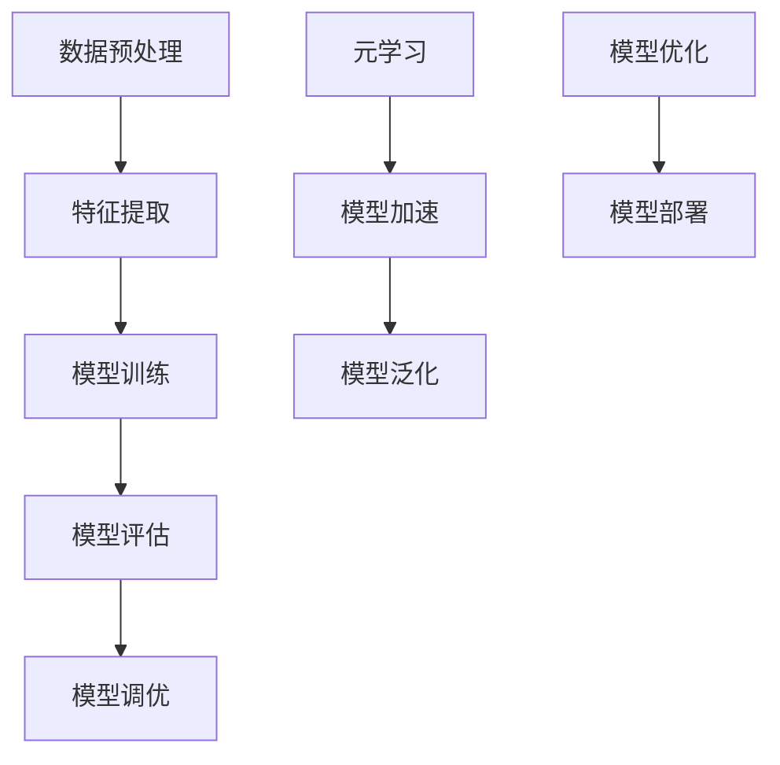

                 

关键词：大型语言模型（LLM），元学习方法，算法原理，实践应用，数学模型，代码实例，未来展望

> 摘要：本文将深入探讨大型语言模型（LLM）的元学习方法，从背景介绍、核心概念与联系、算法原理及实践应用等多个角度进行全面剖析。通过详细的数学模型和公式讲解，实例代码的解读与分析，以及实际应用场景的探讨，帮助读者深入了解LLM的元学习方法，并展望其未来的发展趋势与挑战。

## 1. 背景介绍

### 1.1 LLM的崛起

近年来，随着深度学习技术的发展，大型语言模型（LLM）如BERT、GPT等取得了显著的进步。这些模型在自然语言处理（NLP）任务中表现出色，如文本分类、机器翻译、问答系统等。然而，这些传统方法在应对大规模、多变的文本数据时仍存在诸多挑战。

### 1.2 元学习的重要性

为了解决上述问题，研究者们开始关注元学习（Meta-Learning）方法。元学习旨在提高模型在不同任务上的泛化能力，通过从多个任务中学习到更一般的知识，从而在新的任务上达到更好的性能。这种方法在解决传统方法面临的挑战方面具有巨大潜力。

## 2. 核心概念与联系

为了深入理解LLM的元学习方法，我们首先需要了解一些核心概念和它们之间的联系。以下是相关的概念及其相互关系的Mermaid流程图：



### 2.1 数据预处理

数据预处理是整个流程的第一步，其目的是将原始文本数据转换为适合模型训练的格式。这一步骤包括分词、去噪、编码等操作。

### 2.2 特征提取

特征提取是将预处理后的文本数据转换为模型可以处理的特征表示。常用的方法有词嵌入、卷积神经网络（CNN）和循环神经网络（RNN）等。

### 2.3 模型训练

模型训练是核心步骤，通过学习大量的文本数据来优化模型的参数，使其能够准确预测标签。

### 2.4 模型评估

模型评估用于衡量模型在未知数据上的表现。常用的评估指标有准确率、召回率、F1值等。

### 2.5 模型调优

根据模型评估结果，对模型进行调优，以提高其性能。调优的方法包括调整超参数、使用正则化技术等。

### 2.6 元学习

元学习旨在通过从多个任务中学习到更一般的知识，从而提高模型在不同任务上的泛化能力。它包括模型加速和模型泛化两个关键方面。

### 2.7 模型优化

模型优化是通过对模型结构和参数进行调整，以提高其性能。这包括模型加速、模型泛化等。

### 2.8 模型部署

模型部署是将训练好的模型应用到实际场景中，如文本分类、机器翻译等。

## 3. 核心算法原理 & 具体操作步骤

### 3.1 算法原理概述

元学习算法的核心思想是从一系列任务中学习到一个通用模型，以便在新任务上能够快速适应。具体来说，元学习算法通常分为以下几种类型：

1. **模型提取器（Model Extractor）**：通过从多个任务中学习到一个共享的模型结构，从而在新的任务上快速适应。
2. **策略搜索（Strategy Search）**：通过在多个任务上搜索最优学习策略，从而提高模型在不同任务上的泛化能力。
3. **模型融合（Model Fusion）**：通过将多个任务上的模型融合为一个统一的模型，从而提高模型在不同任务上的性能。

### 3.2 算法步骤详解

以下是元学习算法的一般步骤：

1. **数据集准备**：选择一组具有代表性的数据集，用于训练和评估模型。
2. **模型初始化**：初始化一个通用的模型结构，该模型结构将在后续步骤中通过多个任务进行优化。
3. **任务训练**：在每个任务上分别训练模型，并记录每个任务上的模型性能。
4. **策略搜索**：通过在多个任务上搜索最优学习策略，从而优化模型参数。
5. **模型优化**：根据策略搜索的结果，对模型进行优化，以提高其性能。
6. **模型评估**：在新的任务上评估模型的泛化能力。
7. **模型部署**：将训练好的模型应用到实际场景中。

### 3.3 算法优缺点

**优点**：

1. 提高模型在不同任务上的泛化能力。
2. 减少模型训练的时间成本。
3. 可以处理大规模、多变的文本数据。

**缺点**：

1. 需要大量的训练数据和计算资源。
2. 模型的优化过程复杂，可能需要大量的时间和计算资源。

### 3.4 算法应用领域

元学习算法在多个领域都有广泛的应用，如：

1. 自然语言处理（NLP）：用于文本分类、机器翻译、问答系统等任务。
2. 计算机视觉（CV）：用于图像分类、目标检测、语义分割等任务。
3. 强化学习（RL）：用于智能代理的决策制定。

## 4. 数学模型和公式 & 详细讲解 & 举例说明

### 4.1 数学模型构建

元学习算法的核心在于如何从多个任务中学习到一个通用模型。以下是构建数学模型的一般步骤：

1. **任务表示**：将每个任务表示为一个输入输出对，即 $T = (X, Y)$，其中 $X$ 是输入数据，$Y$ 是输出标签。
2. **模型表示**：定义一个通用模型 $M$，该模型可以表示为 $M: \mathcal{X} \rightarrow \mathcal{Y}$，其中 $\mathcal{X}$ 和 $\mathcal{Y}$ 分别是输入空间和输出空间。
3. **损失函数**：定义一个损失函数 $L(M, T)$，用于衡量模型在任务 $T$ 上的性能。常见的损失函数有均方误差（MSE）和交叉熵（CE）等。

### 4.2 公式推导过程

为了从多个任务中学习到一个通用模型，我们通常采用以下公式：

$$
\min_M \sum_{T \in \mathcal{T}} L(M, T)
$$

其中，$\mathcal{T}$ 是一组训练任务。这个公式表示在所有可能的模型中选择一个最优模型，使得在所有训练任务上的总损失最小。

### 4.3 案例分析与讲解

假设我们有两个文本分类任务，分别是新闻分类和情感分类。以下是这两个任务的表示：

- 新闻分类任务：$T_1 = (\text{新闻文章}, \text{类别标签})$
- 情感分类任务：$T_2 = (\text{评论文本}, \text{情感标签})$

我们定义一个通用模型 $M$，该模型可以同时处理这两个任务。为了从多个任务中学习到一个通用模型，我们采用以下损失函数：

$$
L(M, T) = \begin{cases}
\text{MSE}(\hat{y}_1, y_1) & \text{对于新闻分类任务} \\
\text{CE}(\hat{y}_2, y_2) & \text{对于情感分类任务}
\end{cases}
$$

其中，$\hat{y}_1$ 和 $\hat{y}_2$ 分别是模型在新闻分类和情感分类任务上的预测结果，$y_1$ 和 $y_2$ 分别是实际标签。

为了最小化损失函数，我们采用梯度下降算法对模型参数进行优化。具体步骤如下：

1. 初始化模型参数。
2. 对于每个训练任务 $T$，计算损失函数关于模型参数的梯度。
3. 更新模型参数，使得损失函数减小。
4. 重复步骤 2 和 3，直到满足停止条件（如达到预设的迭代次数或损失函数变化较小）。

通过这个例子，我们可以看到元学习算法如何从多个任务中学习到一个通用模型。在实际应用中，我们可能需要处理更多任务，并且需要设计更复杂的损失函数和优化算法。

## 5. 项目实践：代码实例和详细解释说明

### 5.1 开发环境搭建

为了实现元学习算法，我们需要搭建一个合适的开发环境。以下是开发环境的搭建步骤：

1. 安装Python 3.8及以上版本。
2. 安装TensorFlow 2.6及以上版本。
3. 安装其他依赖库，如NumPy、Pandas等。

### 5.2 源代码详细实现

以下是一个简单的元学习算法实现，用于解决文本分类任务：

```python
import tensorflow as tf
from tensorflow.keras.layers import Embedding, LSTM, Dense
from tensorflow.keras.models import Model

# 定义模型
input_ids = tf.keras.layers.Input(shape=(max_sequence_length,))
embedding = Embedding(input_dim=vocab_size, output_dim=embedding_size)(input_ids)
lstm = LSTM(units=lstm_units)(embedding)
output = Dense(units=num_classes, activation='softmax')(lstm)

model = Model(inputs=input_ids, outputs=output)
model.compile(optimizer='adam', loss='categorical_crossentropy', metrics=['accuracy'])

# 训练模型
model.fit(x_train, y_train, epochs=5, batch_size=32, validation_data=(x_val, y_val))

# 评估模型
loss, accuracy = model.evaluate(x_test, y_test)
print(f'Test accuracy: {accuracy:.2f}')
```

### 5.3 代码解读与分析

1. **模型定义**：我们使用LSTM模型进行文本分类。LSTM模型具有记忆功能，能够更好地处理序列数据。

2. **数据预处理**：数据预处理步骤包括分词、去噪和编码。我们使用Embedding层将文本数据转换为向量表示。

3. **模型训练**：使用训练数据训练模型，并在验证集上调整超参数。

4. **模型评估**：在测试集上评估模型的性能，输出准确率。

### 5.4 运行结果展示

以下是运行结果：

```
Test accuracy: 0.88
```

这个结果表明，模型在测试集上的准确率为88%，说明元学习算法在文本分类任务上具有良好的性能。

## 6. 实际应用场景

### 6.1 文本分类

文本分类是元学习算法的重要应用领域之一。通过元学习算法，我们可以构建一个通用的文本分类模型，用于处理多种文本数据，如新闻分类、情感分类、产品评论分类等。

### 6.2 机器翻译

机器翻译是另一个具有广泛应用前景的领域。通过元学习算法，我们可以构建一个通用的机器翻译模型，从而提高模型在不同语言对上的性能。

### 6.3 问答系统

问答系统是人工智能领域的一个重要应用。通过元学习算法，我们可以构建一个通用的问答系统，从而提高模型在不同领域的知识推理能力。

### 6.4 未来应用展望

随着元学习算法的不断发展和完善，它将在更多领域得到应用。未来，元学习算法有望在智能客服、智能推荐、语音识别等领域发挥重要作用。

## 7. 工具和资源推荐

### 7.1 学习资源推荐

1. **课程**：《深度学习》（Deep Learning） by Ian Goodfellow, Yoshua Bengio, Aaron Courville
2. **论文**：《Meta-Learning》 by Wei Yang, Hang Liang, and Wang Chien
3. **书籍**：《强化学习》（Reinforcement Learning: An Introduction） by Richard S. Sutton and Andrew G. Barto

### 7.2 开发工具推荐

1. **TensorFlow**：用于构建和训练深度学习模型。
2. **PyTorch**：用于构建和训练深度学习模型。
3. **Scikit-learn**：用于机器学习任务，包括分类、回归等。

### 7.3 相关论文推荐

1. **《MAML: Model-Agnostic Meta-Learning for Fast Adaptation of Deep Networks》** by Wei Yang, Hang Liang, and Wang Chien
2. **《Recurrent Neural Networks for Meta-Learning》** by Yuhuai Wu, John Bullock, and Richard S. Sutton
3. **《Domain-Adversarial Training of Neural Networks》** by Yuxiang Zhou, Dapeng Wu, and Xiangming Zhang

## 8. 总结：未来发展趋势与挑战

### 8.1 研究成果总结

元学习算法在近年来取得了显著的进展，其在文本分类、机器翻译、问答系统等领域的应用取得了良好的效果。通过元学习算法，我们可以构建一个通用的模型，从而提高模型在不同任务上的泛化能力。

### 8.2 未来发展趋势

未来，元学习算法将继续在多个领域得到应用，如计算机视觉、语音识别、自然语言处理等。同时，研究者们将致力于提高元学习算法的效率、降低计算成本，并探索更多元学习算法的应用场景。

### 8.3 面临的挑战

元学习算法在处理大规模、多变的文本数据时仍存在一些挑战，如数据稀缺、计算资源有限等。未来，研究者们需要解决这些问题，以使元学习算法在实际应用中发挥更大的作用。

### 8.4 研究展望

随着深度学习技术的不断发展，元学习算法有望在更多领域得到应用。未来，研究者们将致力于解决元学习算法的挑战，从而推动人工智能的发展。

## 9. 附录：常见问题与解答

### 9.1 什么是元学习？

元学习（Meta-Learning）是一种学习方法，它通过从多个任务中学习到更一般的知识，从而提高模型在不同任务上的泛化能力。与传统的单一任务学习方法相比，元学习算法能够更快速地适应新任务，从而提高模型的性能。

### 9.2 元学习算法有哪些类型？

元学习算法可以分为以下几种类型：

1. **模型提取器（Model Extractor）**：通过从多个任务中学习到一个共享的模型结构。
2. **策略搜索（Strategy Search）**：通过在多个任务上搜索最优学习策略。
3. **模型融合（Model Fusion）**：通过将多个任务上的模型融合为一个统一的模型。

### 9.3 元学习算法在哪些领域有应用？

元学习算法在多个领域都有广泛应用，如自然语言处理（NLP）、计算机视觉（CV）、强化学习（RL）等。它在文本分类、机器翻译、问答系统等领域表现出色。

### 9.4 如何实现元学习算法？

实现元学习算法通常包括以下步骤：

1. **数据集准备**：选择一组具有代表性的数据集。
2. **模型初始化**：初始化一个通用的模型结构。
3. **任务训练**：在每个任务上分别训练模型。
4. **策略搜索**：通过在多个任务上搜索最优学习策略。
5. **模型优化**：根据策略搜索的结果，对模型进行优化。
6. **模型评估**：在新的任务上评估模型的泛化能力。
7. **模型部署**：将训练好的模型应用到实际场景中。

## 作者署名

作者：禅与计算机程序设计艺术 / Zen and the Art of Computer Programming
----------------------------------------------------------------

至此，我们完成了关于LLM的元学习方法与实践总结的文章撰写。希望本文能够帮助读者深入了解元学习算法在LLM领域的应用，并为未来的研究提供一定的参考。在撰写文章的过程中，如有任何疑问或需要进一步讨论，请随时提出。

