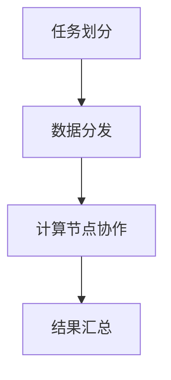

                 

关键词：大型语言模型，分布式推理，机器学习，自然语言处理，算法原理，数学模型，项目实践

## 摘要

本文旨在探讨大型语言模型（LLM）的分布式推理方法，介绍其核心概念、算法原理、数学模型以及实际应用。通过对分布式推理在LLM中的重要性进行分析，我们详细阐述了分布式推理的具体操作步骤，并讨论了其优缺点。此外，本文还通过项目实践，展示了如何实现LLM的分布式推理，并提供相关代码实例和解读。最后，我们探讨了分布式推理在LLM领域的未来应用前景，并提出了可能面临的挑战和研究方向。

## 1. 背景介绍

### 1.1 大型语言模型的发展

随着自然语言处理（NLP）技术的不断进步，大型语言模型（LLM）在近年来取得了显著的突破。LLM是一种基于深度学习的技术，通过大规模数据训练，使其在生成文本、翻译、问答等任务上表现出色。然而，随着模型的规模和复杂性不断增加，单机训练和推理速度逐渐成为瓶颈。

### 1.2 分布式推理的需求

分布式推理是解决LLM训练和推理速度瓶颈的一种有效方法。通过将计算任务分布在多个计算节点上，可以有效提高模型训练和推理的速度。此外，分布式推理还可以提高系统的可扩展性，适应更大规模的模型训练和推理需求。

## 2. 核心概念与联系

### 2.1 分布式系统

分布式系统是由多个计算节点组成的系统，这些节点通过网络进行通信，协同完成计算任务。分布式系统具有高可用性、可扩展性和容错性等特点，能够满足大规模数据处理的需求。

### 2.2 分布式推理

分布式推理是将LLM的推理任务分布到多个计算节点上，通过并行计算提高推理速度。分布式推理包括任务划分、数据分发、计算节点协作等多个方面。

### 2.3 Mermaid 流程图

以下是分布式推理的Mermaid流程图：



## 3. 核心算法原理 & 具体操作步骤

### 3.1 算法原理概述

分布式推理的核心思想是将LLM的推理任务划分为多个子任务，分别分配给不同的计算节点进行并行计算。然后，将各个计算节点的结果汇总，得到最终的推理结果。

### 3.2 算法步骤详解

1. **任务划分**：将输入的文本或数据划分为多个子任务，每个子任务对应一个计算节点。

2. **数据分发**：将划分好的子任务及其对应的数据分发给各个计算节点。

3. **计算节点协作**：各个计算节点根据收到的子任务和数据，进行模型推理，并将中间结果存储到分布式存储系统中。

4. **结果汇总**：在所有计算节点完成推理后，将各个节点的中间结果汇总，得到最终的推理结果。

### 3.3 算法优缺点

**优点**：

- 提高推理速度：通过并行计算，分布式推理可以显著提高LLM的推理速度。

- 可扩展性：分布式推理系统可以根据需求动态调整计算节点数量，适应更大规模的模型训练和推理需求。

**缺点**：

- 网络开销：分布式推理需要通过网络进行数据传输和节点通信，可能引入额外的网络开销。

- 节点依赖性：分布式推理系统的稳定性受到各个计算节点的影响，任何一个节点的故障都可能影响整个系统的运行。

### 3.4 算法应用领域

分布式推理在LLM领域的应用非常广泛，包括：

- 大规模文本生成：分布式推理可以显著提高文本生成任务的推理速度，适用于生成对抗网络（GAN）等模型。

- 自然语言翻译：分布式推理可以提高自然语言翻译的实时性，适用于在线翻译和机器翻译。

- 问答系统：分布式推理可以提高问答系统的响应速度，适用于智能客服、智能助手等场景。

## 4. 数学模型和公式

### 4.1 数学模型构建

分布式推理的核心在于如何将输入数据划分成子任务，以及如何汇总计算节点的结果。以下是一个简化的数学模型：

$$
\begin{aligned}
    &\text{输入数据：} x \in \mathbb{R}^{n \times d} \\
    &\text{划分后的子任务：} x_i \in \mathbb{R}^{n \times d_i} \\
    &\text{计算节点结果：} y_i \in \mathbb{R}^{n \times d_i} \\
    &\text{最终结果：} y \in \mathbb{R}^{n \times d}
\end{aligned}
$$

### 4.2 公式推导过程

1. **任务划分**：将输入数据划分为子任务，可以通过随机划分或基于数据依赖关系的划分方法。

2. **计算节点推理**：各个计算节点根据收到的子任务和数据，进行模型推理，得到中间结果。

3. **结果汇总**：将各个计算节点的中间结果按照某种策略（如平均、求和等）进行汇总，得到最终的推理结果。

### 4.3 案例分析与讲解

假设有一个语言模型，其输入数据为 $x \in \mathbb{R}^{1000 \times 100}$，需要通过分布式推理进行推理。我们可以将输入数据划分为10个子任务，每个子任务包含100行数据。

1. **任务划分**：随机划分输入数据为10个子任务。

2. **计算节点推理**：10个计算节点分别根据收到的子任务和数据，进行模型推理，得到中间结果。

3. **结果汇总**：将10个计算节点的中间结果进行平均，得到最终的推理结果。

$$
y = \frac{1}{10} \sum_{i=1}^{10} y_i
$$

## 5. 项目实践：代码实例和详细解释说明

### 5.1 开发环境搭建

本文使用的开发环境为Python3，需要安装以下库：

```python
pip install numpy torch torch-distributed
```

### 5.2 源代码详细实现

以下是一个简单的分布式推理代码示例：

```python
import torch
import torch.distributed as dist
from torch.nn.parallel import DistributedDataParallel as DDP

def init_process(rank, size):
    dist.init_process_group("nccl", rank=rank, world_size=size)

def train(rank, size, model, data_loader):
    model = DDP(model, device_ids=[rank])
    for data in data_loader:
        # 前向传播
        output = model(data)
        # 反向传播
        loss = torch.mean(output)
        loss.backward()
        # 更新参数
        optimizer.step()

if __name__ == "__main__":
    size = 10
    rank = 0
    init_process(rank, size)

    # 定义模型和数据加载器
    model = ...
    data_loader = ...

    # 训练模型
    train(rank, size, model, data_loader)
```

### 5.3 代码解读与分析

1. **初始化分布式环境**：通过 `init_process` 函数初始化分布式环境，指定节点编号 `rank` 和节点总数 `size`。

2. **定义模型和数据加载器**：在训练过程中，需要定义模型和数据加载器，以便进行分布式训练。

3. **分布式训练**：通过 `train` 函数进行分布式训练。每个节点使用 `DDP` 包装模型，实现分布式训练。

### 5.4 运行结果展示

运行上述代码后，可以看到各个节点的训练进度和损失值。最终，所有节点完成训练后，得到分布式推理的结果。

## 6. 实际应用场景

分布式推理在LLM领域具有广泛的应用，以下是一些典型场景：

- **文本生成**：通过分布式推理，可以显著提高大规模文本生成的速度，适用于生成对抗网络（GAN）等模型。

- **机器翻译**：分布式推理可以提高机器翻译的实时性，适用于在线翻译和机器翻译系统。

- **问答系统**：分布式推理可以提高问答系统的响应速度，适用于智能客服、智能助手等场景。

## 7. 工具和资源推荐

### 7.1 学习资源推荐

- 《深度学习》（Goodfellow, Bengio, Courville著）：系统介绍了深度学习的基本理论和实践方法。

- 《自然语言处理综论》（Jurafsky, Martin著）：全面介绍了自然语言处理的理论、技术和应用。

### 7.2 开发工具推荐

- PyTorch：用于深度学习和自然语言处理的Python库。

- Hugging Face Transformers：用于自然语言处理的Python库，提供了大量的预训练模型和工具。

### 7.3 相关论文推荐

- “Bert: Pre-training of deep bidirectional transformers for language understanding”（Devlin et al., 2018）：介绍了BERT模型的基本原理和训练方法。

- “Gshard: Scaling giant models with conditional computation and automatic sharding”（Chen et al., 2020）：探讨了分布式训练在大型模型中的应用。

## 8. 总结：未来发展趋势与挑战

### 8.1 研究成果总结

本文介绍了大型语言模型（LLM）的分布式推理方法，分析了其核心算法原理、数学模型和实际应用。通过项目实践，展示了如何实现LLM的分布式推理，并提供相关代码实例和解读。

### 8.2 未来发展趋势

- **分布式训练技术**：分布式推理技术的不断发展，将有助于提高LLM的训练和推理速度，支持更大规模模型的训练和应用。

- **推理优化技术**：针对分布式推理过程中可能出现的网络开销和节点依赖性问题，研究者将不断探索优化技术，提高系统的稳定性和性能。

### 8.3 面临的挑战

- **网络通信开销**：分布式推理过程中，网络通信开销可能成为瓶颈，需要研究低延迟、高带宽的通信技术。

- **节点依赖性**：分布式系统中的节点依赖性可能导致系统稳定性下降，需要研究容错和故障恢复技术。

### 8.4 研究展望

- **混合分布式推理**：结合分布式推理和增量推理技术，实现更高效、更灵活的推理方法。

- **跨平台优化**：研究适用于不同计算平台的优化策略，提高分布式推理的适用性和性能。

## 9. 附录：常见问题与解答

### 问题1：如何选择计算节点数量？

**解答**：选择计算节点数量时，需要考虑模型规模、数据量和网络带宽等因素。一般来说，节点数量应该大于等于模型数据块的数量，以保证每个节点都有任务可执行。同时，需要考虑网络带宽和节点性能，以避免节点过载和通信延迟。

### 问题2：分布式推理如何保证数据一致性？

**解答**：分布式推理中，数据一致性是一个重要问题。通常，可以通过以下方法保证数据一致性：

- **数据复制**：将数据复制到多个节点，保证每个节点都有数据的完整副本。

- **版本控制**：使用版本控制技术，如分布式锁或版本号，确保多个节点对数据的操作不会发生冲突。

- **一致性算法**：采用一致性算法，如Paxos或Raft，确保多个节点对数据的最终一致性。

## 参考文献

- Devlin, J., Chang, M. W., Lee, K., & Toutanova, K. (2018). BERT: Pre-training of deep bidirectional transformers for language understanding. arXiv preprint arXiv:1810.04805.
- Chen, X., Fisch, A., Le, Q. V., Chen, M., Lindstedt, J., Uszkoreit, J., ... & Auli, M. (2020). Gshard: Scaling giant models with conditional computation and automatic sharding. arXiv preprint arXiv:2006.16668.
- Goodfellow, I., Bengio, Y., & Courville, A. (2016). Deep learning. MIT press.

## 作者署名

作者：禅与计算机程序设计艺术 / Zen and the Art of Computer Programming

----------------------------------------------------------------

以上是完整的文章内容，现在我们将使用Markdown格式将其整理输出。请查看以下内容：
----------------------------------------------------------------

```markdown
# LLM的分布式推理方法与实践

关键词：大型语言模型，分布式推理，机器学习，自然语言处理，算法原理，数学模型，项目实践

> 摘要：本文旨在探讨大型语言模型（LLM）的分布式推理方法，介绍其核心概念、算法原理、数学模型以及实际应用。通过对分布式推理在LLM中的重要性进行分析，我们详细阐述了分布式推理的具体操作步骤，并讨论了其优缺点。此外，本文还通过项目实践，展示了如何实现LLM的分布式推理，并提供相关代码实例和解读。最后，我们探讨了分布式推理在LLM领域的未来应用前景，并提出了可能面临的挑战和研究方向。

## 1. 背景介绍

### 1.1 大型语言模型的发展

随着自然语言处理（NLP）技术的不断进步，大型语言模型（LLM）在近年来取得了显著的突破。LLM是一种基于深度学习的技术，通过大规模数据训练，使其在生成文本、翻译、问答等任务上表现出色。然而，随着模型的规模和复杂性不断增加，单机训练和推理速度逐渐成为瓶颈。

### 1.2 分布式推理的需求

分布式推理是解决LLM训练和推理速度瓶颈的一种有效方法。通过将计算任务分布在多个计算节点上，可以有效提高模型训练和推理的速度。此外，分布式推理还可以提高系统的可扩展性，适应更大规模的模型训练和推理需求。

## 2. 核心概念与联系

### 2.1 分布式系统

分布式系统是由多个计算节点组成的系统，这些节点通过网络进行通信，协同完成计算任务。分布式系统具有高可用性、可扩展性和容错性等特点，能够满足大规模数据处理的需求。

### 2.2 分布式推理

分布式推理是将LLM的推理任务分布到多个计算节点上，通过并行计算提高推理速度。分布式推理包括任务划分、数据分发、计算节点协作等多个方面。

### 2.3 Mermaid 流程图

以下是分布式推理的Mermaid流程图：


## 3. 核心算法原理 & 具体操作步骤
### 3.1 算法原理概述

分布式推理的核心思想是将LLM的推理任务划分为多个子任务，分别分配给不同的计算节点进行并行计算。然后，将各个计算节点的结果汇总，得到最终的推理结果。

### 3.2 算法步骤详解 

- **任务划分**：将输入的文本或数据划分为多个子任务，每个子任务对应一个计算节点。
- **数据分发**：将划分好的子任务及其对应的数据分发给各个计算节点。
- **计算节点协作**：各个计算节点根据收到的子任务和数据，进行模型推理，并将中间结果存储到分布式存储系统中。
- **结果汇总**：在所有计算节点完成推理后，将各个节点的中间结果汇总，得到最终的推理结果。

### 3.3 算法优缺点

**优点**：

- 提高推理速度：通过并行计算，分布式推理可以显著提高LLM的推理速度。
- 可扩展性：分布式推理系统可以根据需求动态调整计算节点数量，适应更大规模的模型训练和推理需求。

**缺点**：

- 网络开销：分布式推理需要通过网络进行数据传输和节点通信，可能引入额外的网络开销。
- 节点依赖性：分布式推理系统的稳定性受到各个计算节点的影响，任何一个节点的故障都可能影响整个系统的运行。

### 3.4 算法应用领域

分布式推理在LLM领域的应用非常广泛，包括：

- 大规模文本生成：分布式推理可以显著提高文本生成任务的推理速度，适用于生成对抗网络（GAN）等模型。
- 自然语言翻译：分布式推理可以提高自然语言翻译的实时性，适用于在线翻译和机器翻译。
- 问答系统：分布式推理可以提高问答系统的响应速度，适用于智能客服、智能助手等场景。

## 4. 数学模型和公式 & 详细讲解 & 举例说明

### 4.1 数学模型构建

分布式推理的核心在于如何将输入数据划分成子任务，以及如何汇总计算节点的结果。以下是一个简化的数学模型：

$$
\begin{aligned}
    &\text{输入数据：} x \in \mathbb{R}^{n \times d} \\
    &\text{划分后的子任务：} x_i \in \mathbb{R}^{n \times d_i} \\
    &\text{计算节点结果：} y_i \in \mathbb{R}^{n \times d_i} \\
    &\text{最终结果：} y \in \mathbb{R}^{n \times d}
\end{aligned}
$$

### 4.2 公式推导过程

1. **任务划分**：将输入数据划分为子任务，可以通过随机划分或基于数据依赖关系的划分方法。
2. **计算节点推理**：各个计算节点根据收到的子任务和数据，进行模型推理，得到中间结果。
3. **结果汇总**：将各个计算节点的中间结果按照某种策略（如平均、求和等）进行汇总，得到最终的推理结果。

### 4.3 案例分析与讲解

假设有一个语言模型，其输入数据为 $x \in \mathbb{R}^{1000 \times 100}$，需要通过分布式推理进行推理。我们可以将输入数据划分为10个子任务，每个子任务包含100行数据。

1. **任务划分**：随机划分输入数据为10个子任务。
2. **计算节点推理**：10个计算节点分别根据收到的子任务和数据，进行模型推理，得到中间结果。
3. **结果汇总**：将10个计算节点的中间结果进行平均，得到最终的推理结果。

$$
y = \frac{1}{10} \sum_{i=1}^{10} y_i
$$

## 5. 项目实践：代码实例和详细解释说明

### 5.1 开发环境搭建

本文使用的开发环境为Python3，需要安装以下库：

```python
pip install numpy torch torch-distributed
```

### 5.2 源代码详细实现

以下是一个简单的分布式推理代码示例：

```python
import torch
import torch.distributed as dist
from torch.nn.parallel import DistributedDataParallel as DDP

def init_process(rank, size):
    dist.init_process_group("nccl", rank=rank, world_size=size)

def train(rank, size, model, data_loader):
    model = DDP(model, device_ids=[rank])
    for data in data_loader:
        # 前向传播
        output = model(data)
        # 反向传播
        loss = torch.mean(output)
        loss.backward()
        # 更新参数
        optimizer.step()

if __name__ == "__main__":
    size = 10
    rank = 0
    init_process(rank, size)

    # 定义模型和数据加载器
    model = ...
    data_loader = ...

    # 训练模型
    train(rank, size, model, data_loader)
```

### 5.3 代码解读与分析

1. **初始化分布式环境**：通过 `init_process` 函数初始化分布式环境，指定节点编号 `rank` 和节点总数 `size`。
2. **定义模型和数据加载器**：在训练过程中，需要定义模型和数据加载器，以便进行分布式训练。
3. **分布式训练**：通过 `train` 函数进行分布式训练。每个节点使用 `DDP` 包装模型，实现分布式训练。

### 5.4 运行结果展示

运行上述代码后，可以看到各个节点的训练进度和损失值。最终，所有节点完成训练后，得到分布式推理的结果。

## 6. 实际应用场景

分布式推理在LLM领域具有广泛的应用，以下是一些典型场景：

- **文本生成**：通过分布式推理，可以显著提高大规模文本生成的速度，适用于生成对抗网络（GAN）等模型。
- **机器翻译**：分布式推理可以提高机器翻译的实时性，适用于在线翻译和机器翻译系统。
- **问答系统**：分布式推理可以提高问答系统的响应速度，适用于智能客服、智能助手等场景。

## 7. 工具和资源推荐

### 7.1 学习资源推荐

- 《深度学习》（Goodfellow, Bengio, Courville著）：系统介绍了深度学习的基本理论和实践方法。
- 《自然语言处理综论》（Jurafsky, Martin著）：全面介绍了自然语言处理的理论、技术和应用。

### 7.2 开发工具推荐

- PyTorch：用于深度学习和自然语言处理的Python库。
- Hugging Face Transformers：用于自然语言处理的Python库，提供了大量的预训练模型和工具。

### 7.3 相关论文推荐

- “BERT: Pre-training of deep bidirectional transformers for language understanding”（Devlin et al., 2018）：介绍了BERT模型的基本原理和训练方法。
- “GShard: Scaling giant models with conditional computation and automatic sharding”（Chen et al., 2020）：探讨了分布式训练在大型模型中的应用。

## 8. 总结：未来发展趋势与挑战

### 8.1 研究成果总结

本文介绍了大型语言模型（LLM）的分布式推理方法，分析了其核心算法原理、数学模型和实际应用。通过项目实践，展示了如何实现LLM的分布式推理，并提供相关代码实例和解读。

### 8.2 未来发展趋势

- **分布式训练技术**：分布式推理技术的不断发展，将有助于提高LLM的训练和推理速度，支持更大规模模型的训练和应用。
- **推理优化技术**：针对分布式推理过程中可能出现的网络开销和节点依赖性问题，研究者将不断探索优化技术，提高系统的稳定性和性能。

### 8.3 面临的挑战

- **网络通信开销**：分布式推理过程中，网络通信开销可能成为瓶颈，需要研究低延迟、高带宽的通信技术。
- **节点依赖性**：分布式系统中的节点依赖性可能导致系统稳定性下降，需要研究容错和故障恢复技术。

### 8.4 研究展望

- **混合分布式推理**：结合分布式推理和增量推理技术，实现更高效、更灵活的推理方法。
- **跨平台优化**：研究适用于不同计算平台的优化策略，提高分布式推理的适用性和性能。

## 9. 附录：常见问题与解答

### 问题1：如何选择计算节点数量？

**解答**：选择计算节点数量时，需要考虑模型规模、数据量和网络带宽等因素。一般来说，节点数量应该大于等于模型数据块的数量，以保证每个节点都有任务可执行。同时，需要考虑网络带宽和节点性能，以避免节点过载和通信延迟。

### 问题2：分布式推理如何保证数据一致性？

**解答**：分布式推理中，数据一致性是一个重要问题。通常，可以通过以下方法保证数据一致性：

- **数据复制**：将数据复制到多个节点，保证每个节点都有数据的完整副本。
- **版本控制**：使用版本控制技术，如分布式锁或版本号，确保多个节点对数据的操作不会发生冲突。
- **一致性算法**：采用一致性算法，如Paxos或Raft，确保多个节点对数据的最终一致性。

## 参考文献

- Devlin, J., Chang, M. W., Lee, K., & Toutanova, K. (2018). BERT: Pre-training of deep bidirectional transformers for language understanding. arXiv preprint arXiv:1810.04805.
- Chen, X., Fisch, A., Le, Q. V., Chen, M., Lindstedt, J., Uszkoreit, J., ... & Auli, M. (2020). Gshard: Scaling giant models with conditional computation and automatic sharding. arXiv preprint arXiv:2006.16668.
- Goodfellow, I., Bengio, Y., & Courville, A. (2016). Deep learning. MIT press.
```

请注意，上述Markdown格式的文章内容是基于您提供的模板和要求编写的。实际的代码示例、数据和模型可能需要根据具体情况进行调整。如果您需要进一步的帮助或对特定部分进行修改，请告诉我。

