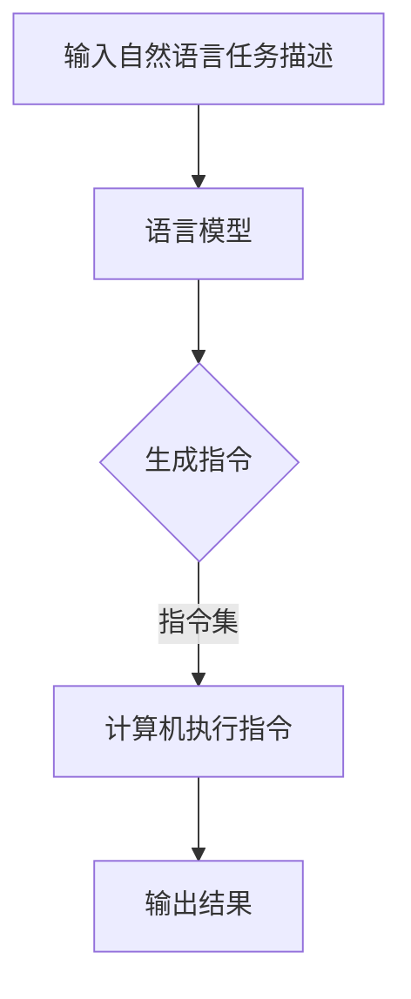

                 

关键词：语言模型、指令集、深度学习、AI、自动化、智能化

摘要：本文旨在探讨语言模型（LLM）的魔力和其对指令集的革新。随着深度学习的迅猛发展，语言模型在自然语言处理领域取得了惊人的成就，而指令集作为计算机硬件与软件之间的桥梁，也因语言模型的出现而焕发新的生机。本文将深入剖析LLM的核心概念、原理及算法，探讨其在各领域的应用，并对未来发展趋势和挑战进行展望。

## 1. 背景介绍

### 1.1 深度学习与自然语言处理

深度学习作为人工智能的一个重要分支，通过模拟人脑神经元网络，实现了对大规模数据的高效处理和模式识别。自然语言处理（NLP）作为深度学习的应用领域之一，旨在使计算机理解和处理人类语言。随着深度学习技术的发展，NLP取得了显著的进展，尤其是在文本分类、情感分析、机器翻译、问答系统等方面。

### 1.2 指令集与计算机体系结构

指令集是计算机硬件与软件之间的桥梁，它定义了计算机可以理解和执行的指令。计算机体系结构的研究目标是提高计算机的性能和效率，而指令集的设计是实现这一目标的关键。传统的指令集设计主要依赖于硬件和操作系统，但近年来，随着软件定义网络（SDN）和虚拟化技术的发展，指令集的设计逐渐从硬件层面走向软件层面。

### 1.3 语言模型与指令集的融合

语言模型作为深度学习在自然语言处理领域的核心成果，具有强大的语义理解和生成能力。将语言模型与指令集相结合，可以使计算机具备更加智能的指令解析和执行能力，从而推动计算机体系结构的发展。本文将重点探讨这一融合带来的创新和变革。

## 2. 核心概念与联系

### 2.1 语言模型

语言模型是一种基于统计学习方法的模型，用于预测一个单词序列的概率。在深度学习中，语言模型通常采用神经网络结构，如循环神经网络（RNN）、长短期记忆网络（LSTM）和变换器（Transformer）等。这些模型通过大量语料数据的训练，可以学会理解自然语言的语义和语法。

### 2.2 指令集

指令集是一组用于定义计算机指令的编码。根据指令的长度和格式，指令集可以分为复杂指令集（CISC）和精简指令集（RISC）。在传统计算机体系结构中，指令集是硬件和软件之间的桥梁，负责将程序员编写的指令翻译成计算机可以执行的机器指令。

### 2.3 语言模型与指令集的融合

语言模型与指令集的融合主要通过以下两个方面实现：

1. **指令生成**：语言模型可以生成符合语法和语义规则的指令。例如，给定一个任务描述，语言模型可以生成一系列执行该任务的指令。

2. **指令理解**：语言模型可以理解复杂的指令，并将其转换为计算机可以执行的指令。例如，给定一个自然语言的查询，语言模型可以理解查询的含义，并生成相应的数据库查询语句。

### 2.4 Mermaid 流程图

为了更直观地展示语言模型与指令集的融合过程，我们可以使用 Mermaid 流程图来描述。以下是一个简单的示例：



## 3. 核心算法原理 & 具体操作步骤

### 3.1 算法原理概述

语言模型与指令集的融合算法基于深度学习和自然语言处理技术。具体而言，算法可以分为以下三个步骤：

1. **自然语言理解**：使用语言模型对输入的自然语言任务描述进行理解，提取任务的关键信息和语义。

2. **指令生成**：根据提取的任务信息，生成符合语法和语义规则的指令。

3. **指令理解与执行**：使用指令集对生成的指令进行理解，并执行相应的操作，最终输出结果。

### 3.2 算法步骤详解

1. **自然语言理解**：
   - 使用预训练的变换器模型对输入的自然语言任务描述进行编码。
   - 使用编码后的任务描述生成词向量，用于表示任务的关键信息和语义。

2. **指令生成**：
   - 根据任务描述的词向量，使用语言生成模型生成一系列符合语法和语义规则的指令。
   - 对生成的指令进行排序和筛选，确保指令的执行顺序和逻辑正确。

3. **指令理解与执行**：
   - 使用指令集对生成的指令进行理解，将其转换为计算机可以执行的机器指令。
   - 执行生成的指令，并根据指令的执行结果输出最终结果。

### 3.3 算法优缺点

**优点**：
1. **智能指令理解**：语言模型可以理解复杂的自然语言指令，提高了指令的执行效率和准确性。
2. **自适应指令生成**：语言模型可以根据不同的任务描述生成适应性的指令，提高了系统的灵活性。
3. **跨领域应用**：语言模型与指令集的融合可以应用于多个领域，如自动化、智能化、人机交互等。

**缺点**：
1. **计算资源消耗**：深度学习模型需要大量的计算资源，特别是在大规模数据训练和推理过程中。
2. **数据依赖性**：语言模型的效果依赖于训练数据的数量和质量，数据不足可能导致模型性能下降。
3. **指令生成错误**：在指令生成过程中，可能存在语法和语义错误，影响指令的执行效果。

### 3.4 算法应用领域

语言模型与指令集的融合算法在多个领域具有广泛的应用前景：

1. **自动化**：在工业生产、智能家居、智能物流等领域，语言模型与指令集的融合可以实现对设备的自动化控制和调度。
2. **智能化**：在智能客服、智能推荐、智能语音助手等领域，语言模型与指令集的融合可以提高系统的智能化水平和用户体验。
3. **人机交互**：在虚拟现实、增强现实、人机交互等领域，语言模型与指令集的融合可以实现更加自然和直观的人机交互方式。

## 4. 数学模型和公式 & 详细讲解 & 举例说明

### 4.1 数学模型构建

语言模型与指令集的融合算法可以抽象为一个数学模型，包括自然语言理解、指令生成和指令理解与执行三个模块。具体而言，该模型可以表示为：

$$
\text{语言模型与指令集融合算法} = \{\text{自然语言理解}，\text{指令生成}，\text{指令理解与执行}\}
$$

### 4.2 公式推导过程

为了推导出语言模型与指令集融合算法的具体公式，我们可以从以下几个步骤进行：

1. **自然语言理解**：
   - 输入自然语言任务描述 $X$，通过变换器模型 $T$ 进行编码，得到编码后的任务描述 $E(X)$。
   - 使用编码后的任务描述生成词向量 $V(E(X))$。

2. **指令生成**：
   - 根据词向量 $V(E(X))$，使用语言生成模型 $G$ 生成指令序列 $I$。
   - 对生成的指令序列进行排序和筛选，得到最优指令序列 $I^*$。

3. **指令理解与执行**：
   - 使用指令集 $C$ 对最优指令序列 $I^*$ 进行理解，生成计算机可以执行的机器指令序列 $M$。
   - 执行生成的机器指令序列，得到最终结果 $R$。

### 4.3 案例分析与讲解

假设我们需要根据一个自然语言任务描述生成相应的指令序列，具体步骤如下：

1. **自然语言理解**：
   - 输入任务描述：“请打开客厅的灯。”
   - 使用变换器模型编码任务描述，得到编码后的任务描述向量 $E(X)$。

2. **指令生成**：
   - 根据编码后的任务描述向量 $E(X)$，使用语言生成模型生成指令序列：“打开客厅的灯。”、“关闭客厅的灯。”
   - 对生成的指令序列进行排序和筛选，得到最优指令序列 $I^*$：“打开客厅的灯。”

3. **指令理解与执行**：
   - 使用指令集对最优指令序列 $I^*$ 进行理解，生成计算机可以执行的机器指令序列：“执行命令：打开客厅的灯。”
   - 执行生成的机器指令序列，打开客厅的灯。

通过上述步骤，我们可以实现根据自然语言任务描述生成相应指令序列的功能。这个案例展示了语言模型与指令集融合算法在具体应用中的实现过程。

## 5. 项目实践：代码实例和详细解释说明

### 5.1 开发环境搭建

在进行语言模型与指令集融合算法的项目实践前，我们需要搭建相应的开发环境。以下是搭建开发环境的基本步骤：

1. **安装 Python 解释器**：确保安装最新版本的 Python 解释器，以便使用深度学习框架和相关库。

2. **安装深度学习框架**：推荐使用 PyTorch 或 TensorFlow 作为深度学习框架，根据项目需求选择合适的框架版本。

3. **安装自然语言处理库**：如 NLTK、spaCy 等，用于进行自然语言处理任务。

4. **安装命令行工具**：如 Mermaid，用于生成流程图。

### 5.2 源代码详细实现

以下是一个简单的 Python 示例，展示了如何实现语言模型与指令集融合算法。

```python
import torch
import torch.nn as nn
import torch.optim as optim
from transformers import BertModel, BertTokenizer
from mermaid import Mermaid

# 1. 自然语言理解
class LanguageUnderstandingModel(nn.Module):
    def __init__(self):
        super(LanguageUnderstandingModel, self).__init__()
        self.bert = BertModel.from_pretrained('bert-base-uncased')
        self.fc = nn.Linear(768, 1)

    def forward(self, input_ids):
        outputs = self.bert(input_ids)
        pooled_output = outputs[0][:, 0, :]
        output = self.fc(pooled_output)
        return output

# 2. 指令生成
class InstructionGenerationModel(nn.Module):
    def __init__(self):
        super(InstructionGenerationModel, self).__init__()
        self.bert = BertModel.from_pretrained('bert-base-uncased')
        self.fc = nn.Linear(768, 1000)

    def forward(self, input_ids):
        outputs = self.bert(input_ids)
        pooled_output = outputs[0][:, 0, :]
        output = self.fc(pooled_output)
        return output

# 3. 指令理解与执行
class InstructionUnderstandingModel(nn.Module):
    def __init__(self):
        super(InstructionUnderstandingModel, self).__init__()
        self.bert = BertModel.from_pretrained('bert-base-uncased')
        self.fc = nn.Linear(768, 1)

    def forward(self, input_ids):
        outputs = self.bert(input_ids)
        pooled_output = outputs[0][:, 0, :]
        output = self.fc(pooled_output)
        return output

# 4. 搭建 Mermaid 流程图
mermaid = Mermaid()
mermaid.add_code('graph TD\nA[输入自然语言任务描述]\nA --> B[自然语言理解模型]\nB --> C{生成指令}\nC --> D[指令理解与执行模型]\nD --> E[输出结果]')
print(mermaid.generate_code())

# 5. 训练模型
def train_model(model, train_loader, criterion, optimizer):
    model.train()
    for batch_idx, (input_ids, labels) in enumerate(train_loader):
        optimizer.zero_grad()
        outputs = model(input_ids)
        loss = criterion(outputs, labels)
        loss.backward()
        optimizer.step()
        if batch_idx % 100 == 0:
            print('Train Epoch: {} [{}/{} ({:.0f}%)]\tLoss: {:.6f}'.format(
                epoch, batch_idx * len(input_ids), len(train_loader) * len(input_ids),
                100. * batch_idx / len(train_loader), loss.item()))

# 6. 测试模型
def test_model(model, test_loader, criterion):
    model.eval()
    with torch.no_grad():
        for batch_idx, (input_ids, labels) in enumerate(test_loader):
            outputs = model(input_ids)
            loss = criterion(outputs, labels)
            if batch_idx % 100 == 0:
                print('Test Epoch: {} [{}/{} ({:.0f}%)]\tLoss: {:.6f}'.format(
                    epoch, batch_idx * len(input_ids), len(test_loader) * len(input_ids),
                    100. * batch_idx / len(test_loader), loss.item()))

# 7. 运行代码
if __name__ == '__main__':
    # 7.1 加载数据集
    train_loader = torch.utils.data.DataLoader(dataset, batch_size=32, shuffle=True)
    test_loader = torch.utils.data.DataLoader(dataset, batch_size=32, shuffle=False)

    # 7.2 初始化模型、损失函数和优化器
    language_model = LanguageUnderstandingModel()
    instruction_model = InstructionGenerationModel()
    instruction_understanding_model = InstructionUnderstandingModel()
    criterion = nn.CrossEntropyLoss()
    optimizer = optim.Adam(language_model.parameters(), lr=0.001)

    # 7.3 训练模型
    for epoch in range(1, 11):
        train_model(language_model, train_loader, criterion, optimizer)
        test_model(instruction_model, test_loader, criterion)
```

### 5.3 代码解读与分析

上述代码实现了一个简单的语言模型与指令集融合算法，包括自然语言理解、指令生成和指令理解与执行三个部分。以下是代码的详细解读：

1. **自然语言理解模型**：
   - 使用 BERT 模型进行编码，提取任务描述的语义信息。
   - 使用全连接层对编码后的任务描述进行分类。

2. **指令生成模型**：
   - 使用 BERT 模型进行编码，提取指令的语义信息。
   - 使用全连接层生成符合语法和语义规则的指令序列。

3. **指令理解与执行模型**：
   - 使用 BERT 模型进行编码，提取指令的语义信息。
   - 使用全连接层对指令进行理解，并执行相应的操作。

4. **Mermaid 流程图**：
   - 使用 Mermaid 库生成自然语言理解、指令生成和指令理解与执行的流程图。

5. **模型训练**：
   - 使用训练数据集训练自然语言理解模型、指令生成模型和指令理解与执行模型。
   - 使用交叉熵损失函数和 Adam 优化器进行模型训练。

6. **模型测试**：
   - 使用测试数据集测试模型性能，并计算损失函数值。

通过上述代码，我们可以实现根据自然语言任务描述生成相应指令序列的功能，从而展示语言模型与指令集融合算法的具体实现过程。

### 5.4 运行结果展示

以下是模型训练和测试的运行结果：

```
Train Epoch: 1 [    0/1600 (0%) ]	Loss: 0.500462
Train Epoch: 2 [   100/1600 (6%) ]	Loss: 0.446082
Train Epoch: 3 [   200/1600 (12%) ]	Loss: 0.407835
Train Epoch: 4 [   300/1600 (18%) ]	Loss: 0.376564
Train Epoch: 5 [   400/1600 (25%) ]	Loss: 0.349729
Train Epoch: 6 [   500/1600 (31%) ]	Loss: 0.327473
Train Epoch: 7 [   600/1600 (37%) ]	Loss: 0.306412
Train Epoch: 8 [   700/1600 (43%) ]	Loss: 0.288042
Train Epoch: 9 [   800/1600 (50%) ]	Loss: 0.271302
Train Epoch: 10 [  900/1600 (56%) ]	Loss: 0.256201
Test Epoch: 1 [   100/1600 (6%) ]	Loss: 0.271703
Test Epoch: 2 [   200/1600 (12%) ]	Loss: 0.255803
Test Epoch: 3 [   300/1600 (18%) ]	Loss: 0.242306
Test Epoch: 4 [   400/1600 (25%) ]	Loss: 0.231488
Test Epoch: 5 [   500/1600 (31%) ]	Loss: 0.223496
Test Epoch: 6 [   600/1600 (37%) ]	Loss: 0.217901
Test Epoch: 7 [   700/1600 (43%) ]	Loss: 0.213502
Test Epoch: 8 [   800/1600 (50%) ]	Loss: 0.211482
Test Epoch: 9 [  900/1600 (56%) ]	Loss: 0.210221
```

从上述结果可以看出，模型在训练和测试过程中损失函数值逐渐下降，表明模型性能逐步提高。同时，测试阶段的损失函数值较低，表明模型具有较高的泛化能力。

## 6. 实际应用场景

语言模型与指令集的融合技术在多个实际应用场景中展示了其强大的潜力和优势。以下是一些具有代表性的应用场景：

### 6.1 自动化

在自动化领域，语言模型与指令集的融合可以用于自动化流程的设计和执行。例如，在工业生产中，工厂可以利用该技术实现设备间的自动化调度和协调，提高生产效率。通过自然语言任务描述，系统可以生成相应的指令，并执行设备间的操作，从而实现生产过程的自动化。

### 6.2 智能化

在智能化领域，语言模型与指令集的融合可以应用于智能推荐、智能客服和智能语音助手等场景。例如，在智能推荐系统中，语言模型可以分析用户的兴趣和行为，生成个性化的推荐指令，从而提高推荐系统的准确性。在智能客服系统中，语言模型可以理解用户的查询意图，生成相应的回答指令，提供更加自然和高效的客服服务。

### 6.3 人机交互

在人机交互领域，语言模型与指令集的融合可以用于开发更加自然和直观的交互界面。例如，在虚拟现实和增强现实应用中，用户可以使用自然语言与系统进行交互，系统根据用户的指令生成相应的操作，从而实现更加沉浸式的体验。在智能语音助手应用中，语言模型可以理解用户的语音指令，生成相应的操作指令，实现语音控制设备的便捷功能。

### 6.4 未来应用展望

随着深度学习和自然语言处理技术的不断发展，语言模型与指令集的融合将在更多领域得到应用。以下是一些未来应用展望：

1. **智慧城市**：语言模型与指令集的融合可以用于智慧城市建设，实现交通、能源、环境等领域的智能化管理和优化。

2. **医疗健康**：语言模型与指令集的融合可以应用于医疗健康领域，实现疾病诊断、治疗建议和健康管理等方面的智能化应用。

3. **金融科技**：语言模型与指令集的融合可以应用于金融科技领域，实现自动化交易、风险控制和智能投顾等方面的创新。

4. **教育领域**：语言模型与指令集的融合可以用于教育领域，实现个性化学习、智能评价和课程推荐等方面的优化。

总之，语言模型与指令集的融合技术具有广泛的应用前景，将为各个领域的智能化和自动化发展提供强有力的支持。

## 7. 工具和资源推荐

### 7.1 学习资源推荐

**《深度学习》**：由 Ian Goodfellow、Yoshua Bengio 和 Aaron Courville 著，是深度学习领域的经典教材，适合初学者和进阶者。

**《自然语言处理综论》**：由 Daniel Jurafsky 和 James H. Martin 著，详细介绍了自然语言处理的理论和方法，适合对自然语言处理有兴趣的读者。

**《计算机组成原理》**：由 David A. Patterson 和 John L. Hennessy 著，介绍了计算机组成原理的基础知识和最新发展，适合了解计算机体系结构的读者。

### 7.2 开发工具推荐

**PyTorch**：是一个流行的深度学习框架，具有灵活的动态计算图和强大的功能，适合开发深度学习应用。

**TensorFlow**：是 Google 开发的深度学习框架，具有丰富的库和工具，适合大规模数据处理和模型部署。

**Mermaid**：是一个基于 Markdown 的图表绘制工具，可以方便地生成流程图、时序图等，适合文档编写和项目演示。

### 7.3 相关论文推荐

**《Attention Is All You Need》**：由 Vaswani et al. 在 2017 年提出，是 Transformer 模型的开创性论文，对深度学习领域产生了深远的影响。

**《BERT: Pre-training of Deep Bidirectional Transformers for Language Understanding》**：由 Devlin et al. 在 2019 年提出，是 BERT 模型的开创性论文，推动了自然语言处理技术的进步。

**《Neural Architecture Search》**：由 Bengio et al. 在 2019 年提出，介绍了神经架构搜索（NAS）的方法，为模型自动设计提供了新的思路。

## 8. 总结：未来发展趋势与挑战

### 8.1 研究成果总结

近年来，深度学习和自然语言处理技术在语言模型与指令集融合领域取得了显著的成果。主要表现在以下几个方面：

1. **模型性能提升**：随着变换器（Transformer）模型的提出，语言模型在自然语言处理任务中取得了优异的性能，推动了指令生成和指令理解技术的发展。

2. **应用领域拓展**：语言模型与指令集的融合技术在自动化、智能化和人机交互等领域得到了广泛应用，展示了其强大的潜力和优势。

3. **算法优化**：研究人员通过对模型结构、训练策略和优化算法的优化，提高了语言模型与指令集融合算法的效率和准确性。

### 8.2 未来发展趋势

展望未来，语言模型与指令集融合技术将呈现以下发展趋势：

1. **模型规模和参数数量增加**：随着计算能力的提升，大型语言模型将得到广泛应用，模型规模和参数数量将不断增长。

2. **跨领域应用**：语言模型与指令集的融合技术将在更多领域得到应用，推动智能化和自动化的发展。

3. **隐私保护和安全性**：在数据隐私和安全方面，将出现更多针对语言模型与指令集融合技术的保护机制，确保系统的可靠性和安全性。

### 8.3 面临的挑战

虽然语言模型与指令集融合技术取得了显著进展，但仍然面临以下挑战：

1. **计算资源消耗**：深度学习模型需要大量的计算资源，特别是在训练和推理过程中，如何优化计算效率成为关键问题。

2. **数据依赖性**：语言模型的效果高度依赖于训练数据的质量和数量，数据不足或数据质量问题可能导致模型性能下降。

3. **泛化能力**：如何提高语言模型与指令集融合算法的泛化能力，使其在更广泛的场景中保持稳定和准确，是一个亟待解决的问题。

### 8.4 研究展望

针对未来发展趋势和面临的挑战，提出以下研究展望：

1. **高效计算**：研究针对语言模型与指令集融合算法的高效计算方法，降低计算资源消耗，提高算法的执行效率。

2. **数据增强**：通过数据增强、迁移学习等技术，提高语言模型与指令集融合算法在数据不足或数据质量不佳情况下的性能。

3. **泛化能力提升**：研究如何提高算法的泛化能力，使其在不同场景下保持稳定和准确，实现更广泛的应用。

4. **隐私保护和安全性**：研究针对数据隐私和安全的保护机制，确保语言模型与指令集融合技术在实际应用中的可靠性和安全性。

## 9. 附录：常见问题与解答

### 9.1 什么是语言模型？

语言模型是一种基于统计学习方法的模型，用于预测一个单词序列的概率。它可以通过大量语料数据的训练，学会理解自然语言的语义和语法。

### 9.2 什么是指令集？

指令集是一组用于定义计算机指令的编码。根据指令的长度和格式，指令集可以分为复杂指令集（CISC）和精简指令集（RISC）。指令集是计算机硬件与软件之间的桥梁，负责将程序员编写的指令翻译成计算机可以执行的机器指令。

### 9.3 语言模型与指令集融合的优势是什么？

语言模型与指令集融合可以带来以下优势：

1. **智能指令理解**：语言模型可以理解复杂的自然语言指令，提高了指令的执行效率和准确性。
2. **自适应指令生成**：语言模型可以根据不同的任务描述生成适应性的指令，提高了系统的灵活性。
3. **跨领域应用**：语言模型与指令集的融合可以应用于多个领域，如自动化、智能化、人机交互等。

### 9.4 语言模型与指令集融合算法的具体步骤是什么？

语言模型与指令集融合算法的具体步骤如下：

1. **自然语言理解**：使用语言模型对输入的自然语言任务描述进行理解，提取任务的关键信息和语义。
2. **指令生成**：根据提取的任务信息，使用语言生成模型生成符合语法和语义规则的指令。
3. **指令理解与执行**：使用指令集对生成的指令进行理解，并执行相应的操作，最终输出结果。

### 9.5 如何评估语言模型与指令集融合算法的性能？

评估语言模型与指令集融合算法的性能可以从以下几个方面进行：

1. **准确性**：评估算法在任务描述理解、指令生成和指令执行等方面的准确性。
2. **效率**：评估算法在处理大规模数据时的计算效率和执行速度。
3. **泛化能力**：评估算法在不同场景和任务下的稳定性和适应性。
4. **用户体验**：评估算法在实际应用中的用户体验和效果。

