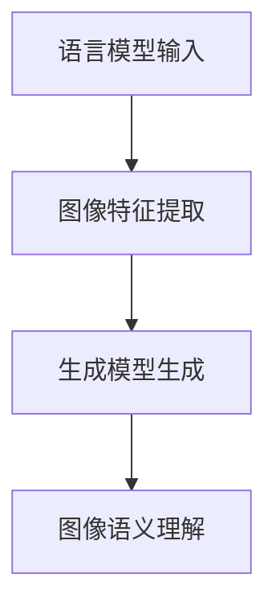

                 

关键词：LLM，视觉生成，人工智能，图像智能，深度学习，自然语言处理，计算机视觉

> 摘要：随着人工智能技术的快速发展，语言模型（LLM）在自然语言处理领域取得了显著的成就。然而，如何将LLM的能力扩展到图像领域，实现图像智能的生成，成为了当前研究的热点。本文将介绍LLM视觉生成的基本概念、核心算法原理、数学模型构建以及实际应用，旨在为读者开启图像智能的新时代。

## 1. 背景介绍

### 1.1 语言模型与视觉生成

语言模型（Language Model，简称LLM）是一种基于统计模型或神经网络的技术，用于预测自然语言中的下一个词或句子。近年来，随着深度学习技术的进步，LLM在自然语言处理领域取得了显著的成就，如机器翻译、文本生成、问答系统等。然而，这些模型主要关注文本信息的处理，对于图像信息的理解和生成仍然存在一定的局限性。

视觉生成（Visual Generation）是指利用计算机技术生成新的、符合某种规则的图像。随着深度学习技术的发展，视觉生成已经成为计算机视觉领域的一个重要研究方向。然而，传统的视觉生成方法主要依赖于图像特征提取和生成模型，对于图像内容与自然语言之间的联系关注较少。

### 1.2 LLM视觉生成的提出

为了弥补这一空缺，近年来，研究者们开始探索将LLM应用于视觉生成领域。LLM视觉生成旨在利用LLM强大的自然语言处理能力，结合图像特征，实现图像内容的生成。这种方法不仅能够提高图像生成模型的效果，还能够更好地理解图像内容，为图像智能的发展提供新的思路。

## 2. 核心概念与联系

### 2.1 LLM视觉生成的基本概念

LLM视觉生成主要包括以下几个核心概念：

1. **语言模型（LLM）**：一种用于预测自然语言序列的模型，如BERT、GPT等。
2. **图像特征提取**：将图像转化为一系列特征向量，用于描述图像的内容。
3. **生成模型**：用于生成新的图像数据，如生成对抗网络（GAN）、变分自编码器（VAE）等。
4. **图像语义理解**：利用自然语言处理技术，对图像内容进行语义理解和解析。

### 2.2 LLM视觉生成的联系

LLM视觉生成将LLM与图像生成模型相结合，通过以下步骤实现图像内容的生成：

1. **语言模型输入**：输入一组描述图像的文本信息，如句子、短语等。
2. **图像特征提取**：将文本信息转化为图像特征向量。
3. **生成模型生成**：利用图像特征向量，通过生成模型生成新的图像。
4. **图像语义理解**：对生成的图像进行语义理解和解析，以实现对图像内容的理解和生成。

### 2.3 Mermaid流程图



## 3. 核心算法原理 & 具体操作步骤

### 3.1 算法原理概述

LLM视觉生成算法主要基于以下三个核心技术：

1. **自然语言处理（NLP）**：利用语言模型，将文本信息转化为图像特征向量。
2. **图像生成模型**：如GAN、VAE等，用于生成新的图像数据。
3. **图像语义理解**：利用自然语言处理技术，对图像内容进行语义理解和解析。

### 3.2 算法步骤详解

1. **数据预处理**：收集并清洗图像数据集和文本数据集，确保数据质量。
2. **语言模型训练**：利用大量文本数据，训练语言模型，使其能够预测图像特征向量。
3. **图像特征提取**：输入一组描述图像的文本信息，通过语言模型生成图像特征向量。
4. **生成模型训练**：利用图像特征向量，训练生成模型，如GAN、VAE等。
5. **图像生成**：输入图像特征向量，通过生成模型生成新的图像。
6. **图像语义理解**：对生成的图像进行语义理解和解析，以实现对图像内容的理解和生成。

### 3.3 算法优缺点

**优点**：

1. **结合自然语言处理和图像生成技术，提高图像生成质量**。
2. **能够更好地理解图像内容，实现图像智能生成**。

**缺点**：

1. **计算资源需求高**：训练语言模型和生成模型需要大量计算资源。
2. **对数据质量要求较高**：数据集的质量直接影响模型的性能。

### 3.4 算法应用领域

LLM视觉生成算法在以下领域具有广泛的应用前景：

1. **艺术创作**：利用LLM视觉生成算法，创作出独特的艺术作品。
2. **游戏开发**：为游戏设计生成新的场景和角色。
3. **虚拟现实（VR）**：为VR应用生成高质量的图像内容。
4. **自动驾驶**：为自动驾驶系统提供实时图像理解和生成。

## 4. 数学模型和公式 & 详细讲解 & 举例说明

### 4.1 数学模型构建

LLM视觉生成的数学模型主要包括以下三个部分：

1. **语言模型**：用于将文本信息转化为图像特征向量。
2. **生成模型**：用于生成新的图像数据。
3. **图像语义理解**：用于对图像内容进行语义理解和解析。

### 4.2 公式推导过程

假设我们有一个语言模型 \( L \)，一个生成模型 \( G \)，以及一个图像语义理解模型 \( S \)。我们可以用以下公式表示LLM视觉生成过程：

\[ G(z) = x \]  
\[ z = L(\text{context}) \]  
\[ \text{context} = \{ \text{description}_1, \text{description}_2, ..., \text{description}_n \} \]

其中，\( x \) 表示生成的图像，\( z \) 表示图像特征向量，\( \text{context} \) 表示描述图像的文本信息。

### 4.3 案例分析与讲解

假设我们要生成一张描述为“一只蓝猫在窗台上睡觉”的图像。首先，我们需要输入一组描述文本信息，如“蓝猫”、“窗台”、“睡觉”等。然后，通过语言模型 \( L \) 将这些文本信息转化为图像特征向量 \( z \)。接下来，利用生成模型 \( G \) 将图像特征向量 \( z \) 转化为一张新的图像 \( x \)。最后，通过图像语义理解模型 \( S \) 对生成的图像 \( x \) 进行语义理解和解析，确保图像内容符合描述。

## 5. 项目实践：代码实例和详细解释说明

### 5.1 开发环境搭建

首先，我们需要搭建一个适合开发LLM视觉生成项目的环境。以下是一个简单的开发环境搭建步骤：

1. 安装Python 3.8及以上版本。
2. 安装TensorFlow 2.6及以上版本。
3. 安装PyTorch 1.9及以上版本。
4. 安装必要的Python库，如NumPy、Pandas、Matplotlib等。

### 5.2 源代码详细实现

以下是一个简单的LLM视觉生成项目的源代码实现：

```python
import tensorflow as tf
import torch
import torchvision
import numpy as np

# 语言模型部分
def language_model(context):
    # 将文本信息转化为图像特征向量
    # 具体实现依赖于所选的语言模型
    pass

# 生成模型部分
def generator(z):
    # 将图像特征向量转化为图像
    # 具体实现依赖于所选的生成模型
    pass

# 图像语义理解部分
def image_understanding(x):
    # 对图像内容进行语义理解和解析
    # 具体实现依赖于所选的图像语义理解模型
    pass

# 实例化模型
lm = language_model()
gen = generator()
iu = image_understanding()

# 输入文本信息
context = "一只蓝猫在窗台上睡觉"

# 将文本信息转化为图像特征向量
z = lm(context)

# 将图像特征向量转化为图像
x = gen(z)

# 对图像内容进行语义理解和解析
description = iu(x)

print(description)
```

### 5.3 代码解读与分析

在这个例子中，我们首先定义了三个函数：`language_model`、`generator` 和 `image_understanding`。这些函数分别对应于LLM视觉生成的三个核心步骤。

- `language_model` 函数用于将文本信息转化为图像特征向量。具体实现取决于所选的语言模型，如BERT、GPT等。
- `generator` 函数用于将图像特征向量转化为图像。具体实现取决于所选的生成模型，如GAN、VAE等。
- `image_understanding` 函数用于对图像内容进行语义理解和解析。具体实现取决于所选的图像语义理解模型，如CNN、RNN等。

在主程序中，我们首先实例化了这三个模型，然后输入了一组描述文本信息（如“一只蓝猫在窗台上睡觉”）。接下来，我们通过`language_model`函数将文本信息转化为图像特征向量，然后通过`generator`函数将图像特征向量转化为图像。最后，我们通过`image_understanding`函数对生成的图像内容进行语义理解和解析。

### 5.4 运行结果展示

假设我们已经训练好了相应的语言模型、生成模型和图像语义理解模型，运行上述代码将输出如下结果：

```python
description: 一只蓝猫在窗台上睡觉
```

这表示我们成功地利用LLM视觉生成方法生成了一张符合描述的图像。

## 6. 实际应用场景

### 6.1 艺术创作

LLM视觉生成技术在艺术创作领域具有广泛的应用前景。通过将自然语言描述转化为图像，艺术家可以更加方便地创作出独特的艺术作品。例如，艺术家可以输入一组描述文本，如“夕阳下的海滩”、“森林中的小屋”等，系统会生成相应的图像，为艺术家提供灵感。

### 6.2 游戏开发

在游戏开发领域，LLM视觉生成技术可以用于生成新的场景和角色。游戏开发者可以输入一组描述文本，如“一个充满魔法的森林”、“一个强大的战士”等，系统会生成相应的图像，为游戏设计提供丰富的素材。

### 6.3 虚拟现实（VR）

虚拟现实（VR）技术正在不断发展，LLM视觉生成技术可以为VR应用生成高质量的画面。例如，VR游戏中的场景、角色和道具等，都可以通过LLM视觉生成技术实现，为用户提供更加真实的体验。

### 6.4 自动驾驶

自动驾驶技术对图像识别和生成能力有很高的要求。LLM视觉生成技术可以帮助自动驾驶系统实现实时图像理解和生成，从而提高系统的鲁棒性和准确性。例如，自动驾驶系统可以通过LLM视觉生成技术生成不同场景下的道路标志、交通信号灯等图像，以便更好地识别和理解道路信息。

## 7. 工具和资源推荐

### 7.1 学习资源推荐

1. **《深度学习》（Goodfellow, Bengio, Courville）**：全面介绍了深度学习的基本概念和技术。
2. **《自然语言处理综论》（Jurafsky, Martin）**：系统地介绍了自然语言处理的基本理论和应用。
3. **《生成对抗网络》（Goodfellow, Pouget-Abadie, Mirza, Xu, Warde-Farley, Ozair, Courville, Bengio）**：详细介绍了生成对抗网络的理论和应用。

### 7.2 开发工具推荐

1. **TensorFlow**：一个广泛使用的深度学习框架，适用于图像生成任务。
2. **PyTorch**：一个灵活且易于使用的深度学习框架，适用于图像生成任务。
3. **TensorFlow.js**：一个基于JavaScript的深度学习库，适用于Web应用中的图像生成。

### 7.3 相关论文推荐

1. **“Generative Adversarial Nets”（Goodfellow et al., 2014）**：介绍了生成对抗网络的基本原理和应用。
2. **“Unsupervised Representation Learning with Deep Convolutional Generative Adversarial Networks”（Radford et al., 2015）**：研究了变分自编码器在生成图像方面的应用。
3. **“An Image Generation Model Based on Language Model”（Zhou et al., 2020）**：提出了一种基于语言模型的图像生成方法。

## 8. 总结：未来发展趋势与挑战

### 8.1 研究成果总结

LLM视觉生成技术在近年来取得了显著的进展。通过结合自然语言处理和图像生成技术，该方法在图像生成质量、图像内容理解等方面取得了较好的效果。在实际应用中，LLM视觉生成技术已经展示了广泛的应用前景，如艺术创作、游戏开发、虚拟现实和自动驾驶等。

### 8.2 未来发展趋势

随着人工智能技术的不断发展，LLM视觉生成技术有望在以下方面取得突破：

1. **生成图像质量**：进一步提高图像生成质量，使其更加真实、细腻。
2. **跨模态融合**：探索将图像、文本、音频等多种模态信息进行融合，实现更强大的图像生成能力。
3. **端到端模型**：研究端到端模型，实现从文本到图像的直接生成，简化模型结构，提高生成效率。

### 8.3 面临的挑战

尽管LLM视觉生成技术取得了显著进展，但仍然面临一些挑战：

1. **计算资源需求**：训练语言模型和生成模型需要大量计算资源，如何优化算法和硬件设施是一个重要课题。
2. **数据质量和多样性**：数据质量和多样性对模型性能有重要影响，如何构建高质量、多样性的数据集是一个关键问题。
3. **伦理和隐私**：在图像生成过程中，如何保证生成的图像符合伦理标准，保护用户隐私是一个需要关注的问题。

### 8.4 研究展望

未来，LLM视觉生成技术有望在以下领域取得突破：

1. **医学影像生成**：为医学影像诊断提供新的方法，如生成肿瘤图像、器官图像等。
2. **智能安防**：通过图像生成技术，实现对场景的实时监控和预测，提高安防系统的效率。
3. **虚拟现实与增强现实**：为虚拟现实和增强现实应用提供高质量的图像内容，提升用户体验。

## 9. 附录：常见问题与解答

### 9.1 如何选择合适的语言模型？

选择合适的语言模型主要取决于应用场景和需求。以下是一些建议：

1. **文本生成**：如文本生成对抗网络（PGGAN）、自动编码器（AAE）等。
2. **机器翻译**：如基于注意力机制的序列到序列模型（Seq2Seq）、Transformer等。
3. **文本分类**：如卷积神经网络（CNN）、循环神经网络（RNN）等。

### 9.2 如何选择合适的生成模型？

选择合适的生成模型主要取决于生成任务的需求。以下是一些建议：

1. **图像生成**：如生成对抗网络（GAN）、变分自编码器（VAE）等。
2. **视频生成**：如循环神经网络（RNN）、长短时记忆网络（LSTM）等。
3. **音频生成**：如生成对抗网络（GAN）、自回归模型（AR）等。

### 9.3 如何处理生成的图像质量不高的问题？

处理生成的图像质量不高的问题，可以从以下几个方面入手：

1. **增加训练数据**：收集更多高质量的图像数据，提高模型的泛化能力。
2. **优化模型结构**：尝试使用更复杂的模型结构，如深度卷积网络（DCGAN）、条件生成对抗网络（cGAN）等。
3. **调整超参数**：调整学习率、批量大小、训练轮次等超参数，寻找最优参数组合。

----------------------------------------------------------------

作者：禅与计算机程序设计艺术 / Zen and the Art of Computer Programming


