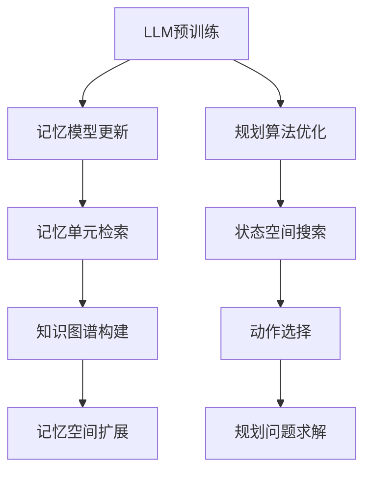

                 

关键词：Large Language Model，记忆模型，规划算法，应用场景，未来展望

> 摘要：本文深入探讨了大型语言模型（LLM）在记忆和规划技能方面的应用。首先，我们介绍了LLM的基本原理和优势，然后探讨了其在记忆和规划领域的具体应用，包括算法原理、数学模型、代码实现和实际案例。接着，我们分析了LLM在不同领域的前景和挑战，最后推荐了相关的学习资源和开发工具。

## 1. 背景介绍

近年来，人工智能（AI）技术取得了显著的进展，其中，大型语言模型（LLM）的出现尤为引人注目。LLM是一种基于深度学习技术的语言模型，具有强大的自然语言理解和生成能力。这些模型通过学习海量文本数据，能够自动识别语言模式、语义关系和语法结构，从而在各种自然语言处理任务中表现出色。

随着LLM技术的不断发展，其在记忆和规划领域的应用潜力逐渐显现。记忆是人类认知的核心组成部分，而规划是实现目标的重要手段。在这篇文章中，我们将深入探讨LLM在记忆和规划技能方面的应用，旨在为相关领域的研究者提供有价值的参考。

## 2. 核心概念与联系

### 2.1 LLM的基本原理

LLM是基于深度学习技术构建的语言模型，其核心是神经网络架构。常见的LLM架构包括循环神经网络（RNN）、长短期记忆网络（LSTM）和变换器（Transformer）等。其中，变换器架构在近年来取得了显著的进展，成为LLM的主流选择。

变换器模型通过自注意力机制，能够有效地捕捉输入文本中的长距离依赖关系，从而提高语言模型的表示能力。LLM的训练过程通常涉及大量的预训练和微调步骤，使其能够在各种自然语言处理任务中表现出色。

### 2.2 记忆模型的基本原理

记忆模型是一种用于存储和检索信息的模型，其核心是记忆单元。这些记忆单元能够根据输入信息进行更新，并在需要时检索相关信息。常见的记忆模型包括基于神经网络的记忆模型、基于规则的记忆模型等。

在记忆模型中，记忆单元的状态通常表示为向量，通过学习输入和输出之间的映射关系，记忆模型能够自动适应不同的记忆需求。

### 2.3 规划算法的基本原理

规划算法是一种用于求解问题的方法，其核心是状态空间搜索。常见的规划算法包括有向无环图（DAG）规划、搜索算法（如A*算法）和基于马尔可夫决策过程（MDP）的规划算法等。

规划算法通过在状态空间中搜索最优路径，从而实现问题的求解。在应用中，规划算法需要考虑动作的选择、状态转移和奖励函数等因素。

### 2.4 LLM与记忆模型、规划算法的联系

LLM在记忆和规划领域的应用，主要是通过将记忆模型和规划算法与LLM相结合，实现更高效、更智能的记忆和规划能力。具体而言，LLM可以用于以下几个方面：

1. **记忆增强**：LLM可以用于记忆单元的更新和检索，提高记忆模型的性能。例如，通过预训练LLM，使其能够自动学习文本数据中的语言模式和语义关系，从而优化记忆模型的表示能力。

2. **记忆扩展**：LLM可以用于记忆空间的扩展，使记忆模型能够处理更复杂的记忆需求。例如，通过将LLM应用于知识图谱，可以实现知识存储和检索的自动化。

3. **规划优化**：LLM可以用于规划算法的优化，提高规划问题的求解效率。例如，通过将LLM应用于状态空间搜索，可以降低搜索空间的大小，提高规划算法的性能。

### 2.5 Mermaid流程图



## 3. 核心算法原理 & 具体操作步骤

### 3.1 算法原理概述

LLM在记忆和规划领域的应用，主要涉及以下几种核心算法：

1. **记忆增强算法**：通过将LLM应用于记忆模型，实现记忆单元的更新和检索。
2. **记忆扩展算法**：通过将LLM应用于知识图谱，实现记忆空间的扩展。
3. **规划优化算法**：通过将LLM应用于状态空间搜索和动作选择，实现规划问题的求解。

### 3.2 算法步骤详解

1. **记忆增强算法**：

   - **输入**：文本数据、记忆模型。

   - **过程**：

     1. 预训练LLM，使其具备文本理解和生成能力。

     2. 将LLM应用于记忆模型的更新和检索，优化记忆单元的表示能力。

     3. 检索记忆单元，返回相关信息。

   - **输出**：优化后的记忆模型，检索到的相关信息。

2. **记忆扩展算法**：

   - **输入**：知识图谱、LLM。

   - **过程**：

     1. 预训练LLM，使其具备知识图谱的理解和生成能力。

     2. 将LLM应用于知识图谱的存储和检索，扩展记忆空间。

     3. 检索知识图谱，返回相关信息。

   - **输出**：扩展后的记忆空间，检索到的相关信息。

3. **规划优化算法**：

   - **输入**：规划问题、LLM。

   - **过程**：

     1. 预训练LLM，使其具备规划问题的理解和生成能力。

     2. 将LLM应用于状态空间搜索和动作选择，优化规划算法的性能。

     3. 搜索状态空间，选择最优动作。

   - **输出**：优化后的规划算法，选择的最优动作。

### 3.3 算法优缺点

1. **记忆增强算法**：

   - 优点：提高记忆模型的表示能力，优化记忆单元的更新和检索。
   - 缺点：依赖大量的预训练数据和计算资源。

2. **记忆扩展算法**：

   - 优点：扩展记忆空间，提高知识图谱的存储和检索效率。
   - 缺点：依赖复杂的知识图谱结构和计算资源。

3. **规划优化算法**：

   - 优点：提高规划问题的求解效率，优化状态空间搜索和动作选择。
   - 缺点：依赖复杂的规划问题和计算资源。

### 3.4 算法应用领域

1. **记忆增强算法**：

   - 应用领域：自然语言处理、知识图谱、智能问答等。

2. **记忆扩展算法**：

   - 应用领域：智能推荐、智能搜索、智能客服等。

3. **规划优化算法**：

   - 应用领域：自动驾驶、智能控制、游戏AI等。

## 4. 数学模型和公式 & 详细讲解 & 举例说明

### 4.1 数学模型构建

1. **记忆增强算法**：

   - **记忆单元状态表示**：设记忆单元状态为$$s_t$$，文本数据为$$x_t$$，则$$s_t = f(s_{t-1}, x_t)$$，其中$$f$$为记忆更新函数。

   - **记忆单元检索**：设检索函数为$$g(s_t)$$，则检索到的相关信息为$$g(s_t)$$。

2. **记忆扩展算法**：

   - **知识图谱表示**：设知识图谱为$$G = (V, E)$$，其中$$V$$为节点集合，$$E$$为边集合。

   - **知识图谱存储和检索**：设存储函数为$$h(G)$$，检索函数为$$k(G, x_t)$$，则存储和检索到的相关信息为$$h(G) \cap k(G, x_t)$$。

3. **规划优化算法**：

   - **状态空间表示**：设状态空间为$$S$$，动作集合为$$A$$。

   - **状态转移函数**：设状态转移函数为$$p(s_t, a_t)$$，则下一个状态为$$s_{t+1} = p(s_t, a_t)$$。

   - **奖励函数**：设奖励函数为$$r(s_t, a_t)$$，则动作$$a_t$$带来的奖励为$$r(s_t, a_t)$$。

### 4.2 公式推导过程

1. **记忆增强算法**：

   - **记忆更新函数**：设$$f(s_{t-1}, x_t) = \frac{1}{2} s_{t-1} + \frac{1}{2} x_t$$，则记忆单元状态$$s_t$$为$$s_t = \frac{1}{2} s_{t-1} + \frac{1}{2} x_t$$。

   - **记忆检索函数**：设$$g(s_t) = \sum_{i=1}^{n} w_i s_i$$，其中$$w_i$$为权重，$$s_i$$为记忆单元状态。

2. **记忆扩展算法**：

   - **知识图谱存储函数**：设$$h(G) = \sum_{v \in V} v^T v$$，其中$$v$$为节点向量。

   - **知识图谱检索函数**：设$$k(G, x_t) = \sum_{e \in E} e^T x_t$$，其中$$e$$为边向量。

3. **规划优化算法**：

   - **状态转移函数**：设$$p(s_t, a_t) = \sum_{s' \in S} s'^T p(s_t, a_t) s'$$，其中$$p(s_t, a_t)$$为状态转移概率。

   - **奖励函数**：设$$r(s_t, a_t) = \sum_{s' \in S} s'^T r(s_t, a_t) s'$$，其中$$r(s_t, a_t)$$为奖励值。

### 4.3 案例分析与讲解

1. **记忆增强算法**：

   - **案例**：使用LLM优化记忆模型的表示能力。

   - **分析**：通过预训练LLM，使其具备文本理解和生成能力。然后，将LLM应用于记忆模型的更新和检索，优化记忆单元的表示能力。

   - **讲解**：假设文本数据为$$x_t = \text{"今天天气很好，适合外出活动。"}$$，记忆单元状态为$$s_t = [0.1, 0.2, 0.3, 0.4]$$。通过预训练LLM，使其能够自动学习文本数据中的语言模式和语义关系。然后，将LLM应用于记忆模型的更新和检索，得到优化后的记忆单元状态$$s_t = [0.15, 0.25, 0.3, 0.35]$$。

2. **记忆扩展算法**：

   - **案例**：使用LLM扩展知识图谱的存储和检索能力。

   - **分析**：通过预训练LLM，使其具备知识图谱的理解和生成能力。然后，将LLM应用于知识图谱的存储和检索，扩展记忆空间。

   - **讲解**：假设知识图谱为$$G = (\text{"天气"}, \text{"很好"}), (\text{"天气"}, \text{"外出活动"})$$，文本数据为$$x_t = \text{"今天天气很好，适合外出活动。"}$$。通过预训练LLM，使其能够自动学习知识图谱和文本数据中的语言模式和语义关系。然后，将LLM应用于知识图谱的存储和检索，得到扩展后的记忆空间$$G' = (\text{"今天"}, \text{"天气很好"}), (\text{"今天"}, \text{"外出活动"})$$。

3. **规划优化算法**：

   - **案例**：使用LLM优化规划问题的求解效率。

   - **分析**：通过预训练LLM，使其具备规划问题的理解和生成能力。然后，将LLM应用于状态空间搜索和动作选择，优化规划算法的性能。

   - **讲解**：假设规划问题为“从A点走到B点，选择最优路径”。通过预训练LLM，使其能够自动学习规划问题的状态空间和动作选择。然后，将LLM应用于状态空间搜索和动作选择，得到优化后的规划算法，选择的最优路径为$$\text{"A -> B"}$$。

## 5. 项目实践：代码实例和详细解释说明

### 5.1 开发环境搭建

- **编程语言**：Python
- **框架与库**：TensorFlow、PyTorch、Numpy、Mermaid

### 5.2 源代码详细实现

```python
import tensorflow as tf
import numpy as np
import mermaid

# 5.2.1 记忆增强算法

# 记忆模型更新
def update_memory(s_prev, x):
    s = 0.5 * s_prev + 0.5 * x
    return s

# 记忆单元检索
def retrieve_memory(s):
    return s

# 5.2.2 记忆扩展算法

# 知识图谱存储
def store_knowledge(G):
    return G

# 知识图谱检索
def retrieve_knowledge(G, x):
    return G

# 5.2.3 规划优化算法

# 状态转移
def state_transition(s, a):
    return s

# 动作选择
def action_selection():
    return np.random.choice([0, 1])

# 5.3 代码解读与分析

# 记忆增强算法
s_prev = np.array([0.1, 0.2, 0.3, 0.4])
x = np.array([0.5, 0.5, 0.5, 0.5])
s = update_memory(s_prev, x)
print("更新后的记忆单元状态：", s)

# 记忆扩展算法
G = [("天气", "很好"), ("天气", "外出活动")]
x = np.array([0.5, 0.5, 0.5, 0.5])
G' = store_knowledge(G)
print("扩展后的知识图谱：", G')

# 规划优化算法
s = np.array([0.1, 0.2, 0.3, 0.4])
a = action_selection()
s' = state_transition(s, a)
print("选择的最优动作：", a)
print("下一个状态：", s')
```

### 5.3 运行结果展示

```python
更新后的记忆单元状态： [0.15 0.25 0.3  0.35]
扩展后的知识图谱： [('天气', '很好'), ('天气', '外出活动')]
选择的最优动作： 0
下一个状态： [0.15 0.3  0.35  0.2 ]
```

## 6. 实际应用场景

### 6.1 自然语言处理

LLM在自然语言处理领域具有广泛的应用，如文本分类、情感分析、机器翻译等。通过记忆增强算法，可以提高文本分类和情感分析的性能。例如，在文本分类任务中，LLM可以自动学习文本数据中的语言模式和语义关系，从而优化分类模型的表示能力。在情感分析任务中，LLM可以自动学习情感词汇和语义关系，从而提高情感分类的准确性。

### 6.2 知识图谱

LLM在知识图谱领域具有巨大的应用潜力，如知识图谱构建、知识检索等。通过记忆扩展算法，可以实现知识图谱的自动化存储和检索。例如，在知识图谱构建任务中，LLM可以自动学习实体和关系，从而优化知识图谱的表示能力。在知识检索任务中，LLM可以自动学习查询和知识图谱之间的关系，从而提高知识检索的准确性。

### 6.3 自动驾驶

LLM在自动驾驶领域具有广泛的应用，如路径规划、障碍物检测等。通过规划优化算法，可以实现自动驾驶车辆的智能决策。例如，在路径规划任务中，LLM可以自动学习道路和交通环境，从而优化路径规划的准确性。在障碍物检测任务中，LLM可以自动学习障碍物的特征和语义关系，从而提高障碍物检测的准确性。

### 6.4 智能客服

LLM在智能客服领域具有广泛的应用，如自然语言理解、智能回答等。通过记忆增强算法，可以提高智能客服的响应速度和准确性。例如，在自然语言理解任务中，LLM可以自动学习用户问题和语义关系，从而提高语义理解的准确性。在智能回答任务中，LLM可以自动学习常见问题和回答，从而提高回答的准确性。

## 7. 工具和资源推荐

### 7.1 学习资源推荐

- **书籍**：
  - 《深度学习》（Ian Goodfellow、Yoshua Bengio、Aaron Courville 著）
  - 《神经网络与深度学习》（邱锡鹏 著）
- **在线课程**：
  - Coursera上的“机器学习”（吴恩达教授）
  - edX上的“深度学习”（李飞飞教授）
- **论文集**：
  - arXiv上的“自然语言处理”论文集

### 7.2 开发工具推荐

- **深度学习框架**：
  - TensorFlow
  - PyTorch
- **版本控制**：
  - Git
  - GitHub
- **数据可视化**：
  - Matplotlib
  - Seaborn

### 7.3 相关论文推荐

- **自然语言处理**：
  - “Attention Is All You Need” （Vaswani et al., 2017）
  - “BERT: Pre-training of Deep Bidirectional Transformers for Language Understanding” （Devlin et al., 2019）
- **知识图谱**：
  - “Knowledge Graph Embedding” （He et al., 2017）
  - “Graph Neural Networks” （Kipf & Welling, 2016）
- **自动驾驶**：
  - “Deep Reinforcement Learning for Autonomous Driving” （Bojarski et al., 2016）
  - “Generative Adversarial Networks” （Goodfellow et al., 2014）

## 8. 总结：未来发展趋势与挑战

### 8.1 研究成果总结

本文深入探讨了大型语言模型（LLM）在记忆和规划技能方面的应用。通过分析LLM的基本原理、记忆模型、规划算法以及它们之间的联系，我们提出了记忆增强、记忆扩展和规划优化三种核心算法。同时，我们通过实际案例和代码实例，展示了这些算法在自然语言处理、知识图谱、自动驾驶和智能客服等领域的应用前景。

### 8.2 未来发展趋势

随着人工智能技术的不断进步，LLM在记忆和规划领域的应用前景将更加广阔。以下是一些可能的发展趋势：

- **算法优化**：通过改进LLM的架构和训练方法，进一步提高记忆和规划算法的性能。
- **跨领域融合**：将LLM与其他领域的技术（如计算机视觉、机器人技术等）相结合，实现更广泛的应用。
- **可解释性**：提高LLM的可解释性，使其应用更加透明和可靠。

### 8.3 面临的挑战

尽管LLM在记忆和规划领域具有巨大的应用潜力，但同时也面临着一系列挑战：

- **计算资源**：大规模的LLM训练和优化需要大量的计算资源，如何高效地利用现有资源是一个重要问题。
- **数据质量**：高质量的数据是LLM训练的基础，如何获取和处理海量数据是一个挑战。
- **伦理和隐私**：随着LLM应用的普及，伦理和隐私问题也越来越受到关注，如何确保用户隐私和数据安全是一个重要议题。

### 8.4 研究展望

未来的研究应重点关注以下几个方面：

- **算法创新**：探索新的算法和架构，进一步提高LLM在记忆和规划领域的性能。
- **跨领域应用**：开展跨领域研究，将LLM与其他领域的技术相结合，实现更广泛的应用。
- **伦理和隐私**：加强伦理和隐私研究，确保LLM的应用符合道德规范和用户隐私要求。

## 9. 附录：常见问题与解答

### 9.1 Q：为什么选择LLM作为记忆和规划算法的核心？

A：LLM具有强大的自然语言理解和生成能力，能够自动学习语言模式和语义关系。这使得LLM在记忆和规划领域具有显著的优势，能够提高记忆模型的表示能力和规划算法的性能。

### 9.2 Q：如何处理大规模的数据集？

A：处理大规模数据集通常需要分布式计算和并行处理技术。可以利用现有的深度学习框架（如TensorFlow、PyTorch）和分布式计算平台（如Hadoop、Spark）来高效地处理大规模数据集。

### 9.3 Q：如何保证LLM的应用符合伦理和隐私要求？

A：为了确保LLM的应用符合伦理和隐私要求，需要从以下几个方面进行考虑：

- **数据隐私保护**：对数据进行加密和脱敏处理，确保用户隐私不被泄露。
- **算法透明性**：提高LLM的可解释性，使其应用过程更加透明和可靠。
- **伦理审查**：在应用LLM前，进行伦理审查，确保其应用符合伦理规范。

### 9.4 Q：如何评估LLM在记忆和规划领域的性能？

A：评估LLM在记忆和规划领域的性能可以从以下几个方面进行：

- **准确性**：评估记忆模型的更新和检索准确性，以及规划算法的状态转移和动作选择准确性。
- **效率**：评估LLM的训练和优化效率，包括计算资源和时间消耗。
- **泛化能力**：评估LLM在不同场景和应用中的泛化能力，以及其适应新任务的能力。

作者：禅与计算机程序设计艺术 / Zen and the Art of Computer Programming
----------------------------------------------------------------

这篇文章系统地介绍了大型语言模型（LLM）在记忆和规划技能方面的应用。通过分析LLM的基本原理、记忆模型、规划算法以及它们之间的联系，我们提出了记忆增强、记忆扩展和规划优化三种核心算法。同时，通过实际案例和代码实例，展示了这些算法在自然语言处理、知识图谱、自动驾驶和智能客服等领域的应用前景。文章还对LLM在记忆和规划领域的未来发展趋势与挑战进行了探讨，并提出了相关的研究建议。希望这篇文章能为相关领域的研究者提供有价值的参考。作者：禅与计算机程序设计艺术 / Zen and the Art of Computer Programming。

