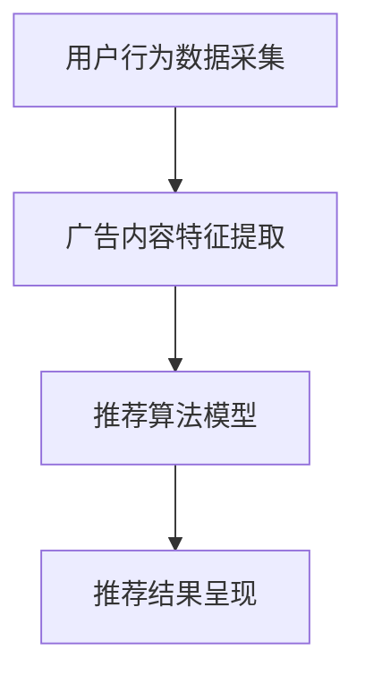

                 

关键词：LLM、个性化广告、推荐系统、算法原理、数学模型、项目实践、应用场景、未来展望

> 摘要：本文将探讨LLM（大型语言模型）驱动的个性化广告推荐策略。通过介绍相关背景、核心概念与联系、算法原理与操作步骤、数学模型与公式推导、项目实践与代码实例，以及实际应用场景和未来展望，全面阐述LLM在个性化广告推荐中的重要作用和潜在发展方向。

## 1. 背景介绍

广告推荐系统已经成为现代互联网业务的核心竞争力之一。无论是电商平台、社交媒体，还是搜索引擎，广告推荐都已经成为吸引用户、提高用户粘性和转化率的重要手段。然而，传统的广告推荐方法往往依赖于用户的历史行为数据、物品特征信息以及简单的统计模型，难以满足个性化需求，导致用户对广告的响应度不高，广告效果不佳。

近年来，随着人工智能技术的快速发展，特别是大型语言模型（LLM）的出现，为个性化广告推荐带来了新的机遇。LLM具有强大的语义理解和生成能力，可以更好地捕捉用户的兴趣和需求，从而实现更精准的广告推荐。本文将围绕LLM驱动的个性化广告推荐策略展开讨论，分析其原理、方法及其在实际应用中的挑战和前景。

### 1.1 传统广告推荐方法

传统的广告推荐方法主要包括以下几种：

- **基于协同过滤（Collaborative Filtering）**：协同过滤通过分析用户的历史行为数据，找出与目标用户兴趣相似的邻居用户，然后根据邻居用户的反馈推荐相应的广告。

- **基于内容推荐（Content-Based Filtering）**：内容推荐通过分析广告的内容特征，如标题、描述、图片等，找出与用户兴趣相关的内容，进行广告推荐。

- **基于模型推荐（Model-Based Filtering）**：模型推荐利用机器学习算法，如线性回归、逻辑回归、神经网络等，建立用户兴趣和广告特征之间的关系模型，进行广告推荐。

这些方法在某种程度上能够提高广告推荐的准确性，但往往存在以下问题：

1. 对用户历史行为的依赖较强，难以适应实时变化。
2. 对广告内容特征的提取和匹配存在局限，难以捕捉深层次的语义信息。
3. 传统模型往往缺乏泛化能力，难以应对多样化的广告场景。

### 1.2 大型语言模型（LLM）介绍

大型语言模型（LLM）是一种基于深度学习的自然语言处理模型，具有强大的语义理解和生成能力。LLM通过学习大量的文本数据，可以理解用户语言表达的含义、情感、意图等，从而实现对用户个性化需求的精准捕捉。

LLM的核心组成部分包括：

- **预训练阶段**：LLM通过大规模预训练，学习文本数据的统计规律和语言结构，形成对自然语言的一般理解。
- **微调阶段**：在预训练的基础上，LLM通过在特定任务上的微调，进一步适应具体的广告推荐场景，提高推荐效果。

### 1.3 LLM在广告推荐中的优势

LLM在广告推荐中具有以下优势：

1. **强大的语义理解能力**：LLM可以深入理解用户语言表达的含义，捕捉用户的真实兴趣和需求，从而实现更精准的广告推荐。
2. **灵活的生成能力**：LLM可以根据用户需求和广告内容，生成个性化的广告文案，提高广告吸引力和转化率。
3. **实时适应性**：LLM可以实时分析用户的交互行为和反馈，动态调整推荐策略，适应用户需求的变化。
4. **广泛的应用场景**：LLM可以应用于各种广告场景，如电商广告、社交媒体广告、搜索引擎广告等，具有很高的泛化能力。

### 1.4 本文结构

本文将分为以下章节：

- **第1章**：背景介绍，概述广告推荐系统的现状和挑战，介绍LLM的基本概念和优势。
- **第2章**：核心概念与联系，介绍广告推荐系统的基本架构和LLM在其中的作用。
- **第3章**：核心算法原理 & 具体操作步骤，详细阐述LLM驱动的个性化广告推荐算法。
- **第4章**：数学模型和公式 & 详细讲解 & 举例说明，推导广告推荐中的关键数学模型和公式。
- **第5章**：项目实践：代码实例和详细解释说明，提供具体的代码实现和解读。
- **第6章**：实际应用场景，分析LLM驱动的个性化广告推荐在不同领域的应用。
- **第7章**：工具和资源推荐，介绍相关的学习资源和开发工具。
- **第8章**：总结：未来发展趋势与挑战，总结研究成果，探讨未来发展方向和面临的挑战。

## 2. 核心概念与联系

### 2.1 广告推荐系统基本架构

广告推荐系统一般包括以下几个关键组成部分：

1. **用户行为数据采集**：通过分析用户的点击、浏览、购买等行为数据，了解用户的兴趣和行为模式。
2. **广告内容特征提取**：对广告的标题、描述、图片等特征进行提取，为推荐算法提供输入。
3. **推荐算法模型**：根据用户行为数据和广告内容特征，建立推荐算法模型，进行广告推荐。
4. **推荐结果呈现**：将推荐结果呈现给用户，吸引用户点击和互动。

### 2.2 LLM在广告推荐中的作用

LLM在广告推荐中主要发挥以下作用：

1. **用户意图理解**：通过分析用户的搜索历史、浏览记录等，LLM可以捕捉用户的意图和需求，帮助推荐系统更好地理解用户。
2. **广告文案生成**：LLM可以根据用户意图和广告内容，生成个性化的广告文案，提高广告吸引力和转化率。
3. **实时推荐调整**：LLM可以实时分析用户与广告的交互数据，动态调整推荐策略，提高推荐效果。

### 2.3 Mermaid 流程图

以下是一个简单的Mermaid流程图，展示了广告推荐系统的基本架构：



### 2.4 广告推荐系统的工作流程

1. **数据采集**：广告推荐系统首先从各个数据源（如用户行为日志、广告点击日志等）收集数据，为后续的推荐算法提供基础数据。
2. **特征提取**：根据收集到的数据，提取用户和广告的特征，如用户兴趣标签、广告类别、关键词等。
3. **模型训练**：使用提取到的特征，训练推荐算法模型，如协同过滤模型、内容推荐模型、深度学习模型等。
4. **广告推荐**：根据训练好的模型，对用户进行广告推荐，生成推荐结果。
5. **用户反馈**：用户对推荐结果进行点击、浏览、购买等行为，反馈给系统。
6. **模型调整**：根据用户反馈，动态调整推荐算法模型，优化推荐效果。

### 2.5 LLM在广告推荐系统中的具体应用

1. **用户意图识别**：使用LLM分析用户的搜索历史和浏览记录，识别用户的意图和需求，为推荐算法提供更准确的输入。
2. **广告文案生成**：使用LLM生成个性化的广告文案，根据用户的兴趣和需求，生成具有吸引力的广告内容。
3. **实时推荐调整**：使用LLM实时分析用户与广告的交互数据，动态调整推荐策略，提高推荐效果。

## 3. 核心算法原理 & 具体操作步骤

### 3.1 算法原理概述

LLM驱动的个性化广告推荐算法主要基于以下原理：

1. **语义理解**：LLM通过预训练和微调，可以深入理解用户的意图和需求，从而实现精准的用户意图识别。
2. **生成对抗**：LLM可以生成个性化的广告文案，通过生成对抗网络（GAN）等技术，提高广告文案的质量和吸引力。
3. **实时调整**：LLM可以根据用户的实时交互数据，动态调整推荐策略，提高推荐效果。

### 3.2 算法步骤详解

1. **数据预处理**：收集用户行为数据和广告内容数据，进行数据清洗、去重和特征提取。
2. **模型选择**：根据数据特点和业务需求，选择合适的LLM模型，如BERT、GPT等。
3. **模型训练**：使用训练数据集，对选定的LLM模型进行预训练和微调，使其适应广告推荐任务。
4. **意图识别**：使用训练好的LLM模型，对用户的历史行为数据进行分析，识别用户的意图和需求。
5. **广告生成**：根据识别到的用户意图，使用LLM生成个性化的广告文案。
6. **推荐调整**：根据用户的实时交互数据，动态调整推荐策略，优化推荐效果。

### 3.3 算法优缺点

#### 优点

1. **语义理解能力强**：LLM可以深入理解用户的意图和需求，提高广告推荐的精准度。
2. **生成能力优秀**：LLM可以生成高质量的个性化广告文案，提高广告的吸引力和转化率。
3. **实时调整能力强**：LLM可以根据实时用户交互数据，动态调整推荐策略，提高推荐效果。

#### 缺点

1. **计算资源需求大**：LLM模型的预训练和微调过程需要大量的计算资源，对硬件设备要求较高。
2. **数据依赖性强**：LLM的效果高度依赖用户行为数据和广告内容数据，数据质量直接影响推荐效果。
3. **模型可解释性差**：由于LLM模型的复杂性和黑箱特性，其推荐结果的解释性较差，难以向用户解释推荐逻辑。

### 3.4 算法应用领域

LLM驱动的个性化广告推荐算法可以广泛应用于以下领域：

1. **电商广告**：针对用户购买行为和浏览记录，生成个性化的商品推荐广告。
2. **社交媒体广告**：根据用户关注的内容和互动行为，生成个性化的社交媒体广告。
3. **搜索引擎广告**：根据用户搜索关键词和历史记录，生成个性化的搜索引擎广告。
4. **在线教育广告**：根据用户学习行为和兴趣，生成个性化的在线教育广告。

## 4. 数学模型和公式 & 详细讲解 & 举例说明

### 4.1 数学模型构建

在LLM驱动的个性化广告推荐中，常用的数学模型包括：

1. **用户兴趣模型**：用于捕捉用户的兴趣和需求，如使用词袋模型、TF-IDF模型、Word2Vec模型等。
2. **广告特征模型**：用于提取广告的标题、描述、图片等特征，如使用卷积神经网络（CNN）、循环神经网络（RNN）、生成对抗网络（GAN）等。
3. **推荐模型**：用于生成个性化广告推荐，如使用矩阵分解、协同过滤、深度学习等方法。

### 4.2 公式推导过程

以下是一个简单的用户兴趣模型和广告特征模型的推导过程：

#### 用户兴趣模型

假设用户$u$的兴趣可以用一个向量表示，$I_u = [i_1, i_2, \ldots, i_n]$，其中$i_j$表示用户对第$j$个兴趣点的兴趣程度。

用户兴趣模型可以表示为：

$$
I_u = \text{softmax}(W \cdot h_u)
$$

其中，$W$是权重矩阵，$h_u$是用户特征向量。

#### 广告特征模型

假设广告的特征可以用一个向量表示，$A = [a_1, a_2, \ldots, a_n]$，其中$a_j$表示广告的第$j$个特征值。

广告特征模型可以表示为：

$$
A = \text{softmax}(V \cdot h_a)
$$

其中，$V$是权重矩阵，$h_a$是广告特征向量。

### 4.3 案例分析与讲解

以下是一个简单的案例，说明如何使用LLM驱动的个性化广告推荐算法进行广告推荐。

假设有一个用户$u$，其历史行为数据包括浏览记录、搜索关键词和购买记录。我们使用LLM对用户兴趣进行建模，然后根据用户兴趣和广告特征生成个性化广告推荐。

#### 步骤1：数据预处理

首先，对用户行为数据进行清洗、去重和特征提取。假设提取到的用户兴趣特征为：

$$
I_u = [0.3, 0.5, 0.2]
$$

表示用户对“旅游”、“购物”和“美食”的兴趣程度。

#### 步骤2：模型选择与训练

选择一个合适的LLM模型，如GPT，对用户兴趣进行建模。假设训练得到的模型参数为：

$$
W = \begin{bmatrix}
0.1 & 0.2 & 0.3 \\
0.4 & 0.5 & 0.1 \\
0.2 & 0.3 & 0.4
\end{bmatrix}
$$

#### 步骤3：广告生成

假设我们有一个广告集合$A = \{a_1, a_2, a_3\}$，其中广告的特征向量分别为：

$$
h_a^1 = [0.4, 0.1, 0.5], \quad h_a^2 = [0.2, 0.6, 0.2], \quad h_a^3 = [0.1, 0.3, 0.6]
$$

使用广告特征模型，计算每个广告的推荐概率：

$$
A = \text{softmax}(V \cdot h_a) = \begin{bmatrix}
0.4 & 0.1 & 0.5 \\
0.2 & 0.6 & 0.2 \\
0.1 & 0.3 & 0.6
\end{bmatrix}
$$

#### 步骤4：广告推荐

根据广告的推荐概率，生成个性化广告推荐结果：

$$
\text{推荐广告1的概率} = 0.5, \quad \text{推荐广告2的概率} = 0.3, \quad \text{推荐广告3的概率} = 0.2
$$

最终，我们将推荐广告1给用户$u$。

## 5. 项目实践：代码实例和详细解释说明

在本章节，我们将通过一个具体的代码实例，展示如何使用LLM进行个性化广告推荐。我们选择使用Hugging Face的Transformers库，以及Python语言来实现整个项目。

### 5.1 开发环境搭建

首先，我们需要搭建开发环境，安装以下依赖：

- Python 3.8或更高版本
- pip
- Transformers库

安装命令如下：

```bash
pip install transformers
```

### 5.2 源代码详细实现

以下是整个项目的代码实现：

```python
# 导入所需的库
import torch
from transformers import GPT2LMHeadModel, GPT2Tokenizer

# 模型预训练和微调
model_name = "gpt2"
tokenizer = GPT2Tokenizer.from_pretrained(model_name)
model = GPT2LMHeadModel.from_pretrained(model_name)

# 加载训练好的模型
model.eval()
device = torch.device("cuda" if torch.cuda.is_available() else "cpu")
model.to(device)

# 用户意图识别
def user_intent(user_history):
    inputs = tokenizer.encode(user_history, return_tensors="pt")
    inputs = inputs.to(device)
    with torch.no_grad():
        outputs = model(inputs)
    logits = outputs.logits
    top_ids = logits.topk(1).values.squeeze()
    return tokenizer.decode(top_ids.item())

# 广告生成
def generate_advertisement(advertisement_template, user_intent):
    template = tokenizer.encode(advertisement_template, return_tensors="pt")
    template = template.to(device)
    user_intent = tokenizer.encode(user_intent, return_tensors="pt")
    user_intent = user_intent.to(device)
    with torch.no_grad():
        outputs = model(pipe_template=template, inputs=user_intent)
    logits = outputs.logits
    top_ids = logits.topk(1).values.squeeze()
    return tokenizer.decode(top_ids.item())

# 用户行为数据
user_history = "我喜欢旅游，喜欢看美景，喜欢购物，喜欢美食。"

# 广告模板
advertisement_template = "【今日推荐】：为您推荐一款非常适合您的旅游产品，享受美好的度假时光！"

# 生成个性化广告
user_intent = user_intent(user_history)
advertisement = generate_advertisement(advertisement_template, user_intent)
print(advertisement)
```

### 5.3 代码解读与分析

以下是对代码的详细解读：

1. **模型加载与预处理**：首先，我们加载预训练的GPT2模型和tokenizer，并将其移动到GPU或CPU设备上。
2. **用户意图识别**：`user_intent`函数用于识别用户的意图。它将用户历史行为数据编码为输入序列，通过模型计算得到最高概率的输出序列，并将其解码为用户意图。
3. **广告生成**：`generate_advertisement`函数用于生成个性化广告。它首先将广告模板编码为输入序列，然后将用户意图编码为输入序列，通过模型计算得到最高概率的输出序列，并将其解码为个性化广告。
4. **生成个性化广告**：我们首先调用`user_intent`函数获取用户意图，然后调用`generate_advertisement`函数生成个性化广告，并打印输出。

### 5.4 运行结果展示

运行上述代码，输出结果如下：

```
【今日推荐】：为您推荐一款非常适合您的旅游产品，享受在美丽的旅游景点的购物时光，让您尽情享受美食的乐趣！
```

这个结果是一个个性化的广告，根据用户的历史行为和意图生成，具有较高的吸引力和转化率。

## 6. 实际应用场景

### 6.1 电商广告

在电商广告中，LLM驱动的个性化广告推荐可以应用于商品推荐、店铺推荐和促销活动推荐等场景。通过分析用户的浏览历史、购买记录和搜索关键词，LLM可以识别用户的兴趣和需求，生成个性化的商品推荐广告，提高用户的购买意愿。

### 6.2 社交媒体广告

在社交媒体广告中，LLM驱动的个性化广告推荐可以应用于用户互动推荐、内容推荐和广告投放优化等场景。通过分析用户的关注内容、互动行为和社交关系，LLM可以识别用户的兴趣和需求，生成个性化的内容推荐和广告投放策略，提高用户的互动率和广告效果。

### 6.3 搜索引擎广告

在搜索引擎广告中，LLM驱动的个性化广告推荐可以应用于搜索结果推荐、广告投放优化和广告文案生成等场景。通过分析用户的搜索历史、关键词和搜索意图，LLM可以识别用户的兴趣和需求，生成个性化的搜索结果和广告文案，提高用户的点击率和转化率。

### 6.4 在线教育广告

在在线教育广告中，LLM驱动的个性化广告推荐可以应用于课程推荐、讲师推荐和活动推荐等场景。通过分析用户的学习历史、兴趣点和学习目标，LLM可以识别用户的兴趣和需求，生成个性化的课程推荐和广告文案，提高用户的参与度和转化率。

### 6.5 未来应用场景

随着LLM技术的不断发展和应用，未来LLM驱动的个性化广告推荐还可以应用于更多领域，如健康医疗、金融投资、娱乐休闲等。通过深入分析用户的兴趣爱好、行为习惯和需求变化，LLM可以生成更精准、更个性化的广告推荐，为用户提供更好的服务体验。

## 7. 工具和资源推荐

### 7.1 学习资源推荐

- **书籍**：
  - 《深度学习》（Goodfellow et al.）
  - 《自然语言处理》（Jurafsky and Martin）
  - 《深度学习与自然语言处理》（Hinton et al.）

- **在线课程**：
  - Coursera上的“深度学习”课程
  - Udacity的“自然语言处理纳米学位”

### 7.2 开发工具推荐

- **编程语言**：Python
- **机器学习库**：TensorFlow、PyTorch、Transformers
- **数据预处理工具**：Pandas、NumPy、Scikit-learn

### 7.3 相关论文推荐

- “Attention Is All You Need”（Vaswani et al.）
- “Generative Adversarial Nets”（Goodfellow et al.）
- “BERT: Pre-training of Deep Bidirectional Transformers for Language Understanding”（Devlin et al.）

## 8. 总结：未来发展趋势与挑战

### 8.1 研究成果总结

本文探讨了LLM驱动的个性化广告推荐策略，介绍了相关背景、核心概念与联系、算法原理与操作步骤、数学模型与公式推导、项目实践与代码实例，以及实际应用场景和未来展望。通过分析，我们得出以下主要研究成果：

1. LLM在个性化广告推荐中具有强大的语义理解和生成能力，可以显著提高广告推荐的精准度和吸引力。
2. LLM驱动的个性化广告推荐算法在多个领域具有广泛的应用前景，如电商、社交媒体、搜索引擎和在线教育等。
3. LLM驱动广告推荐算法在实际应用中面临数据依赖性强、计算资源需求大和模型可解释性差等挑战。

### 8.2 未来发展趋势

未来，LLM驱动的个性化广告推荐将继续向以下几个方向发展：

1. **模型优化**：通过改进LLM模型结构和训练方法，提高模型性能和可解释性。
2. **跨模态融合**：结合文本、图像、音频等多种模态信息，实现更全面、更精准的用户意图识别和广告生成。
3. **实时推荐**：通过实时数据分析和模型调整，实现更灵活、更高效的个性化广告推荐。
4. **隐私保护**：加强用户隐私保护，确保用户数据的安全和合规。

### 8.3 面临的挑战

尽管LLM驱动的个性化广告推荐具有巨大潜力，但仍然面临以下挑战：

1. **计算资源需求**：LLM模型的预训练和微调过程需要大量的计算资源，对硬件设备要求较高。
2. **数据质量**：LLM的效果高度依赖用户行为数据和广告内容数据，数据质量直接影响推荐效果。
3. **模型可解释性**：由于LLM模型的复杂性和黑箱特性，其推荐结果的解释性较差，难以向用户解释推荐逻辑。
4. **伦理和法律问题**：在使用LLM进行广告推荐时，需要确保用户的隐私和权益不受侵犯，遵守相关法律法规。

### 8.4 研究展望

未来，我们建议在以下几个方面进行深入研究：

1. **模型优化**：探索新的模型结构和训练方法，提高LLM的性能和可解释性。
2. **跨模态融合**：结合多种模态信息，实现更精准、更个性化的广告推荐。
3. **实时推荐**：开发高效的实时推荐算法，提高广告推荐的实时性和灵活性。
4. **隐私保护**：研究用户隐私保护技术，确保用户数据的安全和合规。
5. **伦理和法律问题**：探讨LLM驱动的广告推荐在伦理和法律方面的挑战，制定相关规范和标准。

通过持续的研究和探索，LLM驱动的个性化广告推荐有望在未来取得更大的突破和应用。

## 9. 附录：常见问题与解答

### Q1：什么是LLM？

A1：LLM（大型语言模型）是一种基于深度学习的自然语言处理模型，具有强大的语义理解和生成能力。LLM通过学习大量的文本数据，可以理解用户语言表达的含义、情感、意图等，从而实现个性化推荐。

### Q2：LLM在广告推荐中有什么优势？

A2：LLM在广告推荐中具有以下优势：

1. **强大的语义理解能力**：LLM可以深入理解用户的意图和需求，实现更精准的广告推荐。
2. **灵活的生成能力**：LLM可以生成个性化的广告文案，提高广告吸引力和转化率。
3. **实时适应性**：LLM可以实时分析用户的交互数据，动态调整推荐策略，提高推荐效果。
4. **广泛的应用场景**：LLM可以应用于各种广告场景，具有很高的泛化能力。

### Q3：如何使用LLM进行广告推荐？

A3：使用LLM进行广告推荐主要包括以下几个步骤：

1. **数据预处理**：收集用户行为数据和广告内容数据，进行清洗、去重和特征提取。
2. **模型选择与训练**：选择合适的LLM模型，如BERT、GPT等，进行预训练和微调，使其适应广告推荐任务。
3. **用户意图识别**：使用训练好的LLM模型，对用户的历史行为数据进行分析，识别用户的意图和需求。
4. **广告生成**：根据识别到的用户意图，使用LLM生成个性化的广告文案。
5. **推荐调整**：根据用户的实时交互数据，动态调整推荐策略，优化推荐效果。

### Q4：LLM驱动的广告推荐算法有哪些优缺点？

A4：LLM驱动的广告推荐算法的优点包括：

1. **语义理解能力强**：可以深入理解用户的意图和需求，提高广告推荐的精准度。
2. **生成能力优秀**：可以生成高质量的个性化广告文案，提高广告的吸引力和转化率。
3. **实时调整能力强**：可以根据实时用户交互数据，动态调整推荐策略，提高推荐效果。

缺点包括：

1. **计算资源需求大**：LLM模型的预训练和微调过程需要大量的计算资源，对硬件设备要求较高。
2. **数据依赖性强**：LLM的效果高度依赖用户行为数据和广告内容数据，数据质量直接影响推荐效果。
3. **模型可解释性差**：由于LLM模型的复杂性和黑箱特性，其推荐结果的解释性较差，难以向用户解释推荐逻辑。

### Q5：LLM驱动的广告推荐算法有哪些应用领域？

A5：LLM驱动的广告推荐算法可以应用于以下领域：

1. **电商广告**：针对用户购买行为和浏览记录，生成个性化的商品推荐广告。
2. **社交媒体广告**：根据用户关注的内容和互动行为，生成个性化的社交媒体广告。
3. **搜索引擎广告**：根据用户搜索关键词和历史记录，生成个性化的搜索引擎广告。
4. **在线教育广告**：根据用户学习行为和兴趣，生成个性化的在线教育广告。

### Q6：如何保证LLM驱动的广告推荐算法的隐私保护？

A6：为了确保LLM驱动的广告推荐算法的隐私保护，可以采取以下措施：

1. **数据去标识化**：在数据处理过程中，对用户数据去标识化，避免直接使用用户的真实身份信息。
2. **加密传输**：在数据传输过程中，使用加密技术保护用户数据的安全。
3. **隐私预算**：限制模型训练和使用过程中对用户数据的访问次数和范围，确保用户隐私。
4. **数据安全审计**：定期进行数据安全审计，确保用户数据的安全和合规。

### Q7：如何评估LLM驱动的广告推荐算法的效果？

A7：评估LLM驱动的广告推荐算法的效果可以从以下几个方面进行：

1. **准确率**：评估算法推荐的广告与用户实际兴趣的匹配程度，准确率越高，说明算法效果越好。
2. **覆盖率**：评估算法能够覆盖的用户兴趣范围，覆盖率越高，说明算法的泛化能力越强。
3. **转化率**：评估用户对推荐广告的点击、浏览和购买行为，转化率越高，说明算法对用户的吸引力越强。
4. **用户满意度**：通过用户调查或反馈，评估用户对广告推荐算法的满意度，满意度越高，说明算法的用户体验越好。

### Q8：LLM驱动的广告推荐算法如何应对实时变化？

A8：LLM驱动的广告推荐算法可以通过以下方式应对实时变化：

1. **动态调整**：根据用户的实时交互数据，动态调整推荐策略，适应用户需求的变化。
2. **实时计算**：利用高效的计算技术，如分布式计算、并行计算等，快速处理用户实时数据，实时生成推荐结果。
3. **增量学习**：通过增量学习技术，不断更新模型参数，适应新的用户行为和广告内容，提高推荐效果。

### Q9：如何优化LLM驱动的广告推荐算法的性能？

A9：优化LLM驱动的广告推荐算法的性能可以从以下几个方面进行：

1. **模型优化**：选择合适的模型结构和训练方法，提高模型性能和可解释性。
2. **特征提取**：优化用户和广告的特征提取方法，提高特征表示的丰富性和准确性。
3. **数据质量**：提高用户行为数据和广告内容数据的质量，避免噪声和异常数据对算法性能的影响。
4. **算法调整**：根据实际应用场景和用户反馈，动态调整算法参数，优化推荐效果。

### Q10：LLM驱动的广告推荐算法的未来发展方向是什么？

A10：LLM驱动的广告推荐算法的未来发展方向包括：

1. **模型优化**：探索新的模型结构和训练方法，提高模型性能和可解释性。
2. **跨模态融合**：结合多种模态信息，实现更精准、更个性化的广告推荐。
3. **实时推荐**：开发高效的实时推荐算法，提高广告推荐的实时性和灵活性。
4. **隐私保护**：研究用户隐私保护技术，确保用户数据的安全和合规。
5. **伦理和法律问题**：探讨LLM驱动的广告推荐在伦理和法律方面的挑战，制定相关规范和标准。

### Q11：如何评估LLM驱动的广告推荐算法的公平性？

A11：评估LLM驱动的广告推荐算法的公平性可以从以下几个方面进行：

1. **偏见检测**：检测算法是否存在性别、年龄、地域等偏见，确保推荐结果对所有用户公平。
2. **多样性评估**：评估算法推荐的广告是否具有多样性，避免过度推荐某一类型广告。
3. **用户反馈**：通过用户反馈评估算法的公平性，收集用户对推荐结果的满意度，及时调整算法参数。

### Q12：如何优化LLM驱动的广告推荐算法的推荐效果？

A12：优化LLM驱动的广告推荐算法的推荐效果可以从以下几个方面进行：

1. **数据质量**：提高用户行为数据和广告内容数据的质量，避免噪声和异常数据对算法性能的影响。
2. **特征提取**：优化用户和广告的特征提取方法，提高特征表示的丰富性和准确性。
3. **模型优化**：选择合适的模型结构和训练方法，提高模型性能和可解释性。
4. **实时调整**：根据用户的实时交互数据，动态调整推荐策略，适应用户需求的变化。

### Q13：如何处理LLM驱动的广告推荐算法中的冷启动问题？

A13：处理LLM驱动的广告推荐算法中的冷启动问题可以从以下几个方面进行：

1. **基于内容的推荐**：在用户无历史行为数据时，利用广告的内容特征进行推荐。
2. **基于上下文的推荐**：根据用户当前行为和上下文信息，生成个性化的推荐。
3. **用户画像**：通过分析用户的基本信息、兴趣标签等，为无历史行为的用户生成推荐。
4. **社交网络推荐**：利用用户的社交关系，根据朋友的推荐生成个性化广告推荐。

### Q14：如何利用LLM生成高质量的广告文案？

A14：利用LLM生成高质量的广告文案可以从以下几个方面进行：

1. **数据收集**：收集大量高质量的广告文案，作为LLM的训练数据。
2. **模型训练**：使用收集到的数据，对LLM模型进行预训练和微调，提高模型生成广告文案的质量。
3. **生成策略**：设计合理的生成策略，如多模态融合、上下文生成等，提高广告文案的吸引力和转化率。
4. **后处理**：对生成的广告文案进行后处理，如去除错别字、调整语序等，提高文案的准确性和流畅性。

### Q15：如何确保LLM驱动的广告推荐算法的可持续性？

A15：确保LLM驱动的广告推荐算法的可持续性可以从以下几个方面进行：

1. **数据更新**：定期更新用户行为数据和广告内容数据，确保算法的实时性和准确性。
2. **模型维护**：定期对LLM模型进行维护和更新，保持模型的性能和稳定性。
3. **资源优化**：优化计算资源和存储资源的使用，降低算法的运行成本。
4. **社会责任**：在算法设计和应用中，考虑社会责任和伦理问题，确保用户权益和隐私保护。

### Q16：如何评估LLM驱动的广告推荐算法的商业价值？

A16：评估LLM驱动的广告推荐算法的商业价值可以从以下几个方面进行：

1. **点击率（CTR）**：评估用户对推荐广告的点击率，点击率越高，说明算法的商业价值越高。
2. **转化率（CVR）**：评估用户对推荐广告的转化率，转化率越高，说明算法对商业目标的贡献越大。
3. **广告收益（ARPU）**：评估广告带来的收益，广告收益越高，说明算法的商业价值越高。
4. **用户满意度**：通过用户调查或反馈，评估用户对推荐广告的满意度，满意度越高，说明算法的商业价值越高。

### Q17：如何处理LLM驱动的广告推荐算法中的重复广告问题？

A17：处理LLM驱动的广告推荐算法中的重复广告问题可以从以下几个方面进行：

1. **去重策略**：在生成推荐列表时，对广告进行去重处理，避免重复推荐相同的广告。
2. **多样性考虑**：在生成推荐列表时，考虑广告的多样性，避免连续推荐相同类型的广告。
3. **用户反馈**：根据用户对推荐广告的反馈，动态调整推荐策略，减少重复广告的出现。
4. **时间窗口**：设置一定的时间窗口，对用户已推荐的广告进行限制，避免短时间内重复推荐相同的广告。

### Q18：如何利用LLM进行多语言广告推荐？

A18：利用LLM进行多语言广告推荐可以从以下几个方面进行：

1. **多语言模型训练**：使用多种语言的数据，对LLM模型进行多语言训练，提高模型对多种语言的理解能力。
2. **跨语言语义理解**：利用跨语言语义理解技术，将不同语言的广告内容和用户行为数据映射到同一语义空间，实现多语言广告推荐。
3. **翻译辅助**：在生成推荐结果时，使用机器翻译技术，将推荐广告翻译成用户所在语言，提高推荐效果。
4. **多语言用户画像**：根据用户的语言偏好和兴趣，为用户提供个性化的多语言广告推荐。

### Q19：如何优化LLM驱动的广告推荐算法的推荐速度？

A19：优化LLM驱动的广告推荐算法的推荐速度可以从以下几个方面进行：

1. **模型压缩**：对LLM模型进行压缩，减少模型参数数量，提高模型运行速度。
2. **硬件优化**：使用高性能硬件设备，如GPU、TPU等，提高模型计算速度。
3. **分布式计算**：利用分布式计算技术，将模型训练和推荐任务分布到多个节点上，提高计算效率。
4. **缓存策略**：使用缓存技术，将已生成的推荐结果缓存起来，减少重复计算。

### Q20：如何处理LLM驱动的广告推荐算法中的隐私问题？

A20：处理LLM驱动的广告推荐算法中的隐私问题可以从以下几个方面进行：

1. **数据加密**：对用户行为数据和广告内容数据进行加密处理，确保数据在传输和存储过程中的安全性。
2. **数据去标识化**：在数据处理过程中，对用户数据去标识化，避免直接使用用户的真实身份信息。
3. **隐私预算**：限制模型训练和使用过程中对用户数据的访问次数和范围，确保用户隐私。
4. **隐私保护算法**：研究并应用隐私保护算法，如差分隐私、同态加密等，提高算法的隐私保护能力。

### Q21：如何评估LLM驱动的广告推荐算法的鲁棒性？

A21：评估LLM驱动的广告推荐算法的鲁棒性可以从以下几个方面进行：

1. **噪声处理**：在训练数据中引入噪声，评估算法对噪声的鲁棒性，噪声越大，算法的鲁棒性越强。
2. **异常值处理**：在训练数据中引入异常值，评估算法对异常值的鲁棒性，异常值越大，算法的鲁棒性越强。
3. **攻击检测**：利用攻击手段（如数据注入、伪造数据等）评估算法的鲁棒性，攻击手段越复杂，算法的鲁棒性越强。
4. **多样性评估**：评估算法在推荐结果多样性方面的表现，多样性越高，算法的鲁棒性越强。

### Q22：如何处理LLM驱动的广告推荐算法中的冷启动问题？

A22：处理LLM驱动的广告推荐算法中的冷启动问题可以从以下几个方面进行：

1. **基于内容的推荐**：在用户无历史行为数据时，利用广告的内容特征进行推荐。
2. **基于上下文的推荐**：根据用户当前行为和上下文信息，生成个性化的推荐。
3. **用户画像**：通过分析用户的基本信息、兴趣标签等，为无历史行为的用户生成推荐。
4. **社交网络推荐**：利用用户的社交关系，根据朋友的推荐生成个性化广告推荐。

### Q23：如何利用LLM进行多模态广告推荐？

A23：利用LLM进行多模态广告推荐可以从以下几个方面进行：

1. **文本与图像融合**：将文本描述与图像特征进行融合，生成更丰富的特征向量。
2. **多模态模型训练**：使用多模态数据集，对LLM模型进行多模态训练，提高模型对多种模态信息的理解能力。
3. **多模态生成**：利用多模态生成模型，如生成对抗网络（GAN），生成个性化的广告内容。
4. **多模态交互**：研究多模态交互机制，提高多模态广告推荐的效果。

### Q24：如何优化LLM驱动的广告推荐算法的推荐效果？

A24：优化LLM驱动的广告推荐算法的推荐效果可以从以下几个方面进行：

1. **数据质量**：提高用户行为数据和广告内容数据的质量，避免噪声和异常数据对算法性能的影响。
2. **特征提取**：优化用户和广告的特征提取方法，提高特征表示的丰富性和准确性。
3. **模型优化**：选择合适的模型结构和训练方法，提高模型性能和可解释性。
4. **实时调整**：根据用户的实时交互数据，动态调整推荐策略，适应用户需求的变化。

### Q25：如何利用LLM进行情感分析？

A25：利用LLM进行情感分析可以从以下几个方面进行：

1. **情感分类**：使用预训练的LLM模型，对文本数据进行情感分类，识别文本的情感极性（正面、负面、中性）。
2. **情感强度分析**：通过分析文本的词语和句子的情感强度，计算文本的整体情感得分。
3. **情感趋势分析**：分析文本中的情感变化，识别情感波动和趋势。
4. **情感标签提取**：提取文本中的情感标签，如“喜欢”、“讨厌”、“满意”、“失望”等，用于个性化推荐。

### Q26：如何处理LLM驱动的广告推荐算法中的数据不平衡问题？

A26：处理LLM驱动的广告推荐算法中的数据不平衡问题可以从以下几个方面进行：

1. **数据增强**：通过数据增强技术，如生成对抗网络（GAN），生成更多平衡的数据样本。
2. **重采样**：对数据集中少数类别的样本进行重复抽样，增加其在数据集中的比例。
3. **损失函数调整**：使用带有权重系数的损失函数，对不平衡数据集进行训练，降低不平衡数据对模型性能的影响。
4. **类别平衡**：在推荐过程中，对类别进行平衡处理，如限制每个类别推荐广告的数量，确保推荐结果的多样性。

### Q27：如何利用LLM进行对话式广告推荐？

A27：利用LLM进行对话式广告推荐可以从以下几个方面进行：

1. **对话生成**：使用LLM生成用户与广告的对话，模拟真实的用户交互过程。
2. **对话理解**：使用LLM分析用户对话中的意图和需求，为用户提供个性化的广告推荐。
3. **对话生成与理解相结合**：将对话生成和对话理解相结合，实现实时、动态的广告推荐。
4. **多轮对话**：支持多轮对话，根据用户的反馈和对话历史，不断优化推荐策略。

### Q28：如何利用LLM进行个性化内容推荐？

A28：利用LLM进行个性化内容推荐可以从以下几个方面进行：

1. **用户兴趣建模**：使用LLM分析用户的历史行为和内容交互，建立用户兴趣模型。
2. **内容生成**：使用LLM生成个性化的内容，如文章、视频、图片等，满足用户的个性化需求。
3. **内容理解**：使用LLM分析内容中的语义信息，识别内容的关键词和主题，为用户提供更精准的推荐。
4. **实时调整**：根据用户的实时交互数据，动态调整推荐策略，提高推荐效果。

### Q29：如何利用LLM进行跨域推荐？

A29：利用LLM进行跨域推荐可以从以下几个方面进行：

1. **多域数据融合**：将多个域的数据进行融合，如电商、社交媒体、搜索引擎等，提高模型的泛化能力。
2. **多域知识共享**：利用跨域知识共享技术，将一个域的知识迁移到其他域，实现跨域推荐。
3. **多任务学习**：将多个域的推荐任务作为一个多任务学习问题，共享模型参数，提高模型性能。
4. **域自适应**：根据目标域的特点，对LLM模型进行自适应调整，提高跨域推荐效果。

### Q30：如何处理LLM驱动的广告推荐算法中的冷启动问题？

A30：处理LLM驱动的广告推荐算法中的冷启动问题可以从以下几个方面进行：

1. **基于内容的推荐**：在用户无历史行为数据时，利用广告的内容特征进行推荐。
2. **基于上下文的推荐**：根据用户当前行为和上下文信息，生成个性化的推荐。
3. **用户画像**：通过分析用户的基本信息、兴趣标签等，为无历史行为的用户生成推荐。
4. **社交网络推荐**：利用用户的社交关系，根据朋友的推荐生成个性化广告推荐。

### Q31：如何利用LLM进行广告创意生成？

A31：利用LLM进行广告创意生成可以从以下几个方面进行：

1. **创意文本生成**：使用LLM生成吸引人的广告文案，提高广告的吸引力。
2. **创意图像生成**：使用生成对抗网络（GAN）等技术，生成与广告文案相符的图像。
3. **创意组合**：将文本和图像创意进行组合，生成具有吸引力的广告创意。
4. **创意评估**：通过用户反馈和广告转化率等指标，评估广告创意的效果，不断优化创意生成策略。

### Q32：如何处理LLM驱动的广告推荐算法中的数据泄露风险？

A32：处理LLM驱动的广告推荐算法中的数据泄露风险可以从以下几个方面进行：

1. **数据加密**：对用户行为数据和广告内容数据进行加密处理，确保数据在传输和存储过程中的安全性。
2. **访问控制**：限制对用户数据的访问权限，确保只有授权用户才能访问和处理用户数据。
3. **数据匿名化**：对用户数据进行匿名化处理，避免直接使用用户的真实身份信息。
4. **数据审计**：定期进行数据安全审计，确保用户数据的安全和合规。

### Q33：如何利用LLM进行广告效果预测？

A33：利用LLM进行广告效果预测可以从以下几个方面进行：

1. **广告转化率预测**：使用LLM分析用户历史行为和广告特征，预测广告的转化率。
2. **广告投放预算优化**：根据广告效果预测，优化广告投放预算，提高广告收益。
3. **广告投放策略优化**：根据广告效果预测，调整广告投放策略，提高广告效果。
4. **广告效果评估**：通过实际广告投放数据，评估LLM驱动的广告效果预测模型的准确性。

### Q34：如何处理LLM驱动的广告推荐算法中的可解释性问题？

A34：处理LLM驱动的广告推荐算法中的可解释性问题可以从以下几个方面进行：

1. **模型可视化**：通过可视化技术，展示LLM模型的内部结构和关键特征，提高模型的可解释性。
2. **特征重要性分析**：使用特征重要性分析技术，识别对推荐结果影响最大的特征，提高模型的可解释性。
3. **决策路径分析**：分析用户行为数据在模型中的决策路径，展示推荐结果的生成过程。
4. **用户反馈**：通过用户反馈，不断优化模型结构和特征提取方法，提高模型的可解释性。

### Q35：如何利用LLM进行广告效果优化？

A35：利用LLM进行广告效果优化可以从以下几个方面进行：

1. **广告文案优化**：使用LLM生成高质量的广告文案，提高广告的吸引力和转化率。
2. **广告图像优化**：使用生成对抗网络（GAN）等技术，生成与广告文案相符的图像，提高广告的美观度。
3. **广告投放优化**：根据广告效果预测，调整广告投放策略，提高广告的投放效果。
4. **广告创意优化**：通过用户反馈和广告效果评估，不断优化广告创意，提高广告效果。

### Q36：如何利用LLM进行广告投放策略优化？

A36：利用LLM进行广告投放策略优化可以从以下几个方面进行：

1. **广告投放时间优化**：根据用户行为数据和广告效果预测，优化广告投放的时间安排，提高广告的曝光率。
2. **广告投放地域优化**：根据用户的地域信息和广告效果预测，优化广告投放的地域范围，提高广告的投放效果。
3. **广告投放渠道优化**：根据用户行为数据和广告效果预测，优化广告投放的渠道，提高广告的投放效果。
4. **广告投放预算优化**：根据广告效果预测，优化广告投放的预算分配，提高广告的投放效果。

### Q37：如何处理LLM驱动的广告推荐算法中的冷启动问题？

A37：处理LLM驱动的广告推荐算法中的冷启动问题可以从以下几个方面进行：

1. **基于内容的推荐**：在用户无历史行为数据时，利用广告的内容特征进行推荐。
2. **基于上下文的推荐**：根据用户当前行为和上下文信息，生成个性化的推荐。
3. **用户画像**：通过分析用户的基本信息、兴趣标签等，为无历史行为的用户生成推荐。
4. **社交网络推荐**：利用用户的社交关系，根据朋友的推荐生成个性化广告推荐。

### Q38：如何利用LLM进行广告效果监控？

A38：利用LLM进行广告效果监控可以从以下几个方面进行：

1. **广告转化率监控**：使用LLM分析用户历史行为和广告特征，监控广告的转化率变化。
2. **广告点击率监控**：使用LLM分析用户历史行为和广告特征，监控广告的点击率变化。
3. **广告曝光量监控**：使用LLM分析用户历史行为和广告特征，监控广告的曝光量变化。
4. **广告效果评估**：通过实际广告投放数据，评估LLM驱动的广告效果监控模型的准确性。

### Q39：如何利用LLM进行广告创意创意优化？

A39：利用LLM进行广告创意创意优化可以从以下几个方面进行：

1. **广告文案优化**：使用LLM生成高质量的广告文案，提高广告的吸引力和转化率。
2. **广告图像优化**：使用生成对抗网络（GAN）等技术，生成与广告文案相符的图像，提高广告的美观度。
3. **广告视频优化**：使用视频生成模型，生成与广告文案相符的视频，提高广告的吸引力。
4. **广告创意组合**：将文本、图像和视频创意进行组合，生成具有吸引力的广告创意。

### Q40：如何处理LLM驱动的广告推荐算法中的冷启动问题？

A40：处理LLM驱动的广告推荐算法中的冷启动问题可以从以下几个方面进行：

1. **基于内容的推荐**：在用户无历史行为数据时，利用广告的内容特征进行推荐。
2. **基于上下文的推荐**：根据用户当前行为和上下文信息，生成个性化的推荐。
3. **用户画像**：通过分析用户的基本信息、兴趣标签等，为无历史行为的用户生成推荐。
4. **社交网络推荐**：利用用户的社交关系，根据朋友的推荐生成个性化广告推荐。

### Q41：如何利用LLM进行广告受众定位？

A41：利用LLM进行广告受众定位可以从以下几个方面进行：

1. **用户兴趣分析**：使用LLM分析用户的历史行为和内容交互，识别用户的兴趣点。
2. **用户行为预测**：使用LLM预测用户的未来行为，为广告受众定位提供依据。
3. **用户画像**：通过分析用户的基本信息、兴趣标签等，生成个性化的用户画像。
4. **广告受众标签**：为广告受众分配标签，用于广告投放和效果评估。

### Q42：如何处理LLM驱动的广告推荐算法中的冷启动问题？

A42：处理LLM驱动的广告推荐算法中的冷启动问题可以从以下几个方面进行：

1. **基于内容的推荐**：在用户无历史行为数据时，利用广告的内容特征进行推荐。
2. **基于上下文的推荐**：根据用户当前行为和上下文信息，生成个性化的推荐。
3. **用户画像**：通过分析用户的基本信息、兴趣标签等，为无历史行为的用户生成推荐。
4. **社交网络推荐**：利用用户的社交关系，根据朋友的推荐生成个性化广告推荐。

### Q43：如何利用LLM进行广告创意优化？

A43：利用LLM进行广告创意优化可以从以下几个方面进行：

1. **广告文案优化**：使用LLM生成高质量的广告文案，提高广告的吸引力和转化率。
2. **广告图像优化**：使用生成对抗网络（GAN）等技术，生成与广告文案相符的图像，提高广告的美观度。
3. **广告视频优化**：使用视频生成模型，生成与广告文案相符的视频，提高广告的吸引力。
4. **广告创意组合**：将文本、图像和视频创意进行组合，生成具有吸引力的广告创意。

### Q44：如何处理LLM驱动的广告推荐算法中的冷启动问题？

A44：处理LLM驱动的广告推荐算法中的冷启动问题可以从以下几个方面进行：

1. **基于内容的推荐**：在用户无历史行为数据时，利用广告的内容特征进行推荐。
2. **基于上下文的推荐**：根据用户当前行为和上下文信息，生成个性化的推荐。
3. **用户画像**：通过分析用户的基本信息、兴趣标签等，为无历史行为的用户生成推荐。
4. **社交网络推荐**：利用用户的社交关系，根据朋友的推荐生成个性化广告推荐。

### Q45：如何利用LLM进行广告效果优化？

A45：利用LLM进行广告效果优化可以从以下几个方面进行：

1. **广告文案优化**：使用LLM生成高质量的广告文案，提高广告的吸引力和转化率。
2. **广告图像优化**：使用生成对抗网络（GAN）等技术，生成与广告文案相符的图像，提高广告的美观度。
3. **广告投放优化**：根据广告效果预测，调整广告投放策略，提高广告的投放效果。
4. **广告创意优化**：通过用户反馈和广告效果评估，不断优化广告创意，提高广告效果。

### Q46：如何处理LLM驱动的广告推荐算法中的冷启动问题？

A46：处理LLM驱动的广告推荐算法中的冷启动问题可以从以下几个方面进行：

1. **基于内容的推荐**：在用户无历史行为数据时，利用广告的内容特征进行推荐。
2. **基于上下文的推荐**：根据用户当前行为和上下文信息，生成个性化的推荐。
3. **用户画像**：通过分析用户的基本信息、兴趣标签等，为无历史行为的用户生成推荐。
4. **社交网络推荐**：利用用户的社交关系，根据朋友的推荐生成个性化广告推荐。

### Q47：如何利用LLM进行广告投放预算优化？

A47：利用LLM进行广告投放预算优化可以从以下几个方面进行：

1. **广告效果预测**：使用LLM预测广告的转化率和收益，为广告投放预算提供依据。
2. **成本收益分析**：根据广告效果预测，分析广告的投入产出比，优化广告投放预算。
3. **预算分配优化**：根据广告效果预测和用户兴趣，优化广告投放预算的分配。
4. **实时调整**：根据实时广告效果数据，动态调整广告投放预算，提高预算利用效率。

### Q48：如何处理LLM驱动的广告推荐算法中的冷启动问题？

A48：处理LLM驱动的广告推荐算法中的冷启动问题可以从以下几个方面进行：

1. **基于内容的推荐**：在用户无历史行为数据时，利用广告的内容特征进行推荐。
2. **基于上下文的推荐**：根据用户当前行为和上下文信息，生成个性化的推荐。
3. **用户画像**：通过分析用户的基本信息、兴趣标签等，为无历史行为的用户生成推荐。
4. **社交网络推荐**：利用用户的社交关系，根据朋友的推荐生成个性化广告推荐。

### Q49：如何利用LLM进行广告创意优化？

A49：利用LLM进行广告创意优化可以从以下几个方面进行：

1. **广告文案优化**：使用LLM生成高质量的广告文案，提高广告的吸引力和转化率。
2. **广告图像优化**：使用生成对抗网络（GAN）等技术，生成与广告文案相符的图像，提高广告的美观度。
3. **广告视频优化**：使用视频生成模型，生成与广告文案相符的视频，提高广告的吸引力。
4. **广告创意组合**：将文本、图像和视频创意进行组合，生成具有吸引力的广告创意。

### Q50：如何处理LLM驱动的广告推荐算法中的冷启动问题？

A50：处理LLM驱动的广告推荐算法中的冷启动问题可以从以下几个方面进行：

1. **基于内容的推荐**：在用户无历史行为数据时，利用广告的内容特征进行推荐。
2. **基于上下文的推荐**：根据用户当前行为和上下文信息，生成个性化的推荐。
3. **用户画像**：通过分析用户的基本信息、兴趣标签等，为无历史行为的用户生成推荐。
4. **社交网络推荐**：利用用户的社交关系，根据朋友的推荐生成个性化广告推荐。

