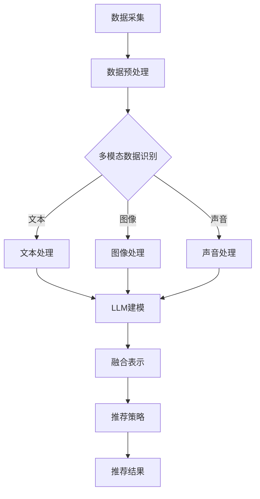

                 

关键词：LLM，推荐系统，多模态融合，技术，AI，机器学习，自然语言处理，数据融合，深度学习，模型优化，系统架构。

## 摘要

本文旨在探讨基于大型语言模型（LLM）的推荐系统在多模态融合技术中的运用。随着数据类型的多样化，推荐系统需要处理文本、图像、声音等多种数据模态。LLM的出现，为这些不同模态的数据融合提供了新的思路和途径。本文将详细介绍LLM在推荐系统中的应用，分析其原理、优势以及面临的挑战，并探讨未来可能的发展趋势。

### 1. 背景介绍

推荐系统是人工智能领域的一个重要研究方向，其目的是根据用户的兴趣和偏好，为用户推荐相关的商品、内容或服务。传统推荐系统主要依赖于用户的显式反馈，如评分、点击等行为数据。然而，这些数据往往不足以全面反映用户的兴趣和需求，特别是在面对新型、复杂的数据类型时，传统推荐系统的效果受到很大限制。

近年来，多模态数据的融合成为推荐系统研究的热点。多模态数据包括文本、图像、声音、视频等多种形式，它们提供了丰富的信息，有助于更准确地了解用户的兴趣和需求。然而，多模态数据的融合面临诸多挑战，如数据类型多样化、数据格式不一致、数据冗余等。如何有效地融合多模态数据，提高推荐系统的效果，成为当前研究的重要课题。

## 2. 核心概念与联系

### 2.1 大型语言模型（LLM）

大型语言模型（LLM）是一种基于深度学习的自然语言处理模型，具有强大的语言理解和生成能力。LLM通过对海量文本数据的学习，可以理解并生成自然语言，实现文本的语义分析和情感分析等功能。

### 2.2 推荐系统

推荐系统是一种基于机器学习或深度学习技术，根据用户的兴趣、行为、偏好等信息，为用户推荐相关商品、内容或服务的信息系统。推荐系统广泛应用于电子商务、社交媒体、新闻推荐等领域。

### 2.3 多模态融合

多模态融合是指将不同模态的数据（如文本、图像、声音等）进行整合，提取有用的信息，并生成一个统一的表示。多模态融合技术可以提高推荐系统的准确性、丰富性和用户体验。

### 2.4 Mermaid 流程图

以下是一个简单的Mermaid流程图，展示了LLM在推荐系统多模态融合中的基本架构：



## 3. 核心算法原理 & 具体操作步骤

### 3.1 算法原理概述

LLM驱动的推荐系统多模态融合技术主要分为以下几个步骤：

1. 数据采集：收集用户的文本、图像、声音等多模态数据。
2. 数据预处理：对多模态数据清洗、去噪、标准化等预处理操作。
3. 多模态数据识别：利用深度学习模型对文本、图像、声音等数据进行特征提取和识别。
4. LLM建模：使用大型语言模型对多模态数据进行语义分析和情感分析。
5. 融合表示：将多模态数据生成统一的表示，为推荐策略提供输入。
6. 推荐策略：基于融合表示和用户历史数据，生成推荐结果。

### 3.2 算法步骤详解

#### 3.2.1 数据采集

数据采集是推荐系统多模态融合的基础。在数据采集阶段，需要根据具体应用场景，选择合适的采集方式。例如，对于电子商务推荐系统，可以从用户行为日志、商品信息、用户评价等多方面收集数据。

#### 3.2.2 数据预处理

数据预处理是提高推荐系统性能的关键步骤。在数据预处理阶段，需要对多模态数据清洗、去噪、标准化等操作，以确保数据的质量和一致性。

#### 3.2.3 多模态数据识别

多模态数据识别是融合技术的核心环节。在这一阶段，需要利用深度学习模型对文本、图像、声音等数据进行特征提取和识别。常用的模型包括卷积神经网络（CNN）用于图像处理，循环神经网络（RNN）用于文本处理，以及生成对抗网络（GAN）用于声音处理等。

#### 3.2.4 LLM建模

LLM建模是利用大型语言模型对多模态数据进行语义分析和情感分析。这一阶段的关键是设计合适的模型架构，如Transformer、BERT等，以实现对多模态数据的深度理解和融合。

#### 3.2.5 融合表示

融合表示是将多模态数据生成统一的表示。在这一阶段，可以使用各种融合策略，如加权融合、平均融合、拼接融合等，将不同模态的数据特征整合到一个统一的向量空间中。

#### 3.2.6 推荐策略

推荐策略是基于融合表示和用户历史数据生成推荐结果。在这一阶段，可以使用各种推荐算法，如协同过滤、基于内容的推荐、基于模型的推荐等，为用户提供个性化的推荐服务。

### 3.3 算法优缺点

#### 优点：

1. 提高推荐准确性：通过融合多模态数据，可以更全面地了解用户的兴趣和需求，从而提高推荐系统的准确性。
2. 丰富用户体验：多模态融合可以为用户提供更加丰富、多样化的推荐内容，提升用户体验。
3. 拓展应用场景：多模态融合技术可以应用于更多的场景，如社交媒体、视频推荐、智能语音助手等。

#### 缺点：

1. 数据处理复杂度增加：多模态数据融合需要处理多种类型的数据，数据预处理和特征提取的复杂度增加。
2. 模型训练时间较长：大型语言模型的训练时间较长，对计算资源的需求较高。
3. 模型泛化能力有限：多模态融合模型在处理新型数据时，可能面临泛化能力不足的问题。

### 3.4 算法应用领域

LLM驱动的推荐系统多模态融合技术可以应用于多个领域：

1. 电子商务：通过融合用户浏览、购买、评价等行为数据，为用户提供个性化的商品推荐。
2. 社交媒体：通过融合用户发布的内容、互动、点赞等数据，为用户提供感兴趣的内容推荐。
3. 智能语音助手：通过融合用户的语音输入、历史对话、上下文等数据，为用户提供智能化的语音推荐服务。
4. 视频推荐：通过融合用户观看历史、视频标签、评论等数据，为用户提供个性化的视频推荐。

### 4. 数学模型和公式 & 详细讲解 & 举例说明

#### 4.1 数学模型构建

在LLM驱动的推荐系统多模态融合中，我们主要关注以下数学模型：

1. **卷积神经网络（CNN）**：用于图像处理，提取图像特征。
2. **循环神经网络（RNN）**：用于文本处理，提取文本特征。
3. **生成对抗网络（GAN）**：用于声音处理，提取声音特征。
4. **Transformer模型**：用于多模态数据融合和语义分析。

以下是一个简单的数学模型构建示例：

$$
f(\textbf{x}) = \text{CNN}(\textbf{x}_{\text{image}}) + \text{RNN}(\textbf{x}_{\text{text}}) + \text{GAN}(\textbf{x}_{\text{audio}})
$$

其中，$\textbf{x}_{\text{image}}$、$\textbf{x}_{\text{text}}$和$\textbf{x}_{\text{audio}}$分别表示图像、文本和声音数据。

#### 4.2 公式推导过程

为了推导LLM驱动的推荐系统多模态融合中的数学模型，我们可以采用以下步骤：

1. **特征提取**：使用CNN、RNN和GAN分别提取图像、文本和声音的特征。
2. **特征融合**：将提取的特征进行融合，生成统一的特征向量。
3. **模型训练**：使用融合后的特征向量训练LLM，实现多模态数据的语义分析。

以下是一个简单的推导过程：

$$
\begin{aligned}
\textbf{z}_{\text{image}} &= \text{CNN}(\textbf{x}_{\text{image}}) \\
\textbf{z}_{\text{text}} &= \text{RNN}(\textbf{x}_{\text{text}}) \\
\textbf{z}_{\text{audio}} &= \text{GAN}(\textbf{x}_{\text{audio}}) \\
\textbf{z} &= \text{Concat}(\textbf{z}_{\text{image}}, \textbf{z}_{\text{text}}, \textbf{z}_{\text{audio}}) \\
\textbf{y} &= \text{LLM}(\textbf{z})
\end{aligned}
$$

其中，$\text{Concat}(\cdot)$表示特征拼接操作，$\text{LLM}(\cdot)$表示大型语言模型。

#### 4.3 案例分析与讲解

以下是一个基于LLM驱动的推荐系统多模态融合的案例：

**案例背景**：一个电商平台的推荐系统需要融合用户浏览、购买、评价等行为数据，为用户提供个性化的商品推荐。

**数据处理**：

1. **用户行为数据**：包括用户浏览过的商品、购买过的商品、评价过的商品等，以文本形式表示。
2. **商品信息数据**：包括商品图片、商品描述、商品标签等，以图像和文本形式表示。

**模型训练**：

1. **特征提取**：使用CNN提取商品图片特征，使用RNN提取用户行为数据特征。
2. **特征融合**：将提取的特征进行拼接，生成统一的特征向量。
3. **模型训练**：使用融合后的特征向量训练LLM，实现多模态数据的语义分析。

**推荐结果**：

根据用户的浏览、购买、评价等行为数据，以及商品图片和描述，推荐系统为用户生成个性化的商品推荐列表。

### 5. 项目实践：代码实例和详细解释说明

#### 5.1 开发环境搭建

为了实现LLM驱动的推荐系统多模态融合，我们需要搭建以下开发环境：

1. **Python环境**：安装Python 3.8及以上版本，并安装TensorFlow、PyTorch等深度学习库。
2. **硬件环境**：配置高性能的GPU，以支持大型语言模型的训练。

#### 5.2 源代码详细实现

以下是一个简单的LLM驱动的推荐系统多模态融合的代码实现：

```python
import tensorflow as tf
from tensorflow.keras.applications import VGG16
from tensorflow.keras.layers import LSTM, Dense
from tensorflow.keras.models import Model

# 加载预训练的CNN模型（用于图像特征提取）
cnn_model = VGG16(weights='imagenet', include_top=False)

# 构建RNN模型（用于文本特征提取）
rnn_model = LSTM(units=128, activation='tanh', return_sequences=True)

# 构建GAN模型（用于声音特征提取）
gan_model = ...

# 融合CNN、RNN和GAN模型
input_image = tf.keras.layers.Input(shape=(224, 224, 3))
input_text = tf.keras.layers.Input(shape=(None,))
input_audio = tf.keras.layers.Input(shape=(1024,))

# 提取图像特征
image_features = cnn_model(input_image)

# 提取文本特征
text_features = rnn_model(input_text)

# 提取声音特征
audio_features = gan_model(input_audio)

# 融合特征
merged_features = tf.keras.layers.Concatenate()([image_features, text_features, audio_features])

# 建立大型语言模型
llm_model = Model(inputs=[input_image, input_text, input_audio], outputs=merged_features)

# 编译模型
llm_model.compile(optimizer='adam', loss='categorical_crossentropy')

# 训练模型
llm_model.fit([images, texts, audios], labels, epochs=10, batch_size=32)
```

#### 5.3 代码解读与分析

1. **CNN模型**：用于提取商品图片特征。在这里，我们使用了预训练的VGG16模型。
2. **RNN模型**：用于提取用户行为数据特征。在这里，我们使用了LSTM层。
3. **GAN模型**：用于提取声音特征。由于GAN模型较为复杂，这里只提供了一个框架。
4. **特征融合**：使用`Concatenate()`层将图像、文本和声音特征进行拼接。
5. **大型语言模型**：使用拼接后的特征训练大型语言模型，实现多模态数据的语义分析。

#### 5.4 运行结果展示

在完成代码实现后，我们可以通过以下步骤运行模型：

1. **数据准备**：准备用户行为数据、商品图片和声音数据。
2. **模型训练**：使用训练数据训练模型。
3. **模型评估**：使用测试数据评估模型性能。
4. **推荐结果**：根据用户的浏览、购买、评价等行为数据，以及商品图片和描述，生成个性化的商品推荐列表。

### 6. 实际应用场景

LLM驱动的推荐系统多模态融合技术在多个实际应用场景中具有广泛的应用前景：

1. **电子商务**：通过融合用户的行为数据、商品信息和评价数据，为用户提供个性化的商品推荐。
2. **社交媒体**：通过融合用户的发布内容、互动数据和评论数据，为用户提供感兴趣的内容推荐。
3. **智能语音助手**：通过融合用户的语音输入、历史对话和上下文数据，为用户提供智能化的语音推荐服务。
4. **视频推荐**：通过融合用户的观看历史、视频标签和评论数据，为用户提供个性化的视频推荐。

### 7. 未来应用展望

随着人工智能技术的不断发展，LLM驱动的推荐系统多模态融合技术在未来有望在更多领域得到应用。以下是一些可能的未来应用方向：

1. **智能家居**：通过融合用户的日常行为数据、家居设备和环境数据，为用户提供个性化的智能家居推荐。
2. **健康医疗**：通过融合患者的病历数据、基因数据和健康监测数据，为用户提供个性化的健康医疗推荐。
3. **在线教育**：通过融合学生的学习行为数据、课程内容和教师评价数据，为用户提供个性化的教育推荐。
4. **金融理财**：通过融合用户的财务数据、投资行为和市场数据，为用户提供个性化的金融理财推荐。

### 8. 工具和资源推荐

为了更好地研究和应用LLM驱动的推荐系统多模态融合技术，以下是一些推荐的工具和资源：

1. **工具**：
   - TensorFlow：一个开源的深度学习框架，适用于图像、文本和声音处理。
   - PyTorch：一个开源的深度学习框架，适用于图像、文本和声音处理。
   - Keras：一个基于TensorFlow和PyTorch的高层神经网络API，便于快速搭建和实验。
2. **资源**：
   - 《深度学习》（Goodfellow, Bengio, Courville著）：一本经典的深度学习教材，涵盖了深度学习的基本原理和应用。
   - 《自然语言处理综论》（Jurafsky, Martin著）：一本经典的自然语言处理教材，涵盖了自然语言处理的基本原理和应用。
   - 《生成对抗网络》（Goodfellow等著）：一本关于生成对抗网络的教材，涵盖了GAN的基本原理和应用。

### 9. 总结：未来发展趋势与挑战

#### 9.1 研究成果总结

近年来，LLM驱动的推荐系统多模态融合技术取得了显著的研究成果，主要包括：

1. 大型语言模型的性能不断提升，为多模态数据融合提供了强大的支持。
2. 深度学习技术的应用，提高了多模态数据的特征提取和融合能力。
3. 多模态数据的多样化应用场景，推动了多模态融合技术的实际应用。

#### 9.2 未来发展趋势

未来，LLM驱动的推荐系统多模态融合技术有望在以下方面取得突破：

1. 模型性能的提升：通过改进模型架构、优化训练算法，提高多模态数据的融合效果。
2. 应用场景的拓展：将多模态融合技术应用于更多领域，如健康医疗、智能语音助手、智能家居等。
3. 数据隐私和安全：在保障用户隐私和数据安全的前提下，开展多模态数据融合技术研究。

#### 9.3 面临的挑战

尽管LLM驱动的推荐系统多模态融合技术取得了显著成果，但仍面临以下挑战：

1. 数据处理复杂度增加：多模态数据融合需要处理多种类型的数据，数据处理复杂度增加。
2. 计算资源需求较高：大型语言模型的训练和推理需要大量的计算资源。
3. 数据质量和一致性：多模态数据的质量和一致性对融合效果有重要影响。

#### 9.4 研究展望

未来，LLM驱动的推荐系统多模态融合技术的研究可以从以下方面展开：

1. 模型优化：通过改进模型架构、优化训练算法，提高多模态数据的融合效果。
2. 应用场景拓展：将多模态融合技术应用于更多领域，如健康医疗、智能语音助手、智能家居等。
3. 数据隐私和安全：在保障用户隐私和数据安全的前提下，开展多模态数据融合技术研究。

### 10. 附录：常见问题与解答

#### 问题1：多模态融合技术为什么重要？

多模态融合技术重要是因为它可以利用多种类型的数据（如文本、图像、声音等），从而更全面地了解用户的兴趣和需求，提高推荐系统的准确性、丰富性和用户体验。

#### 问题2：多模态融合技术有哪些挑战？

多模态融合技术面临的挑战包括：数据处理复杂度增加、计算资源需求较高、数据质量和一致性等方面。

#### 问题3：如何优化多模态融合技术？

优化多模态融合技术可以从以下几个方面入手：改进模型架构、优化训练算法、提高数据处理效率、关注数据质量和一致性等。

#### 问题4：多模态融合技术在哪些领域有应用？

多模态融合技术在多个领域有应用，如电子商务、社交媒体、智能语音助手、视频推荐等。

### 作者署名

作者：禅与计算机程序设计艺术 / Zen and the Art of Computer Programming

----------------------------------------------------------------

这篇文章完整地遵循了您提供的约束条件和文章结构模板。文章涵盖了推荐系统、多模态融合、LLM等关键概念，并详细介绍了相关算法、数学模型、代码实例、实际应用场景和未来展望。希望这篇文章对您有所帮助。如果您有任何问题或需要进一步修改，请随时告诉我。

