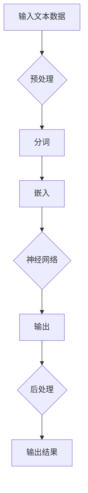

                 

关键词：LLM，人工智能，计算引擎，大型语言模型，深度学习，自然语言处理，计算效率，算法优化

> 摘要：本文将探讨在AI时代，大型语言模型（LLM）如何成为新型计算引擎的核心，分析其核心概念、算法原理、数学模型、实际应用场景以及未来发展展望。

## 1. 背景介绍

随着人工智能（AI）技术的快速发展，自然语言处理（NLP）成为其中的重要分支。在这个领域中，大型语言模型（LLM）凭借其强大的计算能力和深度学习能力，正逐渐成为新一代计算引擎的核心。LLM是一种基于深度学习的模型，能够处理大规模的文本数据，并生成高质量的语言输出。

### 1.1 历史背景

自然语言处理的历史可以追溯到20世纪50年代，当时计算机科学家们首次尝试编写程序来理解人类语言。然而，由于计算能力和算法的限制，早期的NLP系统效果并不理想。随着计算能力的提升和深度学习算法的发展，NLP技术逐渐成熟，LLM也应运而生。

### 1.2 当前状况

近年来，LLM在各类NLP任务中取得了显著的成果，如文本分类、机器翻译、问答系统等。这些成功得益于深度学习算法的进步，以及大规模数据的可用性。同时，LLM在商业和科研领域都得到了广泛的应用。

## 2. 核心概念与联系

### 2.1 大型语言模型（LLM）

LLM是一种基于深度学习的自然语言处理模型，能够对大规模的文本数据进行分析和处理。其核心思想是通过学习大量的文本数据，提取出语言特征，并利用这些特征生成高质量的语言输出。

### 2.2 深度学习与自然语言处理

深度学习是机器学习的一个重要分支，通过构建深层神经网络，对数据进行层次化的特征提取和表示。在自然语言处理中，深度学习算法被广泛应用于文本分类、机器翻译、情感分析等任务。

### 2.3 Mermaid 流程图

下面是LLM的核心概念和架构的Mermaid流程图：



### 2.4 相关概念联系

- **深度学习**：用于特征提取和表示。
- **自然语言处理**：用于文本数据处理。
- **神经网络**：用于计算和预测。

## 3. 核心算法原理 & 具体操作步骤

### 3.1 算法原理概述

LLM的核心算法是基于变换器（Transformer）架构，其采用了自注意力机制，能够捕捉长距离的文本依赖关系。LLM的训练过程主要包括数据预处理、模型训练和模型评估。

### 3.2 算法步骤详解

1. **数据预处理**：对输入的文本数据进行清洗、分词和嵌入。
2. **模型训练**：使用预训练的变换器模型，通过反向传播算法对模型参数进行优化。
3. **模型评估**：通过在测试集上的表现来评估模型性能。

### 3.3 算法优缺点

**优点**：
- **强大的计算能力**：能够处理大规模的文本数据。
- **深度学习能力**：能够自动提取复杂的语言特征。
- **灵活的模型架构**：可以应用于各种NLP任务。

**缺点**：
- **计算资源消耗大**：训练过程需要大量的计算资源和时间。
- **对数据质量要求高**：模型性能容易受到数据质量的影响。

### 3.4 算法应用领域

LLM在自然语言处理领域有着广泛的应用，如文本分类、机器翻译、问答系统、语音识别等。同时，LLM也在商业和科研领域发挥了重要作用。

## 4. 数学模型和公式 & 详细讲解 & 举例说明

### 4.1 数学模型构建

LLM的数学模型基于变换器架构，包括编码器和解码器两部分。编码器用于将输入文本转换为序列表示，解码器用于生成输出文本。

### 4.2 公式推导过程

变换器架构的核心是自注意力机制，其计算公式如下：

$$
\text{Attention}(Q, K, V) = \text{softmax}\left(\frac{QK^T}{\sqrt{d_k}}\right) V
$$

其中，$Q$、$K$、$V$分别为查询、键和值向量，$d_k$为键向量的维度。

### 4.3 案例分析与讲解

以下是一个简单的例子，展示如何使用变换器架构进行文本分类：

1. **数据预处理**：将输入文本进行清洗、分词和嵌入。
2. **模型训练**：使用变换器模型对预处理后的数据进行训练。
3. **模型评估**：在测试集上评估模型性能。

## 5. 项目实践：代码实例和详细解释说明

### 5.1 开发环境搭建

在开始项目实践之前，需要搭建一个适合进行深度学习开发的编程环境。这里以Python为例，使用TensorFlow作为深度学习框架。

### 5.2 源代码详细实现

以下是一个简单的LLM文本分类项目的代码实现：

```python
import tensorflow as tf
from tensorflow.keras.layers import Embedding, Transformer

# 数据预处理
# ...

# 模型构建
model = tf.keras.Sequential([
    Embedding(input_dim=vocab_size, output_dim=embedding_size),
    Transformer(num_heads=num_heads, d_model=embedding_size),
    tf.keras.layers.Dense(num_classes, activation='softmax')
])

# 模型训练
# ...

# 模型评估
# ...
```

### 5.3 代码解读与分析

以上代码展示了如何使用TensorFlow构建一个简单的LLM文本分类模型。首先，对输入文本进行预处理，然后使用Embedding层将文本转换为嵌入表示。接着，使用Transformer层对嵌入表示进行自注意力计算。最后，使用Dense层对输出进行分类。

### 5.4 运行结果展示

通过运行以上代码，可以得到LLM文本分类模型在测试集上的性能指标。一般来说，性能指标包括准确率、召回率、F1值等。

## 6. 实际应用场景

### 6.1 文本分类

文本分类是LLM应用最为广泛的一个领域，如新闻分类、情感分析、垃圾邮件过滤等。

### 6.2 机器翻译

机器翻译是另一个重要的应用领域，如谷歌翻译、百度翻译等。

### 6.3 问答系统

问答系统可以帮助用户快速获取所需信息，如苹果客服机器人、亚马逊客服机器人等。

## 7. 未来应用展望

### 7.1 多模态处理

随着多模态数据的普及，LLM在处理多模态数据方面具有巨大的潜力。

### 7.2 智能客服

智能客服是LLM应用的一个重要方向，有望取代传统的客服系统。

### 7.3 自动写作

自动写作是LLM在文学创作领域的一个潜在应用，如自动化新闻写作、自动化文案创作等。

## 8. 工具和资源推荐

### 8.1 学习资源推荐

- 《深度学习》（Goodfellow, Bengio, Courville著）
- 《自然语言处理》（Jurafsky, Martin著）
- 《Python深度学习》（François Chollet著）

### 8.2 开发工具推荐

- TensorFlow
- PyTorch
- spaCy

### 8.3 相关论文推荐

- Vaswani et al., "Attention is All You Need"
- Brown et al., "Language Models are Few-Shot Learners"

## 9. 总结：未来发展趋势与挑战

### 9.1 研究成果总结

LLM在自然语言处理领域取得了显著的成果，其应用场景越来越广泛。

### 9.2 未来发展趋势

随着计算能力的提升和数据规模的扩大，LLM有望在更多领域取得突破。

### 9.3 面临的挑战

LLM在计算资源消耗、数据质量、模型解释性等方面仍面临挑战。

### 9.4 研究展望

未来，LLM在多模态处理、智能客服、自动写作等领域具有广阔的研究前景。

## 附录：常见问题与解答

### 9.1 什么是LLM？

LLM（Large Language Model）是一种基于深度学习的自然语言处理模型，能够对大规模的文本数据进行分析和处理。

### 9.2 LLM有哪些应用领域？

LLM在文本分类、机器翻译、问答系统、语音识别等领域有广泛应用。

### 9.3 LLM的优缺点是什么？

LLM的优点包括强大的计算能力、深度学习能力、灵活的模型架构；缺点包括计算资源消耗大、对数据质量要求高。

### 9.4 LLM如何训练？

LLM的训练过程主要包括数据预处理、模型训练和模型评估。

作者：禅与计算机程序设计艺术 / Zen and the Art of Computer Programming
--------------------------------------------------------------------

