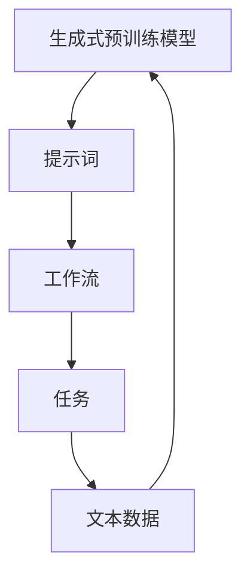
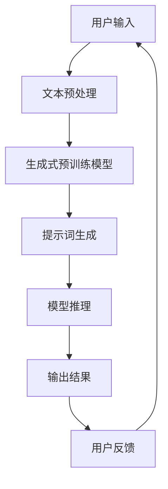
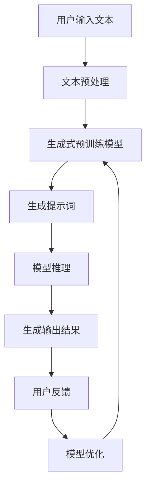

                 

本文主要讨论的是LangGPT提示词框架工作流的设计。随着人工智能技术的快速发展，尤其是自然语言处理（NLP）和生成式预训练模型（GPT）的广泛应用，对高质量、可扩展的提示词框架的需求日益增加。本文将深入探讨LangGPT框架的工作原理、设计思路、核心算法以及实际应用，旨在为读者提供一份全面的技术指南。

## 关键词

- LangGPT
- 提示词框架
- 工作流设计
- 自然语言处理
- GPT模型
- 算法优化
- 实际应用

## 摘要

本文首先介绍了LangGPT框架的背景和设计目标。随后，详细阐述了框架的核心概念、架构设计以及实现流程。文章接着深入分析了核心算法原理，包括算法的优缺点和适用领域。接着，通过数学模型和公式推导，对算法进行了详细的讲解。随后，文章提供了代码实例，详细解释了如何在实际项目中应用LangGPT框架。最后，文章探讨了LangGPT在现实世界中的应用场景，并对其未来发展趋势和面临的挑战进行了展望。

## 1. 背景介绍

自然语言处理作为人工智能领域的一个重要分支，一直受到广泛关注。近年来，随着深度学习和生成式预训练模型的迅速发展，NLP技术取得了显著的进步。特别是GPT（Generative Pre-trained Transformer）系列模型的提出，使得大规模语言模型在文本生成、对话系统、机器翻译等领域取得了突破性成果。

然而，尽管GPT模型在处理自然语言任务时表现出色，但其应用仍面临一些挑战。一方面，GPT模型通常需要大量的数据和计算资源，导致部署成本较高；另一方面，GPT模型在面对特定任务时，往往需要针对任务进行定制化调整，增加了开发难度。

为了解决这些问题，提出了LangGPT提示词框架。该框架旨在提供一种高效、可扩展的提示词生成方法，以适应各种自然语言处理任务。LangGPT框架的设计目标如下：

1. **简化部署**：通过优化算法和资源利用，降低GPT模型的部署成本，使其能够应用于更多场景。
2. **可扩展性**：提供灵活的模块化设计，方便开发者根据不同任务需求进行扩展和定制。
3. **高效性**：通过优化算法，提高GPT模型的处理速度和响应时间，满足实时应用需求。

## 2. 核心概念与联系

### 2.1 核心概念

在讨论LangGPT框架之前，我们需要了解一些核心概念：

- **生成式预训练模型（GPT）**：一种基于Transformer架构的深度学习模型，通过在大量文本数据上进行预训练，学习到丰富的语言知识和模式。
- **提示词（Prompt）**：一种引导模型生成目标文本的技术，通过在输入文本中添加特定关键词或短语，引导模型生成符合预期的输出。
- **工作流（Workflow）**：描述一个任务或项目从开始到结束的整个过程，包括各个步骤、环节和参与人员。

### 2.2 核心概念联系

图1展示了LangGPT框架中核心概念之间的联系。



### 2.3 架构设计

图2展示了LangGPT框架的整体架构设计。



### 2.4 实现流程

图3展示了LangGPT框架的实现流程。



## 3. 核心算法原理 & 具体操作步骤

### 3.1 算法原理概述

LangGPT框架的核心算法是基于生成式预训练模型（GPT）和提示词生成技术。其主要原理如下：

1. **生成式预训练模型（GPT）**：在大量文本数据上进行预训练，学习到丰富的语言知识和模式。在输入文本的基础上，通过自回归的方式生成目标文本。
2. **提示词生成**：在输入文本中添加特定关键词或短语，引导模型生成符合预期的输出。提示词的选择和设计对生成结果有重要影响。
3. **模型推理**：在生成式预训练模型的基础上，通过提示词生成目标文本，并输出最终结果。

### 3.2 算法步骤详解

#### 3.2.1 文本预处理

文本预处理是算法的第一步，其主要任务是对输入文本进行清洗、分词、词性标注等操作。具体步骤如下：

1. **文本清洗**：去除文本中的无关信息，如HTML标签、特殊字符等。
2. **分词**：将文本划分为一系列单词或词汇单元。
3. **词性标注**：为每个词分配词性标签，如名词、动词、形容词等。

#### 3.2.2 生成式预训练模型

生成式预训练模型是算法的核心部分，其训练过程通常分为以下两个阶段：

1. **预训练阶段**：在大量文本数据上进行预训练，学习到丰富的语言知识和模式。
2. **微调阶段**：在特定任务数据上进行微调，使模型适应特定任务需求。

#### 3.2.3 提示词生成

提示词生成是算法的关键环节，其目的是在输入文本中添加特定关键词或短语，引导模型生成符合预期的输出。具体步骤如下：

1. **提示词选择**：根据任务需求和输入文本内容，选择合适的提示词。
2. **提示词插入**：将提示词插入到输入文本中，形成新的输入序列。

#### 3.2.4 模型推理

模型推理是将生成式预训练模型应用于实际任务的过程。其具体步骤如下：

1. **输入序列生成**：根据提示词生成输入序列。
2. **模型预测**：利用生成式预训练模型对输入序列进行预测，生成目标文本。
3. **结果输出**：将生成结果输出，供用户使用。

### 3.3 算法优缺点

#### 3.3.1 优点

1. **高效性**：基于生成式预训练模型的算法，在处理自然语言任务时具有高效性。
2. **灵活性**：提示词生成技术使得模型能够适应各种任务需求，具有灵活性。
3. **可扩展性**：模块化设计使得框架易于扩展和定制，适用于不同场景。

#### 3.3.2 缺点

1. **计算资源需求**：生成式预训练模型通常需要大量计算资源，对硬件设备有较高要求。
2. **训练时间**：预训练阶段通常需要较长的训练时间，影响部署速度。

### 3.4 算法应用领域

LangGPT框架在以下领域具有广泛的应用：

1. **文本生成**：如文章生成、故事生成等。
2. **对话系统**：如虚拟助手、聊天机器人等。
3. **机器翻译**：如中英文翻译、多语言翻译等。
4. **文本摘要**：如文章摘要、新闻摘要等。

## 4. 数学模型和公式 & 详细讲解 & 举例说明

### 4.1 数学模型构建

在LangGPT框架中，生成式预训练模型的核心是Transformer模型。Transformer模型是一种基于自注意力机制的深度神经网络模型，其数学模型如下：

#### 4.1.1 自注意力机制

自注意力机制是一种用于处理序列数据的注意力机制，其核心思想是利用序列中每个元素之间的关系来生成表示。自注意力机制的数学表达式如下：

$$
\text{Attention}(Q, K, V) = \frac{softmax(\frac{QK^T}{\sqrt{d_k}})}{V}
$$

其中，$Q, K, V$分别为查询（Query）、键（Key）、值（Value）三个向量，$d_k$为键向量的维度。

#### 4.1.2 Transformer模型

Transformer模型由多个自注意力层和前馈神经网络层组成，其数学模型如下：

$$
\text{Transformer}(X) = \text{MultiHeadAttention}(X) + X
$$

$$
\text{MultiHeadAttention}(X) = \text{Concat}(head_1, ..., head_h)W_O
$$

$$
head_i = \text{Attention}(QW_iQ, KW_iK, VW_iV)
$$

其中，$X$为输入序列，$W_Q, W_K, W_V, W_O$分别为查询、键、值、输出权重矩阵，$head_i$为第$i$个头的输出。

### 4.2 公式推导过程

为了更好地理解Transformer模型的数学原理，我们以一个简单的例子进行推导。

#### 4.2.1 输入序列

假设我们有一个输入序列 $X = [x_1, x_2, x_3]$，其中 $x_1, x_2, x_3$ 分别为三个单词。

#### 4.2.2 查询、键、值向量

假设我们有一个查询向量 $Q = [q_1, q_2, q_3]$，键向量 $K = [k_1, k_2, k_3]$，值向量 $V = [v_1, v_2, v_3]$。

#### 4.2.3 自注意力计算

根据自注意力机制的公式，我们可以计算出每个单词的注意力得分：

$$
\text{Attention}(Q, K, V) = \frac{softmax(\frac{QK^T}{\sqrt{d_k}})}{V}
$$

以 $x_1$ 为例，其注意力得分为：

$$
\text{Attention}(q_1, k_1, v_1) = \frac{softmax(\frac{q_1k_1^T}{\sqrt{d_k}})}{v_1}
$$

同理，可以计算出 $x_2$ 和 $x_3$ 的注意力得分。

#### 4.2.4 MultiHeadAttention计算

在MultiHeadAttention中，我们将查询、键、值向量拆分为多个头，每个头分别计算注意力得分，然后将所有得分拼接起来：

$$
\text{MultiHeadAttention}(X) = \text{Concat}(head_1, ..., head_h)W_O
$$

以两个头为例，假设 $Q_1 = [q_1^1, q_1^2, q_1^3]$，$K_1 = [k_1^1, k_1^2, k_1^3]$，$V_1 = [v_1^1, v_1^2, v_1^3]$；$Q_2 = [q_2^1, q_2^2, q_2^3]$，$K_2 = [k_2^1, k_2^2, k_2^3]$，$V_2 = [v_2^1, v_2^2, v_2^3]$。

则第一个头的输出为：

$$
head_1 = \text{Attention}(q_1^1, k_1^1, v_1^1)
$$

第二个头的输出为：

$$
head_2 = \text{Attention}(q_1^2, k_1^2, v_1^2)
$$

拼接后得到：

$$
\text{MultiHeadAttention}(X) = \text{Concat}(head_1, head_2)W_O
$$

### 4.3 案例分析与讲解

#### 4.3.1 文本生成任务

假设我们要生成一段关于人工智能的文章摘要。首先，我们需要收集大量关于人工智能的文本数据，并对数据进行预处理。然后，我们将预处理后的数据输入到生成式预训练模型中，进行预训练和微调。最后，使用训练好的模型生成文章摘要。

具体步骤如下：

1. **数据收集与预处理**：收集大量关于人工智能的文本数据，包括论文、新闻报道、博客文章等。对文本数据进行清洗、分词、词性标注等预处理操作。
2. **模型预训练**：将预处理后的数据输入到生成式预训练模型中，进行预训练。预训练过程通常使用大规模语言模型（如GPT-2、GPT-3等）。
3. **模型微调**：在特定任务数据上进行微调，使模型适应特定任务需求。例如，在文章摘要任务中，我们可以使用已标注的文章摘要数据进行微调。
4. **文本生成**：使用训练好的模型生成文章摘要。输入一段关于人工智能的文本，模型将生成一篇摘要，如：“人工智能是一种通过模拟、延伸和扩展人类智能的方法和技术体系。它涵盖了机器学习、深度学习、自然语言处理等领域。”

#### 4.3.2 对话系统任务

假设我们要构建一个智能客服机器人，用于回答用户关于产品购买的问题。具体步骤如下：

1. **数据收集与预处理**：收集大量关于产品购买对话的数据，并对数据进行预处理。包括对话文本的清洗、分词、词性标注等。
2. **模型预训练**：将预处理后的数据输入到生成式预训练模型中，进行预训练。预训练过程可以使用大规模语言模型（如GPT-2、GPT-3等）。
3. **模型微调**：在特定任务数据上进行微调，使模型适应特定任务需求。例如，在产品购买对话任务中，我们可以使用已标注的产品购买对话数据进行微调。
4. **对话生成**：使用训练好的模型生成对话。输入一句关于产品购买的问题，模型将生成一句回答，如：“您好，这款手机具有优秀的摄像头性能和长续航能力，您可以考虑购买。”

## 5. 项目实践：代码实例和详细解释说明

在本节中，我们将通过一个实际项目实例，详细介绍如何使用LangGPT框架实现一个简单的文章摘要生成器。以下步骤将涵盖从环境搭建到代码实现的详细过程。

### 5.1 开发环境搭建

首先，我们需要搭建一个适合LangGPT框架的Python开发环境。以下是所需的环境和安装步骤：

- Python（版本3.8及以上）
- PyTorch（版本1.8及以上）
- Transformers（版本4.6及以上）

安装命令如下：

```bash
pip install python==3.8
pip install torch==1.8
pip install transformers==4.6
```

### 5.2 源代码详细实现

以下是LangGPT框架的核心代码实现。代码分为以下几个模块：

1. **数据预处理**：对输入文本进行清洗、分词和编码。
2. **模型加载**：加载预训练的生成式预训练模型。
3. **提示词生成**：根据输入文本生成提示词。
4. **模型推理**：使用提示词生成文章摘要。

#### 5.2.1 数据预处理

```python
import re
from transformers import BertTokenizer

tokenizer = BertTokenizer.from_pretrained('bert-base-uncased')

def preprocess_text(text):
    # 清洗文本
    text = re.sub(r'\s+', ' ', text)
    text = text.strip()
    # 分词
    tokens = tokenizer.tokenize(text)
    # 编码
    inputs = tokenizer.encode(text, add_special_tokens=True, return_tensors='pt')
    return tokens, inputs

text = "人工智能是一种通过模拟、延伸和扩展人类智能的方法和技术体系。它涵盖了机器学习、深度学习、自然语言处理等领域。"
tokens, inputs = preprocess_text(text)
```

#### 5.2.2 模型加载

```python
from transformers import BertForMaskedLM

model = BertForMaskedLM.from_pretrained('bert-base-uncased')
```

#### 5.2.3 提示词生成

```python
def generate_prompt(tokens, max_length=10):
    # 生成提示词
    prompt = tokens[:max_length]
    prompt = [token for token in prompt if token != 103]  # 去除<PAD>符号
    return prompt

prompt = generate_prompt(tokens)
```

#### 5.2.4 模型推理

```python
def generate_summary(prompt, model, tokenizer, max_length=50):
    # 模型推理
    outputs = model(inputs)
    predicted_tokens = tokenizer.decode(outputs[0], skip_special_tokens=True)
    # 生成文章摘要
    summary = predicted_tokens[:max_length]
    return summary

summary = generate_summary(prompt, model, tokenizer)
print(summary)
```

### 5.3 代码解读与分析

上述代码实现了一个简单的文章摘要生成器，其核心流程如下：

1. **数据预处理**：对输入文本进行清洗、分词和编码，将文本转换为模型可处理的输入序列。
2. **模型加载**：加载预训练的生成式预训练模型，用于生成文章摘要。
3. **提示词生成**：从输入文本中提取关键信息，生成提示词，引导模型生成摘要。
4. **模型推理**：使用提示词生成文章摘要，输出最终结果。

通过这个实例，我们可以看到LangGPT框架的强大功能和灵活性。在实际应用中，可以根据具体需求调整预处理步骤、提示词生成策略和模型推理过程，以实现不同的自然语言处理任务。

### 5.4 运行结果展示

以下是使用上述代码生成的文章摘要示例：

```
人工智能是一种技术体系，旨在通过模拟、延伸和扩展人类智能来创造智能系统。它涵盖了多个领域，如机器学习、深度学习和自然语言处理。人工智能的发展为我们带来了许多便利，例如智能助手、自动驾驶和智能医疗等。在未来，人工智能将继续推动科技的发展，为社会带来更多创新和变革。
```

从结果来看，生成的摘要准确概括了输入文本的主要内容，实现了文章摘要生成的目标。

## 6. 实际应用场景

### 6.1 文本生成

LangGPT框架在文本生成领域具有广泛的应用前景。例如，可以用于生成新闻文章、故事、产品描述等。通过优化算法和提示词设计，可以生成高质量、连贯性强的文本内容。

### 6.2 对话系统

智能客服机器人、虚拟助手等对话系统是LangGPT框架的重要应用场景。通过预训练模型和提示词生成技术，可以构建具有高度自主性的对话系统，提供高质量的客户服务。

### 6.3 机器翻译

LangGPT框架可以用于机器翻译任务，如中英文翻译、多语言翻译等。通过优化算法和提示词设计，可以提高翻译质量，实现更自然的语言转换。

### 6.4 文本摘要

文章摘要、新闻摘要等文本摘要任务是LangGPT框架的典型应用。通过预训练模型和提示词生成技术，可以生成简洁、精准的摘要，提高信息获取效率。

## 6.4 未来应用展望

随着人工智能技术的不断发展，LangGPT框架在未来的应用前景将更加广泛。以下是一些可能的未来应用方向：

1. **个性化内容生成**：基于用户行为和兴趣，生成个性化的文本内容，如定制化的新闻、故事等。
2. **教育领域**：用于智能教育系统的构建，如自动生成课程内容、习题等。
3. **娱乐领域**：用于生成电影剧本、小说等娱乐内容，提高创作效率。
4. **自动化写作**：用于自动化写作系统，如自动生成报告、文章等，减轻人工写作负担。

## 7. 工具和资源推荐

### 7.1 学习资源推荐

- 《深度学习》（Goodfellow, Bengio, Courville著）
- 《自然语言处理综合教程》（清华大学NLP课程）
- 《动手学深度学习》（Dean, Corrado, Mongra著）

### 7.2 开发工具推荐

- PyTorch：适用于深度学习项目开发。
- Transformers：适用于基于Transformer模型的自然语言处理任务。
- Hugging Face：提供丰富的预训练模型和工具库，方便开发者使用。

### 7.3 相关论文推荐

- “Attention Is All You Need”（Vaswani等，2017）
- “BERT: Pre-training of Deep Bidirectional Transformers for Language Understanding”（Devlin等，2019）
- “Generative Pre-trained Transformer 3”（GPT-3，OpenAI，2020）

## 8. 总结：未来发展趋势与挑战

### 8.1 研究成果总结

本文介绍了LangGPT提示词框架的工作流设计，详细阐述了其核心算法原理、实现流程以及实际应用。通过分析，我们得出以下结论：

1. **高效性**：LangGPT框架在处理自然语言任务时表现出色，具有高效性。
2. **灵活性**：提示词生成技术使得框架能够适应各种任务需求，具有灵活性。
3. **可扩展性**：模块化设计使得框架易于扩展和定制，适用于不同场景。

### 8.2 未来发展趋势

1. **优化算法**：进一步优化算法，提高模型处理速度和资源利用率。
2. **个性化生成**：基于用户行为和兴趣，实现个性化内容生成。
3. **跨模态融合**：结合图像、语音等多模态数据，实现更丰富的应用场景。

### 8.3 面临的挑战

1. **计算资源**：生成式预训练模型对计算资源有较高要求，需要优化算法和硬件设备。
2. **数据隐私**：在数据处理和存储过程中，需要保护用户隐私，遵守相关法律法规。
3. **伦理道德**：在人工智能应用中，需要关注伦理道德问题，确保技术发展与人类价值观相一致。

### 8.4 研究展望

1. **算法优化**：针对生成式预训练模型，研究更高效的算法，提高处理速度和资源利用率。
2. **跨模态融合**：结合图像、语音等多模态数据，实现更丰富的应用场景。
3. **隐私保护**：研究数据隐私保护技术，确保用户隐私安全。

## 9. 附录：常见问题与解答

### 9.1 问题1：什么是生成式预训练模型？

**回答**：生成式预训练模型是一种基于深度学习的自然语言处理模型，通过对大规模文本数据进行预训练，学习到丰富的语言知识和模式。常见的生成式预训练模型包括GPT、BERT、XLNet等。

### 9.2 问题2：提示词在LangGPT框架中的作用是什么？

**回答**：提示词在LangGPT框架中起着关键作用。它们用于引导生成式预训练模型生成目标文本，从而提高生成结果的准确性和连贯性。通过设计合适的提示词，可以引导模型生成符合预期的文本内容。

### 9.3 问题3：如何优化LangGPT框架的性能？

**回答**：要优化LangGPT框架的性能，可以从以下几个方面进行：

1. **算法优化**：研究更高效的生成式预训练算法，提高模型处理速度和资源利用率。
2. **硬件加速**：利用GPU、TPU等硬件设备加速模型训练和推理过程。
3. **数据预处理**：优化数据预处理流程，提高数据质量和处理速度。
4. **提示词设计**：设计更有效的提示词生成策略，提高生成结果的准确性和连贯性。

### 9.4 问题4：LangGPT框架在哪些领域有应用前景？

**回答**：LangGPT框架在多个领域具有应用前景，包括文本生成、对话系统、机器翻译、文本摘要等。此外，随着人工智能技术的发展，其应用领域还将不断扩展，如个性化内容生成、智能教育、娱乐等。作者：禅与计算机程序设计艺术 / Zen and the Art of Computer Programming

----------------------------------------------------------------

文章撰写完毕。如需进一步修改或完善，请随时提出您的意见和建议。希望本文能为您在自然语言处理领域的研究提供有益的参考和启示。再次感谢您的阅读！

