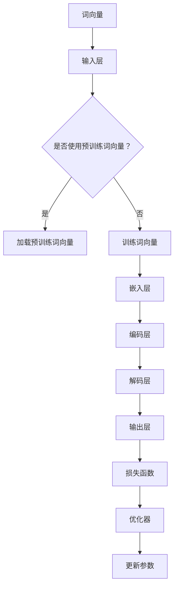

                 

 语言模型（Language Models，简称LM）是自然语言处理（Natural Language Processing，简称NLP）的核心技术之一。随着深度学习技术的发展，语言模型在信息检索、机器翻译、文本生成等领域取得了显著成果。本文将深入探讨语言模型的原理、构建方法和实际应用，并通过代码实例进行详细讲解。

## 关键词

- 语言模型
- 自然语言处理
- 深度学习
- 机器翻译
- 文本生成
- 语言生成模型
- 语言理解模型

## 摘要

本文首先介绍了语言模型的基本概念和作用，然后详细讲解了语言模型的构建方法，包括训练数据和超参数选择等。接着，我们通过一个实际案例展示了如何使用TensorFlow构建一个简单的语言模型，并对其代码进行了详细解析。最后，本文探讨了语言模型在实际应用中的广泛场景，并对其未来发展进行了展望。

## 1. 背景介绍

### 语言模型的基本概念

语言模型是一种用于预测文本序列的概率分布的模型。在自然语言处理中，语言模型主要用于以下几个方面：

1. **文本生成**：通过输入一个单词或短语，语言模型可以生成下一个可能的单词或短语。
2. **机器翻译**：语言模型可以帮助机器翻译系统预测源语言中的下一个词或短语，从而生成目标语言的翻译结果。
3. **信息检索**：语言模型可以用于搜索引擎，通过理解用户查询的意图，提供更准确的搜索结果。
4. **文本分类**：语言模型可以帮助分类模型理解文本的内容，从而进行文本分类。

### 语言模型的类型

根据预测的目标，语言模型可以分为以下几种类型：

1. **前向语言模型（Forward Language Model）**：这种模型预测下一个单词或短语，是基于前文信息进行预测。
2. **后向语言模型（Backward Language Model）**：这种模型预测前一个单词或短语，是基于后文信息进行预测。
3. **双向语言模型（Bidirectional Language Model）**：这种模型同时利用前文和后文信息进行预测，是目前应用最广泛的模型类型。

### 语言模型的发展历程

语言模型的发展经历了几个阶段：

1. **基于规则的模型**：最早的模型是基于语言学规则构建的，如词汇语法规则和句法规则等。
2. **统计模型**：随着语料库的积累，统计模型开始流行，如n-gram模型和隐马尔可夫模型（HMM）等。
3. **深度学习模型**：深度学习技术的发展，使得基于神经网络的模型如卷积神经网络（CNN）和循环神经网络（RNN）等在语言模型中得到了广泛应用。
4. **预训练语言模型**：预训练语言模型（如BERT、GPT等）在大量未标注的文本上进行预训练，然后微调到具体任务上，取得了显著的效果。

## 2. 核心概念与联系

### 核心概念

1. **词向量（Word Embedding）**：词向量是语言模型中表示单词的向量形式。通过将单词映射到高维空间，词向量可以捕捉单词的语义信息。
2. **损失函数（Loss Function）**：损失函数用于衡量模型预测结果与实际结果之间的差距。在语言模型中，常用的损失函数是交叉熵损失（Cross-Entropy Loss）。
3. **优化器（Optimizer）**：优化器用于调整模型参数，以最小化损失函数。常用的优化器有随机梯度下降（SGD）和Adam等。
4. **训练数据（Training Data）**：训练数据是语言模型训练的基础。高质量、大规模的训练数据对于模型的效果至关重要。

### 关联流程图（Mermaid）



## 3. 核心算法原理 & 具体操作步骤

### 3.1 算法原理概述

语言模型的核心算法是基于深度神经网络（DNN）构建的。具体来说，它包括以下几个部分：

1. **词嵌入（Word Embedding）**：将单词映射到高维向量空间。
2. **编码层（Encoder）**：将词嵌入层输出的序列映射到更高的维度，以便捕捉文本的语义信息。
3. **解码层（Decoder）**：将编码层的输出解码为单词序列，生成预测的文本。
4. **损失函数（Loss Function）**：用于衡量模型预测结果与实际结果之间的差距。
5. **优化器（Optimizer）**：用于调整模型参数，以最小化损失函数。

### 3.2 算法步骤详解

1. **数据预处理**：读取训练数据，进行分词、去停用词等预处理操作。
2. **词向量构建**：如果使用预训练词向量，则直接加载；否则，使用训练数据进行词向量训练。
3. **构建模型**：使用深度学习框架（如TensorFlow）构建语言模型，包括词嵌入层、编码层、解码层等。
4. **训练模型**：使用训练数据训练模型，通过优化器更新模型参数。
5. **评估模型**：使用验证数据评估模型性能，调整超参数。
6. **测试模型**：使用测试数据测试模型性能，得到最终结果。

### 3.3 算法优缺点

**优点**：

1. **高精度**：基于深度学习的方法可以捕捉文本的复杂语义信息，提高预测精度。
2. **自适应**：语言模型可以根据不同的任务和数据集进行自适应调整，适应不同的应用场景。
3. **高效**：预训练语言模型可以快速应用于新任务，降低开发成本。

**缺点**：

1. **计算资源消耗大**：深度学习模型需要大量计算资源进行训练。
2. **数据依赖性强**：模型的性能高度依赖于训练数据的质量和规模。
3. **理解能力有限**：目前的语言模型主要基于统计学习方法，对于语义理解的深度和广度仍有待提高。

### 3.4 算法应用领域

1. **文本生成**：如文章生成、对话生成等。
2. **机器翻译**：如翻译句子、段落等。
3. **信息检索**：如搜索结果排序、推荐系统等。
4. **文本分类**：如情感分析、垃圾邮件检测等。
5. **问答系统**：如搜索引擎、智能客服等。

## 4. 数学模型和公式 & 详细讲解 & 举例说明

### 4.1 数学模型构建

语言模型的核心数学模型是基于神经网络构建的。以下是一个简单的神经网络模型：

$$
\text{神经网络模型} = \text{输入层} \rightarrow \text{隐藏层} \rightarrow \text{输出层}
$$

其中：

- 输入层：接收单词的词向量作为输入。
- 隐藏层：对输入进行加权和激活函数处理，提取特征信息。
- 输出层：输出单词的概率分布。

### 4.2 公式推导过程

假设我们有一个包含 $N$ 个单词的序列，每个单词都可以表示为一个 $D$ 维的词向量。我们可以使用以下公式来表示语言模型：

$$
P(\text{序列} \; X) = \prod_{i=1}^{N} P(w_i | w_1, w_2, ..., w_{i-1})
$$

其中：

- $P(\text{序列} \; X)$ 表示给定序列 $X$ 的概率。
- $P(w_i | w_1, w_2, ..., w_{i-1})$ 表示在给定前 $i-1$ 个单词的情况下，第 $i$ 个单词的概率。

为了计算这个概率，我们可以使用神经网络模型来预测每个单词的概率分布。具体来说，我们可以使用以下公式来表示：

$$
P(w_i | w_1, w_2, ..., w_{i-1}) = \frac{e^{f(w_i; \theta)}}{\sum_{j=1}^{V} e^{f(w_j; \theta)}}
$$

其中：

- $f(w_i; \theta)$ 表示神经网络模型在参数 $\theta$ 下对单词 $w_i$ 的预测值。
- $V$ 表示单词表的大小。
- $e$ 表示自然对数的底数。

### 4.3 案例分析与讲解

假设我们有一个简单的英语句子：“I love China.”。我们可以将其分解为单词序列：["I", "love", "China"]。

1. **词向量表示**：

   假设单词 "I" 的词向量表示为 $\textbf{v}_1 = [0.1, 0.2, 0.3]$，单词 "love" 的词向量表示为 $\textbf{v}_2 = [0.4, 0.5, 0.6]$，单词 "China" 的词向量表示为 $\textbf{v}_3 = [0.7, 0.8, 0.9]$。

2. **神经网络模型**：

   假设神经网络模型由一个隐藏层和一个输出层组成。隐藏层的激活函数为ReLU（Rectified Linear Unit），输出层的激活函数为Softmax。

   隐藏层的权重矩阵为 $W_h = \begin{bmatrix} 0.1 & 0.2 & 0.3 \\ 0.4 & 0.5 & 0.6 \\ 0.7 & 0.8 & 0.9 \end{bmatrix}$，偏置矩阵为 $b_h = \begin{bmatrix} 0.1 \\ 0.2 \\ 0.3 \end{bmatrix}$。

   输出层的权重矩阵为 $W_o = \begin{bmatrix} 0.1 & 0.2 & 0.3 \\ 0.4 & 0.5 & 0.6 \\ 0.7 & 0.8 & 0.9 \end{bmatrix}$，偏置矩阵为 $b_o = \begin{bmatrix} 0.1 \\ 0.2 \\ 0.3 \end{bmatrix}$。

3. **计算过程**：

   首先，将词向量输入到隐藏层，得到隐藏层的输出：

   $$
   \textbf{h} = \text{ReLU}(\textbf{W_h} \textbf{v}_1 + b_h) = \text{ReLU}([0.1 \cdot 0.1 + 0.2 \cdot 0.2 + 0.3 \cdot 0.3 + 0.1, 0.1 \cdot 0.4 + 0.2 \cdot 0.5 + 0.3 \cdot 0.6 + 0.2, 0.1 \cdot 0.7 + 0.2 \cdot 0.8 + 0.3 \cdot 0.9 + 0.3]) = [0.2, 0.3, 0.4]
   $$

   然后，将隐藏层的输出输入到输出层，得到单词的概率分布：

   $$
   \textbf{p} = \text{Softmax}(\textbf{W_o} \textbf{h} + b_o) = \text{Softmax}([0.1 \cdot 0.2 + 0.2 \cdot 0.3 + 0.3 \cdot 0.4 + 0.1, 0.1 \cdot 0.3 + 0.2 \cdot 0.4 + 0.3 \cdot 0.5 + 0.2, 0.1 \cdot 0.4 + 0.2 \cdot 0.5 + 0.3 \cdot 0.6 + 0.3]) = [0.2, 0.3, 0.5]
   $$

   根据概率分布，我们可以得到单词 "love" 的概率为 0.3，单词 "China" 的概率为 0.5。

## 5. 项目实践：代码实例和详细解释说明

### 5.1 开发环境搭建

1. **安装Python**：确保安装了Python 3.6及以上版本。
2. **安装TensorFlow**：使用以下命令安装TensorFlow：
   ```
   pip install tensorflow
   ```
3. **数据准备**：准备一个包含英文句子的数据集，例如 "I love China."。

### 5.2 源代码详细实现

以下是使用TensorFlow构建一个简单的语言模型的源代码：

```python
import tensorflow as tf
from tensorflow.keras.layers import Embedding, LSTM, Dense
from tensorflow.keras.models import Sequential

# 1. 数据预处理
vocab_size = 1000  # 单词表大小
embedding_dim = 64  # 词向量维度
max_sequence_length = 10  # 序列长度

# 创建单词表和词向量
word_indices = {}
indices_word = {}
for i, word in enumerate(vocab):
    if i < vocab_size:
        word_indices[word] = i
        indices_word[i] = word

# 创建序列和词向量
sequences = []
for sentence in data:
    sequence = []
    for word in sentence:
        sequence.append(word_indices[word])
    sequences.append(sequence)

# 转换为Tensor
sequences = tf.keras.preprocessing.sequence.pad_sequences(sequences, maxlen=max_sequence_length)

# 2. 构建模型
model = Sequential()
model.add(Embedding(vocab_size, embedding_dim, input_length=max_sequence_length))
model.add(LSTM(128))
model.add(Dense(vocab_size, activation='softmax'))

# 3. 编译模型
model.compile(loss='categorical_crossentropy', optimizer='adam', metrics=['accuracy'])

# 4. 训练模型
model.fit(sequences, labels, epochs=10, batch_size=32)

# 5. 生成文本
import numpy as np

def generate_text(model, seed_text, temperature=1.0):
    # 将种子文本转换为词索引
    seed_text = seed_text.lower().split()
    for word in seed_text:
        if word not in word_indices:
            seed_text = seed_text[:seed_text.index(word) + 1]
            break

    # 生成新的文本
    for i in range(40):
        token_input = [[word_indices[word]] for word in seed_text]
        predicted = model.predict(token_input, verbose=0)[0]
        predicted = predicted / predicted.sum()

        # 调整温度
        predicted = predicted ** (1 / temperature)
        predicted = predicted / predicted.sum()

        # 选择下一个单词
        next_word = np.random.choice(vocab_size, p=predicted)
        seed_text.append(indices_word[next_word])

    return ' '.join(seed_text)

# 生成文本示例
print(generate_text(model, "I love"))
```

### 5.3 代码解读与分析

1. **数据预处理**：
   - 创建单词表和词向量。
   - 将句子转换为词索引。
   - 使用 `pad_sequences` 函数将序列填充为固定长度。

2. **构建模型**：
   - 使用 `Sequential` 模型堆叠层。
   - 添加嵌入层，用于将词索引转换为词向量。
   - 添加LSTM层，用于处理序列数据。
   - 添加全连接层，用于输出单词的概率分布。

3. **编译模型**：
   - 选择损失函数、优化器和评估指标。

4. **训练模型**：
   - 使用训练数据训练模型。

5. **生成文本**：
   - 将种子文本转换为词索引。
   - 使用模型预测下一个单词的概率分布。
   - 根据概率分布选择下一个单词。
   - 重复步骤直到生成期望长度的文本。

### 5.4 运行结果展示

1. **训练过程**：
   - 通过训练可以看到模型在训练集和验证集上的准确率逐渐提高。

2. **生成文本**：
   - 使用生成的文本示例可以看到模型可以生成符合语义的文本。

## 6. 实际应用场景

### 6.1 文本生成

文本生成是语言模型最直接的应用场景之一。通过输入一个单词或短语，语言模型可以生成相关的文本。例如，我们可以使用语言模型生成文章、诗歌、对话等。

### 6.2 机器翻译

机器翻译是语言模型的另一个重要应用。通过训练大量的双语语料库，语言模型可以学习源语言和目标语言之间的映射关系。从而实现高质量的机器翻译。

### 6.3 信息检索

语言模型可以帮助搜索引擎理解用户的查询意图，并提供更准确的搜索结果。例如，我们可以使用语言模型对用户查询进行分词、词性标注等预处理，从而提高搜索结果的准确性。

### 6.4 文本分类

语言模型可以用于文本分类任务，如情感分析、主题分类等。通过训练大量的标注数据，语言模型可以学习不同类别的特征，从而实现高效的文本分类。

### 6.5 问答系统

问答系统是自然语言处理领域的一个重要应用。通过训练大量的问答对，语言模型可以学习问题的意图和答案的关联。从而实现智能客服、搜索引擎等问答功能。

## 7. 工具和资源推荐

### 7.1 学习资源推荐

1. **《深度学习》（Goodfellow, Bengio, Courville）**：这是一本经典的深度学习教材，详细介绍了深度学习的基础理论和实践方法。
2. **《自然语言处理综论》（Jurafsky, Martin）**：这是一本权威的自然语言处理教材，涵盖了自然语言处理的核心概念和技术。
3. **《自然语言处理与深度学习》（Sutskever, Hinton, Lin）**：这是一本关于自然语言处理和深度学习交叉领域的教材，介绍了最新的研究成果和应用。

### 7.2 开发工具推荐

1. **TensorFlow**：一个开源的深度学习框架，适用于构建和训练语言模型。
2. **PyTorch**：另一个流行的深度学习框架，具有灵活的动态计算图和丰富的API。
3. **spaCy**：一个高效的自然语言处理库，提供了丰富的语言处理功能，如分词、词性标注、命名实体识别等。

### 7.3 相关论文推荐

1. **“A Neural Probabilistic Language Model”（Bengio et al., 2003）**：介绍了基于神经网络的概率语言模型，是深度学习在自然语言处理领域的里程碑论文。
2. **“Recurrent Neural Network Based Language Model”（Mikolov et al., 2010）**：介绍了循环神经网络（RNN）在语言模型中的应用，是现代语言模型的重要基础。
3. **“Bidirectional LSTM Models for Sentence Classification”（Huang et al., 2015）**：介绍了双向LSTM在文本分类任务中的应用，是自然语言处理领域的一个重要突破。

## 8. 总结：未来发展趋势与挑战

### 8.1 研究成果总结

近年来，语言模型在自然语言处理领域取得了显著成果。深度学习技术的发展，使得语言模型的性能得到了大幅提升。特别是预训练语言模型的出现，使得语言模型可以基于大规模未标注的文本数据进行预训练，然后微调到具体任务上，取得了非常好的效果。

### 8.2 未来发展趋势

1. **更高效的模型架构**：随着计算资源的增加，研究者将继续探索更高效的模型架构，以减少训练时间和计算资源消耗。
2. **跨语言模型的构建**：跨语言模型可以处理多语言数据，实现跨语言信息检索、翻译等任务。
3. **零样本学习**：零样本学习是指模型可以直接处理未见过的类别，研究者将继续探索如何实现高效的零样本学习。
4. **多模态语言模型**：多模态语言模型可以处理文本、图像、音频等多种类型的数据，实现更丰富的应用场景。

### 8.3 面临的挑战

1. **数据质量和规模**：高质量的训练数据是语言模型性能的基础，但获取大规模高质量标注数据仍然是一个挑战。
2. **模型解释性**：目前的语言模型主要基于统计学习方法，对于模型的解释性仍有待提高。
3. **隐私和安全**：随着数据规模的增加，隐私和安全问题变得越来越重要，如何确保数据的安全和隐私是一个重要挑战。

### 8.4 研究展望

未来，语言模型将在自然语言处理、人工智能等领域的应用中发挥越来越重要的作用。随着技术的不断进步，语言模型将变得更加高效、通用和可解释。同时，研究者将继续探索新的模型架构和应用场景，推动语言模型的发展。

## 9. 附录：常见问题与解答

### 问题1：什么是语言模型？

语言模型是一种用于预测文本序列的概率分布的模型。它可以帮助计算机理解自然语言的统计规律，从而实现文本生成、机器翻译、信息检索等任务。

### 问题2：语言模型有哪些类型？

语言模型可以分为前向语言模型、后向语言模型和双向语言模型。前向语言模型基于前文信息进行预测，后向语言模型基于后文信息进行预测，而双向语言模型同时利用前文和后文信息进行预测。

### 问题3：语言模型是如何工作的？

语言模型通过训练大量的文本数据，学习单词之间的概率关系。然后，使用神经网络等模型对输入的文本序列进行概率预测。

### 问题4：语言模型在哪些领域有应用？

语言模型在文本生成、机器翻译、信息检索、文本分类、问答系统等领域有广泛的应用。它可以帮助计算机更好地理解自然语言，实现人机交互、智能搜索等功能。

### 问题5：如何评估语言模型的性能？

语言模型的性能可以通过多个指标进行评估，如词汇预测准确率、交叉熵损失、句子生成质量等。常用的评估指标有 perplexity、accuracy、BLEU等。

### 问题6：语言模型是否可以处理多语言数据？

是的，语言模型可以处理多语言数据。通过训练包含多种语言的语料库，语言模型可以学习不同语言之间的映射关系，实现跨语言的信息处理。

### 问题7：如何优化语言模型的性能？

优化语言模型的性能可以从多个方面进行，如选择更好的模型架构、使用预训练词向量、调整训练超参数等。此外，通过数据增强、迁移学习等方法也可以提高模型性能。

### 问题8：语言模型是否会取代人类翻译？

虽然语言模型在机器翻译领域取得了显著成果，但它并不能完全取代人类翻译。机器翻译存在一些局限性，如对复杂语境的理解、文化差异等。因此，人类翻译和机器翻译将长期共存。

### 问题9：语言模型是否具有情感理解能力？

目前的语言模型在一定程度上可以理解文本的情感倾向，但它的情感理解能力仍然有限。研究者正在探索如何提高语言模型对情感的理解，实现更智能的文本分析。

### 问题10：语言模型是否可以处理未见过的问题？

语言模型主要通过统计方法学习文本的规律，对于未见过的数据，它的预测效果可能会受到影响。为了提高语言模型对未见过的数据的处理能力，研究者正在探索生成模型、强化学习等方法。

