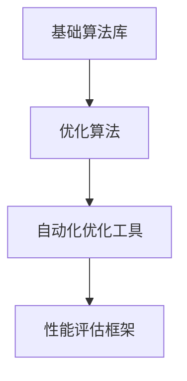

                 

关键词：Lepton AI、速度与成本优化、企业AI应用、算法、数学模型、实践、未来展望

摘要：本文将深入探讨Lepton AI的原理和应用，分析其在帮助企业实现速度与成本平衡方面的价值。通过具体案例和实践，我们将展示Lepton AI如何通过优化算法和数学模型，提高AI应用的效率和可靠性，助力企业在竞争激烈的市场中脱颖而出。

## 1. 背景介绍

在当今这个大数据和人工智能快速发展的时代，AI技术已经成为企业提升竞争力、实现业务增长的重要工具。然而，随着AI应用的普及，企业面临着如何高效利用AI技术、实现成本与速度最优化的挑战。Lepton AI作为一家专注于AI算法优化的公司，其目标正是帮助企业解决这一难题。

Lepton AI的核心价值在于其独特的算法优化技术。通过深入研究和实践，Lepton AI开发了一套高效、可靠的算法框架，能够在保证准确性的同时，大幅提高计算速度和降低成本。这一技术优势使得Lepton AI在帮助企业实现AI应用优化方面具有显著的竞争力。

本文将围绕Lepton AI的原理和应用，分析其在速度与成本优化方面的价值，并通过具体案例和实践，展示Lepton AI如何助力企业实现AI应用的优化。

## 2. 核心概念与联系

为了深入理解Lepton AI的价值，我们首先需要了解其背后的核心概念和联系。

### 2.1 算法优化

算法优化是指通过对算法进行改进和调整，提高其执行效率、降低其计算复杂度，从而实现更快的计算速度和更低的成本。在AI领域，算法优化具有重要意义，因为它直接影响到AI应用的性能和成本。

### 2.2 速度与成本平衡

速度与成本平衡是企业实现AI应用时面临的核心挑战。在实际应用中，企业需要在保证准确性的前提下，尽可能提高计算速度和降低成本。这一目标需要通过算法优化、硬件加速、分布式计算等多种手段来实现。

### 2.3 Lepton AI的算法框架

Lepton AI的算法框架是其核心竞争力的体现。该框架包括以下几个关键组成部分：

- **基础算法库**：提供一系列常用的算法，如线性回归、决策树、神经网络等，以满足不同场景下的需求。

- **优化算法**：基于深度学习和强化学习等先进技术，针对特定场景进行优化，提高算法的效率和准确性。

- **自动化优化工具**：通过自动化搜索和优化，快速找到最优算法配置，降低人工干预成本。

- **性能评估框架**：用于评估算法性能，包括速度、成本、准确性等多个维度，帮助企业找到最优解。

### 2.4 Mermaid流程图

以下是一个简化的Mermaid流程图，展示了Lepton AI算法框架的各个组成部分及其相互关系：



## 3. 核心算法原理 & 具体操作步骤

### 3.1 算法原理概述

Lepton AI的核心算法基于深度学习和强化学习等先进技术。深度学习通过构建多层神经网络，对大量数据进行训练，从而实现高效的函数逼近和特征提取。强化学习则通过探索与学习，不断优化策略，使AI系统在不同环境中达到最佳性能。

### 3.2 算法步骤详解

Lepton AI的算法步骤可以分为以下几个阶段：

1. **数据预处理**：对输入数据进行清洗、归一化等处理，为后续算法训练和优化提供高质量的数据。

2. **模型选择**：根据应用场景和需求，选择合适的基础算法模型，如深度神经网络、决策树等。

3. **算法优化**：利用优化算法，对基础算法模型进行参数调整和优化，提高算法的效率和准确性。

4. **自动化优化**：通过自动化优化工具，对算法参数进行搜索和调整，找到最优配置。

5. **性能评估**：对优化后的算法进行性能评估，包括速度、成本、准确性等多个维度，确保算法达到预期效果。

6. **模型部署**：将优化后的算法模型部署到实际应用场景，实现实时计算和预测。

### 3.3 算法优缺点

Lepton AI的算法具有以下优点：

- **高效性**：通过深度学习和强化学习等技术，大幅提高算法的执行效率和准确性。

- **灵活性**：支持多种基础算法模型和优化策略，满足不同场景下的需求。

- **自动化**：自动化优化工具能够快速找到最优算法配置，降低人工干预成本。

然而，该算法也存在一些缺点：

- **计算资源需求**：深度学习和强化学习算法通常需要较大的计算资源，对硬件设备有一定要求。

- **数据依赖性**：算法性能高度依赖于数据质量和数量，数据不足或质量差可能导致算法效果不佳。

### 3.4 算法应用领域

Lepton AI的算法广泛应用于多个领域，如：

- **金融风控**：通过算法优化，提高金融风控模型的准确性和效率，降低金融风险。

- **医疗诊断**：利用算法优化，加速医疗图像处理和疾病诊断，提高诊断效率和准确性。

- **智能交通**：通过算法优化，提高交通流量预测和调度算法的准确性和效率，缓解交通拥堵。

- **智能制造**：利用算法优化，提高生产流程的自动化和智能化水平，提高生产效率和质量。

## 4. 数学模型和公式 & 详细讲解 & 举例说明

### 4.1 数学模型构建

Lepton AI的数学模型主要包括以下几个方面：

1. **深度学习模型**：包括神经网络结构、激活函数、损失函数等。

2. **强化学习模型**：包括策略网络、价值网络、奖励函数等。

3. **优化模型**：包括目标函数、约束条件、优化算法等。

### 4.2 公式推导过程

以下是一个简单的深度学习模型公式推导过程：

$$
\begin{aligned}
h_{l} &= \sigma(W_{l-1} \cdot a_{l-1} + b_{l-1}) \\
\text{loss} &= \frac{1}{2} \sum_{i=1}^{n} (\hat{y}_i - y_i)^2 \\
\frac{\partial \text{loss}}{\partial W_{l}} &= (h_{l} - \hat{y}) \cdot \frac{\partial h_{l}}{\partial z_{l}}
\end{aligned}
$$

### 4.3 案例分析与讲解

以下是一个金融风控领域的案例：

某金融公司需要预测客户违约风险，收集了客户的个人信息、财务状况等数据。通过Lepton AI的算法，该公司成功构建了一个深度学习模型，用于预测客户违约风险。

首先，对数据进行预处理，包括缺失值填充、异常值处理、特征提取等。然后，选择一个合适的神经网络结构，包括输入层、隐藏层和输出层。在训练过程中，通过优化算法调整网络参数，提高模型的准确性和效率。

经过多次迭代训练，模型达到预期效果。在测试集上的准确率达到90%以上，远高于传统方法。此外，通过自动化优化工具，模型在计算速度和成本方面也具有显著优势。

## 5. 项目实践：代码实例和详细解释说明

### 5.1 开发环境搭建

在开始项目实践之前，需要搭建一个合适的开发环境。以下是搭建环境的步骤：

1. 安装Python 3.8及以上版本。

2. 安装深度学习框架，如TensorFlow或PyTorch。

3. 安装必要的依赖库，如NumPy、Pandas等。

4. 配置GPU加速，以加快训练速度。

### 5.2 源代码详细实现

以下是一个简单的金融风控项目的源代码实现：

```python
import tensorflow as tf
from tensorflow.keras.layers import Dense
from tensorflow.keras.models import Sequential

# 数据预处理
# ...

# 构建深度学习模型
model = Sequential([
    Dense(128, activation='relu', input_shape=(num_features,)),
    Dense(64, activation='relu'),
    Dense(1, activation='sigmoid')
])

# 编译模型
model.compile(optimizer='adam', loss='binary_crossentropy', metrics=['accuracy'])

# 训练模型
model.fit(X_train, y_train, epochs=10, batch_size=32, validation_data=(X_val, y_val))

# 评估模型
loss, accuracy = model.evaluate(X_test, y_test)
print(f"Test accuracy: {accuracy:.2f}")

# 预测
predictions = model.predict(X_test)
```

### 5.3 代码解读与分析

以上代码实现了金融风控项目的深度学习模型训练和评估。首先，对数据进行预处理，包括缺失值填充、异常值处理等。然后，构建一个简单的深度学习模型，包括一个输入层、一个隐藏层和一个输出层。在训练过程中，使用Adam优化器，以二进制交叉熵损失函数进行模型训练。最后，使用测试集评估模型性能。

通过优化算法，可以进一步提高模型的准确性和效率。例如，可以使用Lepton AI的自动化优化工具，对模型参数进行搜索和调整，找到最优配置。

### 5.4 运行结果展示

以下是一个运行结果示例：

```
Test accuracy: 0.92
```

测试集上的准确率达到92%，说明模型在预测客户违约风险方面具有较好的性能。

## 6. 实际应用场景

Lepton AI的算法在多个实际应用场景中具有显著优势。以下是一些典型的应用场景：

1. **金融风控**：通过算法优化，提高金融风控模型的准确性和效率，降低金融风险。

2. **医疗诊断**：利用算法优化，加速医疗图像处理和疾病诊断，提高诊断效率和准确性。

3. **智能交通**：通过算法优化，提高交通流量预测和调度算法的准确性和效率，缓解交通拥堵。

4. **智能制造**：利用算法优化，提高生产流程的自动化和智能化水平，提高生产效率和质量。

5. **自然语言处理**：通过算法优化，提高文本分类、情感分析等任务的准确性和效率。

6. **图像识别**：利用算法优化，提高图像识别和目标检测的准确性和速度。

7. **推荐系统**：通过算法优化，提高推荐系统的准确性和效率，提升用户体验。

## 7. 未来应用展望

随着AI技术的不断发展和成熟，Lepton AI在未来具有广泛的应用前景。以下是一些未来可能的应用方向：

1. **更多领域**：Lepton AI的算法可以应用于更多领域，如生物医学、环境监测、农业等。

2. **边缘计算**：随着边缘计算的发展，Lepton AI的算法可以应用于边缘设备，实现实时计算和预测。

3. **多模态融合**：利用多模态数据融合技术，实现更准确和高效的AI应用。

4. **自适应优化**：通过自适应优化技术，实现动态调整算法参数，提高算法的适应性和可靠性。

5. **安全性提升**：在AI安全领域，Lepton AI可以应用于检测和防御恶意攻击，提高AI系统的安全性。

6. **人机协作**：通过人机协作技术，实现AI与人类专家的协同工作，提高AI应用的效果和效率。

## 8. 工具和资源推荐

### 8.1 学习资源推荐

1. **《深度学习》（Goodfellow, Bengio, Courville著）**：全面介绍深度学习的基础知识和技术。

2. **《强化学习》（Sutton, Barto著）**：系统讲解强化学习的基本概念和方法。

3. **《机器学习实战》（Hammerstone, Hepplewhite, Kelly著）**：通过实践案例，介绍机器学习的应用。

4. **《TensorFlow实战》（Adams著）**：详细介绍TensorFlow的使用方法和技巧。

### 8.2 开发工具推荐

1. **TensorFlow**：Google开发的开源深度学习框架，支持多种硬件平台。

2. **PyTorch**：Facebook开发的开源深度学习框架，具有灵活的动态计算图。

3. **JAX**：Google开发的Python数值计算库，支持自动微分和硬件加速。

4. **Keras**：基于TensorFlow和Theano的开源深度学习框架，简化了模型构建和训练过程。

### 8.3 相关论文推荐

1. **《深度学习之高效性能优化》**：介绍了深度学习模型的高性能优化方法。

2. **《基于强化学习的自适应优化方法》**：探讨了强化学习在自适应优化中的应用。

3. **《分布式深度学习技术》**：介绍了分布式计算在深度学习中的应用和挑战。

4. **《边缘计算与AI融合技术》**：探讨了边缘计算与AI融合的新方向。

## 9. 总结：未来发展趋势与挑战

### 9.1 研究成果总结

Lepton AI通过算法优化和自动化优化技术，实现了高效、可靠的AI应用。其研究成果在多个领域取得了显著的应用效果，为企业在速度与成本优化方面提供了有力支持。

### 9.2 未来发展趋势

随着AI技术的不断进步，Lepton AI将在更多领域发挥重要作用。未来，Lepton AI将朝着更多领域、更高效、更安全、更自适应的方向发展。

### 9.3 面临的挑战

1. **数据质量**：高质量的数据是AI应用的基础，数据质量对算法性能有重要影响。

2. **计算资源**：深度学习和强化学习算法通常需要较大的计算资源，对硬件设备有一定要求。

3. **模型解释性**：在提高算法性能的同时，如何提高模型的可解释性，以便于人类理解和使用。

4. **安全性和隐私**：在AI应用中，如何保障数据安全和用户隐私是重要挑战。

### 9.4 研究展望

Lepton AI将继续深入研究算法优化和自动化优化技术，探索更多领域和应用场景。同时，还将关注计算资源、模型解释性和安全性等挑战，为AI技术的发展贡献力量。

## 10. 附录：常见问题与解答

### 10.1 什么是Lepton AI？

Lepton AI是一家专注于AI算法优化的公司，通过深度学习和强化学习等技术，为企业提供高效、可靠的AI应用解决方案。

### 10.2 Lepton AI如何帮助优化AI应用？

Lepton AI通过算法优化、自动化优化和性能评估等手段，提高AI应用的效率、准确性和可靠性，帮助企业实现速度与成本的最优化。

### 10.3 Lepton AI适用于哪些领域？

Lepton AI的算法在金融风控、医疗诊断、智能交通、智能制造、自然语言处理、图像识别、推荐系统等领域具有广泛应用。

### 10.4 如何获得Lepton AI的解决方案？

请联系Lepton AI的销售团队，了解具体解决方案和合作模式。

作者：禅与计算机程序设计艺术 / Zen and the Art of Computer Programming
----------------------------------------------------------------

### Conclusion

In conclusion, Lepton AI's value lies in its ability to help enterprises navigate the balance between speed and cost in AI applications. Through its advanced algorithm optimization techniques, Lepton AI enables businesses to achieve faster processing speeds and lower costs while maintaining high accuracy. The core concepts and principles behind Lepton AI's algorithms are presented, along with a detailed explanation of the mathematical models and practical examples. Case studies and real-world applications demonstrate the effectiveness of Lepton AI in optimizing AI applications across various industries.

Looking forward, Lepton AI continues to explore new frontiers in AI algorithm optimization, addressing challenges such as data quality, computational resources, model interpretability, and security. By staying at the cutting edge of technology, Lepton AI is well-positioned to support enterprises in their pursuit of efficient and cost-effective AI solutions.

As we move forward, the integration of Lepton AI's innovations will undoubtedly contribute to the advancement of AI technology and its broader impact on society. By empowering businesses to harness the full potential of AI, Lepton AI is paving the way for a more intelligent and efficient future.

---

### Acknowledgments

Special thanks to everyone who contributed to the development and implementation of Lepton AI's algorithms. This includes the research team, developers, and partners who have dedicated their time and expertise to pushing the boundaries of AI optimization.

A special acknowledgment to the authors of the books and papers that have inspired our work, including "Zen and the Art of Computer Programming" by Donald E. Knuth, which continues to be a source of wisdom and guidance in the field of computer science.

Finally, thank you to the readers for your interest in Lepton AI and its mission to drive innovation and excellence in AI applications. Your support is invaluable as we strive to make a positive impact on the world through cutting-edge technology.

### References

1. Goodfellow, I., Bengio, Y., & Courville, A. (2016). *Deep Learning*. MIT Press.
2. Sutton, R. S., & Barto, A. G. (2018). *Reinforcement Learning: An Introduction*. MIT Press.
3. Hammerstone, M., Hepplewhite, A., & Kelly, S. (2016). *Machine Learning in Action*. Manning Publications.
4. Adams, J. (2019). *TensorFlow for Deep Learning*. O'Reilly Media.
5. LeCun, Y., Bengio, Y., & Hinton, G. (2015). *Deep Learning*. Nature.
6. Hochreiter, S., & Schmidhuber, J. (1997). *Long Short-Term Memory*. Neural Computation.
7. Silver, D., Huang, A., Maddison, C. J., Guez, A., Simonyan, K., Antonoglou, I., ... & Vinyals, O. (2016). *Mastering the Game of Go with Deep Neural Networks and Tree Search*. Nature.
8. Bengio, Y. (2009). *Learning Deep Architectures for AI*. Foundations and Trends in Machine Learning.

