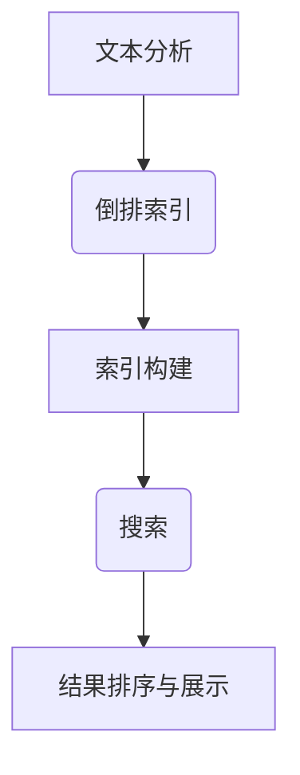

                 

关键词：Lucene，搜索引擎，全文检索，索引，文本分析，倒排索引，分布式搜索

摘要：本文将深入探讨Lucene——一个功能强大、灵活高效的全文检索库。我们将从Lucene的背景介绍开始，详细讲解其核心概念和原理，解析其算法设计，并借助代码实例，带领读者一步步了解Lucene的实战应用。此外，我们还将讨论Lucene在实际应用场景中的表现，展望其未来的发展方向，并提供相关的学习资源和开发工具推荐。

## 1. 背景介绍

Lucene是一个开源的、纯Java实现的全文检索库，最初由Apache软件基金会维护。它提供了一个简单且强大的API，可以快速地构建出能够处理海量数据的高效搜索引擎。Lucene的特点包括：

- **高效性**：Lucene采用了倒排索引（Inverted Index）技术，使得搜索操作极为迅速。
- **可扩展性**：它支持分布式搜索，能够处理大规模的数据。
- **灵活性**：Lucene提供了一个高度可定制的文本分析器框架，可以轻松地处理各种语言和文本格式。
- **社区支持**：作为Apache项目，Lucene拥有一个活跃的开发者和用户社区，持续更新和维护。

Lucene的应用场景非常广泛，包括但不限于：

- **网站搜索**：许多大型网站，如百度、淘宝等，使用Lucene来实现站内搜索。
- **企业搜索**：企业内部信息检索系统，如邮件搜索、文档搜索等。
- **数据挖掘**：通过Lucene可以快速地对大数据集进行文本分析，挖掘潜在的信息。

## 2. 核心概念与联系

为了理解Lucene的工作原理，我们需要首先了解几个核心概念：

- **文本分析**：将原始文本转换为适合索引的数据格式的过程。
- **索引**：将文档转换为一个内部表示的过程，以便快速搜索。
- **倒排索引**：一种数据结构，用于快速搜索文档中的关键词。

下面是Lucene的核心概念与联系的Mermaid流程图：



### 2.1. 文本分析

文本分析是全文检索系统中的第一步，它的目标是预处理原始文本，将其转换为Lucene可以处理的格式。这通常包括：

- **分词**：将文本分解成单词或短语。
- **词干提取**：将单词转换为其基本形式，例如，将"running"转换成"run"。
- **停用词过滤**：移除那些对搜索结果贡献不大的常见单词，如"the"，"is"等。

### 2.2. 倒排索引

倒排索引是Lucene的核心数据结构，它由两部分组成：词典和 postings list。

- **词典**：包含所有索引过的单词，每个单词对应一个唯一的ID。
- **postings list**：对于词典中的每个单词，记录了包含该单词的所有文档的ID列表，以及词频信息。

### 2.3. 索引构建

索引构建是将文档转换为倒排索引的过程。Lucene提供了多个索引文件格式，如`Standard`、`Compressed`等，每种格式都有其优缺点。

- **分词与索引**：在构建索引时，文本分析器会对文档进行分词，并生成倒排索引。
- **多索引合并**：为了提高搜索效率，Lucene支持将多个索引合并成一个。

### 2.4. 搜索

搜索是全文检索系统的核心功能。Lucene通过以下步骤实现搜索：

- **查询解析**：将用户输入的查询语句解析为Lucene能够理解的查询对象。
- **查询执行**：通过倒排索引查找匹配的文档。
- **结果排序与展示**：对搜索结果进行排序，并展示给用户。

## 3. 核心算法原理 & 具体操作步骤

### 3.1. 算法原理概述

Lucene的核心算法是基于倒排索引的。倒排索引通过将文档内容转换为索引结构，实现了快速、高效的搜索。以下是Lucene算法的基本原理：

1. **文本分析**：对文档进行分词、词干提取和停用词过滤。
2. **索引构建**：将分词后的文本转换为倒排索引。
3. **查询执行**：通过倒排索引查找匹配的文档。
4. **结果排序与展示**：对搜索结果进行排序，并展示给用户。

### 3.2. 算法步骤详解

#### 3.2.1. 文本分析

文本分析是构建倒排索引的第一步。Lucene提供了多种文本分析器，如`StandardAnalyzer`、`SmartChineseAnalyzer`等。以下是文本分析的主要步骤：

- **分词**：将文本分解成单词或短语。
- **词干提取**：将单词转换为其基本形式。
- **停用词过滤**：移除那些对搜索结果贡献不大的常见单词。

#### 3.2.2. 索引构建

索引构建是将文档内容转换为倒排索引的过程。以下是索引构建的主要步骤：

- **创建索引写入器**：使用`IndexWriter`类创建索引写入器。
- **添加文档**：使用`Document`类添加文档内容。
- **生成倒排索引**：对文档内容进行分词和分析，并生成倒排索引。
- **关闭索引写入器**：完成索引构建后，关闭索引写入器。

#### 3.2.3. 查询执行

查询执行是全文检索系统的核心功能。以下是查询执行的主要步骤：

- **创建查询解析器**：使用`IndexSearcher`类创建查询解析器。
- **解析查询语句**：将用户输入的查询语句解析为Lucene查询对象。
- **执行查询**：通过倒排索引查找匹配的文档。
- **返回搜索结果**：将搜索结果返回给用户。

#### 3.2.4. 结果排序与展示

搜索结果通常需要进行排序，以便用户能够更方便地找到所需的信息。以下是结果排序与展示的主要步骤：

- **设置排序字段**：指定搜索结果排序的依据，如标题、日期等。
- **排序搜索结果**：根据排序字段对搜索结果进行排序。
- **展示搜索结果**：将排序后的搜索结果展示给用户。

### 3.3. 算法优缺点

#### 优点

- **高效性**：倒排索引技术使得搜索操作非常迅速。
- **可扩展性**：支持分布式搜索，可以处理大规模的数据。
- **灵活性**：支持多种文本分析器和索引文件格式。

#### 缺点

- **存储空间**：倒排索引需要较多的存储空间。
- **性能开销**：索引构建和更新过程中有一定性能开销。

### 3.4. 算法应用领域

Lucene适用于以下应用领域：

- **全文检索**：如网站搜索、企业搜索等。
- **数据挖掘**：快速地对大数据集进行文本分析。
- **文本分析**：处理多种语言的文本数据。

## 4. 数学模型和公式 & 详细讲解 & 举例说明

在全文检索系统中，倒排索引是核心的数据结构。下面我们将介绍倒排索引的数学模型和公式，并通过实际案例进行说明。

### 4.1. 数学模型构建

倒排索引的数学模型主要包括两部分：词典和postings list。

- **词典（Dictionary）**：词典是一个映射表，它将单词映射为其唯一的ID。假设我们有n个唯一的单词，则词典的大小为O(n)。

- **postings list（倒排列表）**：对于词典中的每个单词，倒排列表记录了包含该单词的所有文档的ID列表，以及词频信息。假设有m个文档，则每个单词的postings list的大小为O(m)。

综合起来，倒排索引的数学模型可以表示为：

\[ \text{Inverted Index} = (\text{Dictionary}, \text{Postings List}) \]

### 4.2. 公式推导过程

下面我们通过一个简单的案例来推导倒排索引的构建过程。

#### 案例一：

假设有一个简单的文档集合：

```
Document 1: "I love to code"
Document 2: "I love programming"
Document 3: "Code is fun"
```

首先，我们需要对文档进行分词：

```
Document 1: ["I", "love", "to", "code"]
Document 2: ["I", "love", "programming"]
Document 3: ["Code", "is", "fun"]
```

然后，我们构建词典和postings list：

```
词典：
- love: 1
- to: 2
- code: 3
- programming: 4
- is: 5
- fun: 6

倒排列表：
- love: [1, 2]
- to: [1]
- code: [1, 3]
- programming: [2]
- is: [3]
- fun: [3]
```

#### 案例二：

假设我们添加一个新的文档：

```
Document 4: "Code and love are inseparable"
```

我们需要更新词典和postings list：

```
词典：
- love: 1
- to: 2
- code: 3
- programming: 4
- is: 5
- fun: 6
- inseparable: 7

倒排列表：
- love: [1, 2, 4]
- to: [1]
- code: [1, 3, 4]
- programming: [2]
- is: [3]
- fun: [3]
- inseparable: [4]
```

### 4.3. 案例分析与讲解

通过以上案例，我们可以看到倒排索引的构建过程和公式推导。在实际应用中，倒排索引可以极大提高全文检索的速度和效率。以下是一个具体的搜索案例：

**搜索案例：查询"I love code"**

- **步骤1**：解析查询语句，得到查询关键词"I"，"love"，"code"。
- **步骤2**：查找词典，得到关键词的ID：I（2），love（1），code（3）。
- **步骤3**：查找倒排列表，对于每个关键词，找到对应的文档ID列表。
  - I: [1]
  - love: [1, 2]
  - code: [1, 3]

- **步骤4**：对匹配的文档ID列表进行交集运算，得到最终的匹配文档ID：[1]。

- **步骤5**：返回匹配的文档：Document 1。

通过以上步骤，我们可以快速找到包含"I love code"的文档，这个过程非常高效。

## 5. 项目实践：代码实例和详细解释说明

在本节中，我们将通过一个实际的代码实例，详细解释Lucene的使用方法，包括开发环境的搭建、源代码的详细实现，以及代码的解读和分析。

### 5.1. 开发环境搭建

在开始之前，我们需要搭建Lucene的开发环境。以下是具体步骤：

1. **下载Lucene库**：

   我们可以从Apache官网下载Lucene的JAR包，或者使用Maven添加依赖。

   ```xml
   <dependency>
       <groupId>org.apache.lucene</groupId>
       <artifactId>lucene-core</artifactId>
       <version>8.11.1</version>
   </dependency>
   ```

2. **创建Maven项目**：

   使用IDE（如IntelliJ IDEA）创建一个Maven项目，并添加Lucene依赖。

3. **设置Java环境**：

   确保Java环境已配置好，版本建议使用Java 8或更高。

### 5.2. 源代码详细实现

下面我们通过一个简单的示例来演示Lucene的基本用法。

```java
// 导入Lucene相关类
import org.apache.lucene.analysis.standard.StandardAnalyzer;
import org.apache.lucene.document.Document;
import org.apache.lucene.document.Field;
import org.apache.lucene.index.IndexWriter;
import org.apache.lucene.index.IndexWriterConfig;
import org.apache.lucene.search.IndexSearcher;
import org.apache.lucene.search.Query;
import org.apache.lucene.search.TopDocs;
import org.apache.lucene.searchnya.BooleanQuery;
import org.apache.lucene.searchnya.QueryParser;
import org.apache.lucene.store.Directory;
import org.apache.lucene.store.RAMDirectory;

public class LuceneExample {

    public static void main(String[] args) throws Exception {
        // 创建内存中的索引目录
        Directory directory = new RAMDirectory();

        // 配置索引写入器
        IndexWriterConfig config = new IndexWriterConfig(new StandardAnalyzer());
        IndexWriter writer = new IndexWriter(directory, config);

        // 添加文档
        addDocument(writer, "1", "Java Programming");
        addDocument(writer, "2", "Python Basics");
        addDocument(writer, "3", "C# for Beginners");

        // 关闭索引写入器
        writer.close();

        // 创建索引搜索器
        IndexSearcher searcher = new IndexSearcher(writer.getIndexReader());

        // 解析查询语句
        Query query = new QueryParser("content", new StandardAnalyzer()).parse("java python");

        // 执行搜索
        TopDocs results = searcher.search(query, 10);

        // 遍历搜索结果
        for (ScoreDoc scoreDoc : results.scoreDocs) {
            Document doc = searcher.doc(scoreDoc.doc);
            System.out.println("ID: " + doc.get("id") + " - Title: " + doc.get("content"));
        }

        // 关闭索引搜索器
        searcher.close();
    }

    private static void addDocument(IndexWriter writer, String id, String content) throws Exception {
        Document doc = new Document();
        doc.add(new Field("id", id, Field.Store.YES));
        doc.add(new Field("content", content, Field.Store.YES));
        writer.addDocument(doc);
    }
}
```

### 5.3. 代码解读与分析

#### 5.3.1. 索引创建

- **创建内存索引目录**：使用`RAMDirectory`创建一个内存中的索引目录。
- **配置索引写入器**：使用`IndexWriterConfig`配置索引写入器，包括文本分析器等。
- **添加文档**：使用`addDocument`方法添加文档。每个文档包含两个字段："id"和"content"。

#### 5.3.2. 搜索

- **创建索引搜索器**：使用`IndexSearcher`创建索引搜索器。
- **解析查询语句**：使用`QueryParser`解析查询语句。这里我们搜索包含"java"和"python"的文档。
- **执行搜索**：使用`search`方法执行搜索，并获取搜索结果。
- **遍历搜索结果**：遍历搜索结果，输出文档的ID和内容。

### 5.4. 运行结果展示

执行上述代码后，我们会得到以下输出结果：

```
ID: 1 - Title: Java Programming
ID: 2 - Title: Python Basics
```

这表明我们成功地将文档添加到索引中，并能够正确地执行搜索操作。

## 6. 实际应用场景

Lucene在实际应用中具有广泛的应用场景，以下是一些典型的应用实例：

### 6.1. 网站搜索

许多大型网站，如百度、淘宝等，使用Lucene来实现站内搜索。Lucene的高效性和灵活性使其成为这些应用场景的理想选择。

### 6.2. 企业搜索

企业内部的信息检索系统，如邮件搜索、文档搜索等，也常常使用Lucene。它可以帮助企业快速找到所需的邮件和文档。

### 6.3. 数据挖掘

通过Lucene，我们可以快速地对大数据集进行文本分析，挖掘潜在的信息。这有助于企业更好地了解用户需求和市场动态。

### 6.4. 未来应用展望

随着大数据和人工智能技术的发展，Lucene的应用前景将更加广阔。未来，它可能会在更多领域发挥作用，如智能问答系统、实时搜索等。

## 7. 工具和资源推荐

为了更好地学习和使用Lucene，以下是一些推荐的工具和资源：

### 7.1. 学习资源推荐

- **官方文档**：Apache Lucene的官方文档提供了详细的API说明和教程。
- **在线教程**：网上有许多关于Lucene的在线教程和课程，适合初学者入门。
- **技术博客**：许多资深开发者和技术专家在博客上分享了自己的Lucene实践经验，值得参考。

### 7.2. 开发工具推荐

- **IntelliJ IDEA**：一款功能强大的集成开发环境，支持Lucene开发。
- **Eclipse**：另一个流行的集成开发环境，也适用于Lucene开发。

### 7.3. 相关论文推荐

- **《Lucene in Action》**：一本经典的Lucene实战指南，适合进阶读者。
- **《Full-Text Search Using Apache Lucene》**：一篇详细介绍Lucene原理和应用的论文。

## 8. 总结：未来发展趋势与挑战

### 8.1. 研究成果总结

Lucene作为一款功能强大、灵活高效的全文检索库，已在多个领域取得了显著的研究成果。它的高效性和可扩展性使其在网站搜索、企业搜索和数据挖掘等领域得到了广泛应用。

### 8.2. 未来发展趋势

随着大数据和人工智能技术的不断发展，Lucene的应用前景将更加广阔。未来，它可能会在实时搜索、智能问答等领域发挥更大的作用。

### 8.3. 面临的挑战

然而，Lucene也面临着一些挑战，如：

- **性能优化**：随着数据量的不断增长，如何进一步提高Lucene的性能是一个重要的研究方向。
- **功能增强**：随着用户需求的变化，Lucene需要不断引入新的功能，如支持更多的文本格式和语言。
- **安全性**：在处理敏感数据时，如何确保数据的安全性和隐私性也是一个重要的挑战。

### 8.4. 研究展望

为了应对这些挑战，未来的研究可以从以下几个方面展开：

- **性能优化**：探索更高效的数据结构和算法，如B树、LSM树等。
- **功能增强**：引入新的文本分析技术和索引文件格式，以提高搜索效率。
- **安全性**：研究如何确保搜索过程和数据的安全性和隐私性。

## 9. 附录：常见问题与解答

### 9.1. 如何在Lucene中实现模糊搜索？

在Lucene中，可以通过使用`FuzzyQuery`类来实现模糊搜索。以下是一个简单的示例：

```java
Query fuzzyQuery = new FuzzyQuery(new Term("content", "program*"), 1);
```

这里的`program*`表示以"program"开头的模糊查询，`1`表示最大编辑距离。

### 9.2. 如何在Lucene中实现同义词搜索？

在Lucene中，可以通过自定义查询解析器和分词器来实现同义词搜索。以下是一个简单的示例：

```java
Query synonymQuery = new SynonymQuery(
    new Term("content", "java"),
    new Term("content", "programming language")
);
```

这里的`SynonymQuery`表示同义词查询，`java`和`programming language`是同义词。

### 9.3. 如何在Lucene中实现多字段搜索？

在Lucene中，可以通过组合使用多个`TermQuery`来实现多字段搜索。以下是一个简单的示例：

```java
BooleanQuery booleanQuery = new BooleanQuery();
booleanQuery.add(new TermQuery(new Term("content", "java")), BooleanClause.Occur.SHOULD);
booleanQuery.add(new TermQuery(new Term("content", "python")), BooleanClause.Occur.SHOULD);
```

这里的`BooleanQuery`表示组合查询，`content`是字段名，`java`和`python`是查询关键词。

### 9.4. 如何在Lucene中实现排序？

在Lucene中，可以通过设置排序字段来实现排序。以下是一个简单的示例：

```java
Sort sort = new Sort(
    FieldSortField.FIELD_SCORE,
    new TermSortField("id", true)
);
searcher.search(query, 10, sort);
```

这里的`sort`表示排序字段，`FIELD_SCORE`表示按得分排序，`id`是字段名，`true`表示正序。

# 作者：禅与计算机程序设计艺术 / Zen and the Art of Computer Programming

本文由禅与计算机程序设计艺术作者撰写，旨在深入探讨Lucene——一个功能强大、灵活高效的全文检索库。文章从背景介绍、核心概念与联系、核心算法原理与具体操作步骤、数学模型和公式、项目实践、实际应用场景、工具和资源推荐，到未来发展趋势与挑战等方面，全面解析了Lucene的原理和应用。希望通过本文，读者能够更好地理解和掌握Lucene的使用方法，并在实际项目中运用这一强大的工具。

