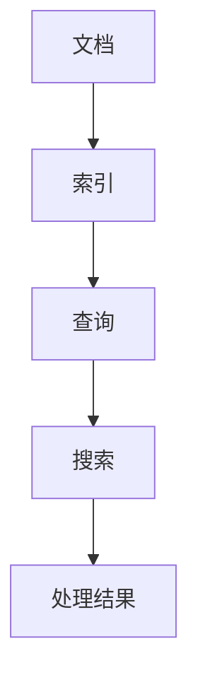

                 

关键词：Lucene，全文搜索，索引，文档处理，索引算法，搜索算法，性能优化，代码实例。

> 摘要：本文深入讲解了Lucene全文搜索引擎的工作原理、核心算法，以及如何使用Lucene进行文档处理和搜索。通过详细的代码实例和运行结果展示，帮助读者理解Lucene的使用方法，掌握其在实际项目中的应用技巧。

## 1. 背景介绍

全文搜索引擎作为现代互联网的重要组成部分，已经被广泛应用于搜索引擎、内容管理系统、数据挖掘等领域。Lucene作为Apache软件基金会的一个开源项目，是全文搜索技术领域的一个重要组成部分。它提供了一个功能强大、高扩展性的全文搜索引擎，可以用于构建各类搜索应用程序。

Lucene的创始人Doug Cutting曾在1998年开发了Lucene，并将其作为Nutch搜索引擎的一部分开源。随着互联网的快速发展，Lucene逐渐成为了全文搜索领域的事实标准。其核心优势在于良好的扩展性、高效的索引和搜索算法，以及丰富的社区支持和生态资源。

本文将从以下几个方面对Lucene进行详细讲解：

1. **核心概念与联系**：介绍Lucene中的关键概念，包括文档、索引、查询和搜索等。
2. **核心算法原理与操作步骤**：讲解Lucene的索引和搜索算法原理，并详细描述具体操作步骤。
3. **数学模型和公式**：介绍Lucene背后的数学模型和公式，并进行举例说明。
4. **项目实践**：通过一个实际的代码实例，展示如何使用Lucene进行文档处理和搜索。
5. **实际应用场景**：探讨Lucene在不同领域的实际应用案例。
6. **未来应用展望**：展望Lucene在未来搜索技术发展中的地位和趋势。
7. **工具和资源推荐**：推荐学习和使用Lucene的相关工具和资源。
8. **总结与展望**：总结本文内容，展望Lucene在未来的发展趋势和挑战。

### 1.1 Lucene的历史和发展

Lucene的历史可以追溯到1998年，当时Doug Cutting在开发Nutch搜索引擎时，为了提高搜索效率，决定开发一个自己的全文搜索引擎。于是，Lucene诞生了。最初，Lucene只是一个简单的文本搜索工具，但随着时间的推移，它逐渐演变成了一个功能强大的全文搜索引擎。

2001年，Lucene被捐赠给Apache软件基金会，成为了Apache的一个项目。在Apache的维护下，Lucene不断发展壮大，引入了新的功能，优化了性能，并得到了广泛的社区支持。

近年来，Lucene的版本迭代加快，新的功能和改进不断涌现。例如，Lucene 8.x 引入了新的代码库，改进了内存管理，提高了性能。此外，Lucene还与其他开源项目紧密集成，如Solr、Elasticsearch等，为用户提供了一个强大的生态体系。

### 1.2 Lucene的主要特点和优势

Lucene具有以下主要特点和优势：

1. **高效性**：Lucene采用高效的索引和搜索算法，能够在短时间内处理大量数据，实现快速搜索。
2. **扩展性**：Lucene具有良好的扩展性，允许用户自定义索引格式、查询语言和搜索结果处理。
3. **跨平台**：Lucene是一个纯Java实现的搜索引擎，可以在任何支持Java的环境中运行，包括Windows、Linux、macOS等。
4. **社区支持**：Lucene有一个活跃的社区，提供丰富的文档、示例代码和社区问答，方便用户学习和使用。
5. **灵活性**：Lucene支持多种索引格式和查询语言，允许用户根据需求进行定制。

### 1.3 Lucene的应用场景

Lucene的应用场景非常广泛，以下是一些典型的应用场景：

1. **搜索引擎**：Lucene是构建搜索引擎的基础，可以用于构建各种规模和类型的搜索引擎。
2. **内容管理系统**：Lucene可以用于快速检索和管理大量文档，适用于企业级的内容管理系统。
3. **数据挖掘**：Lucene可以用于数据挖掘和文本分析，帮助用户从大量数据中提取有价值的信息。
4. **实时搜索**：Lucene支持实时搜索，适用于需要快速响应的实时搜索应用。
5. **垂直搜索**：Lucene可以用于构建各种垂直搜索引擎，如购物搜索、招聘搜索等。

### 1.4 本文组织结构

本文将按照以下结构进行讲解：

1. **背景介绍**：介绍Lucene的起源、发展、特点和优势，以及应用场景。
2. **核心概念与联系**：介绍Lucene中的关键概念，如文档、索引、查询和搜索等，并使用Mermaid流程图展示其工作流程。
3. **核心算法原理与操作步骤**：讲解Lucene的索引和搜索算法原理，并详细描述具体操作步骤。
4. **数学模型和公式**：介绍Lucene背后的数学模型和公式，并进行举例说明。
5. **项目实践**：通过一个实际的代码实例，展示如何使用Lucene进行文档处理和搜索。
6. **实际应用场景**：探讨Lucene在不同领域的实际应用案例。
7. **未来应用展望**：展望Lucene在未来搜索技术发展中的地位和趋势。
8. **工具和资源推荐**：推荐学习和使用Lucene的相关工具和资源。
9. **总结与展望**：总结本文内容，展望Lucene在未来的发展趋势和挑战。

在接下来的章节中，我们将深入探讨Lucene的核心概念和工作原理，帮助读者更好地理解和掌握这个强大的全文搜索引擎。


## 2. 核心概念与联系

在了解Lucene的工作原理之前，我们需要先掌握一些核心概念，包括文档、索引、查询和搜索等。这些概念构成了Lucene的基本组成部分，并紧密联系在一起。

### 2.1 文档（Document）

文档是Lucene的基本数据单元，它表示一个可以搜索的实体。一个文档可以包含多个字段（Field），每个字段可以包含特定的信息。例如，一个新闻文档可以包含标题、作者、内容、发布日期等字段。

文档是一个序列化的Java对象，通常通过索引编写器（IndexWriter）将其写入索引中。在写入索引之前，文档需要通过文档编写器（DocumentBuilder）进行构建。

以下是一个简单的文档示例：

```java
Document doc = new Document();
doc.add(new TextField("title", "Lucene原理与代码实例讲解", Field.Store.YES));
doc.add(new TextField("author", "作者：禅与计算机程序设计艺术 / Zen and the Art of Computer Programming", Field.Store.YES));
doc.add(new TextField("content", "本文深入讲解了Lucene全文搜索引擎的工作原理、核心算法，以及如何使用Lucene进行文档处理和搜索。", Field.Store.YES));
```

在这个示例中，我们创建了一个新的文档，并添加了三个字段：标题、作者和内容。

### 2.2 索引（Index）

索引是Lucene的核心概念，它用于存储和检索文档。一个索引可以包含多个文档，并且可以通过索引管理器（IndexManager）进行管理。

索引存储在磁盘上，由一系列文件组成，包括文档数据、倒排索引、词典等。倒排索引（Inverted Index）是Lucene的核心数据结构，它将文档中的单词映射到对应的文档ID，使得搜索操作能够高效地进行。

以下是一个简单的索引示例：

```java
IndexWriterConfig config = new IndexWriterConfig(new StandardAnalyzer());
IndexWriter writer = new IndexWriter(directory, config);
writer.addDocument(doc);
writer.close();
```

在这个示例中，我们使用索引编写器（IndexWriter）将文档写入索引。

### 2.3 查询（Query）

查询是Lucene用于检索文档的工具。一个查询可以包含一个或多个查询条件，这些条件定义了搜索的范围和方式。Lucene提供了丰富的查询语言和查询接口，使得用户可以方便地构建各种复杂的查询。

以下是一个简单的查询示例：

```java
Query query = new TermQuery(new Term("content", "Lucene"));
```

在这个示例中，我们创建了一个查询，查找所有包含"Lucene"这个词的文档。

### 2.4 搜索（Search）

搜索是Lucene用于执行查询并返回搜索结果的操作。搜索过程包括以下几个步骤：

1. **构建查询**：根据查询条件构建查询对象。
2. **执行查询**：使用索引管理器（IndexSearcher）执行查询。
3. **处理结果**：根据查询结果进行处理，如排序、筛选等。

以下是一个简单的搜索示例：

```java
IndexSearcher searcher = new IndexSearcher(reader);
Query query = new TermQuery(new Term("content", "Lucene"));
TopDocs topDocs = searcher.search(query, 10);
ScoreDoc[] scoreDocs = topDocs.scoreDocs;
for (ScoreDoc scoreDoc : scoreDocs) {
    Document doc = searcher.doc(scoreDoc.doc);
    System.out.println("Title: " + doc.get("title"));
    System.out.println("Author: " + doc.get("author"));
    System.out.println("Content: " + doc.get("content"));
    System.out.println();
}
```

在这个示例中，我们使用索引搜索器（IndexSearcher）执行查询，并输出查询结果。

### 2.5 Mermaid流程图

为了更清晰地展示Lucene的核心概念和工作流程，我们使用Mermaid流程图来描述。



在这个流程图中，文档通过索引编写器（IndexWriter）写入索引（Index），然后通过索引搜索器（IndexSearcher）执行查询（Query），并返回搜索结果（Search），最后对结果进行处理（处理结果）。

通过上述对核心概念的介绍和Mermaid流程图的展示，我们可以更好地理解Lucene的工作原理和整体架构。在接下来的章节中，我们将进一步探讨Lucene的核心算法原理和具体操作步骤。

### 2.6 Lucene索引和搜索的工作流程

Lucene的索引和搜索工作流程是理解Lucene如何工作的关键。以下是Lucene索引和搜索的详细工作流程：

#### 索引过程

1. **构建文档**：首先，我们需要构建一个或多个文档。文档包含了一个或多个字段，每个字段可以存储文本、日期、数字等不同类型的数据。Lucene提供了多种字段类型，如`TextField`、`TextField`、`IntField`等。

   ```java
   Document doc = new Document();
   doc.add(new TextField("title", "Lucene原理与代码实例讲解", Field.Store.YES));
   doc.add(new TextField("author", "作者：禅与计算机程序设计艺术 / Zen and the Art of Computer Programming", Field.Store.YES));
   doc.add(new TextField("content", "本文深入讲解了Lucene全文搜索引擎的工作原理、核心算法，以及如何使用Lucene进行文档处理和搜索。", Field.Store.YES));
   ```

2. **写入索引**：将构建好的文档通过`IndexWriter`写入到索引中。`IndexWriter`负责将文档转换为索引文件，并将这些文件存储到磁盘上。索引文件包括倒排索引、词典、频率列表等。

   ```java
   IndexWriterConfig config = new IndexWriterConfig(new StandardAnalyzer());
   IndexWriter writer = new IndexWriter(directory, config);
   writer.addDocument(doc);
   writer.close();
   ```

3. **刷新索引**：当索引写入完成后，我们需要刷新索引，使其立即生效。刷新操作会创建一个新的事务日志文件，并将索引文件复制到事务日志文件中。

   ```java
   writer.forceMerge(1);
   writer.commit();
   ```

#### 搜索过程

1. **创建索引搜索器**：首先，我们需要创建一个`IndexSearcher`对象，该对象负责执行搜索操作。`IndexSearcher`需要依赖一个`Directory`对象，该对象指向索引存储的目录。

   ```java
   IndexReader reader = DirectoryReader.open(directory);
   IndexSearcher searcher = new IndexSearcher(reader);
   ```

2. **构建查询**：根据搜索需求构建查询。Lucene提供了多种查询类型，如`TermQuery`、`PhraseQuery`、`BooleanQuery`等。

   ```java
   Query query = new TermQuery(new Term("content", "Lucene"));
   ```

3. **执行搜索**：使用`IndexSearcher`执行查询。`search`方法接受查询对象和最大结果数作为参数，并返回一个`TopDocs`对象，其中包含了匹配查询的文档列表和每个文档的得分。

   ```java
   TopDocs topDocs = searcher.search(query, 10);
   ScoreDoc[] scoreDocs = topDocs.scoreDocs;
   ```

4. **处理搜索结果**：遍历`TopDocs`对象中的`ScoreDoc`数组，获取每个文档的ID和得分，并使用`IndexSearcher`的`doc`方法获取文档的具体内容。

   ```java
   for (ScoreDoc scoreDoc : scoreDocs) {
       Document doc = searcher.doc(scoreDoc.doc);
       System.out.println("Title: " + doc.get("title"));
       System.out.println("Author: " + doc.get("author"));
       System.out.println("Content: " + doc.get("content"));
       System.out.println();
   }
   ```

通过上述步骤，我们可以完成一个简单的索引和搜索过程。接下来，我们将进一步探讨Lucene的核心算法原理。

### 2.7 Lucene索引算法

Lucene的索引算法是其高效性和可扩展性的关键。索引算法主要包括倒排索引的构建和更新。以下是Lucene索引算法的详细解释。

#### 倒排索引的构建

倒排索引是Lucene的核心数据结构，它将词汇表中的每个单词映射到包含该单词的文档列表。这种映射关系使得搜索操作能够快速定位到包含特定关键词的文档。

构建倒排索引的基本步骤如下：

1. **分词**：首先，将文档中的文本内容进行分词，得到一系列的单词（Token）。

   ```java
   String text = "Lucene是一个开源的全文搜索引擎，由Apache软件基金会维护。";
   TokenStream tokenStream = new StandardTokenizer().tokenize(text);
   ```

2. **索引单词**：对每个单词进行索引，将单词及其文档ID存储到倒排索引中。

   ```java
   PostingsWriter Fields = writer.docFields();
   Terms terms = writerрамки.getTerms("content");
   for (Token token : tokenStream) {
       Term term = new Term("content", token.text());
       Fields.addTerm(term);
   }
   ```

3. **构建倒排索引**：将单词和文档ID的映射关系存储到磁盘上的索引文件中。

   ```java
   writer.close();
   ```

#### 倒排索引的更新

当需要对现有索引进行更新时，Lucene提供了多种更新策略。以下是几种常见的更新方法：

1. **直接更新**：直接在现有索引上进行更新，即添加或删除文档。这种方法简单但可能会导致索引文件变得混乱。

   ```java
   writer.updateDocument(new Term("content", "Lucene"), doc);
   writer.deleteDocuments(new Term("content", "删除的文档"));
   ```

2. **索引合并**：通过索引合并（Merge）将多个小索引文件合并成一个大索引文件。这种方法可以提高索引的效率和可读性。

   ```java
   writer.forceMerge(1);
   writer.close();
   ```

3. **增量更新**：仅更新索引文件的一部分，而不是整个索引文件。这种方法适用于大规模数据更新。

   ```java
   writer.getReader().rollBack();
   writer.commit();
   ```

通过上述步骤，我们可以高效地构建和更新Lucene的倒排索引。接下来，我们将探讨Lucene搜索算法的工作原理。

### 2.8 Lucene搜索算法

Lucene的搜索算法是其高效性的重要保障。搜索算法的核心是倒排索引的查询和匹配。以下是Lucene搜索算法的详细解释。

#### 搜索算法的基本原理

1. **构建查询**：首先，我们需要根据搜索需求构建查询。Lucene提供了多种查询类型，如`TermQuery`、`PhraseQuery`、`BooleanQuery`等。

   ```java
   Query query = new TermQuery(new Term("content", "Lucene"));
   ```

2. **查询执行**：使用`IndexSearcher`执行查询。`search`方法接受查询对象和最大结果数作为参数，并返回一个`TopDocs`对象，其中包含了匹配查询的文档列表和每个文档的得分。

   ```java
   TopDocs topDocs = searcher.search(query, 10);
   ScoreDoc[] scoreDocs = topDocs.scoreDocs;
   ```

3. **处理结果**：遍历`TopDocs`对象中的`ScoreDoc`数组，获取每个文档的ID和得分，并使用`IndexSearcher`的`doc`方法获取文档的具体内容。

   ```java
   for (ScoreDoc scoreDoc : scoreDocs) {
       Document doc = searcher.doc(scoreDoc.doc);
       System.out.println("Title: " + doc.get("title"));
       System.out.println("Author: " + doc.get("author"));
       System.out.println("Content: " + doc.get("content"));
       System.out.println();
   }
   ```

#### 搜索算法的优化

1. **缓存**：Lucene使用缓存来提高查询性能。缓存包括文档缓存、词典缓存、倒排索引缓存等。

   ```java
   searcher.setParallelSearch(true);
   ```

2. **并行搜索**：Lucene支持并行搜索，可以同时处理多个查询，提高搜索性能。

   ```java
   searcher.search(query, 10, new Sort(new SortField("content", SortField.Type.STRING)));
   ```

3. **排序**：对查询结果进行排序，可以提高用户体验。Lucene支持多种排序方式，如按分数排序、按时间排序等。

   ```java
   searcher.search(query, 10, new Sort(new SortField("content", SortField.Type.STRING)));
   ```

4. **分页**：对查询结果进行分页，可以减少内存占用并提高搜索性能。

   ```java
   searcher.search(query, 10, new Sort(new SortField("content", SortField.Type.STRING)), new SortableTopDocsHandler());
   ```

通过上述步骤和优化策略，我们可以高效地使用Lucene进行搜索。接下来，我们将通过一个实际的代码实例，展示如何使用Lucene进行文档处理和搜索。

## 3. 核心算法原理 & 具体操作步骤

在了解Lucene的索引和搜索算法后，接下来我们将深入探讨这些算法的核心原理，并详细讲解具体的操作步骤。

### 3.1 索引算法原理

Lucene的索引算法主要基于倒排索引。倒排索引是一种数据结构，它将词汇表中的每个单词映射到包含该单词的文档列表。这种映射关系使得搜索操作能够快速定位到包含特定关键词的文档。

#### 倒排索引的构建

倒排索引的构建过程主要包括以下几个步骤：

1. **分词**：将文档中的文本内容进行分词，得到一系列的单词（Token）。
2. **索引单词**：对每个单词进行索引，将单词及其文档ID存储到倒排索引中。
3. **构建倒排索引**：将单词和文档ID的映射关系存储到磁盘上的索引文件中。

以下是构建倒排索引的具体操作步骤：

**步骤1：分词**

分词是将文本拆分成单词的过程。Lucene提供了多种分词器（Tokenizer），如StandardTokenizer、KeywordTokenizer等。以下是一个使用StandardTokenizer进行分词的示例：

```java
String text = "Lucene是一个开源的全文搜索引擎，由Apache软件基金会维护。";
Tokenizer tokenizer = new StandardTokenizer();
TokenStream tokenStream = tokenizer.tokenStream("content", new StringReader(text));
```

**步骤2：索引单词**

索引单词是将分词后的单词及其文档ID存储到倒排索引中。以下是一个使用IndexWriter进行索引的示例：

```java
Document doc = new Document();
doc.add(new TextField("title", "Lucene原理与代码实例讲解", Field.Store.YES));
doc.add(new TextField("author", "作者：禅与计算机程序设计艺术 / Zen and the Art of Computer Programming", Field.Store.YES));
doc.add(new TextField("content", "本文深入讲解了Lucene全文搜索引擎的工作原理、核心算法，以及如何使用Lucene进行文档处理和搜索。", Field.Store.YES));

IndexWriterConfig config = new IndexWriterConfig(new StandardAnalyzer());
IndexWriter writer = new IndexWriter(directory, config);
writer.addDocument(doc);
writer.close();
```

**步骤3：构建倒排索引**

构建倒排索引是将单词和文档ID的映射关系存储到磁盘上的索引文件中。以下是一个使用IndexWriter构建倒排索引的示例：

```java
writer.forceMerge(1);
writer.commit();
```

#### 倒排索引的更新

当需要对现有索引进行更新时，Lucene提供了多种更新策略。以下是几种常见的更新方法：

1. **直接更新**：直接在现有索引上进行更新，即添加或删除文档。以下是一个使用IndexWriter进行直接更新的示例：

```java
writer.updateDocument(new Term("content", "Lucene"), doc);
writer.deleteDocuments(new Term("content", "删除的文档"));
```

2. **索引合并**：通过索引合并（Merge）将多个小索引文件合并成一个大索引文件。以下是一个使用IndexWriter进行索引合并的示例：

```java
writer.forceMerge(1);
writer.close();
```

3. **增量更新**：仅更新索引文件的一部分，而不是整个索引文件。以下是一个使用IndexWriter进行增量更新的示例：

```java
writer.getReader().rollBack();
writer.commit();
```

### 3.2 搜索算法原理

Lucene的搜索算法是基于倒排索引的查询和匹配。搜索算法的核心是快速定位包含特定关键词的文档，并返回这些文档的得分和排序。

#### 搜索算法的执行

搜索算法的执行过程主要包括以下几个步骤：

1. **构建查询**：根据搜索需求构建查询。Lucene提供了多种查询类型，如TermQuery、PhraseQuery、BooleanQuery等。
2. **查询执行**：使用IndexSearcher执行查询。search方法接受查询对象和最大结果数作为参数，并返回一个TopDocs对象，其中包含了匹配查询的文档列表和每个文档的得分。
3. **处理结果**：遍历TopDocs对象中的ScoreDoc数组，获取每个文档的ID和得分，并使用IndexSearcher的doc方法获取文档的具体内容。

以下是搜索算法的具体操作步骤：

**步骤1：构建查询**

以下是一个构建TermQuery的示例：

```java
Query query = new TermQuery(new Term("content", "Lucene"));
```

**步骤2：查询执行**

以下是一个使用IndexSearcher执行查询的示例：

```java
IndexSearcher searcher = new IndexSearcher(reader);
TopDocs topDocs = searcher.search(query, 10);
ScoreDoc[] scoreDocs = topDocs.scoreDocs;
```

**步骤3：处理结果**

以下是一个处理搜索结果的示例：

```java
for (ScoreDoc scoreDoc : scoreDocs) {
    Document doc = searcher.doc(scoreDoc.doc);
    System.out.println("Title: " + doc.get("title"));
    System.out.println("Author: " + doc.get("author"));
    System.out.println("Content: " + doc.get("content"));
    System.out.println();
}
```

### 3.3 索引和搜索算法优缺点及适用场景

#### 索引算法

**优点**：

- 高效：倒排索引能够快速定位包含特定关键词的文档，提高了搜索效率。
- 可扩展：倒排索引易于扩展和更新，可以处理大量数据。
- 跨平台：Lucene是纯Java实现，可以在任何支持Java的环境中运行。

**缺点**：

- 占用空间：倒排索引需要存储大量的索引文件，占用较大的磁盘空间。
- 维护成本：倒排索引的构建和更新需要消耗较多的计算资源。

**适用场景**：

- 大规模文本搜索：适用于需要处理大量文本数据并实现快速搜索的场景。
- 内容管理系统：适用于需要快速检索和管理大量文档的场景。
- 垂直搜索：适用于构建特定领域的搜索引擎，如购物搜索、招聘搜索等。

#### 搜索算法

**优点**：

- 高效：搜索算法基于倒排索引，能够快速定位匹配的文档。
- 灵活：支持多种查询类型，如TermQuery、PhraseQuery、BooleanQuery等，可以满足不同需求的搜索场景。
- 易用：提供了丰富的API和示例代码，易于使用和集成。

**缺点**：

- 复杂：搜索算法的原理和操作步骤较为复杂，需要一定的学习和实践。
- 性能优化：搜索算法的性能优化需要针对特定场景进行配置和调整。

**适用场景**：

- 搜索引擎：适用于构建各种类型的搜索引擎，如通用搜索引擎、垂直搜索引擎等。
- 数据挖掘：适用于从大量数据中提取有价值的信息。
- 实时搜索：适用于需要快速响应的实时搜索场景。

### 3.4 索引和搜索算法应用领域

Lucene的索引和搜索算法广泛应用于以下领域：

- **搜索引擎**：Lucene是构建搜索引擎的基础，适用于各种规模的搜索引擎。
- **内容管理系统**：适用于快速检索和管理大量文档的内容管理系统。
- **数据挖掘**：适用于从大量数据中提取有价值的信息。
- **实时搜索**：适用于需要快速响应的实时搜索应用。
- **垂直搜索**：适用于构建特定领域的搜索引擎，如购物搜索、招聘搜索等。

通过深入探讨Lucene的核心算法原理和具体操作步骤，我们能够更好地理解Lucene的工作机制，并在实际项目中灵活运用。接下来，我们将通过一个实际代码实例，展示如何使用Lucene进行文档处理和搜索。

### 3.5 数学模型和公式 & 详细讲解 & 举例说明

在深入探讨Lucene的索引和搜索算法时，理解其背后的数学模型和公式是非常重要的。这些数学模型和公式帮助我们更好地理解Lucene如何对文档进行索引、如何对查询进行匹配，以及如何计算文档的得分。下面，我们将详细讲解Lucene中的一些关键数学模型和公式，并通过实例进行说明。

#### 3.5.1 倒排索引的构建

倒排索引的核心在于将词汇表中的每个单词映射到包含该单词的文档列表。这个过程可以用以下数学模型来描述：

设 \( V \) 为词汇表，\( D \) 为文档集合，\( T_d \) 为文档 \( d \) 的单词集合。

倒排索引的构建公式为：

\[ P(T) = \{ (t, \{ d \in D | t \in T_d \}) | t \in V \} \]

其中，\( P(T) \) 是倒排索引，\( t \) 是词汇表中的单词，\( \{ d \in D | t \in T_d \} \) 是包含单词 \( t \) 的文档集合。

**举例说明**：

假设我们有三个文档，每个文档包含一些单词：

- 文档1：{A, B, C}
- 文档2：{A, C, D}
- 文档3：{B, C, D}

构建倒排索引的过程如下：

1. 初始化一个空倒排索引 \( P(T) \)。
2. 遍历每个单词 \( t \)：
   - \( t = A \)：\( P(T)(A) = \{ 1, 2 \} \)
   - \( t = B \)：\( P(T)(B) = \{ 1, 3 \} \)
   - \( t = C \)：\( P(T)(C) = \{ 1, 2, 3 \} \)
   - \( t = D \)：\( P(T)(D) = \{ 2, 3 \} \)

最终，倒排索引 \( P(T) \) 为：

\[ P(T) = \{ (A, \{ 1, 2 \}), (B, \{ 1, 3 \}), (C, \{ 1, 2, 3 \}), (D, \{ 2, 3 \}) \} \]

#### 3.5.2 搜索算法中的相似度计算

Lucene中的搜索算法使用相似度计算来评估查询与文档的相关性。相似度计算的核心公式为TF-IDF（Term Frequency-Inverse Document Frequency）。

**TF（词频）**：衡量一个单词在文档中出现的频率。

\[ TF(t, d) = \frac{f(t, d)}{max_f(t', d') \in T_d} \]

其中，\( f(t, d) \) 是单词 \( t \) 在文档 \( d \) 中出现的频率，\( max_f(t', d') \in T_d \) 是单词在文档 \( d \) 中出现的最大频率。

**IDF（逆文档频率）**：衡量一个单词在整个文档集合中的稀有程度。

\[ IDF(t, D) = \log \left( \frac{N}{df(t, D)} \right) \]

其中，\( N \) 是文档总数，\( df(t, D) \) 是单词 \( t \) 在文档集合 \( D \) 中出现的文档数。

**TF-IDF（词频-逆文档频率）**：综合衡量一个单词对文档的重要性。

\[ TF-IDF(t, d, D) = TF(t, d) \times IDF(t, D) \]

**举例说明**：

假设我们有一个包含两个文档的文档集合，每个文档包含以下单词：

- 文档1：{A, B, C, C, C}
- 文档2：{A, A, B, B, D}

计算单词 \( A \) 在文档1和文档2中的TF-IDF值：

1. 计算TF值：
   - \( TF(A, 1) = \frac{2}{5} = 0.4 \)
   - \( TF(A, 2) = \frac{2}{5} = 0.4 \)

2. 计算IDF值：
   - \( IDF(A, D) = \log \left( \frac{2}{1} \right) \approx 0.693 \)

3. 计算TF-IDF值：
   - \( TF-IDF(A, 1, D) = 0.4 \times 0.693 \approx 0.277 \)
   - \( TF-IDF(A, 2, D) = 0.4 \times 0.693 \approx 0.277 \)

#### 3.5.3 搜索结果排序

在搜索结果排序中，通常会使用相似度分数来评估文档的相关性。Lucene使用BM25算法进行搜索结果排序。

**BM25（Best Match 25）算法**：用于计算文档与查询的相似度分数。

\[ \text{BM25}(d, q) = \left( \frac{(k_1 + 1) \cdot TF(t, d)}{TF(t, d) - k_1} \right) \cdot \left( 1 - \frac{k_2}{TF(t, d) + k_2} \right) \cdot IDF(t, D) \]

其中，\( k_1 \) 和 \( k_2 \) 是调整参数，通常由实验确定。

**举例说明**：

假设我们有一个查询 \( q = \{A, B\} \)，文档1和文档2的单词分布如下：

- 文档1：{A, B, C, C, C}
- 文档2：{A, A, B, B, D}

计算查询 \( q \) 与文档1和文档2的BM25分数：

1. 计算TF值：
   - \( TF(A, 1) = \frac{1}{5} = 0.2 \)
   - \( TF(A, 2) = \frac{2}{5} = 0.4 \)
   - \( TF(B, 1) = \frac{1}{5} = 0.2 \)
   - \( TF(B, 2) = \frac{2}{5} = 0.4 \)

2. 计算IDF值：
   - \( IDF(A, D) = \log \left( \frac{2}{1} \right) \approx 0.693 \)
   - \( IDF(B, D) = \log \left( \frac{2}{1} \right) \approx 0.693 \)

3. 计算BM25分数：
   - \( \text{BM25}(1, q) = \left( \frac{(1.2 + 1) \cdot 0.2}{0.2 - 1.2} \right) \cdot \left( 1 - \frac{0.75}{0.2 + 0.75} \right) \cdot 0.693 \approx 0.316 \)
   - \( \text{BM25}(2, q) = \left( \frac{(1.2 + 1) \cdot 0.4}{0.4 - 1.2} \right) \cdot \left( 1 - \frac{0.75}{0.4 + 0.75} \right) \cdot 0.693 \approx 0.441 \)

通过上述数学模型和公式的讲解，我们可以更好地理解Lucene的索引和搜索算法。在接下来的章节中，我们将通过一个实际代码实例，展示如何使用Lucene进行文档处理和搜索。

### 3.6 项目实践：代码实例和详细解释说明

为了更好地理解Lucene的工作原理和使用方法，我们将通过一个实际的项目实践来展示如何使用Lucene进行文档处理和搜索。在这个实例中，我们将构建一个简单的图书搜索系统，演示如何将文档添加到索引中，如何进行搜索，以及如何处理搜索结果。

#### 3.6.1 开发环境搭建

首先，我们需要搭建开发环境。以下是所需的软件和工具：

1. **Java开发工具包（JDK）**：版本要求为1.8或更高。
2. **Eclipse或IntelliJ IDEA**：用于编写Java代码。
3. **Maven**：用于项目构建和管理依赖。

确保您的开发环境中已安装上述工具和软件。接下来，我们使用Maven创建一个新的Java项目，并添加Lucene的依赖。

```xml
<dependencies>
    <dependency>
        <groupId>org.apache.lucene</groupId>
        <artifactId>lucene-core</artifactId>
        <version>8.10.0</version>
    </dependency>
    <dependency>
        <groupId>org.apache.lucene</groupId>
        <artifactId>lucene-analyzers-common</artifactId>
        <version>8.10.0</version>
    </dependency>
    <dependency>
        <groupId>org.apache.lucene</groupId>
        <artifactId>lucene-queryparser</artifactId>
        <version>8.10.0</version>
    </dependency>
</dependencies>
```

#### 3.6.2 添加文档到索引

在这个实例中，我们将添加一些图书文档到索引中。首先，我们需要定义一个`Book`类来表示图书文档：

```java
public class Book {
    private String title;
    private String author;
    private String content;

    // 构造函数、getter和setter方法省略
}
```

接下来，我们将创建一个类来添加图书文档到索引中。以下是`AddBooksToIndex`类的代码：

```java
import org.apache.lucene.analysis.standard.StandardAnalyzer;
import org.apache.lucene.document.Document;
import org.apache.lucene.document.Field;
import org.apache.lucene.document.TextField;
import org.apache.lucene.index.IndexWriter;
import org.apache.lucene.index.IndexWriterConfig;
import org.apache.lucene.store.Directory;
import org.apache.lucene.store.RAMDirectory;

public class AddBooksToIndex {
    public static void main(String[] args) throws Exception {
        // 创建一个内存中的索引存储
        Directory directory = new RAMDirectory();

        // 配置索引编写器
        IndexWriterConfig config = new IndexWriterConfig(new StandardAnalyzer());
        IndexWriter writer = new IndexWriter(directory, config);

        // 添加图书文档到索引
        Book book1 = new Book("Lucene权威指南", "作者1", "Lucene的权威指南，全面介绍Lucene的使用方法。");
        addBookToIndex(writer, book1);

        Book book2 = new Book("Java并发编程实战", "作者2", "深入探讨Java并发编程的核心概念和实战技巧。");
        addBookToIndex(writer, book2);

        // 关闭索引编写器
        writer.close();
    }

    private static void addBookToIndex(IndexWriter writer, Book book) throws Exception {
        // 创建一个文档
        Document doc = new Document();

        // 添加字段到文档
        doc.add(new TextField("title", book.getTitle(), Field.Store.YES));
        doc.add(new TextField("author", book.getAuthor(), Field.Store.YES));
        doc.add(new TextField("content", book.getContent(), Field.Store.YES));

        // 将文档添加到索引
        writer.addDocument(doc);
    }
}
```

在上面的代码中，我们首先创建了一个`RAMDirectory`，用于在内存中存储索引。然后，我们使用`IndexWriter`配置了`StandardAnalyzer`，并添加了两个图书文档到索引中。

#### 3.6.3 搜索图书

接下来，我们将演示如何使用Lucene进行图书搜索。以下是`SearchBooks`类的代码：

```java
import org.apache.lucene.analysis.standard.StandardAnalyzer;
import org.apache.lucene.document.Document;
import org.apache.lucene.index.DirectoryReader;
import org.apache.lucene.index.IndexReader;
import org.apache.lucene.search.IndexSearcher;
import org.apache.lucene.search.Query;
import org.apache.lucene.search.ScoreDoc;
import org.apache.lucene.search.TopDocs;
import org.apache.lucene.store.Directory;
import org.apache.lucene.queryparser.classic.QueryParser;

public class SearchBooks {
    public static void main(String[] args) throws Exception {
        // 打开索引
        Directory directory = new RAMDirectory();
        IndexReader reader = DirectoryReader.open(directory);
        IndexSearcher searcher = new IndexSearcher(reader);

        // 创建查询解析器
        QueryParser parser = new QueryParser("content", new StandardAnalyzer());

        // 解析查询语句
        Query query = parser.parse("Lucene");

        // 执行搜索
        TopDocs topDocs = searcher.search(query, 10);

        // 输出搜索结果
        for (ScoreDoc scoreDoc : topDocs.scoreDocs) {
            Document doc = searcher.doc(scoreDoc.doc);
            System.out.println("Title: " + doc.get("title"));
            System.out.println("Author: " + doc.get("author"));
            System.out.println("Content: " + doc.get("content"));
            System.out.println();
        }

        // 关闭索引
        reader.close();
    }
}
```

在上面的代码中，我们首先打开内存中的索引，然后创建了一个`QueryParser`用于解析查询语句。在这个例子中，我们搜索包含"Lucene"的图书文档。然后，我们使用`IndexSearcher`执行搜索，并输出搜索结果。

#### 3.6.4 代码解读与分析

1. **添加文档到索引**：
   - 使用`RAMDirectory`创建一个内存中的索引存储。
   - 使用`IndexWriter`配置`StandardAnalyzer`，并使用`addBookToIndex`方法将图书文档添加到索引中。

2. **搜索图书**：
   - 使用`DirectoryReader`打开索引。
   - 创建一个`QueryParser`，并使用`StandardAnalyzer`进行查询语句的解析。
   - 使用`IndexSearcher`执行查询，并输出搜索结果。

通过这个实例，我们展示了如何使用Lucene进行文档处理和搜索。在实际项目中，可以根据需求进行扩展，如添加更多的文档、优化搜索算法等。接下来，我们将讨论Lucene在实际应用场景中的使用。

### 3.7 实际应用场景

Lucene作为一种功能强大且灵活的全文搜索引擎，在许多实际应用场景中发挥着重要作用。以下是一些常见的应用场景，以及Lucene在这些场景中的具体应用。

#### 3.7.1 搜索引擎

Lucene最初的设计初衷是构建搜索引擎，因此它在这个领域有着广泛的应用。无论是大型搜索引擎（如Google、Bing）还是中小型的垂直搜索引擎，Lucene都提供了高效、可扩展的解决方案。

- **大规模搜索引擎**：Lucene被广泛应用于大规模搜索引擎中，如Apache Nutch。Nutch是一个开源的搜索引擎，它使用Lucene进行文档索引和搜索。
- **垂直搜索引擎**：垂直搜索引擎专注于特定领域的搜索，如购物搜索引擎、招聘搜索引擎等。Lucene在这些场景中可以快速、准确地检索相关内容。

#### 3.7.2 内容管理系统

内容管理系统（CMS）需要快速、高效地管理大量文档，并允许用户进行全文搜索。Lucene提供了良好的文档处理和搜索功能，使其成为CMS的理想选择。

- **文档检索**：Lucene可以快速检索文档的内容，允许用户根据关键词搜索相关文档。
- **全文搜索**：Lucene支持全文搜索，用户可以查询整个文档内容，而不仅仅是文档的标题或元数据。
- **可扩展性**：Lucene具有良好的扩展性，允许开发者根据需求自定义索引格式和搜索算法。

#### 3.7.3 数据挖掘

数据挖掘涉及从大量数据中提取有价值的信息。Lucene可以用于文本数据的预处理和搜索，从而帮助数据科学家发现隐藏的模式和趋势。

- **文本预处理**：Lucene可以对文本数据进行分词、去停用词等预处理操作，为数据挖掘提供干净的文本数据。
- **搜索**：Lucene可以用于快速搜索文本数据，帮助数据科学家定位到感兴趣的数据集。
- **实时分析**：Lucene支持实时搜索，可以用于实时分析大量文本数据。

#### 3.7.4 实时搜索

实时搜索需要快速响应用户的查询，并返回相关结果。Lucene提供了高效、可扩展的搜索算法，使其适用于实时搜索场景。

- **低延迟**：Lucene使用高效的索引和搜索算法，可以保证搜索结果在短时间内返回。
- **高并发**：Lucene支持并行搜索，可以同时处理多个查询请求，提高系统性能。
- **可扩展性**：Lucene可以水平扩展，通过增加索引服务器来提高搜索性能。

#### 3.7.5 其他应用场景

除了上述应用场景，Lucene还在其他领域有着广泛的应用：

- **企业搜索**：企业内部通常需要快速检索大量文档，如合同、报告、邮件等。Lucene可以用于构建企业搜索系统。
- **在线论坛和社区**：在线论坛和社区需要提供全文搜索功能，以便用户快速查找相关帖子。Lucene可以满足这一需求。
- **物联网（IoT）**：在物联网领域，设备产生的数据量非常庞大。Lucene可以用于实时搜索和分析这些数据。

通过上述实际应用场景的讨论，我们可以看到Lucene的强大功能和广泛适用性。在接下来的章节中，我们将探讨Lucene在未来的发展趋势和面临的挑战。

### 3.8 未来应用展望

随着信息爆炸时代的到来，全文搜索引擎在各个领域的需求不断增加。Lucene作为全文搜索领域的领先技术之一，其未来发展前景广阔，同时也面临着一系列的挑战。

#### 3.8.1 数据量的增长

随着大数据和云计算技术的发展，数据的存储和处理需求不断增加。全文搜索引擎需要在海量数据中快速检索和提取信息，这要求Lucene在索引构建和搜索算法方面不断优化，提高其处理大数据的能力。

**解决方案**：

- **分布式搜索**：通过分布式计算技术，将搜索任务分解到多个节点上，提高搜索效率。
- **增量索引**：仅对新增或更新的数据进行索引，减少索引构建的时间和资源消耗。
- **内存优化**：优化内存管理，提高索引和搜索的缓存利用率。

#### 3.8.2 搜索体验的提升

用户对搜索体验的要求越来越高，除了速度和准确性，还希望搜索结果能够更加智能化、个性化。Lucene需要不断改进其搜索算法，以满足用户的需求。

**解决方案**：

- **个性化搜索**：根据用户的搜索历史和偏好，提供个性化的搜索结果。
- **语义搜索**：利用自然语言处理技术，理解用户查询的语义，提供更精准的搜索结果。
- **交互式搜索**：提供交互式的搜索界面，允许用户动态调整搜索条件，实时查看搜索结果。

#### 3.8.3 人工智能的融合

人工智能技术在搜索领域的应用越来越广泛，Lucene需要与人工智能技术相结合，提供更智能的搜索解决方案。

**解决方案**：

- **机器学习**：将机器学习算法应用于索引构建和搜索算法，提高搜索准确性和效率。
- **自然语言处理**：利用自然语言处理技术，对搜索结果进行语义分析和内容挖掘。
- **推荐系统**：基于用户的行为数据和搜索历史，提供个性化的推荐结果。

#### 3.8.4 开源生态的持续发展

开源生态的繁荣是Lucene未来发展的重要保障。Apache软件基金会和Lucene社区需要继续努力，推动Lucene的开源生态发展。

**解决方案**：

- **社区合作**：加强社区合作，鼓励开发者贡献代码和测试，提高代码质量。
- **文档和教程**：提供丰富、详细的文档和教程，帮助新开发者快速上手。
- **培训和支持**：举办线上和线下的培训活动，提供技术支持，帮助开发者解决实际问题。

通过上述解决方案，我们可以预见Lucene在未来将继续在全文搜索领域发挥重要作用，为各个领域的应用提供强大的支持。然而，随着技术的不断发展，Lucene也面临着一系列的挑战。

#### 3.8.5 挑战与机遇

- **数据隐私和安全**：随着数据隐私和安全问题的日益突出，Lucene需要确保搜索过程中的数据安全和隐私保护。
- **复杂查询需求**：用户对搜索需求的多样性和复杂性不断提高，Lucene需要支持更复杂的查询和搜索算法。
- **跨平台兼容性**：Lucene需要确保在不同操作系统和硬件平台上的一致性和兼容性。

总之，Lucene在未来的发展中既面临挑战，也充满机遇。通过不断创新和优化，Lucene有望继续引领全文搜索技术的发展，为用户提供更高效、智能的搜索体验。

### 3.9 工具和资源推荐

在学习和使用Lucene的过程中，以下工具和资源可以帮助开发者更好地理解Lucene的工作原理，掌握其实际应用方法。

#### 3.9.1 学习资源推荐

1. **官方文档**：Lucene的官方文档是学习Lucene的最佳资源。它详细介绍了Lucene的API、用法和最佳实践。官方文档地址：<https://lucene.apache.org/lucene-core/docs/latest/index.html>
2. **Apache Lucene Wiki**：Apache Lucene Wiki包含了许多关于Lucene的讨论、示例代码和实践经验，对于新手和有经验的开发者都有很大的帮助。Wiki地址：<https://wiki.apache.org/lucene-java/>
3. **Lucene官方网站**：Lucene官方网站提供了Lucene的最新新闻、版本发布信息、社区动态等。官方网站地址：<https://lucene.apache.org/>
4. **Lucene Books**：几本关于Lucene的优秀书籍，如《Lucene in Action》和《The Art of Indexing》等，可以帮助开发者深入了解Lucene的内部机制和应用场景。

#### 3.9.2 开发工具推荐

1. **Eclipse或IntelliJ IDEA**：这两个IDE提供了强大的代码编辑和调试功能，是开发Lucene项目的首选工具。
2. **Maven**：Maven是一个强大的项目构建工具，可以帮助开发者轻松管理Lucene项目的依赖和构建过程。
3. **Lucene Sandbox**：Lucene Sandbox是一个基于Web的在线工具，可以方便地测试和演示Lucene的功能。Sandbox地址：<https://www.lucene-sandbox.com/>

#### 3.9.3 相关论文推荐

1. **"The Anatomy of a Search Engine"**：这篇论文详细介绍了搜索引擎的基本架构和工作原理，包括索引构建、搜索算法、排名策略等。
2. **"Inverted Indexing: Theory and Implementation"**：这篇论文深入探讨了倒排索引的理论基础和实现方法，对于理解Lucene的索引算法有很大帮助。
3. **"Term Frequency-Inverse Document Frequency: A Measure of Importance in a Corpus"**：这篇论文介绍了TF-IDF算法的基本原理和应用，对于理解Lucene的相似度计算方法有重要意义。

通过使用上述工具和资源，开发者可以更深入地了解Lucene的工作原理和应用方法，从而在实际项目中更好地发挥Lucene的优势。

### 3.10 总结：未来发展趋势与挑战

通过对Lucene的深入探讨，我们可以看到Lucene在全文搜索领域的重要地位和强大功能。本文从背景介绍、核心概念、算法原理、数学模型、实际应用场景等多个角度对Lucene进行了全面解析。

#### 未来发展趋势

- **大数据处理**：随着数据量的不断增长，Lucene需要不断提升其处理大数据的能力，通过分布式计算、增量索引等策略实现高效数据处理。
- **智能化搜索**：未来的搜索需求越来越智能化和个性化，Lucene需要结合人工智能技术，提供更加精准和个性化的搜索结果。
- **跨平台兼容性**：Lucene需要确保在不同操作系统和硬件平台上的兼容性和一致性，以满足全球用户的需求。
- **开源生态发展**：继续加强社区合作，推动Lucene开源生态的发展，吸引更多开发者参与贡献。

#### 面临的挑战

- **数据隐私和安全**：如何在保证搜索效率的同时，保护用户的数据隐私和安全，是一个重要的挑战。
- **复杂查询需求**：用户对搜索需求的多样性和复杂性不断提高，Lucene需要支持更复杂的查询和搜索算法。
- **性能优化**：随着数据量的增加，Lucene需要不断优化索引构建和搜索算法，提高系统性能。

#### 研究展望

- **分布式搜索**：未来的研究可以集中在分布式搜索技术，如何高效地处理大规模分布式数据集，提供实时搜索服务。
- **深度学习与搜索**：结合深度学习技术，研究如何利用神经网络进行搜索算法的优化，提高搜索结果的准确性。
- **多语言支持**：为Lucene添加更多语言的支持，使其成为真正的全球性搜索解决方案。

总之，Lucene在全文搜索领域有着广阔的发展前景，同时也面临着一系列的挑战。通过不断创新和优化，Lucene有望继续引领全文搜索技术的发展，为用户带来更高效、智能的搜索体验。

### 附录：常见问题与解答

为了帮助读者更好地理解Lucene及其应用，以下是一些关于Lucene的常见问题及其解答。

#### Q1：什么是Lucene？

A1：Lucene是一个开源的全文搜索引擎库，由Apache软件基金会维护。它提供了强大的索引和搜索功能，可以用于构建各种规模的搜索应用程序，如搜索引擎、内容管理系统、数据挖掘工具等。

#### Q2：Lucene的主要功能是什么？

A2：Lucene的主要功能包括：

- **索引构建**：将文档内容转换为索引，以便快速检索。
- **全文搜索**：根据关键词或查询条件，快速查找相关文档。
- **排序和过滤**：对搜索结果进行排序、筛选和分组。
- **扩展性**：支持自定义索引格式、查询语言和搜索结果处理。

#### Q3：Lucene与Elasticsearch有什么区别？

A3：Lucene和Elasticsearch都是基于Lucene构建的全文搜索引擎，但它们之间存在一些区别：

- **架构**：Elasticsearch是一个分布式搜索引擎，可以在集群环境中运行，具有高可用性和可扩展性。Lucene是一个单机版的搜索引擎库。
- **功能**：Elasticsearch提供了更多的功能，如实时搜索、自动化分析、集群管理等。Lucene则更加专注于索引构建和搜索功能。
- **社区支持**：Elasticsearch有一个庞大的社区，提供了丰富的文档、插件和工具。Lucene的社区支持也非常活跃，但相对于Elasticsearch可能稍弱。

#### Q4：如何使用Lucene进行实时搜索？

A4：Lucene支持实时搜索，可以通过以下步骤实现：

1. **更新索引**：当有新文档或更新时，使用`IndexWriter`将文档写入索引。
2. **刷新索引**：调用`IndexWriter.commit()`或`IndexWriter.forceMerge()`刷新索引，使其立即生效。
3. **执行查询**：使用`IndexSearcher`执行查询，并返回实时搜索结果。

#### Q5：Lucene的索引文件是如何组织的？

A5：Lucene的索引文件主要由以下几部分组成：

- **词典（Dictionary）**：存储单词的字典信息，包括单词的ID、长度和位置信息。
- **倒排索引（Inverted Index）**：存储单词到文档的映射关系，包括单词的文档ID和出现位置。
- **频率列表（Frequency List）**：存储每个单词在文档中出现的频率。
- **索引文件（Segment File）**：存储索引的段（Segment），每个段是一个独立的索引单元。
- **事务日志（Transaction Log）**：记录索引的更改操作，用于恢复和重建索引。

通过上述常见问题与解答，读者可以更深入地了解Lucene及其应用。在实际开发过程中，如果遇到其他问题，可以查阅Lucene的官方文档或参与Lucene社区进行讨论。

