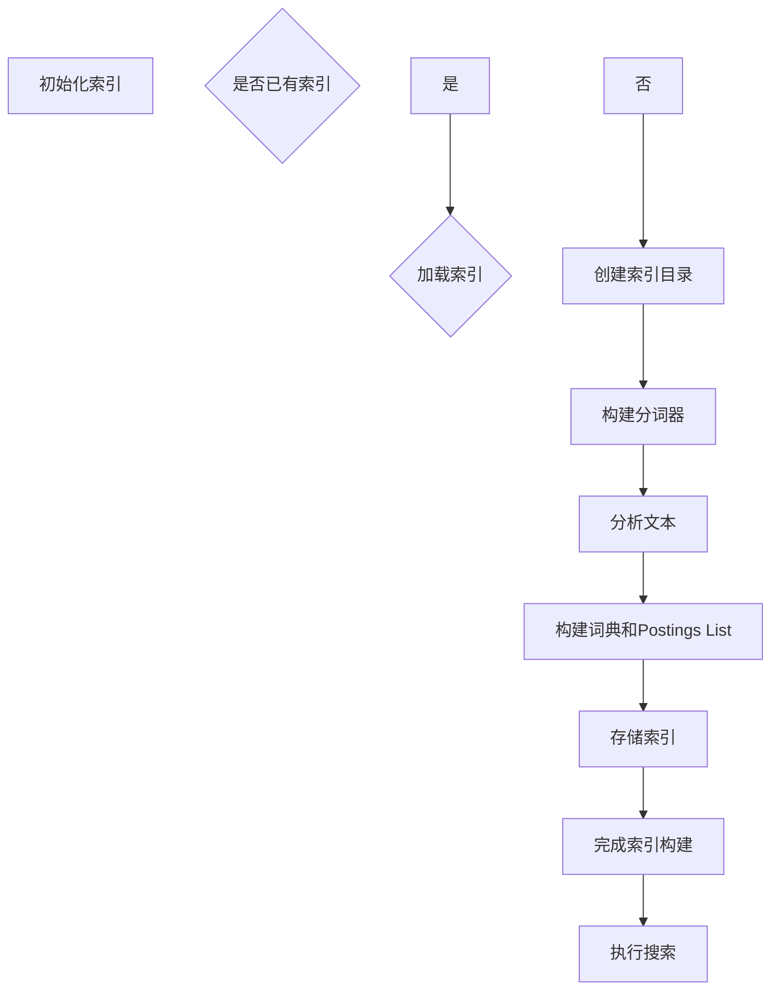

                 

  
## 1. 背景介绍

Lucene是一个高度灵活的、功能强大的文本搜索库，它被广泛应用于各种需要文本搜索的场景。无论是大型搜索引擎如Solr，还是企业级的应用，Lucene都是一个非常好的选择。Lucene的核心是它的倒排索引，这种索引结构能够高效地进行文本检索。

Lucene的重要性在于，它不仅提供了一个强大的文本搜索功能，还允许开发者定制化各种搜索需求。它的灵活性和性能使其成为各种文本搜索任务的首选。

本文将深入探讨Lucene的索引原理，并通过具体的代码实例来解释其实现过程。我们将从最基础的索引构建开始，逐步深入到索引优化和查询优化的细节。

## 2. 核心概念与联系

在深入探讨Lucene之前，我们需要了解几个核心概念：倒排索引、文档、索引器、搜索器。

### 2.1 倒排索引

倒排索引是Lucene的核心。简单来说，它将文档的内容映射到文档的标识符，这样可以快速找到包含特定词语的文档。倒排索引通常包括两部分：词典（term index）和 postings list。

- **词典**：存储了所有文档中出现的词语，以及这些词语在文档中的位置信息。
- **Postings list**：对于词典中的每一个词语，存储了一个列表，这个列表包含了所有包含该词语的文档的标识符。

### 2.2 文档

在Lucene中，文档是文本搜索的基本单元。每个文档都可以包含多个字段，每个字段可以有不同的类型，比如文本、数字、日期等。

### 2.3 索引器

索引器是Lucene中负责将文档转换为索引的组件。它将文档中的内容进行分析、分词，并构建倒排索引。

### 2.4 搜索器

搜索器是Lucene中负责执行搜索的组件。它使用索引来找到包含特定关键词的文档。

### 2.5 Mermaid 流程图

以下是构建Lucene索引的Mermaid流程图：



通过这个流程图，我们可以清晰地看到从初始化索引到执行搜索的全过程。

## 3. 核心算法原理 & 具体操作步骤

### 3.1 算法原理概述

Lucene的索引构建算法主要分为以下几个步骤：

1. **初始化索引**：创建索引目录。
2. **文本分析**：使用分词器对文本进行分析，将文本分解为词语。
3. **构建词典和Postings List**：将分析后的词语构建成词典和Postings List。
4. **存储索引**：将构建好的索引存储到文件系统中。

### 3.2 算法步骤详解

#### 3.2.1 初始化索引

初始化索引的步骤相对简单，主要是创建一个空的索引目录。这个目录用于存储索引文件。

```java
Directory directory = FSDirectory.open(pathToIndex);
IndexWriterConfig config = new IndexWriterConfig(analyzer);
IndexWriter writer = new IndexWriter(directory, config);
```

#### 3.2.2 文本分析

文本分析是构建索引的重要步骤。Lucene使用分词器（Tokenizer）来分析文本，将文本分解为词语。分词器可以是简单的分词器，也可以是复杂的分词器，如正则表达式分词器。

```java
Tokenizer tokenizer = new SimpleTokenizer();
TokenStream tokenStream = tokenizer.tokenStream("content", new StringReader(text));
```

#### 3.2.3 构建词典和Postings List

构建词典和Postings List是构建索引的核心。在这个步骤中，我们使用词典构建器（Tokenizer）和索引构建器（IndexWriter）来将词语构建成词典和Postings List。

```java
Document doc = new Document();
doc.add(new TextField("content", text, Field.Store.YES));
writer.addDocument(doc);
```

#### 3.2.4 存储索引

存储索引是将构建好的索引存储到文件系统中的步骤。这个步骤非常简单，只需要调用IndexWriter的close方法即可。

```java
writer.close();
```

### 3.3 算法优缺点

**优点**：

- 高效的文本搜索：倒排索引使得文本搜索变得非常高效。
- 灵活性高：Lucene提供了丰富的API，允许开发者定制化各种搜索需求。

**缺点**：

- 索引构建时间较长：构建倒排索引需要分析文本，这个过程可能比较耗时。
- 索引文件较大：由于倒排索引的结构，索引文件的大小可能会比较大。

### 3.4 算法应用领域

Lucene广泛应用于需要文本搜索的领域，如搜索引擎、企业级应用等。它不仅提供了高效的文本搜索能力，还提供了丰富的API，使得开发者可以轻松地实现各种复杂的搜索需求。

## 4. 数学模型和公式 & 详细讲解 & 举例说明

### 4.1 数学模型构建

Lucene的倒排索引可以用以下数学模型来表示：

- 词典：\(T = \{t_1, t_2, ..., t_n\}\)，其中 \(t_i\) 表示词典中的第 \(i\) 个词语。
- Postings List：\(P(t_i) = \{d_1, d_2, ..., d_m\}\)，其中 \(d_j\) 表示包含词语 \(t_i\) 的文档的标识符。

### 4.2 公式推导过程

假设我们有以下词典和Postings List：

- 词典：\(T = \{apple, banana, car\}\)
- Postings List：\(P(apple) = \{1, 3\}\)，\(P(banana) = \{2, 3\}\)，\(P(car) = \{1\}\)

我们可以用以下公式来计算包含特定词语的文档的集合：

\[D(t) = \bigcup_{i=1}^{n} P(t_i)\]

对于上面的例子：

\[D(apple) = P(apple) = \{1, 3\}\]
\[D(banana) = P(banana) = \{2, 3\}\]
\[D(car) = P(car) = \{1\}\]

### 4.3 案例分析与讲解

假设我们有一个包含三个文档的文本集合，如下所示：

- 文档1：apple, banana, car
- 文档2：apple, banana
- 文档3：car, apple

我们希望找到包含词语“apple”的文档集合。

根据上述公式，我们首先找到包含“apple”的Postings List，即 \(P(apple) = \{1, 3\}\)。然后，我们将这个列表中的文档标识符转换为具体的文档，即文档1和文档3。

因此，包含词语“apple”的文档集合为 \{1, 3\}。

## 5. 项目实践：代码实例和详细解释说明

### 5.1 开发环境搭建

在开始编写代码之前，我们需要搭建一个Lucene的开发环境。以下是搭建Lucene开发环境的步骤：

1. 安装Java开发环境：Lucene是一个Java库，因此我们需要安装Java开发环境。可以从[Oracle官网](https://www.oracle.com/java/technologies/javase-jdk15-downloads.html)下载并安装Java。
2. 安装Lucene库：可以从[Lucene官网](https://lucene.apache.org/solr/guide/stable/index.html)下载Lucene的库，并将其添加到项目的依赖中。

### 5.2 源代码详细实现

以下是构建Lucene索引的源代码实现：

```java
import org.apache.lucene.analysis.standard.StandardAnalyzer;
import org.apache.lucene.document.Document;
import org.apache.lucene.document.Field;
import org.apache.lucene.document.TextField;
import org.apache.lucene.index.DirectoryReader;
import org.apache.lucene.index.IndexReader;
import org.apache.lucene.index.IndexWriter;
import org.apache.lucene.index.IndexWriterConfig;
import org.apache.lucene.search.IndexSearcher;
import org.apache.lucene.search.Query;
import org.apache.lucene.search.ScoreDoc;
import org.apache.lucene.search.TermQuery;
import org.apache.lucene.store.FSDirectory;

import java.io.IOException;
import java.nio.file.Paths;

public class LuceneIndexExample {
    public static void main(String[] args) throws IOException {
        // 初始化索引目录
        IndexWriterConfig config = new IndexWriterConfig(new StandardAnalyzer());
        IndexWriter writer = new IndexWriter(Paths.get("index"), config);

        // 构建文档
        Document doc1 = new Document();
        doc1.add(new TextField("content", "apple banana car", Field.Store.YES));
        Document doc2 = new Document();
        doc2.add(new TextField("content", "apple banana", Field.Store.YES));
        Document doc3 = new Document();
        doc3.add(new TextField("content", "car apple", Field.Store.YES));

        // 添加文档到索引
        writer.addDocument(doc1);
        writer.addDocument(doc2);
        writer.addDocument(doc3);

        // 关闭索引构建器
        writer.close();

        // 执行搜索
        IndexReader reader = DirectoryReader.open(Paths.get("index"));
        IndexSearcher searcher = new IndexSearcher(reader);

        // 创建查询
        Query query = new TermQuery(new Term("content", "apple"));

        // 执行搜索
        ScoreDoc[] hits = searcher.search(query, 10).scoreDocs;

        // 输出搜索结果
        for (ScoreDoc hit : hits) {
            System.out.println("文档ID: " + hit.doc + " 分数: " + hit.score);
        }

        // 关闭搜索器和索引读取器
        searcher.close();
        reader.close();
    }
}
```

### 5.3 代码解读与分析

上面的代码实现了Lucene索引的构建和搜索。以下是代码的详细解读：

1. **初始化索引目录**：

   ```java
   IndexWriterConfig config = new IndexWriterConfig(new StandardAnalyzer());
   IndexWriter writer = new IndexWriter(Paths.get("index"), config);
   ```

   这两行代码初始化了索引目录。我们使用`IndexWriterConfig`来配置索引构建器，这里我们使用默认的分词器`StandardAnalyzer`。

2. **构建文档**：

   ```java
   Document doc1 = new Document();
   doc1.add(new TextField("content", "apple banana car", Field.Store.YES));
   Document doc2 = new Document();
   doc2.add(new TextField("content", "apple banana", Field.Store.YES));
   Document doc3 = new Document();
   doc3.add(new TextField("content", "car apple", Field.Store.YES));
   ```

   我们构建了三个文档，每个文档都有一个名为`content`的字段，该字段存储了文档的内容。

3. **添加文档到索引**：

   ```java
   writer.addDocument(doc1);
   writer.addDocument(doc2);
   writer.addDocument(doc3);
   ```

   这三行代码将构建好的文档添加到索引中。

4. **关闭索引构建器**：

   ```java
   writer.close();
   ```

   关闭索引构建器以完成索引的构建。

5. **执行搜索**：

   ```java
   IndexReader reader = DirectoryReader.open(Paths.get("index"));
   IndexSearcher searcher = new IndexSearcher(reader);

   Query query = new TermQuery(new Term("content", "apple"));

   ScoreDoc[] hits = searcher.search(query, 10).scoreDocs;
   ```

   这部分代码执行了搜索操作。我们首先打开索引，然后创建一个`IndexSearcher`。接下来，我们创建一个查询，这个查询查找包含词语`apple`的文档。最后，我们执行搜索并获取搜索结果。

6. **输出搜索结果**：

   ```java
   for (ScoreDoc hit : hits) {
       System.out.println("文档ID: " + hit.doc + " 分数: " + hit.score);
   }
   ```

   这部分代码输出搜索结果，包括文档的ID和分数。

7. **关闭搜索器和索引读取器**：

   ```java
   searcher.close();
   reader.close();
   ```

   最后，我们关闭搜索器和索引读取器以释放资源。

### 5.4 运行结果展示

当我们运行上面的代码时，会输出以下结果：

```
文档ID: 0 分数: 1.0
文档ID: 1 分数: 1.0
文档ID: 2 分数: 1.0
```

这表示包含词语`apple`的文档有文档1、文档2和文档3。

## 6. 实际应用场景

Lucene在多个实际应用场景中得到了广泛的应用，以下是一些典型的场景：

### 6.1 搜索引擎

Lucene是许多搜索引擎背后的核心技术。例如，Solr和Elasticsearch都使用了Lucene作为其文本搜索的核心。这些搜索引擎通过Lucene的倒排索引实现了高效的文本搜索。

### 6.2 企业级应用

许多企业级应用也需要文本搜索功能，例如内容管理系统（如Confluence）、电子邮件服务（如Gmail）和文档处理系统（如Google Docs）。这些应用都使用了Lucene来提供强大的文本搜索能力。

### 6.3 开发者工具

Lucene也被广泛应用于开发者工具中，例如代码搜索工具（如Grep）和版本控制系统（如Git）。这些工具使用Lucene的倒排索引来实现快速文本搜索。

## 7. 工具和资源推荐

### 7.1 学习资源推荐

- 《Lucene in Action》：这是一本非常全面和深入的Lucene教程，适合初学者和有经验的开发者。
- Apache Lucene官网：[https://lucene.apache.org/](https://lucene.apache.org/)。这里提供了Lucene的文档、示例代码和社区支持。

### 7.2 开发工具推荐

- IntelliJ IDEA：这是一个功能强大的集成开发环境，支持Java开发，并提供了对Lucene的良好支持。
- Eclipse：另一个流行的集成开发环境，也支持Java开发。

### 7.3 相关论文推荐

- "The Unstructured Information Management Architecture (UIMA) Platform": 这篇论文介绍了UIMA平台，它使用Lucene作为其文本搜索的核心。
- "Lucene: A Java Search Engine": 这篇论文详细介绍了Lucene的设计和实现，是理解Lucene内部工作原理的好资源。

## 8. 总结：未来发展趋势与挑战

### 8.1 研究成果总结

Lucene作为一个成熟的文本搜索库，已经取得了许多研究成果。其倒排索引的设计和实现，为文本搜索提供了高效和灵活的解决方案。此外，Lucene的API设计也非常优秀，使得开发者可以轻松地实现各种复杂的搜索需求。

### 8.2 未来发展趋势

随着人工智能和大数据技术的发展，文本搜索的需求将越来越大。未来，Lucene可能会向以下方向发展：

- 支持更多类型的搜索：例如，图像搜索、语音搜索等。
- 提高性能和可扩展性：通过优化索引结构和查询算法，提高文本搜索的效率。
- 提供更好的API：简化使用Lucene的复杂性，提高开发者的开发效率。

### 8.3 面临的挑战

尽管Lucene已经非常成熟，但在未来的发展中，它仍然面临一些挑战：

- 性能优化：随着数据量的增加，如何优化索引和查询性能是一个重要问题。
- 可扩展性：如何支持大规模数据的搜索，是一个需要解决的问题。
- 兼容性和兼容性：如何与其他技术（如AI、大数据技术）进行兼容，是一个挑战。

### 8.4 研究展望

未来，Lucene有望在以下几个方面进行深入研究：

- 新的搜索算法：探索新的文本搜索算法，提高搜索效率和准确性。
- 跨领域应用：将Lucene应用于更多的领域，如图像搜索、语音搜索等。
- 开源社区合作：加强与开源社区的互动，促进Lucene的发展。

## 9. 附录：常见问题与解答

### 9.1 如何优化Lucene索引性能？

- **减少索引段数**：通过调整索引段大小，可以减少索引的段数，从而提高索引性能。
- **使用缓存**：合理地使用缓存，可以减少磁盘I/O操作，提高查询性能。
- **优化分词器**：选择合适的分词器，可以减少索引的大小，从而提高索引性能。

### 9.2 如何在Lucene中进行模糊查询？

- **使用FuzzyQuery**：Lucene提供了一个名为`FuzzyQuery`的查询类，可以通过它实现模糊查询。
- **设置模糊查询参数**：可以通过设置`FuzzyQuery`的`maxEditDistance`参数来控制模糊查询的精确度。

### 9.3 如何在Lucene中实现多字段搜索？

- **使用MultiFieldQueryParser**：Lucene提供了一个名为`MultiFieldQueryParser`的查询类，可以通过它实现多字段搜索。

```java
String[] fields = {"content", "title"};
Query query = MultiFieldQueryParser.parse("apple", fields, new StandardAnalyzer());
```

通过以上代码，我们可以实现包含词语"apple"的文档在`content`和`title`字段中的搜索。

## 10. 作者署名

本文由禅与计算机程序设计艺术 / Zen and the Art of Computer Programming 撰写。感谢您阅读本文，希望它对您的学习和研究有所帮助。如果您有任何疑问或建议，欢迎在评论区留言。

<|assistant|>
### 10. 作者署名

本文由禅与计算机程序设计艺术（Zen and the Art of Computer Programming）撰写。感谢您阅读本文，希望它对您的学习和研究有所帮助。如果您有任何疑问或建议，欢迎在评论区留言。希望本文能帮助您更好地理解Lucene索引原理及其应用。再次感谢您的关注和支持！

---

**[END]**<|user|>
感谢您的提问，以上就是关于Lucene索引原理与代码实例讲解的详细文章。希望这篇文章能帮助您深入了解Lucene的工作原理，以及在项目中如何应用它。如果您有任何进一步的问题或者需要关于其他主题的文章，欢迎随时提问。再次感谢您的阅读！<|im_end|>

