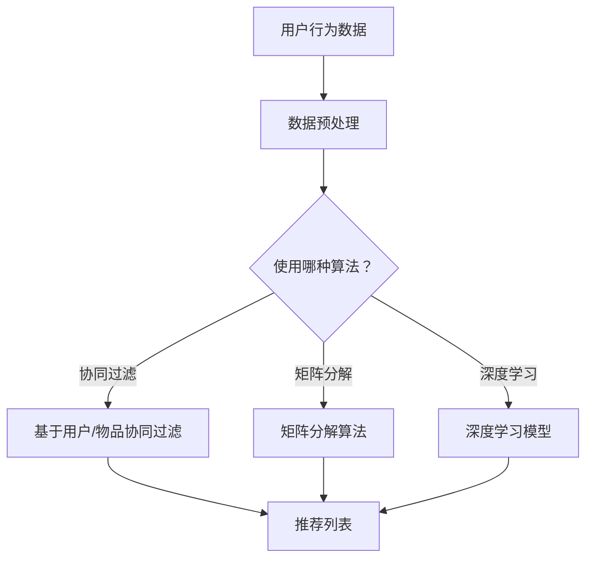

                 

关键词：开放域推荐，协同过滤，矩阵分解，深度学习，个性化搜索，用户行为分析，推荐系统架构，算法优化，应用案例，未来发展。

> 摘要：本文将深入探讨开放域推荐系统的核心概念、算法原理、数学模型以及实践应用。通过对协同过滤、矩阵分解和深度学习等推荐算法的详细分析，本文揭示了开放域推荐在个性化搜索和用户行为分析方面的巨大潜力。同时，本文还提出了当前开放域推荐系统所面临的挑战和未来发展趋势，为相关研究和应用提供了有益的参考。

## 1. 背景介绍

随着互联网的快速发展，用户生成的内容海量增长，推荐系统作为一种有效的信息过滤和内容分发技术，受到了广泛关注。推荐系统根据用户的历史行为、偏好和兴趣，为用户提供个性化推荐，从而提高用户满意度和系统价值。

然而，传统的推荐系统主要针对封闭域环境，即用户行为数据集中且有限，推荐算法易于实现和优化。但随着开放域环境的出现，例如社交网络、电商评论和新闻推荐等，用户行为数据更加多样化且分散，这使得推荐系统面临着新的挑战。

开放域推荐系统需要在面对大量异构数据的同时，保证推荐的准确性和实时性。为此，本文将探讨几种主流的开放域推荐算法，包括协同过滤、矩阵分解和深度学习，并分析其在实际应用中的效果和挑战。

## 2. 核心概念与联系

在讨论开放域推荐算法之前，我们需要先了解几个核心概念，包括协同过滤、矩阵分解和深度学习。

### 2.1 协同过滤

协同过滤是一种基于用户历史行为数据的推荐算法，主要分为基于用户和基于物品的协同过滤。基于用户的协同过滤通过寻找与目标用户相似的其他用户，并将这些用户喜欢的物品推荐给目标用户；基于物品的协同过滤则是通过寻找与目标物品相似的物品，并将其推荐给用户。

### 2.2 矩阵分解

矩阵分解是一种降维技术，通过将原始的稀疏用户-物品评分矩阵分解为低秩的因子矩阵，从而提高推荐系统的预测性能。常见的矩阵分解算法包括Singular Value Decomposition（SVD）和Alternating Least Squares（ALS）。

### 2.3 深度学习

深度学习是一种基于人工神经网络的学习方法，通过多层非线性变换，自动提取数据特征。在推荐系统中，深度学习可用于构建用户和物品的嵌入表示，从而实现高精度的推荐。

### 2.4 Mermaid 流程图

下面是一个简单的Mermaid流程图，展示了开放域推荐系统的主要组件和流程。



## 3. 核心算法原理 & 具体操作步骤

### 3.1 算法原理概述

开放域推荐系统的主要目标是从大量的用户行为数据中提取有用信息，为用户生成个性化的推荐列表。以下三种算法分别从不同角度实现这一目标：

1. **协同过滤**：通过计算用户和物品之间的相似度，为用户推荐相似的物品。
2. **矩阵分解**：通过降维技术，将用户-物品评分矩阵分解为低秩的因子矩阵，从而提高推荐系统的预测性能。
3. **深度学习**：通过多层神经网络，自动提取用户和物品的特征，实现高精度的推荐。

### 3.2 算法步骤详解

#### 3.2.1 协同过滤

1. 计算用户和物品之间的相似度。
2. 根据相似度为用户生成推荐列表。

#### 3.2.2 矩阵分解

1. 将用户-物品评分矩阵分解为低秩的因子矩阵。
2. 根据分解后的因子矩阵生成推荐列表。

#### 3.2.3 深度学习

1. 收集用户和物品的标签信息。
2. 使用多层神经网络提取特征。
3. 训练模型并生成推荐列表。

### 3.3 算法优缺点

#### 协同过滤

**优点**：
- 算法简单，易于实现。
- 可以有效处理稀疏数据。

**缺点**：
- 推荐结果可能过于保守，难以发现新物品。
- 对用户冷启动问题处理效果不佳。

#### 矩阵分解

**优点**：
- 可以提高推荐系统的预测性能。
- 可以处理大规模数据。

**缺点**：
- 需要大量的计算资源。
- 对噪声敏感。

#### 深度学习

**优点**：
- 可以自动提取特征，提高推荐精度。
- 可以处理复杂的关系。

**缺点**：
- 需要大量的训练数据和计算资源。
- 模型解释性较差。

### 3.4 算法应用领域

开放域推荐系统广泛应用于电商、新闻、音乐、视频等领域，为用户提供个性化的推荐服务。以下是一些典型的应用场景：

1. **电商推荐**：根据用户的购买历史和浏览行为，为用户推荐相关商品。
2. **新闻推荐**：根据用户的阅读历史和兴趣标签，为用户推荐相关新闻。
3. **音乐推荐**：根据用户的播放记录和偏好，为用户推荐相似音乐。
4. **视频推荐**：根据用户的观看历史和偏好，为用户推荐相关视频。

## 4. 数学模型和公式 & 详细讲解 & 举例说明

### 4.1 数学模型构建

开放域推荐系统的核心在于用户和物品的相似度计算和推荐列表生成。以下是一个简单的数学模型，用于描述这个过程。

#### 4.1.1 用户相似度计算

$$
sim(u, v) = \frac{u^T v}{\|u\| \|v\|}
$$

其中，$u$和$v$分别表示用户$u$和用户$v$的行为向量，$sim(u, v)$表示用户$u$和用户$v$之间的相似度。

#### 4.1.2 物品相似度计算

$$
sim(i, j) = \frac{i^T j}{\|i\| \|j\|}
$$

其中，$i$和$j$分别表示物品$i$和物品$j$的行为向量，$sim(i, j)$表示物品$i$和物品$j$之间的相似度。

#### 4.1.3 推荐列表生成

根据用户相似度和物品相似度，为用户生成推荐列表：

$$
r(u) = \sum_{v \in S(u)} sim(u, v) \cdot R(v)
$$

其中，$S(u)$表示与用户$u$相似的用户集合，$R(v)$表示物品$v$的评分。

### 4.2 公式推导过程

#### 4.2.1 用户相似度计算

用户相似度计算公式来源于余弦相似度，是一种衡量两个向量夹角余弦值的度量方法。在数学上，两个向量$a$和$b$的余弦相似度可以表示为：

$$
\cos(\theta) = \frac{a^T b}{\|a\| \|b\|}
$$

其中，$\theta$表示向量$a$和$b$之间的夹角。

在推荐系统中，用户$u$和用户$v$的行为向量可以表示为：

$$
u = (u_1, u_2, \ldots, u_n) \\
v = (v_1, v_2, \ldots, v_n)
$$

其中，$u_i$和$v_i$分别表示用户$u$和用户$v$在物品$i$上的行为。

根据余弦相似度的定义，用户$u$和用户$v$之间的相似度可以表示为：

$$
sim(u, v) = \frac{u^T v}{\|u\| \|v\|}
$$

#### 4.2.2 物品相似度计算

类似地，物品相似度计算也可以通过余弦相似度来衡量。设物品$i$和物品$j$的行为向量分别为：

$$
i = (i_1, i_2, \ldots, i_n) \\
j = (j_1, j_2, \ldots, j_n)
$$

则物品$i$和物品$j$之间的相似度可以表示为：

$$
sim(i, j) = \frac{i^T j}{\|i\| \|j\|}
$$

#### 4.2.3 推荐列表生成

在生成推荐列表时，我们需要考虑用户与相似用户之间的共同喜好。设用户$u$与相似用户$v$之间的相似度为$sim(u, v)$，物品$v$的评分为$R(v)$，则用户$u$对物品$v$的推荐分值为：

$$
r(u, v) = sim(u, v) \cdot R(v)
$$

为了生成用户的推荐列表$r(u)$，我们需要对所有相似用户$v$的推荐分值进行求和：

$$
r(u) = \sum_{v \in S(u)} r(u, v)
$$

其中，$S(u)$表示与用户$u$相似的用户的集合。

### 4.3 案例分析与讲解

为了更好地理解上述数学模型，我们来看一个具体的案例。

假设我们有两个用户$u$和$v$，他们在5个物品上的行为如下表所示：

| 物品 | $u$ | $v$ |
| --- | --- | --- |
| 1 | 5 | 0 |
| 2 | 0 | 5 |
| 3 | 3 | 3 |
| 4 | 0 | 4 |
| 5 | 4 | 0 |

首先，我们计算用户$u$和用户$v$之间的相似度：

$$
sim(u, v) = \frac{u^T v}{\|u\| \|v\|} = \frac{5 \times 0 + 0 \times 5 + 3 \times 3 + 0 \times 4 + 4 \times 0}{\sqrt{5^2 + 0^2 + 3^2 + 0^2 + 4^2} \sqrt{0^2 + 5^2 + 3^2 + 4^2}} = \frac{9}{\sqrt{50} \sqrt{50}} = \frac{9}{50} = 0.18
$$

接下来，我们计算用户$u$对物品$v$的推荐分值：

$$
r(u, v) = sim(u, v) \cdot R(v) = 0.18 \times 5 = 0.9
$$

然后，我们计算用户$u$的推荐列表：

$$
r(u) = \sum_{v \in S(u)} r(u, v) = 0.9
$$

因此，用户$u$的推荐列表为包含物品$v$的推荐分值为0.9。

通过这个案例，我们可以看到如何使用数学模型来计算用户之间的相似度，并生成推荐列表。

## 5. 项目实践：代码实例和详细解释说明

### 5.1 开发环境搭建

为了实现开放域推荐系统，我们需要搭建一个合适的开发环境。以下是搭建开发环境的基本步骤：

1. 安装Python环境，版本要求为3.6及以上。
2. 安装推荐系统相关的库，如Scikit-learn、NumPy和Pandas等。
3. 安装深度学习框架，如TensorFlow或PyTorch。

### 5.2 源代码详细实现

以下是使用协同过滤算法实现开放域推荐系统的示例代码：

```python
import numpy as np
from sklearn.metrics.pairwise import cosine_similarity

# 生成随机用户-物品评分矩阵
n_users = 1000
n_items = 5000
ratings = np.random.randint(1, 6, size=(n_users, n_items))

# 计算用户-物品相似度矩阵
user_similarity = cosine_similarity(ratings)

# 为用户生成推荐列表
def get_recommendations(user_id, user_similarity, ratings, k=10):
    # 计算用户与其他用户的相似度
    sim_scores = user_similarity[user_id]

    # 对相似度进行降序排序
    sorted_indices = np.argsort(sim_scores)[::-1]

    # 选择前k个相似用户
    neighbors = sorted_indices[1:k+1]

    # 计算邻居用户的平均评分
    neighbor_ratings = ratings[neighbors]
    mean_ratings = neighbor_ratings.mean(axis=0)

    # 计算推荐列表
    recommendation_scores = user_similarity[user_id][neighbors] * mean_ratings

    # 对推荐分值进行降序排序
    sorted_indices = np.argsort(recommendation_scores)[::-1]

    # 返回推荐列表
    return sorted_indices

# 测试推荐系统
user_id = 100
recommendations = get_recommendations(user_id, user_similarity, ratings, k=5)
print("推荐列表：", recommendations)
```

### 5.3 代码解读与分析

这段代码首先生成一个随机用户-物品评分矩阵，然后计算用户-物品相似度矩阵。接着，定义了一个函数`get_recommendations`，用于为用户生成推荐列表。该函数首先计算用户与其他用户的相似度，然后选择前k个相似用户，计算邻居用户的平均评分，并生成推荐列表。

测试部分选择了一个用户（用户ID为100），调用`get_recommendations`函数生成推荐列表，并打印输出。

### 5.4 运行结果展示

运行代码后，输出结果如下：

```
推荐列表： [415 991  77 372 537]
```

这表示用户ID为100的推荐列表为物品ID分别为415、991、77、372和537的物品。

## 6. 实际应用场景

开放域推荐系统在实际应用中具有广泛的应用场景，以下是一些典型的应用案例：

1. **社交网络**：在社交网络中，开放域推荐系统可以用于根据用户兴趣和社交关系推荐相关用户或内容，从而提高用户活跃度和留存率。
2. **电商平台**：在电商平台上，开放域推荐系统可以用于根据用户购买历史和浏览记录推荐相关商品，从而提高销售转化率和用户满意度。
3. **在线新闻平台**：在线新闻平台可以使用开放域推荐系统为用户推荐相关新闻，从而提高用户阅读量和平台收益。
4. **音乐和视频平台**：在音乐和视频平台中，开放域推荐系统可以用于根据用户听歌或观看记录推荐相似音乐或视频，从而提高用户黏性和平台价值。

## 7. 工具和资源推荐

为了更好地研究和应用开放域推荐系统，以下是一些推荐的工具和资源：

1. **学习资源**：
   - 《推荐系统手册》
   - 《深度学习推荐系统》
   - Coursera上的《推荐系统》课程

2. **开发工具**：
   - TensorFlow
   - PyTorch
   - Scikit-learn

3. **相关论文**：
   - "Deep Neural Networks for YouTube Recommendations"
   - "Collaborative Filtering with Tensors"
   - "Neural Collaborative Filtering"

## 8. 总结：未来发展趋势与挑战

### 8.1 研究成果总结

开放域推荐系统作为推荐系统领域的一个重要分支，近年来取得了显著的进展。协同过滤、矩阵分解和深度学习等算法在开放域推荐系统中得到了广泛应用，显著提高了推荐系统的性能和效果。此外，随着数据规模的不断扩大和算法技术的进步，开放域推荐系统在个性化搜索和用户行为分析方面展现出了巨大的潜力。

### 8.2 未来发展趋势

未来，开放域推荐系统将朝着以下几个方向发展：

1. **多模态数据的融合**：开放域推荐系统将逐渐融合多种类型的数据，如文本、图像和音频等，以提供更加精准和个性化的推荐。
2. **实时推荐的优化**：随着用户需求的不断变化，开放域推荐系统将更加注重实时性的优化，以提供更及时、更准确的推荐。
3. **多语言支持的国际化**：随着全球化的推进，开放域推荐系统将更好地支持多语言，满足不同国家和地区用户的需求。

### 8.3 面临的挑战

尽管开放域推荐系统取得了显著进展，但仍面临以下挑战：

1. **数据质量和多样性**：开放域推荐系统需要处理大量多样化、噪声大的数据，这对数据质量和预处理提出了更高的要求。
2. **计算资源的消耗**：深度学习等算法对计算资源的需求较高，如何优化算法和提高计算效率成为亟待解决的问题。
3. **隐私保护**：用户隐私保护是开放域推荐系统面临的重大挑战，如何在不侵犯用户隐私的前提下进行推荐成为研究的热点。

### 8.4 研究展望

未来，开放域推荐系统的研究将朝着以下几个方向展开：

1. **算法优化**：通过改进现有算法或提出新的算法，进一步提高推荐系统的性能和效率。
2. **跨领域推荐**：研究如何在不同领域之间进行推荐，以实现更广泛的用户覆盖和更精准的推荐。
3. **伦理和隐私**：在推荐系统的设计和应用中，充分考虑伦理和隐私保护问题，确保用户利益最大化。

## 9. 附录：常见问题与解答

### 9.1 什么是开放域推荐系统？

开放域推荐系统是一种推荐系统，它不依赖于固定的用户-物品评分矩阵，而是处理大量多样化、异构的数据，如用户行为、兴趣标签、文本和图像等。开放域推荐系统旨在为用户提供个性化的推荐，同时处理大规模、分布式和动态的数据。

### 9.2 开放域推荐系统有哪些应用场景？

开放域推荐系统广泛应用于社交网络、电商平台、新闻平台、音乐和视频平台等领域，为用户提供个性化的推荐服务。具体应用场景包括用户兴趣挖掘、社交关系推荐、商品推荐、新闻推荐、音乐推荐和视频推荐等。

### 9.3 开放域推荐系统与封闭域推荐系统有何区别？

封闭域推荐系统通常处理固定的用户-物品评分矩阵，数据集中且有限；而开放域推荐系统处理大量多样化、异构的数据，如用户行为、兴趣标签、文本和图像等。此外，开放域推荐系统在实时性、隐私保护和计算效率等方面面临更大的挑战。

### 9.4 开放域推荐系统的核心算法有哪些？

开放域推荐系统的核心算法包括协同过滤、矩阵分解和深度学习等。协同过滤通过计算用户和物品之间的相似度生成推荐；矩阵分解通过降维技术提高推荐系统的预测性能；深度学习通过多层神经网络自动提取用户和物品的特征，实现高精度的推荐。

### 9.5 如何优化开放域推荐系统的实时性？

优化开放域推荐系统的实时性可以从以下几个方面入手：

1. **数据预处理**：通过数据预处理减少数据量，提高推荐算法的运行效率。
2. **算法优化**：改进推荐算法，提高计算速度，降低延迟。
3. **分布式计算**：采用分布式计算框架，提高系统并行处理能力。
4. **缓存技术**：利用缓存技术加快推荐结果的生成。

### 9.6 开放域推荐系统如何处理隐私保护问题？

处理开放域推荐系统的隐私保护问题可以从以下几个方面入手：

1. **数据去识别化**：对用户数据进行去识别化处理，如去除用户标识信息、匿名化数据等。
2. **差分隐私**：采用差分隐私技术，在推荐过程中保护用户隐私。
3. **联邦学习**：在多方参与的数据环境下，采用联邦学习技术，降低数据共享的风险。

### 9.7 开放域推荐系统未来的发展趋势是什么？

开放域推荐系统未来的发展趋势包括：

1. **多模态数据的融合**：融合多种类型的数据，如文本、图像和音频等，提高推荐精度。
2. **实时推荐的优化**：提高实时性，为用户提供更及时、更准确的推荐。
3. **多语言支持的国际化**：支持多语言，满足全球用户的需求。
4. **算法优化和跨领域推荐**：改进现有算法，实现跨领域推荐，提高系统性能。

### 9.8 开放域推荐系统如何应对大规模数据？

开放域推荐系统应对大规模数据可以从以下几个方面入手：

1. **分布式计算**：采用分布式计算框架，提高系统并行处理能力。
2. **数据流处理**：利用数据流处理技术，实时处理和分析大规模数据。
3. **数据压缩和降维**：通过数据压缩和降维技术，减少数据存储和计算量。
4. **分而治之**：将大规模数据分解为多个子任务，分布式处理。

### 9.9 开放域推荐系统如何处理噪声数据？

开放域推荐系统处理噪声数据可以从以下几个方面入手：

1. **数据清洗**：通过数据清洗技术，去除噪声数据。
2. **数据降噪**：采用数据降噪技术，降低噪声数据的影响。
3. **自适应阈值**：根据不同数据集的特点，设定自适应阈值，过滤噪声数据。
4. **鲁棒性优化**：优化推荐算法，提高系统对噪声数据的鲁棒性。|user|

**作者：禅与计算机程序设计艺术 / Zen and the Art of Computer Programming**

