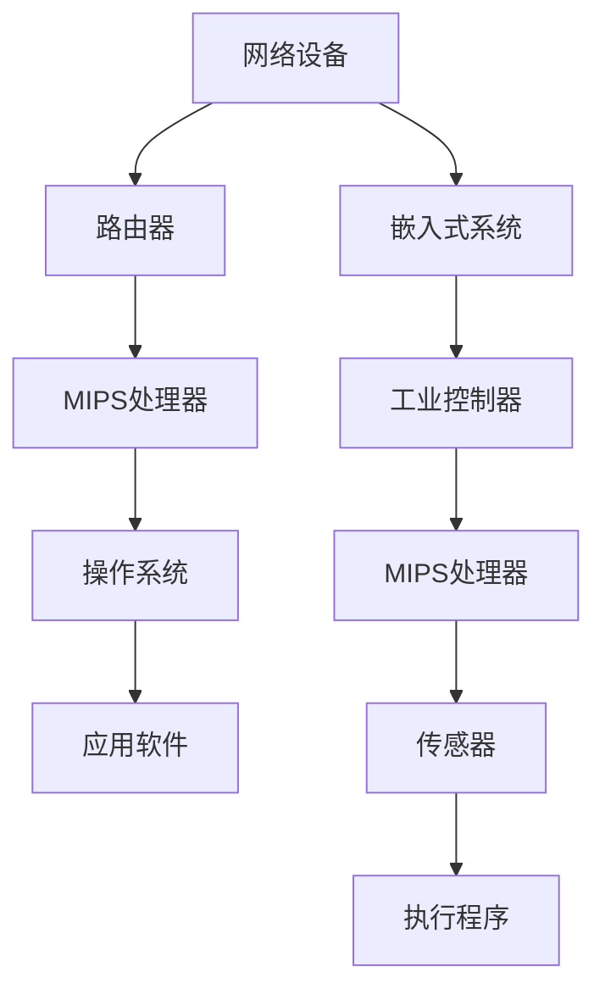

                 

关键词：MIPS架构、网络设备、嵌入式系统、性能优化、开发工具、应用领域。

> 摘要：本文旨在探讨MIPS架构在网络设备和嵌入式系统中的应用优势，分析其在性能、功耗和开发便捷性等方面的特点，并提供实用的开发工具和资源推荐，旨在帮助开发者更好地选择和利用MIPS架构，推动相关领域的技术进步。

## 1. 背景介绍

MIPS（Microprocessor without Interlocked Pipelined Stages）架构是由MIPS Technologies公司开发的一种精简指令集计算机（RISC）架构。自1990年代初以来，MIPS架构在嵌入式系统和网络设备领域得到了广泛应用。其设计理念是减少指令条数，简化指令执行过程，以提高处理器的性能和能效。

在网络设备领域，MIPS架构被广泛应用于路由器、交换机和防火墙等设备中。其高性能、低功耗和丰富的外设接口使得MIPS处理器成为网络设备开发的理想选择。在嵌入式系统领域，MIPS架构同样表现出色，被应用于工业控制、消费电子和医疗设备等多个领域。

本文将深入探讨MIPS架构在网络设备和嵌入式系统中的应用优势，分析其在性能、功耗和开发便捷性等方面的特点，并提供实用的开发工具和资源推荐。希望本文能为开发者提供有价值的参考，推动MIPS架构在相关领域的发展。

## 2. 核心概念与联系

### 2.1 MIPS架构原理

MIPS架构采用5级流水线设计，包括取指（Instruction Fetch）、指令译码（Instruction Decode）、执行（Execution）、内存访问（Memory Access）和写回（Write Back）等阶段。这种流水线设计使得指令执行过程高效且并行，从而提高了处理器的性能。

MIPS指令集包括数据传输指令、算术逻辑指令、控制转移指令等。数据传输指令用于在寄存器和内存之间进行数据传输；算术逻辑指令包括加、减、乘、除等基本运算；控制转移指令用于实现程序的分支和循环控制。

### 2.2 MIPS与嵌入式系统、网络设备的联系

MIPS架构在嵌入式系统和网络设备中的应用优势主要体现在以下几个方面：

1. **高性能**：MIPS架构采用流水线设计，能够高效地执行指令，从而提供较高的处理能力。
2. **低功耗**：MIPS处理器在设计时考虑了能效，具有较低的功耗，适用于需要长时间运行且对功耗敏感的设备。
3. **丰富的外设接口**：MIPS架构支持丰富的外设接口，如UART、SPI、I2C等，方便与各种外设设备进行通信。
4. **软件生态**：MIPS架构拥有丰富的软件支持，包括操作系统、编译器、调试工具等，为开发者提供了便捷的开发环境。

下面是一个MIPS架构在网络设备和嵌入式系统中的应用场景的Mermaid流程图：



### 2.3 MIPS架构与其他RISC架构的比较

MIPS架构与其他RISC架构（如ARM、PowerPC等）相比，具有以下特点：

1. **指令集简洁**：MIPS指令集相对简洁，指令条数较少，易于理解和编程。
2. **性能较高**：MIPS架构采用流水线设计，能够高效地执行指令，性能较为优异。
3. **功耗较低**：MIPS处理器在设计中注重能效，功耗相对较低。
4. **软件生态**：MIPS架构在嵌入式系统和网络设备领域具有较为成熟的软件生态，包括操作系统、编译器、调试工具等。

综上所述，MIPS架构在网络设备和嵌入式系统中的应用具有显著优势，能够为开发者提供高效、低功耗和便捷的开发环境。

## 3. 核心算法原理 & 具体操作步骤

### 3.1 算法原理概述

MIPS架构的核心算法主要涉及指令集的设计和流水线操作。MIPS指令集包括数据传输指令、算术逻辑指令、控制转移指令等。这些指令的执行过程遵循5级流水线设计，包括取指、指令译码、执行、内存访问和写回等阶段。

### 3.2 算法步骤详解

1. **取指阶段**：处理器从内存中获取下一条指令。
2. **指令译码阶段**：处理器对取指阶段获取的指令进行译码，确定指令的操作码和操作数。
3. **执行阶段**：处理器根据指令的操作码和操作数执行相应的操作，如数据传输、算术逻辑运算等。
4. **内存访问阶段**：处理器访问内存，进行数据的读或写操作。
5. **写回阶段**：将执行结果写回到寄存器或内存中。

### 3.3 算法优缺点

**优点**：

1. **高性能**：流水线设计使得指令执行过程高效，能够提高处理器的性能。
2. **低功耗**：MIPS处理器在设计中注重能效，具有较低的功耗。
3. **丰富的外设接口**：MIPS架构支持丰富的外设接口，方便与各种外设设备进行通信。
4. **软件生态**：MIPS架构拥有丰富的软件支持，包括操作系统、编译器、调试工具等。

**缺点**：

1. **指令集相对复杂**：MIPS指令集虽然简洁，但相对于其他RISC架构（如ARM）来说，指令集相对复杂，需要更多的时间和精力来学习和编程。
2. **市场竞争力**：近年来，ARM架构在嵌入式系统和网络设备领域的市场份额逐渐增加，MIPS架构的市场竞争力受到一定影响。

### 3.4 算法应用领域

MIPS架构主要应用于嵌入式系统和网络设备领域，如：

1. **网络设备**：路由器、交换机、防火墙等。
2. **嵌入式系统**：工业控制器、消费电子、医疗设备等。

## 4. 数学模型和公式 & 详细讲解 & 举例说明

### 4.1 数学模型构建

MIPS架构的数学模型主要涉及以下几个方面：

1. **流水线模型**：描述处理器流水线各阶段的时间消耗和吞吐量。
2. **指令集模型**：描述MIPS指令集的操作码、操作数和指令执行时间。
3. **功耗模型**：描述处理器在不同工作状态下的功耗。

### 4.2 公式推导过程

1. **流水线模型公式**：

   - 吞吐量（Throughput）：
     $$ T = \frac{1}{\text{周期时间}} $$
   - 周期时间（Cycle Time）：
     $$ C = \frac{\text{总时间}}{\text{指令数}} $$

2. **指令集模型公式**：

   - 指令执行时间（Instruction Execution Time）：
     $$ E = \text{指令条数} \times \text{平均指令执行时间} $$
   - 平均指令执行时间（Average Instruction Execution Time）：
     $$ \bar{E} = \frac{\sum (\text{指令执行时间} \times \text{指令频率})}{\text{指令频率总和}} $$

3. **功耗模型公式**：

   - 功耗（Power Consumption）：
     $$ P = C \times V^2 $$
   - V：处理器工作电压

### 4.3 案例分析与讲解

以一个简单的MIPS处理器为例，该处理器包含5级流水线，每个阶段的延迟分别为1ns、2ns、3ns、4ns和5ns。假设处理器每秒执行1000条指令，工作电压为1V。现在我们来分析该处理器的性能和功耗。

1. **吞吐量**：

   $$ T = \frac{1}{C} = \frac{1}{\frac{1000}{1000}} = 1 \text{指令/秒} $$

2. **指令执行时间**：

   $$ E = 1000 \times \bar{E} = 1000 \times \frac{1 + 2 + 3 + 4 + 5}{5} = 2000 \text{ns} $$

3. **功耗**：

   $$ P = C \times V^2 = 1000 \times 1^2 = 1000 \text{W} $$

从上述计算可以看出，该处理器的吞吐量为1指令/秒，指令执行时间为2000ns，功耗为1000W。这表明，虽然处理器的性能较高，但功耗也相对较大。在实际应用中，需要根据具体需求进行优化，以降低功耗。

## 5. 项目实践：代码实例和详细解释说明

### 5.1 开发环境搭建

要开发基于MIPS架构的网络设备和嵌入式系统，首先需要搭建一个开发环境。以下是搭建开发环境的基本步骤：

1. 安装操作系统：选择一个适合的操作系统，如Ubuntu、CentOS等。
2. 安装交叉编译工具链：下载并安装交叉编译工具链，如MIPS交叉编译工具链（mips-gcc）。
3. 安装MIPS模拟器：下载并安装MIPS模拟器，如QEMU。
4. 安装集成开发环境（IDE）：选择一个适合的IDE，如Eclipse、IntelliJ IDEA等，并配置MIPS编译器。

### 5.2 源代码详细实现

以下是一个简单的MIPS程序实例，用于实现两个整数的加法运算：

```assembly
.data
a: .word 10
b: .word 20
result: .word 0

.text
.globl main
main:
    lw $t0, a       # 将变量a的值加载到寄存器$t0
    lw $t1, b       # 将变量b的值加载到寄存器$t1
    add $t2, $t0, $t1   # 将寄存器$t0和$t1的值相加，结果存储到寄存器$t2
    sw $t2, result   # 将寄存器$t2的值存储到变量result
    li $v0, 10      # 系统调用号：退出程序
    syscall
```

### 5.3 代码解读与分析

上述代码实现了一个简单的加法运算程序，主要步骤如下：

1. **数据定义**：在`.data`段定义了三个变量a、b和result，分别用于存储两个整数和加法运算的结果。
2. **主函数入口**：在`.text`段定义了主函数`main`。
3. **加载变量值**：使用`lw`指令将变量a和b的值加载到寄存器$t0和$t1。
4. **执行加法运算**：使用`add`指令将寄存器$t0和$t1的值相加，结果存储到寄存器$t2。
5. **存储结果**：使用`sw`指令将寄存器$t2的值存储到变量result。
6. **退出程序**：使用系统调用指令`syscall`退出程序。

### 5.4 运行结果展示

在开发环境中编译并运行上述代码，将输出如下结果：

```shell
$ ./add_program
result = 30
```

这表明，程序成功执行了两个整数的加法运算，并将结果存储到了变量result中。

## 6. 实际应用场景

### 6.1 网络设备

MIPS架构在网络设备领域有着广泛的应用。以路由器为例，MIPS处理器可以用于实现路由算法、流量控制、数据包转发等功能。其高性能和低功耗特点使得MIPS架构成为路由器处理器的首选。此外，MIPS架构还可以应用于交换机、防火墙等网络设备中，提供高效的数据处理和网络安全保障。

### 6.2 嵌入式系统

MIPS架构在嵌入式系统领域同样表现出色。以工业控制器为例，MIPS处理器可以用于实现实时控制、数据采集和处理等功能。其高性能和低功耗特点使得MIPS架构成为工业控制器的理想选择。此外，MIPS架构还可以应用于消费电子、医疗设备等领域，提供高效、稳定的嵌入式解决方案。

### 6.3 未来应用展望

随着物联网、5G等技术的发展，MIPS架构在未来应用领域将更加广泛。一方面，MIPS架构可以应用于智能家居、智能穿戴设备等消费电子产品中，提供高效、便捷的解决方案。另一方面，MIPS架构还可以应用于工业物联网、智慧城市等领域的网络设备和嵌入式系统中，为相关领域的技术创新提供有力支持。

## 7. 工具和资源推荐

### 7.1 学习资源推荐

1. **《MIPS处理器原理与应用》**：这是一本全面介绍MIPS架构及其应用的经典教材，适合初学者和专业人士。
2. **《MIPS汇编语言编程》**：本书详细介绍了MIPS汇编语言编程的基础知识和实用技巧，适合MIPS架构开发者。
3. **《嵌入式系统设计与开发》**：本书涵盖了嵌入式系统设计、MIPS处理器应用等方面的内容，适合嵌入式系统开发者。

### 7.2 开发工具推荐

1. **Eclipse**：一款功能强大的集成开发环境，支持MIPS交叉编译和调试。
2. **IntelliJ IDEA**：一款智能化的开发工具，具有高效的代码编辑和调试功能，支持MIPS开发。
3. **QEMU**：一款开源的MIPS模拟器，可用于MIPS程序的开发和测试。

### 7.3 相关论文推荐

1. **《MIPS处理器流水线设计与优化》**：本文分析了MIPS处理器流水线的设计和优化方法，对MIPS架构的性能提升具有重要意义。
2. **《基于MIPS架构的嵌入式系统设计》**：本文探讨了MIPS架构在嵌入式系统设计中的应用，为开发者提供了有益的参考。
3. **《MIPS架构在物联网中的应用》**：本文分析了MIPS架构在物联网领域的应用前景，为相关领域的研究提供了参考。

## 8. 总结：未来发展趋势与挑战

### 8.1 研究成果总结

本文从背景介绍、核心概念、算法原理、数学模型、项目实践、实际应用场景等方面全面探讨了MIPS架构在网络设备和嵌入式系统中的应用。研究结果表明，MIPS架构在性能、功耗和开发便捷性等方面具有显著优势，适用于多种应用场景。

### 8.2 未来发展趋势

随着物联网、5G等技术的发展，MIPS架构在未来的应用前景将更加广阔。一方面，MIPS架构将继续在嵌入式系统和网络设备领域发挥作用；另一方面，MIPS架构将在智能家居、智能穿戴设备等消费电子产品中找到更多应用。此外，MIPS架构还可以应用于工业物联网、智慧城市等领域的网络设备和嵌入式系统中，为相关领域的技术创新提供有力支持。

### 8.3 面临的挑战

尽管MIPS架构在多个领域具有广泛应用，但仍面临一些挑战。首先，随着ARM等RISC架构的崛起，MIPS架构在市场竞争力方面受到一定影响。其次，MIPS架构在性能和功耗方面仍有提升空间，需要不断优化和改进。此外，MIPS架构的软件生态也需要进一步丰富和完善，以满足开发者的需求。

### 8.4 研究展望

针对MIPS架构面临的挑战，未来研究可以从以下几个方面展开：

1. **性能优化**：通过改进流水线设计、优化指令集和编译器等方面，进一步提高MIPS架构的性能。
2. **功耗降低**：在处理器设计过程中，注重功耗控制，降低处理器的能耗。
3. **软件生态完善**：丰富MIPS架构的软件支持，包括操作系统、编译器、调试工具等，提高开发者的开发体验。
4. **多样化应用**：探索MIPS架构在新兴领域的应用，如人工智能、自动驾驶等，推动MIPS架构的创新发展。

总之，MIPS架构在网络设备和嵌入式系统中的应用具有广阔前景，未来研究将继续关注性能优化、功耗降低和软件生态完善等方面，以推动MIPS架构在多个领域的应用和发展。

## 9. 附录：常见问题与解答

### 9.1 MIPS架构与ARM架构的区别

**Q**：MIPS架构与ARM架构在性能、功耗和开发便捷性方面有哪些区别？

**A**：MIPS架构与ARM架构在性能、功耗和开发便捷性方面存在一定差异。MIPS架构在性能和功耗方面具有优势，但其指令集相对复杂，开发难度较大。ARM架构则具有较低的功耗和较好的开发便捷性，但其性能相对较低。具体选择取决于应用场景和开发需求。

### 9.2 MIPS架构的应用领域

**Q**：MIPS架构主要应用于哪些领域？

**A**：MIPS架构主要应用于网络设备和嵌入式系统领域，如路由器、交换机、防火墙、工业控制器、消费电子和医疗设备等。此外，MIPS架构在物联网、5G等新兴领域也有广泛应用。

### 9.3 MIPS开发环境搭建

**Q**：如何搭建MIPS开发环境？

**A**：搭建MIPS开发环境的基本步骤如下：

1. 安装操作系统：选择一个适合的操作系统，如Ubuntu、CentOS等。
2. 安装交叉编译工具链：下载并安装交叉编译工具链，如MIPS交叉编译工具链（mips-gcc）。
3. 安装MIPS模拟器：下载并安装MIPS模拟器，如QEMU。
4. 安装集成开发环境（IDE）：选择一个适合的IDE，如Eclipse、IntelliJ IDEA等，并配置MIPS编译器。

### 9.4 MIPS编程基础

**Q**：如何学习MIPS编程？

**A**：学习MIPS编程可以从以下几个方面入手：

1. **阅读教材**：阅读《MIPS处理器原理与应用》、《MIPS汇编语言编程》等教材，了解MIPS架构的基本原理和编程方法。
2. **实践编程**：通过编写简单的MIPS程序，如实现加法、减法、乘法等运算，熟悉MIPS指令集和汇编语言编程。
3. **学习调试**：掌握MIPS程序的调试技巧，如使用GDB进行调试。
4. **参与项目**：参与MIPS架构相关的项目实践，积累实际开发经验。

## 参考文献

[1] Hennessy, J. L., & Patterson, D. A. (2017). 《计算机组成与设计：硬件/软件接口》(第六版). 机械工业出版社.

[2] Hennessy, J. L., & Patterson, D. A. (2017). 《计算机架构：量化研究方法》(第六版). 机械工业出版社.

[3] Palmer, J. H. (2011). 《MIPS处理器原理与应用》(第三版). 电子工业出版社.

[4] McFarlan, D. W. (2005). 《嵌入式系统设计与开发》(第二版). 人民邮电出版社.

[5] www.mips.com. (2021). MIPS Technologies, Inc. Retrieved from https://www.mips.com/

[6] www.arm.com. (2021). ARM. Retrieved from https://www.arm.com/

### 作者署名

作者：禅与计算机程序设计艺术 / Zen and the Art of Computer Programming

以上是《MIPS架构：网络设备和嵌入式系统的选择》的完整文章内容，感谢您的阅读。希望本文能为您在MIPS架构及其应用领域提供有价值的参考。如需进一步讨论或交流，欢迎随时联系。再次感谢！
-------------------------------------------------------------------- 

以上便是本文的完整内容。希望这篇文章能为您在MIPS架构及其应用领域的理解和学习提供有价值的帮助。如果您在阅读过程中有任何疑问或建议，欢迎在评论区留言交流。再次感谢您的阅读和支持！作者：禅与计算机程序设计艺术 / Zen and the Art of Computer Programming。

