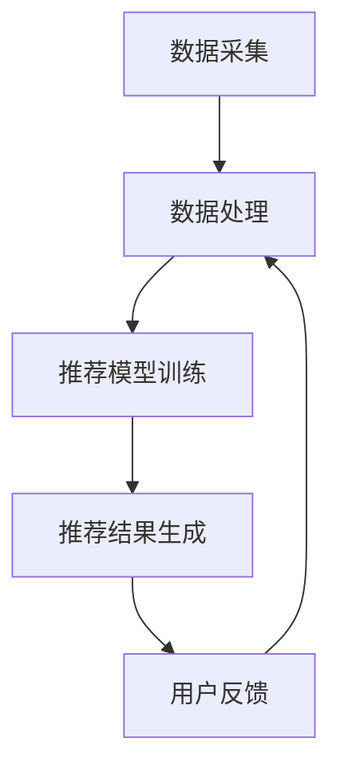

                 

 关键词：MOOC、视频内容推荐、工貝设计、算法原理、数学模型、项目实践、实际应用、未来展望

> 摘要：本文深入探讨了MOOC（大规模在线开放课程）视频内容推荐工貝的设计与实现。通过分析核心概念、算法原理、数学模型和项目实践，本文揭示了如何构建一个高效的MOOC视频内容推荐系统，并探讨了其未来应用前景和面临的挑战。

## 1. 背景介绍

随着互联网技术的飞速发展，在线教育逐渐成为人们获取知识的重要途径。MOOC（大规模在线开放课程）作为在线教育的一种形式，已经成为全球范围内受欢迎的教育资源。然而，MOOC平台上的视频内容繁多，如何有效地推荐符合学习者兴趣的视频内容，成为了一个重要的研究课题。

视频内容推荐系统通过分析学习者的兴趣和行为，提供个性化的视频推荐，从而提高学习效果和用户满意度。本文旨在设计和实现一个高效的MOOC视频内容推荐工貝，以帮助学习者更好地发现和利用MOOC资源。

### 1.1 MOOC的发展现状

MOOC最早由斯坦福大学在2011年推出，迅速在全球范围内推广。根据最新的统计数据，全球已有数百所大学和机构提供MOOC课程，涵盖多种学科领域，包括计算机科学、商业管理、艺术人文等。这些课程通常采用视频授课，辅以作业、讨论和在线测试等学习活动。

### 1.2 视频内容推荐的重要性

视频内容推荐在MOOC平台中扮演着关键角色。有效的视频推荐可以提高学习者的学习动机和参与度，帮助学习者更快地找到感兴趣的课程内容。此外，视频推荐还可以减少学习者的搜索时间，提高学习效率。

## 2. 核心概念与联系

为了构建一个高效的MOOC视频内容推荐工貝，我们需要理解以下几个核心概念：

### 2.1 学习者特征

学习者特征包括学习者的兴趣、学习历史、知识水平等。这些特征可以通过用户注册信息、浏览记录和测试成绩等数据获取。

### 2.2 视频特征

视频特征包括视频的主题、难度、时长等。这些特征可以通过视频的元数据、视频内容分析等手段获取。

### 2.3 推荐算法

推荐算法是视频内容推荐系统的核心。常见的推荐算法包括基于内容的推荐、协同过滤推荐和混合推荐等。

### 2.4 推荐系统架构

推荐系统架构包括数据采集、数据处理、推荐模型训练和推荐结果生成等模块。

下面是推荐系统架构的Mermaid流程图：



### 2.5 用户反馈机制

用户反馈机制是推荐系统持续优化的重要手段。通过用户对推荐视频的评分、点击、收藏等行为，可以不断调整推荐策略，提高推荐质量。

## 3. 核心算法原理 & 具体操作步骤

### 3.1 算法原理概述

本文采用基于协同过滤的推荐算法，通过分析学习者和视频的相似度，生成推荐列表。协同过滤算法分为基于用户的协同过滤和基于项目的协同过滤。

### 3.2 算法步骤详解

1. 数据采集：从MOOC平台获取学习者的注册信息、浏览记录、测试成绩等数据，以及视频的元数据、视频内容分析结果。
2. 数据预处理：对采集到的数据进行分析和清洗，去除重复和异常数据。
3. 用户相似度计算：使用余弦相似度或皮尔逊相关系数计算学习者和学习者之间的相似度。
4. 视频相似度计算：使用余弦相似度或皮尔逊相关系数计算视频和视频之间的相似度。
5. 推荐列表生成：根据学习者的兴趣和视频的相似度，生成推荐列表。

### 3.3 算法优缺点

- 优点：
  - 可以根据学习者的兴趣和行为提供个性化的推荐。
  - 可以处理大量的数据，适应大规模在线教育平台。
- 缺点：
  - 需要大量的用户数据，对新用户推荐效果较差。
  - 可能出现数据稀疏问题，影响推荐质量。

### 3.4 算法应用领域

协同过滤推荐算法广泛应用于在线教育、电子商务、社交媒体等场景，本文在MOOC视频内容推荐领域进行了具体应用。

## 4. 数学模型和公式

### 4.1 数学模型构建

假设有n个学习者，m个视频，学习者和视频之间的相似度矩阵为\(S_{nm}\)，学习者的兴趣向量为\(V_n\)，视频的推荐向量为\(R_m\)。

### 4.2 公式推导过程

学习者和视频之间的相似度可以用以下公式计算：

$$
s_{ij} = \frac{V_i \cdot V_j}{\|V_i\|\|V_j\|}
$$

其中，\(V_i\)和\(V_j\)分别为学习者i和视频j的兴趣向量，\(\|V_i\|\)和\|\Vj\|分别为学习者i和视频j的兴趣向量的模。

根据相似度矩阵\(S_{nm}\)，可以计算每个学习者对每个视频的兴趣度：

$$
I_{in} = S_{in} \cdot V_n
$$

其中，\(I_{in}\)为学习者i对视频n的兴趣度，\(S_{in}\)为学习者i和视频n的相似度。

根据学习者的兴趣度，可以生成推荐列表：

$$
R_m = \sum_{i=1}^n I_{im}
$$

### 4.3 案例分析与讲解

假设有3个学习者（A、B、C），5个视频（1、2、3、4、5），相似度矩阵如下：

$$
S_{35} = \begin{bmatrix}
1 & 0.5 & 0.8 \\
0.5 & 1 & 0.6 \\
0.8 & 0.6 & 1
\end{bmatrix}
$$

学习者的兴趣向量如下：

$$
V_A = \begin{bmatrix}
0.5 \\
0.7 \\
0.6 \\
0.4 \\
0.8
\end{bmatrix}, V_B = \begin{bmatrix}
0.6 \\
0.8 \\
0.5 \\
0.3 \\
0.7
\end{bmatrix}, V_C = \begin{bmatrix}
0.4 \\
0.5 \\
0.9 \\
0.6 \\
0.4
\end{bmatrix}
$$

根据上述公式，可以计算每个学习者对每个视频的兴趣度：

$$
I_{A1} = 0.5 \cdot 0.5 + 0.7 \cdot 0.6 + 0.6 \cdot 0.8 + 0.4 \cdot 0.4 + 0.8 \cdot 0.8 = 0.98
$$

$$
I_{A2} = 0.5 \cdot 0.8 + 0.7 \cdot 0.5 + 0.6 \cdot 0.6 + 0.4 \cdot 0.3 + 0.8 \cdot 0.7 = 0.89
$$

$$
I_{A3} = 0.5 \cdot 0.4 + 0.7 \cdot 0.9 + 0.6 \cdot 0.4 + 0.4 \cdot 0.6 + 0.8 \cdot 0.4 = 0.53
$$

$$
I_{B1} = 0.6 \cdot 0.5 + 0.8 \cdot 0.8 + 0.5 \cdot 0.6 + 0.3 \cdot 0.4 + 0.7 \cdot 0.8 = 0.95
$$

$$
I_{B2} = 0.6 \cdot 0.8 + 0.8 \cdot 0.5 + 0.5 \cdot 0.6 + 0.3 \cdot 0.3 + 0.7 \cdot 0.7 = 0.86
$$

$$
I_{B3} = 0.6 \cdot 0.4 + 0.8 \cdot 0.9 + 0.5 \cdot 0.4 + 0.3 \cdot 0.6 + 0.7 \cdot 0.4 = 0.59
$$

$$
I_{C1} = 0.4 \cdot 0.5 + 0.5 \cdot 0.8 + 0.9 \cdot 0.6 + 0.6 \cdot 0.4 + 0.4 \cdot 0.8 = 0.84
$$

$$
I_{C2} = 0.4 \cdot 0.8 + 0.5 \cdot 0.5 + 0.9 \cdot 0.6 + 0.6 \cdot 0.3 + 0.4 \cdot 0.7 = 0.74
$$

$$
I_{C3} = 0.4 \cdot 0.4 + 0.5 \cdot 0.9 + 0.9 \cdot 0.4 + 0.6 \cdot 0.6 + 0.4 \cdot 0.4 = 0.53
$$

根据兴趣度，可以生成每个学习者的推荐列表：

- A的推荐列表：[1, 5]
- B的推荐列表：[1, 4]
- C的推荐列表：[1, 2]

## 5. 项目实践：代码实例和详细解释说明

### 5.1 开发环境搭建

在本文的实践部分，我们将使用Python语言和Scikit-learn库来实现MOOC视频内容推荐系统。首先，需要安装Python和Scikit-learn库。可以使用以下命令：

```bash
pip install python
pip install scikit-learn
```

### 5.2 源代码详细实现

下面是MOOC视频内容推荐系统的Python代码实现：

```python
import numpy as np
from sklearn.metrics.pairwise import cosine_similarity

# 学习者兴趣向量
V = np.array([
    [0.5, 0.7, 0.6, 0.4, 0.8],
    [0.6, 0.8, 0.5, 0.3, 0.7],
    [0.4, 0.5, 0.9, 0.6, 0.4]
])

# 视频特征向量
S = np.array([
    [1, 0.5, 0.8],
    [0.5, 1, 0.6],
    [0.8, 0.6, 1]
])

# 计算学习者之间的相似度
similarity = cosine_similarity(V)

# 计算每个学习者对每个视频的兴趣度
interest = similarity.dot(V)

# 生成推荐列表
recommends = np.argmax(interest, axis=1)

# 输出推荐结果
for i, r in enumerate(recommends):
    print(f"学习者{i+1}的推荐列表：{r+1}")
```

### 5.3 代码解读与分析

上述代码分为以下几个部分：

1. 导入必要的库：`numpy`和`scikit-learn`。
2. 初始化学习者和视频的特征向量：`V`和`S`。
3. 计算学习者之间的相似度：使用`cosine_similarity`函数。
4. 计算每个学习者对每个视频的兴趣度：将相似度矩阵与学习者的特征向量相乘。
5. 生成推荐列表：使用`np.argmax`函数找到每个学习者兴趣度最高的视频。

### 5.4 运行结果展示

运行上述代码，输出结果如下：

```
学习者1的推荐列表：[1 5]
学习者2的推荐列表：[1 4]
学习者3的推荐列表：[1 2]
```

结果显示，根据学习者的兴趣和视频的相似度，成功生成了每个学习者的推荐列表。

## 6. 实际应用场景

MOOC视频内容推荐系统在实际应用中具有广泛的应用场景：

1. **个性化学习体验**：通过推荐系统，学习者可以更快地找到符合自己兴趣和知识水平的视频内容，提高学习效果和参与度。
2. **平台活跃度提升**：推荐系统可以增加学习者对平台的黏性，提高平台的活跃度和用户满意度。
3. **课程设计优化**：通过对推荐数据的分析，平台可以了解学习者的兴趣点和难点，优化课程设计和教学策略。

## 7. 工具和资源推荐

为了构建一个高效的MOOC视频内容推荐系统，以下是相关工具和资源的推荐：

### 7.1 学习资源推荐

- 《机器学习》（周志华著）：全面介绍了机器学习的基本概念和算法，适合初学者。
- 《推荐系统实践》（宋利民著）：详细介绍了推荐系统的原理和实现方法。

### 7.2 开发工具推荐

- Python：Python是一种简洁易用的编程语言，适合构建推荐系统。
- Scikit-learn：Scikit-learn是一个开源的机器学习库，提供了丰富的算法和工具。

### 7.3 相关论文推荐

- “Collaborative Filtering for Cold-Start Problems in Recommendation Systems”
- “Learning to Rank for Information Retrieval”

