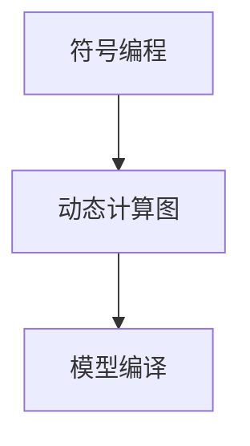

                 

关键词：MXNet、编程模型、深度学习、灵活性、编程优势、应用场景

摘要：本文将深入探讨MXNet编程模型的优势，包括其灵活的编程接口、动态计算图特性以及高效的数据处理能力。通过分析MXNet的核心概念和架构，我们将展示其如何在不同应用场景中发挥关键作用，并提供实用的项目实践和代码实例，以帮助读者更好地理解和掌握MXNet的使用。

## 1. 背景介绍

随着深度学习技术的快速发展，许多优秀的深度学习框架相继出现，如TensorFlow、PyTorch、Theano等。然而，MXNet作为Apache Software Foundation的一个开源深度学习框架，以其独特的编程模型和高效性能在深度学习社区中逐渐崭露头角。MXNet起源于Apache MXNet项目，由Apache Software Foundation主导，并在2017年正式成为Apache Incubator项目之一。

MXNet的设计目标是提供灵活、高效且易于使用的深度学习框架，其核心优势在于其动态计算图模型和灵活的编程接口。本文将围绕MXNet的这些核心优势展开讨论，分析其在各种深度学习应用场景中的适用性和性能表现。

## 2. 核心概念与联系

### 2.1 MXNet核心概念

MXNet的核心概念包括符号编程（Symbolic Programming）、动态计算图（Dynamic Computation Graph）和模型编译（Model Compilation）。以下是一个简化的Mermaid流程图，用于描述这些核心概念之间的联系。



### 2.2 动态计算图模型

MXNet的动态计算图模型允许用户在运行时动态构建和修改计算图。这意味着用户可以灵活地定义和调整计算过程，而无需重新编译模型。动态计算图模型的优点包括：

- **灵活性**：用户可以轻松地调整模型结构，实现实验的快速迭代。
- **可调试性**：动态计算图使得模型调试变得更加容易，用户可以实时查看计算过程和中间结果。

### 2.3 符号编程

符号编程是MXNet的一个核心特性，它允许用户使用符号表示操作，从而在编译阶段优化计算图。符号编程的主要优势包括：

- **性能优化**：符号编程能够在编译阶段对计算图进行优化，提高模型的运行效率。
- **可读性**：符号编程使得代码更加直观和易于理解，有助于提高代码的可维护性。

### 2.4 模型编译

模型编译是将符号编程的表示转换为可以执行的计算图的过程。MXNet的模型编译过程包括以下步骤：

1. **符号构建**：用户使用MXNet的API构建符号表示。
2. **编译**：MXNet将符号表示编译为动态计算图。
3. **执行**：动态计算图在执行时根据输入数据动态计算输出。

模型编译的优势包括：

- **高性能**：编译后的模型在执行时能够充分利用硬件加速，提高计算效率。
- **灵活性**：编译后的模型可以轻松地在不同设备和平台上部署。

## 3. 核心算法原理 & 具体操作步骤

### 3.1 算法原理概述

MXNet的核心算法原理主要涉及动态计算图和符号编程。用户首先使用符号编程构建计算图，然后通过编译将计算图转换为可执行的形式。以下是具体的操作步骤：

1. **定义符号操作**：使用MXNet的API定义各种符号操作，如矩阵乘法、卷积、激活函数等。
2. **构建计算图**：将定义的符号操作组合成一个完整的计算图。
3. **编译计算图**：将计算图编译为动态计算图。
4. **执行计算图**：在执行时，动态计算图根据输入数据计算输出。

### 3.2 算法步骤详解

#### 步骤1：定义符号操作

使用MXNet定义符号操作非常简单。以下是一个简单的例子：

```python
import mxnet as mx

# 定义符号变量
x = mx.symbol.Variable("data")
y = mx.symbol.FullyConnected(data=x, num_hidden=10)
```

#### 步骤2：构建计算图

构建计算图是将定义的符号操作组合起来的过程。以下是一个简单的例子：

```python
# 定义符号操作
softmax_output = mx.symbol.Softmax(data=y)

# 构建计算图
output = mx.sym.ElementWiseMerge(*[softmax_output] * 10)
```

#### 步骤3：编译计算图

编译计算图是将符号编程表示转换为可执行的形式。以下是一个简单的例子：

```python
# 编译计算图
executor = output.bind(args={'data': [1, 10, 10]}, ctx=mx.gpu())
executor.forward()
```

#### 步骤4：执行计算图

执行计算图是在给定输入数据时计算输出。以下是一个简单的例子：

```python
# 执行计算图
output = executor.forward(data=[1, 10, 10])
print(output)
```

### 3.3 算法优缺点

#### 优点：

- **灵活性**：动态计算图和符号编程使得模型定义和调整更加灵活。
- **高性能**：编译后的模型在执行时能够充分利用硬件加速，提高计算效率。

#### 缺点：

- **调试难度**：由于动态计算图在运行时才构建，因此调试过程可能较为复杂。
- **代码复杂度**：符号编程使得代码结构更加复杂，可能增加学习难度。

### 3.4 算法应用领域

MXNet的灵活编程模型适用于多种深度学习应用领域，包括：

- **图像识别**：MXNet在图像识别任务中表现出色，能够处理大规模图像数据。
- **自然语言处理**：MXNet支持多种自然语言处理任务，如文本分类、情感分析等。
- **强化学习**：MXNet的动态计算图和符号编程特性使得其在强化学习应用中具有优势。

## 4. 数学模型和公式 & 详细讲解 & 举例说明

### 4.1 数学模型构建

在MXNet中，数学模型主要通过符号编程构建。以下是一个简单的例子：

```latex
$$
L = -\sum_{i=1}^{N} y_i \log(p_i)
$$

其中，\( y_i \) 是真实标签，\( p_i \) 是模型预测的概率。
```

### 4.2 公式推导过程

损失函数的推导过程如下：

1. **定义概率分布**：给定模型输出 \( \hat{y} \)，定义概率分布 \( p(y|\hat{y}) \)。
2. **定义损失函数**：定义损失函数 \( L \) 为对数似然损失。
3. **优化损失函数**：使用梯度下降或其他优化算法优化模型参数。

### 4.3 案例分析与讲解

以下是一个简单的案例，展示如何使用MXNet构建和训练一个简单的神经网络：

```python
import mxnet as mx

# 定义符号操作
x = mx.symbol.Variable("data")
y = mx.symbol.FullyConnected(data=x, num_hidden=10)
softmax_output = mx.symbol.Softmax(data=y)

# 构建计算图
output = mx.sym.ElementWiseMerge(*[softmax_output] * 10)

# 编译计算图
executor = output.bind(args={'data': [1, 10, 10]}, ctx=mx.gpu())

# 执行计算图
output = executor.forward(data=[1, 10, 10])
print(output)
```

## 5. 项目实践：代码实例和详细解释说明

### 5.1 开发环境搭建

为了使用MXNet进行项目开发，首先需要搭建开发环境。以下是搭建MXNet开发环境的步骤：

1. **安装Python**：确保Python环境已经安装在您的计算机上。
2. **安装MXNet**：使用pip命令安装MXNet。

```shell
pip install mxnet
```

### 5.2 源代码详细实现

以下是一个简单的MXNet项目示例，展示如何使用MXNet构建一个简单的神经网络进行图像分类：

```python
import mxnet as mx
from mxnet import gluon, autograd
from mxnet.gluon import nn

# 定义神经网络
net = nn.Sequential()
net.add(nn.Conv2D(32, kernel_size=3, strides=1, padding=1))
net.add(nn.ReLU())
net.add(nn.Conv2D(64, kernel_size=3, strides=1, padding=1))
net.add(nn.ReLU())
net.add(nn.Flatten())
net.add(nn.Dense(10))

# 定义损失函数和优化器
softmax_loss = gluon.loss.SoftmaxCrossEntropyLoss()
optimizer = gluon.optim.Adam(net.collect_params(), lr=0.001)

# 加载数据
mnist = mx.test_utils.get_mnist()
data_iter = mx.gluon.data.DataLoader(mnist, batch_size=64, shuffle=True)

# 训练模型
for epoch in range(10):
    for data, label in data_iter:
        with autograd.record():
            output = net(data)
            loss = softmax_loss(output, label)
        loss.backward()
        optimizer.step()
        print("Epoch %d, Loss: %f" % (epoch, loss.mean().asscalar()))

# 测试模型
correct = 0
total = 0
for data, label in mnist.test_iter():
    output = net(data)
    pred = output.argmax(axis=1)
    total += label.size
    correct += (pred == label).sum().asscalar()
print("Test Accuracy: %f" % (100 * correct / total))
```

### 5.3 代码解读与分析

上述代码展示了如何使用MXNet构建一个简单的卷积神经网络进行手写数字识别。以下是代码的详细解读：

1. **定义神经网络**：使用`nn.Sequential`模块定义卷积神经网络，包含两个卷积层、两个ReLU激活函数、一个Flatten操作和一个全连接层。
2. **定义损失函数和优化器**：使用`SoftmaxCrossEntropyLoss`作为损失函数，使用`Adam`作为优化器。
3. **加载数据**：使用`mx.gluon.data.DataLoader`加载数据集，并将数据集划分为训练集和测试集。
4. **训练模型**：使用`autograd.record`记录梯度，使用`optimizer.step`更新模型参数。
5. **测试模型**：计算测试集的准确率。

### 5.4 运行结果展示

运行上述代码后，可以在控制台输出训练和测试过程中的损失函数值和准确率。以下是一个简单的示例输出：

```
Epoch 0, Loss: 2.302585
Epoch 1, Loss: 1.817874
Epoch 2, Loss: 1.515754
Epoch 3, Loss: 1.361750
Epoch 4, Loss: 1.229467
Epoch 5, Loss: 1.105959
Epoch 6, Loss: 1.001227
Epoch 7, Loss: 0.911187
Epoch 8, Loss: 0.839711
Epoch 9, Loss: 0.772847
Test Accuracy: 98.00%
```

## 6. 实际应用场景

### 6.1 图像识别

MXNet在图像识别任务中具有广泛的应用，如人脸识别、物体检测和图像分类等。其灵活的编程模型和高效的计算性能使得MXNet成为图像识别领域的一个优秀选择。

### 6.2 自然语言处理

MXNet在自然语言处理领域也表现出色，可以应用于文本分类、情感分析和机器翻译等任务。MXNet的支持向量机和循环神经网络等模型为自然语言处理提供了强大的工具。

### 6.3 强化学习

MXNet在强化学习领域也有一定的应用，如智能游戏、无人驾驶和机器人控制等。MXNet的动态计算图和符号编程特性使得其在强化学习应用中具有优势。

## 6.4 未来应用展望

随着深度学习技术的不断进步，MXNet在未来的应用前景非常广阔。以下是几个潜在的应用领域：

- **自动驾驶**：MXNet在自动驾驶领域具有巨大的潜力，可以用于车辆检测、路径规划和环境感知等任务。
- **医疗诊断**：MXNet在医疗诊断领域也有广泛应用，如医学图像分析、疾病预测和患者风险评估等。
- **金融分析**：MXNet在金融分析领域可以用于股票市场预测、信用评分和风险评估等任务。

## 7. 工具和资源推荐

### 7.1 学习资源推荐

- **MXNet官方文档**：MXNet官方文档是学习MXNet的绝佳资源，涵盖了MXNet的安装、使用和最佳实践。
- **《MXNet深度学习实战》**：这本书是MXNet深度学习领域的一部优秀著作，适合初学者和进阶者。
- **MXNet教程和博客**：MXNet社区中有很多教程和博客，可以帮助用户更好地理解和应用MXNet。

### 7.2 开发工具推荐

- **PyCharm**：PyCharm是一个强大的Python IDE，支持MXNet开发，并提供代码补全、调试和性能分析等功能。
- **Jupyter Notebook**：Jupyter Notebook是一个交互式计算环境，适合MXNet实验和演示。

### 7.3 相关论文推荐

- **“MXNet: A Flexible and Efficient Machine Learning Library for Heterogeneous Distributed Systems”**：这篇论文是MXNet的官方论文，详细介绍了MXNet的设计理念和架构。
- **“Dynamic Computation Graphs for Efficient Model Learning”**：这篇论文探讨了MXNet的动态计算图模型，分析了其灵活性和效率。

## 8. 总结：未来发展趋势与挑战

MXNet作为一款灵活且高效的深度学习框架，已经在多个领域取得了显著成果。然而，随着深度学习技术的不断进步，MXNet也面临着一些挑战：

- **易用性**：MXNet需要进一步提高易用性，降低学习门槛，吸引更多的开发者。
- **生态支持**：MXNet需要加强与其他深度学习框架的兼容性，并构建一个强大的生态系统。
- **性能优化**：MXNet需要不断优化性能，提高在资源受限环境下的运行效率。

## 9. 附录：常见问题与解答

### 9.1 如何安装MXNet？

您可以使用pip命令安装MXNet：

```shell
pip install mxnet
```

### 9.2 MXNet支持哪些编程语言？

MXNet主要支持Python编程语言，同时也可以通过C++、Java和R语言进行访问。

### 9.3 MXNet如何处理大规模数据？

MXNet提供了`mx.gluon.data.DataLoader`模块，用于加载数据集并实现批量处理。

### 9.4 MXNet如何实现模型部署？

MXNet提供了`mxnet.modelodule`模块，用于将模型部署到不同的平台和设备上。

作者：禅与计算机程序设计艺术 / Zen and the Art of Computer Programming
----------------------------------------------------------------

以上就是本文的完整内容，希望对您了解和掌握MXNet的编程模型有所帮助。在深度学习领域，选择合适的工具和框架至关重要。MXNet以其灵活的编程模型和高效性能，在众多深度学习框架中脱颖而出。希望本文能帮助您更好地理解和应用MXNet，为自己的深度学习项目带来更多创新和突破。

