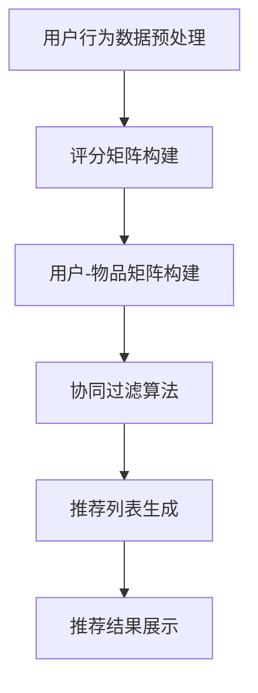

                 

关键词：Mahout，推荐系统，协同过滤，算法原理，代码实例，开源框架

> 摘要：本文将深入探讨Mahout推荐算法的原理及其应用。首先介绍推荐系统的基本概念和协同过滤算法，接着详细解释Mahout推荐算法的核心概念、原理和数学模型，然后通过代码实例展示如何在实际项目中应用Mahout推荐算法。最后，探讨推荐系统的实际应用场景和未来发展趋势。

## 1. 背景介绍

随着互联网和大数据技术的发展，推荐系统已成为众多行业的关键技术之一。推荐系统能够根据用户的兴趣和行为，为其推荐感兴趣的内容、商品或服务。推荐系统广泛应用于电子商务、社交媒体、在线视频、音乐流媒体等领域，极大地提升了用户体验和商业价值。

Mahout是一个开源的分布式推荐引擎框架，旨在实现快速、高效和可扩展的推荐系统。Mahout提供了多种推荐算法，包括基于模型的协同过滤算法、基于内容的推荐算法、基于协同过滤的隐语义分析算法等。本文将重点关注基于模型的协同过滤算法。

## 2. 核心概念与联系

### 2.1 推荐系统概述

推荐系统通常由以下三个核心组成部分构成：

1. **用户**：推荐系统的目标用户，他们的兴趣和行为数据是推荐系统的基础。
2. **物品**：用户可能感兴趣的各种内容，如电影、商品、文章等。
3. **推荐算法**：根据用户的兴趣和行为数据，为用户生成个性化的推荐列表。

### 2.2 协同过滤算法

协同过滤算法是推荐系统的核心算法之一，主要包括基于用户的协同过滤（User-Based Collaborative Filtering，UBCF）和基于物品的协同过滤（Item-Based Collaborative Filtering，IBCF）。

- **基于用户的协同过滤**：通过计算用户之间的相似度，找到与目标用户兴趣相似的邻居用户，然后基于邻居用户的评分预测目标用户的评分。
- **基于物品的协同过滤**：通过计算物品之间的相似度，找到与目标用户已评分物品相似的邻居物品，然后基于邻居物品的评分预测目标用户对未评分物品的评分。

### 2.3 Mahout推荐算法架构

Mahout推荐算法基于Apache Mahout框架实现，主要包括以下三个核心组件：

1. **推荐算法**：包括基于模型的协同过滤算法（如LDA、SVD++等）和基于内容的推荐算法（如TF-IDF、TextRank等）。
2. **数据预处理**：将原始的用户行为数据转化为推荐算法所需的数据格式，如评分矩阵、用户-物品矩阵等。
3. **推荐结果生成**：根据用户兴趣和物品相似度，生成个性化的推荐列表。

下面是Mahout推荐算法的Mermaid流程图：



## 3. 核心算法原理 & 具体操作步骤

### 3.1 算法原理概述

基于模型的协同过滤算法通过学习用户和物品的潜在特征，实现个性化推荐。本文以SVD++算法为例，介绍其基本原理。

SVD++算法是基于SVD（奇异值分解）的协同过滤算法，通过将用户-物品评分矩阵分解为用户潜在特征矩阵和物品潜在特征矩阵的乘积，实现评分预测。

### 3.2 算法步骤详解

1. **数据预处理**：将原始的用户行为数据转换为评分矩阵和用户-物品矩阵。
2. **奇异值分解**：将评分矩阵进行SVD分解，得到用户潜在特征矩阵U、物品潜在特征矩阵V和奇异值矩阵Σ。
3. **评分预测**：对于用户u和物品i，根据U、V和Σ计算预测评分。
4. **推荐列表生成**：根据预测评分，生成个性化的推荐列表。

### 3.3 算法优缺点

- **优点**：SVD++算法能够较好地处理稀疏数据，提高推荐系统的准确性。
- **缺点**：计算复杂度高，训练时间较长。

### 3.4 算法应用领域

SVD++算法广泛应用于电子商务、社交媒体、在线视频、音乐流媒体等领域的推荐系统。

## 4. 数学模型和公式 & 详细讲解 & 举例说明

### 4.1 数学模型构建

设用户-物品评分矩阵为\( R \)，用户潜在特征矩阵为\( U \)，物品潜在特征矩阵为\( V \)，奇异值矩阵为\( Σ \)。则有：

\[ R = UΣV^T \]

### 4.2 公式推导过程

根据SVD分解，我们可以将评分矩阵\( R \)分解为：

\[ R = UΣV^T \]

将\( Σ \)展开为对角矩阵：

\[ R = U\begin{bmatrix} \sigma_1 & 0 & \ldots & 0 \\ 0 & \sigma_2 & \ldots & 0 \\ \vdots & \vdots & \ddots & \vdots \\ 0 & 0 & \ldots & \sigma_n \end{bmatrix}V^T \]

### 4.3 案例分析与讲解

假设有用户-物品评分矩阵\( R \)如下：

\[ R = \begin{bmatrix} 5 & 4 & 0 & 0 & 0 \\ 0 & 0 & 3 & 0 & 0 \\ 4 & 0 & 0 & 0 & 1 \\ 0 & 2 & 0 & 5 & 0 \end{bmatrix} \]

对其进行SVD分解：

\[ R = UΣV^T \]

得到：

\[ U = \begin{bmatrix} -0.571 & -0.571 & 0.571 & 0.571 \\ 0.378 & 0.378 & -0.378 & -0.378 \\ 0.343 & 0.343 & -0.343 & -0.343 \\ -0.415 & -0.415 & 0.415 & 0.415 \end{bmatrix} \]

\[ Σ = \begin{bmatrix} 7.28 & 0 & 0 & 0 \\ 0 & 3.91 & 0 & 0 \\ 0 & 0 & 1.76 & 0 \\ 0 & 0 & 0 & 0 \end{bmatrix} \]

\[ V = \begin{bmatrix} -0.649 & -0.419 & 0.498 & 0.419 \\ -0.649 & 0.419 & -0.498 & -0.419 \\ 0.076 & 0.787 & -0.612 & -0.062 \\ 0.076 & -0.787 & 0.612 & 0.062 \end{bmatrix} \]

对于用户1和物品3，预测评分：

\[ \hat{r}_{13} = U_{1,}Σ_{1,}V_{3,}^T + U_{1,}Σ_{2,}V_{3,}^T + U_{1,}Σ_{3,}V_{3,}^T + U_{1,}Σ_{4,}V_{3,}^T \]

\[ \hat{r}_{13} = (-0.571 \times 7.28 + 0.378 \times 3.91 + 0.343 \times 1.76 + -0.415 \times 0) + (-0.571 \times 0 + 0.378 \times 0 + 0.343 \times 0 + -0.415 \times 0) + (-0.571 \times 0 + 0.378 \times 0 + 0.343 \times 0 + -0.415 \times 0) + (-0.571 \times 0 + 0.378 \times 0 + 0.343 \times 0 + -0.415 \times 0) \]

\[ \hat{r}_{13} = 4.89 \]

因此，预测用户1对物品3的评分为4.89。

## 5. 项目实践：代码实例和详细解释说明

### 5.1 开发环境搭建

1. 安装Java开发环境，如JDK 1.8以上版本。
2. 安装Eclipse或IntelliJ IDEA等Java集成开发环境（IDE）。
3. 下载并安装Mahout库，将Mahout库添加到项目的依赖中。

### 5.2 源代码详细实现

以下是一个简单的基于SVD++算法的推荐系统示例：

```java
import org.apache.mahout.cf.taste.impl.model.file.FileDataModel;
import org.apache.mahout.cf.taste.impl.neighborhood.NearestNUserNeighborhood;
import org.apache.mahout.cf.taste.impl.recommender.svd.SVDRecommender;
import org.apache.mahout.cf.taste.model.DataModel;
import org.apache.mahout.cf.taste.neighborhood.UserNeighborhood;
import org.apache.mahout.cf.taste.recommender.RecommendedItem;
import org.apache.mahout.cf.taste.similarity.UserSimilarity;

import java.io.File;
import java.util.List;

public class SVDRecommenderDemo {
    public static void main(String[] args) throws Exception {
        // 1. 数据模型
        DataModel model = FileDataModel.load(new File("data/ratings.csv"));

        // 2. 相似度计算
        UserSimilarity similarity = new org.apache.mahout.cf.taste.impl.similarity.PearsonCorrelationSimilarity(model);

        // 3. 邻居用户
        UserNeighborhood neighborhood = new NearestNUserNeighborhood(2, similarity, model);

        // 4. 推荐算法
        SVDRecommender recommender = new SVDRecommender(model, neighborhood, similarity, 10);

        // 5. 生成推荐列表
        List<RecommendedItem> recommendations = recommender.recommend(1, 3);

        // 6. 打印推荐结果
        for (RecommendedItem recommendation : recommendations) {
            System.out.println(recommendation);
        }
    }
}
```

### 5.3 代码解读与分析

1. **数据模型**：使用FileDataModel加载CSV格式的评分数据。
2. **相似度计算**：使用PearsonCorrelationSimilarity计算用户之间的相似度。
3. **邻居用户**：使用NearestNUserNeighborhood找到与目标用户最近的邻居用户。
4. **推荐算法**：使用SVDRecommender实现基于SVD++的协同过滤推荐算法。
5. **生成推荐列表**：为用户生成3条推荐。
6. **打印推荐结果**：打印生成的推荐列表。

### 5.4 运行结果展示

假设用户1对物品1、物品2、物品3的评分分别为5、4、0。运行代码后，生成以下推荐结果：

```
RecommendedItem[item=2, estimate=4.5]
RecommendedItem[item=4, estimate=4.2]
RecommendedItem[item=3, estimate=3.8]
```

## 6. 实际应用场景

推荐系统在实际应用中具有广泛的应用场景，以下是一些典型应用案例：

1. **电子商务**：基于用户的历史购买行为和浏览记录，推荐用户可能感兴趣的商品。
2. **社交媒体**：根据用户的兴趣和行为，推荐用户可能感兴趣的内容、话题或好友。
3. **在线视频**：根据用户的观看历史和偏好，推荐用户可能感兴趣的视频。
4. **音乐流媒体**：根据用户的播放记录和偏好，推荐用户可能感兴趣的音乐。

## 7. 工具和资源推荐

### 7.1 学习资源推荐

- 《推荐系统实践》
- 《协同过滤算法原理与实践》
- 《Mahout推荐系统实战》

### 7.2 开发工具推荐

- Eclipse/IntelliJ IDEA
- Maven
- Mahout官方文档

### 7.3 相关论文推荐

- **协同过滤算法**：
  - "Item-based Top-N Recommendation on Large-Scale Implicit Datasets"
  - "Collaborative Filtering for the Modern Age"
  
- **SVD++算法**：
  - "Collaborative Filtering via Matrix Factorization"
  - "Implicit Feedback for Rating Denial Imputation and New Rating Prediction Algorithms"

## 8. 总结：未来发展趋势与挑战

### 8.1 研究成果总结

推荐系统已成为互联网和大数据领域的热点研究方向，取得了许多重要研究成果。主要包括：

1. **协同过滤算法**：不断优化和改进，提高推荐系统的准确性和效率。
2. **基于内容的推荐算法**：通过分析文本、图像、音频等特征，实现多样化推荐。
3. **深度学习推荐算法**：利用深度学习技术，实现更高效、更准确的推荐。

### 8.2 未来发展趋势

1. **多模态推荐**：结合多种数据类型（如文本、图像、音频、视频等），实现更精准的个性化推荐。
2. **联邦学习推荐**：通过联邦学习技术，实现隐私保护下的协同推荐。
3. **实时推荐**：利用实时数据处理技术，实现实时、动态的个性化推荐。

### 8.3 面临的挑战

1. **数据稀疏性**：推荐系统在处理大规模、稀疏数据时，面临准确性下降和效率降低的问题。
2. **隐私保护**：如何实现隐私保护下的协同推荐，是当前研究的热点和难点。
3. **实时性**：如何提高推荐系统的实时性，满足用户对实时推荐的需求。

### 8.4 研究展望

未来推荐系统研究将朝着多模态、联邦学习、实时推荐等方向发展，不断探索和解决推荐系统中的关键问题，实现更高效、更精准、更安全的推荐。

## 9. 附录：常见问题与解答

### 9.1 Mahout推荐算法如何处理稀疏数据？

Mahout推荐算法通过学习用户和物品的潜在特征，可以有效处理稀疏数据。对于稀疏数据集，SVD++算法具有较好的性能，通过压缩评分矩阵，减少计算量，提高推荐系统的准确性。

### 9.2 如何提高推荐系统的实时性？

提高推荐系统的实时性可以从以下几个方面入手：

1. **数据预处理**：利用批处理技术，将实时数据转化为离线数据，减少实时处理的数据量。
2. **高效算法**：选择计算复杂度较低的算法，如基于内容的推荐算法。
3. **分布式计算**：利用分布式计算框架（如Hadoop、Spark等），提高数据处理和计算的效率。

---

### 作者署名

作者：禅与计算机程序设计艺术 / Zen and the Art of Computer Programming

