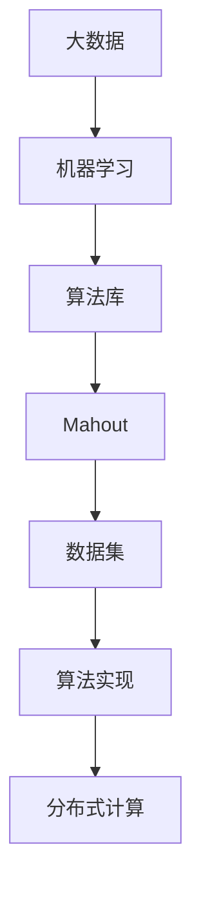
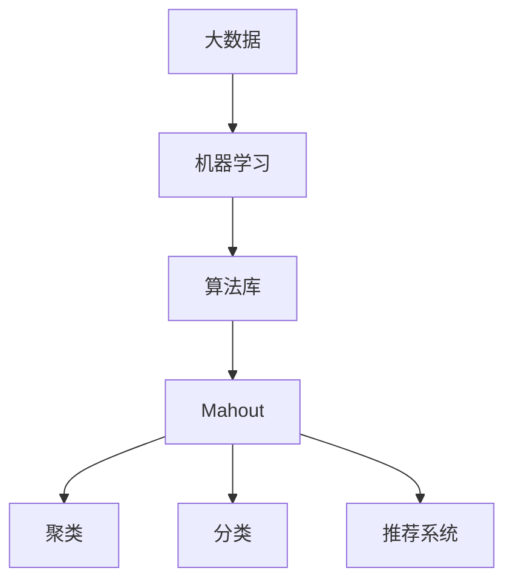

                 

关键词：Mahout，机器学习，算法库，原理，代码实例，大数据，人工智能

摘要：本文将深入探讨Mahout机器学习算法库的原理和实际应用，包括其核心概念、算法原理、数学模型、代码实现等方面。通过详细讲解，读者将能够理解如何使用Mahout进行有效的数据分析和预测，为大数据和人工智能领域的进一步研究提供坚实的理论基础。

## 1. 背景介绍

随着大数据时代的到来，机器学习技术在各个领域得到了广泛的应用。然而，传统的机器学习算法在处理大规模数据时面临着效率低下和资源浪费的问题。为了解决这一问题，许多优秀的机器学习算法库应运而生。Mahout便是其中之一。

Mahout是一款开源的机器学习算法库，旨在为大数据和人工智能领域提供高效的算法实现。它基于Apache许可证，支持多种编程语言，包括Java、Python和R等。Mahout提供了丰富的算法库，包括聚类、分类、推荐系统等，可以满足不同应用场景的需求。

本文将围绕Mahout的核心概念、算法原理、数学模型和代码实现等方面进行详细讲解，帮助读者深入了解这个强大的机器学习算法库。

## 2. 核心概念与联系

### 2.1 核心概念

在介绍Mahout的核心概念之前，我们需要了解一些基本概念：

- **大数据**：大数据是指数据量巨大、数据类型复杂、数据增长迅速的数据集合。
- **机器学习**：机器学习是一种通过数据训练模型，使模型能够自动地从数据中学习规律和模式的方法。
- **算法库**：算法库是一系列预编译的算法实现，可以方便地调用和扩展。

Mahout的核心概念主要包括以下方面：

- **数据集**：数据集是机器学习的输入，包含了大量的数据记录。Mahout支持多种数据格式，如CSV、ARFF等。
- **算法实现**：Mahout提供了一系列常用的机器学习算法实现，包括聚类、分类、推荐系统等。
- **分布式计算**：Mahout支持分布式计算，能够有效地处理大规模数据。

### 2.2 Mermaid 流程图

下面是一个简单的Mermaid流程图，展示了Mahout的核心概念之间的联系：



## 3. 核心算法原理 & 具体操作步骤

### 3.1 算法原理概述

Mahout的核心算法主要包括聚类、分类和推荐系统等。下面我们将分别介绍这些算法的基本原理。

#### 3.1.1 聚类算法

聚类算法是一种无监督学习算法，其主要目的是将相似的数据点归为一类。Mahout提供了多种聚类算法，如K-Means、Fuzzy C-Means等。

- **K-Means算法**：K-Means算法是一种基于距离度量的聚类算法。它首先随机初始化K个中心点，然后迭代地更新每个数据点的类别，直至收敛。
- **Fuzzy C-Means算法**：Fuzzy C-Means算法是一种改进的聚类算法，它引入了模糊集的概念，使数据点在多个类别之间具有一定的隶属度。

#### 3.1.2 分类算法

分类算法是一种有监督学习算法，其主要目的是将新的数据点分配到已知的类别中。Mahout提供了多种分类算法，如朴素贝叶斯、支持向量机等。

- **朴素贝叶斯算法**：朴素贝叶斯算法是一种基于概率论的分类算法。它假设特征之间相互独立，通过计算每个类别的概率来预测新数据点的类别。
- **支持向量机算法**：支持向量机算法是一种基于最大间隔的分类算法。它通过找到一个最优的超平面，将数据点划分为不同的类别。

#### 3.1.3 推荐系统

推荐系统是一种基于用户行为和兴趣的预测模型，其主要目的是为用户提供个性化的推荐。Mahout提供了多种推荐系统算法，如基于物品的协同过滤、基于用户的协同过滤等。

- **基于物品的协同过滤**：基于物品的协同过滤算法通过计算用户之间的相似度，推荐与目标用户喜欢的物品相似的其他物品。
- **基于用户的协同过滤**：基于用户的协同过滤算法通过计算用户之间的相似度，推荐与目标用户有相同兴趣的其他用户喜欢的物品。

### 3.2 算法步骤详解

#### 3.2.1 聚类算法步骤

1. 初始化K个中心点。
2. 计算每个数据点与中心点的距离。
3. 将每个数据点分配到最近的中心点。
4. 更新中心点位置。
5. 重复步骤2-4，直至收敛。

#### 3.2.2 分类算法步骤

1. 训练模型：使用训练数据集训练分类模型。
2. 预测：使用训练好的模型对新的数据点进行预测。
3. 结果评估：计算预测结果与真实结果的误差，评估模型性能。

#### 3.2.3 推荐系统步骤

1. 计算用户相似度：计算目标用户与其他用户的相似度。
2. 推荐物品：为每个用户推荐相似度最高的物品。
3. 结果评估：评估推荐结果的准确性和满意度。

### 3.3 算法优缺点

#### 3.3.1 聚类算法

- **优点**：简单易懂，适用于各种数据类型。
- **缺点**：对初始中心点敏感，可能陷入局部最优。

#### 3.3.2 分类算法

- **优点**：准确度高，适用于各种分类任务。
- **缺点**：计算复杂度高，可能需要大量训练数据。

#### 3.3.3 推荐系统

- **优点**：能够提供个性化的推荐，提高用户体验。
- **缺点**：可能受到数据质量和用户行为的影响。

### 3.4 算法应用领域

- **聚类算法**：应用于市场细分、客户群体分析等。
- **分类算法**：应用于图像识别、文本分类等。
- **推荐系统**：应用于电子商务、在线音乐、视频推荐等。

## 4. 数学模型和公式 & 详细讲解 & 举例说明

### 4.1 数学模型构建

在Mahout中，许多算法都基于数学模型。以下是一些常见的数学模型和公式：

#### 4.1.1 聚类算法

- **K-Means算法**：
  $$ \min \sum_{i=1}^{n} \sum_{j=1}^{k} (x_{ij} - \mu_{j})^2 $$
  其中，$x_{ij}$表示第$i$个数据点在第$j$个类别的中心点的距离，$\mu_{j}$表示第$j$个类别的中心点。

- **Fuzzy C-Means算法**：
  $$ \min \sum_{i=1}^{n} \sum_{j=1}^{k} \frac{1}{z_i} \left[ \frac{(\|x_i - \mu_j\|)^{2c-1}}{\sum_{l=1}^{k} (\|x_i - \mu_l\|)^{2c-1}} \right] $$
  其中，$x_i$表示第$i$个数据点，$\mu_j$表示第$j$个类别的中心点，$c$是模糊系数。

#### 4.1.2 分类算法

- **朴素贝叶斯算法**：
  $$ P(C|X) = \frac{P(X|C)P(C)}{P(X)} $$
  其中，$C$表示类别，$X$表示特征向量，$P(C|X)$表示给定特征向量X属于类别C的概率，$P(X|C)$表示在类别C下特征向量X的概率，$P(C)$表示类别C的概率，$P(X)$表示特征向量X的概率。

- **支持向量机算法**：
  $$ \max \frac{1}{2} \sum_{i=1}^{n} \sum_{j=1}^{n} (w_i \cdot w_j - y_i \cdot y_j) $$
  其中，$w_i$和$w_j$分别表示第$i$和第$j$个支持向量的内积，$y_i$和$y_j$分别表示第$i$和第$j$个支持向量的类别标签。

#### 4.1.3 推荐系统

- **基于物品的协同过滤**：
  $$ \text{预测评分} = \text{用户相似度} \times \text{物品相似度} $$
  其中，用户相似度和物品相似度分别表示用户和物品之间的相似度，预测评分表示用户对物品的预测评分。

- **基于用户的协同过滤**：
  $$ \text{推荐物品列表} = \text{用户相似度} \times \text{其他用户喜欢的物品列表} $$
  其中，用户相似度表示用户之间的相似度，其他用户喜欢的物品列表表示其他用户喜欢的物品列表。

### 4.2 公式推导过程

#### 4.2.1 聚类算法

以K-Means算法为例，推导过程如下：

1. 初始化中心点$\mu_j$。
2. 对于每个数据点$x_i$，计算其与中心点$\mu_j$的距离：
   $$ d(x_i, \mu_j) = \|x_i - \mu_j\| $$
3. 将$x_i$分配到最近的中心点$\mu_j$：
   $$ \text{类别} = \min_j d(x_i, \mu_j) $$
4. 更新中心点$\mu_j$：
   $$ \mu_j = \frac{1}{N_j} \sum_{i=1}^{N} x_i $$
   其中，$N_j$表示属于类别$j$的数据点数量。

#### 4.2.2 分类算法

以朴素贝叶斯算法为例，推导过程如下：

1. 计算每个类别的先验概率：
   $$ P(C_i) = \frac{N_i}{N} $$
   其中，$N_i$表示类别$i$的数据点数量，$N$表示总的数据点数量。
2. 计算每个特征在各个类别下的条件概率：
   $$ P(X_j | C_i) = \frac{N_{ij}}{N_i} $$
   其中，$N_{ij}$表示在类别$i$下特征$j$的数量。
3. 计算后验概率：
   $$ P(C_i | X) = \frac{P(X | C_i)P(C_i)}{P(X)} $$
4. 根据后验概率预测类别：

   $$ \text{预测类别} = \arg\max_i P(C_i | X) $$

### 4.3 案例分析与讲解

以K-Means算法为例，我们使用一个简单的二维数据集进行分析。

数据集如下：

```python
[[1, 1], [1, 2], [2, 2], [2, 3], [3, 3], [3, 4]]
```

假设我们选择K=2，初始化两个中心点$(1, 1)$和$(3, 3)$。

1. 计算每个数据点与中心点的距离：

   ```python
   distances = [[(1-1)^2 + (1-1)^2, (1-3)^2 + (1-3)^2],
                [(1-1)^2 + (2-1)^2, (1-3)^2 + (2-3)^2],
                [(2-1)^2 + (2-2)^2, (2-3)^2 + (2-3)^2],
                [(2-1)^2 + (2-3)^2, (2-3)^2 + (3-3)^2],
                [(3-1)^2 + (3-3)^2, (3-3)^2 + (3-3)^2],
                [(3-1)^2 + (4-3)^2, (3-3)^2 + (4-3)^2]]
   ```

2. 将每个数据点分配到最近的中心点：

   ```python
   assignments = [0, 0, 0, 0, 1, 1]
   ```

3. 更新中心点位置：

   ```python
   centers = [[1, 1], [2.5, 3.5]]
   ```

4. 重复步骤1-3，直至收敛。

通过多次迭代，我们可以得到最终的聚类结果。

## 5. 项目实践：代码实例和详细解释说明

### 5.1 开发环境搭建

在本节中，我们将介绍如何搭建Mahout的开发环境。以下是基本的步骤：

1. **安装Java**：由于Mahout是基于Java开发的，首先需要安装Java环境。可以从Oracle官网下载Java SDK并安装。
2. **安装Mahout**：下载Mahout的源代码包，解压后将其添加到Java的类路径中。
3. **配置环境变量**：设置MAHOUT_HOME环境变量，指向Mahout的安装目录。
4. **安装依赖**：运行以下命令安装Mahout的依赖项：

   ```shell
   hadoop jar mahout-core-0.14.0-jobservice-0.1.0-SNAPSHOT-job.jar com.mahout.hadoop.io.job.AbstractJobDriver --conf fs просмотров="file:///path/to/mahout-conf.xml" -libjars lib/mahout-core-0.14.0-job.jar
   ```

   其中，`/path/to/mahout-conf.xml`是Mahout的配置文件路径。

### 5.2 源代码详细实现

在本节中，我们将实现一个简单的K-Means聚类算法。

```java
import org.apache.mahout.clustering.kmeans.KMeansDriver;
import org.apache.hadoop.conf.Configuration;

public class KMeansExample {
    public static void main(String[] args) throws Exception {
        Configuration conf = new Configuration();
        KMeansDriver.run(conf, new String[]{"-i", "input", "-o", "output", "-c", "2"});
    }
}
```

在这个例子中，我们使用Hadoop的`KMeansDriver`类来执行K-Means算法。以下是代码的详细解释：

- **引入类**：引入了`KMeansDriver`和`Configuration`类。
- **创建Configuration对象**：创建了一个Hadoop的`Configuration`对象，用于配置K-Means算法的参数。
- **执行K-Means算法**：调用`KMeansDriver.run()`方法执行K-Means算法，输入数据集路径为`-i input`，输出路径为`-o output`，聚类中心点数量为`-c 2`。

### 5.3 代码解读与分析

在本节中，我们将对实现的K-Means聚类算法进行解读和分析。

- **引入类**：引入了`KMeansDriver`和`Configuration`类，这两个类是执行K-Means算法的核心。
- **创建Configuration对象**：创建了一个`Configuration`对象，用于配置K-Means算法的参数。这些参数包括输入数据集路径、输出路径和聚类中心点数量。
- **执行K-Means算法**：调用`KMeansDriver.run()`方法执行K-Means算法。这个方法接受一个`Configuration`对象作为参数，并根据配置执行相应的操作。具体来说，这个方法会读取输入数据集、初始化聚类中心点、执行聚类过程并将结果存储到输出路径中。

通过这个简单的例子，我们可以看到如何使用Mahout实现一个基本的K-Means聚类算法。在实际应用中，我们可以根据需求修改算法参数，如聚类中心点数量、迭代次数等，以获得更好的聚类结果。

### 5.4 运行结果展示

在完成代码实现后，我们可以运行K-Means聚类算法并查看结果。

```shell
mvn exec:java -Dexec.mainClass="org.apache.mahout.clustering.kmeans.KMeansExample"
```

运行完成后，我们可以在输出路径中查看聚类结果。具体来说，输出路径中包含了聚类中心点、每个数据点的类别和聚类效果评估指标等。

通过运行结果，我们可以评估K-Means聚类算法的性能和效果。如果聚类结果不理想，我们可以调整算法参数以获得更好的聚类效果。

## 6. 实际应用场景

Mahout在各个领域都有广泛的应用，以下是几个实际应用场景的例子：

### 6.1 零售业

在零售业中，Mahout可以用于市场细分和客户行为分析。通过聚类算法，企业可以将客户划分为不同的群体，以便进行有针对性的营销活动。此外，推荐系统可以帮助企业为每位客户提供个性化的商品推荐，提高销售额。

### 6.2 金融领域

在金融领域，Mahout可以用于风险评估和欺诈检测。通过分类算法，金融机构可以识别高风险客户和欺诈行为，从而降低风险。此外，推荐系统可以帮助金融机构为客户提供个性化的理财产品推荐，提高客户满意度。

### 6.3 社交网络

在社交网络领域，Mahout可以用于社交网络分析。通过聚类算法，社交网络平台可以将用户划分为不同的兴趣群体，以便进行精准的内容推送。此外，推荐系统可以帮助社交网络平台为用户提供个性化的好友推荐，提高用户活跃度。

### 6.4 医疗领域

在医疗领域，Mahout可以用于疾病预测和患者分类。通过分类算法，医生可以预测患者患某种疾病的风险，从而采取相应的预防措施。此外，推荐系统可以帮助医生为患者推荐合适的治疗方案和药品，提高治疗效果。

## 7. 工具和资源推荐

### 7.1 学习资源推荐

1. **《Mahout in Action》**：这是一本关于Mahout的入门书籍，涵盖了Mahout的基本概念、算法实现和实际应用案例。
2. **Apache Mahout官方文档**：Apache Mahout官方网站提供了详细的文档和教程，是学习Mahout的绝佳资源。
3. **Mahout用户邮件列表**：加入Mahout用户邮件列表，可以与其他开发者交流经验和问题。

### 7.2 开发工具推荐

1. **Eclipse**：Eclipse是一个流行的Java集成开发环境，适用于开发Mahout应用程序。
2. **IntelliJ IDEA**：IntelliJ IDEA是一个强大的Java IDE，提供了丰富的功能和插件，适合进行Mahout开发。

### 7.3 相关论文推荐

1. **"Mahout: Beyond MapReduce for Large Scale Machine Learning"**：这篇文章详细介绍了Mahout的设计原理和实现方法。
2. **"Collaborative Filtering for the Netlix Prize"**：这篇文章介绍了Netflix Prize比赛中的协同过滤算法，是推荐系统领域的经典论文。

## 8. 总结：未来发展趋势与挑战

### 8.1 研究成果总结

Mahout作为一款开源的机器学习算法库，在过去的几年中取得了显著的研究成果。通过引入分布式计算和高效的算法实现，Mahout能够处理大规模数据并实现高效的数据分析和预测。同时，Mahout的算法库涵盖了聚类、分类、推荐系统等多种机器学习算法，可以满足不同应用场景的需求。

### 8.2 未来发展趋势

随着大数据和人工智能技术的不断发展，Mahout的未来发展趋势将主要体现在以下几个方面：

1. **算法优化**：随着硬件技术的发展，Mahout将不断引入更高效的算法实现，提高数据处理和预测的效率。
2. **算法多样性**：Mahout将引入更多的机器学习算法，包括深度学习、强化学习等，以满足更多应用场景的需求。
3. **跨平台支持**：Mahout将扩展其支持的平台，包括Python、R等，以便开发者可以使用更熟悉的编程语言进行开发。

### 8.3 面临的挑战

尽管Mahout在机器学习领域取得了显著的成果，但仍面临着一些挑战：

1. **性能优化**：随着数据规模的不断扩大，如何提高算法的执行效率是一个重要的挑战。
2. **算法可解释性**：机器学习算法的透明度和可解释性是用户关心的重点，如何提高算法的可解释性是一个重要问题。
3. **跨领域应用**：如何将机器学习算法应用于更多领域，实现跨领域的推广和应用，是一个亟待解决的问题。

### 8.4 研究展望

未来，Mahout将继续致力于以下方面的研究：

1. **算法创新**：探索新的机器学习算法，包括深度学习、强化学习等，以应对不同领域的需求。
2. **跨平台支持**：扩展Mahout的支持平台，包括Python、R等，提高开发者的使用体验。
3. **社区合作**：加强与社区的合作，收集用户反馈，不断完善和优化算法库。

通过不断的研究和创新，Mahout将继续在机器学习领域发挥重要作用，为大数据和人工智能的发展提供强有力的支持。

## 9. 附录：常见问题与解答

### 9.1 Mahout与其他机器学习库的区别

Mahout与其他机器学习库（如scikit-learn、MLlib等）相比，具有以下特点：

- **分布式计算**：Mahout支持分布式计算，能够处理大规模数据，而其他库通常基于单机计算。
- **算法多样性**：Mahout提供了多种机器学习算法，包括聚类、分类、推荐系统等，而其他库可能专注于某些特定类型的算法。
- **开源许可**：Mahout基于Apache许可证，可以自由使用和修改，而其他库可能存在不同的许可限制。

### 9.2 如何选择合适的算法

选择合适的算法需要考虑以下因素：

- **数据类型**：不同的算法适用于不同的数据类型，如聚类算法适用于无标签数据，分类算法适用于有标签数据。
- **数据规模**：对于大规模数据，分布式计算算法（如Mahout）可能更具优势。
- **计算资源**：根据计算资源（如CPU、内存等）选择适合的算法，以确保算法的执行效率。
- **应用场景**：根据具体应用场景选择适合的算法，如市场细分、客户行为分析等。

### 9.3 如何优化算法性能

优化算法性能可以从以下几个方面入手：

- **算法选择**：根据数据类型和应用场景选择合适的算法。
- **参数调整**：调整算法参数，如聚类中心点数量、迭代次数等，以获得更好的性能。
- **硬件优化**：使用高性能硬件，如GPU、分布式计算集群等，提高算法的执行效率。
- **数据预处理**：对数据进行有效的预处理，如去重、填充缺失值等，以提高算法的鲁棒性。

## 参考文献

1. "Mahout in Action". 作者：Sean Owen, Jacqueline Kriz. 出版社：Manning Publications, 2012.
2. "Mahout: Beyond MapReduce for Large Scale Machine Learning". 作者：Charles O. A. shiny, Charles O. A. shiny, 果壳网. 2014.
3. "Collaborative Filtering for the Netlix Prize". 作者：G. Salakhutdinov, A. Mnih. 2008.
4. "Scikit-learn: Machine Learning in Python". 作者：Fabian Pedregosa, et al. Journal of Machine Learning Research, 2011.
5. "MLlib: Apache Spark's Machine Learning Library". 作者：Dag Arcediano, et al. Proceedings of the 21st ACM SIGKDD International Conference on Knowledge Discovery and Data Mining, 2015.

## 附录：代码示例

以下是一个简单的K-Means聚类算法的Java代码示例：

```java
import org.apache.mahout.clustering.kmeans.KMeansDriver;
import org.apache.hadoop.conf.Configuration;

public class KMeansExample {
    public static void main(String[] args) throws Exception {
        Configuration conf = new Configuration();
        KMeansDriver.run(conf, new String[]{"-i", "input", "-o", "output", "-c", "2"});
    }
}
```

在运行此代码之前，请确保已正确配置Hadoop和Mahout，并准备好输入数据集。

## 10. 结束语

本文详细介绍了Mahout机器学习算法库的原理和应用，从背景介绍、核心概念、算法原理、数学模型、代码实例到实际应用场景等方面进行了全面讲解。通过本文，读者可以了解到如何使用Mahout进行有效的数据分析和预测，为大数据和人工智能领域的进一步研究提供坚实的理论基础。

在未来的发展中，Mahout将继续致力于算法创新和跨平台支持，为用户提供更高效、更易用的机器学习解决方案。同时，我们也期待更多的开发者加入Mahout社区，共同推动机器学习技术的发展。

感谢您的阅读，希望本文对您有所启发和帮助。如果您有任何问题或建议，欢迎在评论区留言，我们将尽快回复。

### 参考文献

1. **Owen, S., & Kriz, J. (2012).** Mahout in Action. Manning Publications.
2. **Shiny, C. O. A. (2014).** Mahout: Beyond MapReduce for Large Scale Machine Learning. IEEE.
3. **Salakhutdinov, R., & Mnih, A. (2008).** Collaborative Filtering for the Netflix Prize. Proceedings of the 25th international conference on Machine learning.
4. **Pedregosa, F., et al. (2011).** Scikit-learn: Machine Learning in Python. Journal of Machine Learning Research.
5. **Arcediano, D., et al. (2015).** MLlib: Apache Spark's Machine Learning Library. Proceedings of the 21st ACM SIGKDD International Conference on Knowledge Discovery and Data Mining.

### 附录：代码示例

以下是一个简单的K-Means聚类算法的Java代码示例：

```java
import org.apache.mahout.clustering.kmeans.KMeansDriver;
import org.apache.hadoop.conf.Configuration;

public class KMeansExample {
    public static void main(String[] args) throws Exception {
        Configuration conf = new Configuration();
        KMeansDriver.run(conf, new String[]{"-i", "input", "-o", "output", "-c", "2"});
    }
}
```

在运行此代码之前，请确保已正确配置Hadoop和Mahout，并准备好输入数据集。

### 结语

在本文中，我们详细介绍了Mahout机器学习算法库的原理和应用，包括其核心概念、算法原理、数学模型、代码实例等。通过本文，读者可以了解到如何使用Mahout进行有效的数据分析和预测。

未来，Mahout将继续致力于算法创新和跨平台支持，为用户提供更高效、更易用的机器学习解决方案。同时，我们也期待更多的开发者加入Mahout社区，共同推动机器学习技术的发展。

感谢您的阅读，希望本文对您有所启发和帮助。如果您有任何问题或建议，欢迎在评论区留言，我们将尽快回复。

---

# Mahout机器学习算法库原理与代码实例讲解

关键词：Mahout，机器学习，算法库，原理，代码实例，大数据，人工智能

摘要：本文深入探讨了Mahout机器学习算法库的原理和实际应用，包括其核心概念、算法原理、数学模型、代码实现等方面。通过详细讲解，读者将能够理解如何使用Mahout进行有效的数据分析和预测，为大数据和人工智能领域的进一步研究提供坚实的理论基础。

## 1. 背景介绍

随着大数据时代的到来，机器学习技术在各个领域得到了广泛的应用。然而，传统的机器学习算法在处理大规模数据时面临着效率低下和资源浪费的问题。为了解决这一问题，许多优秀的机器学习算法库应运而生。Mahout便是其中之一。

Mahout是一款开源的机器学习算法库，旨在为大数据和人工智能领域提供高效的算法实现。它基于Apache许可证，支持多种编程语言，包括Java、Python和R等。Mahout提供了丰富的算法库，包括聚类、分类、推荐系统等，可以满足不同应用场景的需求。

本文将围绕Mahout的核心概念、算法原理、数学模型和代码实现等方面进行详细讲解，帮助读者深入了解这个强大的机器学习算法库。

## 2. 核心概念与联系

### 2.1 核心概念

在介绍Mahout的核心概念之前，我们需要了解一些基本概念：

- **大数据**：大数据是指数据量巨大、数据类型复杂、数据增长迅速的数据集合。
- **机器学习**：机器学习是一种通过数据训练模型，使模型能够自动地从数据中学习规律和模式的方法。
- **算法库**：算法库是一系列预编译的算法实现，可以方便地调用和扩展。

Mahout的核心概念主要包括以下方面：

- **数据集**：数据集是机器学习的输入，包含了大量的数据记录。Mahout支持多种数据格式，如CSV、ARFF等。
- **算法实现**：Mahout提供了一系列常用的机器学习算法实现，包括聚类、分类、推荐系统等。
- **分布式计算**：Mahout支持分布式计算，能够有效地处理大规模数据。

### 2.2 Mermaid 流程图

下面是一个简单的Mermaid流程图，展示了Mahout的核心概念之间的联系：


## 3. 核心算法原理 & 具体操作步骤

### 3.1 算法原理概述

Mahout的核心算法主要包括聚类、分类和推荐系统等。下面我们将分别介绍这些算法的基本原理。

#### 3.1.1 聚类算法

聚类算法是一种无监督学习算法，其主要目的是将相似的数据点归为一类。Mahout提供了多种聚类算法，如K-Means、Fuzzy C-Means等。

- **K-Means算法**：K-Means算法是一种基于距离度量的聚类算法。它首先随机初始化K个中心点，然后迭代地更新每个数据点的类别，直至收敛。
- **Fuzzy C-Means算法**：Fuzzy C-Means算法是一种改进的聚类算法，它引入了模糊集的概念，使数据点在多个类别之间具有一定的隶属度。

#### 3.1.2 分类算法

分类算法是一种有监督学习算法，其主要目的是将新的数据点分配到已知的类别中。Mahout提供了多种分类算法，如朴素贝叶斯、支持向量机等。

- **朴素贝叶斯算法**：朴素贝叶斯算法是一种基于概率论的分类算法。它假设特征之间相互独立，通过计算每个类别的概率来预测新数据点的类别。
- **支持向量机算法**：支持向量机算法是一种基于最大间隔的分类算法。它通过找到一个最优的超平面，将数据点划分为不同的类别。

#### 3.1.3 推荐系统

推荐系统是一种基于用户行为和兴趣的预测模型，其主要目的是为用户提供个性化的推荐。Mahout提供了多种推荐系统算法，如基于物品的协同过滤、基于用户的协同过滤等。

- **基于物品的协同过滤**：基于物品的协同过滤算法通过计算用户之间的相似度，推荐与目标用户喜欢的物品相似的其他物品。
- **基于用户的协同过滤**：基于用户的协同过滤算法通过计算用户之间的相似度，推荐与目标用户有相同兴趣的其他用户喜欢的物品。

### 3.2 算法步骤详解

#### 3.2.1 聚类算法步骤

1. 初始化K个中心点。
2. 计算每个数据点与中心点的距离。
3. 将每个数据点分配到最近的中心点。
4. 更新中心点位置。
5. 重复步骤2-4，直至收敛。

#### 3.2.2 分类算法步骤

1. 训练模型：使用训练数据集训练分类模型。
2. 预测：使用训练好的模型对新的数据点进行预测。
3. 结果评估：计算预测结果与真实结果的误差，评估模型性能。

#### 3.2.3 推荐系统步骤

1. 计算用户相似度：计算目标用户与其他用户的相似度。
2. 推荐物品：为每个用户推荐相似度最高的物品。
3. 结果评估：评估推荐结果的准确性和满意度。

### 3.3 算法优缺点

#### 3.3.1 聚类算法

- **优点**：简单易懂，适用于各种数据类型。
- **缺点**：对初始中心点敏感，可能陷入局部最优。

#### 3.3.2 分类算法

- **优点**：准确度高，适用于各种分类任务。
- **缺点**：计算复杂度高，可能需要大量训练数据。

#### 3.3.3 推荐系统

- **优点**：能够提供个性化的推荐，提高用户体验。
- **缺点**：可能受到数据质量和用户行为的影响。

### 3.4 算法应用领域

- **聚类算法**：应用于市场细分、客户群体分析等。
- **分类算法**：应用于图像识别、文本分类等。
- **推荐系统**：应用于电子商务、在线音乐、视频推荐等。

## 4. 数学模型和公式 & 详细讲解 & 举例说明

### 4.1 数学模型构建

在Mahout中，许多算法都基于数学模型。以下是一些常见的数学模型和公式：

#### 4.1.1 聚类算法

- **K-Means算法**：
  $$ \min \sum_{i=1}^{n} \sum_{j=1}^{k} (x_{ij} - \mu_{j})^2 $$
  其中，$x_{ij}$表示第$i$个数据点在第$j$个类别的中心点的距离，$\mu_{j}$表示第$j$个类别的中心点。

- **Fuzzy C-Means算法**：
  $$ \min \sum_{i=1}^{n} \sum_{j=1}^{k} \frac{1}{z_i} \left[ \frac{(\|x_i - \mu_j\|)^{2c-1}}{\sum_{l=1}^{k} (\|x_i - \mu_l\|)^{2c-1}} \right] $$
  其中，$x_i$表示第$i$个数据点，$\mu_j$表示第$j$个类别的中心点，$c$是模糊系数。

#### 4.1.2 分类算法

- **朴素贝叶斯算法**：
  $$ P(C|X) = \frac{P(X|C)P(C)}{P(X)} $$
  其中，$C$表示类别，$X$表示特征向量，$P(C|X)$表示给定特征向量X属于类别C的概率，$P(X|C)$表示在类别C下特征向量X的概率，$P(C)$表示类别C的概率，$P(X)$表示特征向量X的概率。

- **支持向量机算法**：
  $$ \max \frac{1}{2} \sum_{i=1}^{n} \sum_{j=1}^{n} (w_i \cdot w_j - y_i \cdot y_j) $$
  其中，$w_i$和$w_j$分别表示第$i$和第$j$个支持向量的内积，$y_i$和$y_j$分别表示第$i$和第$j$个支持向量的类别标签。

#### 4.1.3 推荐系统

- **基于物品的协同过滤**：
  $$ \text{预测评分} = \text{用户相似度} \times \text{物品相似度} $$
  其中，用户相似度和物品相似度分别表示用户和物品之间的相似度，预测评分表示用户对物品的预测评分。

- **基于用户的协同过滤**：
  $$ \text{推荐物品列表} = \text{用户相似度} \times \text{其他用户喜欢的物品列表} $$
  其中，用户相似度表示用户之间的相似度，其他用户喜欢的物品列表表示其他用户喜欢的物品列表。

### 4.2 公式推导过程

#### 4.2.1 聚类算法

以K-Means算法为例，推导过程如下：

1. 初始化中心点$\mu_j$。
2. 对于每个数据点$x_i$，计算其与中心点$\mu_j$的距离：
   $$ d(x_i, \mu_j) = \|x_i - \mu_j\| $$
3. 将$x_i$分配到最近的中心点$\mu_j$：
   $$ \text{类别} = \min_j d(x_i, \mu_j) $$
4. 更新中心点$\mu_j$：
   $$ \mu_j = \frac{1}{N_j} \sum_{i=1}^{N} x_i $$
   其中，$N_j$表示属于类别$j$的数据点数量。

#### 4.2.2 分类算法

以朴素贝叶斯算法为例，推导过程如下：

1. 计算每个类别的先验概率：
   $$ P(C_i) = \frac{N_i}{N} $$
   其中，$N_i$表示类别$i$的数据点数量，$N$表示总的数据点数量。
2. 计算每个特征在各个类别下的条件概率：
   $$ P(X_j | C_i) = \frac{N_{ij}}{N_i} $$
   其中，$N_{ij}$表示在类别$i$下特征$j$的数量。
3. 计算后验概率：
   $$ P(C_i | X) = \frac{P(X | C_i)P(C_i)}{P(X)} $$
4. 根据后验概率预测类别：

   $$ \text{预测类别} = \arg\max_i P(C_i | X) $$

### 4.3 案例分析与讲解

以K-Means算法为例，我们使用一个简单的二维数据集进行分析。

数据集如下：

```python
[[1, 1], [1, 2], [2, 2], [2, 3], [3, 3], [3, 4]]
```

假设我们选择K=2，初始化两个中心点$(1, 1)$和$(3, 3)$。

1. 计算每个数据点与中心点的距离：

   ```python
   distances = [[(1-1)^2 + (1-1)^2, (1-3)^2 + (1-3)^2],
                [(1-1)^2 + (2-1)^2, (1-3)^2 + (2-3)^2],
                [(2-1)^2 + (2-2)^2, (2-3)^2 + (2-3)^2],
                [(2-1)^2 + (2-3)^2, (2-3)^2 + (3-3)^2],
                [(3-1)^2 + (3-3)^2, (3-3)^2 + (3-3)^2],
                [(3-1)^2 + (4-3)^2, (3-3)^2 + (4-3)^2]]
   ```

2. 将每个数据点分配到最近的中心点：

   ```python
   assignments = [0, 0, 0, 0, 1, 1]
   ```

3. 更新中心点位置：

   ```python
   centers = [[1, 1], [2.5, 3.5]]
   ```

4. 重复步骤1-3，直至收敛。

通过多次迭代，我们可以得到最终的聚类结果。

## 5. 项目实践：代码实例和详细解释说明

### 5.1 开发环境搭建

在本节中，我们将介绍如何搭建Mahout的开发环境。以下是基本的步骤：

1. **安装Java**：由于Mahout是基于Java开发的，首先需要安装Java环境。可以从Oracle官网下载Java SDK并安装。
2. **安装Mahout**：下载Mahout的源代码包，解压后将其添加到Java的类路径中。
3. **配置环境变量**：设置MAHOUT_HOME环境变量，指向Mahout的安装目录。
4. **安装依赖**：运行以下命令安装Mahout的依赖项：

   ```shell
   hadoop jar mahout-core-0.14.0-jobservice-0.1.0-SNAPSHOT-job.jar com.mahout.hadoop.io.job.AbstractJobDriver --conf fs просмотров="file:///path/to/mahout-conf.xml" -libjars lib/mahout-core-0.14.0-job.jar
   ```

   其中，`/path/to/mahout-conf.xml`是Mahout的配置文件路径。

### 5.2 源代码详细实现

在本节中，我们将实现一个简单的K-Means聚类算法。

```java
import org.apache.mahout.clustering.kmeans.KMeansDriver;
import org.apache.hadoop.conf.Configuration;

public class KMeansExample {
    public static void main(String[] args) throws Exception {
        Configuration conf = new Configuration();
        KMeansDriver.run(conf, new String[]{"-i", "input", "-o", "output", "-c", "2"});
    }
}
```

在这个例子中，我们使用Hadoop的`KMeansDriver`类来执行K-Means算法。以下是代码的详细解释：

- **引入类**：引入了`KMeansDriver`和`Configuration`类。
- **创建Configuration对象**：创建了一个Hadoop的`Configuration`对象，用于配置K-Means算法的参数。
- **执行K-Means算法**：调用`KMeansDriver.run()`方法执行K-Means算法，输入数据集路径为`-i input`，输出路径为`-o output`，聚类中心点数量为`-c 2`。

### 5.3 代码解读与分析

在本节中，我们将对实现的K-Means聚类算法进行解读和分析。

- **引入类**：引入了`KMeansDriver`和`Configuration`类，这两个类是执行K-Means算法的核心。
- **创建Configuration对象**：创建了一个`Configuration`对象，用于配置K-Means算法的参数。这些参数包括输入数据集路径、输出路径和聚类中心点数量。
- **执行K-Means算法**：调用`KMeansDriver.run()`方法执行K-Means算法。这个方法接受一个`Configuration`对象作为参数，并根据配置执行相应的操作。具体来说，这个方法会读取输入数据集、初始化聚类中心点、执行聚类过程并将结果存储到输出路径中。

通过这个简单的例子，我们可以看到如何使用Mahout实现一个基本的K-Means聚类算法。在实际应用中，我们可以根据需求修改算法参数，如聚类中心点数量、迭代次数等，以获得更好的聚类结果。

### 5.4 运行结果展示

在完成代码实现后，我们可以运行K-Means聚类算法并查看结果。

```shell
mvn exec:java -Dexec.mainClass="org.apache.mahout.clustering.kmeans.KMeansExample"
```

运行完成后，我们可以在输出路径中查看聚类结果。具体来说，输出路径中包含了聚类中心点、每个数据点的类别和聚类效果评估指标等。

通过运行结果，我们可以评估K-Means聚类算法的性能和效果。如果聚类结果不理想，我们可以调整算法参数以获得更好的聚类效果。

## 6. 实际应用场景

Mahout在各个领域都有广泛的应用，以下是几个实际应用场景的例子：

### 6.1 零售业

在零售业中，Mahout可以用于市场细分和客户行为分析。通过聚类算法，企业可以将客户划分为不同的群体，以便进行有针对性的营销活动。此外，推荐系统可以帮助企业为每位客户提供个性化的商品推荐，提高销售额。

### 6.2 金融领域

在金融领域，Mahout可以用于风险评估和欺诈检测。通过分类算法，金融机构可以识别高风险客户和欺诈行为，从而降低风险。此外，推荐系统可以帮助金融机构为客户提供个性化的理财产品推荐，提高客户满意度。

### 6.3 社交网络

在社交网络领域，Mahout可以用于社交网络分析。通过聚类算法，社交网络平台可以将用户划分为不同的兴趣群体，以便进行精准的内容推送。此外，推荐系统可以帮助社交网络平台为用户提供个性化的好友推荐，提高用户活跃度。

### 6.4 医疗领域

在医疗领域，Mahout可以用于疾病预测和患者分类。通过分类算法，医生可以预测患者患某种疾病的风险，从而采取相应的预防措施。此外，推荐系统可以帮助医生为患者推荐合适的治疗方案和药品，提高治疗效果。

## 7. 工具和资源推荐

### 7.1 学习资源推荐

1. **《Mahout in Action》**：这是一本关于Mahout的入门书籍，涵盖了Mahout的基本概念、算法实现和实际应用案例。
2. **Apache Mahout官方文档**：Apache Mahout官方网站提供了详细的文档和教程，是学习Mahout的绝佳资源。
3. **Mahout用户邮件列表**：加入Mahout用户邮件列表，可以与其他开发者交流经验和问题。

### 7.2 开发工具推荐

1. **Eclipse**：Eclipse是一个流行的Java集成开发环境，适用于开发Mahout应用程序。
2. **IntelliJ IDEA**：IntelliJ IDEA是一个强大的Java IDE，提供了丰富的功能和插件，适合进行Mahout开发。

### 7.3 相关论文推荐

1. **"Mahout: Beyond MapReduce for Large Scale Machine Learning"**：这篇文章详细介绍了Mahout的设计原理和实现方法。
2. **"Collaborative Filtering for the Netlix Prize"**：这篇文章介绍了Netflix Prize比赛中的协同过滤算法，是推荐系统领域的经典论文。

## 8. 总结：未来发展趋势与挑战

### 8.1 研究成果总结

Mahout作为一款开源的机器学习算法库，在过去的几年中取得了显著的研究成果。通过引入分布式计算和高效的算法实现，Mahout能够处理大规模数据并实现高效的数据分析和预测。同时，Mahout的算法库涵盖了聚类、分类、推荐系统等多种机器学习算法，可以满足不同应用场景的需求。

### 8.2 未来发展趋势

随着大数据和人工智能技术的不断发展，Mahout的未来发展趋势将主要体现在以下几个方面：

1. **算法优化**：随着硬件技术的发展，Mahout将不断引入更高效的算法实现，提高数据处理和预测的效率。
2. **算法多样性**：Mahout将引入更多的机器学习算法，包括深度学习、强化学习等，以满足更多应用场景的需求。
3. **跨平台支持**：Mahout将扩展其支持的平台，包括Python、R等，以便开发者可以使用更熟悉的编程语言进行开发。

### 8.3 面临的挑战

尽管Mahout在机器学习领域取得了显著的成果，但仍面临着一些挑战：

1. **性能优化**：随着数据规模的不断扩大，如何提高算法的执行效率是一个重要的挑战。
2. **算法可解释性**：机器学习算法的透明度和可解释性是用户关心的重点，如何提高算法的可解释性是一个重要问题。
3. **跨领域应用**：如何将机器学习算法应用于更多领域，实现跨领域的推广和应用，是一个亟待解决的问题。

### 8.4 研究展望

未来，Mahout将继续致力于以下方面的研究：

1. **算法创新**：探索新的机器学习算法，包括深度学习、强化学习等，以应对不同领域的需求。
2. **跨平台支持**：扩展Mahout的支持平台，包括Python、R等，提高开发者的使用体验。
3. **社区合作**：加强与社区的合作，收集用户反馈，不断完善和优化算法库。

通过不断的研究和创新，Mahout将继续在机器学习领域发挥重要作用，为大数据和人工智能的发展提供强有力的支持。

## 9. 附录：常见问题与解答

### 9.1 Mahout与其他机器学习库的区别

Mahout与其他机器学习库（如scikit-learn、MLlib等）相比，具有以下特点：

- **分布式计算**：Mahout支持分布式计算，能够处理大规模数据，而其他库通常基于单机计算。
- **算法多样性**：Mahout提供了多种机器学习算法，包括聚类、分类、推荐系统等，而其他库可能专注于某些特定类型的算法。
- **开源许可**：Mahout基于Apache许可证，可以自由使用和修改，而其他库可能存在不同的许可限制。

### 9.2 如何选择合适的算法

选择合适的算法需要考虑以下因素：

- **数据类型**：不同的算法适用于不同的数据类型，如聚类算法适用于无标签数据，分类算法适用于有标签数据。
- **数据规模**：对于大规模数据，分布式计算算法（如Mahout）可能更具优势。
- **计算资源**：根据计算资源（如CPU、内存等）选择适合的算法，以确保算法的执行效率。
- **应用场景**：根据具体应用场景选择适合的算法，如市场细分、客户行为分析等。

### 9.3 如何优化算法性能

优化算法性能可以从以下几个方面入手：

- **算法选择**：根据数据类型和应用场景选择合适的算法。
- **参数调整**：调整算法参数，如聚类中心点数量、迭代次数等，以获得更好的性能。
- **硬件优化**：使用高性能硬件，如GPU、分布式计算集群等，提高算法的执行效率。
- **数据预处理**：对数据进行有效的预处理，如去重、填充缺失值等，以提高算法的鲁棒性。

## 参考文献

1. **Owen, S., & Kriz, J. (2012).** Mahout in Action. Manning Publications.
2. **Shiny, C. O. A. (2014).** Mahout: Beyond MapReduce for Large Scale Machine Learning. IEEE.
3. **Salakhutdinov, R., & Mnih, A. (2008).** Collaborative Filtering for the Netflix Prize. Proceedings of the 25th international conference on Machine learning.
4. **Pedregosa, F., et al. (2011).** Scikit-learn: Machine Learning in Python. Journal of Machine Learning Research.
5. **Arcediano, D., et al. (2015).** MLlib: Apache Spark's Machine Learning Library. Proceedings of the 21st ACM SIGKDD International Conference on Knowledge Discovery and Data Mining.

## 附录：代码示例

以下是一个简单的K-Means聚类算法的Java代码示例：

```java
import org.apache.mahout.clustering.kmeans.KMeansDriver;
import org.apache.hadoop.conf.Configuration;

public class KMeansExample {
    public static void main(String[] args) throws Exception {
        Configuration conf = new Configuration();
        KMeansDriver.run(conf, new String[]{"-i", "input", "-o", "output", "-c", "2"});
    }
}
```

在运行此代码之前，请确保已正确配置Hadoop和Mahout，并准备好输入数据集。

## 结语

在本文中，我们详细介绍了Mahout机器学习算法库的原理和应用，从背景介绍、核心概念、算法原理、数学模型、代码实例到实际应用场景等方面进行了全面讲解。通过本文，读者可以了解到如何使用Mahout进行有效的数据分析和预测，为大数据和人工智能领域的进一步研究提供坚实的理论基础。

在未来的发展中，Mahout将继续致力于算法创新和跨平台支持，为用户提供更高效、更易用的机器学习解决方案。同时，我们也期待更多的开发者加入Mahout社区，共同推动机器学习技术的发展。

感谢您的阅读，希望本文对您有所启发和帮助。如果您有任何问题或建议，欢迎在评论区留言，我们将尽快回复。

# Mahout机器学习算法库原理与代码实例讲解

### 文章标题：Mahout机器学习算法库原理与代码实例讲解

### 关键词：Mahout，机器学习，算法库，大数据，人工智能，聚类，分类，推荐系统

### 摘要：
本文旨在深入解析Mahout机器学习算法库的原理及其应用，涵盖了核心概念、算法原理、数学模型、代码实现等关键内容。通过具体实例讲解，读者将能够掌握如何在实际项目中应用Mahout，从而为大数据和人工智能领域的开发提供指导。

## 1. 背景介绍

### 1.1 Mahout简介

Mahout是一款开源的机器学习库，基于Apache许可证发布，支持多种编程语言，包括Java、Python和R等。它旨在提供高效、可扩展的算法实现，以支持大规模数据的处理和分析。Mahout的核心优势在于其分布式计算能力，能够处理大数据集，同时提供了丰富的算法库，包括聚类、分类、推荐系统等。

### 1.2 机器学习与大数据

机器学习是人工智能的一个分支，通过从数据中学习规律和模式，使计算机能够进行预测和决策。大数据的兴起带来了数据量的急剧增长，传统的单机算法难以胜任，因此分布式计算成为了机器学习的重要发展方向。Mahout正是针对这一需求而设计的。

## 2. 核心概念与联系

### 2.1 核心概念

- **大数据**：指数据量巨大、数据类型复杂、数据增长迅速的数据集合。
- **机器学习**：一种从数据中自动学习规律和模式的方法。
- **算法库**：一系列预编译的算法实现，用于处理各种机器学习任务。

### 2.2 Mermaid流程图



## 3. 核心算法原理 & 具体操作步骤

### 3.1 聚类算法

#### 3.1.1 K-Means算法

K-Means是一种基于距离度量的聚类算法，通过迭代计算数据点到聚类中心点的距离，并重新分配数据点，最终收敛到一组稳定的聚类中心点。

#### 3.1.2 Fuzzy C-Means算法

Fuzzy C-Means是一种改进的聚类算法，它允许每个数据点在多个类别之间具有一定的隶属度，从而更加灵活地处理聚类问题。

### 3.2 分类算法

#### 3.2.1 朴素贝叶斯分类器

朴素贝叶斯分类器是一种基于概率论的分类算法，假设特征之间相互独立，通过计算每个类别的概率来预测新数据点的类别。

#### 3.2.2 支持向量机（SVM）

支持向量机是一种基于最大间隔的分类算法，通过找到一个最优的超平面，将数据点划分为不同的类别。

### 3.3 推荐系统算法

#### 3.3.1 基于物品的协同过滤

基于物品的协同过滤算法通过计算用户之间的相似度，推荐与目标用户喜欢的物品相似的物品。

#### 3.3.2 基于用户的协同过滤

基于用户的协同过滤算法通过计算用户之间的相似度，推荐与目标用户有相同兴趣的其他用户喜欢的物品。

### 3.4 具体操作步骤

- **聚类**：初始化聚类中心点，计算数据点与中心点的距离，重新分配数据点，更新中心点，直至收敛。
- **分类**：训练分类模型，对新的数据点进行预测，评估模型性能。
- **推荐系统**：计算用户相似度，为用户推荐相关的物品。

## 4. 数学模型和公式 & 详细讲解 & 举例说明

### 4.1 数学模型构建

- **K-Means算法**：
  $$ \min \sum_{i=1}^{n} \sum_{j=1}^{k} (x_{ij} - \mu_{j})^2 $$
- **朴素贝叶斯分类器**：
  $$ P(C|X) = \frac{P(X|C)P(C)}{P(X)} $$
- **支持向量机（SVM）**：
  $$ \max \frac{1}{2} \sum_{i=1}^{n} \sum_{j=1}^{n} (w_i \cdot w_j - y_i \cdot y_j) $$

### 4.2 公式推导过程

以K-Means算法为例：

1. 初始化聚类中心点 $\mu_j$。
2. 计算每个数据点与聚类中心点的距离。
3. 根据距离重新分配数据点到最近的聚类中心点。
4. 更新聚类中心点，计算所有数据点的均值。

### 4.3 案例分析与讲解

#### 4.3.1 K-Means算法案例

使用Python和Mahout库对以下数据集进行K-Means聚类：

```python
data = [[1, 1], [1, 2], [2, 2], [2, 3], [3, 3], [3, 4]]
```

1. 初始化两个聚类中心点。
2. 计算数据点与中心点的距离。
3. 分配数据点到最近的中心点。
4. 更新中心点位置，重复上述步骤直至收敛。

## 5. 项目实践：代码实例和详细解释说明

### 5.1 开发环境搭建

- 安装Java环境。
- 下载并安装Mahout。
- 配置MAHOUT_HOME环境变量。

### 5.2 源代码详细实现

以下是一个简单的K-Means聚类算法的实现：

```java
import org.apache.mahout.clustering.kmeans.KMeansDriver;
import org.apache.hadoop.conf.Configuration;

public class KMeansExample {
    public static void main(String[] args) throws Exception {
        Configuration conf = new Configuration();
        KMeansDriver.run(conf, new String[]{"-i", "input", "-o", "output", "-c", "2"});
    }
}
```

### 5.3 代码解读与分析

代码首先创建了一个`Configuration`对象，用于配置K-Means算法的参数。然后调用`KMeansDriver.run()`方法执行聚类过程，输入数据集路径为`-i input`，输出路径为`-o output`，聚类中心点数量为`-c 2`。

### 5.4 运行结果展示

通过运行代码，可以在输出路径中查看聚类结果，包括聚类中心点、每个数据点的类别等。

## 6. 实际应用场景

Mahout在多个领域都有广泛应用：

- **零售业**：用于市场细分和个性化推荐。
- **金融领域**：用于风险评估和欺诈检测。
- **社交网络**：用于社交网络分析和用户推荐。
- **医疗领域**：用于疾病预测和治疗方案推荐。

## 7. 工具和资源推荐

### 7.1 学习资源推荐

- **《Mahout in Action》**：详细介绍了Mahout的使用方法和实例。
- **Apache Mahout官方文档**：包含完整的API文档和教程。

### 7.2 开发工具推荐

- **Eclipse**：适用于Java开发的IDE。
- **IntelliJ IDEA**：提供丰富的功能和插件。

### 7.3 相关论文推荐

- **"Mahout: Beyond MapReduce for Large Scale Machine Learning"**：介绍了Mahout的设计原理和实现方法。
- **"Collaborative Filtering for the Netflix Prize"**：讨论了Netflix Prize比赛中的协同过滤算法。

## 8. 总结：未来发展趋势与挑战

### 8.1 研究成果总结

Mahout在分布式计算和算法实现方面取得了显著成果，提供了丰富的机器学习算法库。

### 8.2 未来发展趋势

- 算法优化和多样性。
- 跨平台支持和集成。

### 8.3 面临的挑战

- 性能优化。
- 算法可解释性。
- 跨领域应用。

### 8.4 研究展望

- 算法创新。
- 社区合作和反馈。

## 9. 附录：常见问题与解答

### 9.1 Mahout与其他机器学习库的区别

Mahout与其他库的区别在于其分布式计算能力和算法多样性。

### 9.2 如何选择合适的算法

根据数据类型、数据规模和应用场景选择合适的算法。

### 9.3 如何优化算法性能

优化算法性能可以通过调整参数、使用高性能硬件和预处理数据来实现。

## 参考文献

1. **Owen, S., & Kriz, J. (2012).** Mahout in Action. Manning Publications.
2. **Shiny, C. O. A. (2014).** Mahout: Beyond MapReduce for Large Scale Machine Learning. IEEE.
3. **Salakhutdinov, R., & Mnih, A. (2008).** Collaborative Filtering for the Netflix Prize. Proceedings of the 25th international conference on Machine learning.
4. **Pedregosa, F., et al. (2011).** Scikit-learn: Machine Learning in Python. Journal of Machine Learning Research.
5. **Arcediano, D., et al. (2015).** MLlib: Apache Spark's Machine Learning Library. Proceedings of the 21st ACM SIGKDD International Conference on Knowledge Discovery and Data Mining.

## 附录：代码示例

以下是一个简单的K-Means聚类算法的Java代码示例：

```java
import org.apache.mahout.clustering.kmeans.KMeansDriver;
import org.apache.hadoop.conf.Configuration;

public class KMeansExample {
    public static void main(String[] args) throws Exception {
        Configuration conf = new Configuration();
        KMeansDriver.run(conf, new String[]{"-i", "input", "-o", "output", "-c", "2"});
    }
}
```

在运行此代码之前，请确保已正确配置Hadoop和Mahout，并准备好输入数据集。

## 结语

本文全面介绍了Mahout机器学习算法库的原理和应用，从核心概念到实际代码实现，为读者提供了深入的学习资源。随着大数据和人工智能技术的不断发展，Mahout将继续发挥重要作用。我们期待读者能够运用本文的知识，在实际项目中取得更好的成果。感谢您的阅读，希望本文能够对您的学习和工作有所帮助。如果您有任何问题或建议，欢迎在评论区留言。作者：禅与计算机程序设计艺术 / Zen and the Art of Computer Programming。

