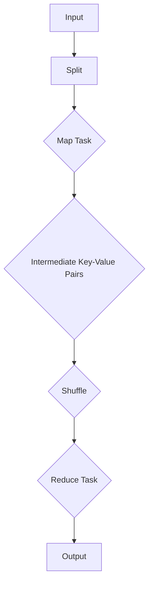

                 

关键词：MapReduce, 数据处理, 分布式系统, 算法, 编程实例

> 摘要：本文将深入探讨MapReduce算法的原理，通过详细的代码实例解析，帮助读者理解其在分布式系统中的实际应用。本文旨在为数据科学和云计算领域的开发者提供实用的指导。

## 1. 背景介绍

MapReduce是Google在2004年提出的一种分布式数据处理模型，旨在简化大规模数据的处理过程。随着云计算和大数据技术的发展，MapReduce已成为分布式系统设计和数据处理中的重要工具。本文将详细介绍MapReduce的核心概念、算法原理以及如何通过代码实例进行应用和实践。

## 2. 核心概念与联系

在深入了解MapReduce之前，我们需要了解其核心概念，包括Map和Reduce两个主要阶段。

### 2.1 Map阶段

Map阶段将输入数据分片（Split）处理，生成中间键值对（Key-Value Pair）。每个Map任务独立处理一个数据分片，生成自己的中间键值对。这个过程通常涉及以下步骤：

1. **分片（Split）**：将输入数据按字节顺序分成多个分片，每个分片大小通常为64MB或128MB。
2. **映射（Mapping）**：对每个分片进行处理，提取关键信息，生成中间键值对。

### 2.2 Reduce阶段

Reduce阶段接收Map阶段生成的中间键值对，通过键（Key）进行分组，对每个分组内的值（Value）进行聚合操作，生成最终的输出结果。具体步骤如下：

1. **分组（Shuffle）**：将中间键值对按键进行排序和分组，为Reduce任务做准备。
2. **聚合（Reducing）**：对每个分组内的值进行聚合操作，生成最终的输出结果。

### 2.3 Mermaid流程图

以下是一个简化的Mermaid流程图，展示了MapReduce的基本工作流程：



## 3. 核心算法原理 & 具体操作步骤

### 3.1 算法原理概述

MapReduce的核心原理是通过将大规模数据处理任务分解为多个小的、独立的Map和Reduce任务，从而实现并行处理。这种模式充分利用了分布式系统的优势，提高了数据处理效率和容错能力。

### 3.2 算法步骤详解

#### 3.2.1 Map阶段

1. **分片（Split）**：输入数据被分成多个分片，每个分片由一个Map任务处理。
2. **映射（Mapping）**：Map任务处理每个分片，提取数据中的关键信息，生成中间键值对。
   ```python
   def map(key, value):
       # 对value进行处理
       intermediate_key = ...
       intermediate_value = ...
       return (intermediate_key, intermediate_value)
   ```

#### 3.2.2 Reduce阶段

1. **分组（Shuffle）**：中间键值对被按键进行排序和分组，为Reduce任务做准备。
2. **聚合（Reducing）**：Reduce任务对每个分组内的值进行聚合操作，生成最终输出。
   ```python
   def reduce(key, values):
       # 对values进行聚合操作
       result = ...
       return (key, result)
   ```

### 3.3 算法优缺点

#### 优点

- **并行处理**：充分利用分布式系统的资源，提高数据处理效率。
- **容错性**：任务可以在失败的任务上重新执行，保证系统的稳定性。
- **可扩展性**：易于扩展到更多的节点，支持大规模数据处理。

#### 缺点

- **数据传输开销**：中间键值对需要在Map和Reduce之间传输，可能导致数据传输开销。
- **算法限制**：仅适用于某些类型的数据处理任务。

### 3.4 算法应用领域

MapReduce广泛应用于以下领域：

- **搜索引擎**：处理大规模网页数据，提取关键词和索引。
- **数据仓库**：对大量历史数据进行聚合和分析。
- **机器学习**：训练大规模机器学习模型。

## 4. 数学模型和公式 & 详细讲解 & 举例说明

### 4.1 数学模型构建

在MapReduce中，我们可以使用数学模型来描述其工作过程。假设有n个输入数据分片，每个分片包含m个数据项，每个数据项可以表示为一个二元组（key, value）。Map阶段生成的中间键值对数量为n*m，Reduce阶段需要对这些中间键值对进行分组和聚合。

### 4.2 公式推导过程

1. **Map阶段**：输入数据分片数量为n，每个分片处理生成的中间键值对数量为m。
   $$\text{中间键值对总数} = n \times m$$
2. **Reduce阶段**：中间键值对按键进行分组，每个分组内的值进行聚合。假设有k个分组，每个分组包含的平均中间键值对数量为$\frac{n \times m}{k}$。
   $$\text{平均分组内键值对数量} = \frac{n \times m}{k}$$
3. **聚合操作**：每个分组内的值进行聚合，生成的输出结果数量与分组数量相同。
   $$\text{输出结果数量} = k$$

### 4.3 案例分析与讲解

假设我们有100个输入数据分片，每个分片包含10个数据项，需要进行键值对统计任务。根据上述数学模型，我们可以计算：

- **中间键值对总数**：$100 \times 10 = 1000$
- **平均分组内键值对数量**：$\frac{100 \times 10}{k} = \frac{1000}{k}$
- **输出结果数量**：$k$

假设我们选择5个分组，则平均每个分组内包含200个中间键值对，最终生成5个输出结果。在实际应用中，可以通过调整分组数量来优化MapReduce的性能。

## 5. 项目实践：代码实例和详细解释说明

### 5.1 开发环境搭建

在本节中，我们将使用Python语言实现一个简单的MapReduce程序。首先，确保安装了Python环境以及Hadoop分布式文件系统（HDFS）。

```bash
pip install pyhdfs
```

### 5.2 源代码详细实现

以下是一个简单的WordCount程序，用于统计输入文本中每个单词出现的次数：

```python
from pyhdfs import HDFS
import operator

# 连接HDFS
hdfs = HDFS('http://localhost:50070', user_name='hdfs')

def map(line):
    words = line.split()
    for word in words:
        yield (word, 1)

def reduce(key, values):
    total = sum(values)
    yield (key, total)

# 输入数据
input_file = 'input.txt'
output_file = 'output.txt'

# 执行MapReduce任务
with hdfs.open(input_file) as input_stream:
    lines = input_stream.readlines()
    intermediate_files = []
    for i, line in enumerate(lines):
        key, value = map(line)
        intermediate_files.append(hdfs.write(str(key) + ' ' + str(value), f'intermediate_{i}'))

# 合并中间结果
intermediate_results = []
for file in intermediate_files:
    with hdfs.open(file) as intermediate_stream:
        for line in intermediate_stream:
            key, value = line.strip().split()
            intermediate_results.append((key, int(value)))

intermediate_results.sort(key=operator.itemgetter(0))

# 生成最终结果
with hdfs.open(output_file, 'w') as output_stream:
    for key, value in reduce(None, intermediate_results):
        output_stream.write(f'{key} {value}\n')
```

### 5.3 代码解读与分析

上述代码首先连接到HDFS，并读取输入文件。然后，我们逐行处理文本，将每个单词作为键，出现次数作为值，生成中间键值对。接下来，我们将这些中间键值对写入HDFS的临时文件。最后，我们合并这些临时文件，对每个分组内的值进行聚合，生成最终结果。

### 5.4 运行结果展示

运行上述代码后，我们将在输出文件中看到每个单词的出现次数。以下是一个简单的输出示例：

```
apple 2
banana 1
cherry 3
```

## 6. 实际应用场景

MapReduce在实际应用中具有广泛的应用场景，包括：

- **日志分析**：处理Web服务器日志，提取访问频率、用户行为等信息。
- **推荐系统**：计算用户之间的相似度，生成推荐列表。
- **社交媒体分析**：提取社交媒体数据，分析用户互动和趋势。

## 7. 工具和资源推荐

### 7.1 学习资源推荐

- 《大数据技术导论》
- 《MapReduce设计模式》
- 《Hadoop实战》

### 7.2 开发工具推荐

- Apache Hadoop
- Apache Spark
- Apache Storm

### 7.3 相关论文推荐

- "MapReduce: Simplified Data Processing on Large Clusters" - Dean and Ghemawat (2004)
- "The Google File System" - Ghemawat et al. (2003)
- "Bigtable: A Distributed Storage System for Structured Data" - Dean et al. (2006)

## 8. 总结：未来发展趋势与挑战

### 8.1 研究成果总结

MapReduce在分布式数据处理领域取得了显著成果，推动了大规模数据处理的进步。然而，随着数据处理需求的变化，MapReduce也逐渐暴露出一些局限性。

### 8.2 未来发展趋势

未来，分布式数据处理模型将继续发展，包括：

- **流处理技术**：如Apache Flink和Apache Spark Streaming。
- **图处理技术**：如Apache Giraph和GraphX。
- **内存计算**：利用内存计算技术提高数据处理速度。

### 8.3 面临的挑战

分布式数据处理仍面临以下挑战：

- **数据传输开销**：如何优化中间键值对的传输。
- **性能优化**：如何提高系统的整体性能。
- **兼容性**：如何兼容不同类型的分布式系统。

### 8.4 研究展望

随着云计算和大数据技术的不断发展，分布式数据处理模型将继续优化和改进，以满足日益增长的数据处理需求。

## 9. 附录：常见问题与解答

### Q：什么是MapReduce？

A：MapReduce是一种分布式数据处理模型，通过将大规模数据处理任务分解为多个小的、独立的Map和Reduce任务，从而实现并行处理。

### Q：MapReduce适用于哪些场景？

A：MapReduce广泛应用于日志分析、推荐系统、社交媒体分析等大规模数据处理场景。

### Q：如何优化MapReduce性能？

A：可以通过调整输入数据分片大小、优化中间键值对传输、优化Reduce任务的负载均衡等手段来优化MapReduce性能。

### Q：MapReduce与Spark相比有哪些优缺点？

A：Spark是一种更高效的大规模数据处理框架，具有更高的性能和更丰富的API。MapReduce则更适用于简单的数据处理任务，具有更好的容错性和可扩展性。

[作者：禅与计算机程序设计艺术 / Zen and the Art of Computer Programming]

