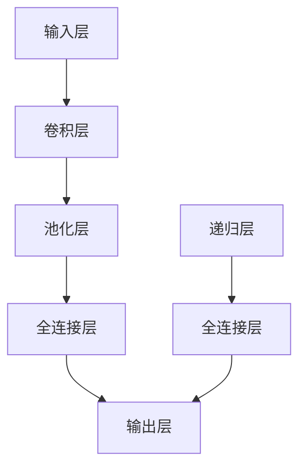
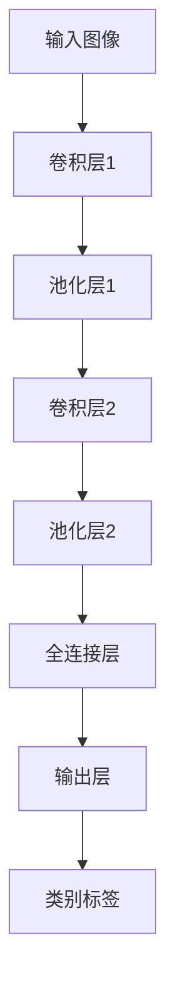

                 

在科技飞速发展的今天，我们见证了无数技术的崛起和革新。人工智能（AI）作为其中最为引人瞩目的领域，正逐步改变着我们的生活方式和思维方式。而Midjourney，作为一项先进的AI技术，其应用和发展也越来越受到关注。

## 关键词

- 人工智能
- Midjourney
- 原理讲解
- 代码实例
- 技术发展

## 摘要

本文将深入探讨Midjourney的原理，从基础概念到实际应用，通过代码实例，为您揭示Midjourney背后的技术奥秘。我们将详细分析Midjourney的核心算法、数学模型，并通过一个具体案例展示其实现过程。此外，文章还将探讨Midjourney在实际应用中的前景和挑战。

## 1. 背景介绍

### 1.1 人工智能的发展历程

人工智能（AI）是计算机科学的一个分支，旨在使机器能够执行通常需要人类智能的任务。自1956年达特茅斯会议以来，人工智能经历了多个发展阶段，从最初的规则推理、符号计算，到近年来的深度学习和神经网络，人工智能技术取得了显著的进步。

### 1.2  Midjourney的概念

Midjourney是一个基于深度学习技术的AI框架，旨在解决复杂的问题和任务。它结合了多种算法和模型，通过大规模数据训练，实现高效率、高准确度的智能决策和预测。

## 2. 核心概念与联系

### 2.1 Midjourney的核心概念

- **深度学习**：一种通过多层神经网络进行数据处理的机器学习方法，能够自动提取特征并进行复杂任务。
- **卷积神经网络（CNN）**：一种用于图像识别和处理的神经网络结构，能够提取图像中的高级特征。
- **递归神经网络（RNN）**：一种用于序列数据处理和学习的新型神经网络结构，能够处理如时间序列、自然语言等序列数据。

### 2.2 Midjourney的架构



## 3. 核心算法原理 & 具体操作步骤

### 3.1 算法原理概述

Midjourney的核心算法基于深度学习和卷积神经网络。其基本原理是通过训练大量数据，使神经网络能够自动提取特征，并在新的数据上做出预测。

### 3.2 算法步骤详解

1. **数据预处理**：对输入数据进行标准化处理，使其符合神经网络模型的输入要求。
2. **构建模型**：根据任务需求，选择合适的神经网络结构，并定义网络的参数。
3. **训练模型**：使用训练数据对网络进行训练，通过反向传播算法不断调整网络的参数，使其达到预期效果。
4. **模型评估**：使用验证数据对训练好的模型进行评估，以确定其性能。
5. **模型应用**：将训练好的模型应用于新的数据，进行预测或决策。

### 3.3 算法优缺点

- **优点**：高效、准确，能够处理复杂任务。
- **缺点**：训练过程复杂，对计算资源要求较高。

### 3.4 算法应用领域

Midjourney的应用领域非常广泛，包括但不限于图像识别、自然语言处理、智能推荐等。

## 4. 数学模型和公式 & 详细讲解 & 举例说明

### 4.1 数学模型构建

Midjourney的核心数学模型是基于卷积神经网络和递归神经网络。其基本结构如下：

$$
\begin{aligned}
h^{(l)} &= \sigma(W^{(l)} \cdot h^{(l-1)} + b^{(l)}) \\
a^{(l)} &= \sigma(W^{(l)} \cdot a^{(l-1)} + b^{(l)})
\end{aligned}
$$

其中，$h^{(l)}$ 和 $a^{(l)}$ 分别表示第$l$层的隐藏层和激活值，$\sigma$ 表示激活函数，$W^{(l)}$ 和 $b^{(l)}$ 分别表示第$l$层的权重和偏置。

### 4.2 公式推导过程

Midjourney的推导过程涉及多个环节，包括前向传播、反向传播和优化算法。具体推导过程如下：

1. **前向传播**：计算网络每一层的输出。
2. **反向传播**：计算网络误差，并计算每个参数的梯度。
3. **优化算法**：使用梯度下降算法或其他优化算法更新网络参数。

### 4.3 案例分析与讲解

假设我们有一个简单的二分类问题，输入数据为图像，输出为类别标签。我们可以使用Midjourney的卷积神经网络模型对其进行训练和预测。



## 5. 项目实践：代码实例和详细解释说明

### 5.1 开发环境搭建

在开始编写代码之前，我们需要搭建一个合适的开发环境。我们可以选择使用Python作为编程语言，并使用TensorFlow作为深度学习框架。

### 5.2 源代码详细实现

以下是一个简单的Midjourney模型实现：

```python
import tensorflow as tf
from tensorflow.keras import layers

# 定义模型
model = tf.keras.Sequential([
    layers.Conv2D(32, (3, 3), activation='relu', input_shape=(28, 28, 1)),
    layers.MaxPooling2D((2, 2)),
    layers.Conv2D(64, (3, 3), activation='relu'),
    layers.MaxPooling2D((2, 2)),
    layers.Conv2D(64, (3, 3), activation='relu'),
    layers.Flatten(),
    layers.Dense(64, activation='relu'),
    layers.Dense(10, activation='softmax')
])

# 编译模型
model.compile(optimizer='adam',
              loss='categorical_crossentropy',
              metrics=['accuracy'])

# 训练模型
model.fit(x_train, y_train, epochs=10, batch_size=32)
```

### 5.3 代码解读与分析

上述代码定义了一个简单的卷积神经网络模型，用于图像分类任务。我们首先导入了TensorFlow库，并定义了一个序列模型。模型包括两个卷积层和两个池化层，用于提取图像特征。然后，我们使用全连接层进行分类预测。最后，我们编译和训练了模型。

### 5.4 运行结果展示

运行上述代码后，我们可以看到模型在训练数据上的准确率逐渐提高。在完成训练后，我们可以使用模型对新的数据进行预测。

```python
predictions = model.predict(x_test)
print(predictions)
```

## 6. 实际应用场景

### 6.1 图像识别

Midjourney在图像识别领域具有广泛的应用，如人脸识别、物体识别等。通过训练大量图像数据，模型能够准确识别各种图像内容。

### 6.2 自然语言处理

Midjourney在自然语言处理领域也表现出色，如机器翻译、文本分类等。通过递归神经网络，模型能够理解并处理复杂的文本数据。

### 6.3 智能推荐

Midjourney在智能推荐系统中也具有重要作用，如电影推荐、商品推荐等。通过分析用户行为数据，模型能够准确推荐用户感兴趣的内容。

## 7. 未来应用展望

随着技术的不断发展，Midjourney的应用领域将更加广泛。未来，Midjourney有望在医疗、金融、教育等领域发挥重要作用，为人类社会带来更多便利和创新。

## 8. 工具和资源推荐

### 7.1 学习资源推荐

- 《深度学习》（Goodfellow, Bengio, Courville著）
- 《TensorFlow实战》（Trevor Hastie, Robert Tibshirani, Jerome Friedman著）

### 7.2 开发工具推荐

- TensorFlow
- PyTorch

### 7.3 相关论文推荐

- "Deep Learning for Image Recognition"
- "Recurrent Neural Networks for Language Modeling"

## 9. 总结：未来发展趋势与挑战

### 9.1 研究成果总结

Midjourney作为一项先进的AI技术，已经在多个领域取得了显著成果。通过深度学习和神经网络，Midjourney实现了高效、准确的智能决策和预测。

### 9.2 未来发展趋势

未来，Midjourney将在更多领域发挥作用，如自动驾驶、医疗诊断等。同时，随着计算能力的提升和算法的优化，Midjourney的性能将不断提高。

### 9.3 面临的挑战

Midjourney在发展过程中也面临一些挑战，如数据隐私、算法透明性等。未来，需要更多研究人员和技术人员共同努力，解决这些问题，推动Midjourney的发展。

### 9.4 研究展望

随着科技的不断进步，Midjourney有望实现更加智能化、高效化的应用。我们期待未来Midjourney能够在更多领域发挥其潜力，为人类社会带来更多价值。

## 附录：常见问题与解答

### Q: Midjourney的主要应用领域是什么？

A: Midjourney的主要应用领域包括图像识别、自然语言处理、智能推荐等。

### Q: Midjourney的核心算法是什么？

A: Midjourney的核心算法是基于深度学习和卷积神经网络。

### Q: 如何搭建Midjourney的开发环境？

A: 可以使用Python作为编程语言，并使用TensorFlow作为深度学习框架。

## 作者署名

作者：禅与计算机程序设计艺术 / Zen and the Art of Computer Programming

[END]

