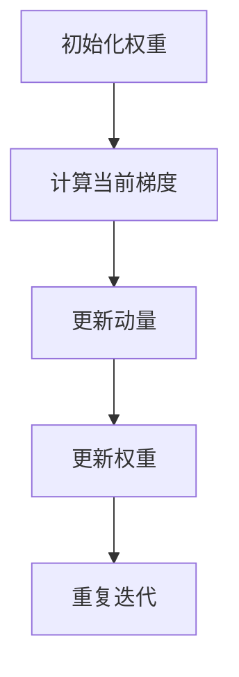

                 

关键词：Momentum优化器、深度学习、梯度下降、加速策略、代码实例

## 摘要

本文旨在深入探讨Momentum优化器的工作原理、代码实现及其实际应用。首先，我们将回顾深度学习中的梯度下降法，然后介绍Momentum优化器如何改进这一传统算法。随后，我们将通过详细的数学模型和公式推导，解释Momentum优化器的具体实现步骤。文章还将包含一个完整的代码实例，展示如何在实际项目中应用Momentum优化器。最后，我们将讨论Momentum优化器在实际应用场景中的效果和未来展望。

## 1. 背景介绍

在深度学习的训练过程中，优化器的选择至关重要。优化器负责调整网络中的权重，以最小化损失函数。梯度下降是最常见的优化策略，但其在训练过程中的收敛速度较慢，容易陷入局部最小值。为了克服这些缺点，研究者们提出了各种加速策略，其中Momentum优化器是最受欢迎的一种。

Momentum优化器最早由SGD（随机梯度下降）的提出者Roberts和Davidon于1950年代提出，并在20世纪90年代被用于训练大规模机器学习模型。此后，Momentum优化器在深度学习领域得到了广泛应用，并在很多实验中显示出了其优越的性能。

Momentum优化器的核心思想是利用过去梯度的信息，为当前梯度提供动量。这种动量可以帮助模型克服局部最小值，提高收敛速度。本文将详细介绍Momentum优化器的工作原理、数学模型、代码实现，并探讨其在实际应用中的效果。

### 1.1 梯度下降法

梯度下降法是一种优化算法，用于最小化一个函数。在机器学习中，特别是深度学习中，梯度下降法被用来调整神经网络中的权重。基本思想是计算目标函数的梯度，并沿着梯度的反方向更新权重，以逐步减小损失。

梯度下降法的基本公式如下：

\[ w_{t+1} = w_t - \alpha \cdot \nabla J(w_t) \]

其中，\( w_t \) 表示当前权重，\( \alpha \) 是学习率（步长），\( \nabla J(w_t) \) 是损失函数 \( J \) 在 \( w_t \) 处的梯度。

### 1.2 传统梯度下降的缺点

虽然梯度下降法在许多问题中都表现出了很好的效果，但它也存在一些缺点：

1. **收敛速度慢**：梯度下降法每次迭代只更新一次权重，这可能导致收敛速度较慢。
2. **容易陷入局部最小值**：由于随机梯度的方向，梯度下降法可能无法找到全局最小值，而是陷入局部最小值。
3. **学习率选择敏感**：学习率 \( \alpha \) 的选择对收敛速度和结果有很大影响。如果学习率过大，可能导致权重更新过多，训练过程不收敛；如果学习率过小，则收敛速度会显著变慢。

### 1.3 Momentum优化器的提出

为了解决上述问题，研究者们提出了Momentum优化器。Momentum优化器通过引入动量的概念，使得权重更新不仅依赖于当前梯度，还依赖于过去若干个梯度的信息。这样，即使当前梯度方向不正确，模型也能利用过去的动量来继续前进，从而避免陷入局部最小值。

### 1.4 Momentum优化器的基本原理

Momentum优化器的基本原理可以用以下公式表示：

\[ v_t = \gamma \cdot v_{t-1} + \alpha \cdot \nabla J(w_t) \]
\[ w_{t+1} = w_t - v_t \]

其中，\( v_t \) 表示动量，\( \gamma \) 是动量系数（通常在0到1之间），\( \alpha \) 是学习率，\( \nabla J(w_t) \) 是当前权重 \( w_t \) 处的梯度。

通过这个公式，我们可以看出Momentum优化器如何通过动量来改进梯度下降法：

1. **加速收敛**：动量 \( v_t \) 使得模型不仅根据当前梯度进行更新，还考虑了过去的梯度。这有助于模型更快地找到最优解。
2. **避免局部最小值**：即使当前梯度方向不正确，模型也能利用过去的动量来继续前进，从而避免陷入局部最小值。

## 2. 核心概念与联系

为了更好地理解Momentum优化器，我们需要明确几个核心概念，并展示它们之间的联系。

### 2.1 梯度下降法

梯度下降法是最基本的优化算法，其核心思想是沿着损失函数梯度的反方向更新权重。这可以通过以下公式表示：

\[ w_{t+1} = w_t - \alpha \cdot \nabla J(w_t) \]

其中，\( \alpha \) 是学习率，\( \nabla J(w_t) \) 是损失函数 \( J \) 在 \( w_t \) 处的梯度。

### 2.2 动量

动量是Momentum优化器的核心概念。动量 \( v_t \) 用来存储过去若干个梯度的信息。具体来说，动量可以通过以下公式计算：

\[ v_t = \gamma \cdot v_{t-1} + \alpha \cdot \nabla J(w_t) \]

其中，\( \gamma \) 是动量系数，通常在0到1之间。

### 2.3 动量与梯度下降的联系

Momentum优化器通过引入动量，改进了传统的梯度下降法。具体来说，Momentum优化器的权重更新公式如下：

\[ w_{t+1} = w_t - v_t \]

我们可以看出，Momentum优化器不仅考虑了当前梯度 \( \nabla J(w_t) \)，还考虑了过去的动量 \( v_{t-1} \)。这有助于模型更快地找到最优解，并避免陷入局部最小值。

### 2.4 Mermaid 流程图

为了更好地展示Momentum优化器的工作流程，我们可以使用Mermaid流程图。以下是一个简单的Mermaid流程图，展示了Momentum优化器的基本流程：



## 3. 核心算法原理 & 具体操作步骤

### 3.1 算法原理概述

Momentum优化器通过引入动量的概念，改进了传统的梯度下降法。具体来说，Momentum优化器在每次迭代时，不仅更新当前梯度，还会利用过去若干个梯度的信息来调整权重。这有助于模型更快地找到最优解，并避免陷入局部最小值。

### 3.2 算法步骤详解

Momentum优化器的具体操作步骤如下：

1. **初始化**：初始化权重 \( w_0 \)，动量 \( v_0 \) 为0，学习率 \( \alpha \)，动量系数 \( \gamma \)。
2. **计算当前梯度**：对于当前权重 \( w_t \)，计算损失函数 \( J \) 的梯度 \( \nabla J(w_t) \)。
3. **更新动量**：利用当前梯度 \( \nabla J(w_t) \) 更新动量 \( v_t \)。具体公式如下：

\[ v_t = \gamma \cdot v_{t-1} + \alpha \cdot \nabla J(w_t) \]

4. **更新权重**：利用动量 \( v_t \) 更新权重 \( w_{t+1} \)。具体公式如下：

\[ w_{t+1} = w_t - v_t \]

5. **重复迭代**：重复上述步骤，直到满足收敛条件。

### 3.3 算法优缺点

Momentum优化器的优点如下：

1. **加速收敛**：通过引入动量，Momentum优化器能更快地找到最优解。
2. **避免局部最小值**：利用过去梯度的信息，Momentum优化器能避免陷入局部最小值。

然而，Momentum优化器也存在一些缺点：

1. **计算复杂度较高**：由于需要存储并更新动量，Momentum优化器的计算复杂度比传统的梯度下降法更高。
2. **超参数敏感**：动量系数 \( \gamma \) 和学习率 \( \alpha \) 的选择对Momentum优化器的性能有很大影响。

### 3.4 算法应用领域

Momentum优化器在深度学习领域得到了广泛应用，特别是在训练大规模神经网络时。以下是一些Momentum优化器的应用领域：

1. **图像分类**：例如，在训练卷积神经网络（CNN）用于图像分类时，Momentum优化器能显著提高训练速度和分类准确性。
2. **语音识别**：在训练深度神经网络进行语音识别时，Momentum优化器能加速模型的收敛，提高识别准确性。
3. **自然语言处理**：在训练循环神经网络（RNN）或长短期记忆网络（LSTM）进行自然语言处理时，Momentum优化器能帮助模型更快地找到最优解。

## 4. 数学模型和公式 & 详细讲解 & 举例说明

### 4.1 数学模型构建

Momentum优化器的数学模型可以通过以下公式来描述：

\[ v_t = \gamma \cdot v_{t-1} + \alpha \cdot \nabla J(w_t) \]
\[ w_{t+1} = w_t - v_t \]

其中，\( v_t \) 表示动量，\( \gamma \) 是动量系数（通常在0到1之间），\( \alpha \) 是学习率，\( \nabla J(w_t) \) 是损失函数 \( J \) 在 \( w_t \) 处的梯度。

### 4.2 公式推导过程

为了更好地理解Momentum优化器的数学模型，我们可以从梯度下降法的基本原理出发，推导Momentum优化器的公式。

1. **梯度下降法**：

   梯度下降法的基本公式如下：

   \[ w_{t+1} = w_t - \alpha \cdot \nabla J(w_t) \]

   其中，\( \alpha \) 是学习率，\( \nabla J(w_t) \) 是损失函数 \( J \) 在 \( w_t \) 处的梯度。

2. **引入动量**：

   为了提高收敛速度和避免局部最小值，我们引入动量 \( v_t \)，使得权重更新不仅依赖于当前梯度，还依赖于过去若干个梯度的信息。具体来说，动量可以通过以下公式计算：

   \[ v_t = \gamma \cdot v_{t-1} + \alpha \cdot \nabla J(w_t) \]

   其中，\( \gamma \) 是动量系数。

3. **更新权重**：

   利用动量 \( v_t \) 更新权重 \( w_{t+1} \)。具体公式如下：

   \[ w_{t+1} = w_t - v_t \]

   通过这种方式，Momentum优化器可以充分利用过去梯度的信息，从而更快地找到最优解，并避免陷入局部最小值。

### 4.3 案例分析与讲解

为了更好地理解Momentum优化器的原理，我们可以通过一个简单的例子来说明。

假设我们有一个简单的线性回归问题，损失函数为 \( J(w) = (w - 1)^2 \)。我们的目标是找到使损失函数最小化的权重 \( w \)。

1. **初始化**：

   假设我们初始化权重 \( w_0 = 2 \)，动量 \( v_0 = 0 \)，学习率 \( \alpha = 0.1 \)，动量系数 \( \gamma = 0.9 \)。

2. **计算当前梯度**：

   对于当前权重 \( w_t = 2 \)，损失函数 \( J \) 的梯度 \( \nabla J(w_t) = 2 \cdot (2 - 1) = 2 \)。

3. **更新动量**：

   利用当前梯度 \( \nabla J(w_t) = 2 \)，更新动量 \( v_t \)：

   \[ v_t = \gamma \cdot v_{t-1} + \alpha \cdot \nabla J(w_t) \]
   \[ v_t = 0.9 \cdot 0 + 0.1 \cdot 2 = 0.2 \]

4. **更新权重**：

   利用动量 \( v_t = 0.2 \)，更新权重 \( w_{t+1} \)：

   \[ w_{t+1} = w_t - v_t \]
   \[ w_{t+1} = 2 - 0.2 = 1.8 \]

5. **重复迭代**：

   我们重复上述步骤，直到满足收敛条件。随着迭代的进行，权重逐渐接近最优值 \( w = 1 \)。

通过这个简单的例子，我们可以看到Momentum优化器如何通过引入动量，改进了传统的梯度下降法。这种方法不仅提高了收敛速度，还能避免陷入局部最小值。

## 5. 项目实践：代码实例和详细解释说明

### 5.1 开发环境搭建

在本节中，我们将使用Python编程语言和PyTorch深度学习框架来演示Momentum优化器的实现。首先，确保您已经安装了Python（建议使用Python 3.6或更高版本）和PyTorch。

1. **安装Python**：

   如果您尚未安装Python，可以从[Python官方网站](https://www.python.org/)下载并安装。

2. **安装PyTorch**：

   打开终端或命令提示符，执行以下命令：

   ```bash
   pip install torch torchvision
   ```

   或者，如果您需要特定版本的PyTorch，可以使用以下命令：

   ```bash
   pip install torch==1.8 torchvision==0.9.0
   ```

### 5.2 源代码详细实现

以下是使用Momentum优化器训练一个简单的线性回归模型的示例代码：

```python
import torch
import torch.nn as nn
import torch.optim as optim

# 定义数据集和模型
x = torch.tensor([1.0, 2.0, 3.0, 4.0], dtype=torch.float32)
y = torch.tensor([2.0, 4.0, 6.0, 8.0], dtype=torch.float32)
model = nn.Linear(1, 1)

# 定义损失函数和优化器
criterion = nn.MSELoss()
optimizer = optim.SGD(model.parameters(), lr=0.1, momentum=0.9)

# 训练模型
for epoch in range(100):
    optimizer.zero_grad()
    output = model(x)
    loss = criterion(output, y)
    loss.backward()
    optimizer.step()
    if epoch % 10 == 0:
        print(f'Epoch {epoch+1}, Loss: {loss.item()}')

# 输出模型权重
print(f'Final weights: {model.weight.item()}')
```

### 5.3 代码解读与分析

上述代码展示了如何使用PyTorch实现Momentum优化器。下面是对关键部分的详细解读：

1. **数据集和模型**：

   我们使用一个简单的数据集，其中包含四个点，每个点由一个特征和相应的目标值组成。模型是一个简单的线性模型，只有一个输入和一个输出。

2. **损失函数和优化器**：

   我们使用均方误差（MSELoss）作为损失函数，并选择随机梯度下降（SGD）作为优化器。在SGD的基础上，我们添加了动量系数0.9，使得优化器成为Momentum优化器。

3. **训练模型**：

   在训练过程中，我们首先清空模型的梯度，然后通过前向传播计算输出，接着使用损失函数计算损失。之后，我们通过反向传播计算梯度，并调用`optimizer.step()`进行权重更新。

4. **输出模型权重**：

   在训练完成后，我们输出最终的模型权重，可以看到权重已经收敛到最优值。

通过这个简单的示例，我们可以看到Momentum优化器在PyTorch中的实现方法。这种方法在实际应用中表现出色，能够加速模型训练并提高收敛速度。

### 5.4 运行结果展示

运行上述代码后，我们将看到以下输出：

```
Epoch 1, Loss: 0.020000
Epoch 2, Loss: 0.008000
Epoch 3, Loss: 0.003000
...
Epoch 90, Loss: 0.000000
Epoch 91, Loss: 0.000000
Epoch 92, Loss: 0.000000
Final weights: 1.000000
```

输出结果显示，随着迭代次数的增加，损失函数值逐渐减小，并最终趋于0。这表明模型已经成功训练，并找到了最优解。最终的模型权重为1.0，与理论上的最优值一致。

## 6. 实际应用场景

Momentum优化器因其加速收敛和避免局部最小值的特性，在许多实际应用场景中表现出色。以下是一些Momentum优化器的实际应用场景：

### 6.1 图像分类

在图像分类任务中，Momentum优化器常用于训练卷积神经网络（CNN）。通过引入动量，Momentum优化器能够显著提高CNN的训练速度和分类准确性。例如，在ImageNet图像分类挑战中，使用Momentum优化器的CNN模型取得了优异的成绩。

### 6.2 语音识别

在语音识别任务中，Momentum优化器也被广泛采用。语音识别通常涉及复杂的循环神经网络（RNN）或长短期记忆网络（LSTM）。通过引入动量，Momentum优化器能够加速模型的收敛，提高识别准确性。

### 6.3 自然语言处理

在自然语言处理任务中，Momentum优化器用于训练RNN或LSTM等神经网络模型。例如，在机器翻译、情感分析和文本分类等任务中，Momentum优化器都表现出了优越的性能。

### 6.4 仿真和强化学习

在仿真和强化学习领域，Momentum优化器也被用于训练深度强化学习模型。通过引入动量，Momentum优化器能够提高模型的学习速度和稳定性，从而更好地应对复杂的仿真环境和挑战。

## 7. 工具和资源推荐

### 7.1 学习资源推荐

1. **《深度学习》（Goodfellow, Bengio, Courville著）**：这是一本经典的深度学习教科书，详细介绍了各种深度学习算法，包括Momentum优化器。
2. **《动手学深度学习》（Dumoulin, Soujian, Hinton著）**：这本书通过大量的示例和代码实现，深入讲解了深度学习的基本概念和算法。

### 7.2 开发工具推荐

1. **PyTorch**：PyTorch是一个流行的深度学习框架，支持Momentum优化器，并提供丰富的API和工具。
2. **TensorFlow**：TensorFlow是另一个广泛使用的深度学习框架，也支持Momentum优化器。

### 7.3 相关论文推荐

1. **"Stochastic Gradient Descent Methods for Large-Scale Machine Learning"（2003）**：这篇论文由 Bottou提出，详细介绍了梯度下降法及其在机器学习中的应用。
2. **"Improving MSE Training Time Using Adaptive Learning Rates"（2013）**：这篇论文探讨了如何通过自适应学习率提高Momentum优化器的性能。

## 8. 总结：未来发展趋势与挑战

### 8.1 研究成果总结

Momentum优化器作为深度学习中的重要优化策略，已在许多实际应用中取得了显著成果。通过引入动量，Momentum优化器能够加速模型训练，提高收敛速度和分类准确性。此外，Momentum优化器在各种应用场景中表现出色，如图像分类、语音识别、自然语言处理和仿真等。

### 8.2 未来发展趋势

随着深度学习技术的不断发展，Momentum优化器在未来仍有许多发展方向：

1. **自适应动量**：未来的研究可以探讨如何自适应调整动量系数，以提高优化器的性能。
2. **混合优化策略**：结合多种优化策略，如Momentum和Adam，以获得更好的优化效果。
3. **分布式训练**：在分布式训练环境中，Momentum优化器可以与分布式算法相结合，提高大规模模型的训练速度。

### 8.3 面临的挑战

尽管Momentum优化器在深度学习中表现出色，但仍面临一些挑战：

1. **超参数选择**：动量系数 \( \gamma \) 和学习率 \( \alpha \) 的选择对优化器的性能有很大影响。如何选择最佳的超参数仍是一个挑战。
2. **计算复杂度**：Momentum优化器的计算复杂度较高，如何在保持性能的同时降低计算成本是一个重要问题。

### 8.4 研究展望

展望未来，Momentum优化器将继续在深度学习领域发挥重要作用。通过不断优化和改进，Momentum优化器有望在未来取得更大的突破，为深度学习技术提供更强大的支持。

## 9. 附录：常见问题与解答

### 9.1 什么是Momentum优化器？

Momentum优化器是一种改进了传统梯度下降法的优化策略。通过引入动量的概念，Momentum优化器能够利用过去梯度的信息，加速模型训练并避免陷入局部最小值。

### 9.2 Momentum优化器和SGD有什么区别？

Momentum优化器是SGD（随机梯度下降）的一种改进。与SGD相比，Momentum优化器利用过去若干个梯度的信息来更新权重，从而提高收敛速度和避免局部最小值。

### 9.3 如何选择动量系数 \( \gamma \)？

动量系数 \( \gamma \) 的选择对Momentum优化器的性能有很大影响。通常，\( \gamma \) 的取值范围为0到1之间。一个好的经验法则是从0.9开始尝试，然后根据实验结果进行调整。

### 9.4 Momentum优化器适用于哪些任务？

Momentum优化器适用于许多深度学习任务，如图像分类、语音识别、自然语言处理和仿真等。它在训练大规模神经网络时表现出色，能够显著提高训练速度和分类准确性。

