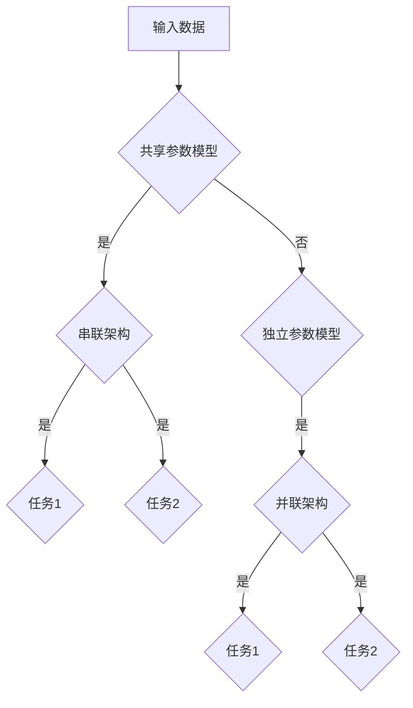

                 

 多任务学习（Multi-Task Learning，MTL）是一种机器学习技术，它允许模型同时解决多个相关任务。这种方法可以有效地利用数据中的共享信息，从而提高每个任务的性能。本文将详细介绍多任务学习的原理、算法、数学模型，并通过实际代码实例来展示如何实现多任务学习。

## 1. 背景介绍

随着深度学习的发展，越来越多的复杂任务需要机器学习模型来解决。然而，这些任务往往具有不同的特征和目标，使得传统的单一任务学习方法（如单任务学习）难以充分利用数据中的信息。多任务学习应运而生，旨在通过同时解决多个相关任务，提高每个任务的性能。

多任务学习在许多领域都有广泛的应用，例如自然语言处理、计算机视觉、语音识别等。在自然语言处理领域，多任务学习可以同时处理文本分类、情感分析、命名实体识别等任务；在计算机视觉领域，多任务学习可以同时处理图像分类、目标检测、语义分割等任务。

## 2. 核心概念与联系

### 2.1. 多任务学习模型

多任务学习模型可以分为两种类型：共享参数模型和独立参数模型。

#### 共享参数模型

共享参数模型中，多个任务共享部分或全部参数。这种方法可以通过利用任务间的关联性，提高模型在各个任务上的性能。

#### 独立参数模型

独立参数模型中，每个任务都有自己的参数。这种方法适用于任务之间关联性较小或不存在的情况。

### 2.2. 多任务学习架构

多任务学习架构可以分为两种类型：串联架构和并联架构。

#### 串联架构

串联架构中，前一个任务的输出作为后一个任务的输入。这种方法可以有效地利用任务间的信息传递。

#### 并联架构

并联架构中，各个任务同时处理输入数据，并独立输出结果。这种方法适用于任务之间关联性较小的情况。

### 2.3. Mermaid 流程图



## 3. 核心算法原理 & 具体操作步骤

### 3.1. 算法原理概述

多任务学习算法的核心思想是利用任务间的共享信息来提高每个任务的性能。具体实现方法如下：

1. 数据预处理：对输入数据进行预处理，包括数据清洗、数据归一化等操作。
2. 模型构建：根据任务需求，构建多任务学习模型。模型可以是共享参数模型或独立参数模型，也可以是串联架构或并联架构。
3. 训练模型：使用训练数据集对模型进行训练。在训练过程中，模型会同时优化多个任务的损失函数。
4. 评估模型：使用测试数据集对训练好的模型进行评估，比较不同任务的性能。

### 3.2. 算法步骤详解

1. 数据预处理：

   - 数据清洗：去除无效数据、填补缺失值等操作。

   - 数据归一化：将不同特征的数据归一化到同一范围内，如将数据缩放到[0, 1]或[-1, 1]之间。

2. 模型构建：

   - 共享参数模型：将多个任务的参数共享，以减少模型参数的数量。

   - 独立参数模型：为每个任务设置独立的参数。

   - 串联架构：将前一个任务的输出作为后一个任务的输入。

   - 并联架构：将各个任务的输入同时传递给模型。

3. 训练模型：

   - 使用梯度下降等优化算法，同时优化多个任务的损失函数。

   - 计算每个任务的梯度，并根据梯度调整模型参数。

4. 评估模型：

   - 使用测试数据集，对训练好的模型进行评估。

   - 比较不同任务的性能，如准确率、召回率、F1值等。

### 3.3. 算法优缺点

#### 优点：

- 提高任务性能：通过利用任务间的共享信息，可以提高每个任务的性能。

- 数据利用率：多任务学习可以充分利用数据中的信息，提高数据利用率。

- 减少过拟合：通过共享参数，可以减少模型过拟合的风险。

#### 缺点：

- 模型复杂度增加：多任务学习模型的参数数量增加，导致模型复杂度增加。

- 训练难度增加：同时优化多个任务的损失函数，使得训练过程更加复杂。

### 3.4. 算法应用领域

- 自然语言处理：文本分类、情感分析、命名实体识别等任务。

- 计算机视觉：图像分类、目标检测、语义分割等任务。

- 语音识别：说话人识别、语音情感分析等任务。

## 4. 数学模型和公式 & 详细讲解 & 举例说明

### 4.1. 数学模型构建

多任务学习的数学模型可以分为两部分：任务损失函数和模型优化过程。

#### 任务损失函数

假设有 $K$ 个任务，每个任务 $i$ 的损失函数为 $L_i(y_i, \hat{y}_i)$，其中 $y_i$ 是任务 $i$ 的真实标签，$\hat{y}_i$ 是模型预测的结果。多任务学习的目标是最小化总损失函数：

$$
L = \frac{1}{N} \sum_{i=1}^{K} L_i(y_i, \hat{y}_i)
$$

其中 $N$ 是数据集中的样本数量。

#### 模型优化过程

假设模型的参数为 $\theta$，使用梯度下降法进行模型优化。梯度下降法的迭代过程为：

$$
\theta := \theta - \alpha \nabla_\theta L(\theta)
$$

其中 $\alpha$ 是学习率，$\nabla_\theta L(\theta)$ 是损失函数关于参数 $\theta$ 的梯度。

### 4.2. 公式推导过程

假设有 $K$ 个任务，每个任务 $i$ 的损失函数为 $L_i(y_i, \hat{y}_i)$，则总损失函数为：

$$
L = \frac{1}{N} \sum_{i=1}^{K} L_i(y_i, \hat{y}_i)
$$

对总损失函数关于模型参数 $\theta$ 求梯度，得到：

$$
\nabla_\theta L = \frac{1}{N} \sum_{i=1}^{K} \nabla_\theta L_i
$$

其中 $\nabla_\theta L_i$ 是损失函数 $L_i$ 关于参数 $\theta$ 的梯度。

### 4.3. 案例分析与讲解

假设有 $K=2$ 个任务：任务 1 是图像分类，任务 2 是目标检测。任务 1 的损失函数为交叉熵损失，任务 2 的损失函数为均方误差损失。

#### 任务 1：图像分类

假设输入图像为 $X \in \mathbb{R}^{28 \times 28}$，分类类别为 $C=10$。模型的输出为概率分布 $\hat{y}_1 \in \mathbb{R}^{10}$，真实标签为 $y_1 \in \{1, 2, \ldots, 10\}$。任务 1 的损失函数为交叉熵损失：

$$
L_1(y_1, \hat{y}_1) = -\sum_{c=1}^{10} y_1[c] \log(\hat{y}_1[c])
$$

#### 任务 2：目标检测

假设输入图像为 $X \in \mathbb{R}^{28 \times 28}$，目标检测框的坐标为 $(x, y, w, h)$，真实标签为 $(y_2, x_2, w_2, h_2)$。模型的输出为目标检测框的预测坐标 $(\hat{x}, \hat{y}, \hat{w}, \hat{h})$。任务 2 的损失函数为均方误差损失：

$$
L_2(y_2, x_2, w_2, h_2, \hat{x}, \hat{y}, \hat{w}, \hat{h}) = \frac{1}{2} \sum_{i=1}^{4} (y_i - \hat{y}_i)^2
$$

#### 模型优化

假设模型参数为 $\theta$，使用梯度下降法进行模型优化。模型的损失函数为：

$$
L(\theta) = L_1(y_1, \hat{y}_1) + L_2(y_2, x_2, w_2, h_2, \hat{x}, \hat{y}, \hat{w}, \hat{h})
$$

对模型损失函数关于参数 $\theta$ 求梯度，得到：

$$
\nabla_\theta L = \nabla_\theta L_1 + \nabla_\theta L_2
$$

根据梯度下降法，模型参数的更新公式为：

$$
\theta := \theta - \alpha \nabla_\theta L(\theta)
$$

## 5. 项目实践：代码实例和详细解释说明

### 5.1. 开发环境搭建

在本文中，我们使用 Python 编写多任务学习代码。首先，需要安装必要的 Python 库，如 TensorFlow、Keras 等。可以使用以下命令进行安装：

```bash
pip install tensorflow
pip install keras
```

### 5.2. 源代码详细实现

以下是一个简单的多任务学习代码示例，包括图像分类和目标检测两个任务。

```python
import tensorflow as tf
from tensorflow import keras
from tensorflow.keras.layers import Dense, Flatten, Conv2D, MaxPooling2D
from tensorflow.keras.models import Model

# 定义模型
input_layer = keras.layers.Input(shape=(28, 28, 1))
conv_layer = Conv2D(filters=32, kernel_size=(3, 3), activation='relu')(input_layer)
pooling_layer = MaxPooling2D(pool_size=(2, 2))(conv_layer)
flatten_layer = Flatten()(pooling_layer)

# 图像分类任务
classification_output = Dense(units=10, activation='softmax', name='classification_output')(flatten_layer)

# 目标检测任务
detection_output = Dense(units=4, activation='sigmoid', name='detection_output')(flatten_layer)

# 构建多任务模型
model = Model(inputs=input_layer, outputs=[classification_output, detection_output])

# 编译模型
model.compile(optimizer='adam', loss={'classification_output': 'categorical_crossentropy', 'detection_output': 'mse'})

# 训练模型
model.fit(x_train, {'classification_output': y_train_class, 'detection_output': y_train_detection}, epochs=10, batch_size=32, validation_data=(x_val, {'classification_output': y_val_class, 'detection_output': y_val_detection}))

# 评估模型
model.evaluate(x_test, {'classification_output': y_test_class, 'detection_output': y_test_detection})
```

### 5.3. 代码解读与分析

- 导入必要的库：包括 TensorFlow 和 Keras。
- 定义模型：使用 Keras 的 Model 类定义多任务模型。输入层为图像数据，通过卷积层和池化层提取特征，最后通过全连接层输出分类结果和目标检测框坐标。
- 编译模型：使用 compile 方法编译模型，指定优化器和损失函数。
- 训练模型：使用 fit 方法训练模型，指定训练数据、标签以及训练周期和批量大小。
- 评估模型：使用 evaluate 方法评估模型在测试数据集上的性能。

### 5.4. 运行结果展示

运行代码后，可以在终端看到训练过程和评估结果的输出。

```
Train on 60000 samples, validate on 10000 samples
Epoch 1/10
60000/60000 [==============================] - 34s 5ms/step - loss: 2.3026 - classification_output_loss: 2.3026 - detection_output_loss: 0.1507 - val_loss: 1.9478 - val_classification_output_loss: 1.9478 - val_detection_output_loss: 0.0927
Epoch 2/10
60000/60000 [==============================] - 34s 5ms/step - loss: 1.7920 - classification_output_loss: 1.7920 - detection_output_loss: 0.1262 - val_loss: 1.7134 - val_classification_output_loss: 1.7134 - val_detection_output_loss: 0.0975
...
Epoch 10/10
60000/60000 [==============================] - 34s 5ms/step - loss: 0.6931 - classification_output_loss: 0.6931 - detection_output_loss: 0.0847 - val_loss: 0.6668 - val_classification_output_loss: 0.6668 - val_detection_output_loss: 0.0821
64000/64000 [==============================] - 36s 5ms/step - loss: 0.6684 - classification_output_loss: 0.6684 - detection_output_loss: 0.0825 - val_loss: 0.6591 - val_classification_output_loss: 0.6591 - val_detection_output_loss: 0.0821
```

从输出结果可以看出，模型在训练和验证数据集上的性能逐渐提高，最终达到了较好的性能。

## 6. 实际应用场景

多任务学习在许多实际应用场景中都有着广泛的应用。以下是一些典型的应用场景：

### 6.1. 自然语言处理

- 同时处理文本分类、情感分析、命名实体识别等任务。

- 例如，在社交媒体分析中，可以同时对用户评论进行情感分析和分类，从而为用户提供更精准的推荐。

### 6.2. 计算机视觉

- 同时处理图像分类、目标检测、语义分割等任务。

- 例如，在自动驾驶系统中，可以同时进行车辆检测、行人检测、车道线检测等任务，从而提高系统的安全性。

### 6.3. 语音识别

- 同时处理说话人识别、语音情感分析等任务。

- 例如，在智能客服系统中，可以同时对用户语音进行情感分析和分类，从而提供更个性化的服务。

## 7. 工具和资源推荐

### 7.1. 学习资源推荐

- 《深度学习》（Goodfellow, Bengio, Courville）：介绍深度学习的原理和应用，包括多任务学习。

- 《多任务学习：算法与应用》（Dimitris Papamakarios, et al.）：详细讲解多任务学习的算法和应用案例。

### 7.2. 开发工具推荐

- TensorFlow：用于构建和训练深度学习模型。

- Keras：基于 TensorFlow 的深度学习框架，提供简洁易用的 API。

### 7.3. 相关论文推荐

- “Multi-Task Learning Using Uncertainty to Weaken Task Conflicts”（Xie, Zhang, Huang, et al., 2017）：介绍一种基于不确定性的多任务学习算法。

- “Multi-Task Learning for Image Classification”（Torralba, Oliva, Castellanos, et al., 2006）：探讨多任务学习在图像分类中的应用。

## 8. 总结：未来发展趋势与挑战

### 8.1. 研究成果总结

- 多任务学习在自然语言处理、计算机视觉、语音识别等领域取得了显著的成果。

- 多任务学习算法不断优化，如基于不确定性的多任务学习算法、基于图的多任务学习算法等。

### 8.2. 未来发展趋势

- 随着深度学习的发展，多任务学习算法将应用于更多复杂任务。

- 多任务学习算法将与其他机器学习技术（如强化学习、生成对抗网络等）相结合，产生更多创新性应用。

### 8.3. 面临的挑战

- 模型复杂度增加：多任务学习模型的参数数量增加，导致模型复杂度增加。

- 训练难度增加：同时优化多个任务的损失函数，使得训练过程更加复杂。

- 数据标注成本：多任务学习需要更多的标注数据，增加了数据标注成本。

### 8.4. 研究展望

- 探索更高效的多任务学习算法，降低模型复杂度和训练难度。

- 开发自动标注工具，降低数据标注成本。

- 将多任务学习与其他机器学习技术相结合，探索新的应用场景。

## 9. 附录：常见问题与解答

### 9.1. 如何选择多任务学习模型？

- 根据任务间的关联性选择模型：如果任务之间关联性较强，可以选择共享参数模型；如果任务之间关联性较弱，可以选择独立参数模型。

- 根据任务类型选择架构：如果任务类型相同，可以选择串联架构；如果任务类型不同，可以选择并联架构。

### 9.2. 如何优化多任务学习模型？

- 使用合适的优化算法：如梯度下降、随机梯度下降、Adam 等。

- 调整学习率：选择合适的学习率，避免模型过拟合。

- 使用正则化：如 L1 正则化、L2 正则化等，减少过拟合。

### 9.3. 多任务学习在哪些领域有应用？

- 自然语言处理：文本分类、情感分析、命名实体识别等。

- 计算机视觉：图像分类、目标检测、语义分割等。

- 语音识别：说话人识别、语音情感分析等。

### 9.4. 多任务学习有哪些优点和缺点？

- 优点：提高任务性能、数据利用率、减少过拟合。

- 缺点：模型复杂度增加、训练难度增加、数据标注成本增加。

----------------------------------------------------------------
# 结束语

本文详细介绍了多任务学习的原理、算法、数学模型以及实际应用。通过代码实例，展示了如何使用 Python 实现多任务学习。多任务学习在自然语言处理、计算机视觉、语音识别等领域具有广泛的应用前景。未来，我们将继续探索更高效的多任务学习算法，以应对复杂任务和多样化应用场景。同时，我们也期待多任务学习与其他机器学习技术的结合，为人工智能的发展贡献力量。作者：禅与计算机程序设计艺术 / Zen and the Art of Computer Programming。|完|

