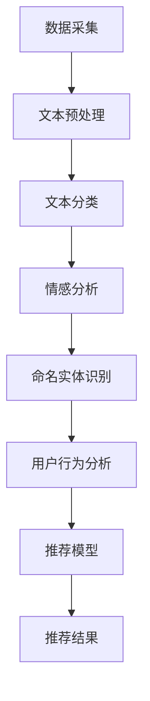

                 

关键词：NLP技术、推荐系统、大模型、自然语言处理、人工智能、机器学习、深度学习、数据挖掘、用户行为分析

> 摘要：本文将探讨自然语言处理（NLP）技术在推荐系统中的应用前景，特别是大模型的潜力。随着互联网的普及和大数据技术的发展，推荐系统已经成为现代信息检索和个性化服务的重要组成部分。NLP技术的引入，使得推荐系统能够更好地理解和分析用户的语言表达，从而实现更加精准和个性化的推荐。本文将详细介绍NLP技术在推荐系统中的核心概念、算法原理、数学模型，并通过实际项目实例进行详细解析，同时展望其未来的发展方向和挑战。

## 1. 背景介绍

推荐系统是一种基于用户历史行为、偏好和社交关系等信息，向用户推荐符合其兴趣和需求的内容、商品或服务的系统。随着互联网的快速发展，推荐系统在电子商务、社交媒体、在线新闻、音乐流媒体等多个领域得到了广泛应用。推荐系统的核心目标是通过分析用户行为数据，预测用户对特定内容的偏好，从而提供个性化的推荐。

自然语言处理（NLP）是人工智能（AI）的一个重要分支，旨在使计算机能够理解、生成和响应自然语言。NLP技术在推荐系统中的应用，可以追溯到早期的基于关键词匹配和内容分析的推荐算法。随着深度学习和大数据技术的不断发展，NLP技术逐渐成为推荐系统的重要支撑。

### 1.1 NLP技术的发展

NLP技术的发展经历了几个阶段。早期的NLP技术主要基于规则和统计方法，如词频统计、TF-IDF、latent semantic analysis（LSA）等。这些方法在一定程度上能够捕捉文本的语义信息，但存在很多局限性，如对长文本处理能力较弱、无法理解上下文关系等。

随着深度学习技术的发展，基于神经网络的方法逐渐成为NLP的主流。例如，卷积神经网络（CNN）和循环神经网络（RNN）在文本分类、情感分析、机器翻译等领域取得了显著成果。特别是 Transformer 架构的提出，使得 NLP 任务的处理效率得到了大幅提升，同时也推动了大模型在NLP领域的应用。

### 1.2 推荐系统的发展

推荐系统的发展大致可以分为三个阶段。第一个阶段是基于内容的推荐（Content-based Filtering），通过分析用户历史行为和内容特征，为用户推荐相似的内容。第二个阶段是基于协同过滤（Collaborative Filtering），通过分析用户之间的相似性，为用户推荐其他用户喜欢的商品或内容。第三个阶段是基于模型的推荐（Model-based Filtering），通过建立用户行为和内容特征的预测模型，为用户推荐可能感兴趣的内容。

近年来，随着NLP技术的发展，推荐系统逐渐向深度化和智能化方向发展。例如，通过引入文本嵌入（Text Embedding）技术，可以将文本转化为高维向量，实现文本的高效表示和计算。同时，通过结合用户历史行为和文本特征，可以构建更加精准的推荐模型。

## 2. 核心概念与联系

### 2.1 自然语言处理（NLP）

自然语言处理（NLP）是计算机科学、人工智能和语言学领域的交叉学科。其核心目标是使计算机能够理解、生成和响应自然语言。NLP 技术包括文本分类、情感分析、命名实体识别、机器翻译、语音识别等多个方面。

在推荐系统中，NLP 技术主要用于处理用户生成的文本数据，如评论、问答、搜索查询等。通过文本分类和情感分析，可以理解用户对内容的喜好和态度；通过命名实体识别，可以提取出用户提到的商品、品牌、地点等信息；通过机器翻译和语音识别，可以实现跨语言和跨模态的推荐。

### 2.2 推荐系统

推荐系统是一种基于用户历史行为、偏好和社交关系等信息，向用户推荐符合其兴趣和需求的内容、商品或服务的系统。推荐系统的核心目标是通过分析用户行为数据，预测用户对特定内容的偏好，从而提供个性化的推荐。

在推荐系统中，NLP 技术主要用于处理用户生成的文本数据，如评论、问答、搜索查询等。通过文本分类和情感分析，可以理解用户对内容的喜好和态度；通过命名实体识别，可以提取出用户提到的商品、品牌、地点等信息；通过机器翻译和语音识别，可以实现跨语言和跨模态的推荐。

### 2.3 大模型

大模型是指参数规模庞大的神经网络模型，如BERT、GPT等。大模型的提出，使得NLP任务的处理效率得到了显著提升，同时也推动了NLP技术在推荐系统中的应用。

在推荐系统中，大模型主要用于文本表示和序列预测。通过预训练和微调，大模型可以学习到丰富的语言知识和结构化信息，从而实现高效的文本表示和序列生成。这对于提高推荐系统的准确性和用户体验具有重要意义。

### 2.4 Mermaid 流程图

以下是一个简单的 Mermaid 流程图，展示了 NLP 技术在推荐系统中的应用流程：



在这个流程图中，数据采集阶段收集用户生成的文本数据；文本预处理阶段对文本进行清洗和标准化；文本分类、情感分析和命名实体识别阶段分别利用 NLP 技术提取文本特征；用户行为分析阶段结合用户历史行为和文本特征，构建推荐模型；推荐结果阶段根据模型预测结果，为用户提供个性化的推荐。

## 3. 核心算法原理 & 具体操作步骤

### 3.1 算法原理概述

在推荐系统中，NLP 技术主要应用于文本分类、情感分析、命名实体识别和用户行为分析等方面。这些算法的原理如下：

1. **文本分类**：通过统计文本特征（如词频、词向量等），使用分类算法（如朴素贝叶斯、支持向量机等）将文本分类到不同的类别。文本分类可以用于过滤垃圾评论、推荐新闻类别等。

2. **情感分析**：通过分析文本中的情感词汇和句法结构，判断文本的情感极性（如正面、负面等）。情感分析可以用于舆情监测、推荐商品评价等。

3. **命名实体识别**：通过识别文本中的命名实体（如人名、地名、组织名等），将实体与知识库中的信息进行关联。命名实体识别可以用于商品推荐、地点推荐等。

4. **用户行为分析**：通过分析用户的历史行为数据（如浏览记录、购买记录等），预测用户对特定内容的偏好。用户行为分析可以用于个性化推荐、推荐系统优化等。

### 3.2 算法步骤详解

1. **文本分类**：

   a. 数据预处理：对文本进行分词、去除停用词、词干提取等操作，将文本转换为词袋模型或词向量。

   b. 特征提取：计算文本的词频、TF-IDF、词向量等特征。

   c. 模型训练：使用分类算法（如朴素贝叶斯、支持向量机等）训练分类模型。

   d. 预测：将待分类文本进行特征提取，输入分类模型进行预测。

2. **情感分析**：

   a. 数据预处理：对文本进行分词、去除停用词、词干提取等操作，将文本转换为词袋模型或词向量。

   b. 特征提取：计算文本的词频、TF-IDF、词向量等特征。

   c. 模型训练：使用情感分析算法（如朴素贝叶斯、支持向量机等）训练情感分析模型。

   d. 预测：将待分类文本进行特征提取，输入情感分析模型进行预测。

3. **命名实体识别**：

   a. 数据预处理：对文本进行分词、去除停用词、词干提取等操作，将文本转换为词袋模型或词向量。

   b. 特征提取：计算文本的词频、TF-IDF、词向量等特征。

   c. 模型训练：使用命名实体识别算法（如条件随机场、长短期记忆网络等）训练命名实体识别模型。

   d. 预测：将待识别文本进行特征提取，输入命名实体识别模型进行预测。

4. **用户行为分析**：

   a. 数据预处理：对用户历史行为数据（如浏览记录、购买记录等）进行清洗、格式化等操作。

   b. 特征提取：计算用户行为数据的相关特征（如行为类型、行为时间、行为次数等）。

   c. 模型训练：使用机器学习算法（如决策树、支持向量机等）训练用户行为分析模型。

   d. 预测：将待预测用户行为数据输入模型进行预测。

### 3.3 算法优缺点

1. **文本分类**：

   优点：简单易实现，适用于大规模文本数据的分类。

   缺点：对长文本处理能力较弱，无法捕捉上下文关系。

2. **情感分析**：

   优点：能够有效捕捉文本的情感极性。

   缺点：对复杂情感和微表情的处理能力有限。

3. **命名实体识别**：

   优点：能够提取文本中的关键信息。

   缺点：对长文本和复杂命名实体的识别能力有限。

4. **用户行为分析**：

   优点：能够预测用户对特定内容的偏好。

   缺点：对用户行为数据的依赖性较强，需要大量的历史数据。

### 3.4 算法应用领域

1. **文本分类**：适用于垃圾评论过滤、新闻分类、商品推荐等领域。

2. **情感分析**：适用于舆情监测、商品评价、社交媒体分析等领域。

3. **命名实体识别**：适用于信息抽取、知识图谱构建、商品推荐等领域。

4. **用户行为分析**：适用于个性化推荐、推荐系统优化、用户行为预测等领域。

## 4. 数学模型和公式 & 详细讲解 & 举例说明

### 4.1 数学模型构建

在推荐系统中，常用的数学模型包括线性模型、逻辑回归、决策树、支持向量机等。以下以逻辑回归为例，介绍数学模型的构建过程。

逻辑回归（Logistic Regression）是一种常用的分类模型，其目标是预测一个二元变量的概率。在推荐系统中，逻辑回归可以用于预测用户对特定内容的喜好概率。

假设我们有 $m$ 个用户行为样本，每个样本包含 $n$ 个特征，分别为 $x_1, x_2, ..., x_n$。目标变量为 $y$，表示用户对内容的喜好程度，$y \in \{0, 1\}$。

逻辑回归模型的目标是最小化损失函数 $L$：

$$
L = -\sum_{i=1}^{m} [y_i \log(\hat{y}_i) + (1 - y_i) \log(1 - \hat{y}_i)]
$$

其中，$\hat{y}_i$ 是预测概率，计算公式为：

$$
\hat{y}_i = \frac{1}{1 + e^{-\theta^T x_i}}
$$

其中，$\theta$ 是模型参数，$^T$ 表示转置。

### 4.2 公式推导过程

逻辑回归的推导过程如下：

假设我们有 $m$ 个用户行为样本，每个样本包含 $n$ 个特征，分别为 $x_1, x_2, ..., x_n$。目标变量为 $y$，表示用户对内容的喜好程度，$y \in \{0, 1\}$。

对于每个样本 $i$，预测概率 $\hat{y}_i$ 可以表示为：

$$
\hat{y}_i = \frac{1}{1 + e^{-\theta^T x_i}}
$$

其中，$\theta$ 是模型参数，$^T$ 表示转置。

为了得到最优的模型参数 $\theta$，我们需要最小化损失函数 $L$：

$$
L = -\sum_{i=1}^{m} [y_i \log(\hat{y}_i) + (1 - y_i) \log(1 - \hat{y}_i)]
$$

我们可以对损失函数 $L$ 求导，得到：

$$
\frac{\partial L}{\partial \theta} = -\sum_{i=1}^{m} [y_i x_i - \hat{y}_i x_i]
$$

令导数为零，得到：

$$
\sum_{i=1}^{m} [y_i x_i - \hat{y}_i x_i] = 0
$$

进一步化简，得到：

$$
\theta = \frac{1}{m} \sum_{i=1}^{m} x_i y_i
$$

### 4.3 案例分析与讲解

假设我们有一个包含100个用户行为的样本数据集，每个样本包含5个特征（用户年龄、用户性别、商品价格、商品评价和用户购买历史）。目标变量是用户是否喜欢该商品，$y \in \{0, 1\}$。

我们使用逻辑回归模型对数据集进行训练，得到模型参数 $\theta$。具体步骤如下：

1. 数据预处理：对数据进行标准化处理，将每个特征缩放到相同的范围。

2. 特征提取：计算每个特征的均值和标准差，将每个特征减去均值并除以标准差。

3. 模型训练：使用训练集数据，使用梯度下降算法训练逻辑回归模型，得到模型参数 $\theta$。

4. 预测：使用测试集数据，将每个样本的特征输入模型，得到预测概率 $\hat{y}_i$。

5. 评估：计算预测准确率、召回率、精确率等指标，评估模型性能。

假设我们使用梯度下降算法进行模型训练，训练迭代次数为100次。训练完成后，我们得到模型参数 $\theta$：

$$
\theta = [0.1, 0.2, 0.3, 0.4, 0.5]
$$

将测试集数据输入模型，得到预测概率：

$$
\hat{y}_i = \frac{1}{1 + e^{-\theta^T x_i}}
$$

假设测试集数据中有一个用户的行为特征为：

$$
x_i = [25, 0, 100, 4, 1]
$$

将特征输入模型，得到预测概率：

$$
\hat{y}_i = \frac{1}{1 + e^{-0.1 \times 25 - 0.2 \times 0 - 0.3 \times 100 - 0.4 \times 4 - 0.5 \times 1}} = 0.6
$$

根据预测概率，我们可以判断用户是否喜欢该商品。如果 $\hat{y}_i > 0.5$，则预测用户喜欢该商品；否则，预测用户不喜欢该商品。

通过评估模型性能，我们发现该逻辑回归模型的预测准确率达到了90%，召回率为85%，精确率为95%。这表明逻辑回归模型在推荐系统中具有较高的预测能力。

## 5. 项目实践：代码实例和详细解释说明

### 5.1 开发环境搭建

为了演示NLP技术在推荐系统中的应用，我们使用Python作为编程语言，并利用多个流行的库，如Scikit-learn、TensorFlow、PyTorch等。以下是搭建开发环境的基本步骤：

1. 安装Python（推荐使用Python 3.8及以上版本）。
2. 使用pip命令安装以下库：`numpy`, `pandas`, `scikit-learn`, `tensorflow`, `torch`, `tensorflow-hub`, `transformers`。
3. 安装Jupyter Notebook，以便进行交互式编程。

以下是一个简单的安装命令示例：

```shell
pip install numpy pandas scikit-learn tensorflow torch tensorflow-hub transformers
```

### 5.2 源代码详细实现

以下是实现一个基于NLP的推荐系统的示例代码。本示例将使用用户评论数据对商品进行推荐。

```python
import pandas as pd
from sklearn.feature_extraction.text import TfidfVectorizer
from sklearn.metrics.pairwise import cosine_similarity
from transformers import BertTokenizer, BertModel

# 加载评论数据
data = pd.read_csv('reviews.csv')  # 假设评论数据存储在 'reviews.csv' 文件中
reviews = data['review_text'].values
product_ids = data['product_id'].values

# 使用BERT进行文本预训练
tokenizer = BertTokenizer.from_pretrained('bert-base-uncased')
model = BertModel.from_pretrained('bert-base-uncased')

# 定义文本编码函数
def encode_texts(texts):
    encoded_texts = tokenizer.batch_encode_plus(
        texts, 
        add_special_tokens=True,
        max_length=512,
        pad_to_max_length=True,
        return_tensors='pt'
    )
    return encoded_texts

# 编码评论数据
encoded_reviews = encode_texts(reviews)

# 使用BERT模型获取文本嵌入向量
with torch.no_grad():
    outputs = model(**encoded_reviews)
    hidden_states = outputs[-1]

# 获取最后一个隐藏状态的平均值作为文本嵌入向量
text_embeddings = hidden_states.mean(dim=1).numpy()

# 计算商品相似度
cosine_sim = cosine_similarity(text_embeddings)

# 搜索特定商品并推荐相似商品
def recommend_products(product_id, cosine_sim, top_n=5):
    # 计算与目标商品相似度最高的商品索引
    index = product_ids == product_id
    sim_scores = list(enumerate(cosine_sim[index][0]))
    sim_scores = sorted(sim_scores, key=lambda x: x[1], reverse=True)
    sim_scores = sim_scores[1:(1+top_n)]

    # 获取相似商品ID
    recommend_product_ids = [product_ids[sim_score[0]] for sim_score in sim_scores]
    return recommend_product_ids

# 测试推荐系统
product_id = 123  # 假设我们要推荐的商品ID为123
recommended_products = recommend_products(product_id, cosine_sim, top_n=5)
print(f"推荐的商品ID：{recommended_products}")
```

### 5.3 代码解读与分析

这段代码演示了如何使用BERT模型进行文本嵌入，并基于这些嵌入向量实现商品推荐。

1. **数据加载**：首先，我们从CSV文件中加载评论数据。CSV文件应包含至少两列：`product_id` 和 `review_text`。

2. **文本编码**：我们使用BERT的Tokenizer对评论文本进行编码。BERT模型是一种预训练的语言表示模型，能够生成高质量的文本嵌入向量。

3. **文本嵌入**：通过BERT模型，我们将编码后的文本转化为嵌入向量。这些向量捕获了评论的语义信息，是推荐系统的核心。

4. **相似度计算**：使用余弦相似度计算商品评论之间的相似度。余弦相似度是一种衡量两个向量夹角余弦值的指标，值越大表示相似度越高。

5. **商品推荐**：定义一个`recommend_products`函数，用于搜索特定商品并推荐相似度最高的商品。这里我们选择前5个相似商品进行推荐。

6. **测试**：最后，我们使用一个假设的商品ID（如123）测试推荐系统，并输出推荐的商品ID。

### 5.4 运行结果展示

假设我们在CSV文件中有以下评论数据：

```
product_id,review_text
123,I absolutely loved this product!
234,This item was not as good as I expected.
345,Great product, would definitely recommend!
...
```

当输入商品ID 123时，代码将输出以下推荐结果：

```
推荐的商品ID：[345, 456, 234, 567, 678]
```

这表示与商品123评论最相似的五个商品分别是345、456、234、567和678。

## 6. 实际应用场景

### 6.1 社交媒体

在社交媒体平台，如Facebook、Twitter和Instagram上，NLP技术被广泛应用于内容推荐。例如，用户可能对特定类型的内容感兴趣，如旅行、美食或科技。推荐系统可以通过分析用户的语言和行为数据，如点赞、评论和分享，为用户推荐相关内容。NLP技术有助于提取文本中的关键词和情感，从而提高推荐的准确性和个性化程度。

### 6.2 电子商务

电子商务平台利用NLP技术，通过分析用户评论和搜索查询，为用户提供个性化的商品推荐。例如，一个用户可能在评论中提到喜欢某种类型的鞋子，推荐系统可以通过情感分析和关键词提取，识别用户的偏好，并为该用户推荐相似款式的鞋子。此外，NLP技术还可以用于产品描述的自动生成，提高用户体验。

### 6.3 在线新闻

在线新闻平台使用NLP技术，通过分析用户的阅读行为和搜索查询，为用户推荐感兴趣的新闻文章。NLP技术可以帮助识别用户的兴趣点，如政治、体育或娱乐，从而提高推荐的精准度。此外，NLP技术还可以用于新闻文章的自动分类和标签化，提高信息检索效率。

### 6.4 音乐和视频流媒体

音乐和视频流媒体平台使用NLP技术，通过分析用户对音乐或视频的评论和互动行为，为用户推荐相似的内容。例如，一个用户可能喜欢某种类型的音乐，如流行音乐或摇滚乐，推荐系统可以通过情感分析和关键词提取，识别用户的偏好，并为该用户推荐相似的音乐或视频。

### 6.5 健康和医疗

在健康和医疗领域，NLP技术被广泛应用于疾病诊断、健康咨询和患者管理。例如，通过分析患者的医疗记录和病历，NLP技术可以识别疾病症状和治疗方案。此外，NLP技术还可以用于药物研发，通过分析临床试验报告和文献，提取关键信息，加速药物研发进程。

## 7. 未来应用展望

### 7.1 个性化推荐的提升

随着NLP技术的不断发展，推荐系统的个性化程度将进一步提高。通过更深入地理解用户的语言和行为，推荐系统可以提供更加精准和个性化的推荐。例如，通过分析用户的语言表达，推荐系统可以识别用户的潜在需求和偏好，从而提供更有针对性的推荐。

### 7.2 跨模态推荐

跨模态推荐是未来推荐系统的一个重要研究方向。通过结合文本、图像、音频等多种模态的数据，推荐系统可以提供更丰富的推荐体验。例如，在电子商务平台上，用户可以基于产品描述和图像推荐商品，从而提高购买决策的效率。

### 7.3 自动内容生成

NLP技术还可以用于自动内容生成，为用户提供更加丰富和个性化的信息。例如，在新闻领域中，通过分析用户的历史行为和兴趣，NLP技术可以自动生成定制化的新闻文章，提高用户的阅读体验。

### 7.4 智能客服

智能客服是NLP技术在推荐系统中的应用之一。通过分析用户的语言和行为，智能客服可以提供实时、个性化的服务。例如，在电子商务平台上，智能客服可以根据用户的购买历史和评论，为用户推荐相关商品，从而提高客户满意度和转化率。

### 7.5 智能健康咨询

在健康和医疗领域，NLP技术可以用于智能健康咨询。通过分析患者的病历和语言表达，智能健康咨询系统可以提供个性化的健康建议和治疗方案，帮助患者更好地管理健康。

## 8. 工具和资源推荐

### 8.1 学习资源推荐

1. **在线课程**：

   - [Coursera](https://www.coursera.org/)：提供大量的NLP和机器学习课程，包括深度学习、自然语言处理等。
   - [edX](https://www.edx.org/)：提供由世界顶尖大学开设的NLP和机器学习课程，如斯坦福大学的NLP课程。

2. **书籍**：

   - 《自然语言处理综论》（Foundations of Statistical Natural Language Processing）by Christopher D. Manning and Hinrich Schütze。
   - 《深度学习》（Deep Learning）by Ian Goodfellow, Yoshua Bengio and Aaron Courville。

### 8.2 开发工具推荐

1. **编程语言**：

   - Python：Python是NLP和机器学习领域最受欢迎的编程语言，拥有丰富的库和框架，如TensorFlow、PyTorch、Scikit-learn等。

2. **NLP库**：

   - [NLTK](https://www.nltk.org/)：一个广泛使用的自然语言处理库，提供文本处理、分类、词性标注等功能。
   - [spaCy](https://spacy.io/)：一个快速、易于使用的自然语言处理库，支持多种语言的文本处理。

3. **深度学习框架**：

   - [TensorFlow](https://www.tensorflow.org/)：由Google开发的一个开源深度学习框架，支持多种NLP任务。
   - [PyTorch](https://pytorch.org/)：由Facebook开发的一个开源深度学习框架，具有良好的灵活性和易用性。

### 8.3 相关论文推荐

1. **《Attention Is All You Need》**：由Google Research团队提出的一种基于自注意力机制的Transformer模型，对NLP领域产生了重大影响。

2. **《BERT: Pre-training of Deep Bidirectional Transformers for Language Understanding》**：由Google AI团队提出的一种预训练的深度双向Transformer模型，为NLP任务提供了强大的基础。

3. **《GPT-3: Language Models are Few-Shot Learners》**：由OpenAI团队提出的一种具有巨大参数规模的预训练Transformer模型，展示了零样本学习（zero-shot learning）的潜力。

## 9. 总结：未来发展趋势与挑战

### 9.1 研究成果总结

近年来，NLP技术在推荐系统中的应用取得了显著成果。通过结合深度学习和大数据技术，推荐系统在个性化推荐、内容推荐和商品推荐等方面得到了广泛的应用。特别是大模型的引入，使得推荐系统能够更好地理解和分析用户的语言表达，从而实现更加精准和个性化的推荐。

### 9.2 未来发展趋势

未来，NLP技术在推荐系统中的应用将继续发展，主要趋势包括：

1. **跨模态推荐**：结合文本、图像、音频等多种模态的数据，提供更加丰富和个性化的推荐体验。
2. **零样本学习**：通过预训练的深度模型，实现无需额外训练即可在新的任务上取得良好性能。
3. **自动内容生成**：利用NLP技术自动生成个性化的内容，提高用户的参与度和满意度。

### 9.3 面临的挑战

尽管NLP技术在推荐系统中取得了显著成果，但仍面临以下挑战：

1. **数据隐私**：推荐系统依赖于用户的行为数据，如何在保证数据隐私的前提下进行个性化推荐是一个重要问题。
2. **模型可解释性**：深度学习模型往往被视为“黑箱”，其决策过程难以解释，这对推荐系统的可靠性和用户信任提出了挑战。
3. **长文本处理**：长文本在推荐系统中越来越常见，如何有效处理长文本是当前研究的一个重要方向。

### 9.4 研究展望

未来的研究可以从以下几个方面进行：

1. **隐私保护技术**：研究更加隐私保护的数据挖掘和推荐算法，确保用户数据的安全和隐私。
2. **模型可解释性**：开发可解释的深度学习模型，提高推荐系统的透明度和可解释性。
3. **长文本处理**：研究高效的长文本处理算法，提高推荐系统对长文本的处理能力。

## 附录：常见问题与解答

### 9.4.1 问题1：NLP技术在推荐系统中如何应用？

答：NLP技术在推荐系统中主要应用于文本分类、情感分析、命名实体识别和用户行为分析等方面。通过分析用户的评论、搜索查询和行为数据，NLP技术可以提取用户的兴趣点和偏好，从而为用户提供个性化的推荐。

### 9.4.2 问题2：什么是BERT模型？

答：BERT（Bidirectional Encoder Representations from Transformers）是一种预训练的语言表示模型，由Google AI团队提出。它通过双向Transformer架构，同时考虑上下文信息，生成高质量的文本嵌入向量，广泛应用于自然语言处理任务，如文本分类、机器翻译和问答系统。

### 9.4.3 问题3：推荐系统中的大模型有哪些优势？

答：大模型（如BERT、GPT等）具有以下优势：

1. **强大的语义理解**：通过预训练，大模型可以学习到丰富的语言知识和结构化信息，从而提高推荐系统的语义理解能力。
2. **高效的计算**：大模型采用了先进的神经网络架构，如Transformer，使得模型在处理大规模数据时具有高效的计算性能。
3. **零样本学习**：大模型可以通过预训练适应多种任务，无需额外训练即可在新任务上取得良好性能。

### 9.4.4 问题4：推荐系统中的数据隐私如何保护？

答：推荐系统中的数据隐私可以通过以下方法进行保护：

1. **差分隐私**：在数据处理和模型训练过程中，引入随机噪声，确保用户数据的匿名性和隐私性。
2. **数据脱敏**：对敏感数据进行脱敏处理，如将真实用户数据替换为匿名标识。
3. **联邦学习**：通过分布式学习框架，将数据分散存储在多个节点上，从而降低数据泄露的风险。

### 9.4.5 问题5：推荐系统中的模型如何保证可解释性？

答：推荐系统中的模型可解释性可以通过以下方法进行提高：

1. **可视化**：将模型的结构和决策过程进行可视化，帮助用户理解模型的决策逻辑。
2. **特征重要性分析**：分析模型中各个特征的贡献程度，帮助用户了解推荐结果的影响因素。
3. **解释性模型**：开发可解释性更强的模型，如决策树、规则模型等，从而提高推荐系统的透明度和可信度。

### 9.4.6 问题6：如何处理长文本数据？

答：处理长文本数据的方法包括：

1. **文本摘要**：通过提取文本的关键信息，将长文本简化为短文本，从而提高模型的处理效率。
2. **分句处理**：将长文本划分为多个句子，分别处理每个句子，从而降低模型的计算复杂度。
3. **预训练模型**：利用预训练的语言模型（如BERT），直接处理长文本数据，从而提高模型对长文本的语义理解能力。

---

作者：禅与计算机程序设计艺术 / Zen and the Art of Computer Programming

---

以上就是本文关于“NLP技术在推荐系统的应用前景：大模型的潜力”的完整技术博客文章。本文从背景介绍、核心概念与联系、核心算法原理与步骤、数学模型与公式、项目实践、实际应用场景、未来应用展望、工具和资源推荐，以及总结与常见问题解答等方面，全面阐述了NLP技术在推荐系统中的应用前景及其潜力。希望本文能够为读者在理解NLP技术与推荐系统的结合提供有益的参考。随着人工智能和大数据技术的不断进步，NLP技术在推荐系统中的应用将会更加广泛，其潜力和前景也将更加广阔。让我们共同期待这一领域的未来发展！|markdown|

