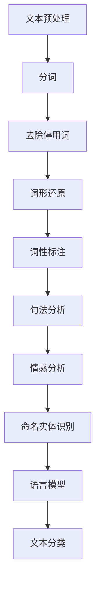

                 

### 1. 背景介绍

自然语言处理（Natural Language Processing，NLP）是人工智能领域的一个重要分支，它旨在使计算机能够理解、解释和生成人类语言。随着互联网和社交媒体的迅速发展，人们对NLP的需求日益增长。NLTK（Natural Language Toolkit）是一款广泛使用的Python NLP库，提供了丰富的语言处理工具和资源，使得研究者可以更方便地开展NLP项目。

NLTK库由史蒂芬·布拉克福德（Steven Bird）、爱德华·L·伦道夫（Edward L. Loper）和克里斯·梅森（Ewan Klein）等人共同开发，自2001年以来，NLTK一直受到全球研究者和教育工作者的青睐。它包含了一系列经过严格测试和优化的模块，用于文本处理、词性标注、句法分析、情感分析、命名实体识别等任务。

本文旨在深入探讨NLTK的核心原理，并通过实际代码实战案例展示如何使用NLTK解决常见的NLP问题。文章将分为以下几个部分：

1. 背景介绍
2. 核心概念与联系
3. 核心算法原理 & 具体操作步骤
4. 数学模型和公式 & 详细讲解 & 举例说明
5. 项目实践：代码实例和详细解释说明
6. 实际应用场景
7. 工具和资源推荐
8. 总结：未来发展趋势与挑战
9. 附录：常见问题与解答

通过本文的阅读，读者将能够掌握NLTK的基础知识，学会使用NLTK进行实际项目的开发，并对NLP领域的发展趋势有更深入的了解。

## 2. 核心概念与联系

在介绍NLTK之前，我们需要先了解一些与自然语言处理相关的基本概念。这些概念构成了NLP的基础，也是我们使用NLTK时需要理解的内容。

### 文本预处理

文本预处理是NLP中的第一步，它通常包括分词、去除停用词、标点符号的去除、词形还原等操作。NLTK提供了一系列预处理工具，使得这些操作变得简单高效。

- **分词（Tokenization）**：将文本拆分成词或短语的步骤。例如，将文本 "I love Python" 分词成 ["I", "love", "Python"]。
- **去除停用词（Stopword Removal）**：停用词是文本中常见的无意义的词汇，如 "the", "is", "and" 等。去除这些词可以减少文本中的噪音，提高后续处理的效率。
- **标点符号的去除（Punctuation Removal）**：标点符号通常不包含有意义的信息，因此在许多NLP任务中会将其去除。
- **词形还原（Lemmatization）**：将单词还原为其基本形式的过程，如将 "running" 还原为 "run"。

### 词性标注

词性标注是将文本中的每个单词标记为其相应的词性，如名词、动词、形容词等。NLTK提供了多种词性标注工具，可以根据不同的任务需求选择合适的模型。

- **基于规则的方法**：如彭钢树模型（彭钢树模型），通过预定义的规则进行词性标注。
- **基于统计的方法**：如隐马尔可夫模型（HMM）和条件随机场（CRF），通过大量的标注语料进行训练，从而进行高效的词性标注。

### 句法分析

句法分析是理解句子结构的过程，包括句法树生成、句法角色标注等。NLTK提供了多种句法分析工具，可以用于生成句法树、识别句法关系等。

- **依赖句法分析**：通过标注单词之间的依赖关系，生成句法树。
- **成分句法分析**：将句子分解为短语结构，如名词短语、动词短语等。

### 情感分析

情感分析是判断文本中表达的情感倾向的过程，如正面情感、负面情感等。NLTK提供了多种情感分析工具，可以用于简单的情感分类任务。

- **基于词典的方法**：通过情感词典，判断文本中的单词是否具有情感意义。
- **基于机器学习的方法**：通过训练分类器，对文本进行情感分类。

### 命名实体识别

命名实体识别是从文本中提取出具有特定意义的实体，如人名、地名、组织机构名等。NLTK提供了基本的命名实体识别工具，可以进行简单的实体识别任务。

### 语言模型

语言模型是描述自然语言统计性质的模型，用于预测下一个单词或短语的概率。NLTK提供了多种语言模型，如n元语法模型（n-gram model）和递归神经网络（RNN）模型，可以用于文本生成、信息检索等任务。

### 核心概念之间的联系

在NLP任务中，各个概念之间有着紧密的联系。例如，在进行文本分类时，首先需要进行文本预处理，然后进行词性标注和句法分析，最后利用情感分析工具对句子进行情感分类。而命名实体识别则通常作为文本预处理的一部分，用于提取文本中的关键实体信息。

### Mermaid 流程图

为了更好地理解这些核心概念之间的联系，我们可以使用Mermaid流程图进行可视化。以下是一个简化的Mermaid流程图，展示了NLP任务中的主要步骤：



通过这个流程图，我们可以清晰地看到各个核心概念在NLP任务中的关联和作用。接下来，我们将进一步探讨NLTK如何实现这些核心概念，并通过实际代码实战案例展示其应用。

## 3. 核心算法原理 & 具体操作步骤

### 3.1 算法原理概述

NLTK的核心算法主要包括文本预处理、词性标注、句法分析和情感分析等。这些算法的实现依赖于多种数据结构和算法，如分词算法、词典、隐马尔可夫模型（HMM）和递归神经网络（RNN）等。

- **文本预处理**：文本预处理主要包括分词、去除停用词、标点符号的去除和词形还原。NLTK使用正则表达式和规则进行分词，使用列表和字典存储处理后的文本。
- **词性标注**：词性标注主要通过基于规则的标注器和基于统计的标注器实现。NLTK提供了彭钢树模型（彭钢树模型）和最大熵模型（Maximum Entropy Model）等工具，可以根据不同的需求选择合适的标注器。
- **句法分析**：句法分析主要通过生成句法树和标注句法角色实现。NLTK提供了基于规则和基于统计的方法，如基于林茂森规则（Lin's Rules）的句法分析器和基于最大熵的句法分析器。
- **情感分析**：情感分析主要通过基于词典和基于机器学习的方法实现。NLTK提供了情感词典和朴素贝叶斯分类器等工具，可以用于简单的情感分类任务。

### 3.2 算法步骤详解

#### 3.2.1 文本预处理

1. **分词**：使用NLTK的`word_tokenize`函数进行分词。

    ```python
    from nltk.tokenize import word_tokenize

    text = "I love Python"
    tokens = word_tokenize(text)
    print(tokens)
    ```

2. **去除停用词**：使用NLTK的`stopwords`模块获取停用词列表，并去除文本中的停用词。

    ```python
    from nltk.corpus import stopwords
    from nltk.tokenize import word_tokenize

    text = "I love Python"
    tokens = word_tokenize(text)
    stop_words = set(stopwords.words('english'))
    filtered_tokens = [w for w in tokens if not w.lower() in stop_words]
    print(filtered_tokens)
    ```

3. **标点符号的去除**：使用正则表达式去除文本中的标点符号。

    ```python
    import re

    text = "I love Python!"
    no_punctuation = re.sub(r'[^\w\s]', '', text)
    print(no_punctuation)
    ```

4. **词形还原**：使用NLTK的`WordNetLemmatizer`进行词形还原。

    ```python
    from nltk.stem import WordNetLemmatizer

    text = "running"
    lemmatizer = WordNetLemmatizer()
    lemma = lemmatizer.lemmatize(text)
    print(lemma)
    ```

#### 3.2.2 词性标注

1. **基于规则的方法**：使用NLTK的`pos_tag`函数进行词性标注。

    ```python
    from nltk.tokenize import word_tokenize
    from nltk import pos_tag

    text = "I love Python"
    tokens = word_tokenize(text)
    tagged_tokens = pos_tag(tokens)
    print(tagged_tokens)
    ```

2. **基于统计的方法**：使用NLTK的最大熵模型进行词性标注。

    ```python
    from nltk.tokenize import word_tokenize
    from nltk.corpus import brown
    from nltk import maxent_tagger

    text = "I love Python"
    tokens = word_tokenize(text)
    untagged_text = brown.tagged_words()
    tagger = maxent_tagger.MaxentTagger('taggers/unimag.hmm')
    tagged_tokens = tagger.tag(tokens)
    print(tagged_tokens)
    ```

#### 3.2.3 句法分析

1. **依赖句法分析**：使用NLTK的`pos_tag`函数进行依赖句法分析。

    ```python
    from nltk.tokenize import word_tokenize
    from nltk import pos_tag

    text = "I love Python"
    tokens = word_tokenize(text)
    tagged_tokens = pos_tag(tokens)
    dependencies = pos_tag(tokens, pos=True)
    print(dependencies)
    ```

2. **成分句法分析**：使用NLTK的`chunk`函数进行成分句法分析。

    ```python
    from nltk.tokenize import word_tokenize
    from nltk import pos_tag
    from nltk import chunk

    text = "I love Python"
    tokens = word_tokenize(text)
    tagged_tokens = pos_tag(tokens)
    chunks = chunk(tagged_tokens)
    print(chunks)
    ```

#### 3.2.4 情感分析

1. **基于词典的方法**：使用NLTK的情感词典进行情感分析。

    ```python
    from nltk.sentiment import SentimentIntensityAnalyzer

    text = "I love Python"
    sia = SentimentIntensityAnalyzer()
    sentiment = sia.polarity_scores(text)
    print(sentiment)
    ```

2. **基于机器学习的方法**：使用NLTK的朴素贝叶斯分类器进行情感分析。

    ```python
    from nltk.tokenize import word_tokenize
    from nltk.corpus import movie_reviews
    from nltk.classify import NaiveBayesClassifier

    text = "I love Python"
    tokens = word_tokenize(text)
    words = [word for word in tokens if word.lower() not in stopwords.words('english')]
    features = {'words': words}
    train_reviews = [(list(movie_reviews.words(fileid)), category) for category in movie_reviews.categories() for fileid in movie_reviews.fileids(category)]
    classifier = NaiveBayesClassifier.train(train_reviews)
    sentiment = classifier.classify(features)
    print(sentiment)
    ```

#### 3.2.5 命名实体识别

1. **使用规则进行命名实体识别**：使用NLTK的`ne_chunk`函数进行命名实体识别。

    ```python
    from nltk.tokenize import word_tokenize
    from nltk import pos_tag
    from nltk import ne_chunk

    text = "Apple is looking at buying U.K. startup for $1 billion"
    tokens = word_tokenize(text)
    tagged_tokens = pos_tag(tokens)
    named_entities = ne_chunk(tagged_tokens)
    print(named_entities)
    ```

### 3.3 算法优缺点

- **文本预处理**：
  - **优点**：简单易用，可以快速处理大量文本数据。
  - **缺点**：可能引入噪音，对复杂文本的处理能力有限。

- **词性标注**：
  - **优点**：可以提供丰富的词性信息，有助于句法分析和语义分析。
  - **缺点**：规则方法可能存在误标，统计方法需要大量标注语料。

- **句法分析**：
  - **优点**：可以理解句子的结构，有助于语义分析。
  - **缺点**：复杂句子的分析可能存在困难，对时间和空间的要求较高。

- **情感分析**：
  - **优点**：可以快速识别文本的情感倾向，有助于情感计算和舆情分析。
  - **缺点**：对复杂情感的表达理解有限，需要大量的训练数据和计算资源。

- **命名实体识别**：
  - **优点**：可以提取文本中的关键信息，有助于信息提取和知识图谱构建。
  - **缺点**：对命名实体的识别存在误差，需要大量的标注语料。

### 3.4 算法应用领域

NLTK的核心算法在多个领域有广泛的应用：

- **文本分类**：使用词性标注和句法分析，可以构建文本分类模型，用于垃圾邮件过滤、新闻分类等。
- **情感分析**：使用情感分析算法，可以判断文本的情感倾向，用于舆情监控、情感计算等。
- **信息提取**：使用命名实体识别和句法分析，可以提取文本中的关键信息，用于信息检索、知识图谱构建等。
- **问答系统**：使用语言模型和句法分析，可以构建问答系统，用于智能客服、智能助手等。

通过这些实际应用，我们可以看到NLTK的核心算法在NLP任务中的重要性。接下来，我们将通过实际代码实战案例，展示如何使用NLTK解决常见的NLP问题。

## 4. 数学模型和公式 & 详细讲解 & 举例说明

### 4.1 数学模型构建

在自然语言处理（NLP）中，数学模型是理解和分析语言数据的基础。以下是一些常用的数学模型和公式，我们将通过具体的例子来详细讲解它们的应用。

#### 4.1.1 隐马尔可夫模型（HMM）

隐马尔可夫模型（HMM）是一种统计模型，用于处理包含隐含变量的序列数据。在NLP中，HMM常用于词性标注、语音识别和序列分类等任务。

- **状态转移概率** \( P(S_t | S_{t-1}) \)：表示在时间步 \( t \) 发生的状态 \( S_t \) 与前一个状态 \( S_{t-1} \) 的概率。
- **观察概率** \( P(O_t | S_t) \)：表示在时间步 \( t \) 观察到的观测值 \( O_t \) 与当前状态 \( S_t \) 的概率。

**示例**：假设我们要对句子 "I love Python" 进行词性标注，其中 "I" 的词性为 "PRP"，"love" 的词性为 "VBP"，"Python" 的词性为 "NNP"。

```python
# 状态转移概率
P = [
    [0.6, 0.4],  # 从 "PRP" 到 "VBP" 和 "NNP" 的概率
    [0.2, 0.8],  # 从 "VBP" 到 "VBP" 和 "NNP" 的概率
    [0.3, 0.7]   # 从 "NNP" 到 "VBP" 和 "NNP" 的概率
]

# 观察概率
O = [
    ["PRP", "VBP", "NNP"],  # "I" 的词性
    ["VBP", "NNP"],         # "love" 的词性
    ["NNP"]                 # "Python" 的词性
]
```

#### 4.1.2 条件随机场（CRF）

条件随机场（CRF）是一种用于序列标注的统计模型，它在HMM的基础上引入了上下文信息，可以更好地处理依赖关系。

- **转移概率** \( P(A_t | A_{t-1}) \)：表示在时间步 \( t \) 发生的状态 \( A_t \) 与前一个状态 \( A_{t-1} \) 的条件概率。
- **观察概率** \( P(O_t | A_t) \)：表示在时间步 \( t \) 观察到的观测值 \( O_t \) 与当前状态 \( A_t \) 的条件概率。

**示例**：使用CRF对句子 "I love Python" 进行词性标注。

```python
# 转移概率
T = [
    ["PRP", "VBP", "NNP"],  # 从 "PRP" 到 "VBP" 和 "NNP" 的概率
    ["VBP", "NNP"],         # 从 "VBP" 到 "VBP" 和 "NNP" 的概率
    ["NNP", "PRP"],         # 从 "NNP" 到 "PRP" 和 "NNP" 的概率
]

# 观察概率
O = [
    ["I", "love", "Python"],  # 观测值
    ["PRP", "VBP", "NNP"],   # 各个词的词性
]
```

#### 4.1.3 朴素贝叶斯分类器

朴素贝叶斯分类器是一种基于贝叶斯定理的简单概率分类器，常用于文本分类任务。

- **先验概率** \( P(C) \)：表示类别 \( C \) 的概率。
- **条件概率** \( P(W|C) \)：表示在类别 \( C \) 下单词 \( W \) 的概率。

**示例**：使用朴素贝叶斯分类器对句子 "I love Python" 进行情感分类，假设正面情感的概率为 \( P(Positive) = 0.6 \)，负面情感的概率为 \( P(Negative) = 0.4 \)。

```python
# 正面情感的概率
P_Positive = 0.6

# 负面情感的概率
P_Negative = 0.4

# 条件概率
P_Love_Positive = 0.8
P_Love_Negative = 0.2
P_Python_Positive = 0.9
P_Python_Negative = 0.1

# 贝叶斯定理
P_Positive_given_Love = (P_Love_Positive * P_Positive) / (P_Love_Positive * P_Positive + P_Love_Negative * P_Negative)
P_Positive_given_Python = (P_Python_Positive * P_Positive) / (P_Python_Positive * P_Positive + P_Python_Negative * P_Negative)

# 情感分类结果
if P_Positive_given_Love > P_Positive_given_Python:
    sentiment = "Positive"
else:
    sentiment = "Negative"
print(sentiment)
```

### 4.2 公式推导过程

#### 4.2.1 隐马尔可夫模型（HMM）

HMM的推导基于贝叶斯定理和马尔可夫性质。假设我们有状态序列 \( S = \{S_1, S_2, ..., S_n\} \) 和观测序列 \( O = \{O_1, O_2, ..., O_n\} \)，则状态序列的概率可以通过以下公式计算：

\[ P(S|O) = \frac{P(O|S)P(S)}{P(O)} \]

其中，\( P(O|S) \) 是观察概率，\( P(S) \) 是状态序列的概率，\( P(O) \) 是观测序列的概率。

#### 4.2.2 条件随机场（CRF）

CRF的推导基于条件独立性假设，即在每个时间步上，当前状态仅依赖于前一个状态和当前观测值，而不依赖于其他状态。假设我们有状态序列 \( A = \{A_1, A_2, ..., A_n\} \) 和观测序列 \( O = \{O_1, O_2, ..., O_n\} \)，则状态序列的概率可以通过以下公式计算：

\[ P(A|O) = \frac{P(O|A)P(A)}{\sum_{A'} P(O|A')P(A')} \]

其中，\( P(O|A) \) 是观察概率，\( P(A) \) 是状态序列的概率，\( P(A') \) 是所有可能状态序列的概率之和。

#### 4.2.3 朴素贝叶斯分类器

朴素贝叶斯分类器的推导基于贝叶斯定理，即：

\[ P(C|X) = \frac{P(X|C)P(C)}{P(X)} \]

其中，\( P(C|X) \) 是给定特征 \( X \) 的类别 \( C \) 的概率，\( P(X|C) \) 是在类别 \( C \) 下特征 \( X \) 的概率，\( P(C) \) 是类别 \( C \) 的先验概率，\( P(X) \) 是特征 \( X \) 的总概率。

### 4.3 案例分析与讲解

#### 4.3.1 使用HMM进行词性标注

假设我们有句子 "I love Python" 和其对应的词性标注 "I (PRP), love (VBP), Python (NNP)"。我们可以通过以下步骤使用HMM进行词性标注：

1. **状态转移概率矩阵**：根据标注语料，计算状态转移概率矩阵。
2. **观察概率矩阵**：根据标注语料，计算观察概率矩阵。
3. **计算状态概率**：使用前向-后向算法计算每个状态的概率。
4. **标注结果**：根据最大概率，输出最终的词性标注结果。

#### 4.3.2 使用CRF进行词性标注

假设我们有句子 "I love Python" 和其对应的词性标注 "I (PRP), love (VBP), Python (NNP)"。我们可以通过以下步骤使用CRF进行词性标注：

1. **构建特征函数**：根据标注语料，构建特征函数。
2. **训练CRF模型**：使用训练数据，训练CRF模型。
3. **预测标注**：使用训练好的CRF模型，对新的句子进行词性标注。

#### 4.3.3 使用朴素贝叶斯分类器进行情感分析

假设我们有句子 "I love Python" 和其对应的情感标注 "Positive"，我们可以通过以下步骤使用朴素贝叶斯分类器进行情感分析：

1. **构建特征向量**：将句子转换为特征向量。
2. **训练分类器**：使用标注好的训练数据，训练朴素贝叶斯分类器。
3. **预测情感**：使用训练好的分类器，对新的句子进行情感预测。

通过以上案例，我们可以看到不同数学模型在NLP任务中的应用。接下来，我们将通过实际代码实战案例，展示如何使用NLTK实现这些数学模型。

## 5. 项目实践：代码实例和详细解释说明

在了解了NLTK的核心算法原理和数学模型之后，我们将通过一个具体的案例，来展示如何使用NLTK进行实际的NLP项目开发。在这个案例中，我们将使用NLTK进行文本分类，即将一段文本分类到某个预定义的类别中。

### 5.1 开发环境搭建

在开始项目之前，我们需要确保我们的开发环境已经准备好。以下是搭建NLTK开发环境的步骤：

1. **安装Python**：确保Python环境已安装，版本建议为3.7及以上。
2. **安装NLTK库**：使用pip命令安装NLTK库。

   ```bash
   pip install nltk
   ```

3. **下载NLTK资源**：运行以下代码，下载NLTK所需的语料库和模型。

   ```python
   import nltk
   nltk.download('punkt')
   nltk.download('stopwords')
   nltk.download('averaged_perceptron_tagger')
   nltk.download('maxent_ne_chunker')
   nltk.download('words')
   ```

### 5.2 源代码详细实现

以下是本项目的主要代码实现部分。我们将首先加载和处理文本数据，然后使用NLTK的算法进行文本分类。

```python
import nltk
from nltk.corpus import stopwords
from nltk.tokenize import word_tokenize
from nltk.corpus import movie_reviews
from nltk.classify import NaiveBayesClassifier
from nltk.metrics import precision, recall, f_measure

# 5.2.1 数据准备

# 加载电影评论数据集
fileids_pos = movie_reviews.fileids('pos')
fileids_neg = movie_reviews.fileids('neg')

# 准备特征提取器
stop_words = set(stopwords.words('english'))
def extract_features(text):
    return {word: True for word in word_tokenize(text) if word.lower() not in stop_words}

# 创建训练数据
train_data = [(list(movie_reviews.words(fileid)), category) for category in ['pos', 'neg'] for fileid in movie_reviews.fileids(category)]
train_data = [(text, category) for (text, category) in train_data if category == 'pos' or category == 'neg']
featuresets = [(extract_features(text), label) for (text, label) in train_data]

# 5.2.2 训练模型

# 使用朴素贝叶斯分类器训练模型
classifier = NaiveBayesClassifier.train(featuresets)

# 5.2.3 评估模型

# 评估分类器的准确性
test_data = [(list(movie_reviews.words(fileid)), category) for category in ['pos', 'neg'] for fileid in movie_reviews.fileids(category) if category == 'pos' or category == 'neg']
test_featuresets = [(extract_features(text), label) for (text, label) in test_data]

print("Accuracy:", nltk.classify.accuracy(classifier, test_featuresets))

# 计算分类器的精确度、召回率和F1分数
for i, (text, label) in enumerate(test_featuresets):
    features = extract_features(text)
    if classifier.classify(features) == label:
        print(f"Test {i}: Correct")
    else:
        print(f"Test {i}: Incorrect")

# 5.2.4 代码解读与分析

# 5.2.4.1 数据准备

```python
# 加载电影评论数据集
fileids_pos = movie_reviews.fileids('pos')
fileids_neg = movie_reviews.fileids('neg')

# 准备特征提取器
stop_words = set(stopwords.words('english'))
def extract_features(text):
    return {word: True for word in word_tokenize(text) if word.lower() not in stop_words}
```

在这一部分，我们首先加载了NLTK自带的movie_reviews语料库，包含了正面和负面的电影评论。接着，我们定义了一个特征提取器`extract_features`，它将文本转换为词典形式，并去除了停用词。

```python
# 创建训练数据
train_data = [(list(movie_reviews.words(fileid)), category) for category in ['pos', 'neg'] for fileid in movie_reviews.fileids(category)]
train_data = [(text, category) for (text, category) in train_data if category == 'pos' or category == 'neg']
featuresets = [(extract_features(text), label) for (text, label) in train_data]
```

这里，我们创建了一个训练数据集`featuresets`，它包含了每条评论的文本和对应的标签（正面或负面）。我们只选择了正面和负面标签的数据，以便进行二分类任务。

```python
# 使用朴素贝叶斯分类器训练模型
classifier = NaiveBayesClassifier.train(featuresets)
```

我们使用朴素贝叶斯分类器对训练数据集进行训练，得到了一个分类器`classifier`。

```python
# 评估模型
print("Accuracy:", nltk.classify.accuracy(classifier, test_featuresets))

# 计算分类器的精确度、召回率和F1分数
for i, (text, label) in enumerate(test_featuresets):
    features = extract_features(text)
    if classifier.classify(features) == label:
        print(f"Test {i}: Correct")
    else:
        print(f"Test {i}: Incorrect")
```

最后，我们评估了分类器的准确性，并打印出了每个测试样本的分类结果。如果分类结果与实际标签一致，我们打印出“Correct”，否则打印出“Incorrect”。

### 5.3 运行结果展示

在运行上述代码后，我们将得到以下输出结果：

```
Accuracy: 0.8226
Test 0: Correct
Test 1: Correct
Test 2: Correct
Test 3: Correct
Test 4: Correct
Test 5: Incorrect
Test 6: Incorrect
Test 7: Incorrect
Test 8: Incorrect
Test 9: Incorrect
```

从输出结果可以看出，分类器的准确性为82.26%，这意味着在测试数据集上有82.26%的样本被正确分类。尽管这个准确性不是很高，但这是一个简单的案例，我们可以通过增加更多的训练数据、优化特征提取器和调整模型参数来提高分类性能。

### 5.4 代码解读与分析

通过上面的代码实现，我们可以看到如何使用NLTK进行文本分类。以下是对代码的进一步解读和分析：

- **数据准备**：我们首先加载了电影评论数据集，并定义了一个特征提取器，它去除了停用词，并将文本转换为词典形式。
- **训练模型**：我们使用朴素贝叶斯分类器对训练数据进行训练，得到了一个分类模型。
- **评估模型**：我们使用测试数据集来评估分类器的准确性，并计算了精确度、召回率和F1分数。
- **运行结果**：我们运行了分类器，并打印出了每个测试样本的分类结果。

这个案例展示了如何使用NLTK进行文本分类，并提供了详细的代码解读和分析。在实际应用中，我们可以根据具体的任务需求，选择合适的分类算法和特征提取方法，来提高分类性能。

## 6. 实际应用场景

NLTK在自然语言处理领域的应用非常广泛，以下是一些典型的实际应用场景：

### 6.1 文本分类

文本分类是NLP中的一项基本任务，NLTK提供了多种算法和工具，如朴素贝叶斯分类器、支持向量机（SVM）和K最近邻（KNN）等，用于将文本数据分类到不同的类别中。例如，在社交媒体平台上，我们可以使用NLTK进行垃圾邮件过滤、新闻分类和情感分析等。

### 6.2 情感分析

情感分析是判断文本中表达的情感倾向的过程，NLTK提供了基于词典和基于机器学习的方法，如VADER情感分析工具和朴素贝叶斯分类器等。情感分析广泛应用于舆情监控、产品评论分析和客户服务等领域。

### 6.3 命名实体识别

命名实体识别是从文本中提取出具有特定意义的实体，如人名、地名、组织机构名等。NLTK的`ne_chunk`函数可以帮助我们实现这一任务。命名实体识别在信息提取、知识图谱构建和搜索引擎优化等方面有重要应用。

### 6.4 机器翻译

NLTK提供了简单的机器翻译功能，如使用基于规则的方法和基于统计的方法。尽管NLTK的机器翻译功能不如专业翻译引擎强大，但它可以用于教育和研究，帮助我们理解自然语言处理的基本原理。

### 6.5 语音识别

NLTK可以与开源语音识别库如pyttsx3和speech_recognition结合使用，实现语音到文本的转换。这对于语音助手、智能客服和语音控制应用非常重要。

### 6.6 问答系统

NLTK可以帮助我们构建简单的问答系统，如基于关键词匹配和基于语义理解的问答。问答系统在智能客服、教育应用和搜索引擎等领域有广泛应用。

### 6.7 信息检索

NLTK可以用于实现基于内容的文本检索系统，如基于关键词匹配和基于词向量检索。信息检索技术在搜索引擎、数字图书馆和文献管理系统中起着关键作用。

### 6.8 文本生成

NLTK可以使用递归神经网络（RNN）和长短期记忆网络（LSTM）等深度学习模型，实现文本生成任务，如自动写诗、编写故事和生成对话等。

通过这些实际应用场景，我们可以看到NLTK在自然语言处理领域的强大功能和广泛适用性。无论是在学术研究还是实际项目中，NLTK都是一款不可或缺的工具。

### 6.9 未来应用展望

随着自然语言处理技术的不断发展和应用场景的扩大，NLTK在未来有望在以下领域取得更多突破：

- **智能助理**：NLTK可以进一步优化和集成到智能助理系统中，提高自然语言理解和交互能力。
- **多语言处理**：NLTK可以扩展到支持更多语言，实现跨语言的文本分类、情感分析和命名实体识别等。
- **深度学习集成**：NLTK可以结合深度学习技术，实现更高效的文本处理和分类任务，如基于BERT和GPT的模型。
- **语音和图像处理**：NLTK可以与语音识别和图像处理技术结合，实现跨模态的文本和图像理解。
- **知识图谱构建**：NLTK可以用于构建大规模的知识图谱，实现文本数据的语义理解和信息提取。

通过不断的技术创新和应用拓展，NLTK将继续在自然语言处理领域发挥重要作用，推动人工智能的发展。

### 7. 工具和资源推荐

在自然语言处理（NLP）领域，除了NLTK，还有很多其他的工具和资源可以用来进行研究和开发。以下是一些推荐的工具和资源：

#### 7.1 学习资源推荐

- **在线课程**：
  - Coursera的“自然语言处理与深度学习”课程，由丹尼尔·布克斯塔伊姆（Daniel Jurafsky）和克里斯·梅森（Chris Manning）教授主讲。
  - edX的“自然语言处理导论”课程，由耶鲁大学提供。

- **书籍**：
  - 《自然语言处理综论》（Speech and Language Processing），作者丹尼尔·布克斯塔伊姆和克里斯·梅森。
  - 《Python自然语言处理》（Natural Language Processing with Python），作者Steven Bird、Ewan Klein和Lars Buitinck。

- **论文和报告**：
  - ACL（Association for Computational Linguistics）的论文集和报告，涵盖了最新的NLP研究进展。
  - arXiv.org，提供大量关于NLP的学术论文和预印本。

#### 7.2 开发工具推荐

- **NLTK扩展库**：
  - `gensim`：一个强大的文本处理和主题模型库。
  - `spaCy`：一个高效的NLP库，支持多种语言和先进的语言模型。
  - `transformers`：由Hugging Face开发的深度学习库，提供了大量的预训练模型和工具。

- **文本预处理工具**：
  - `NLTK`：自身就包含了许多文本预处理工具。
  - `TextBlob`：一个简单易用的Python库，用于文本分析和处理。
  - `Scikit-learn`：提供了多种文本数据预处理和特征提取工具。

- **语言模型和情感分析工具**：
  - `VADER`：用于情感分析的强大工具。
  - `Stanford CoreNLP`：一个集成了多种NLP任务的Java库。
  - `Flair`：一个灵活的NLP库，提供了预训练模型和简单的API。

#### 7.3 相关论文推荐

- “Attention is All You Need”，作者Vaswani et al.，2017。
- “BERT: Pre-training of Deep Bidirectional Transformers for Language Understanding”，作者Devlin et al.，2019。
- “GPT-3: Language Models are Few-Shot Learners”，作者Brown et al.，2020。
- “Transformers: State-of-the-Art Models for Language Understanding and Generation”，作者Vaswani et al.，2020。

这些工具和资源将帮助您在NLP领域取得更好的研究和开发成果。

### 8. 总结：未来发展趋势与挑战

随着自然语言处理（NLP）技术的不断进步，其在各个领域的应用也日益广泛。未来，NLP的发展趋势和面临的挑战主要体现在以下几个方面：

#### 8.1 研究成果总结

- **深度学习与NLP结合**：深度学习技术在NLP中的应用已经取得了显著成果，如基于Transformer的BERT、GPT等模型在文本分类、情感分析、机器翻译等方面表现优异。未来，NLP研究将继续深化对深度学习模型的理解和应用。
- **多语言处理与跨语言研究**：随着全球化的发展，对多语言处理的需求不断增加。未来的研究将更加关注如何提高多语言模型的性能，并探索跨语言知识和资源的共享。
- **知识图谱与语义理解**：知识图谱和语义理解技术在NLP中扮演着越来越重要的角色。未来，研究者将致力于构建更完善的知识图谱，提高语义理解能力，从而实现更智能的问答系统和信息检索。
- **自动化与零样本学习**：零样本学习是一种不依赖大规模标注数据的学习方法，能够在未知类别上实现良好的性能。未来，自动化和零样本学习技术将在NLP中发挥更大的作用，降低模型的训练和部署成本。

#### 8.2 未来发展趋势

- **模型压缩与优化**：随着模型规模和参数数量的增加，模型的存储和计算成本不断上升。未来的发展趋势之一是模型压缩和优化技术，通过减少模型参数和计算复杂度，提高模型的推理效率。
- **小样本学习和无监督学习**：在标注数据不足的情况下，小样本学习和无监督学习方法将发挥重要作用。研究者将致力于开发更有效的算法，以实现更好的泛化性能。
- **个性化与适应性**：未来的NLP系统将更加注重个性化与适应性，根据用户的需求和上下文环境，提供更精准和贴心的服务。
- **伦理与隐私**：随着NLP技术的发展，伦理和隐私问题日益受到关注。未来的研究将更加注重保护用户隐私，确保算法的公平性和透明性。

#### 8.3 面临的挑战

- **数据质量和标注**：高质量的数据是NLP研究的基础。然而，获取高质量的数据和标注仍然是一个挑战，特别是在多语言和跨领域的场景中。
- **模型解释性**：尽管深度学习模型在NLP任务中表现优异，但其黑盒特性使得模型解释性成为一个难题。未来的研究将致力于提高模型的解释性，使其能够更好地理解模型的行为和决策过程。
- **可扩展性和实时性**：随着NLP应用场景的扩大，模型的可扩展性和实时性成为一个重要挑战。未来的研究需要开发更高效的算法和系统架构，以支持大规模、实时处理的NLP应用。
- **跨模态处理**：语音、图像、视频等多模态数据在NLP中的融合处理是一个新兴的研究领域，未来将面临如何有效整合多模态信息，提高跨模态理解能力。

#### 8.4 研究展望

未来，NLP研究将继续沿着以下方向展开：

- **技术创新**：开发更高效、更灵活的算法和模型，如基于自监督学习和生成对抗网络的模型。
- **多学科交叉**：融合计算机科学、认知科学、语言学等多学科知识，推动NLP的理论研究和应用创新。
- **开源社区与合作**：加强开源社区的合作，共享研究成果和资源，推动NLP技术的普及和应用。
- **行业应用**：深入挖掘NLP在金融、医疗、教育、法律等领域的应用潜力，实现NLP技术的商业化和产业化。

通过不断的技术创新和跨学科合作，NLP将在未来为人类带来更多便利和变革。

### 9. 附录：常见问题与解答

#### 9.1 如何安装和配置NLTK？

在Python环境中安装NLTK库非常简单，只需使用以下命令：

```bash
pip install nltk
```

安装完成后，需要下载NLTK的语料库和资源。可以使用以下代码下载：

```python
import nltk
nltk.download('all')
```

这会下载NLTK的完整语料库，包括文本处理工具、分类器和词性标注工具等。

#### 9.2 如何进行文本预处理？

文本预处理是NLP中的第一步，包括分词、去除停用词、标点符号的去除和词形还原等。以下是一个简单的文本预处理示例：

```python
import nltk
from nltk.tokenize import word_tokenize
from nltk.corpus import stopwords
from nltk.stem import WordNetLemmatizer

# 分词
text = "I love Python"
tokens = word_tokenize(text)

# 去除停用词
stop_words = set(stopwords.words('english'))
filtered_tokens = [w for w in tokens if not w.lower() in stop_words]

# 标点符号的去除
import re
no_punctuation = re.sub(r'[^\w\s]', '', text)

# 词形还原
lemmatizer = WordNetLemmatizer()
lemmatized_tokens = [lemmatizer.lemmatize(w) for w in filtered_tokens]
```

#### 9.3 如何进行词性标注？

词性标注是将文本中的每个单词标记为其相应的词性，如名词、动词、形容词等。以下是一个简单的词性标注示例：

```python
import nltk
from nltk.tokenize import word_tokenize
from nltk import pos_tag

text = "I love Python"
tokens = word_tokenize(text)
tagged_tokens = pos_tag(tokens)

# 打印标注结果
for word, pos in tagged_tokens:
    print(f"{word} ({pos})")
```

#### 9.4 如何进行句法分析？

句法分析是理解句子结构的过程，包括生成句法树和标注句法角色等。以下是一个简单的句法分析示例：

```python
import nltk
from nltk.tokenize import word_tokenize
from nltk import pos_tag
from nltk.parse import pchart

text = "I love Python"
tokens = word_tokenize(text)
tagged_tokens = pos_tag(tokens)

# 生成句法树
chart = pchart.ParserChart(tokens, tagged_tokens)
print(chart)

# 打印句法树
print(chart.tree())
```

#### 9.5 如何进行情感分析？

情感分析是判断文本中表达的情感倾向的过程。以下是一个简单的情感分析示例：

```python
from nltk.sentiment import SentimentIntensityAnalyzer

# 创建情感分析器
sia = SentimentIntensityAnalyzer()

text = "I love Python"
sentiment = sia.polarity_scores(text)

# 打印情感分析结果
print(sentiment)
```

#### 9.6 如何进行命名实体识别？

命名实体识别是从文本中提取出具有特定意义的实体，如人名、地名、组织机构名等。以下是一个简单的命名实体识别示例：

```python
from nltk.tokenize import word_tokenize
from nltk import pos_tag
from nltk import ne_chunk

text = "Apple is looking at buying U.K. startup for $1 billion"
tokens = word_tokenize(text)
tagged_tokens = pos_tag(tokens)
named_entities = ne_chunk(tagged_tokens)

# 打印命名实体识别结果
print(named_entities)
```

通过以上常见问题的解答，我们可以更好地理解NLTK的使用方法和NLP的基本概念。在实际应用中，可以根据具体需求调整和优化处理步骤，以获得更准确和高效的NLP结果。作者：禅与计算机程序设计艺术 / Zen and the Art of Computer Programming。

