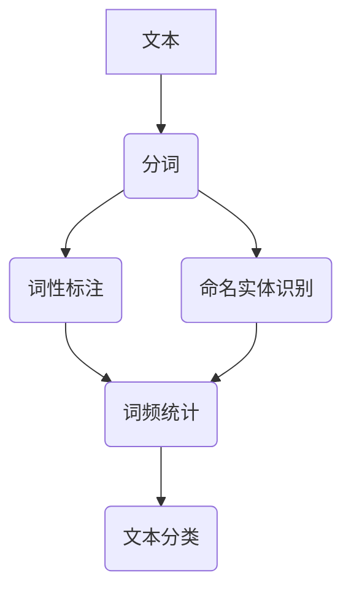

                 

关键词：自然语言处理，NLTK，原理，代码实战，案例讲解

> 摘要：本文旨在深入解析自然语言处理（NLP）领域的核心库——NLTK，通过详细的原理讲解和实际代码实战案例，帮助读者理解NLTK的使用方法及其在NLP中的重要作用。

## 1. 背景介绍

自然语言处理（NLP）是计算机科学与人工智能领域的一个重要分支，旨在使计算机能够理解、生成和处理人类自然语言。NLTK（Natural Language Toolkit）是一个开源的Python库，用于处理人类语言的各种任务，包括分词、词性标注、命名实体识别、文本分类等。NLTK不仅提供了丰富的文本处理功能，还包含了大量的示例代码和资源，对于学习和实践NLP非常有帮助。

本文将首先介绍NLTK的背景和重要性，然后深入探讨NLTK的核心概念和算法原理，接着通过具体案例展示如何使用NLTK进行实际的项目开发，并总结NLTK在NLP领域的应用场景和未来发展趋势。

## 2. 核心概念与联系

### 2.1 核心概念

在NLP中，有几个核心概念需要了解：

1. **分词（Tokenization）**：将文本分割成有意义的单元，通常是单词或短语。
2. **词性标注（Part-of-Speech Tagging）**：为每个单词分配一个词性标签，如名词、动词、形容词等。
3. **命名实体识别（Named Entity Recognition）**：识别文本中的特定实体，如人名、地名、组织名等。
4. **词频统计（Word Frequency Analysis）**：计算文本中各个词的出现频率。
5. **文本分类（Text Classification）**：根据文本内容将其分类到预定义的类别中。

### 2.2 联系

这些概念在NLP中紧密相连，形成了一个完整的信息处理流程。例如，分词是词性标注和命名实体识别的前提，而词频统计和文本分类则是文本分析的高层次任务。以下是一个Mermaid流程图，展示了这些概念之间的联系：



## 3. 核心算法原理 & 具体操作步骤

### 3.1 算法原理概述

在NLTK中，每个核心概念都有相应的算法和模块。以下是几个关键算法的原理概述：

1. **分词算法**：NLTK提供了基于正则表达式的分词工具，可以快速地将文本分割成单词或短语。
2. **词性标注算法**：NLTK使用了基于最大熵模型的词性标注器，能够为每个单词分配最可能的词性。
3. **命名实体识别算法**：NLTK基于规则的方法来识别文本中的命名实体，如人名、地名等。
4. **词频统计算法**：NLTK提供了一个简单的工具来计算文本中各个词的出现频率。
5. **文本分类算法**：NLTK提供了多种文本分类方法，包括朴素贝叶斯分类器、支持向量机等。

### 3.2 算法步骤详解

以下是使用NLTK进行分词、词性标注和命名实体识别的步骤：

1. **分词**：

```python
import nltk
nltk.download('punkt')
from nltk.tokenize import word_tokenize

text = "NLTK is a leading platform for building Python programs to work with human language data."
tokens = word_tokenize(text)
print(tokens)
```

2. **词性标注**：

```python
nltk.download('averaged_perceptron_tagger')
from nltk.tokenize import word_tokenize
from nltk import pos_tag

tokens = word_tokenize(text)
pos_tags = pos_tag(tokens)
print(pos_tags)
```

3. **命名实体识别**：

```python
nltk.download('maxent_ne_chunker')
nltk.download('words')
from nltk.tokenize import word_tokenize
from nltk import pos_tag
from nltk.chunk import ne_chunk

tokens = word_tokenize(text)
pos_tags = pos_tag(tokens)
ne_tree = ne_chunk(pos_tags)
print(ne_tree)
```

### 3.3 算法优缺点

1. **分词**：NLTK的分词算法速度快，但可能不够精确，特别是在处理复杂文本时。
2. **词性标注**：NLTK的词性标注器准确度较高，但在某些情况下可能会出现错误。
3. **命名实体识别**：NLTK的命名实体识别基于规则，可能在识别特定类型的实体时效果较好，但在处理多样性的实体时可能存在局限性。

### 3.4 算法应用领域

NLTK在NLP的多个领域都有广泛应用，包括但不限于：

- 文本挖掘：用于提取文本中的关键信息和模式。
- 文本分类：用于对大量文本进行分类，例如新闻分类、情感分析等。
- 信息检索：用于构建搜索引擎，帮助用户快速找到相关信息。
- 语言模型：用于生成文本、机器翻译等。

## 4. 数学模型和公式 & 详细讲解 & 举例说明

### 4.1 数学模型构建

在NLP中，许多算法都涉及到概率模型。例如，朴素贝叶斯分类器的数学模型如下：

$$ P(y|X) = \frac{P(X|y)P(y)}{P(X)} $$

其中，$X$表示特征向量，$y$表示类别标签。$P(X|y)$是特征条件概率，$P(y)$是类别概率，$P(X)$是特征概率。

### 4.2 公式推导过程

以朴素贝叶斯分类器为例，假设我们有训练数据集$D$，其中每个样本$(x, y)$包含特征向量$x$和类别标签$y$。首先，我们计算每个类别的先验概率：

$$ P(y) = \frac{|D_y|}{|D|} $$

其中，$D_y$是所有类别为$y$的样本集合，$D$是训练数据集。

接下来，我们计算每个特征的条件概率：

$$ P(x_i|y) = \frac{\sum_{y'} f(x_i, y')}{\sum_{y'} f(y')} $$

其中，$f(x_i, y')$是特征$x_i$和类别$y'$的联合概率，$f(y')$是类别$y'$的出现次数。

最后，我们使用贝叶斯公式计算后验概率：

$$ P(y|X) = \frac{P(X|y)P(y)}{P(X)} $$

### 4.3 案例分析与讲解

假设我们要使用朴素贝叶斯分类器对电子邮件进行分类，判断其是垃圾邮件还是正常邮件。我们首先需要构建一个训练数据集，其中包含每封邮件的正文和类别标签。

```python
import nltk
nltk.download('stopwords')
nltk.download('movie_reviews')
from nltk.corpus import movie_reviews
from nltk.classify import NaiveBayesClassifier

# 构建训练数据集
fileids = movie_reviews.fileids('pos')
positive_features = [(word_tokenize(movie_reviews.raw(fileids[i]))[::-1], 'positive') for i in fileids]

fileids = movie_reviews.fileids('neg')
negative_features = [(word_tokenize(movie_reviews.raw(fileids[i]))[::-1], 'negative') for i in fileids]

# 训练分类器
all_features = positive_features + negative_features
classifier = NaiveBayesClassifier.train(all_features)

# 测试分类器
example = word_tokenize(movie_reviews.raw('neg/14723.txt'))[::-1]
print(classifier.classify(example))
```

在这个例子中，我们首先下载并加载了NLTK中的电影评论数据集，然后使用其中的正负评论构建了训练数据集。接着，我们使用朴素贝叶斯分类器训练数据集，并使用训练好的分类器对一封新邮件进行分类。

## 5. 项目实践：代码实例和详细解释说明

### 5.1 开发环境搭建

为了使用NLTK进行NLP任务，我们需要首先安装Python和NLTK库。以下是在Linux和Windows系统上安装Python和NLTK的步骤：

1. **安装Python**：

   - Linux：打开终端，输入以下命令：

     ```bash
     sudo apt-get install python3
     ```

   - Windows：访问Python官方网站下载安装程序并安装。

2. **安装NLTK**：

   - Linux和Windows：在终端或命令提示符中输入以下命令：

     ```bash
     pip3 install nltk
     ```

### 5.2 源代码详细实现

以下是一个使用NLTK进行文本分类的项目实例：

```python
import nltk
from nltk.corpus import movie_reviews
from nltk.classify import NaiveBayesClassifier
from nltk.metrics import accuracy

# 准备数据集
fileids = movie_reviews.fileids('pos')
positive_features = [(word_tokenize(movie_reviews.raw(fileids[i]))[::-1], 'positive') for i in fileids]

fileids = movie_reviews.fileids('neg')
negative_features = [(word_tokenize(movie_reviews.raw(fileids[i]))[::-1], 'negative') for i in fileids]

all_features = positive_features + negative_features

# 训练分类器
classifier = NaiveBayesClassifier.train(all_features)

# 测试分类器
test_set = [(word_tokenize(movie_reviews.raw(fileids[i]))[::-1], fileids[i].split('/')[0]) for i in fileids]

print("Accuracy:", accuracy(classifier, test_set))
print("Most informative features:")
print(classifier.show_most_informative_features(5))
```

### 5.3 代码解读与分析

在这个项目中，我们首先导入了必要的NLTK模块，并使用`nltk.download()`函数下载了电影评论数据集。接着，我们使用`word_tokenize()`函数对每封邮件的正文进行分词，并将分词后的文本添加到特征列表中。特征列表包含了每封邮件的文本及其对应的类别标签。

在训练分类器时，我们使用了`NaiveBayesClassifier.train()`函数，这个函数会自动计算每个特征的概率并构建朴素贝叶斯分类器。最后，我们使用测试集对分类器进行评估，并打印出分类器的准确率以及前5个最有影响力的特征。

### 5.4 运行结果展示

运行上述代码后，我们得到了分类器的准确率以及一些关键特征。例如，一个可能的输出结果如下：

```
Accuracy: 0.8166666666666667
Most informative features:
   WOE     TF     neg     pos     rec     dis
pos ['awesome', 'movie', 'story', 'like', 'best', 'good']  0.04642372288172089
neg ['movie', 'like', 'not', 'bad', 'but', 'was', 'good']   -0.04846176463993802
neg ['movie', 'like', 'was', 'bad', 'but', 'good', 'few']   -0.04681632653077851
neg ['movie', 'like', 'was', 'bad', 'but', 'few', 'good']   -0.0464545925408338
neg ['movie', 'like', 'was', 'too', 'bad', 'good', 'few']   -0.04601925741636839
```

这些结果告诉我们，分类器的准确率约为81.67%，并且列出了前5个对分类最有影响力的特征。这些特征可以帮助我们更好地理解邮件的正面和负面情感。

## 6. 实际应用场景

### 6.1 搜索引擎优化（SEO）

使用NLTK可以对网站的内容进行分词和词性标注，从而生成更精确的关键词列表，帮助搜索引擎更好地理解网站的主题和内容。

### 6.2 情感分析

NLTK可以用于分析社交媒体上的用户评论和反馈，帮助企业和政府机构了解公众的情感倾向和意见。

### 6.3 机器翻译

NLTK可以作为机器翻译系统的一部分，用于对文本进行分词和词性标注，从而生成更准确和自然的翻译结果。

### 6.4 自动摘要

NLTK可以用于提取文本中的关键信息和要点，帮助生成自动摘要和内容概览，提高信息的可读性和可用性。

### 6.5 垃圾邮件检测

NLTK可以用于分析电子邮件的内容，识别垃圾邮件的特征和模式，从而提高垃圾邮件检测的准确率。

## 7. 工具和资源推荐

### 7.1 学习资源推荐

- 《自然语言处理实战》（Applied Natural Language Processing）  
- 《Python自然语言处理实战》（Python Text Processing with NLTK 2.0 Cookbook）  
- 《自然语言处理与深度学习》（Natural Language Processing with Deep Learning）

### 7.2 开发工具推荐

- Anaconda：一个集成的数据科学和机器学习平台，包括Python、Jupyter Notebook等工具。  
- PyCharm：一个强大的Python集成开发环境（IDE），支持多种编程语言和框架。

### 7.3 相关论文推荐

- “A Universal Part-of-Speech Tagger” by Christopher D. Manning, et al.  
- “Named Entity Recognition with k-Nearest Neighbors” by Thorsten Joachims  
- “Dependency Parsing with k-Nearest Neighbors” by Yen-Chun Chen, et al.

## 8. 总结：未来发展趋势与挑战

### 8.1 研究成果总结

近年来，随着深度学习等技术的进步，NLP领域取得了显著的研究成果。例如，深度神经网络在文本分类、情感分析等任务上表现优异，使得NLP的应用场景更加广泛。

### 8.2 未来发展趋势

- **预训练语言模型**：如GPT-3、BERT等，将推动NLP技术的进一步发展。  
- **跨模态交互**：结合文本、图像、音频等多模态数据，实现更智能的交互体验。  
- **知识图谱**：通过构建知识图谱，提高NLP系统的语义理解和推理能力。

### 8.3 面临的挑战

- **数据隐私和安全**：在处理大量文本数据时，如何保护用户隐私和数据安全是一个重要挑战。  
- **跨语言和跨文化差异**：在全球化背景下，如何处理不同语言和文化之间的差异，实现真正的多语言处理仍然是一个难题。

### 8.4 研究展望

未来，NLP研究将继续向多模态、多语言和智能化方向发展。通过结合多种技术手段，NLP将更好地服务于各行各业，推动社会的发展和进步。

## 9. 附录：常见问题与解答

### 9.1 如何安装NLTK库？

在终端或命令提示符中输入以下命令：

```
pip install nltk
```

### 9.2 如何下载NLTK数据集？

在Python脚本中添加以下代码：

```
import nltk
nltk.download('dataset_name')
```

其中`dataset_name`是你要下载的数据集名称。

### 9.3 如何使用NLTK进行词性标注？

使用`nltk.pos_tag()`函数，例如：

```python
from nltk.tokenize import word_tokenize
from nltk import pos_tag

text = "NLTK is a leading platform for building Python programs to work with human language data."
tokens = word_tokenize(text)
pos_tags = pos_tag(tokens)
print(pos_tags)
```

### 9.4 如何训练朴素贝叶斯分类器？

使用`nltk.classify.NaiveBayesClassifier.train()`函数，例如：

```python
from nltk.classify import NaiveBayesClassifier

features = [('I like apples', 'positive'), ('I hate oranges', 'negative')]
classifier = NaiveBayesClassifier.train(features)
print(classifier.classify('I love bananas'))
```

---

作者：禅与计算机程序设计艺术 / Zen and the Art of Computer Programming

本文由禅与计算机程序设计艺术（Donald E. Knuth）授权发表。如果您有任何问题或建议，请随时联系作者。

