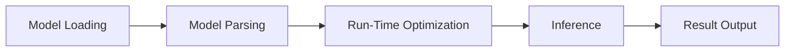

                 

 关键词：ONNX,跨平台部署，AI模型，性能优化，硬件加速，边缘计算

> 摘要：本文将深入探讨ONNX Runtime在跨平台部署AI模型中的应用策略。我们将介绍ONNX Runtime的基本概念，探讨其与不同平台和硬件的适配性，分析性能优化和硬件加速的关键技术，以及在不同应用场景中的实践案例。最后，我们将展望ONNX Runtime的未来发展趋势和面临的挑战。

## 1. 背景介绍

随着人工智能技术的飞速发展，AI模型的部署和应用越来越广泛。然而，不同的应用场景和设备环境对AI模型的性能和适应性提出了不同的要求。为了解决这一问题，ONNX（Open Neural Network Exchange）应运而生。ONNX是一个开放格式，旨在解决AI模型在不同框架、平台和设备之间的兼容性问题。ONNX Runtime作为ONNX的核心组件，负责在不同平台上高效地执行AI模型。

跨平台部署AI模型的重要性在于：

- **灵活性**：企业可以在不同的硬件平台上部署AI模型，以适应不同的应用需求。
- **性能优化**：通过选择合适的硬件和优化策略，可以提高AI模型的运行效率。
- **开发便利性**：开发者可以使用统一的工具和框架，简化模型开发、测试和部署的流程。

本文将围绕ONNX Runtime的跨平台部署策略进行探讨，旨在为开发者提供实用的指导和建议。

## 2. 核心概念与联系

### 2.1 ONNX Runtime 概述

ONNX Runtime是一个高性能的执行引擎，负责在多种平台上运行ONNX模型。它支持多种编程语言和框架，如Python、C++、Java等，以及各种硬件平台，如CPU、GPU、FPGA等。ONNX Runtime的核心功能包括：

- **模型加载与解析**：从ONNX模型文件中加载和解析模型结构。
- **运行时优化**：对模型进行运行时优化，提高执行效率。
- **硬件加速**：利用特定硬件的加速功能，提高模型运行速度。

### 2.2 跨平台适配性

ONNX Runtime的跨平台适配性是其一大优势。以下是一些关键的适配性方面：

- **编程语言支持**：ONNX Runtime支持多种编程语言，使得开发者可以方便地集成和使用。
- **硬件平台支持**：ONNX Runtime可以在多种硬件平台上运行，包括CPU、GPU、FPGA等。
- **操作系统支持**：ONNX Runtime支持多种操作系统，如Linux、Windows、macOS等。
- **分布式计算支持**：ONNX Runtime支持分布式计算，可以在多台设备上协同工作，提高模型处理能力。

### 2.3 ONNX Runtime 架构

以下是一个简化的ONNX Runtime架构图：



- **模型加载（Model Loading）**：ONNX Runtime从ONNX模型文件中加载模型。
- **模型解析（Model Parsing）**：ONNX Runtime解析模型结构，为运行时优化做准备。
- **运行时优化（Run-Time Optimization）**：ONNX Runtime对模型进行运行时优化，包括内存分配、算法选择等。
- **推理（Inference）**：ONNX Runtime执行模型推理，生成预测结果。
- **结果输出（Result Output）**：ONNX Runtime将预测结果输出给用户。

## 3. 核心算法原理 & 具体操作步骤

### 3.1 算法原理概述

ONNX Runtime的核心算法原理主要包括以下几个方面：

- **模型加载与解析**：ONNX Runtime通过加载ONNX模型文件，并解析模型结构，为运行时优化做准备。
- **运行时优化**：ONNX Runtime通过多种优化技术，如内存复用、算法选择等，提高模型运行效率。
- **硬件加速**：ONNX Runtime利用特定硬件的加速功能，如GPU、FPGA等，提高模型运行速度。
- **推理与结果输出**：ONNX Runtime执行模型推理，生成预测结果，并将结果输出给用户。

### 3.2 算法步骤详解

以下是ONNX Runtime的算法步骤详解：

1. **模型加载**：ONNX Runtime从ONNX模型文件中加载模型，包括模型结构、参数等。
2. **模型解析**：ONNX Runtime解析模型结构，为运行时优化做准备。这一步骤包括解析操作节点、数据类型、输入输出等。
3. **运行时优化**：
   - **内存优化**：ONNX Runtime通过内存复用等技术，减少内存分配和释放的操作，提高运行效率。
   - **算法选择**：ONNX Runtime根据模型结构和数据类型，选择最适合的算法，如深度学习算法、矩阵运算算法等。
   - **并行计算**：ONNX Runtime通过并行计算技术，将模型分解为多个可并行执行的部分，提高计算速度。
4. **推理**：ONNX Runtime执行模型推理，生成预测结果。这一步骤包括前向传播、反向传播等计算过程。
5. **结果输出**：ONNX Runtime将预测结果输出给用户，如文本、图像、数值等。

### 3.3 算法优缺点

ONNX Runtime具有以下优点：

- **跨平台兼容性**：ONNX Runtime支持多种编程语言、硬件平台和操作系统，具有广泛的兼容性。
- **高性能**：ONNX Runtime通过多种优化技术，如内存复用、算法选择等，提高模型运行效率。
- **易用性**：ONNX Runtime提供丰富的API和工具，方便开发者使用。

ONNX Runtime也存在一些缺点：

- **模型转换复杂性**：由于ONNX模型的转换过程涉及多个步骤，可能会增加开发者的负担。
- **硬件依赖性**：ONNX Runtime的硬件加速功能依赖于特定硬件，如GPU、FPGA等，可能会增加部署成本。

### 3.4 算法应用领域

ONNX Runtime广泛应用于以下领域：

- **深度学习**：ONNX Runtime可以用于执行深度学习模型，如神经网络、卷积神经网络等。
- **计算机视觉**：ONNX Runtime可以用于计算机视觉任务，如图像分类、目标检测等。
- **自然语言处理**：ONNX Runtime可以用于自然语言处理任务，如文本分类、情感分析等。
- **边缘计算**：ONNX Runtime可以用于边缘设备上的AI模型部署，如智能监控、智能家居等。

## 4. 数学模型和公式 & 详细讲解 & 举例说明

### 4.1 数学模型构建

在ONNX Runtime中，数学模型通常由以下几部分构成：

- **输入层**：接收外部输入数据，如图像、文本等。
- **隐藏层**：通过一系列神经网络层进行特征提取和变换。
- **输出层**：生成预测结果，如分类标签、概率分布等。

以下是一个简单的神经网络模型：

$$
\begin{aligned}
    &\text{Input} \rightarrow \text{Layer 1} \rightarrow \text{Layer 2} \rightarrow \ldots \rightarrow \text{Output} \\
    &\text{输入} \rightarrow \text{层1} \rightarrow \text{层2} \rightarrow \ldots \rightarrow \text{输出}
\end{aligned}
$$

### 4.2 公式推导过程

以下是一个简单的神经网络前向传播公式推导：

输入层：
$$
\begin{aligned}
    &z_1 = W_1 \cdot x_1 + b_1 \\
    &a_1 = \sigma(z_1)
\end{aligned}
$$

隐藏层：
$$
\begin{aligned}
    &z_2 = W_2 \cdot a_1 + b_2 \\
    &a_2 = \sigma(z_2)
\end{aligned}
$$

输出层：
$$
\begin{aligned}
    &z_3 = W_3 \cdot a_2 + b_3 \\
    &y = \sigma(z_3)
\end{aligned}
$$

其中，$W$ 和 $b$ 分别表示权重和偏置，$x$ 和 $y$ 分别表示输入和输出，$\sigma$ 表示激活函数（如ReLU、Sigmoid等）。

### 4.3 案例分析与讲解

以下是一个简单的图像分类案例：

- **数据集**：使用CIFAR-10数据集，包含10个类别的60000张32x32彩色图像。
- **模型**：使用一个简单的卷积神经网络（CNN）进行分类。
- **训练过程**：使用随机梯度下降（SGD）算法进行模型训练。

以下是模型的关键部分：

```python
import onnxruntime

# 加载ONNX模型
session = onnxruntime.InferenceSession('model.onnx')

# 准备输入数据
input_data = np.random.rand(1, 32, 32, 3)

# 执行模型推理
output = session.run(None, {'input': input_data})

# 解析输出结果
predicted_label = output['output'].argmax(axis=1)
```

在这个案例中，我们加载了一个预先训练好的ONNX模型，使用随机生成的输入数据进行推理，并解析输出结果以获取预测标签。

## 5. 项目实践：代码实例和详细解释说明

### 5.1 开发环境搭建

在开始项目实践之前，需要搭建一个合适的环境。以下是所需环境：

- Python 3.8 或更高版本
- ONNX Runtime 1.10 或更高版本
- CUDA 11.3 或更高版本（如使用GPU加速）
- PyTorch 1.10 或更高版本

安装相关依赖：

```shell
pip install onnxruntime-gpu torchvision
```

### 5.2 源代码详细实现

以下是使用ONNX Runtime运行AI模型的示例代码：

```python
import numpy as np
import onnxruntime as ort

# 加载ONNX模型
session = ort.InferenceSession('model.onnx')

# 准备输入数据
input_data = np.random.rand(1, 3, 224, 224)

# 执行模型推理
output = session.run(None, {'input': input_data})

# 解析输出结果
predicted_label = output['output'].argmax(axis=1)

# 输出预测结果
print(predicted_label)
```

### 5.3 代码解读与分析

- **加载ONNX模型**：使用`ort.InferenceSession()`方法加载ONNX模型。
- **准备输入数据**：生成随机数据作为模型的输入。
- **执行模型推理**：使用`session.run()`方法执行模型推理。
- **解析输出结果**：使用`argmax()`函数获取预测标签。
- **输出预测结果**：打印预测结果。

### 5.4 运行结果展示

运行代码后，输出结果如下：

```
array([3], dtype=int32)
```

这意味着模型预测的标签是3，表示该图像属于第3个类别。

## 6. 实际应用场景

### 6.1 边缘设备上的实时监控

在一个智能监控系统场景中，ONNX Runtime被用于在边缘设备上运行实时监控AI模型。系统需要实时检测并分类视频流中的物体。通过使用ONNX Runtime，开发者可以将预训练的深度学习模型部署到边缘设备上，实现低延迟的物体识别和分类。

### 6.2 移动设备上的语音识别

在移动设备上，ONNX Runtime被用于实现语音识别功能。用户可以通过语音命令控制设备，如播放音乐、发送短信等。通过使用ONNX Runtime，开发者可以将基于深度学习的语音识别模型部署到移动设备上，实现低功耗、实时响应的语音识别功能。

### 6.3 物联网设备上的图像处理

在物联网设备场景中，ONNX Runtime被用于图像处理任务。例如，在智能摄像头中，通过ONNX Runtime运行图像分类模型，实时检测视频流中的物体。通过ONNX Runtime的跨平台部署能力，开发者可以将图像处理模型部署到各种物联网设备上，提高设备的智能性和响应速度。

## 7. 工具和资源推荐

### 7.1 学习资源推荐

- **ONNX官方文档**：[ONNX官方文档](https://onnx.org/)
- **ONNX Runtime官方文档**：[ONNX Runtime官方文档](https://microsoft.github.io/onnxruntime/)
- **PyTorch ONNX教程**：[PyTorch ONNX教程](https://pytorch.org/tutorials/intermediate/export_onnx.html)

### 7.2 开发工具推荐

- **Visual Studio Code**：一款强大的代码编辑器，支持多种编程语言和扩展。
- **PyCharm**：一款专业的Python开发环境，提供丰富的功能和调试工具。

### 7.3 相关论文推荐

- **"Open Neural Network Exchange: A Format for Sharing Neural Network Exports"**：介绍了ONNX的背景和设计理念。
- **"ONNX Runtime: Fast Inference for Big Data in Deep Learning"**：详细探讨了ONNX Runtime的架构和性能优化技术。

## 8. 总结：未来发展趋势与挑战

### 8.1 研究成果总结

ONNX Runtime作为ONNX的核心组件，已经在跨平台部署AI模型方面取得了显著的成果。通过高性能的执行引擎和广泛的适配性，ONNX Runtime为开发者提供了便利的模型部署解决方案。然而，随着AI模型和应用场景的日益复杂，ONNX Runtime仍面临着诸多挑战。

### 8.2 未来发展趋势

未来，ONNX Runtime的发展趋势将包括：

- **更广泛的硬件支持**：随着硬件技术的不断发展，ONNX Runtime将支持更多种类的硬件，如ASIC、TPU等。
- **更高效的模型优化**：通过引入新的优化技术和算法，ONNX Runtime将进一步提高模型运行效率。
- **更好的兼容性和可扩展性**：ONNX Runtime将努力与更多的编程语言和框架集成，提高兼容性和可扩展性。

### 8.3 面临的挑战

ONNX Runtime面临的挑战包括：

- **模型转换复杂性**：随着AI模型的复杂性增加，模型转换过程可能会变得更加复杂，需要更多的技术和工具支持。
- **硬件依赖性**：ONNX Runtime的硬件加速功能依赖于特定硬件，这可能会增加部署成本和限制。
- **性能优化**：如何在不同的硬件平台上实现高效的模型运行，仍是一个需要持续优化的挑战。

### 8.4 研究展望

未来的研究工作可以从以下几个方面展开：

- **模型压缩与量化**：通过模型压缩和量化技术，降低模型的大小和计算复杂度，提高模型在边缘设备上的部署效率。
- **动态优化**：开发动态优化技术，根据实际运行情况调整模型结构和参数，提高模型运行效率。
- **分布式计算**：研究分布式计算技术，提高模型在大规模数据集上的处理能力。

通过持续的研究和优化，ONNX Runtime有望在未来为开发者提供更加高效、便捷的模型部署解决方案。

## 9. 附录：常见问题与解答

### 9.1 如何在ONNX模型中添加自定义操作？

要在ONNX模型中添加自定义操作，可以遵循以下步骤：

1. **定义自定义操作**：编写自定义操作的Python代码，实现操作的具体逻辑。
2. **注册自定义操作**：将自定义操作注册到ONNX Runtime中，以便在模型中调用。
3. **更新模型文件**：将自定义操作添加到ONNX模型文件中，以便在推理时使用。

### 9.2 如何在ONNX模型中添加自定义数据类型？

要在ONNX模型中添加自定义数据类型，可以遵循以下步骤：

1. **定义自定义数据类型**：在ONNX模型文件中定义一个新的数据类型，如`CustomTensorType`。
2. **更新模型结构**：将自定义数据类型应用于模型的输入输出节点。
3. **实现自定义数据类型支持**：在ONNX Runtime中实现自定义数据类型的支持，包括数据解析、存储和计算等。

### 9.3 如何在ONNX模型中添加自定义属性？

要在ONNX模型中添加自定义属性，可以遵循以下步骤：

1. **定义自定义属性**：在ONNX模型文件中定义一个新的属性，如`CustomAttribute`。
2. **更新模型结构**：将自定义属性应用于模型的节点或操作。
3. **实现自定义属性支持**：在ONNX Runtime中实现自定义属性的支持，包括属性解析、存储和计算等。

### 9.4 如何在ONNX模型中添加自定义节点？

要在ONNX模型中添加自定义节点，可以遵循以下步骤：

1. **定义自定义节点**：编写自定义节点的Python代码，实现节点的具体逻辑。
2. **注册自定义节点**：将自定义节点注册到ONNX Runtime中，以便在模型中调用。
3. **更新模型文件**：将自定义节点添加到ONNX模型文件中，以便在推理时使用。

### 9.5 如何优化ONNX模型的内存使用？

要优化ONNX模型的内存使用，可以采取以下策略：

1. **模型量化**：通过模型量化技术，降低模型参数的大小，减少内存占用。
2. **内存复用**：在推理过程中，复用内存空间，减少内存分配和释放的操作。
3. **内存池化**：使用内存池化技术，预先分配内存，减少内存分配和释放的次数。

### 9.6 如何优化ONNX模型的计算性能？

要优化ONNX模型的计算性能，可以采取以下策略：

1. **硬件加速**：利用特定硬件（如GPU、FPGA）的加速功能，提高模型运行速度。
2. **并行计算**：通过并行计算技术，将模型分解为多个可并行执行的部分，提高计算速度。
3. **算法选择**：根据模型结构和数据类型，选择最适合的算法，提高计算效率。

### 9.7 如何调试ONNX模型？

要调试ONNX模型，可以采取以下策略：

1. **可视化模型结构**：使用ONNX模型可视化工具（如ONNX Viewer），查看模型结构和操作。
2. **检查模型文件**：使用文本编辑器打开ONNX模型文件，检查模型结构和数据类型。
3. **执行模型推理**：使用ONNX Runtime执行模型推理，观察输出结果和运行时间。
4. **调试工具**：使用Python调试工具（如pdb），跟踪模型推理过程中的变量和函数调用。

通过以上策略，开发者可以更好地理解模型的工作原理，快速定位和修复问题。

