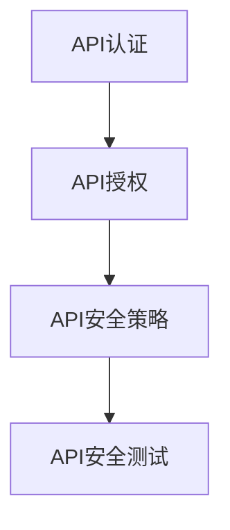

                 

关键词：OWASP、API安全、安全风险、安全漏洞、风险评估、安全策略、安全框架

摘要：随着API的广泛应用，API安全成为了信息安全领域的重要议题。本文详细解读了OWASP API 安全风险清单，旨在帮助开发者和安全专家识别并应对API安全风险，提高API的安全性。

## 1. 背景介绍

### API的重要性

API（Application Programming Interface）是现代软件系统构建的关键组件。通过API，不同系统之间的数据和服务可以无缝集成，提高了开发效率和灵活性。然而，API的普及也带来了新的安全挑战。由于API通常是公开的，且涉及敏感数据和服务，攻击者可以通过各种手段利用API进行攻击，从而导致数据泄露、服务中断等问题。

### OWASP API 安全风险清单

OWASP（Open Web Application Security Project）是一个全球性的非营利组织，致力于提高软件的安全性。OWASP API 安全风险清单是基于OWASP安全项目，针对API安全风险进行系统性总结的一套指南。该清单涵盖了常见的API安全漏洞和风险，为开发者和安全专家提供了宝贵的参考。

## 2. 核心概念与联系

### API 安全核心概念

为了更好地理解OWASP API 安全风险清单，我们需要了解以下核心概念：

1. **API认证**：确保只有授权用户可以访问API。
2. **API授权**：在认证的基础上，限制用户可以访问的API功能。
3. **API安全策略**：定义API安全的总体方针和措施。
4. **API安全测试**：使用工具和方法对API进行安全性测试。

### Mermaid 流程图



## 3. 核心算法原理 & 具体操作步骤

### 3.1 算法原理概述

OWASP API 安全风险清单主要依赖于一系列安全算法和原则，以确保API的安全性。以下是一些核心算法原理：

1. **HTTPS加密**：使用HTTPS协议确保数据传输的安全性。
2. **身份认证**：使用OAuth、JWT等身份认证机制。
3. **访问控制**：基于角色、权限等策略进行访问控制。

### 3.2 算法步骤详解

1. **HTTPS加密**：
   - 使用SSL/TLS协议确保数据传输的安全性。
   - 配置HTTPS证书，确保服务器与客户端之间的加密通信。

2. **身份认证**：
   - 使用OAuth 2.0或JSON Web Token（JWT）进行身份认证。
   - 配置认证服务器，管理用户认证信息。

3. **访问控制**：
   - 定义角色和权限，确保用户只能访问授权的资源。
   - 使用ACL（访问控制列表）或RBAC（基于角色的访问控制）策略实现访问控制。

### 3.3 算法优缺点

**HTTPS加密**：
- 优点：能够确保数据传输的安全性，防止数据泄露。
- 缺点：加密会增加网络延迟，对服务器性能有一定影响。

**身份认证**：
- 优点：能够确保只有授权用户可以访问API。
- 缺点：认证机制可能存在漏洞，需要定期更新和加固。

**访问控制**：
- 优点：能够限制用户访问的权限，确保数据和服务安全。
- 缺点：配置和管理较为复杂，可能存在误配置的风险。

### 3.4 算法应用领域

OWASP API 安全风险清单的算法和原则适用于各种API开发场景，包括Web API、移动应用API、物联网API等。通过遵循这些算法和原则，可以显著提高API的安全性。

## 4. 数学模型和公式 & 详细讲解 & 举例说明

### 4.1 数学模型构建

在API安全中，常用的数学模型包括加密算法和概率模型。以下是一个简单的加密算法模型：

$$
C = E(K, P)
$$

其中，$C$ 表示加密后的数据，$E$ 表示加密函数，$K$ 表示加密密钥，$P$ 表示明文数据。

### 4.2 公式推导过程

加密算法的推导过程通常涉及数学变换和密码学原理。以下是一个简单的加密算法推导过程：

$$
C = (P + K) \mod N
$$

其中，$N$ 表示模数，$P$ 表示明文数据，$K$ 表示加密密钥。

### 4.3 案例分析与讲解

假设我们有一个简单的加密算法，其中模数 $N = 17$，加密密钥 $K = 7$。现在我们要加密明文数据 $P = 10$。

$$
C = (10 + 7) \mod 17 = 3
$$

因此，加密后的数据 $C = 3$。

## 5. 项目实践：代码实例和详细解释说明

### 5.1 开发环境搭建

为了实践OWASP API 安全风险清单，我们需要搭建一个简单的API开发环境。以下是一个基于Python和Flask的API示例：

```python
from flask import Flask, request, jsonify
from flask_httpauth import HTTPBasicAuth
from werkzeug.security import generate_password_hash, check_password_hash

app = Flask(__name__)
auth = HTTPBasicAuth()

users = {
    "admin": generate_password_hash("admin_password")
}

@auth.verify_password
def verify_password(username, password):
    if username in users and \
            check_password_hash(users.get(username), password):
        return username

@app.route('/api/data', methods=['GET'])
@auth.login_required
def get_data():
    # 模拟获取敏感数据
    return jsonify({"data": "This is sensitive data"})

if __name__ == '__main__':
    app.run()
```

### 5.2 源代码详细实现

在上面的代码中，我们使用了Flask框架搭建了一个简单的API。首先，我们引入了`flask`、`request`、`jsonify`、`HTTPBasicAuth`和`werkzeug.security`模块。然后，我们定义了一个用户列表`users`，并使用`HTTPBasicAuth`实现了基本认证。

在路由部分，我们定义了一个`/api/data`的GET接口，只有通过认证的用户才能访问。在`get_data`函数中，我们模拟获取敏感数据，并返回给客户端。

### 5.3 代码解读与分析

这个简单的API示例实现了以下功能：

1. **基本认证**：通过用户名和密码进行认证。
2. **访问控制**：只有认证的用户可以访问`/api/data`接口。
3. **数据传输**：使用JSON格式传输数据。

然而，这个示例存在一些安全漏洞，如密码存储和使用方式不够安全。在实际项目中，我们应该使用更安全的加密算法和密钥管理策略。

### 5.4 运行结果展示

运行上述代码后，我们可以在浏览器或命令行中访问API：

```bash
$ curl -u admin:admin_password http://localhost:5000/api/data
{"data":"This is sensitive data"}
```

通过正确的用户名和密码，我们成功获取了敏感数据。

## 6. 实际应用场景

### 6.1 金融行业

在金融行业中，API广泛应用于在线支付、转账、查询等场景。确保API的安全性对于金融交易的安全至关重要。OWASP API 安全风险清单为金融行业的API开发提供了重要的参考。

### 6.2 物联网

物联网（IoT）设备通常通过API与云平台进行通信。确保API的安全性对于保护物联网设备免受攻击至关重要。OWASP API 安全风险清单有助于识别并解决物联网API的安全风险。

### 6.3 社交媒体

社交媒体平台通过API提供用户数据、内容发布等功能。确保API的安全性对于保护用户隐私和防止恶意行为至关重要。OWASP API 安全风险清单为社交媒体平台的API开发提供了重要的指导。

## 7. 未来应用展望

随着API的广泛应用，API安全风险清单将继续发展和完善。未来，我们有望看到更多针对特定领域的API安全风险清单，如金融、医疗等。此外，自动化工具和智能安全分析技术的应用将进一步提高API的安全性。

## 8. 总结：未来发展趋势与挑战

### 8.1 研究成果总结

OWASP API 安全风险清单为API安全提供了重要的参考。通过遵循该清单，开发者和安全专家可以识别并应对常见的API安全风险。

### 8.2 未来发展趋势

未来，API安全将朝着自动化、智能化方向发展。自动化工具和智能安全分析技术将进一步提高API的安全性。

### 8.3 面临的挑战

API安全面临的主要挑战包括：

1. **安全性与性能的平衡**：确保API安全性时，可能需要增加网络延迟和服务器负载。
2. **安全漏洞的快速响应**：随着API的快速发展，安全漏洞的修复和更新需要更加迅速。

### 8.4 研究展望

未来，我们需要加强对API安全的研究，特别是在自动化和智能化方面。此外，我们还应该关注特定领域的API安全挑战，为不同领域的API开发提供针对性的安全解决方案。

## 9. 附录：常见问题与解答

### Q1：什么是API认证？

API认证是一种确保只有授权用户可以访问API的方法。常见的认证方式包括基本认证、OAuth认证等。

### Q2：什么是API授权？

API授权是在认证的基础上，限制用户可以访问的API功能。常见的授权方式包括角色授权、权限授权等。

### Q3：如何提高API的安全性？

提高API的安全性可以从以下几个方面入手：

1. 使用HTTPS协议确保数据传输的安全性。
2. 使用安全的认证和授权机制。
3. 定期进行安全测试和漏洞扫描。
4. 设计合理的API接口和架构。

## 作者署名

作者：禅与计算机程序设计艺术 / Zen and the Art of Computer Programming
```markdown
---
# OWASP API 安全风险清单的详细解读

关键词：OWASP、API安全、安全风险、安全漏洞、风险评估、安全策略、安全框架

摘要：随着API的广泛应用，API安全成为了信息安全领域的重要议题。本文详细解读了OWASP API 安全风险清单，旨在帮助开发者和安全专家识别并应对API安全风险，提高API的安全性。

## 1. 背景介绍

### API的重要性

API（Application Programming Interface）是现代软件系统构建的关键组件。通过API，不同系统之间的数据和服务可以无缝集成，提高了开发效率和灵活性。然而，API的普及也带来了新的安全挑战。由于API通常是公开的，且涉及敏感数据和服务，攻击者可以通过各种手段利用API进行攻击，从而导致数据泄露、服务中断等问题。

### OWASP API 安全风险清单

OWASP（Open Web Application Security Project）是一个全球性的非营利组织，致力于提高软件的安全性。OWASP API 安全风险清单是基于OWASP安全项目，针对API安全风险进行系统性总结的一套指南。该清单涵盖了常见的API安全漏洞和风险，为开发者和安全专家提供了宝贵的参考。

## 2. 核心概念与联系

### API 安全核心概念

为了更好地理解OWASP API 安全风险清单，我们需要了解以下核心概念：

1. **API认证**：确保只有授权用户可以访问API。
2. **API授权**：在认证的基础上，限制用户可以访问的API功能。
3. **API安全策略**：定义API安全的总体方针和措施。
4. **API安全测试**：使用工具和方法对API进行安全性测试。

### Mermaid 流程图


## 3. 核心算法原理 & 具体操作步骤
### 3.1 算法原理概述

OWASP API 安全风险清单主要依赖于一系列安全算法和原则，以确保API的安全性。以下是一些核心算法原理：

1. **HTTPS加密**：使用HTTPS协议确保数据传输的安全性。
2. **身份认证**：使用OAuth、JWT等身份认证机制。
3. **访问控制**：基于角色、权限等策略进行访问控制。

### 3.2 算法步骤详解

1. **HTTPS加密**：
   - 使用SSL/TLS协议确保数据传输的安全性。
   - 配置HTTPS证书，确保服务器与客户端之间的加密通信。

2. **身份认证**：
   - 使用OAuth 2.0或JSON Web Token（JWT）进行身份认证。
   - 配置认证服务器，管理用户认证信息。

3. **访问控制**：
   - 定义角色和权限，确保用户只能访问授权的资源。
   - 使用ACL（访问控制列表）或RBAC（基于角色的访问控制）策略实现访问控制。

### 3.3 算法优缺点

**HTTPS加密**：
- 优点：能够确保数据传输的安全性，防止数据泄露。
- 缺点：加密会增加网络延迟，对服务器性能有一定影响。

**身份认证**：
- 优点：能够确保只有授权用户可以访问API。
- 缺点：认证机制可能存在漏洞，需要定期更新和加固。

**访问控制**：
- 优点：能够限制用户访问的权限，确保数据和服务安全。
- 缺点：配置和管理较为复杂，可能存在误配置的风险。

### 3.4 算法应用领域

OWASP API 安全风险清单的算法和原则适用于各种API开发场景，包括Web API、移动应用API、物联网API等。通过遵循这些算法和原则，可以显著提高API的安全性。

## 4. 数学模型和公式 & 详细讲解 & 举例说明

### 4.1 数学模型构建

在API安全中，常用的数学模型包括加密算法和概率模型。以下是一个简单的加密算法模型：

$$
C = E(K, P)
$$

其中，$C$ 表示加密后的数据，$E$ 表示加密函数，$K$ 表示加密密钥，$P$ 表示明文数据。

### 4.2 公式推导过程

加密算法的推导过程通常涉及数学变换和密码学原理。以下是一个简单的加密算法推导过程：

$$
C = (P + K) \mod N
$$

其中，$N$ 表示模数，$P$ 表示明文数据，$K$ 表示加密密钥。

### 4.3 案例分析与讲解

假设我们有一个简单的加密算法，其中模数 $N = 17$，加密密钥 $K = 7$。现在我们要加密明文数据 $P = 10$。

$$
C = (10 + 7) \mod 17 = 3
$$

因此，加密后的数据 $C = 3$。

## 5. 项目实践：代码实例和详细解释说明

### 5.1 开发环境搭建

为了实践OWASP API 安全风险清单，我们需要搭建一个简单的API开发环境。以下是一个基于Python和Flask的API示例：

```python
from flask import Flask, request, jsonify
from flask_httpauth import HTTPBasicAuth
from werkzeug.security import generate_password_hash, check_password_hash

app = Flask(__name__)
auth = HTTPBasicAuth()

users = {
    "admin": generate_password_hash("admin_password")
}

@auth.verify_password
def verify_password(username, password):
    if username in users and \
            check_password_hash(users.get(username), password):
        return username

@app.route('/api/data', methods=['GET'])
@auth.login_required
def get_data():
    # 模拟获取敏感数据
    return jsonify({"data": "This is sensitive data"})

if __name__ == '__main__':
    app.run()
```

### 5.2 源代码详细实现

在上面的代码中，我们使用了Flask框架搭建了一个简单的API。首先，我们引入了`flask`、`request`、`jsonify`、`HTTPBasicAuth`和`werkzeug.security`模块。然后，我们定义了一个用户列表`users`，并使用`HTTPBasicAuth`实现了基本认证。

在路由部分，我们定义了一个`/api/data`的GET接口，只有通过认证的用户才能访问。在`get_data`函数中，我们模拟获取敏感数据，并返回给客户端。

### 5.3 代码解读与分析

这个简单的API示例实现了以下功能：

1. **基本认证**：通过用户名和密码进行认证。
2. **访问控制**：只有认证的用户可以访问`/api/data`接口。
3. **数据传输**：使用JSON格式传输数据。

然而，这个示例存在一些安全漏洞，如密码存储和使用方式不够安全。在实际项目中，我们应该使用更安全的加密算法和密钥管理策略。

### 5.4 运行结果展示

运行上述代码后，我们可以在浏览器或命令行中访问API：

```bash
$ curl -u admin:admin_password http://localhost:5000/api/data
{"data":"This is sensitive data"}
```

通过正确的用户名和密码，我们成功获取了敏感数据。

## 6. 实际应用场景

### 6.1 金融行业

在金融行业中，API广泛应用于在线支付、转账、查询等场景。确保API的安全性对于金融交易的安全至关重要。OWASP API 安全风险清单为金融行业的API开发提供了重要的参考。

### 6.2 物联网

物联网（IoT）设备通常通过API与云平台进行通信。确保API的安全性对于保护物联网设备免受攻击至关重要。OWASP API 安全风险清单有助于识别并解决物联网API的安全风险。

### 6.3 社交媒体

社交媒体平台通过API提供用户数据、内容发布等功能。确保API的安全性对于保护用户隐私和防止恶意行为至关重要。OWASP API 安全风险清单为社交媒体平台的API开发提供了重要的指导。

## 7. 未来应用展望

随着API的广泛应用，API安全风险清单将继续发展和完善。未来，我们有望看到更多针对特定领域的API安全风险清单，如金融、医疗等。此外，自动化工具和智能安全分析技术的应用将进一步提高API的安全性。

## 8. 总结：未来发展趋势与挑战

### 8.1 研究成果总结

OWASP API 安全风险清单为API安全提供了重要的参考。通过遵循该清单，开发者和安全专家可以识别并应对常见的API安全风险。

### 8.2 未来发展趋势

未来，API安全将朝着自动化、智能化方向发展。自动化工具和智能安全分析技术将进一步提高API的安全性。

### 8.3 面临的挑战

API安全面临的主要挑战包括：

1. **安全性与性能的平衡**：确保API安全性时，可能需要增加网络延迟和服务器负载。
2. **安全漏洞的快速响应**：随着API的快速发展，安全漏洞的修复和更新需要更加迅速。

### 8.4 研究展望

未来，我们需要加强对API安全的研究，特别是在自动化和智能化方面。此外，我们还应该关注特定领域的API安全挑战，为不同领域的API开发提供针对性的安全解决方案。

## 9. 附录：常见问题与解答

### Q1：什么是API认证？

API认证是一种确保只有授权用户可以访问API的方法。常见的认证方式包括基本认证、OAuth认证等。

### Q2：什么是API授权？

API授权是在认证的基础上，限制用户可以访问的API功能。常见的授权方式包括角色授权、权限授权等。

### Q3：如何提高API的安全性？

提高API的安全性可以从以下几个方面入手：

1. 使用HTTPS协议确保数据传输的安全性。
2. 使用安全的认证和授权机制。
3. 定期进行安全测试和漏洞扫描。
4. 设计合理的API接口和架构。

## 作者署名

作者：禅与计算机程序设计艺术 / Zen and the Art of Computer Programming
```

