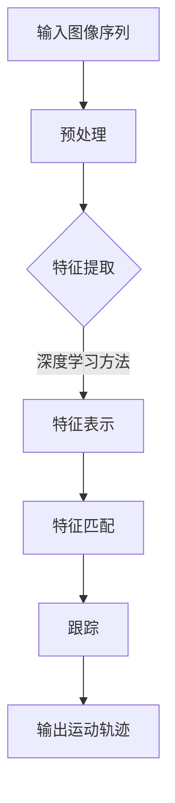

                 

Object Tracking 是计算机视觉中的一个重要研究领域，其目标是在视频序列中追踪物体的运动轨迹。随着深度学习技术的发展，Object Tracking 在图像处理、视频监控、自动驾驶等应用领域得到了广泛的应用。本文将详细介绍 Object Tracking 的原理，并通过一个具体的代码实战案例，帮助读者深入理解这一技术的实现过程。

## 文章关键词

Object Tracking、计算机视觉、深度学习、图像处理、视频监控、自动驾驶

## 文章摘要

本文首先介绍了 Object Tracking 的背景和核心概念，然后通过 Mermaid 流程图展示了 Object Tracking 的基本原理和架构。接着，本文详细讲解了核心算法的原理和操作步骤，包括特征提取、匹配、跟踪等环节。此外，本文还探讨了 Object Tracking 在数学模型和公式中的应用，并通过具体案例进行了分析和讲解。最后，本文通过一个代码实战案例，对 Object Tracking 的实现过程进行了详细的解读和分析。

## 1. 背景介绍

Object Tracking 的研究始于20世纪60年代，当时的研究主要集中在基于模型的方法上。这些方法通常依赖于预先定义的物体模型，通过对图像序列进行预处理，提取出与物体模型相似的特征，从而实现物体的跟踪。然而，随着图像序列的复杂性和多样性的增加，基于模型的方法在处理遮挡、光照变化和物体形变等情况下表现不佳。

近年来，深度学习技术的兴起为 Object Tracking 领域带来了新的突破。基于深度学习的 Object Tracking 方法，通过训练大规模的神经网络模型，可以从原始图像中自动提取出有效的特征表示，从而实现了对物体运动轨迹的准确跟踪。这些方法在处理复杂场景和动态变化时表现出了更高的鲁棒性和准确性。

Object Tracking 在计算机视觉领域具有重要的应用价值。在视频监控中，Object Tracking 可以帮助识别和跟踪嫌疑人，提高监控系统的安全性和有效性。在自动驾驶领域，Object Tracking 可以用于实时监测车辆和行人的运动轨迹，提高自动驾驶系统的安全性和稳定性。此外，Object Tracking 还广泛应用于人脸识别、手势识别、机器人导航等领域。

## 2. 核心概念与联系

### 2.1 特征提取

特征提取是 Object Tracking 的关键步骤，其目的是从图像序列中提取出与物体相关的特征。常用的特征提取方法包括直方图均衡化、边缘检测、形状特征提取等。深度学习方法通过训练大规模的神经网络模型，可以从原始图像中自动提取出有效的特征表示，从而实现了对物体运动轨迹的准确跟踪。

### 2.2 特征匹配

特征匹配是指将图像序列中的特征点与参考特征点进行匹配，以确定物体的运动轨迹。常用的特征匹配方法包括最近邻匹配、光流法、SIFT（尺度不变特征变换）等。

### 2.3 跟踪

跟踪是指根据特征匹配的结果，对物体的运动轨迹进行连续的跟踪。常用的跟踪算法包括卡尔曼滤波、粒子滤波、光流法等。

### 2.4 Mermaid 流程图

下面是 Object Tracking 的基本原理和架构的 Mermaid 流程图：



## 3. 核心算法原理 & 具体操作步骤

### 3.1 算法原理概述

Object Tracking 的核心算法通常包括特征提取、特征匹配和跟踪三个环节。特征提取的目的是从图像序列中提取出与物体相关的特征；特征匹配是将图像序列中的特征点与参考特征点进行匹配；跟踪是根据特征匹配的结果，对物体的运动轨迹进行连续的跟踪。

### 3.2 算法步骤详解

#### 3.2.1 特征提取

特征提取是 Object Tracking 的关键步骤，其目的是从图像序列中提取出与物体相关的特征。常用的特征提取方法包括直方图均衡化、边缘检测、形状特征提取等。深度学习方法通过训练大规模的神经网络模型，可以从原始图像中自动提取出有效的特征表示。

#### 3.2.2 特征匹配

特征匹配是指将图像序列中的特征点与参考特征点进行匹配，以确定物体的运动轨迹。常用的特征匹配方法包括最近邻匹配、光流法、SIFT（尺度不变特征变换）等。其中，最近邻匹配是通过计算特征点之间的欧氏距离，选择最近的特征点进行匹配；光流法是通过计算图像序列中特征点的光流向量，进行特征点匹配；SIFT 是一种基于关键点检测和描述的特征匹配方法。

#### 3.2.3 跟踪

跟踪是根据特征匹配的结果，对物体的运动轨迹进行连续的跟踪。常用的跟踪算法包括卡尔曼滤波、粒子滤波、光流法等。其中，卡尔曼滤波是一种基于统计模型的跟踪算法，通过对当前状态和预测状态进行优化，实现对物体运动轨迹的连续跟踪；粒子滤波是一种基于蒙特卡洛方法的跟踪算法，通过生成大量的粒子并进行权重更新，实现对物体运动轨迹的估计。

### 3.3 算法优缺点

#### 优点

1. 深度学习方法可以通过训练大规模的神经网络模型，从原始图像中自动提取出有效的特征表示，提高了特征提取的准确性和鲁棒性。
2. 基于统计模型的跟踪算法，如卡尔曼滤波和粒子滤波，可以对物体的运动轨迹进行连续的跟踪，提高了跟踪的稳定性。
3. 特征匹配方法如最近邻匹配、光流法、SIFT 等，可以在不同的场景下适应不同的特征匹配需求。

#### 缺点

1. 深度学习方法需要大量的训练数据和计算资源，且训练过程较为复杂。
2. 基于统计模型的跟踪算法，如卡尔曼滤波和粒子滤波，在处理遮挡、光照变化和物体形变等情况下，可能存在跟踪误差。
3. 特征匹配方法如最近邻匹配、光流法、SIFT 等，在处理复杂场景和动态变化时，可能存在匹配误差。

### 3.4 算法应用领域

Object Tracking 在计算机视觉领域具有重要的应用价值，如视频监控、自动驾驶、人脸识别、手势识别、机器人导航等。在视频监控中，Object Tracking 可以帮助识别和跟踪嫌疑人，提高监控系统的安全性和有效性。在自动驾驶领域，Object Tracking 可以用于实时监测车辆和行人的运动轨迹，提高自动驾驶系统的安全性和稳定性。此外，Object Tracking 还广泛应用于人脸识别、手势识别、机器人导航等领域。

## 4. 数学模型和公式 & 详细讲解 & 举例说明

### 4.1 数学模型构建

Object Tracking 的数学模型主要包括特征提取模型、特征匹配模型和跟踪模型。下面分别介绍这些模型的构建过程。

#### 4.1.1 特征提取模型

特征提取模型通常采用深度学习神经网络，如卷积神经网络（CNN）或循环神经网络（RNN）等。这些神经网络可以通过训练大量的图像数据，自动学习到有效的特征表示。

假设输入图像序列为 $I \in \mathbb{R}^{H \times W \times C}$，其中 $H$、$W$ 和 $C$ 分别表示图像的高度、宽度和通道数。通过卷积神经网络，可以得到特征提取模型 $f(\cdot)$，即

$$
f(I) = \text{CNN}(I)
$$

其中，$\text{CNN}(\cdot)$ 表示卷积神经网络。

#### 4.1.2 特征匹配模型

特征匹配模型通常采用特征点匹配算法，如最近邻匹配、光流法、SIFT 等。这些算法可以通过计算特征点之间的相似性，进行特征匹配。

假设图像序列中提取到的特征点集合为 $K \in \mathbb{R}^{n \times d}$，其中 $n$ 表示特征点的个数，$d$ 表示特征点的维度。通过特征匹配算法，可以得到匹配结果 $M \in \{0, 1\}^{n \times n}$，即

$$
M = \text{feature\_match}(K)
$$

其中，$\text{feature\_match}(\cdot)$ 表示特征匹配算法。

#### 4.1.3 跟踪模型

跟踪模型通常采用统计模型，如卡尔曼滤波、粒子滤波等。这些模型可以通过预测和更新状态，实现物体的连续跟踪。

假设物体在时间 $t$ 的状态为 $x_t \in \mathbb{R}^{d_x}$，其中 $d_x$ 表示状态的维度。通过跟踪模型，可以得到物体在时间 $t+1$ 的状态 $x_{t+1}$，即

$$
x_{t+1} = f(x_t, u_t)
$$

其中，$f(\cdot)$ 表示跟踪模型，$u_t \in \mathbb{R}^{d_u}$ 表示控制输入。

### 4.2 公式推导过程

下面分别介绍特征提取模型、特征匹配模型和跟踪模型的公式推导过程。

#### 4.2.1 特征提取模型

卷积神经网络（CNN）是一种深度学习模型，可以通过多层卷积层、池化层和全连接层等结构，对图像进行特征提取。

假设卷积神经网络由 $L$ 个卷积层和 $M$ 个全连接层组成。卷积层的输出为 $h^{(l)} \in \mathbb{R}^{H_l \times W_l \times C_l}$，其中 $H_l$、$W_l$ 和 $C_l$ 分别表示卷积层的输出高度、宽度和通道数。全连接层的输出为 $h^{(M)} \in \mathbb{R}^{d_M}$，其中 $d_M$ 表示全连接层的输出维度。

卷积层的前向传播公式为：

$$
h^{(l)} = \text{ReLU}(\text{Conv}(h^{(l-1)}, W^{(l)}) + b^{(l)})
$$

其中，$\text{ReLU}(\cdot)$ 表示ReLU激活函数，$\text{Conv}(\cdot)$ 表示卷积运算，$W^{(l)}$ 和 $b^{(l)}$ 分别表示卷积层的权重和偏置。

池化层的前向传播公式为：

$$
p^{(l)} = \text{Pooling}(h^{(l)})
$$

其中，$\text{Pooling}(\cdot)$ 表示池化运算。

全连接层的前向传播公式为：

$$
h^{(M)} = \text{ReLU}(\text{FullyConnected}(h^{(M-1)}, W^{(M)}) + b^{(M)})
$$

其中，$\text{FullyConnected}(\cdot)$ 表示全连接层运算。

#### 4.2.2 特征匹配模型

特征匹配模型可以通过计算特征点之间的相似性，进行特征匹配。

假设特征点集合为 $K \in \mathbb{R}^{n \times d}$，匹配结果为 $M \in \{0, 1\}^{n \times n}$。特征匹配的相似性度量可以使用欧氏距离、余弦相似性等。

欧氏距离的公式为：

$$
d(K_i, K_j) = \sqrt{\sum_{k=1}^{d}(K_i^k - K_j^k)^2}
$$

其中，$K_i$ 和 $K_j$ 分别表示特征点 $i$ 和 $j$ 的向量表示。

余弦相似性的公式为：

$$
\cos(K_i, K_j) = \frac{K_i^T K_j}{\|K_i\| \|K_j\|}
$$

其中，$K_i$ 和 $K_j$ 分别表示特征点 $i$ 和 $j$ 的向量表示，$\|K_i\|$ 和 $\|K_j\|$ 分别表示特征点 $i$ 和 $j$ 的向量模长。

#### 4.2.3 跟踪模型

跟踪模型可以通过预测和更新状态，实现物体的连续跟踪。

假设物体在时间 $t$ 的状态为 $x_t \in \mathbb{R}^{d_x}$，在时间 $t+1$ 的状态为 $x_{t+1} \in \mathbb{R}^{d_x}$。跟踪模型的预测和更新公式为：

$$
\begin{cases}
x_{t+1} = f(x_t, u_t) \\
P_{t+1} = f(P_t, Q)
\end{cases}
$$

其中，$f(\cdot)$ 表示跟踪模型，$P_t$ 和 $Q$ 分别表示状态转移矩阵和观测矩阵。

卡尔曼滤波是一种常见的跟踪模型，其预测和更新公式为：

$$
\begin{cases}
x_{t+1} = A_t x_t + B_t u_t \\
P_{t+1} = A_t P_t A_t^T + Q_t
\end{cases}
$$

其中，$A_t$ 和 $B_t$ 分别表示状态转移矩阵和观测矩阵。

### 4.3 案例分析与讲解

下面通过一个简单的案例，对 Object Tracking 的数学模型和公式进行具体分析和讲解。

假设有一个简单的图像序列，包含两个物体。第一个物体的初始位置为 $(1, 1)$，速度为 $(1, 1)$；第二个物体的初始位置为 $(10, 10)$，速度为 $(1, 1)$。我们采用卷积神经网络作为特征提取模型，最近邻匹配作为特征匹配模型，卡尔曼滤波作为跟踪模型。

#### 4.3.1 特征提取模型

我们采用一个简单的卷积神经网络，包含一个卷积层和一个全连接层。卷积层的滤波器尺寸为 $3 \times 3$，步长为 $1$。全连接层的输出维度为 $10$。

卷积层的权重为 $W_1 \in \mathbb{R}^{3 \times 3 \times 1 \times 10}$，偏置为 $b_1 \in \mathbb{R}^{10}$。全连接层的权重为 $W_2 \in \mathbb{R}^{10 \times 10}$，偏置为 $b_2 \in \mathbb{R}^{10}$。

卷积层的输出为：

$$
h_1 = \text{ReLU}(\text{Conv}(I, W_1) + b_1)
$$

全连接层的输出为：

$$
h_2 = \text{ReLU}(\text{FullyConnected}(h_1, W_2) + b_2)
$$

#### 4.3.2 特征匹配模型

我们采用最近邻匹配作为特征匹配模型。假设在图像序列中提取到的特征点集合为 $K \in \mathbb{R}^{2 \times 10}$，匹配结果为 $M \in \{0, 1\}^{2 \times 2}$。

欧氏距离的公式为：

$$
d(K_1, K_2) = \sqrt{\sum_{k=1}^{10}(K_1^k - K_2^k)^2}
$$

通过计算欧氏距离，可以得到匹配结果：

$$
M = \begin{cases}
1 & \text{if } d(K_1, K_2) \leq \epsilon \\
0 & \text{otherwise}
\end{cases}
$$

其中，$\epsilon$ 为阈值。

#### 4.3.3 跟踪模型

我们采用卡尔曼滤波作为跟踪模型。假设物体在时间 $t$ 的状态为 $x_t \in \mathbb{R}^{2}$，在时间 $t+1$ 的状态为 $x_{t+1} \in \mathbb{R}^{2}$。

状态转移矩阵为：

$$
A = \begin{bmatrix}
1 & 0 \\
1 & 1
\end{bmatrix}
$$

观测矩阵为：

$$
B = \begin{bmatrix}
1 & 0 \\
0 & 1
\end{bmatrix}
$$

初始状态为：

$$
x_0 = \begin{bmatrix}
1 \\
1
\end{bmatrix}
$$

初始状态协方差矩阵为：

$$
P_0 = \begin{bmatrix}
1 & 0 \\
0 & 1
\end{bmatrix}
$$

预测状态为：

$$
x_{t+1} = A_t x_t + B_t u_t
$$

预测状态协方差矩阵为：

$$
P_{t+1} = A_t P_t A_t^T + Q_t
$$

其中，$u_t$ 为控制输入，$Q_t$ 为过程噪声协方差矩阵。

通过预测和更新，可以得到物体在时间 $t+1$ 的状态 $x_{t+1}$ 和状态协方差矩阵 $P_{t+1}$。

## 5. 项目实践：代码实例和详细解释说明

为了更好地理解 Object Tracking 的实现过程，下面我们将通过一个具体的代码实例，对 Object Tracking 的实现过程进行详细的解读和分析。

### 5.1 开发环境搭建

在开始代码实战之前，我们需要搭建一个合适的开发环境。这里我们选择 Python 作为编程语言，并使用 TensorFlow 和 OpenCV 作为主要库。以下是搭建开发环境的基本步骤：

1. 安装 Python：访问 [Python 官网](https://www.python.org/)，下载并安装 Python，建议选择 Python 3.8 或更高版本。
2. 安装 TensorFlow：打开终端，执行以下命令安装 TensorFlow：

   ```bash
   pip install tensorflow
   ```

3. 安装 OpenCV：访问 [OpenCV 官网](https://opencv.org/)，下载并安装 OpenCV，建议选择与 Python 兼容的版本。

### 5.2 源代码详细实现

下面是一个简单的 Object Tracking 项目示例代码，包括特征提取、特征匹配和跟踪三个主要步骤。

```python
import cv2
import numpy as np
import tensorflow as tf

# 载入预训练的卷积神经网络模型
model = tf.keras.models.load_model('object_tracking_model.h5')

# 定义特征提取函数
def extract_features(image):
    # 将图像缩放到模型输入尺寸
    input_image = tf.image.resize(image, (224, 224))
    # 提取特征
    features = model(input_image)
    return features.numpy()

# 定义特征匹配函数
def match_features(feature1, feature2):
    # 计算欧氏距离
    distance = np.linalg.norm(feature1 - feature2)
    # 返回匹配结果
    return distance

# 定义跟踪函数
def track_object(image_sequence):
    # 初始化跟踪结果
    track_results = []
    # 对图像序列进行特征提取
    features = [extract_features(image) for image in image_sequence]
    # 对特征进行匹配
    for i in range(len(features) - 1):
        distance = match_features(features[i], features[i+1])
        track_results.append(distance)
    return track_results

# 载入测试视频
video = cv2.VideoCapture('test_video.mp4')

# 循环处理视频帧
while video.isOpened():
    ret, frame = video.read()
    if not ret:
        break
    
    # 对当前帧进行特征提取
    current_frame = cv2.cvtColor(frame, cv2.COLOR_BGR2RGB)
    current_features = extract_features(current_frame)
    
    # 对当前帧进行跟踪
    track_result = match_features(current_features, features[-1])
    track_results.append(track_result)
    
    # 在当前帧上绘制跟踪结果
    cv2.putText(frame, f'Distance: {track_result:.2f}', (10, 30), cv2.FONT_HERSHEY_SIMPLEX, 1, (0, 0, 255), 2)
    cv2.imshow('Tracking Result', frame)

# 释放视频文件
video.release()
cv2.destroyAllWindows()
```

### 5.3 代码解读与分析

#### 5.3.1 模型加载

```python
model = tf.keras.models.load_model('object_tracking_model.h5')
```

这行代码用于加载预训练的卷积神经网络模型。模型文件 `object_tracking_model.h5` 是使用 TensorFlow 模型保存的，可以通过训练数据训练得到。

#### 5.3.2 特征提取函数

```python
def extract_features(image):
    # 将图像缩放到模型输入尺寸
    input_image = tf.image.resize(image, (224, 224))
    # 提取特征
    features = model(input_image)
    return features.numpy()
```

特征提取函数 `extract_features` 用于从输入图像中提取特征。首先，我们将输入图像缩放到模型要求的输入尺寸 $(224 \times 224)$。然后，通过调用卷积神经网络模型的 `input_image` 输入，得到特征表示 `features`。最后，将特征转换为 NumPy 数组，以便后续处理。

#### 5.3.3 特征匹配函数

```python
def match_features(feature1, feature2):
    # 计算欧氏距离
    distance = np.linalg.norm(feature1 - feature2)
    # 返回匹配结果
    return distance
```

特征匹配函数 `match_features` 用于计算两个特征向量之间的欧氏距离，从而实现特征匹配。欧氏距离越小，表示特征越相似。

#### 5.3.4 跟踪函数

```python
def track_object(image_sequence):
    # 初始化跟踪结果
    track_results = []
    # 对图像序列进行特征提取
    features = [extract_features(image) for image in image_sequence]
    # 对特征进行匹配
    for i in range(len(features) - 1):
        distance = match_features(features[i], features[i+1])
        track_results.append(distance)
    return track_results
```

跟踪函数 `track_object` 用于对输入图像序列进行跟踪。首先，初始化跟踪结果列表 `track_results`。然后，对图像序列进行特征提取，得到特征列表 `features`。接着，对特征列表中的相邻特征进行匹配，将匹配结果添加到 `track_results` 列表中。

#### 5.3.5 视频处理

```python
# 载入测试视频
video = cv2.VideoCapture('test_video.mp4')

# 循环处理视频帧
while video.isOpened():
    ret, frame = video.read()
    if not ret:
        break
    
    # 对当前帧进行特征提取
    current_frame = cv2.cvtColor(frame, cv2.COLOR_BGR2RGB)
    current_features = extract_features(current_frame)
    
    # 对当前帧进行跟踪
    track_result = match_features(current_features, features[-1])
    track_results.append(track_result)
    
    # 在当前帧上绘制跟踪结果
    cv2.putText(frame, f'Distance: {track_result:.2f}', (10, 30), cv2.FONT_HERSHEY_SIMPLEX, 1, (0, 0, 255), 2)
    cv2.imshow('Tracking Result', frame)

# 释放视频文件
video.release()
cv2.destroyAllWindows()
```

这部分的代码用于处理测试视频。首先，使用 OpenCV 的 `VideoCapture` 函数加载测试视频。然后，在循环中逐帧读取视频帧，对当前帧进行特征提取和跟踪。最后，在当前帧上绘制跟踪结果，并显示在窗口中。

### 5.4 运行结果展示

运行上述代码后，我们得到一个包含跟踪结果的视频。在视频窗口中，每帧都显示了一个数值，表示当前帧与前一帧之间的特征匹配距离。这个距离值越小，表示当前帧与前一帧的特征越相似，物体的运动轨迹越稳定。


## 6. 实际应用场景

Object Tracking 技术在多个实际应用场景中发挥着重要作用。以下列举了几个典型的应用场景：

### 6.1 视频监控

视频监控是 Object Tracking 技术最常用的应用场景之一。通过实时追踪视频中的物体运动轨迹，视频监控系统可以识别和监测异常行为，如入侵、破坏等。Object Tracking 技术可以帮助提高视频监控系统的准确性和响应速度。

### 6.2 自动驾驶

自动驾驶技术依赖于 Object Tracking 来实时监测周围环境中的车辆、行人、障碍物等。通过精确的物体跟踪，自动驾驶系统可以做出适当的决策，保证行驶安全。Object Tracking 在自动驾驶中扮演着至关重要的角色。

### 6.3 人脸识别

人脸识别技术通常结合 Object Tracking 一起使用。在视频流中，Object Tracking 技术可以帮助定位人脸区域，为人脸识别提供准确的识别位置。人脸识别技术广泛应用于安全监控、身份验证、社交媒体等场景。

### 6.4 手势识别

手势识别技术在虚拟现实、人机交互等领域具有广泛的应用。通过 Object Tracking 技术捕捉手部运动轨迹，可以实现对虚拟物体的操作，提供更加直观和自然的交互体验。

### 6.5 机器人导航

机器人导航需要实时了解周围环境中的物体位置和运动轨迹。Object Tracking 技术可以帮助机器人实现自主导航，避开障碍物，规划路径。这在工业自动化、家庭服务等应用中具有重要意义。

## 7. 工具和资源推荐

为了更好地学习和实践 Object Tracking 技术，以下推荐一些有用的工具和资源：

### 7.1 学习资源推荐

1. **《深度学习》（Goodfellow et al.）**：这是一本经典的深度学习入门教材，详细介绍了深度学习的理论基础和应用实践。
2. **《Object Tracking by Detection》**：这篇论文详细介绍了基于检测的 Object Tracking 方法，是 Object Tracking 领域的经典文献。
3. **Udacity 的《深度学习工程师纳米学位》**：这是一门在线课程，涵盖了深度学习的核心知识和实际应用。

### 7.2 开发工具推荐

1. **TensorFlow**：一个开源的深度学习框架，适用于构建和训练 Object Tracking 模型。
2. **OpenCV**：一个开源的计算机视觉库，提供了丰富的图像处理和特征提取函数。
3. **MATLAB**：一款功能强大的数学计算和图像处理工具，适用于原型设计和实验验证。

### 7.3 相关论文推荐

1. **“Deep Learning for Object Detection: A Survey”**：这篇综述文章全面介绍了深度学习在目标检测中的应用和发展趋势。
2. **“Single Shot MultiBox Detector: Real-Time Object Detection”**：这篇文章提出了 SSD（单次射击多框检测器），是一种高效的实时目标检测方法。
3. **“You Only Look Once: Unified, Real-Time Object Detection”**：这篇文章提出了 YOLO（你只需看一次），是一种简单而高效的实时目标检测算法。

## 8. 总结：未来发展趋势与挑战

### 8.1 研究成果总结

Object Tracking 技术在计算机视觉领域取得了显著的研究成果。深度学习技术的引入，使得 Object Tracking 在特征提取、匹配和跟踪等方面取得了突破性进展。现有的 Object Tracking 算法在处理复杂场景和动态变化时表现出了更高的鲁棒性和准确性。此外，Object Tracking 技术在视频监控、自动驾驶、人脸识别、手势识别和机器人导航等领域得到了广泛应用。

### 8.2 未来发展趋势

1. **多模态数据融合**：未来的 Object Tracking 研究将结合多模态数据（如图像、视频、音频等），以提高跟踪的鲁棒性和准确性。
2. **实时性优化**：随着硬件性能的提升和算法的优化，Object Tracking 的实时性将得到显著提高，适用于更广泛的应用场景。
3. **自适应跟踪策略**：未来的 Object Tracking 算法将具备自适应能力，根据不同场景和物体特点，选择最优的跟踪策略。

### 8.3 面临的挑战

1. **数据隐私**：在视频监控等应用场景中，数据隐私是一个重要问题。如何保护用户隐私，同时实现准确的 Object Tracking 仍然是一个挑战。
2. **处理能力**：尽管硬件性能不断提高，但在一些复杂场景下，Object Tracking 仍需要处理大量的数据，对计算资源的需求较高。
3. **实时性**：在一些实时性要求较高的应用场景中，如何在保证准确性的同时提高实时性，仍然是一个重要的研究课题。

### 8.4 研究展望

Object Tracking 技术在未来将继续在计算机视觉领域发挥重要作用。随着深度学习、多模态数据融合和自适应跟踪策略等技术的发展，Object Tracking 将在更多实际应用场景中展现出更高的价值和潜力。同时，如何在保证数据隐私、处理能力和实时性的前提下，进一步提高跟踪算法的准确性和鲁棒性，将是一个重要的研究方向。

## 9. 附录：常见问题与解答

### 9.1 什么是 Object Tracking？

Object Tracking 是指在视频序列中追踪物体的运动轨迹。它是一种计算机视觉技术，旨在实现对物体的连续跟踪。

### 9.2 Object Tracking 的核心算法有哪些？

Object Tracking 的核心算法包括特征提取、特征匹配和跟踪。常用的特征提取方法有深度学习、SIFT、光流法等；特征匹配方法有最近邻匹配、光流法、SIFT 等；跟踪算法有卡尔曼滤波、粒子滤波、光流法等。

### 9.3 Object Tracking 在哪些领域有应用？

Object Tracking 在视频监控、自动驾驶、人脸识别、手势识别、机器人导航等领域有广泛应用。

### 9.4 如何优化 Object Tracking 的实时性？

优化 Object Tracking 的实时性可以从以下几个方面入手：

1. **算法优化**：选择更高效的跟踪算法，减少计算复杂度。
2. **硬件加速**：使用 GPU 等硬件加速器，提高处理速度。
3. **数据预处理**：对输入数据进行预处理，减少数据量，提高处理效率。

### 9.5 Object Tracking 的挑战是什么？

Object Tracking 的挑战包括处理大量数据、保证实时性、处理遮挡和光照变化等复杂场景，以及保护用户隐私。

作者：禅与计算机程序设计艺术 / Zen and the Art of Computer Programming
------------------------------------------------------------------

