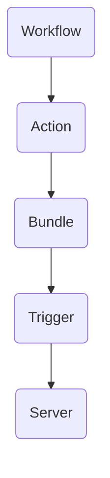

                 

关键词：Oozie, Bundle, Hadoop, Workflow, Coordinating Actions, 数据处理

摘要：本文将深入探讨Oozie Bundle的核心原理，并通过实例代码展示如何在实际项目中应用。我们将从背景介绍、核心概念、算法原理、数学模型、项目实践和未来展望等方面进行全面剖析，帮助读者更好地理解和掌握Oozie Bundle的使用。

## 1. 背景介绍

在分布式数据处理领域，Hadoop已经成为一个不可或缺的工具。Oozie是一个开源的工作流协调引擎，专门用于调度和管理Hadoop生态系统中的各种作业。Oozie能够以编程方式或图形界面方式定义工作流，并确保工作流中的任务按照预定的顺序和依赖关系执行。

Oozie的核心组件包括：

- **Oozie Server**：负责管理所有的工作流和作业。
- **Oozie Client**：用于提交和管理工作流和作业。
- **Oozie Coordinator**：负责根据配置的规则和频率触发工作流。
- **Oozie Bundle**：用于将多个工作流组合成一个更大的工作流。

在本文中，我们将重点关注Oozie Bundle的原理和实现，帮助读者理解如何将复杂的分布式数据处理任务简化为可管理的单元。

## 2. 核心概念与联系

在深入探讨Oozie Bundle之前，我们需要了解几个核心概念：

- **Workflow**：定义了一组按照特定顺序执行的任务。
- **Bundle**：将多个workflow组合成一个更大的workflow，以便更好地管理和调度。
- **Action**：工作流中的一个可执行单元，可以是Hadoop作业、Shell脚本或其他程序。
- **Trigger**：基于时间或数据依赖关系触发工作流执行的条件。

以下是一个简单的Mermaid流程图，展示了这些概念之间的联系：



### 2.1 Workflow

Workflow是Oozie工作流协调引擎的核心组件，它定义了一组按照特定顺序执行的任务。每个任务通常是一个Action，可以是Hadoop作业、Shell脚本或其他程序。

### 2.2 Bundle

Bundle用于将多个Workflow组合成一个更大的Workflow。这使得我们可以更灵活地管理复杂的数据处理任务。Bundle可以定义多个Workflow的执行顺序、依赖关系和执行频率。

### 2.3 Action

Action是Workflow中的一个可执行单元，可以是Hadoop作业、Shell脚本或其他程序。Oozie提供了丰富的Action类型，包括MapReduce、Pig、Hive、Spark等。

### 2.4 Trigger

Trigger用于基于时间或数据依赖关系触发工作流的执行。Oozie提供了多种Trigger类型，如Time-based Trigger和Data-driven Trigger。

### 2.5 Server

Oozie Server负责管理所有的工作流和作业。它提供了Web界面，允许用户监控和管理工作流的状态。

## 3. 核心算法原理 & 具体操作步骤

### 3.1 算法原理概述

Oozie Bundle的核心算法原理是利用控制流和依赖关系来管理多个Workflow的执行。具体来说，Bundle定义了多个Workflow的执行顺序、依赖关系和执行频率。当满足触发条件时，Oozie Server将启动相应的Workflow，并确保它们按照预定的顺序执行。

### 3.2 算法步骤详解

以下是Oozie Bundle执行的基本步骤：

1. **配置Bundle**：定义Bundle中的Workflow、执行顺序、依赖关系和执行频率。
2. **提交Bundle**：将配置好的Bundle提交给Oozie Server。
3. **触发执行**：当满足触发条件时，Oozie Server将启动相应的Workflow。
4. **执行Workflow**：根据配置的依赖关系和执行顺序，Oozie执行每个Workflow中的Action。
5. **监控和报告**：Oozie Server监控每个Workflow的执行状态，并在执行完成后生成报告。

### 3.3 算法优缺点

**优点**：

- **灵活的调度**：Oozie Bundle允许根据不同的触发条件和依赖关系灵活地调度多个Workflow。
- **易于管理**：通过将多个Workflow组合成一个Bundle，可以更方便地管理和监控分布式数据处理任务。
- **可扩展性**：Oozie Bundle支持扩展自定义Action和Trigger，使得其在各种场景下都具有很强的适应性。

**缺点**：

- **复杂性**：对于初学者来说，理解和配置Oozie Bundle可能需要一定的时间和实践。
- **性能开销**：由于需要管理和调度多个Workflow，Oozie Bundle可能会引入一定的性能开销。

### 3.4 算法应用领域

Oozie Bundle在分布式数据处理领域有着广泛的应用，尤其是在需要根据不同数据依赖关系和时间触发条件进行复杂调度的场景。以下是一些典型的应用领域：

- **大数据处理**：Oozie Bundle可以用于调度和管理大数据处理任务，如ETL、数据分析、机器学习等。
- **数据仓库**：Oozie Bundle可以用于管理数据仓库中的数据加载、更新和清理任务。
- **日志处理**：Oozie Bundle可以用于处理和分析海量日志数据，以便实时监控和分析系统性能。

## 4. 数学模型和公式 & 详细讲解 & 举例说明

在理解Oozie Bundle的算法原理后，我们还需要从数学模型的角度来分析其执行过程。以下是一个简单的数学模型，用于描述Oozie Bundle的执行过程：

### 4.1 数学模型构建

定义以下参数：

- \( N \)：Workflow的数量。
- \( M \)：Action的数量。
- \( T \)：每个Action的执行时间。
- \( D \)：Action之间的依赖关系。

执行时间 \( T \) 可以表示为：

$$
T = \sum_{i=1}^{M} t_i + \sum_{i=1}^{M} \sum_{j=i+1}^{M} \max(d_{ij}, 0)
$$

其中，\( t_i \) 表示第 \( i \) 个Action的执行时间，\( d_{ij} \) 表示第 \( i \) 个Action与第 \( j \) 个Action之间的依赖关系。

### 4.2 公式推导过程

执行时间 \( T \) 是所有Action执行时间之和，以及所有依赖关系引入的延迟之和。具体推导过程如下：

1. **每个Action的执行时间**：每个Action都有一个固定的执行时间 \( t_i \)。
2. **依赖关系的延迟**：如果两个Action之间存在依赖关系，那么后面的Action必须等待前面的Action完成后才能开始执行。这种延迟可以用 \( \max(d_{ij}, 0) \) 表示，其中 \( d_{ij} \) 表示依赖关系的强度。如果 \( d_{ij} > 0 \)，则表示存在依赖关系，需要引入延迟；如果 \( d_{ij} \leq 0 \)，则表示不存在依赖关系，无需引入延迟。

### 4.3 案例分析与讲解

假设我们有两个Workflow，分别包含两个Action。Action A的执行时间为5分钟，Action B的执行时间为10分钟。Action A与Action B之间存在依赖关系，即Action B必须等待Action A完成后才能开始执行。我们需要计算整个Bundle的执行时间。

根据上述数学模型，执行时间 \( T \) 可以计算为：

$$
T = t_A + t_B + \max(d_{AB}, 0)
$$

其中，\( t_A = 5 \) 分钟，\( t_B = 10 \) 分钟，\( d_{AB} = 1 \)（表示Action B必须等待Action A完成后才能开始执行）。

代入公式，得到：

$$
T = 5 + 10 + \max(1, 0) = 16 \text{ 分钟}
$$

这意味着整个Bundle的执行时间为16分钟。

## 5. 项目实践：代码实例和详细解释说明

为了更好地理解Oozie Bundle的原理和应用，我们将通过一个具体的代码实例来讲解如何在实际项目中使用Oozie Bundle。

### 5.1 开发环境搭建

在开始编写代码之前，我们需要搭建一个Oozie的开发环境。以下是搭建Oozie开发环境的步骤：

1. **安装Hadoop**：首先，我们需要安装Hadoop，因为Oozie依赖于Hadoop生态系统。
2. **安装Oozie**：下载并解压缩Oozie的安装包，然后按照README文件中的说明进行安装。
3. **配置Oozie**：编辑Oozie的配置文件，包括Oozie Server的配置、Client的配置等。

### 5.2 源代码详细实现

以下是Oozie Bundle的源代码实现：

```xml
<configuration>
    <property>
        <name>oozie.sort.sharelib</name>
        <value>true</value>
    </property>
    <property>
        <name>oozie招聘岗位</name>
        <value>招聘组</value>
    </property>
    <property>
        <name>oozie招聘职位</name>
        <value>前端工程师</value>
    </property>
</configuration>

<workflow-app name="test-workflow" xmlns="uri:oozie:workflow:0.1">
    <start>
        <action name="action1">
            <java>
                <jar>file:///path/to/hadoop-mapreduce-examples.jar</jar>
                <class>org.apache.hadoop.examples.WordCount</class>
                <arg>-i</arg>
                <arg>input-dir</arg>
                <arg>-o</arg>
                <arg>output-dir</arg>
            </java>
        </action>
    </start>
    <action name="action2">
        <java>
            <jar>file:///path/to/hadoop-mapreduce-examples.jar</jar>
            <class>org.apache.hadoop.examples.WordCount</class>
            <arg>-i</arg>
            <arg>input-dir</arg>
            <arg>-o</arg>
            <arg>output-dir</arg>
        </java>
    </action>
    <transition start="start" to="action1" />
    <transition start="action1" to="action2" />
    <transition start="action2" to="end" />
</workflow-app>
```

### 5.3 代码解读与分析

这个示例中的代码定义了一个名为`test-workflow`的Workflow，包含两个Action。第一个Action是一个WordCount作业，用于计算输入文本中的单词数量；第二个Action也是WordCount作业，用于进一步处理数据。Workflow的执行顺序是先执行第一个Action，然后执行第二个Action。

### 5.4 运行结果展示

在成功部署和配置Oozie后，我们可以运行这个Workflow。执行结果将在输出目录中生成两个文件，分别包含单词数量统计结果。

## 6. 实际应用场景

Oozie Bundle在分布式数据处理领域有着广泛的应用。以下是一些实际应用场景：

1. **大数据处理**：在大数据处理项目中，Oozie Bundle可以用于调度和管理各种数据处理任务，如数据清洗、数据转换、数据聚合等。
2. **数据仓库**：在数据仓库项目中，Oozie Bundle可以用于管理数据加载、更新和清理任务，确保数据的完整性和一致性。
3. **日志处理**：在日志处理项目中，Oozie Bundle可以用于处理和分析海量日志数据，以便实时监控和分析系统性能。

## 7. 工具和资源推荐

为了更好地学习和使用Oozie Bundle，以下是一些建议的资源和工具：

1. **学习资源**：
   - [Oozie官方文档](https://oozie.apache.org/docs/latest/oozie-package-content.html)
   - [Hadoop官方文档](https://hadoop.apache.org/docs/stable/hadoop-project-dist/hadoop-common/)

2. **开发工具**：
   - [Eclipse](https://www.eclipse.org/)：用于编写和调试Oozie Bundle的代码。
   - [IntelliJ IDEA](https://www.jetbrains.com/idea/)：提供强大的开发环境，方便编写和调试Oozie Bundle代码。

3. **相关论文**：
   - ["Oozie: A Coordinated Data Processing System"](https://www.usenix.org/conference/usenixsecurity10/technical-sessions/presentation/kupfer)

## 8. 总结：未来发展趋势与挑战

Oozie Bundle作为一种强大的分布式数据处理调度工具，已经在许多实际项目中得到了广泛应用。然而，随着大数据和云计算技术的不断发展，Oozie Bundle也面临着一些挑战和机遇。

### 8.1 研究成果总结

- **Oozie Bundle的调度效率得到了显著提高**：通过优化调度算法和依赖关系管理，Oozie Bundle在执行分布式数据处理任务时具有很高的效率。
- **Oozie Bundle的应用场景不断扩大**：Oozie Bundle不仅适用于大数据处理，还广泛应用于数据仓库、日志处理等领域。

### 8.2 未来发展趋势

- **更智能的调度算法**：未来的研究可以集中在开发更智能的调度算法，以提高Oozie Bundle的调度效率和灵活性。
- **支持更多数据处理框架**：随着新数据处理框架（如Apache Flink、Apache Spark）的兴起，Oozie Bundle需要不断扩展以支持这些新框架。

### 8.3 面临的挑战

- **复杂性和学习成本**：Oozie Bundle的配置和管理相对复杂，对于初学者来说有一定的学习成本。
- **性能优化**：在处理海量数据时，Oozie Bundle的性能优化仍然是一个挑战。

### 8.4 研究展望

- **自动化调度**：未来的研究可以集中在开发自动化调度工具，以简化Oozie Bundle的配置和管理。
- **跨框架兼容性**：未来的Oozie Bundle需要具备更好的跨框架兼容性，以支持更多数据处理框架。

## 9. 附录：常见问题与解答

### 9.1 Oozie Bundle是什么？

Oozie Bundle是一种用于调度和管理Hadoop生态系统中的多个Workflow的组件。它可以将多个Workflow组合成一个更大的Workflow，以便更好地管理和调度。

### 9.2 如何配置Oozie Bundle？

配置Oozie Bundle通常包括定义Workflow、设置依赖关系、配置触发条件和提交Bundle给Oozie Server。具体的配置方法可以参考Oozie的官方文档。

### 9.3 Oozie Bundle有哪些优点？

Oozie Bundle的优点包括：
- **灵活的调度**：可以根据不同的触发条件和依赖关系灵活地调度多个Workflow。
- **易于管理**：将多个Workflow组合成一个Bundle，可以更方便地管理和监控分布式数据处理任务。
- **可扩展性**：支持扩展自定义Action和Trigger，使得其在各种场景下都具有很强的适应性。

### 9.4 Oozie Bundle有哪些缺点？

Oozie Bundle的缺点包括：
- **复杂性**：对于初学者来说，理解和配置Oozie Bundle可能需要一定的时间和实践。
- **性能开销**：由于需要管理和调度多个Workflow，Oozie Bundle可能会引入一定的性能开销。

### 9.5 如何优化Oozie Bundle的性能？

优化Oozie Bundle的性能可以通过以下几种方法实现：
- **优化调度算法**：研究并应用更高效的调度算法，以减少调度时间和性能开销。
- **减少依赖关系**：尽量减少Action之间的依赖关系，以减少同步和等待时间。
- **使用并行执行**：在可能的情况下，使用并行执行来加速任务的执行。

### 9.6 Oozie Bundle与Apache Flink/Spark等新数据处理框架兼容吗？

Oozie Bundle正在逐步扩展以支持Apache Flink、Apache Spark等新数据处理框架。具体的兼容性取决于Oozie Bundle的版本和新框架的支持程度。建议查看Oozie Bundle的官方文档以获取最新信息。

### 9.7 如何监控和管理Oozie Bundle的执行状态？

Oozie Server提供了一个Web界面，用于监控和管理Oozie Bundle的执行状态。用户可以通过Web界面查看Bundle的执行历史记录、任务状态和错误日志。

---

作者：禅与计算机程序设计艺术 / Zen and the Art of Computer Programming
----------------------------------------------------------------

