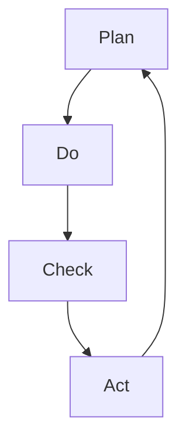

                 

关键词：PDCA，高效管理，IT项目管理，持续改进，过程控制

> 摘要：本文旨在探讨PDCA（计划-执行-检查-行动）这一经典的管理方法在IT项目管理中的应用。通过详细解析PDCA的四个环节，本文为IT管理者和项目团队提供了一套实用且系统的管理方法论，以提升项目的执行效率和成果质量。

## 1. 背景介绍

在信息技术（IT）领域，项目管理的复杂性日益增加。面对快速变化的技术环境、激烈的市场竞争和客户的高期望，IT项目管理者需要一种系统且高效的管理方法论来确保项目的成功交付。PDCA（Plan-Do-Check-Act），亦称戴明环，是一种广泛应用于各种领域的管理方法，尤其适用于IT项目管理。PDCA方法通过四个连续的环节，即计划（Plan）、执行（Do）、检查（Check）和行动（Act），帮助管理者实现持续改进和高效管理。

## 2. 核心概念与联系

PDCA方法的核心理念是持续改进，通过循环不断的四个环节来实现。以下是PDCA的核心概念及其相互关系：

### 2.1. 计划（Plan）

计划阶段是PDCA循环的起点，它包括目标设定、资源分配、风险评估和制定详细的实施计划。这一阶段的关键是明确项目的目标和预期成果，以及制定实现这些目标的具体步骤和时间表。

### 2.2. 执行（Do）

执行阶段是将计划转化为实际行动的过程。在这一阶段，项目团队成员按照计划执行任务，确保项目按计划推进。良好的沟通和协作是执行阶段成功的关键。

### 2.3. 检查（Check）

检查阶段是对执行过程的结果进行评估。这一阶段通过数据收集和分析，确定项目是否达到预期目标，并识别存在的问题和偏差。

### 2.4. 行动（Act）

行动阶段是根据检查结果采取纠正措施和改进措施的过程。这一阶段的目标是确保问题得到解决，并优化未来项目的执行过程。

### 2.5. Mermaid 流程图

以下是PDCA循环的Mermaid流程图表示：



## 3. 核心算法原理 & 具体操作步骤

### 3.1. 算法原理概述

PDCA方法是一种迭代和反馈循环，它通过四个环节的连续执行，实现项目管理的持续改进。每个环节都有其特定的目标和任务，共同作用于项目的整体成功。

### 3.2. 算法步骤详解

#### 3.2.1. 计划阶段

1. 明确项目目标和预期成果。
2. 确定项目范围和需求。
3. 制定详细的项目计划，包括任务分解、时间表和资源分配。
4. 进行风险评估，制定应对策略。

#### 3.2.2. 执行阶段

1. 按照计划执行任务。
2. 保持团队成员之间的沟通和协作。
3. 监控项目进度，确保按时交付。

#### 3.2.3. 检查阶段

1. 收集项目执行过程中的数据。
2. 分析数据，评估项目绩效和偏差。
3. 识别存在的问题和潜在风险。

#### 3.2.4. 行动阶段

1. 根据检查结果采取纠正措施。
2. 制定改进措施，优化项目管理流程。
3. 更新项目计划，为下一次迭代做好准备。

### 3.3. 算法优缺点

#### 优点

- 系统性：PDCA方法提供了一套完整的流程，确保项目管理的各个阶段都得到有效控制。
- 持续改进：通过循环迭代，项目能够不断优化，提高项目质量和效率。
- 易于实施：PDCA方法简单易懂，适用于各种规模和复杂度的项目。

#### 缺点

- 需要持续投入：持续改进需要时间和资源，可能对项目的短期效益产生影响。
- 过程复杂：对于复杂的IT项目，PDCA方法可能需要更多的数据分析和决策支持。

### 3.4. 算法应用领域

PDCA方法广泛应用于IT项目管理、软件工程、信息技术服务等领域。它不仅适用于单个项目，还可以作为企业级的管理框架，促进组织整体的管理水平和运营效率。

## 4. 数学模型和公式 & 详细讲解 & 举例说明

### 4.1. 数学模型构建

PDCA方法中的数学模型主要包括项目进度评估和绩效评估。以下是两个基本的数学公式：

#### 项目进度评估公式：

$$
进度 = \frac{已完成工作量}{总工作量}
$$

#### 绩效评估公式：

$$
绩效 = \frac{实际完成时间}{计划完成时间}
$$

### 4.2. 公式推导过程

#### 项目进度评估公式推导：

项目进度评估公式用于衡量项目当前阶段的完成情况。完成工作量与总工作量的比例直接反映了项目的进度。

#### 绩效评估公式推导：

绩效评估公式用于衡量项目的执行效率。实际完成时间与计划完成时间的比例反映了项目的绩效水平。

### 4.3. 案例分析与讲解

假设有一个软件开发项目，计划在6个月内完成，总工作量为1000小时。在项目进行到第3个月时，实际完成工作量为500小时。

1. 项目进度评估：

$$
进度 = \frac{500}{1000} = 0.5
$$

项目当前进度为50%。

2. 绩效评估：

假设项目实际完成时间为4个月（120天），计划完成时间为6个月（180天）。

$$
绩效 = \frac{120}{180} = 0.67
$$

项目当前绩效为67%。

通过这两个公式，我们可以直观地了解项目的进展情况和执行效率。这对于项目管理者来说，是制定下一步计划和采取行动的重要依据。

## 5. 项目实践：代码实例和详细解释说明

### 5.1. 开发环境搭建

为了更好地理解和应用PDCA方法，我们将在Python环境中实现一个简单的项目管理工具。首先，确保安装了Python 3.7及以上版本。然后，可以使用以下命令安装必要的依赖库：

```bash
pip install pandas matplotlib
```

### 5.2. 源代码详细实现

下面是一个简单的Python代码示例，用于模拟PDCA方法在项目管理中的应用：

```python
import pandas as pd
import matplotlib.pyplot as plt

# 数据集定义
data = {
    '日期': ['2023-01-01', '2023-01-15', '2023-02-01', '2023-02-15', '2023-03-01'],
    '工作量': [100, 300, 500, 700, 1000],
    '计划时间': [60, 120, 180, 240, 300]  # 单位：天
}

df = pd.DataFrame(data)

# 项目进度评估
df['进度'] = df['工作量'] / df['计划时间']

# 绩效评估
df['绩效'] = df['工作量'].diff().fillna(0) / df['计划时间'].diff().fillna(0)

# 数据可视化
plt.figure(figsize=(10, 5))
plt.plot(df['日期'], df['进度'], label='进度')
plt.plot(df['日期'], df['绩效'], label='绩效')
plt.xlabel('日期')
plt.ylabel('值')
plt.legend()
plt.title('项目进度与绩效')
plt.show()
```

### 5.3. 代码解读与分析

上述代码实现了一个简单的项目管理工具，用于跟踪项目的工作量和计划时间，并评估项目的进度和绩效。代码的核心部分如下：

- 数据集定义：使用Pandas创建一个数据框（DataFrame），包含项目的日期、工作量、计划时间等信息。
- 项目进度评估：计算每个日期的项目进度，即实际完成工作量与计划工作量的比例。
- 绩效评估：计算每个日期的绩效，即每天的工作量增加与计划工作量的增加比例。
- 数据可视化：使用Matplotlib绘制进度和绩效的折线图，帮助管理者直观了解项目的进展情况和执行效率。

### 5.4. 运行结果展示

运行上述代码后，将得到一个包含项目进度和绩效的折线图。这个图表可以帮助项目管理者了解项目的进展情况，及时发现潜在问题，并采取相应的纠正措施。

## 6. 实际应用场景

### 6.1. 软件开发项目

在软件项目中，PDCA方法可以帮助团队确保项目按时交付，并提高软件质量。通过计划阶段的详细需求分析和风险评估，团队可以提前预见潜在的问题。在执行阶段，团队按照计划进行开发，并持续监控项目的进展。检查阶段，团队对开发成果进行质量评估，识别缺陷和改进点。行动阶段，团队采取纠正措施，优化开发流程，并为下一个迭代做好准备。

### 6.2. IT服务管理

在IT服务管理中，PDCA方法可以帮助服务团队提供高质量的IT支持和服务。计划阶段，团队确定服务目标和标准，制定服务流程。执行阶段，团队按照流程提供服务，并记录服务过程。检查阶段，团队对服务质量进行评估，识别服务中存在的问题。行动阶段，团队采取改进措施，优化服务流程，提升服务质量。

### 6.3. 项目管理培训

PDCA方法也可以作为项目管理培训的一部分，帮助项目经理和团队成员掌握项目管理的基本原理和实践方法。通过培训，团队成员可以更好地理解PDCA方法，并在实际工作中运用这些方法，提升项目的执行效率和成果质量。

## 7. 工具和资源推荐

### 7.1. 学习资源推荐

- 《项目管理知识体系指南》（PMBOK指南）：提供全面的项目管理知识体系，包括项目管理的各个过程组和知识领域。
- 《敏捷项目管理》：介绍敏捷项目管理的方法和实践，适用于快速变化的项目环境。
- 《持续集成实战》：介绍持续集成（CI）的概念和实现方法，适用于软件开发项目。

### 7.2. 开发工具推荐

- JIRA：一款功能强大的项目管理工具，支持敏捷开发和迭代管理。
- Trello：一款简洁易用的项目管理工具，适用于小型团队和简单项目。
- GitHub：一款版本控制和协作平台，支持代码托管、项目管理、文档编写等功能。

### 7.3. 相关论文推荐

- 《基于PDCA方法的软件项目管理研究》：探讨PDCA方法在软件项目管理中的应用和效果。
- 《PDCA方法在IT服务管理中的应用》：分析PDCA方法在IT服务管理中的优势和挑战。
- 《敏捷PDCA：敏捷开发中的持续改进实践》：结合敏捷开发方法，探讨PDCA方法在敏捷项目中的应用。

## 8. 总结：未来发展趋势与挑战

### 8.1. 研究成果总结

PDCA方法在IT项目管理中具有广泛的应用前景。通过本文的探讨，我们总结了PDCA方法在项目计划、执行、检查和行动阶段的应用实践，并提供了数学模型和代码实例，为项目管理者提供了实用且系统的方法论。

### 8.2. 未来发展趋势

随着信息技术的发展，项目管理的复杂性和变化速度将进一步增加。未来，PDCA方法将结合人工智能、大数据分析等新技术，实现更智能化、自动化的项目管理。

### 8.3. 面临的挑战

- 数据质量问题：数据质量直接影响PDCA方法的执行效果。项目管理者需要确保数据的准确性和可靠性。
- 团队协作问题：在分布式团队中，如何确保团队成员之间的有效沟通和协作，是PDCA方法面临的一个挑战。
- 技术更新问题：快速变化的技术环境要求项目管理者不断更新知识和技能，以应对新的挑战。

### 8.4. 研究展望

未来的研究可以进一步探讨PDCA方法与其他管理方法的融合，如敏捷方法和精益方法。此外，结合人工智能和大数据分析技术，开发更智能的项目管理工具，也将是PDCA方法发展的一个重要方向。

## 9. 附录：常见问题与解答

### 9.1. PDCA方法适用于哪些类型的项目？

PDCA方法适用于各种类型的项目，尤其是那些涉及复杂性和不确定性的项目。例如，软件开发项目、IT服务管理项目、研发项目等。

### 9.2. 如何确保PDCA方法的执行效果？

确保PDCA方法的执行效果需要以下几个关键步骤：

- 建立明确的项目目标和期望成果。
- 培训团队成员，确保他们理解PDCA方法的基本原理和实践步骤。
- 持续监控项目进展，确保计划的执行和检查的及时性。
- 建立有效的反馈机制，确保问题得到及时解决和改进。

### 9.3. PDCA方法与其他管理方法的区别是什么？

PDCA方法是一种系统性和迭代性的管理方法，强调持续改进。与其他管理方法（如项目管理知识体系、敏捷方法和精益方法）相比，PDCA方法更注重过程的循环和反馈。

## 作者署名

作者：禅与计算机程序设计艺术 / Zen and the Art of Computer Programming
----------------------------------------------------------------

完成文章的撰写后，您可以将其内容复制到Markdown编辑器中，并进行格式调整，确保每个章节、小节和子小节的标题都符合Markdown的标题格式要求。文章末尾的附录和作者署名也需按照要求进行格式化。完成所有这些步骤后，您的文章就准备就绪了。现在，您可以将文章分享到技术社区或发表在相关技术博客上，以与广大IT从业者交流分享。祝您撰写成功！

