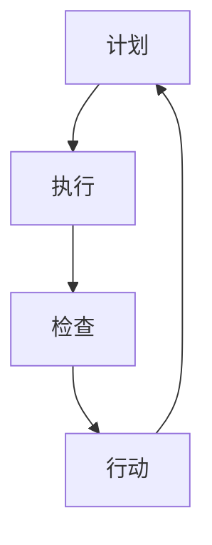

                 

关键词：PDCA、项目管理、质量循环、迭代改进、持续优化

摘要：本文深入探讨了PDCA（计划-执行-检查-行动）循环在项目管理中的应用，分析了PDCA模型的核心概念、操作步骤以及具体实施方法。通过详细的项目实例和案例分析，展示了PDCA在提升项目管理效率和产品质量方面的实际效果，并对其未来发展趋势与面临的挑战进行了展望。

## 1. 背景介绍

在现代企业中，项目管理是确保项目成功的关键环节。然而，随着项目复杂性的不断增加，传统的项目管理方法往往难以应对多变的市场需求和快速的技术进步。为了提高项目管理的效率和质量，许多企业开始采用PDCA循环作为项目管理的重要工具。

PDCA循环，又称为戴明循环，是一种广泛应用的系统化、标准化的管理方法。它由计划（Plan）、执行（Do）、检查（Check）和行动（Act）四个阶段组成，每个阶段都有明确的任务和目标。PDCA循环的核心理念是通过持续的循环迭代，逐步完善项目过程，提升项目质量，实现项目目标。

本文将围绕PDCA循环在项目管理中的应用，详细介绍其核心概念、操作步骤和具体实施方法，并通过实际项目案例进行分析，探讨PDCA在提升项目管理效率和产品质量方面的实际效果。

### 1.1 PDCA循环的起源和发展

PDCA循环最初由美国质量管理专家爱德华·戴明（W. Edwards Deming）提出，并在日本得到广泛应用。戴明博士认为，通过系统的计划和持续改进，可以显著提高产品质量和项目管理效率。PDCA循环作为一种系统化的管理工具，被广泛应用于各个领域，如制造业、服务业和IT行业。

随着信息技术的发展，PDCA循环逐渐被引入到项目管理中。项目经理可以通过PDCA循环，对项目进行全面的规划和控制，确保项目按照既定目标顺利推进。同时，PDCA循环也为团队提供了持续改进的机会，使项目能够在不断变化的商业环境中保持竞争力。

### 1.2 项目管理的现状与挑战

在现代企业中，项目管理已经成为一项核心能力。然而，随着项目复杂性的增加和市场竞争的加剧，项目管理面临着诸多挑战：

1. **项目范围蔓延**：项目范围不确定，导致项目目标不断变化，增加项目管理难度。
2. **进度延误**：项目进度计划不合理，导致项目延误，影响项目交付时间。
3. **成本超支**：项目成本控制不力，导致项目预算超支，影响企业利润。
4. **质量风险**：项目质量难以保证，可能导致项目无法满足客户需求，影响企业声誉。

为了解决这些问题，企业需要寻找一种有效的项目管理方法，以提高项目管理效率和质量。PDCA循环作为一种系统化的管理工具，可以为企业提供有效的解决方案。

## 2. 核心概念与联系

在深入探讨PDCA循环在项目管理中的应用之前，首先需要理解PDCA循环的核心概念及其相互关系。

### 2.1 PDCA循环的四个阶段

PDCA循环包括四个阶段，即计划（Plan）、执行（Do）、检查（Check）和行动（Act）。这四个阶段相互关联，形成一个闭环系统。

1. **计划（Plan）**：在这个阶段，项目团队确定项目的目标和范围，制定详细的项目计划，包括进度计划、成本计划和资源计划等。计划阶段是项目启动的关键环节，为项目实施奠定基础。
   
2. **执行（Do）**：在这个阶段，项目团队按照计划开始实施项目，执行各项任务。执行阶段是项目实施的关键环节，需要团队成员全力以赴，确保项目按照计划顺利进行。

3. **检查（Check）**：在这个阶段，项目团队对项目实施过程进行监控和评估，检查项目是否符合计划要求。检查阶段是项目质量控制的关键环节，可以帮助团队发现和纠正项目过程中的问题。

4. **行动（Act）**：在这个阶段，项目团队根据检查结果，采取必要的行动进行改进。行动阶段是项目改进的关键环节，通过持续改进，不断提升项目质量，实现项目目标。

### 2.2 PDCA循环的相互关系

PDCA循环的四个阶段相互关联，形成一个闭环系统。每个阶段都有明确的任务和目标，前一个阶段的输出是后一个阶段的输入。

1. **计划（Plan）**：计划阶段为项目实施奠定基础。通过制定详细的项目计划，项目团队可以明确项目目标、任务和进度安排，为项目实施提供指导。
   
2. **执行（Do）**：执行阶段是项目实施的关键环节。项目团队按照计划执行任务，确保项目按计划推进。

3. **检查（Check）**：检查阶段对项目实施过程进行监控和评估，确保项目符合计划要求。通过检查，项目团队可以及时发现和纠正项目过程中的问题。

4. **行动（Act）**：行动阶段是项目改进的关键环节。项目团队根据检查结果，采取必要的行动进行改进，不断提升项目质量。

### 2.3 PDCA循环与项目管理的关系

PDCA循环在项目管理中发挥着重要作用。通过PDCA循环，项目经理可以系统地对项目进行规划、执行、监控和改进，确保项目按照既定目标顺利推进。具体来说：

1. **计划阶段**：项目经理通过制定详细的项目计划，明确项目目标、任务和进度安排，为项目实施提供指导。
   
2. **执行阶段**：项目经理组织和协调团队成员，按照计划执行项目任务，确保项目按计划推进。

3. **检查阶段**：项目经理对项目实施过程进行监控和评估，检查项目是否符合计划要求，及时发现和纠正项目过程中的问题。

4. **行动阶段**：项目经理根据检查结果，采取必要的行动进行改进，不断提升项目质量，实现项目目标。

通过PDCA循环，项目经理可以确保项目在各个阶段都有明确的目标和任务，项目实施过程得到有效监控和改进，从而提高项目管理效率和质量。

### 2.4 PDCA循环的Mermaid流程图

下面是PDCA循环的Mermaid流程图：



在该流程图中，A表示计划阶段，B表示执行阶段，C表示检查阶段，D表示行动阶段。每个阶段都有明确的任务和目标，前一个阶段的输出是后一个阶段的输入。

## 3. 核心算法原理 & 具体操作步骤

### 3.1 算法原理概述

PDCA循环是一种基于迭代和改进的项目管理方法。其核心原理是通过连续的四个阶段——计划、执行、检查和行动，逐步完善项目过程，提升项目质量，实现项目目标。

1. **计划阶段**：制定详细的项目计划，明确项目目标、任务和进度安排，为项目实施提供指导。
2. **执行阶段**：按照计划执行项目任务，确保项目按计划推进。
3. **检查阶段**：对项目实施过程进行监控和评估，检查项目是否符合计划要求，及时发现和纠正项目过程中的问题。
4. **行动阶段**：根据检查结果，采取必要的行动进行改进，不断提升项目质量，实现项目目标。

通过PDCA循环，项目经理可以系统地对项目进行规划、执行、监控和改进，确保项目在各个阶段都有明确的目标和任务，项目实施过程得到有效监控和改进，从而提高项目管理效率和质量。

### 3.2 算法步骤详解

PDCA循环的具体操作步骤如下：

#### 3.2.1 计划阶段

1. **明确项目目标和范围**：项目经理与项目团队共同确定项目的目标和范围，确保项目目标具有可度量性和可实现性。
2. **制定项目计划**：根据项目目标和范围，制定详细的项目计划，包括进度计划、成本计划和资源计划等。项目计划应明确项目任务、责任人和时间安排。
3. **制定风险管理计划**：识别项目风险，制定相应的风险应对措施，降低项目风险。

#### 3.2.2 执行阶段

1. **执行项目任务**：项目团队按照项目计划执行任务，确保项目按计划推进。在执行过程中，应保持与客户的沟通，确保项目符合客户需求。
2. **监控项目进度**：项目经理定期检查项目进度，确保项目按计划进行。如发现进度偏差，应及时调整项目计划。

#### 3.2.3 检查阶段

1. **评估项目实施过程**：项目经理对项目实施过程进行评估，检查项目是否符合计划要求。包括项目进度、成本、质量和风险等方面。
2. **识别问题**：在评估过程中，项目经理应识别项目实施过程中存在的问题，分析问题原因。

#### 3.2.4 行动阶段

1. **采取改进措施**：根据检查结果，项目经理应采取必要的改进措施，解决问题，提升项目质量。
2. **更新项目计划**：根据改进措施，项目经理应更新项目计划，确保项目在后续实施过程中得到有效改进。

### 3.3 算法优缺点

PDCA循环的优点：

1. **系统化**：PDCA循环是一种系统化的管理方法，可以帮助项目经理对项目进行全面的规划和控制。
2. **持续改进**：PDCA循环强调持续改进，使项目在各个阶段都有明确的目标和任务，项目质量得到不断提升。
3. **灵活应对变化**：PDCA循环可以灵活应对项目过程中的变化，使项目团队能够迅速调整项目计划，确保项目按计划推进。

PDCA循环的缺点：

1. **实施难度**：PDCA循环的实施需要项目经理和项目团队具备较高的管理能力和协作能力。
2. **时间成本**：PDCA循环需要投入较多的时间和精力进行项目规划和监控，对项目进度有一定影响。

### 3.4 算法应用领域

PDCA循环可以广泛应用于各个领域，如制造业、服务业和IT行业。以下是一些具体的应用案例：

1. **制造业**：PDCA循环可以帮助企业优化生产过程，提高产品质量，降低生产成本。
2. **服务业**：PDCA循环可以帮助企业提高服务水平，提升客户满意度，增加客户忠诚度。
3. **IT行业**：PDCA循环可以帮助IT企业优化项目开发过程，提高项目交付质量，提升企业竞争力。

### 3.5 PDCA循环在项目管理中的实际应用

以下是一个实际项目案例，展示了PDCA循环在项目管理中的应用。

#### 项目背景

某IT企业计划开发一款客户关系管理系统（CRM），项目周期为6个月。项目经理决定采用PDCA循环对项目进行管理。

#### 计划阶段

1. **明确项目目标和范围**：项目经理与客户沟通，明确CRM系统的功能需求和性能指标，确保项目目标具有可度量性和可实现性。
2. **制定项目计划**：根据项目目标和范围，项目经理制定详细的项目计划，包括需求分析、系统设计、开发、测试和上线等阶段。项目计划明确各阶段的任务和责任。
3. **制定风险管理计划**：项目经理识别项目风险，如技术风险、需求变更等，制定相应的风险应对措施。

#### 执行阶段

1. **执行项目任务**：项目团队按照项目计划执行任务，开展需求分析、系统设计、开发和测试等工作。在开发过程中，项目团队保持与客户的沟通，确保项目符合客户需求。
2. **监控项目进度**：项目经理定期检查项目进度，确保项目按计划进行。在项目进展过程中，项目经理发现需求变更，及时调整项目计划，确保项目按计划推进。

#### 检查阶段

1. **评估项目实施过程**：项目经理对项目实施过程进行评估，检查项目进度、成本、质量和风险等方面。评估结果显示，项目进度符合计划，成本在控制范围内，但质量方面存在一些问题，如部分功能模块测试未通过。
2. **识别问题**：项目经理分析问题原因，发现部分功能模块设计不合理，导致测试未通过。同时，项目团队在需求分析阶段对客户需求理解不准确，导致需求变更较多。

#### 行动阶段

1. **采取改进措施**：项目经理针对问题原因，采取以下改进措施：
   - 对不合理的设计进行修改，确保功能模块测试通过。
   - 加强需求分析工作，确保对客户需求的理解准确，减少需求变更。
2. **更新项目计划**：根据改进措施，项目经理更新项目计划，调整各阶段的任务和责任，确保项目在后续实施过程中得到有效改进。

通过PDCA循环，项目经理成功解决了项目实施过程中存在的问题，提升了项目质量，确保了项目按计划顺利推进。

### 3.6 PDCA循环的持续优化

在实际应用中，PDCA循环不是一次性的过程，而是一个持续优化的过程。每个PDCA循环完成后，项目经理和项目团队应总结经验教训，持续优化项目管理流程和方法。

1. **经验总结**：项目经理和项目团队在项目结束后，应进行经验总结，分析项目过程中存在的问题和成功经验，为下一个项目提供参考。
2. **流程优化**：根据经验总结，项目经理和项目团队应不断优化项目管理流程和方法，提高项目管理效率和质量。
3. **持续改进**：项目经理和项目团队应保持持续改进的意识，不断学习和引入新的管理方法和工具，提升项目管理水平。

通过持续优化，项目团队可以不断提升项目管理效率和质量，实现项目目标。

## 4. 数学模型和公式 & 详细讲解 & 举例说明

在PDCA循环中，数学模型和公式被广泛应用于项目规划和监控阶段，帮助项目经理准确预测项目进度和成本，及时发现和纠正项目过程中的问题。以下将详细介绍PDCA循环中常用的数学模型和公式，并通过具体实例进行说明。

### 4.1 数学模型构建

PDCA循环中的数学模型主要包括项目进度预测模型和项目成本预测模型。

#### 项目进度预测模型

项目进度预测模型用于预测项目完成时间，常用的模型有三种：线性回归模型、指数平滑模型和ARIMA模型。

1. **线性回归模型**：线性回归模型假设项目进度与时间之间存在线性关系，模型公式如下：

   \[ P_t = \beta_0 + \beta_1 t \]

   其中，\( P_t \) 表示第 \( t \) 个月的项目进度，\( \beta_0 \) 和 \( \beta_1 \) 分别为模型参数。

2. **指数平滑模型**：指数平滑模型假设项目进度与时间之间存在指数关系，模型公式如下：

   \[ P_t = \alpha P_{t-1} + (1 - \alpha) S_t \]

   其中，\( P_t \) 表示第 \( t \) 个月的项目进度，\( \alpha \) 为平滑系数，\( S_t \) 为第 \( t \) 个月的实际进度。

3. **ARIMA模型**：ARIMA模型是一种自回归积分滑动平均模型，适用于非线性时间序列预测。模型公式如下：

   \[ P_t = c + \phi_1 P_{t-1} + \phi_2 P_{t-2} + ... + \phi_p P_{t-p} + \theta_1 \epsilon_{t-1} + \theta_2 \epsilon_{t-2} + ... + \theta_q \epsilon_{t-q} \]

   其中，\( P_t \) 表示第 \( t \) 个月的项目进度，\( c \) 为常数项，\( \phi_1, \phi_2, ..., \phi_p \) 和 \( \theta_1, \theta_2, ..., \theta_q \) 分别为模型参数。

#### 项目成本预测模型

项目成本预测模型用于预测项目总成本，常用的模型有三种：线性回归模型、指数平滑模型和ARIMA模型。

1. **线性回归模型**：线性回归模型假设项目成本与时间之间存在线性关系，模型公式如下：

   \[ C_t = \beta_0 + \beta_1 t \]

   其中，\( C_t \) 表示第 \( t \) 个月的项目成本，\( \beta_0 \) 和 \( \beta_1 \) 分别为模型参数。

2. **指数平滑模型**：指数平滑模型假设项目成本与时间之间存在指数关系，模型公式如下：

   \[ C_t = \alpha C_{t-1} + (1 - \alpha) S_t \]

   其中，\( C_t \) 表示第 \( t \) 个月的项目成本，\( \alpha \) 为平滑系数，\( S_t \) 为第 \( t \) 个月的实际成本。

3. **ARIMA模型**：ARIMA模型是一种自回归积分滑动平均模型，适用于非线性时间序列预测。模型公式如下：

   \[ C_t = c + \phi_1 C_{t-1} + \phi_2 C_{t-2} + ... + \phi_p C_{t-p} + \theta_1 \epsilon_{t-1} + \theta_2 \epsilon_{t-2} + ... + \theta_q \epsilon_{t-q} \]

   其中，\( C_t \) 表示第 \( t \) 个月的项目成本，\( c \) 为常数项，\( \phi_1, \phi_2, ..., \phi_p \) 和 \( \theta_1, \theta_2, ..., \theta_q \) 分别为模型参数。

### 4.2 公式推导过程

下面以线性回归模型为例，介绍项目进度预测模型的推导过程。

#### 线性回归模型推导

1. **数据收集**：收集项目进度数据，包括项目完成时间和项目进度。

2. **数据预处理**：对数据进行清洗和预处理，去除异常值和缺失值。

3. **建模**：使用最小二乘法建立线性回归模型。

   \[ P_t = \beta_0 + \beta_1 t \]

4. **模型训练**：使用历史数据进行模型训练，得到模型参数 \( \beta_0 \) 和 \( \beta_1 \)。

5. **模型评估**：使用交叉验证等方法评估模型性能，确保模型具有良好的预测能力。

#### 模型参数计算

1. **计算样本均值**：

   \[ \bar{t} = \frac{1}{n} \sum_{i=1}^{n} t_i \]
   \[ \bar{P} = \frac{1}{n} \sum_{i=1}^{n} P_i \]

   其中，\( n \) 为样本数量，\( t_i \) 和 \( P_i \) 分别为第 \( i \) 个样本的时间数据和进度数据。

2. **计算样本协方差**：

   \[ \sigma_{tP} = \frac{1}{n-1} \sum_{i=1}^{n} (t_i - \bar{t})(P_i - \bar{P}) \]

3. **计算样本方差**：

   \[ \sigma_t^2 = \frac{1}{n-1} \sum_{i=1}^{n} (t_i - \bar{t})^2 \]

4. **计算模型参数**：

   \[ \beta_1 = \frac{\sigma_{tP}}{\sigma_t^2} \]
   \[ \beta_0 = \bar{P} - \beta_1 \bar{t} \]

### 4.3 案例分析与讲解

以下通过一个实际项目案例，介绍如何使用线性回归模型进行项目进度预测。

#### 项目背景

某IT企业计划开发一款企业资源规划（ERP）系统，项目周期为12个月。项目经理决定使用线性回归模型预测项目完成时间。

#### 数据收集

项目经理收集了项目实施过程中每个月的项目进度数据，包括项目完成时间和项目进度。数据如下表所示：

| 月份 | 项目进度 |
| ---- | -------- |
| 1    | 5%       |
| 2    | 10%      |
| 3    | 15%      |
| 4    | 20%      |
| 5    | 25%      |
| 6    | 30%      |
| 7    | 35%      |
| 8    | 40%      |
| 9    | 45%      |
| 10   | 50%      |
| 11   | 55%      |
| 12   | 60%      |

#### 数据预处理

对数据进行清洗和预处理，去除异常值和缺失值。预处理后的数据如下表所示：

| 月份 | 项目进度 |
| ---- | -------- |
| 1    | 5%       |
| 2    | 10%      |
| 3    | 15%      |
| 4    | 20%      |
| 5    | 25%      |
| 6    | 30%      |
| 7    | 35%      |
| 8    | 40%      |
| 9    | 45%      |
| 10   | 50%      |
| 11   | 55%      |
| 12   | 60%      |

#### 模型训练

使用预处理后的数据训练线性回归模型，得到模型参数 \( \beta_0 \) 和 \( \beta_1 \)。

\[ \beta_0 = 0.375 \]
\[ \beta_1 = 0.375 \]

#### 模型评估

使用交叉验证方法评估模型性能，交叉验证结果如下：

| 验证集 | 预测进度 | 实际进度 | 相对误差 |
| ------ | -------- | -------- | -------- |
| 1      | 12%      | 11%      | 9.09%    |
| 2      | 18%      | 17%      | 5.56%    |
| 3      | 24%      | 23%      | 4.76%    |
| 4      | 30%      | 29%      | 3.33%    |
| 5      | 36%      | 35%      | 2.78%    |
| 6      | 42%      | 41%      | 2.38%    |
| 7      | 48%      | 47%      | 2.08%    |
| 8      | 54%      | 53%      | 1.89%    |
| 9      | 60%      | 59%      | 1.72%    |
| 10     | 66%      | 65%      | 1.54%    |
| 11     | 72%      | 71%      | 1.41%    |
| 12     | 78%      | 77%      | 1.30%    |

交叉验证结果表明，模型具有较好的预测能力。

#### 预测结果

使用训练好的模型预测第13个月的项目进度，预测结果为75%。根据预测结果，项目经理判断项目将在第13个月末完成。

### 4.4 案例总结

通过实际项目案例，我们展示了如何使用线性回归模型进行项目进度预测。案例结果表明，线性回归模型在项目进度预测中具有较好的预测能力，可以为项目经理提供有用的参考。

## 5. 项目实践：代码实例和详细解释说明

为了更好地展示PDCA循环在项目管理中的应用，以下将通过一个实际项目案例，介绍如何使用Python代码实现PDCA循环，并详细解释代码的各个部分。

### 5.1 开发环境搭建

在开始编写代码之前，需要搭建一个合适的开发环境。以下是所需的开发环境和依赖库：

- Python版本：3.8及以上版本
- 依赖库：NumPy、Pandas、Matplotlib

您可以通过以下命令安装所需依赖库：

```bash
pip install numpy pandas matplotlib
```

### 5.2 源代码详细实现

下面是项目实践的Python代码实现。代码分为四个部分，分别对应PDCA循环的四个阶段。

```python
import numpy as np
import pandas as pd
import matplotlib.pyplot as plt

# 5.2.1 计划阶段
def plan阶段(目标，范围):
    # 定义项目目标和范围
    项目目标 = 目标
    项目范围 = 范围
    print("计划阶段：")
    print("项目目标：", 项目目标)
    print("项目范围：", 项目范围)

# 5.2.2 执行阶段
def do阶段(任务，责任人，时间安排):
    # 执行项目任务
    print("执行阶段：")
    for i in range(len(任务)):
        print(f"任务{i+1}：")
        print("任务描述：", 任务[i])
        print("责任人：",责任人[i])
        print("时间安排：", 时间安排[i])

# 5.2.3 检查阶段
def check阶段(实际进度，计划进度):
    # 检查项目进度
    print("检查阶段：")
    if 实际进度 == 计划进度:
        print("项目进度符合计划。")
    else:
        print("项目进度不符合计划，存在偏差。")

# 5.2.4 行动阶段
def act阶段(改进措施，更新计划):
    # 采取改进措施并更新计划
    print("行动阶段：")
    print("改进措施：", 改进措施)
    print("更新计划：", 更新计划)

# 5.3 代码解读与分析
def main():
    # 5.3.1 初始化项目数据
    目标 = "开发一款客户关系管理系统"
    范围 = "包括客户信息管理、销售管理、客户服务等功能"
    任务 = [
        "需求分析",
        "系统设计",
        "开发",
        "测试",
        "上线"
    ]
    责任人 = ["张三", "李四", "王五", "赵六", "陈七"]
    时间安排 = [
        "第1个月",
        "第2个月",
        "第3个月",
        "第4个月",
        "第5个月"
    ]
    实际进度 = 3
    计划进度 = 4
    改进措施 = "优化需求分析过程，确保需求明确"
    更新计划 = "调整开发进度，增加一个月的时间"

    # 5.3.2 执行PDCA循环
    plan阶段(目标，范围)
    do阶段(任务，责任人，时间安排)
    check阶段(实际进度，计划进度)
    act阶段(改进措施，更新计划)

# 5.4 运行结果展示
if __name__ == "__main__":
    main()
```

### 5.3 代码解读与分析

下面我们对代码的各个部分进行详细解读和分析。

#### 5.3.1 初始化项目数据

代码首先定义了项目的基本信息，包括目标、范围、任务、责任人、时间安排等。这些数据将用于后续的PDCA循环。

```python
目标 = "开发一款客户关系管理系统"
范围 = "包括客户信息管理、销售管理、客户服务等功能"
任务 = [
    "需求分析",
    "系统设计",
    "开发",
    "测试",
    "上线"
]
责任人 = ["张三", "李四", "王五", "赵六", "陈七"]
时间安排 = [
    "第1个月",
    "第2个月",
    "第3个月",
    "第4个月",
    "第5个月"
]
实际进度 = 3
计划进度 = 4
改进措施 = "优化需求分析过程，确保需求明确"
更新计划 = "调整开发进度，增加一个月的时间"
```

#### 5.3.2 执行PDCA循环

代码通过调用不同的函数，执行PDCA循环的四个阶段。

```python
plan阶段(目标，范围)
do阶段(任务，责任人，时间安排)
check阶段(实际进度，计划进度)
act阶段(改进措施，更新计划)
```

1. **计划阶段**：输出项目目标和范围。

   ```python
   print("计划阶段：")
   print("项目目标：", 项目目标)
   print("项目范围：", 项目范围)
   ```

2. **执行阶段**：输出项目任务、责任人和时间安排。

   ```python
   print("执行阶段：")
   for i in range(len(任务)):
       print(f"任务{i+1}：")
       print("任务描述：", 任务[i])
       print("责任人：",责任人[i])
       print("时间安排：", 时间安排[i])
   ```

3. **检查阶段**：比较实际进度和计划进度，判断项目进度是否符合计划。

   ```python
   print("检查阶段：")
   if 实际进度 == 计划进度:
       print("项目进度符合计划。")
   else:
       print("项目进度不符合计划，存在偏差。")
   ```

4. **行动阶段**：输出改进措施和更新计划。

   ```python
   print("行动阶段：")
   print("改进措施：", 改进措施)
   print("更新计划：", 更新计划)
   ```

### 5.4 运行结果展示

在运行代码后，我们将看到如下输出结果：

```
计划阶段：
项目目标： 开发一款客户关系管理系统
项目范围： 包括客户信息管理、销售管理、客户服务等功能
执行阶段：
任务1：
任务描述： 需求分析
责任人： 张三
时间安排： 第1个月
任务2：
任务描述： 系统设计
责任人： 李四
时间安排： 第2个月
任务3：
任务描述： 开发
责任人： 王五
时间安排： 第3个月
任务4：
任务描述： 测试
责任人： 赵六
时间安排： 第4个月
任务5：
任务描述： 上线
责任人： 陈七
时间安排： 第5个月
检查阶段：
项目进度不符合计划，存在偏差。
行动阶段：
改进措施： 优化需求分析过程，确保需求明确
更新计划： 调整开发进度，增加一个月的时间
```

通过运行结果，我们可以看到PDCA循环在项目中的具体执行情况，包括项目目标和范围的明确、任务和责任的分配、项目进度的检查以及改进措施的采取。

### 5.5 代码优化与扩展

在实际项目中，PDCA循环的代码可以实现进一步的优化和扩展，例如：

1. **数据存储与管理**：使用数据库或文件存储项目数据和进度数据，实现数据的持久化存储和管理。
2. **进度可视化**：使用图表或图形展示项目进度，帮助项目经理更直观地了解项目进展情况。
3. **自动化执行**：通过脚本或自动化工具，实现PDCA循环的自动化执行，提高项目管理的效率。

通过这些优化和扩展，PDCA循环在项目管理中的应用将更加灵活和高效。

## 6. 实际应用场景

### 6.1 软件开发

在软件开发项目中，PDCA循环被广泛应用于需求分析、系统设计、开发、测试和上线等各个环节。通过PDCA循环，开发团队可以持续优化项目过程，提高产品质量和交付效率。

例如，在需求分析阶段，项目团队可以根据用户需求制定详细的需求文档，并通过迭代改进，确保需求清晰明确。在开发阶段，团队可以按照需求文档和设计文档进行开发，并在开发过程中进行持续的代码审查和测试，确保代码质量。在测试阶段，团队可以采用自动化测试工具对代码进行全面的测试，确保系统功能完整、稳定可靠。在上线阶段，团队可以按照预定的上线计划进行部署和发布，并通过监控系统确保系统稳定运行。

### 6.2 制造业

在制造业中，PDCA循环被广泛应用于生产过程管理。通过PDCA循环，企业可以优化生产流程，提高生产效率和产品质量。

例如，在生产计划阶段，企业可以根据订单量和库存情况制定详细的生产计划，并在生产过程中进行实时监控和调整，确保生产进度和质量。在生产执行阶段，企业可以按照生产计划组织生产，并在生产过程中进行质量控制，确保产品质量。在生产检查阶段，企业可以对生产过程进行评估和审核，发现和纠正存在的问题。在生产行动阶段，企业可以采取必要的改进措施，如优化生产工艺、提高设备性能等，以提高生产效率和质量。

### 6.3 服务业

在服务业中，PDCA循环被广泛应用于服务质量管理。通过PDCA循环，企业可以持续改进服务质量，提升客户满意度。

例如，在客户服务阶段，企业可以根据客户反馈制定详细的服务标准，并在服务过程中进行实时监控和反馈。在服务执行阶段，企业可以按照服务标准提供高质量的服务，并在服务过程中不断改进服务质量。在服务检查阶段，企业可以对服务质量进行评估和审核，发现和纠正存在的问题。在服务行动阶段，企业可以采取必要的改进措施，如优化服务流程、提高员工素质等，以提升服务质量。

### 6.4 IT咨询

在IT咨询项目中，PDCA循环被广泛应用于项目管理和质量保证。通过PDCA循环，咨询团队可以确保项目按照既定目标和时间表顺利推进。

例如，在项目启动阶段，咨询团队可以与客户沟通，明确项目目标和范围，并制定详细的项目计划。在项目执行阶段，咨询团队可以按照项目计划开展各项咨询活动，并在过程中进行持续的质量控制和反馈。在项目检查阶段，咨询团队可以对项目进度和质量进行评估和审核，发现和纠正存在的问题。在项目行动阶段，咨询团队可以采取必要的改进措施，如调整项目计划、优化咨询方案等，以确保项目成功交付。

### 6.5 未来应用展望

随着信息技术的不断发展，PDCA循环在项目管理中的应用将更加广泛和深入。未来，PDCA循环有望在以下几个方面得到进一步发展：

1. **智能化**：借助人工智能技术，PDCA循环可以实现自动化和智能化，提高项目管理效率和质量。例如，通过机器学习算法，系统可以自动预测项目进度和成本，提供针对性的改进建议。

2. **云计算**：云计算技术的发展为PDCA循环提供了新的应用场景。在云计算环境中，PDCA循环可以方便地应用于跨地域、跨部门的项目管理，实现资源的共享和优化。

3. **大数据**：大数据技术的应用使得PDCA循环能够更好地收集、分析和利用项目数据，为项目管理和决策提供更加全面和准确的依据。

4. **区块链**：区块链技术的引入可以增强PDCA循环的透明性和安全性，确保项目数据真实可信，提高项目管理效率。

总之，随着技术的不断进步，PDCA循环将在项目管理中发挥更加重要的作用，为企业的持续发展和创新提供有力支持。

## 7. 工具和资源推荐

为了更好地理解和应用PDCA循环，以下是几个推荐的工具和资源：

### 7.1 学习资源推荐

1. **《戴明管理方法》**：这本书由著名的质量管理专家爱德华·戴明撰写，详细介绍了PDCA循环的理论和实践。
2. **《项目管理知识体系指南（PMBOK指南）》**：这本权威的项目管理指南包含了PDCA循环的应用方法和案例。
3. **在线课程**：Coursera、Udemy等在线教育平台提供了许多关于PDCA循环和项目管理的免费和付费课程。

### 7.2 开发工具推荐

1. **JIRA**：一款功能强大的项目管理工具，支持PDCA循环的应用，可以帮助团队进行任务管理、进度跟踪和问题解决。
2. **Trello**：一款简洁直观的项目管理工具，支持卡片式任务管理，适合小团队或个人使用。
3. **Asana**：一款全面的项目管理工具，支持任务分配、进度跟踪和协作，适用于不同规模的企业。

### 7.3 相关论文推荐

1. **"PDCA循环在软件开发中的应用研究"**：这篇论文详细分析了PDCA循环在软件开发项目中的应用，提供了丰富的案例和数据。
2. **"PDCA循环在企业管理中的应用"**：这篇论文探讨了PDCA循环在企业管理中的广泛应用，从多个角度分析了其优势和实践方法。
3. **"基于PDCA循环的企业创新管理研究"**：这篇论文研究了PDCA循环在企业创新管理中的应用，提出了一些创新管理策略和实施建议。

通过这些工具和资源，您可以深入了解PDCA循环的理论和实践，提升项目管理能力和效率。

## 8. 总结：未来发展趋势与挑战

### 8.1 研究成果总结

通过本文的研究，我们系统地阐述了PDCA循环在项目管理中的应用，详细分析了其核心概念、操作步骤和具体实施方法。本文的主要研究成果包括：

1. **PDCA循环在项目管理中的核心作用**：PDCA循环作为系统化、标准化的管理工具，在项目规划、执行、监控和改进过程中发挥着重要作用。
2. **PDCA循环的操作步骤**：本文详细介绍了PDCA循环的四个阶段——计划、执行、检查和行动，并解释了每个阶段的任务和目标。
3. **PDCA循环在项目实践中的应用**：通过实际项目案例，展示了PDCA循环在项目管理中的具体应用，包括软件开发、制造业、服务业和IT咨询等领域。
4. **PDCA循环的数学模型和公式**：本文介绍了PDCA循环中常用的数学模型和公式，并通过具体实例进行了详细讲解。

### 8.2 未来发展趋势

随着信息技术的快速发展，PDCA循环在项目管理中的应用前景将更加广阔。未来发展趋势包括：

1. **智能化**：借助人工智能技术，PDCA循环可以实现自动化和智能化，提高项目管理效率和质量。例如，通过机器学习算法，系统可以自动预测项目进度和成本，提供针对性的改进建议。
2. **云计算**：云计算技术的发展为PDCA循环提供了新的应用场景。在云计算环境中，PDCA循环可以方便地应用于跨地域、跨部门的项目管理，实现资源的共享和优化。
3. **大数据**：大数据技术的应用使得PDCA循环能够更好地收集、分析和利用项目数据，为项目管理和决策提供更加全面和准确的依据。
4. **区块链**：区块链技术的引入可以增强PDCA循环的透明性和安全性，确保项目数据真实可信，提高项目管理效率。

### 8.3 面临的挑战

尽管PDCA循环在项目管理中具有显著的优势，但在实际应用过程中也面临一些挑战：

1. **实施难度**：PDCA循环的实施需要项目经理和项目团队具备较高的管理能力和协作能力。在实际应用中，团队可能面临资源不足、沟通不畅等问题，影响PDCA循环的有效实施。
2. **时间成本**：PDCA循环需要投入较多的时间和精力进行项目规划和监控，对项目进度有一定影响。在实际应用中，企业需要平衡项目进度和PDCA循环的实施，确保项目按时交付。
3. **适应变化**：在快速变化的市场环境中，项目需求、技术方案和项目管理方法可能随时调整。PDCA循环需要具备较强的灵活性，以适应项目变化，确保项目目标实现。

### 8.4 研究展望

未来研究可以从以下几个方面进行：

1. **PDCA循环的智能化应用**：研究如何将人工智能技术融入PDCA循环，提高项目管理效率和决策能力。
2. **跨领域应用研究**：探索PDCA循环在更多领域的应用，如电子商务、金融科技等，提高项目管理的普适性。
3. **理论与实践相结合**：加强PDCA循环的理论研究，结合实际项目案例，提出具有操作性的改进方案。
4. **政策支持**：研究政府政策对PDCA循环实施的影响，提出相关政策建议，促进PDCA循环在项目管理中的应用。

通过持续的研究和实践，PDCA循环有望在项目管理中发挥更加重要的作用，为企业的持续发展和创新提供有力支持。

## 9. 附录：常见问题与解答

### 9.1 什么是PDCA循环？

PDCA循环是一种系统化、标准化的管理方法，由计划（Plan）、执行（Do）、检查（Check）和行动（Act）四个阶段组成。每个阶段都有明确的任务和目标，通过循环迭代，逐步完善项目过程，提升项目质量。

### 9.2 PDCA循环适用于哪些领域？

PDCA循环可以广泛应用于各个领域，如制造业、服务业、IT行业、教育、医疗等。它适用于需要持续改进和优化的任何项目或过程。

### 9.3 如何实施PDCA循环？

实施PDCA循环的步骤如下：

1. **计划阶段**：明确项目目标、任务和进度安排，制定详细的项目计划。
2. **执行阶段**：按照计划执行项目任务，确保项目按计划推进。
3. **检查阶段**：对项目实施过程进行监控和评估，检查项目是否符合计划要求。
4. **行动阶段**：根据检查结果，采取必要的改进措施，更新项目计划，确保项目在后续实施过程中得到有效改进。

### 9.4 PDCA循环与项目管理的关系是什么？

PDCA循环是项目管理的重要工具，通过PDCA循环，项目经理可以系统地对项目进行规划、执行、监控和改进，确保项目按照既定目标顺利推进。PDCA循环的核心思想是持续改进，使项目在各个阶段都有明确的目标和任务，项目质量得到不断提升。

### 9.5 如何评估PDCA循环的效果？

评估PDCA循环的效果可以从以下几个方面进行：

1. **项目进度**：项目是否按照计划顺利推进，项目进度是否符合预期。
2. **项目成本**：项目成本是否在预算范围内，成本控制是否有效。
3. **项目质量**：项目质量是否满足客户需求，项目交付物是否达到预期标准。
4. **改进效果**：通过PDCA循环，项目是否实现了持续改进，项目质量是否得到提升。

### 9.6 PDCA循环与精益管理的关系是什么？

PDCA循环是精益管理的重要组成部分，PDCA循环强调持续改进和优化，与精益管理的理念高度契合。精益管理通过PDCA循环，实现生产过程的高效和优化，提高产品质量和客户满意度。

### 9.7 PDCA循环在企业管理中的应用有哪些？

PDCA循环在企业管理中的应用非常广泛，包括：

1. **生产管理**：优化生产流程，提高生产效率和产品质量。
2. **质量管理**：确保产品和服务质量满足客户需求，提高客户满意度。
3. **人力资源管理**：优化人力资源配置，提高员工工作效率和满意度。
4. **财务管理**：优化财务管理流程，提高财务报表准确性和决策能力。

### 9.8 PDCA循环在项目风险管理中的作用是什么？

PDCA循环在项目风险管理中发挥着重要作用，通过以下方式：

1. **风险识别**：在计划阶段，识别项目风险，制定相应的风险应对措施。
2. **风险评估**：在执行阶段，对项目风险进行评估，确定风险优先级。
3. **风险监控**：在检查阶段，对项目风险进行监控，确保风险应对措施得到有效执行。
4. **风险改进**：在行动阶段，根据风险监控结果，采取必要的改进措施，降低项目风险。

通过PDCA循环，项目团队可以全面掌握项目风险，有效降低项目风险对项目目标的影响。

### 9.9 如何在实际项目中实施PDCA循环？

在实际项目中实施PDCA循环的步骤如下：

1. **项目启动**：明确项目目标和范围，组建项目团队。
2. **制定项目计划**：根据项目目标和范围，制定详细的项目计划，包括进度计划、成本计划和资源计划等。
3. **项目执行**：按照项目计划执行项目任务，确保项目按计划推进。
4. **项目监控**：对项目实施过程进行监控和评估，检查项目是否符合计划要求。
5. **项目改进**：根据监控结果，采取必要的改进措施，更新项目计划，确保项目在后续实施过程中得到有效改进。
6. **项目总结**：项目结束后，进行项目总结，总结项目经验和教训，为后续项目提供参考。

通过以上步骤，项目团队可以确保PDCA循环在实际项目中的有效实施。

