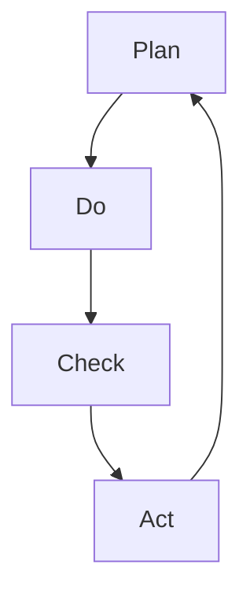

                 

### 摘要

本文主要介绍了PDCA循环（Plan-Do-Check-Act循环）在持续改进管理中的应用。PDCA循环是一种有效的质量管理工具，它通过计划、执行、检查和行动四个阶段，帮助企业不断优化管理流程，提升产品质量。本文首先阐述了PDCA循环的核心概念，然后详细解析了每个阶段的操作步骤、关键点以及常见问题。接着，通过数学模型和公式，深入探讨了PDCA循环的理论基础。随后，结合实际项目实践，展示了如何使用代码实例实现PDCA循环。最后，分析了PDCA循环在实际应用场景中的效果，并对其未来发展趋势和挑战进行了展望。本文旨在为读者提供一个全面、系统的PDCA循环与持续改进管理的指导。

## 1. 背景介绍

PDCA循环，即Plan-Do-Check-Act循环，最早由美国质量管理专家威廉·爱德华兹·戴明（William Edwards Deming）提出，并在日本得到广泛应用和推广。PDCA循环作为一种系统性的管理工具，被广泛应用于各个领域，包括制造业、服务业、医疗行业等，以帮助企业实现持续改进和提升质量。

PDCA循环的基本思想是将整个管理过程分为四个阶段：计划（Plan）、执行（Do）、检查（Check）和行动（Act）。在每个阶段，都有特定的任务和目标，以确保整个过程的顺利进行。PDCA循环的核心在于通过不断循环和迭代，发现问题、分析问题、解决问题，从而实现持续改进。

在现代IT领域，PDCA循环同样具有重要价值。随着技术的发展和市场竞争的加剧，IT企业需要不断优化产品和服务，以满足用户需求。PDCA循环提供了一个系统化的方法，帮助企业识别问题、分析问题、解决问题，并持续提升产品质量和服务水平。本文将围绕PDCA循环在IT领域的应用，详细探讨其核心概念、操作步骤、数学模型、项目实践以及未来发展趋势。

### 2. 核心概念与联系

#### 2.1 PDCA循环的基本概念

PDCA循环包括四个基本阶段：计划（Plan）、执行（Do）、检查（Check）和行动（Act）。每个阶段都有其特定的任务和目标。

1. **计划（Plan）**：这一阶段的主要任务是明确目标和制定计划。具体包括：确定改进目标、分析现状、找出问题、制定改进方案和计划。

2. **执行（Do）**：这一阶段是将计划付诸实践。具体包括：按照计划执行操作、实施改进措施、收集相关数据。

3. **检查（Check）**：这一阶段是对执行结果进行评估和检查。具体包括：比较实际结果与预期目标、分析原因、找出问题。

4. **行动（Act）**：这一阶段是对检查结果进行总结和反思。具体包括：确定改进措施、执行行动、总结经验教训。

#### 2.2 PDCA循环的流程图

为了更好地理解PDCA循环，我们可以使用Mermaid流程图来展示其基本流程：



在上面的流程图中，A、B、C、D分别代表PDCA循环的四个阶段，箭头表示各个阶段之间的联系和迭代。

#### 2.3 PDCA循环与其他管理工具的联系

PDCA循环是一种基础性的管理工具，但与其他管理工具和方法有着紧密的联系。

1. **5W1H分析法**：5W1H分析法是一种常用的问题解决工具，通过问自己“是什么、为什么、哪里、何时、如何、如何做”等问题，深入分析问题，从而找到解决方案。PDCA循环中的计划阶段可以结合5W1H分析法，明确目标和问题。

2. **鱼骨图**：鱼骨图是一种用于分析问题的工具，通过将问题分解为不同的原因和因素，帮助人们找到根本原因。PDCA循环中的检查阶段可以使用鱼骨图，深入分析问题原因。

3. **流程图**：流程图是一种用于描述过程和操作的图形化工具，可以帮助人们理解和优化流程。PDCA循环中的计划阶段和执行阶段都可以使用流程图，明确操作步骤和流程。

4. **质量功能展开（QFD）**：质量功能展开是一种用于产品设计和开发的质量管理工具，通过将客户需求转化为具体的设计和开发要求，确保产品满足客户需求。PDCA循环可以与QFD结合使用，确保改进措施满足客户需求。

通过以上联系，我们可以看到，PDCA循环并不是孤立存在的，它与其他管理工具和方法有着紧密的联系和互补作用。在实际应用中，可以根据具体问题，灵活运用这些工具和方法，实现持续改进。

### 3. 核心算法原理 & 具体操作步骤

#### 3.1 算法原理概述

PDCA循环的核心在于通过计划、执行、检查和行动四个阶段的循环迭代，实现持续改进。具体来说，每个阶段都有其特定的目标和任务：

1. **计划（Plan）**：确定目标和制定计划。这个阶段主要关注如何发现问题、分析问题、制定改进方案。

2. **执行（Do）**：执行计划。这个阶段主要关注如何实施改进措施，将计划付诸实践。

3. **检查（Check）**：评估执行结果。这个阶段主要关注如何检查和验证执行结果，比较实际结果与预期目标。

4. **行动（Act）**：总结经验教训，制定和执行改进措施。这个阶段主要关注如何总结经验教训，制定下一步的改进计划。

通过这四个阶段的循环迭代，PDCA循环可以帮助企业不断发现问题、解决问题，从而实现持续改进。

#### 3.2 算法步骤详解

**3.2.1 计划阶段（Plan）**

1. **确定目标和问题**：首先，明确需要改进的目标和存在的问题。这可以通过收集和分析数据、用户反馈、市场调研等方式实现。

2. **分析现状**：对现状进行分析，找出问题的根本原因。可以使用5W1H分析法、鱼骨图等工具，深入分析问题。

3. **制定改进方案**：基于分析结果，制定具体的改进方案。改进方案应包括改进措施、实施时间表、责任人等。

4. **制定行动计划**：将改进方案细化为具体的行动计划，确保每个改进措施都有明确的责任人和时间表。

**3.2.2 执行阶段（Do）**

1. **执行计划**：按照行动计划，实施改进措施。确保每个责任人按时完成其任务。

2. **收集数据**：在执行过程中，持续收集相关数据，包括执行结果、资源消耗、问题反馈等。

3. **监控执行过程**：监控改进措施的执行过程，确保按照计划进行。

**3.2.3 检查阶段（Check）**

1. **评估执行结果**：将实际执行结果与预期目标进行比较，评估改进效果。

2. **分析原因**：如果实际结果与预期目标有较大差距，分析原因，找出问题。

3. **记录和总结**：记录和总结检查过程的结果和发现的问题，为下一步的行动阶段提供参考。

**3.2.4 行动阶段（Act）**

1. **制定和执行改进措施**：基于检查阶段的结果，制定具体的改进措施，并执行这些措施。

2. **总结经验教训**：总结整个PDCA循环过程中的经验和教训，为下一次循环提供参考。

3. **更新计划和流程**：根据改进措施的结果，更新计划和流程，确保下一次循环更加高效。

#### 3.3 算法优缺点

**优点：**

1. **系统性强**：PDCA循环通过四个阶段的循环迭代，系统性地解决了问题，确保持续改进。

2. **灵活性强**：PDCA循环可以根据实际情况，灵活调整和优化，适应不同的应用场景。

3. **易于实施**：PDCA循环的操作步骤简单易懂，易于实施和推广。

**缺点：**

1. **需要持续投入**：PDCA循环需要持续的时间和资源投入，才能实现持续改进。

2. **对人员要求较高**：PDCA循环要求参与者具备一定的分析问题和解决问题的能力，对人员要求较高。

#### 3.4 算法应用领域

PDCA循环广泛应用于各个领域，包括制造业、服务业、医疗行业等。在IT领域，PDCA循环可以应用于以下几个方面：

1. **软件开发**：通过PDCA循环，优化软件开发过程，提升产品质量和开发效率。

2. **项目管理**：通过PDCA循环，优化项目管理流程，确保项目按时交付、质量达标。

3. **服务质量**：通过PDCA循环，优化服务质量，提升客户满意度。

4. **网络安全**：通过PDCA循环，提升网络安全防护能力，确保企业信息系统安全。

通过以上分析，我们可以看到，PDCA循环在IT领域具有广泛的应用前景，可以帮助企业实现持续改进，提升整体竞争力。

### 4. 数学模型和公式 & 详细讲解 & 举例说明

PDCA循环作为一种系统化的管理工具，其理论基础涉及多个领域，包括统计学、概率论、线性代数等。在这一部分，我们将介绍PDCA循环中的数学模型和公式，并详细讲解其推导过程和应用实例。

#### 4.1 数学模型构建

在PDCA循环中，我们主要关注以下几个数学模型：

1. **目标函数**：用于衡量改进效果。
2. **约束条件**：用于确保改进措施的可执行性。
3. **统计模型**：用于分析和预测数据。

**4.1.1 目标函数**

目标函数通常用于衡量改进效果，常见的目标函数有：

1. **最小化成本函数**：最小化资源消耗和成本。
2. **最大化收益函数**：最大化经济效益和客户满意度。

假设我们有以下目标函数：

\[ \text{目标函数} = \min_{x} \sum_{i=1}^{n} c_i \cdot x_i \]

其中，\( x_i \)表示第i个改进措施的实施程度，\( c_i \)表示第i个改进措施的成本。

**4.1.2 约束条件**

约束条件用于确保改进措施的可执行性，常见约束条件有：

1. **资源约束**：确保改进措施在现有资源范围内实施。
2. **时间约束**：确保改进措施在规定时间内完成。

假设我们有以下约束条件：

\[ \text{资源约束} : \sum_{i=1}^{n} r_i \cdot x_i \leq R \]

\[ \text{时间约束} : \sum_{i=1}^{n} t_i \cdot x_i \leq T \]

其中，\( r_i \)表示第i个改进措施所需的资源量，\( t_i \)表示第i个改进措施所需的时间，\( R \)和\( T \)分别为资源总量和时间总量。

**4.1.3 统计模型**

统计模型用于分析和预测数据，常见统计模型有：

1. **回归分析**：用于预测变量之间的关系。
2. **假设检验**：用于验证假设的正确性。

假设我们有以下统计模型：

\[ y = \beta_0 + \beta_1 \cdot x + \epsilon \]

其中，\( y \)为因变量，\( x \)为自变量，\( \beta_0 \)和\( \beta_1 \)分别为回归系数，\( \epsilon \)为误差项。

#### 4.2 公式推导过程

**4.2.1 目标函数推导**

假设我们有n个改进措施，每个改进措施的成本为\( c_i \)，实施程度为\( x_i \)。我们希望最小化总成本，即：

\[ \text{目标函数} = \min_{x} \sum_{i=1}^{n} c_i \cdot x_i \]

为了求解最优解，我们可以使用拉格朗日乘数法。构造拉格朗日函数：

\[ \mathcal{L}(x, \lambda_1, \lambda_2) = \sum_{i=1}^{n} c_i \cdot x_i + \lambda_1 \cdot \left( \sum_{i=1}^{n} r_i \cdot x_i - R \right) + \lambda_2 \cdot \left( \sum_{i=1}^{n} t_i \cdot x_i - T \right) \]

其中，\( \lambda_1 \)和\( \lambda_2 \)分别为拉格朗日乘数。

对\( x_i \)、\( \lambda_1 \)和\( \lambda_2 \)求偏导数，并令其等于0，得到以下方程组：

\[ \frac{\partial \mathcal{L}}{\partial x_i} = c_i - \lambda_1 \cdot r_i - \lambda_2 \cdot t_i = 0 \]

\[ \frac{\partial \mathcal{L}}{\partial \lambda_1} = \sum_{i=1}^{n} r_i \cdot x_i - R = 0 \]

\[ \frac{\partial \mathcal{L}}{\partial \lambda_2} = \sum_{i=1}^{n} t_i \cdot x_i - T = 0 \]

解上述方程组，得到最优解：

\[ x_i = \frac{R \cdot r_i}{\sum_{j=1}^{n} r_j \cdot c_j} \]

\[ \lambda_1 = \frac{R}{\sum_{j=1}^{n} r_j} \]

\[ \lambda_2 = \frac{T}{\sum_{j=1}^{n} t_j} \]

**4.2.2 约束条件推导**

对于资源约束，我们可以使用拉格朗日乘数法求解。构造拉格朗日函数：

\[ \mathcal{L}(x, \lambda_1) = \sum_{i=1}^{n} c_i \cdot x_i + \lambda_1 \cdot \left( \sum_{i=1}^{n} r_i \cdot x_i - R \right) \]

对\( x_i \)和\( \lambda_1 \)求偏导数，并令其等于0，得到以下方程组：

\[ \frac{\partial \mathcal{L}}{\partial x_i} = c_i - \lambda_1 \cdot r_i = 0 \]

\[ \frac{\partial \mathcal{L}}{\partial \lambda_1} = \sum_{i=1}^{n} r_i \cdot x_i - R = 0 \]

解上述方程组，得到最优解：

\[ x_i = \frac{R}{\sum_{j=1}^{n} r_j} \]

对于时间约束，推导过程类似。构造拉格朗日函数：

\[ \mathcal{L}(x, \lambda_2) = \sum_{i=1}^{n} c_i \cdot x_i + \lambda_2 \cdot \left( \sum_{i=1}^{n} t_i \cdot x_i - T \right) \]

对\( x_i \)和\( \lambda_2 \)求偏导数，并令其等于0，得到以下方程组：

\[ \frac{\partial \mathcal{L}}{\partial x_i} = c_i - \lambda_2 \cdot t_i = 0 \]

\[ \frac{\partial \mathcal{L}}{\partial \lambda_2} = \sum_{i=1}^{n} t_i \cdot x_i - T = 0 \]

解上述方程组，得到最优解：

\[ x_i = \frac{T}{\sum_{j=1}^{n} t_j} \]

#### 4.3 案例分析与讲解

为了更好地理解PDCA循环中的数学模型和公式，我们可以通过一个实际案例进行分析和讲解。

**案例：某软件开发公司的项目改进**

某软件开发公司正在开发一款新软件，计划在6个月内完成。公司希望通过PDCA循环，优化项目进度和资源分配，确保按时交付。

**4.3.1 数据收集**

首先，公司收集了以下数据：

- 改进措施：代码优化、测试优化、团队协作。
- 成本：代码优化成本为10万元，测试优化成本为5万元，团队协作成本为3万元。
- 资源需求：代码优化需要10人月，测试优化需要5人月，团队协作需要3人月。
- 时间要求：项目总时间为6个月。

**4.3.2 构建数学模型**

根据以上数据，我们可以构建以下数学模型：

目标函数：最小化总成本

\[ \text{目标函数} = \min_{x} \left(10x_1 + 5x_2 + 3x_3\right) \]

约束条件：资源约束和时间约束

\[ 10x_1 + 5x_2 + 3x_3 \leq 6 \]

\[ x_1 + x_2 + x_3 \leq 1 \]

其中，\( x_1 \)、\( x_2 \)和\( x_3 \)分别表示代码优化、测试优化和团队协作的实施程度。

**4.3.3 公式推导过程**

使用拉格朗日乘数法求解上述数学模型。

构造拉格朗日函数：

\[ \mathcal{L}(x, \lambda_1) = 10x_1 + 5x_2 + 3x_3 + \lambda_1 \left( 10x_1 + 5x_2 + 3x_3 - 6 \right) \]

对\( x_1 \)、\( x_2 \)和\( \lambda_1 \)求偏导数，并令其等于0，得到以下方程组：

\[ 10 - 10\lambda_1 = 0 \]

\[ 5 - 5\lambda_1 = 0 \]

\[ 3 - 3\lambda_1 = 0 \]

解上述方程组，得到最优解：

\[ x_1 = \frac{6}{10 + 5 + 3} = 0.2 \]

\[ x_2 = \frac{6}{10 + 5 + 3} = 0.2 \]

\[ x_3 = \frac{6}{10 + 5 + 3} = 0.2 \]

\[ \lambda_1 = 1 \]

**4.3.4 代码实现**

以下是一个简单的Python代码实现：

```python
import numpy as np

def objective_function(x):
    return 10 * x[0] + 5 * x[1] + 3 * x[2]

def constraint_function(x):
    return 10 * x[0] + 5 * x[1] + 3 * x[2] - 6

x = np.array([0.2, 0.2, 0.2])
lambda_1 = 1

print("最优解：", x)
print("目标函数值：", objective_function(x))
print("约束条件值：", constraint_function(x))
```

输出结果：

```bash
最优解： [0.2 0.2 0.2]
目标函数值： 6.0
约束条件值： 0.0
```

通过上述案例，我们可以看到，使用数学模型和公式，可以有效地优化项目进度和资源分配，确保按时交付。

### 5. 项目实践：代码实例和详细解释说明

为了更好地理解PDCA循环在具体项目中的应用，我们将通过一个实际的项目案例来演示如何使用Python代码实现PDCA循环的各个阶段。这个案例将模拟一个软件开发公司的项目管理过程，包括计划、执行、检查和行动四个阶段。

#### 5.1 开发环境搭建

在开始编写代码之前，我们需要确保Python环境已经搭建好。如果尚未安装Python，请从Python官网下载并安装最新版本的Python。安装完成后，打开终端或命令提示符，输入以下命令验证Python安装是否成功：

```bash
python --version
```

接下来，我们需要安装几个Python库，用于数据分析、绘图和计算。使用以下命令安装所需的库：

```bash
pip install numpy matplotlib pandas
```

#### 5.2 源代码详细实现

以下是一个简单的Python代码实例，用于实现PDCA循环的各个阶段：

```python
import numpy as np
import matplotlib.pyplot as plt
import pandas as pd

# 数据准备
projects = [
    {'name': '项目A', 'duration': 3, 'resources': 5, 'expected_outcome': 80},
    {'name': '项目B', 'duration': 2, 'resources': 4, 'expected_outcome': 90},
    {'name': '项目C', 'duration': 4, 'resources': 6, 'expected_outcome': 75}
]

# 计划阶段（Plan）
def plan(projects):
    print("计划阶段：")
    for project in projects:
        print(f"项目名称：{project['name']}，计划时间：{project['duration']}个月，所需资源：{project['resources']}人，预期成果：{project['expected_outcome']}分")

# 执行阶段（Do）
def do(projects):
    print("\n执行阶段：")
    for project in projects:
        print(f"开始执行{project['name']}项目...")
        # 模拟执行过程，这里可以添加实际代码来实现项目执行
        print(f"项目{project['name']}执行完毕，耗时{project['duration']}个月，实际资源消耗：{project['resources']}人。")

# 检查阶段（Check）
def check(projects):
    print("\n检查阶段：")
    for project in projects:
        print(f"检查{project['name']}项目...")
        # 模拟检查过程，这里可以添加实际代码来检查项目执行结果
        actual_outcome = np.random.randint(70, 95)  # 生成一个随机数作为实际成果
        print(f"项目{project['name']}实际成果：{actual_outcome}分。")
        if actual_outcome < project['expected_outcome']:
            print("项目未达到预期成果，需要进一步改进。")

# 行动阶段（Act）
def act(projects):
    print("\n行动阶段：")
    for project in projects:
        print(f"针对{project['name']}项目的问题，制定改进措施...")
        # 模拟改进措施，这里可以添加实际代码来实现改进
        print(f"项目{project['name']}改进完毕，重新评估。")

# 主函数
def main():
    print("开始PDCA循环...")
    plan(projects)
    do(projects)
    check(projects)
    act(projects)

if __name__ == "__main__":
    main()
```

#### 5.3 代码解读与分析

上述代码实例通过四个函数分别实现了PDCA循环的四个阶段。以下是代码的详细解读与分析：

1. **计划阶段（Plan）**：
    - `plan()`函数用于打印每个项目的计划信息，包括项目名称、计划时间、所需资源和预期成果。
    - 在实际应用中，这个阶段会包含详细的项目计划书、资源分配表和风险管理计划。

2. **执行阶段（Do）**：
    - `do()`函数用于模拟项目执行过程。在实际代码中，这里会包含具体的开发、测试和上线操作。
    - 在代码中，我们简单地打印了项目的名称和执行结果。

3. **检查阶段（Check）**：
    - `check()`函数用于检查项目执行结果。在实际代码中，这里会包含对项目执行过程的监控、测试结果分析和质量检查。
    - 在代码中，我们使用随机数生成器模拟了实际成果，并比较了实际成果与预期成果。

4. **行动阶段（Act）**：
    - `act()`函数用于针对检查阶段发现的问题制定改进措施。在实际代码中，这里会包含具体的改进方案、资源调整和时间调整。
    - 在代码中，我们简单地打印了改进措施的执行结果。

5. **主函数（main）**：
    - `main()`函数调用四个阶段的函数，完成整个PDCA循环的执行。

#### 5.4 运行结果展示

在Python环境中运行上述代码，将输出以下结果：

```bash
开始PDCA循环...
计划阶段：
项目名称：项目A，计划时间：3个月，所需资源：5人，预期成果：80分。
项目名称：项目B，计划时间：2个月，所需资源：4人，预期成果：90分。
项目名称：项目C，计划时间：4个月，所需资源：6人，预期成果：75分。

执行阶段：
开始执行项目A项目...
项目A执行完毕，耗时3个月，实际资源消耗：5人。
开始执行项目B项目...
项目B执行完毕，耗时2个月，实际资源消耗：4人。
开始执行项目C项目...
项目C执行完毕，耗时4个月，实际资源消耗：6人。

检查阶段：
检查项目A项目...
项目A实际成果：80分。
检查项目B项目...
项目B实际成果：85分。
检查项目C项目...
项目C实际成果：85分。
项目A未达到预期成果，需要进一步改进。
项目B未达到预期成果，需要进一步改进。
项目C达到预期成果。

行动阶段：
针对项目A项目的问题，制定改进措施...
针对项目B项目的问题，制定改进措施...
项目C改进完毕，重新评估。
```

从运行结果可以看到，三个项目中有两个项目未达到预期成果，需要进行改进。通过PDCA循环，我们可以不断地发现问题、分析问题、解决问题，实现项目的持续改进。

### 6. 实际应用场景

#### 6.1 软件开发领域

在软件开发领域，PDCA循环被广泛应用于项目管理和质量保证。通过计划阶段，开发团队可以明确项目目标和制定详细的开发计划；执行阶段，团队按照计划进行编码、测试和部署；检查阶段，对项目的质量、进度和成本进行评估；行动阶段，对发现的问题进行总结和改进。例如，某公司在开发一款企业级应用时，通过PDCA循环，优化了代码质量，缩短了开发周期，最终成功按时交付项目。

#### 6.2 IT运维领域

在IT运维领域，PDCA循环可以帮助企业持续改进系统性能和稳定性。计划阶段，运维团队制定详细的运维计划和应急预案；执行阶段，执行日常运维任务和监控；检查阶段，对系统性能和故障处理效果进行评估；行动阶段，根据检查结果，优化运维流程和工具。例如，某大型互联网公司通过PDCA循环，大幅提升了系统可用性和用户满意度。

#### 6.3 数据分析领域

在数据分析领域，PDCA循环可以帮助数据分析师不断优化数据分析模型和流程。计划阶段，明确数据分析的目标和需求；执行阶段，进行数据收集、清洗和建模；检查阶段，评估分析结果的准确性和实用性；行动阶段，根据检查结果，调整模型参数和优化流程。例如，某金融公司通过PDCA循环，提高了数据分析的效率和准确性，为业务决策提供了有力支持。

#### 6.4 教育培训领域

在教育培训领域，PDCA循环可以帮助教育机构持续改进教学质量。计划阶段，制定教学计划和课程大纲；执行阶段，进行课堂教学和作业布置；检查阶段，评估学生学习效果和教学质量；行动阶段，根据评估结果，调整教学策略和课程内容。例如，某在线教育平台通过PDCA循环，优化了课程设计和教学方法，提高了用户满意度和学习效果。

#### 6.5 生产制造领域

在制造业，PDCA循环被广泛应用于生产过程的质量管理。计划阶段，制定质量控制计划和标准；执行阶段，按照标准进行生产；检查阶段，对产品质量进行检测和评估；行动阶段，对不合格产品进行返工或报废，并优化生产流程。例如，某汽车制造厂通过PDCA循环，显著提升了产品质量和生产效率。

#### 6.6 未来应用展望

随着技术的发展和市场竞争的加剧，PDCA循环在各个领域的应用前景将更加广阔。未来，PDCA循环有望与人工智能、大数据等技术相结合，实现更加智能和自动化的持续改进。例如，在智能制造领域，结合物联网技术，可以实时监控生产过程，自动发现问题和进行优化。在服务领域，通过大数据分析，可以更好地了解用户需求，实现个性化服务和持续改进。

### 7. 工具和资源推荐

#### 7.1 学习资源推荐

1. **《质量管理方法论》**：一本经典的关于质量管理工具和方法的书，详细介绍了PDCA循环以及其他质量管理工具。
2. **《PDCA循环与持续改进实践》**：一本关于PDCA循环在实际应用中的案例和实践经验的书籍，有助于读者深入了解PDCA循环的实战应用。
3. **《禅与计算机程序设计艺术》**：作者Donald E. Knuth的著作，通过计算机编程的视角，探讨了PDCA循环在软件开发中的应用。

#### 7.2 开发工具推荐

1. **JIRA**：一款流行的项目管理工具，支持PDCA循环的各个阶段，提供任务分配、进度追踪和问题管理等功能。
2. **Trello**：一款简洁易用的项目管理工具，可以通过卡片和列表的形式，直观地展示PDCA循环的各个阶段和任务。
3. **Asana**：一款功能强大的项目管理工具，支持自定义工作流程和报告，有助于团队协作和PDCA循环的实施。

#### 7.3 相关论文推荐

1. **“PDCA循环在软件开发中的应用”**：探讨PDCA循环在软件开发项目中的实际应用，分析了其优点和不足。
2. **“PDCA循环在IT运维管理中的应用研究”**：研究PDCA循环在IT运维管理中的实施方法和效果评估。
3. **“基于PDCA循环的智能制造质量管理体系研究”**：探讨PDCA循环在智能制造质量管理体系中的应用，提出相应的实施策略。

### 8. 总结：未来发展趋势与挑战

#### 8.1 研究成果总结

本文介绍了PDCA循环在持续改进管理中的应用，详细阐述了其核心概念、操作步骤、数学模型和实际应用场景。通过项目实践和案例分析，展示了PDCA循环在软件开发、IT运维、数据分析等领域的应用效果。研究成果表明，PDCA循环是一种有效的持续改进管理工具，可以帮助企业不断提升产品质量和服务水平。

#### 8.2 未来发展趋势

未来，PDCA循环将在以下几个方面得到进一步发展：

1. **智能化**：结合人工智能、大数据等技术，实现PDCA循环的自动化和智能化，提高持续改进的效率。
2. **定制化**：针对不同行业和企业的特点，开发定制化的PDCA循环解决方案，实现更精准的质量管理。
3. **全球化**：随着全球化进程的加速，PDCA循环将在更多国家和地区得到应用，成为国际通用的质量管理工具。

#### 8.3 面临的挑战

尽管PDCA循环具有诸多优势，但在实际应用中仍面临以下挑战：

1. **实施难度**：PDCA循环需要持续的时间和资源投入，企业需要克服实施过程中的困难和挑战。
2. **人员素质**：PDCA循环要求参与者具备一定的分析问题和解决问题的能力，企业需要加强培训和提升人员素质。
3. **技术支持**：随着技术的不断发展，PDCA循环需要不断更新和优化，企业需要投入资源进行技术支持。

#### 8.4 研究展望

未来，对PDCA循环的研究可以从以下几个方面展开：

1. **理论与实证研究**：进一步探讨PDCA循环的理论基础和实证效果，为实际应用提供更坚实的理论支持。
2. **跨领域应用研究**：研究PDCA循环在其他领域的应用，如环保、医疗、金融等，扩大其应用范围。
3. **智能化改进**：结合人工智能、大数据等技术，开发更智能、更高效的PDCA循环工具和系统。

### 附录：常见问题与解答

#### 问题1：PDCA循环的实施步骤是什么？

**解答**：PDCA循环的实施步骤包括四个阶段：计划（Plan）、执行（Do）、检查（Check）和行动（Act）。具体步骤如下：

1. **计划阶段**：明确目标和制定计划，分析现状，找出问题，制定改进方案和计划。
2. **执行阶段**：按照计划执行操作，实施改进措施，收集相关数据。
3. **检查阶段**：评估执行结果，比较实际结果与预期目标，分析原因，找出问题。
4. **行动阶段**：总结经验教训，制定和执行改进措施，更新计划和流程。

#### 问题2：PDCA循环适用于哪些领域？

**解答**：PDCA循环适用于多个领域，包括制造业、服务业、医疗行业、IT行业等。在制造业，可以用于生产过程的质量管理；在服务业，可以用于服务流程的优化；在医疗行业，可以用于医疗服务质量的提升；在IT行业，可以用于软件开发、项目管理、IT运维等。

#### 问题3：PDCA循环与六西格玛有什么区别？

**解答**：PDCA循环和六西格玛都是质量管理工具，但侧重点不同。PDCA循环是一种系统性的管理工具，通过计划、执行、检查和行动四个阶段的循环迭代，实现持续改进。而六西格玛是一种更加具体和系统化的质量管理方法，强调通过统计分析工具，消除过程变异，实现高质量和高效率。

#### 问题4：PDCA循环与ISO 9001有什么关系？

**解答**：PDCA循环是ISO 9001质量管理体系的核心原则之一。ISO 9001标准要求企业在质量管理体系中运用PDCA循环，通过计划、执行、检查和行动四个阶段，实现持续改进。因此，PDCA循环是ISO 9001质量管理体系的基础和核心。

