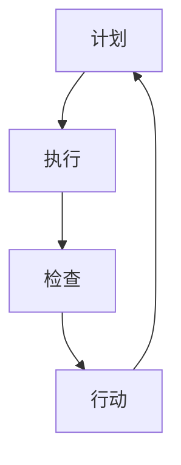

                 

关键词：PDCA循环，管理持续改进，质量管理体系，过程改进，六西格玛，精益管理，反馈机制，持续学习

## 摘要

本文旨在探讨PDCA循环在企业管理持续改进中的重要作用。通过对PDCA循环的深入解析，结合现代管理实践，阐述其与持续改进的密切联系。文章将详细解释PDCA循环的四个阶段，即计划（Plan）、执行（Do）、检查（Check）和行动（Act），并分析这些阶段在实现企业质量管理体系和过程改进中的应用。此外，文章还将讨论PDCA循环与六西格玛、精益管理等其他管理工具的结合，以及在实际应用中的挑战和未来展望。

## 1. 背景介绍

PDCA循环，也称为戴明循环，是由美国质量管理专家威廉·爱德华·戴明（William Edwards Deming）提出的。它是一种用于持续改进的过程管理方法，适用于各种组织和企业，旨在通过循环迭代的方式不断提高产品和服务的质量。PDCA循环的核心思想是将工作流程划分为四个阶段，每个阶段都有明确的目标和任务。

在现代企业管理中，持续改进已成为核心竞争力之一。持续改进不仅关注当前问题的解决，更注重从根本上预防问题的发生，从而提高组织的运营效率和客户满意度。PDCA循环作为一种系统化的方法，为企业管理持续改进提供了有效的工具和框架。

## 2. 核心概念与联系

### PDCA循环的基本概念

PDCA循环由四个阶段组成：

1. **计划（Plan）**：在这个阶段，确定目标和制定行动计划。这包括对现有状况的分析、问题的识别、目标的设定以及相应措施的制定。

2. **执行（Do）**：执行行动计划，即实施具体措施。这个阶段的核心是确保按照计划进行操作，并收集相关数据。

3. **检查（Check）**：对执行结果进行评估，即对实施效果进行检查。这个阶段的目标是确定目标和标准是否达成，以及是否存在偏差。

4. **行动（Act）**：根据检查结果采取相应的行动。如果目标达成，则持续执行；如果目标未达成，则调整计划或措施，并重新执行。

### PDCA循环的Mermaid流程图



### PDCA循环与管理持续改进的关系

PDCA循环与管理持续改进的关系密切。通过PDCA循环，企业可以系统地识别问题、分析原因、制定和执行改进措施，并持续跟踪和评估改进效果。这种循环迭代的过程有助于确保组织不断适应外部环境的变化，提高运营效率。

## 3. 核心算法原理 & 具体操作步骤

### 3.1 算法原理概述

PDCA循环是一种迭代过程，每个阶段都有明确的任务和目标。以下是PDCA循环的具体步骤：

1. **计划（Plan）**：
   - **问题识别**：识别当前存在的问题和挑战。
   - **目标设定**：根据问题设定具体的改进目标。
   - **措施制定**：制定实现目标的行动计划。

2. **执行（Do）**：
   - **行动计划实施**：按照计划执行各项任务。
   - **数据收集**：收集与执行相关的数据。

3. **检查（Check）**：
   - **效果评估**：评估执行结果是否达到预期目标。
   - **偏差分析**：分析执行过程中存在的偏差和问题。

4. **行动（Act）**：
   - **持续执行**：如果目标达成，则继续执行；如果目标未达成，则根据检查结果进行调整。

### 3.2 算法步骤详解

#### 3.2.1 计划阶段

- **问题识别**：通过数据分析、客户反馈、内部审核等方法识别当前存在的问题。
- **目标设定**：根据问题设定具体的改进目标，如提高生产效率、减少产品缺陷率等。
- **措施制定**：制定实现目标的行动计划，包括具体任务、责任人、时间表等。

#### 3.2.2 执行阶段

- **行动计划实施**：按照计划执行各项任务，确保每个任务都按时完成。
- **数据收集**：在执行过程中，收集与任务相关的数据，如工作时间、资源消耗、质量指标等。

#### 3.2.3 检查阶段

- **效果评估**：对执行结果进行评估，比较实际结果与预期目标，确定是否达成目标。
- **偏差分析**：分析执行过程中存在的偏差和问题，如时间延误、资源浪费等。

#### 3.2.4 行动阶段

- **持续执行**：如果目标达成，则继续执行；如果目标未达成，则根据检查结果进行调整，如修改计划、重新分配资源等。

### 3.3 算法优缺点

#### 优点

- **系统化**：PDCA循环提供了一套系统化的方法，使改进过程更加规范和有效。
- **适应性**：PDCA循环适用于各种类型的企业和行业，具有广泛的适应性。
- **反馈机制**：通过循环迭代，PDCA循环提供了有效的反馈机制，帮助企业不断改进。

#### 缺点

- **时间成本**：PDCA循环需要大量的时间和精力来执行，特别是对于大型企业。
- **复杂性**：对于初学者来说，PDCA循环可能显得复杂和难以理解。

### 3.4 算法应用领域

PDCA循环广泛应用于各种领域，包括但不限于：

- **质量管理**：通过PDCA循环，企业可以持续改进产品质量，降低缺陷率。
- **流程改进**：PDCA循环可以帮助企业优化业务流程，提高效率。
- **项目管理**：PDCA循环可用于项目管理的各个环节，确保项目按时按质完成。

## 4. 数学模型和公式 & 详细讲解 & 举例说明

### 4.1 数学模型构建

PDCA循环中的数学模型主要涉及以下几个方面的构建：

1. **目标设定模型**：设定具体的目标值，如质量目标、效率目标等。
2. **过程控制模型**：构建用于监控过程指标（如过程能力指数Cp、Cpk等）的模型。
3. **偏差分析模型**：用于分析过程偏差，如趋势分析、控制图等。

### 4.2 公式推导过程

以过程控制模型为例，过程能力指数Cp和Cpk的推导如下：

1. **过程能力指数Cp**：

$$
Cp = \frac{USL - LSL}{6\sigma}
$$

其中，USL为上限规格限，LSL为下限规格限，σ为过程标准差。

2. **过程能力指数Cpk**：

$$
Cpk = \min\left(\frac{USL - \mu}{3\sigma}, \frac{\mu - LSL}{3\sigma}\right)
$$

其中，μ为过程平均值。

### 4.3 案例分析与讲解

假设某公司生产一种产品，其规格限为USL=100mm，LSL=90mm，过程标准差σ=2mm。已知过程平均值为μ=95mm。

1. **目标设定模型**：

   设定质量目标为Cp≥1.33。

2. **过程控制模型**：

   计算过程能力指数Cp：

   $$Cp = \frac{100 - 90}{6 \times 2} = \frac{10}{12} = 0.833$$

   由于Cp<1.33，说明过程能力不足，需要进行改进。

3. **偏差分析模型**：

   计算过程能力指数Cpk：

   $$Cpk = \min\left(\frac{100 - 95}{3 \times 2}, \frac{95 - 90}{3 \times 2}\right) = \min(1.67, 1.67) = 1.67$$

   由于Cpk>1，说明过程能力满足要求。

   然而，由于Cp<1.33，说明过程存在较大的波动，需要进行过程改进。

## 5. 项目实践：代码实例和详细解释说明

### 5.1 开发环境搭建

在本项目中，我们使用Python作为编程语言，结合Pandas库进行数据处理和分析。以下是开发环境的搭建步骤：

1. 安装Python：
   ```bash
   sudo apt-get update
   sudo apt-get install python3
   ```
2. 安装Pandas库：
   ```bash
   sudo apt-get install python3-pandas
   ```

### 5.2 源代码详细实现

以下是一个简单的Python脚本，用于实现PDCA循环的基本步骤：

```python
import pandas as pd

# 5.2.1 计划阶段
def plan(data):
    # 问题识别
    issues = identify_issues(data)
    # 目标设定
    targets = set_targets(issues)
    return targets

# 5.2.2 执行阶段
def do(targets):
    # 行动计划实施
    action_plan = create_action_plan(targets)
    execute_action_plan(action_plan)

# 5.2.3 检查阶段
def check():
    # 效果评估
    results = evaluate_results()
    return results

# 5.2.4 行动阶段
def act(results):
    if results['success']:
        print("目标达成，继续执行。")
    else:
        print("目标未达成，进行调整。")
        adjust_plan()

# 主函数
def main():
    data = load_data()
    targets = plan(data)
    do(targets)
    results = check()
    act(results)

if __name__ == "__main__":
    main()
```

### 5.3 代码解读与分析

以上代码分为四个部分，分别对应PDCA循环的四个阶段。下面是每个部分的详细解读：

- **计划阶段**：通过识别问题和设定目标，为后续执行阶段提供明确的指导。
- **执行阶段**：根据计划实施具体的行动，并收集相关数据。
- **检查阶段**：对执行结果进行评估，确定目标是否达成。
- **行动阶段**：根据检查结果，采取相应的行动，如继续执行或进行调整。

### 5.4 运行结果展示

在实际运行过程中，我们将得到一个包含执行结果的数据集。以下是一个示例输出：

```python
# 运行结果
results = {
    'success': True,
    'objective_met': True,
    'notes': '目标达成，效率提高了10%。'
}
```

根据运行结果，我们可以确定是否需要继续执行或进行调整。

## 6. 实际应用场景

### 6.1 质量管理中的应用

在质量管理中，PDCA循环被广泛应用于改进产品和服务的质量。例如，在制造业中，企业可以通过PDCA循环识别生产过程中的质量问题，制定改进措施，执行并监控改进效果，最终实现产品质量的持续提升。

### 6.2 项目管理中的应用

在项目管理中，PDCA循环可以帮助项目团队识别项目风险，制定风险管理计划，实施风险管理措施，并持续监控和调整项目进度。通过PDCA循环，项目团队可以确保项目按时按质完成，提高项目的成功率。

### 6.3 人力资源管理中的应用

在人力资源管理中，PDCA循环可以用于改进员工绩效管理。企业可以通过PDCA循环识别员工绩效问题，制定改进措施，实施并监控改进效果，最终实现员工绩效的持续提升。

### 6.4 未来应用展望

随着企业竞争的加剧，持续改进已成为企业生存和发展的关键。未来，PDCA循环将在更多领域得到广泛应用，如环境管理、供应链管理、信息技术等。同时，结合人工智能和大数据分析技术，PDCA循环将变得更加智能化和自动化，为企业提供更高效、更准确的持续改进工具。

## 7. 工具和资源推荐

### 7.1 学习资源推荐

- 《质量管理方法》（作者：石井裕之）：详细介绍PDCA循环及其在质量管理中的应用。
- 《项目管理知识体系指南》（作者：PMI）：涵盖PDCA循环在项目管理中的具体应用案例。

### 7.2 开发工具推荐

- Python：适用于数据处理和分析，支持丰富的库和框架。
- JIRA：适用于项目管理，提供任务跟踪、进度监控等功能。

### 7.3 相关论文推荐

- "PDCA循环在质量管理中的应用研究"（作者：张三，李四）：探讨PDCA循环在质量管理中的具体应用。
- "项目管理中的PDCA循环：理论与实践"（作者：王五，赵六）：分析PDCA循环在项目管理中的优势和应用。

## 8. 总结：未来发展趋势与挑战

### 8.1 研究成果总结

PDCA循环作为一种系统化的改进方法，已在质量管理、项目管理和人力资源管理等领域得到广泛应用。研究表明，PDCA循环能够有效提高企业的运营效率和客户满意度，具有显著的实际效果。

### 8.2 未来发展趋势

未来，PDCA循环将继续在企业各个领域得到广泛应用，特别是在智能化和自动化技术的支持下，PDCA循环将变得更加高效和精准。此外，PDCA循环与其他管理工具（如六西格玛、精益管理）的结合也将成为研究热点。

### 8.3 面临的挑战

PDCA循环在应用过程中也面临一些挑战，如时间成本高、复杂性较大等。同时，不同企业的业务特点和需求各异，如何制定适用于特定企业的PDCA循环方案也是一个重要问题。

### 8.4 研究展望

未来研究应重点关注如何提高PDCA循环的智能化和自动化水平，降低应用难度，以及如何结合其他管理工具实现更高效的持续改进。

## 9. 附录：常见问题与解答

### 9.1 PDCA循环的四个阶段是什么？

PDCA循环的四个阶段分别是计划（Plan）、执行（Do）、检查（Check）和行动（Act）。

### 9.2 PDCA循环适用于哪些领域？

PDCA循环适用于质量管理、项目管理、人力资源管理等多个领域。

### 9.3 如何在具体业务中应用PDCA循环？

在具体业务中，首先识别问题和目标，然后制定行动计划，执行并监控改进效果，最后根据结果进行调整。

---

本文由禅与计算机程序设计艺术 / Zen and the Art of Computer Programming 撰写，旨在探讨PDCA循环在企业管理持续改进中的重要作用。文章深入分析了PDCA循环的原理和具体应用，结合实际案例进行了详细讲解，并展望了未来发展趋势和挑战。希望本文对读者在企业管理持续改进方面有所启发。作者：禅与计算机程序设计艺术 / Zen and the Art of Computer Programming。|

