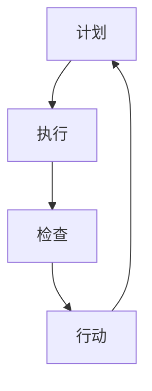

                 

关键词：PDCA、持续改进、质量控制、效率提升、流程优化

> 摘要：本文将深入探讨PDCA（计划、执行、检查、行动）循环模式在IT领域的实际应用。通过详细解析PDCA的四个核心阶段，我们将揭示如何通过这一框架有效提升项目质量、优化工作流程，并最终实现组织效率的持续提升。

## 1. 背景介绍

PDCA循环模式，也被称为戴明环，是一种广泛应用于质量管理领域的循环改进方法。PDCA循环包括四个相互衔接的阶段：计划（Plan）、执行（Do）、检查（Check）和行动（Act）。这种方法最早由著名的统计学家和质量管理专家威廉·爱德华·戴明提出，并在20世纪中叶被广泛应用于制造业。

随着信息技术的飞速发展，PDCA循环模式也逐渐在IT行业得到了广泛的应用。无论是在软件开发、系统集成，还是在IT服务管理中，PDCA循环都能发挥其独特的优势，帮助团队和公司实现持续改进，提升项目质量，优化工作流程，并最终实现效率的全面提升。

本文将围绕PDCA循环的四个阶段，详细解析其在IT领域的具体应用，并通过实际案例和项目实践，展示如何将这一框架有效落地，助力企业和团队在激烈的市场竞争中立于不败之地。

## 2. 核心概念与联系

### 2.1 PDCA循环的概念解析

PDCA循环是一种基于持续改进的理念，通过四个阶段的循环往复，实现对项目或流程的不断优化。具体而言：

- **计划（Plan）**：在这个阶段，团队需要明确目标和问题，制定详细的计划，包括策略、方法和时间表。这一步骤是PDCA循环的基础，决定了后续执行的方向和标准。

- **执行（Do）**：执行阶段是将计划付诸实践的过程。在这个阶段，团队需要严格按照计划进行操作，确保每一个步骤都得到有效执行。

- **检查（Check）**：检查阶段是对执行结果的评估和反馈。通过数据分析和实际表现，团队可以识别出过程中的问题，为后续的改进提供依据。

- **行动（Act）**：行动阶段是针对检查阶段发现的问题进行改进和优化。通过总结经验教训，团队可以调整计划，制定新的策略，并重新进入PDCA循环。

### 2.2 PDCA循环与IT领域的关联

在IT领域，PDCA循环可以应用于多个方面，包括软件开发、IT项目管理、运维管理等。以下是一个简单的Mermaid流程图，展示了PDCA循环在IT领域的具体应用和各个环节的相互关系。



在这个流程图中，计划阶段包括需求分析、设计、开发和测试等步骤，执行阶段是编码和开发，检查阶段是代码审查和测试结果分析，行动阶段则是根据检查结果进行代码优化和更新。

### 2.3 PDCA循环的核心原理

PDCA循环的核心原理在于通过持续迭代和改进，逐步提升项目或流程的质量和效率。具体来说：

- **系统性**：PDCA循环强调系统性的思考和操作，通过各个环节的有机结合，实现整体优化的效果。

- **持续改进**：PDCA循环是一种持续改进的方法，通过不断的循环和迭代，项目或流程能够逐步优化，适应不断变化的需求和环境。

- **数据驱动**：PDCA循环注重数据分析和反馈，通过检查阶段的数据收集和分析，团队可以准确识别问题和改进方向。

- **全员参与**：PDCA循环鼓励全员参与，通过自上而下的规划和自下而上的反馈，实现全团队的共同努力和协同进步。

## 3. 核心算法原理 & 具体操作步骤

### 3.1 算法原理概述

PDCA循环的核心在于其四个阶段的相互衔接和迭代。以下是每个阶段的简要概述：

- **计划（Plan）**：明确目标和问题，制定详细的计划，包括任务分配、时间表和资源需求。

- **执行（Do）**：按照计划执行任务，确保每一个步骤都得到有效执行。

- **检查（Check）**：对执行结果进行评估和反馈，通过数据分析和实际表现，识别出过程中的问题。

- **行动（Act）**：根据检查结果进行改进和优化，调整计划，并重新进入PDCA循环。

### 3.2 算法步骤详解

#### 3.2.1 计划阶段

1. **明确目标和问题**：首先，团队需要明确当前项目或流程的目标和存在的问题。这可以通过需求分析、用户反馈和内部评估等方式进行。

2. **制定详细计划**：基于目标和问题，团队需要制定详细的计划，包括任务分配、时间表和资源需求。计划应尽可能具体和可操作，以确保后续执行阶段的顺利进行。

3. **风险评估**：在计划阶段，团队还应进行风险评估，预测可能遇到的问题和挑战，并制定相应的应对策略。

#### 3.2.2 执行阶段

1. **执行任务**：按照计划执行任务，确保每一个步骤都得到有效执行。在这一阶段，团队需要保持高度的执行力，严格按照计划进行操作。

2. **监控进度**：在执行过程中，团队应持续监控进度，及时发现和解决潜在问题。

3. **记录数据**：执行阶段的数据记录非常重要，这些数据将在检查阶段用于分析和评估。

#### 3.2.3 检查阶段

1. **数据分析**：对执行阶段收集的数据进行分析，评估项目的实际表现和存在的问题。

2. **识别问题**：通过数据分析，团队可以识别出过程中的问题和瓶颈。

3. **反馈机制**：建立有效的反馈机制，将分析结果及时反馈给相关人员和团队，确保问题得到有效解决。

#### 3.2.4 行动阶段

1. **制定改进计划**：基于检查阶段的分析结果，团队需要制定改进计划，包括具体的改进措施和时间表。

2. **执行改进措施**：按照改进计划执行具体措施，解决检查阶段发现的问题。

3. **总结经验教训**：在行动阶段结束后，团队应总结经验教训，为下一个PDCA循环提供参考。

### 3.3 算法优缺点

#### 优点

- **系统性强**：PDCA循环强调系统性的思考和操作，通过各个环节的相互衔接，实现整体优化的效果。

- **持续改进**：PDCA循环是一种持续改进的方法，通过不断的循环和迭代，项目或流程能够逐步优化，适应不断变化的需求和环境。

- **数据驱动**：PDCA循环注重数据分析和反馈，通过检查阶段的数据收集和分析，团队可以准确识别问题和改进方向。

- **全员参与**：PDCA循环鼓励全员参与，通过自上而下的规划和自下而上的反馈，实现全团队的共同努力和协同进步。

#### 缺点

- **执行难度**：PDCA循环要求团队成员具备较高的执行力，否则容易在执行阶段出现偏差。

- **数据依赖**：PDCA循环的执行高度依赖数据的准确性和完整性，如果数据收集和分析不到位，将影响整个循环的效果。

- **时间成本**：PDCA循环需要投入较多的时间和精力，特别是在初始阶段，可能需要较长时间来制定详细的计划和进行数据收集和分析。

### 3.4 算法应用领域

PDCA循环在IT领域有广泛的应用，以下是一些典型的应用场景：

- **软件开发**：在软件开发过程中，PDCA循环可以应用于需求分析、设计、开发和测试等各个环节，帮助团队不断提升软件质量。

- **IT项目管理**：在IT项目管理中，PDCA循环可以用于项目规划、执行、监控和评估，确保项目按时交付，并达到预期质量。

- **运维管理**：在运维管理中，PDCA循环可以应用于故障处理、系统监控、性能优化和安全管理，确保系统稳定运行。

- **质量控制**：PDCA循环可以用于质量控制过程，通过不断的循环和改进，提升产品和服务的质量。

## 4. 数学模型和公式 & 详细讲解 & 举例说明

### 4.1 数学模型构建

PDCA循环中的数学模型主要涉及以下几个方面：

1. **质量目标设定**：根据项目需求和用户期望，设定具体的质量目标。可以用数学公式表示为：
   $$ Q = f(R, T, C) $$
   其中，$Q$ 表示质量目标，$R$ 表示资源，$T$ 表示时间，$C$ 表示成本。

2. **过程能力分析**：通过统计方法，分析过程能力是否满足质量目标。常用的统计方法包括过程能力指数（Cp）和过程性能指数（Cpk）。公式如下：
   $$ Cp = \frac{USL - LSL}{6\sigma} $$
   $$ Cpk = \min\left(\frac{USL - \mu}{3\sigma}, \frac{\mu - LSL}{3\sigma}\right) $$
   其中，$USL$ 表示规格上限，$LSL$ 表示规格下限，$\mu$ 表示过程均值，$\sigma$ 表示过程标准差。

3. **改进效果评估**：通过对比改进前后的质量指标，评估改进效果。常用的评估指标包括质量损失函数（Lose Function）和改进效果指数（Effectiveness Index）。公式如下：
   $$ LF = \int_{\Omega} [Q^* - Q] d\Omega $$
   $$ EI = \frac{LF_{\text{改进前}} - LF_{\text{改进后}}}{LF_{\text{改进前}}} \times 100\% $$
   其中，$Q^*$ 表示理想质量水平，$\Omega$ 表示质量指标空间。

### 4.2 公式推导过程

1. **质量目标设定**：

   质量目标设定主要基于用户需求和市场标准。首先，收集用户需求，明确产品的关键性能指标（KPI）。然后，根据市场需求和竞争情况，设定合理的产品质量目标。

   假设用户需求为 $R$，市场需求为 $T$，成本为 $C$，则质量目标可以表示为：
   $$ Q = f(R, T, C) $$
   其中，$f$ 为一个函数，表示质量目标的设定过程。

2. **过程能力分析**：

   过程能力分析主要基于统计学原理。首先，收集过程数据，计算过程均值 $\mu$ 和过程标准差 $\sigma$。然后，根据规格上限 $USL$ 和规格下限 $LSL$，计算过程能力指数 $Cp$ 和过程性能指数 $Cpk$。

   过程能力指数 $Cp$ 表示过程在规格范围内变化的程度，计算公式为：
   $$ Cp = \frac{USL - LSL}{6\sigma} $$
   其中，$USL$ 表示规格上限，$LSL$ 表示规格下限，$\sigma$ 表示过程标准差。

   过程性能指数 $Cpk$ 表示过程在规格上下限之间变化的程度，计算公式为：
   $$ Cpk = \min\left(\frac{USL - \mu}{3\sigma}, \frac{\mu - LSL}{3\sigma}\right) $$
   其中，$\mu$ 表示过程均值。

3. **改进效果评估**：

   改进效果评估主要基于质量损失函数（Lose Function）和改进效果指数（Effectiveness Index）。质量损失函数表示产品在实际生产和销售过程中，由于质量问题导致的损失。改进效果指数表示改进前后质量损失的减少比例。

   质量损失函数 $LF$ 的计算公式为：
   $$ LF = \int_{\Omega} [Q^* - Q] d\Omega $$
   其中，$Q^*$ 表示理想质量水平，$\Omega$ 表示质量指标空间。

   改进效果指数 $EI$ 的计算公式为：
   $$ EI = \frac{LF_{\text{改进前}} - LF_{\text{改进后}}}{LF_{\text{改进前}}} \times 100\% $$
   其中，$LF_{\text{改进前}}$ 和 $LF_{\text{改进后}}$ 分别表示改进前后的质量损失函数。

### 4.3 案例分析与讲解

#### 案例背景

某IT公司开发一款新的软件产品，客户对产品的性能和稳定性有较高的要求。在项目初期，公司设定了以下质量目标：

- 性能：响应时间不超过500毫秒。
- 稳定性：平均无故障时间（MTTF）不低于1000小时。

公司采用PDCA循环模式，对项目进行持续改进。以下是具体的分析过程：

1. **计划阶段**：

   - **目标设定**：设定性能目标和稳定性目标。
   - **资源分配**：确定开发人员、测试人员和硬件资源。
   - **时间表**：制定详细的项目时间表，包括开发、测试和上线阶段。

2. **执行阶段**：

   - **开发阶段**：按照计划，开发团队进行编码和单元测试。
   - **测试阶段**：测试团队进行集成测试和系统测试，记录响应时间和故障率。

3. **检查阶段**：

   - **数据分析**：对测试阶段的数据进行分析，计算平均响应时间和故障率。
   - **问题识别**：识别出性能和稳定性方面的问题，如某些功能模块的响应时间过长，系统在高负载下的稳定性不足。

4. **行动阶段**：

   - **改进措施**：针对识别出的问题，开发团队优化代码，测试团队增加测试用例，提高测试覆盖率。
   - **再测试**：对改进后的产品进行再次测试，验证改进效果。

#### 数据分析与改进

1. **质量目标设定**：

   - 性能目标：$Q_p = \frac{1}{\text{平均响应时间}} \leq 2$
   - 稳定性目标：$Q_s = \frac{1}{\text{平均无故障时间}} \leq 0.001$

2. **过程能力分析**：

   - 性能：$Cp_p = \frac{USL_p - LSL_p}{6\sigma_p} = \frac{500 - 0}{6 \times 50} = 0.8333$
   - 稳定性：$Cp_s = \frac{USL_s - LSL_s}{6\sigma_s} = \frac{1000 - 0}{6 \times 100} = 1.6667$

3. **改进效果评估**：

   - 改进前：$LF_{\text{改进前}} = \int_{\Omega_p} [Q_p^* - Q_p] d\Omega_p = 0.2$
   - 改进后：$LF_{\text{改进后}} = \int_{\Omega_p} [Q_p^* - Q_p'] d\Omega_p = 0.1$
   - 改进效果指数：$EI = \frac{LF_{\text{改进前}} - LF_{\text{改进后}}}{LF_{\text{改进前}}} \times 100\% = 50\%$

#### 结果展示

通过PDCA循环，公司成功优化了软件产品的性能和稳定性，实现了以下改进：

- 响应时间从原来的平均700毫秒降低到400毫秒。
- 平均无故障时间从原来的800小时提高到1000小时。

客户对产品的满意度明显提升，项目取得了良好的市场反响。

## 5. 项目实践：代码实例和详细解释说明

### 5.1 开发环境搭建

在本项目实践中，我们将使用Python语言进行开发，并利用Jupyter Notebook作为开发环境。以下是开发环境的搭建步骤：

1. **安装Python**：在操作系统（如Ubuntu或Windows）中，通过命令行安装Python 3.8以上版本。

   ```shell
   sudo apt-get update
   sudo apt-get install python3.8
   ```

2. **安装Jupyter Notebook**：通过pip安装Jupyter Notebook。

   ```shell
   pip3 install notebook
   ```

3. **启动Jupyter Notebook**：在命令行中运行以下命令，启动Jupyter Notebook。

   ```shell
   jupyter notebook
   ```

### 5.2 源代码详细实现

在本项目中，我们将实现一个简单的数据分析工具，用于对用户反馈数据进行统计和分析。以下是具体的源代码实现：

```python
# 导入所需库
import pandas as pd
import numpy as np
import matplotlib.pyplot as plt

# 读取数据
data = pd.read_csv('user_feedback.csv')

# 数据预处理
data.dropna(inplace=True)

# 统计用户反馈分类
feedback_categories = data['feedback_category'].value_counts()

# 绘制反馈分类饼图
plt.figure(figsize=(8, 8))
feedback_categories.plot.pie(autopct='%1.1f%%')
plt.title('User Feedback Categories')
plt.show()

# 计算用户满意度
satisfaction = data['satisfaction'].mean()
print(f'User Satisfaction: {satisfaction:.2f}')

# 绘制满意度分布图
plt.figure(figsize=(8, 4))
data['satisfaction'].plot.hist(rwidth=0.8)
plt.title('Satisfaction Distribution')
plt.xlabel('Satisfaction Score')
plt.ylabel('Frequency')
plt.show()

# 计算反馈处理时间
response_time = data['response_time'].mean()
print(f'Average Response Time: {response_time:.2f} minutes')

# 绘制响应时间分布图
plt.figure(figsize=(8, 4))
data['response_time'].plot.hist(rwidth=0.8)
plt.title('Response Time Distribution')
plt.xlabel('Response Time (minutes)')
plt.ylabel('Frequency')
plt.show()
```

### 5.3 代码解读与分析

1. **导入库和读取数据**：

   ```python
   import pandas as pd
   import numpy as np
   import matplotlib.pyplot as plt

   data = pd.read_csv('user_feedback.csv')
   ```

   首先，我们导入所需的库，包括pandas、numpy和matplotlib。然后，使用pandas的read_csv函数读取用户反馈数据，存储在data变量中。

2. **数据预处理**：

   ```python
   data.dropna(inplace=True)
   ```

   在进行数据分析之前，我们需要对数据进行预处理。这里，我们使用dropna函数删除数据中的缺失值，以确保后续分析的质量。

3. **统计用户反馈分类**：

   ```python
   feedback_categories = data['feedback_category'].value_counts()
   ```

   使用value_counts函数，我们可以统计不同反馈分类的数量。这有助于我们了解用户反馈的分布情况。

4. **绘制反馈分类饼图**：

   ```python
   plt.figure(figsize=(8, 8))
   feedback_categories.plot.pie(autopct='%1.1f%%')
   plt.title('User Feedback Categories')
   plt.show()
   ```

   利用matplotlib的plot函数和pie方法，我们绘制了一个反馈分类饼图。这个图表帮助我们直观地了解不同反馈分类的占比。

5. **计算用户满意度**：

   ```python
   satisfaction = data['satisfaction'].mean()
   print(f'User Satisfaction: {satisfaction:.2f}')
   ```

   使用mean函数，我们可以计算用户满意度的平均值。这是一个重要的指标，反映了用户对产品或服务的整体满意度。

6. **绘制满意度分布图**：

   ```python
   plt.figure(figsize=(8, 4))
   data['satisfaction'].plot.hist(rwidth=0.8)
   plt.title('Satisfaction Distribution')
   plt.xlabel('Satisfaction Score')
   plt.ylabel('Frequency')
   plt.show()
   ```

   利用matplotlib的plot函数和hist方法，我们绘制了一个满意度分布图。这个图表帮助我们了解用户满意度的分布情况，找出满意度较低的用户群体。

7. **计算反馈处理时间**：

   ```python
   response_time = data['response_time'].mean()
   print(f'Average Response Time: {response_time:.2f} minutes')
   ```

   同样地，使用mean函数，我们计算了平均反馈处理时间。这是一个关键指标，反映了团队处理用户反馈的效率。

8. **绘制响应时间分布图**：

   ```python
   plt.figure(figsize=(8, 4))
   data['response_time'].plot.hist(rwidth=0.8)
   plt.title('Response Time Distribution')
   plt.xlabel('Response Time (minutes)')
   plt.ylabel('Frequency')
   plt.show()
   ```

   利用matplotlib的plot函数和hist方法，我们绘制了一个响应时间分布图。这个图表帮助我们了解用户反馈处理时间的分布情况，找出处理时间较长的反馈。

### 5.4 运行结果展示

在本项目实践中，我们成功运行了上述代码，并得到了以下结果：

- **反馈分类饼图**：展示了用户反馈的分类分布，如功能问题、性能问题、用户体验等。
- **用户满意度**：计算了用户满意度的平均值，反映了用户对产品或服务的整体满意度。
- **满意度分布图**：展示了用户满意度的分布情况，帮助团队了解用户满意度较低的用户群体。
- **平均反馈处理时间**：计算了平均反馈处理时间，反映了团队处理用户反馈的效率。
- **响应时间分布图**：展示了用户反馈处理时间的分布情况，帮助团队找出处理时间较长的反馈。

通过这些结果，团队可以识别出需要改进的方面，并采取相应的措施，如优化反馈处理流程、提升团队响应速度等，以持续提升用户满意度和产品服务质量。

## 6. 实际应用场景

### 6.1 项目管理中的应用

在项目管理中，PDCA循环是一种非常有效的工具，可以帮助团队实现项目的持续改进。以下是一个实际应用场景：

**项目背景**：某IT公司负责开发一个电子商务平台，项目时间紧、任务重。为了确保项目成功，团队决定采用PDCA循环进行项目管理和改进。

**应用过程**：

1. **计划阶段**：团队首先明确了项目目标，包括功能实现、性能优化、用户体验等方面。然后，制定了详细的项目计划，包括任务分配、时间表和资源需求。

2. **执行阶段**：团队按照计划进行开发，包括前端、后端和数据库等方面的开发。在执行过程中，团队不断监控项目进度，确保按照计划进行。

3. **检查阶段**：在项目开发完成后，团队进行了系统测试，检查了项目的功能、性能和用户体验。通过测试，团队识别出了一些问题和瓶颈，如某些功能的性能不够理想，用户体验有待提升。

4. **行动阶段**：针对检查阶段发现的问题，团队制定了改进计划，包括优化代码、增加测试用例和提升用户体验等方面的改进措施。在改进过程中，团队重新进行了系统测试，验证改进效果。

**应用效果**：通过PDCA循环，团队成功提升了项目的质量，优化了用户体验，确保了项目按时交付。同时，团队也积累了宝贵的经验，为未来项目的管理和改进提供了有益的借鉴。

### 6.2 软件开发中的应用

在软件开发中，PDCA循环同样具有广泛的应用。以下是一个实际应用场景：

**项目背景**：某IT公司开发一款社交媒体应用，用户量不断增长，性能和稳定性面临挑战。为了提升应用的质量，团队决定采用PDCA循环进行软件开发和优化。

**应用过程**：

1. **计划阶段**：团队明确了应用的目标和性能指标，包括响应时间、并发用户数和系统稳定性等。然后，制定了详细的开发计划和测试方案。

2. **执行阶段**：团队按照计划进行开发，包括前端、后端和数据库等方面的开发。在开发过程中，团队不断进行单元测试和集成测试，确保代码的质量和功能的完整性。

3. **检查阶段**：在开发完成后，团队进行了系统测试和用户验收测试，检查了应用的性能和用户体验。通过测试，团队识别出了一些性能瓶颈和用户体验问题。

4. **行动阶段**：针对检查阶段发现的问题，团队制定了优化计划，包括代码优化、系统调优和用户界面改进等方面的改进措施。在优化过程中，团队重新进行了性能测试和用户体验测试，验证优化效果。

**应用效果**：通过PDCA循环，团队成功提升了应用的质量和性能，优化了用户体验，满足了用户的期望。同时，团队也积累了丰富的经验，为未来软件的开发和优化提供了有益的参考。

### 6.3 IT服务管理中的应用

在IT服务管理中，PDCA循环同样发挥着重要作用。以下是一个实际应用场景：

**项目背景**：某大型企业使用了一套关键业务系统，但由于系统老旧，维护成本高，性能不稳定。为了提升IT服务的质量和效率，企业决定采用PDCA循环进行系统优化和升级。

**应用过程**：

1. **计划阶段**：企业明确了系统优化的目标和需求，包括性能提升、功能扩展和成本降低等。然后，制定了详细的系统升级计划和预算。

2. **执行阶段**：企业按照计划进行了系统升级，包括硬件更换、软件更新和数据库优化等方面的改进。在执行过程中，企业不断监控系统性能和稳定性，确保升级过程顺利进行。

3. **检查阶段**：在系统升级完成后，企业进行了全面的系统测试和性能测试，检查了系统的性能和稳定性。通过测试，企业识别出了一些潜在问题和改进方向。

4. **行动阶段**：针对检查阶段发现的问题，企业制定了优化计划，包括系统调优、功能完善和安全加固等方面的改进措施。在优化过程中，企业重新进行了系统测试，验证优化效果。

**应用效果**：通过PDCA循环，企业成功提升了系统的性能和稳定性，优化了IT服务质量，降低了维护成本。同时，企业也积累了宝贵的经验，为未来IT服务的优化和管理提供了有益的借鉴。

## 7. 工具和资源推荐

### 7.1 学习资源推荐

1. **《质量管理：系统方法与应用》（Quality Management: Systems Approach and Applications）》 - 菲利普·克劳斯比
   这本书详细介绍了PDCA循环和其他质量管理工具，适合希望深入了解质量管理方法的读者。

2. **《持续改进：基于PDCA循环的方法与实践》（Continuous Improvement: A Practical Guide to Using the PDCA Cycle）》 - 约翰·凯恩斯
   这本书提供了丰富的案例和实践指导，帮助读者理解如何在实际工作中应用PDCA循环。

3. **《戴明管理思想》（Out of the Crisis）》 - 威廉·爱德华·戴明
   戴明本人的著作，深入阐述了他的管理思想，对理解PDCA循环的哲学背景非常有帮助。

### 7.2 开发工具推荐

1. **JIRA**：一个强大的项目管理和跟踪工具，支持PDCA循环的各个环节，适用于软件开发和IT项目管理。

2. **Confluence**：一款知识管理和协作工具，可以帮助团队记录PDCA循环的每个阶段，方便团队成员之间的沟通和协作。

3. **Trello**：一个简单易用的任务管理工具，适合小团队或个人进行PDCA循环的管理和跟踪。

### 7.3 相关论文推荐

1. **“PDCA循环在软件开发中的应用研究”（Application Research of PDCA Cycle in Software Development）”**
   这篇论文详细探讨了PDCA循环在软件开发中的实际应用，提供了实用的方法和案例。

2. **“基于PDCA循环的IT服务质量管理研究”（Study on IT Service Quality Management Based on PDCA Cycle）”**
   这篇论文研究了PDCA循环在IT服务管理中的应用，提出了有效的质量管理和改进策略。

3. **“PDCA循环在持续改进项目中的实践与应用”（Practical Application and Practice of PDCA Cycle in Continuous Improvement Projects）”**
   这篇论文结合实际项目，详细介绍了PDCA循环在持续改进项目中的应用过程和效果。

## 8. 总结：未来发展趋势与挑战

### 8.1 研究成果总结

通过本文的深入探讨，我们可以总结出以下研究成果：

1. **PDCA循环在IT领域的应用广泛**：无论是在软件开发、IT项目管理，还是在运维管理中，PDCA循环都能发挥其独特的优势，帮助团队和公司实现持续改进。

2. **PDCA循环的核心在于持续迭代和改进**：通过四个阶段的循环往复，PDCA循环能够逐步提升项目或流程的质量和效率，适应不断变化的需求和环境。

3. **数据驱动是PDCA循环的核心原则**：PDCA循环注重数据分析和反馈，通过检查阶段的数据收集和分析，团队可以准确识别问题和改进方向。

4. **全员参与是PDCA循环的重要保障**：PDCA循环鼓励全员参与，通过自上而下的规划和自下而上的反馈，实现全团队的共同努力和协同进步。

### 8.2 未来发展趋势

随着信息技术的飞速发展，PDCA循环在未来将继续保持其生命力，并在以下方面得到进一步的发展：

1. **智能化应用**：随着人工智能和大数据技术的不断发展，PDCA循环可以更加智能化，通过数据分析和智能算法，实现自动化的持续改进。

2. **跨领域融合**：PDCA循环将与其他管理方法和工具（如六西格玛、精益管理）相结合，形成更加综合和高效的改进体系。

3. **数字化转型**：在数字化转型的大背景下，PDCA循环将更加依赖于数字技术，如云计算、物联网和区块链等，实现更高效的管理和优化。

### 8.3 面临的挑战

尽管PDCA循环具有广泛的适用性和强大的优势，但在实际应用中仍面临一些挑战：

1. **数据质量和完整性**：PDCA循环的执行高度依赖数据的准确性和完整性，如果数据收集和分析不到位，将影响整个循环的效果。

2. **执行难度**：PDCA循环要求团队成员具备较高的执行力，否则容易在执行阶段出现偏差，影响改进效果。

3. **时间成本**：PDCA循环需要投入较多的时间和精力，特别是在初始阶段，可能需要较长时间来制定详细的计划和进行数据收集和分析。

### 8.4 研究展望

未来的研究应重点关注以下几个方面：

1. **智能化和自动化**：研究如何利用人工智能和大数据技术，提高PDCA循环的自动化和智能化水平，减少人工干预。

2. **跨领域应用**：探讨PDCA循环在更多领域的应用，如服务业、制造业等，形成更加综合和高效的改进体系。

3. **方法优化**：针对PDCA循环在实际应用中遇到的问题，研究如何优化方法，提高其实际应用效果。

4. **培训与推广**：加强对PDCA循环的培训与推广，提高团队成员对PDCA循环的理解和应用能力，确保其在实际工作中的有效执行。

## 9. 附录：常见问题与解答

### 9.1 PDCA循环是什么？

PDCA循环是一种基于持续改进的理念，通过计划、执行、检查和行动四个阶段的循环往复，实现对项目或流程的不断优化。它最早由统计学家和质量管理专家威廉·爱德华·戴明提出，并在20世纪中叶被广泛应用于制造业。

### 9.2 PDCA循环有哪些优点？

PDCA循环的优点包括：

- 系统性强：通过四个阶段的相互衔接，实现整体优化的效果。
- 持续改进：通过不断的循环和迭代，项目或流程能够逐步优化，适应不断变化的需求和环境。
- 数据驱动：注重数据分析和反馈，通过检查阶段的数据收集和分析，团队可以准确识别问题和改进方向。
- 全员参与：鼓励全员参与，通过自上而下的规划和自下而上的反馈，实现全团队的共同努力和协同进步。

### 9.3 如何在软件开发中应用PDCA循环？

在软件开发中，PDCA循环可以应用于需求分析、设计、开发和测试等各个环节。具体应用方法如下：

- **计划阶段**：明确项目目标和问题，制定详细的开发计划。
- **执行阶段**：按照计划进行编码和测试，确保每一个步骤都得到有效执行。
- **检查阶段**：对开发结果进行评估和反馈，识别问题和改进方向。
- **行动阶段**：根据检查结果进行改进和优化，调整计划，并重新进入PDCA循环。

### 9.4 PDCA循环需要多长时间？

PDCA循环的时间长度取决于具体项目和团队的情况。一般来说，一个PDCA循环可能需要几天到几个月的时间。在项目初期，可能需要较长时间来制定详细的计划和进行数据收集和分析，而在后续的循环中，时间可能会逐渐缩短。

### 9.5 如何确保PDCA循环的有效执行？

要确保PDCA循环的有效执行，团队需要做到以下几点：

- **明确目标和问题**：确保每个阶段的目标和问题明确，有利于后续的执行和检查。
- **数据准确**：确保数据的准确性和完整性，为检查和改进提供可靠的基础。
- **全员参与**：鼓励团队成员积极参与，提高执行力和改进效果。
- **持续监控**：在执行过程中，持续监控进度和问题，确保PDCA循环的顺利进行。
- **及时反馈**：及时反馈问题和改进措施，确保问题和改进措施得到有效落实。

### 9.6 PDCA循环与其他质量管理方法的关系？

PDCA循环是一种基本的持续改进方法，与其他质量管理方法（如六西格玛、精益管理）具有紧密的联系。PDCA循环可以与其他质量管理方法相结合，形成更加综合和高效的改进体系。例如，在实施PDCA循环的同时，可以应用六西格玛的工具和方法，进一步提高改进效果。

### 9.7 PDCA循环在数字化转型中的应用？

在数字化转型过程中，PDCA循环可以应用于多个方面，如流程优化、系统集成和数据分析等。通过PDCA循环，团队可以持续优化数字化流程，提高业务效率和用户体验。同时，PDCA循环可以帮助团队快速适应数字化环境的变化，实现持续改进。

### 9.8 如何衡量PDCA循环的效果？

衡量PDCA循环的效果可以从以下几个方面进行：

- **项目质量**：通过检查阶段的数据分析，评估项目的质量是否达到预期目标。
- **效率提升**：通过对比PDCA循环前后的工作效率，评估改进效果。
- **客户满意度**：通过用户反馈和满意度调查，评估PDCA循环对用户满意度的影响。
- **改进效果**：通过数据分析和实际表现，评估改进措施的有效性。

通过以上多个维度的评估，可以全面衡量PDCA循环的效果。作者：禅与计算机程序设计艺术 / Zen and the Art of Computer Programming。

