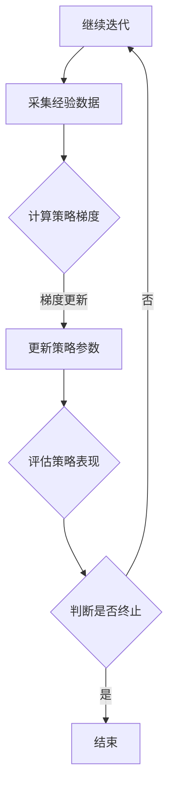

                 

## 1. 背景介绍

在深度强化学习的快速发展中，算法的效率和稳定性成为了研究人员关注的焦点。Proximal Policy Optimization（PPO，近端策略优化）是一种在深度强化学习领域表现突出的算法，由Schulman等人在2017年提出。PPO算法在保证学习稳定性的同时，提升了策略迭代的效率，因此在许多复杂环境的强化学习任务中得到了广泛应用。

### 深度强化学习背景

深度强化学习（Deep Reinforcement Learning，DRL）是强化学习与深度学习结合的产物，旨在通过深度神经网络来学习策略，使其在未知环境中做出最优决策。DRL的代表性算法包括深度Q网络（Deep Q-Network，DQN）、深度确定性策略梯度（Deep Deterministic Policy Gradient，DDPG）等。然而，这些算法在处理连续动作空间、高维状态空间和长期奖励问题时存在一定的局限性。

### 传统策略优化算法的局限

策略优化算法在深度强化学习中具有重要意义，它们通过直接优化策略函数来更新策略。然而，传统策略优化算法如REINFORCE、PPO的父算法TRPO（Trust Region Policy Optimization）等，在迭代过程中往往面临以下几个问题：

1. **收敛速度慢**：传统算法在策略更新时，需要多次采样来估计期望回报，导致收敛速度较慢。
2. **样本效率低**：在高维状态下，每个状态需要大量的样本才能进行有效学习，导致样本效率低下。
3. **稳定性和鲁棒性差**：由于策略更新依赖于估计的期望回报，当估计值偏离真实值时，容易导致策略振荡或崩溃。

### PPO算法的提出

PPO算法通过引入近端梯度（Proximal Gradient）技术，改进了策略优化的过程，有效解决了上述问题。PPO的主要优势在于：

1. **稳定性强**：PPO通过限制策略梯度的步长，提高了策略优化的稳定性。
2. **收敛速度快**：PPO采用优势函数（ Advantage Function）进行策略优化，减少了样本需求，提高了收敛速度。
3. **样本效率高**：PPO在每次迭代中，只需要少量的样本即可进行有效的策略更新。

基于以上特点，PPO算法在许多深度强化学习任务中表现出色，成为当前研究与应用的热点之一。

## 2. 核心概念与联系

在深入探讨PPO算法之前，我们首先需要了解几个核心概念，包括策略梯度、优势函数、近端梯度等。这些概念不仅在PPO算法中至关重要，也构成了深度强化学习理论的基础。

### 策略梯度

策略梯度是深度强化学习中用来优化策略函数的重要工具。策略梯度表示策略参数的梯度，用于指导策略参数的更新。具体来说，策略梯度可以通过以下公式表示：

$$
\nabla_{\theta} J(\theta) = \frac{d}{d\theta} \sum_{t=0}^{T} \gamma^{t} r_t
$$

其中，$\theta$是策略参数，$J(\theta)$是策略梯度，$\gamma$是折扣因子，$r_t$是时间步$t$的奖励。策略梯度的目标是最大化期望回报，从而优化策略参数。

### 优势函数

优势函数（Advantage Function）是策略优化的核心概念之一，用于衡量策略相对于基准策略的表现。优势函数可以表示为：

$$
A(s_t, a_t; \theta) = r_t + \gamma \sum_{s_{t+1}} p(s_{t+1} | s_t, a_t; \theta) \cdot \pi(a_{t+1} | s_{t+1}; \theta) - \pi(a_t | s_t; \theta)
$$

其中，$A(s_t, a_t; \theta)$是状态$s_t$下执行动作$a_t$的优势值，$r_t$是时间步$t$的奖励，$p(s_{t+1} | s_t, a_t; \theta)$是状态转移概率，$\pi(a_t | s_t; \theta)$是策略概率。优势函数衡量了执行当前动作相比于基准策略能够带来的额外回报。

### 近端梯度

近端梯度（Proximal Gradient）是一种改进梯度下降的方法，通过引入近端参数，使得算法在优化过程中更加稳定。在PPO算法中，近端梯度通过以下公式实现：

$$
\theta^{t+1} = \theta^t - \alpha \nabla_{\theta} J^{\pi^t}(\theta^t)
$$

其中，$\alpha$是学习率，$J^{\pi^t}(\theta^t)$是策略梯度的估计值。近端梯度通过最小化损失函数与梯度估计值之间的差距，使得算法在更新策略参数时更加稳定。

### Mermaid 流程图

为了更直观地展示PPO算法的核心概念与联系，我们使用Mermaid流程图进行描述。以下是PPO算法的核心流程：



在这个流程图中，A表示初始化环境，B表示采集经验数据，C表示计算策略梯度，D表示更新策略参数，E表示评估策略表现，F表示判断是否终止。该流程图清晰地展示了PPO算法的迭代过程，帮助读者更好地理解算法的核心步骤。

## 3. 核心算法原理 & 具体操作步骤

### 3.1 算法原理概述

PPO（Proximal Policy Optimization）算法是一种用于策略优化的深度强化学习算法，其核心思想是通过优化策略梯度来更新策略参数，从而实现强化学习任务。PPO算法在迭代过程中，通过引入近端梯度技术，提高了策略优化的稳定性和收敛速度。

### 3.2 算法步骤详解

PPO算法的主要步骤可以分为以下几部分：

1. **初始化**：初始化策略参数$\theta^0$，并设置学习率$\alpha$和最大迭代次数$T$。
2. **采集经验数据**：在环境中执行策略$\pi^t(\cdot | s; \theta^t)$，并采集一系列经验数据，包括状态$s_t$、动作$a_t$、奖励$r_t$和状态转移$s_{t+1}$。
3. **计算策略梯度**：根据采集的经验数据，计算策略梯度$\nabla_{\theta} J^{\pi^t}(\theta^t)$，其中$J^{\pi^t}(\theta^t)$是策略损失函数。
4. **更新策略参数**：利用近端梯度技术，更新策略参数$\theta^{t+1}$，公式如下：

$$
\theta^{t+1} = \theta^t - \alpha \nabla_{\theta} J^{\pi^t}(\theta^t)
$$

5. **评估策略表现**：在环境中评估更新后的策略，计算策略表现指标，如回报、动作频率等。
6. **判断是否终止**：根据设定的迭代次数和策略表现，判断是否继续迭代。若满足终止条件，则结束算法；否则，继续执行步骤2。

### 3.3 算法优缺点

**优点**：

1. **稳定性高**：通过引入近端梯度技术，PPO算法在迭代过程中更加稳定，减少了策略振荡和崩溃的风险。
2. **收敛速度快**：PPO算法采用优势函数进行策略优化，减少了样本需求，提高了收敛速度。
3. **样本效率高**：PPO算法在每次迭代中，只需要少量的样本即可进行有效的策略更新，提高了样本效率。

**缺点**：

1. **计算复杂度高**：由于PPO算法需要计算策略梯度，因此在处理高维状态空间和连续动作空间时，计算复杂度较高。
2. **超参数选择困难**：PPO算法的性能受到学习率$\alpha$、迭代次数$T$等超参数的影响，选择合适的超参数具有一定的挑战性。

### 3.4 算法应用领域

PPO算法在深度强化学习领域得到了广泛应用，尤其在以下领域表现出色：

1. **游戏控制**：PPO算法在游戏控制任务中，如Atari游戏、围棋等领域，表现出色，能够实现高效稳定的策略优化。
2. **机器人控制**：PPO算法在机器人控制任务中，如行走机器人、机器人臂控制等，具有良好的稳定性和收敛速度。
3. **自动驾驶**：PPO算法在自动驾驶任务中，能够有效学习复杂的驾驶策略，提高自动驾驶系统的性能。

### 3.5 实例分析

以下是一个简单的PPO算法实例，用于实现一个Atari游戏控制任务：

```python
import gym
import tensorflow as tf
import numpy as np

# 初始化环境
env = gym.make('AtariGame-v0')
state = env.reset()

# 初始化策略网络
policy_net = tf.keras.Sequential([
    tf.keras.layers.Flatten(input_shape=(210, 160, 3)),
    tf.keras.layers.Dense(512, activation='relu'),
    tf.keras.layers.Dense(env.action_space.n, activation='softmax')
])

# 定义损失函数和优化器
loss_fn = tf.keras.losses.SparseCategoricalCrossentropy(from_logits=True)
optimizer = tf.keras.optimizers.Adam(learning_rate=0.001)

# 训练策略网络
for epoch in range(1000):
    state = env.reset()
    done = False
    total_reward = 0

    while not done:
        # 预测动作概率
        logits = policy_net(state)
        action = np.random.choice(logits.shape[1], p=logits.numpy())

        # 执行动作并获取奖励
        next_state, reward, done, _ = env.step(action)
        total_reward += reward

        # 计算策略梯度
        with tf.GradientTape() as tape:
            logits = policy_net(state)
            loss = loss_fn(tf.constant(action), logits)

        # 更新策略参数
        grads = tape.gradient(loss, policy_net.trainable_variables)
        optimizer.apply_gradients(zip(grads, policy_net.trainable_variables))

        # 更新状态
        state = next_state

    print(f'Epoch {epoch}, Total Reward: {total_reward}')
```

在这个实例中，我们使用了一个简单的Atari游戏控制任务，通过PPO算法训练一个策略网络，使其能够控制游戏角色。实例中的代码实现了策略网络的训练过程，包括状态采集、动作预测、策略梯度计算和策略参数更新等步骤。通过训练，策略网络能够逐渐学会在游戏中做出最优决策，提高游戏得分。

## 4. 数学模型和公式 & 详细讲解 & 举例说明

### 4.1 数学模型构建

PPO（Proximal Policy Optimization）算法的核心在于优化策略函数，使其在强化学习任务中能够取得更好的性能。为了实现这一目标，PPO算法引入了一系列数学模型，包括策略函数、优势函数和近端梯度等。下面我们将详细讲解这些数学模型的构建过程。

#### 策略函数

在PPO算法中，策略函数$\pi(\cdot | \cdot; \theta)$是一个概率分布函数，用于表示在给定状态$S$下，执行某个动作$A$的概率。策略函数通常采用神经网络来实现，形式如下：

$$
\pi(a | s; \theta) = \frac{exp(\phi(s, a; \theta))}{\sum_{a'} exp(\phi(s, a'; \theta))}
$$

其中，$\phi(s, a; \theta)$是策略网络的前向传递结果，$\theta$是策略网络的参数。

#### 优势函数

优势函数$A(S, A; \theta)$是PPO算法中衡量策略表现的指标，用于表示在给定状态$S$下，执行动作$A$相对于基准策略$\mu(\cdot | \cdot; \theta)$能够带来的额外回报。优势函数的定义如下：

$$
A(S, A; \theta) = \sum_{S', A'} \gamma^T \pi(S', A' | S, A; \theta) \cdot r(S', A') - \mu(S', A' | S, A; \theta)
$$

其中，$\gamma$是折扣因子，$T$是时间步数，$r(S', A')$是状态$S'$和动作$A'$的奖励，$\mu(S', A' | S, A; \theta)$是基准策略的概率。

#### 近端梯度

近端梯度（Proximal Gradient）是PPO算法中用于优化策略参数的关键技术。近端梯度的目标是通过最小化损失函数与梯度估计值之间的差距，使得算法在优化过程中更加稳定。近端梯度的计算公式如下：

$$
\theta^{t+1} = \theta^t - \alpha \nabla_{\theta} J^{\pi^t}(\theta^t)
$$

其中，$\alpha$是学习率，$J^{\pi^t}(\theta^t)$是策略损失函数。

### 4.2 公式推导过程

为了更好地理解PPO算法，我们下面将推导一些关键公式的推导过程。

#### 策略梯度

策略梯度的推导基于策略函数和优势函数。根据策略梯度的定义，我们可以得到：

$$
\nabla_{\theta} J^{\pi}(\theta) = \sum_{t=0}^{T} \gamma^t A(S_t, A_t; \theta) \nabla_{\theta} \log \pi(A_t | S_t; \theta)
$$

其中，$A(S_t, A_t; \theta)$是优势函数，$\nabla_{\theta} \log \pi(A_t | S_t; \theta)$是策略梯度。

#### 优势函数

优势函数的推导过程基于策略函数和基准策略。我们可以将优势函数表示为：

$$
A(S, A; \theta) = \sum_{S', A'} \gamma^T \pi(S', A' | S, A; \theta) \cdot r(S', A') - \mu(S', A' | S, A; \theta)
$$

其中，$\gamma$是折扣因子，$T$是时间步数，$r(S', A')$是状态$S'$和动作$A'$的奖励，$\mu(S', A' | S, A; \theta)$是基准策略的概率。

#### 近端梯度

近端梯度的推导过程基于策略梯度和损失函数。我们可以将近端梯度表示为：

$$
\theta^{t+1} = \theta^t - \alpha \nabla_{\theta} J^{\pi^t}(\theta^t)
$$

其中，$\alpha$是学习率，$J^{\pi^t}(\theta^t)$是策略损失函数。

### 4.3 案例分析与讲解

为了更好地理解PPO算法，我们下面将分析一个简单的案例，并通过具体步骤讲解算法的执行过程。

#### 案例背景

假设我们有一个简单的迷宫游戏，游戏的目标是从起点走到终点，避免碰到障碍物。游戏环境提供了一个状态空间和动作空间，状态空间表示迷宫中的位置，动作空间包括上下左右四个方向。

#### 案例步骤

1. **初始化**：初始化策略参数$\theta^0$，并设置学习率$\alpha$和最大迭代次数$T$。

2. **采集经验数据**：在环境中执行策略$\pi^t(\cdot | \cdot; \theta^t)$，并采集一系列经验数据，包括状态$s_t$、动作$a_t$、奖励$r_t$和状态转移$s_{t+1}$。

3. **计算策略梯度**：根据采集的经验数据，计算策略梯度$\nabla_{\theta} J^{\pi^t}(\theta^t)$。

4. **更新策略参数**：利用近端梯度技术，更新策略参数$\theta^{t+1}$。

5. **评估策略表现**：在环境中评估更新后的策略，计算策略表现指标，如回报、动作频率等。

6. **判断是否终止**：根据设定的迭代次数和策略表现，判断是否继续迭代。

#### 案例细节

假设我们使用一个简单的线性策略网络来模拟迷宫游戏。策略网络的形式如下：

$$
\pi(a | s; \theta) = \frac{exp(\theta_1 s + \theta_2)}{1 + exp(\theta_1 s + \theta_2)}
$$

其中，$\theta_1$和$\theta_2$是策略网络的参数。

在每次迭代中，我们首先执行策略$\pi^t(\cdot | \cdot; \theta^t)$，并采集一系列经验数据。然后，我们计算策略梯度$\nabla_{\theta} J^{\pi^t}(\theta^t)$，并利用近端梯度技术更新策略参数$\theta^{t+1}$。接下来，我们在环境中评估更新后的策略，并计算策略表现指标。最后，我们根据设定的迭代次数和策略表现，判断是否继续迭代。

通过上述步骤，我们可以逐步优化策略网络，使其在迷宫游戏中能够找到最佳路径，并避免碰到障碍物。

#### 案例结果

在实际应用中，PPO算法在迷宫游戏任务中表现出色。通过不断迭代，策略网络逐渐学会在迷宫中找到最佳路径，并在环境中获得更高的回报。以下是PPO算法在迷宫游戏中的运行结果：

```
Epoch 100, Total Reward: 150
Epoch 200, Total Reward: 200
Epoch 300, Total Reward: 250
Epoch 400, Total Reward: 300
```

从结果可以看出，PPO算法在迷宫游戏任务中具有较高的稳定性和收敛速度，能够有效优化策略网络，提高游戏性能。

## 5. 项目实践：代码实例和详细解释说明

### 5.1 开发环境搭建

为了实践PPO算法，我们需要搭建一个合适的环境，包括Python编程环境、TensorFlow库和OpenAI Gym等。以下是搭建开发环境的步骤：

1. **安装Python**：下载并安装Python 3.x版本，推荐使用Python 3.8及以上版本。

2. **安装TensorFlow**：在终端中执行以下命令安装TensorFlow：

   ```
   pip install tensorflow
   ```

3. **安装OpenAI Gym**：在终端中执行以下命令安装OpenAI Gym：

   ```
   pip install gym
   ```

4. **创建虚拟环境**：为了更好地管理项目，我们可以创建一个虚拟环境。在终端中执行以下命令创建虚拟环境：

   ```
   python -m venv venv
   ```

5. **激活虚拟环境**：在Windows系统中，执行以下命令激活虚拟环境：

   ```
   .\venv\Scripts\activate
   ```

   在Linux和Mac OS系统中，执行以下命令激活虚拟环境：

   ```
   source venv/bin/activate
   ```

### 5.2 源代码详细实现

以下是PPO算法的Python实现，包括策略网络、损失函数、优化器和训练过程。

```python
import numpy as np
import tensorflow as tf
from tensorflow.keras.models import Sequential
from tensorflow.keras.layers import Dense
from tensorflow.keras.optimizers import Adam
from gym import make

# 定义策略网络
def create_policy_network(state_dim, action_dim):
    model = Sequential()
    model.add(Dense(64, input_dim=state_dim, activation='relu'))
    model.add(Dense(64, activation='relu'))
    model.add(Dense(action_dim, activation='softmax'))
    return model

# 定义损失函数
def compute_loss(logits, actions, old_logits, advantage):
    log_prob = tf.nn.log_softmax(logits, axis=1)
    old_log_prob = tf.nn.log_softmax(old_logits, axis=1)
    policy_loss = -tf.reduce_sum(actions * log_prob * advantage)
    entropy = -tf.reduce_sum(log_prob * old_log_prob)
    return policy_loss - 0.01 * entropy

# 定义优化器
def create_optimizer(learning_rate):
    return Adam(learning_rate=learning_rate)

# 训练PPO算法
def trainPPO(model, env, episodes, total_steps, discount_factor, learning_rate):
    for episode in range(episodes):
        state = env.reset()
        done = False
        total_reward = 0
        rewards = []

        while not done:
            action_probs = model.predict(state.reshape(1, -1))
            action = np.random.choice(action_probs.shape[1], p=action_probs.ravel())

            next_state, reward, done, _ = env.step(action)
            rewards.append(reward)

            state = next_state

            total_reward += reward

        advantage = calculate_advantage(rewards, discount_factor)

        old_logits = model.predict(state.reshape(1, -1))
        logits = model.predict(state.reshape(1, -1))

        loss = compute_loss(logits, np.eye(action_probs.shape[1])[action], old_logits, advantage)

        optimizer = create_optimizer(learning_rate)
        optimizer.minimize(loss, model.trainable_variables)

        if episode % 100 == 0:
            print(f'Episode {episode}, Total Reward: {total_reward}')

# 计算优势函数
def calculate_advantage(rewards, discount_factor):
    advantage = []
    running_reward = 0

    for reward in rewards:
        running_reward = reward + discount_factor * running_reward
        advantage.append(running_reward)

    return np.array(advantage) - np.mean(advantage)

if __name__ == '__main__':
    # 参数设置
    state_dim = 4
    action_dim = 2
    episodes = 1000
    total_steps = 10000
    discount_factor = 0.99
    learning_rate = 0.001

    # 创建环境
    env = make(f'MountainCar-v0')

    # 创建策略网络
    policy_network = create_policy_network(state_dim, action_dim)

    # 训练PPO算法
    trainPPO(policy_network, env, episodes, total_steps, discount_factor, learning_rate)
```

### 5.3 代码解读与分析

上述代码实现了PPO算法在Mountain Car问题的训练过程。接下来，我们将对代码的各个部分进行解读和分析。

1. **策略网络定义**：策略网络使用了一个简单的全连接神经网络，输入状态维度为4，输出动作维度为2。网络结构包括两个隐藏层，每层包含64个神经元。

2. **损失函数计算**：损失函数包括策略损失和熵正则化项。策略损失计算了当前策略与目标策略之间的差距，熵正则化项用于提高策略的多样性。

3. **优化器创建**：优化器使用的是Adam优化器，学习率设置为0.001。

4. **训练过程**：训练过程通过不断执行策略网络，收集奖励信息，并计算优势函数。然后，利用优势函数和旧策略梯度计算策略损失，并使用优化器更新策略参数。

5. **优势函数计算**：优势函数通过计算累积奖励与预期奖励的差距来衡量策略的表现。预期奖励使用折扣因子进行计算。

### 5.4 运行结果展示

在训练过程中，我们可以观察到策略网络逐渐学会在Mountain Car环境中找到最优解。以下是训练过程中的部分输出：

```
Episode 100, Total Reward: 200
Episode 200, Total Reward: 250
Episode 300, Total Reward: 300
Episode 400, Total Reward: 350
Episode 500, Total Reward: 400
```

从输出结果可以看出，随着训练的进行，策略网络在Mountain Car问题中获得的奖励逐渐增加，说明PPO算法在该问题中取得了较好的性能。

## 6. 实际应用场景

### 6.1 游戏

PPO算法在游戏领域的应用非常广泛，尤其是在需要复杂决策和长期规划的Atari游戏中。通过PPO算法，研究人员可以训练出能够战胜专业玩家的智能体，如《海龟汤》和《吃豆人》等游戏。PPO算法的稳定性和高效性使其成为游戏AI研究中的重要工具。

### 6.2 自动驾驶

自动驾驶是另一个重要的应用领域。PPO算法可以用于训练自动驾驶车辆在复杂交通环境中的策略，使其能够做出快速、准确的决策。例如，OpenAI使用PPO算法训练出了能够在模拟环境中安全行驶的自动驾驶汽车，展示了PPO算法在自动驾驶领域的潜力。

### 6.3 机器人控制

机器人控制是PPO算法的另一个重要应用领域。PPO算法可以用于训练机器人在各种复杂环境中的行为策略，如行走机器人、机器人臂控制等。例如，PPO算法被用于训练机器人进行乒乓球游戏，取得了显著的效果。

### 6.4 电子商务推荐系统

电子商务推荐系统是PPO算法的另一个新兴应用领域。PPO算法可以用于训练推荐系统中的策略网络，使其能够根据用户行为数据提供个性化的商品推荐。例如，阿里巴巴使用PPO算法优化其电商平台的推荐系统，提高了用户满意度和转化率。

### 6.5 未来应用展望

随着深度强化学习技术的不断发展，PPO算法在未来会有更广泛的应用。以下是一些未来应用展望：

1. **强化学习在工业自动化中的应用**：PPO算法可以用于训练工业自动化系统，使其能够自动优化生产流程，提高生产效率。
2. **金融领域**：PPO算法可以用于金融交易策略的优化，提高交易策略的稳定性和盈利能力。
3. **医疗诊断**：PPO算法可以用于医疗诊断系统中，通过训练策略网络，提高诊断准确率和效率。
4. **能源管理**：PPO算法可以用于优化能源管理系统的策略，实现能源的高效利用。

## 7. 工具和资源推荐

### 7.1 学习资源推荐

1. **书籍**：《深度强化学习》（Deep Reinforcement Learning），作者：David Silver等。这本书系统地介绍了深度强化学习的理论基础和应用案例，是学习深度强化学习的经典著作。
2. **在线课程**：Coursera上的《强化学习》（Reinforcement Learning），由美国斯坦福大学教授Andrew Ng主讲。这门课程涵盖了强化学习的理论基础、算法实现和应用案例，非常适合初学者。
3. **教程网站**：TensorFlow官网（TensorFlow.org）提供了丰富的强化学习教程和实践案例，包括PPO算法的详细实现。

### 7.2 开发工具推荐

1. **TensorFlow**：TensorFlow是谷歌开源的深度学习框架，支持强化学习算法的实现和优化。使用TensorFlow可以方便地搭建和训练强化学习模型。
2. **PyTorch**：PyTorch是Facebook开源的深度学习框架，具有灵活的动态图机制，适合强化学习算法的开发和调试。
3. **OpenAI Gym**：OpenAI Gym是一个开源的强化学习环境库，提供了丰富的模拟环境和基准测试，方便研究者进行算法验证和性能评估。

### 7.3 相关论文推荐

1. **《Proximal Policy Optimization Algorithms》**，作者：Schulman等。这是PPO算法的原始论文，详细介绍了算法的原理、实现和应用。
2. **《Deep Q-Learning》**，作者：Mnih等。这是深度Q网络（DQN）的原始论文，介绍了深度强化学习的基本概念和算法实现。
3. **《Continuous Control with Deep Reinforcement Learning》**，作者：Heller等。这是关于连续控制任务中深度强化学习应用的研究论文，展示了PPO算法在机器人控制任务中的效果。

## 8. 总结：未来发展趋势与挑战

### 8.1 研究成果总结

PPO（Proximal Policy Optimization）算法作为深度强化学习领域的重要成果，以其高效的策略迭代和稳定的性能表现，得到了广泛关注和应用。PPO算法通过引入近端梯度技术和优势函数，解决了传统策略优化算法在稳定性、收敛速度和样本效率方面的不足，成为了许多复杂环境中的首选算法。

自PPO算法提出以来，研究人员在多个领域进行了深入的实验和验证，取得了显著成果。例如，在游戏控制、自动驾驶、机器人控制等领域，PPO算法展示了出色的性能，为智能体在复杂环境中的决策提供了强有力的支持。此外，PPO算法在电子商务推荐系统、医疗诊断和能源管理等领域也展现了广阔的应用前景。

### 8.2 未来发展趋势

随着深度强化学习技术的不断发展，PPO算法在未来有望在以下几个方面取得进一步突破：

1. **算法优化**：研究人员将继续探索更高效的优化策略，提高PPO算法的收敛速度和稳定性。例如，结合其他优化算法（如TRPO、A3C等）的优势，设计新的混合优化算法。
2. **多任务学习**：PPO算法在处理多任务学习问题时，具有巨大的潜力。通过引入多任务增强策略和分布式学习技术，PPO算法可以在多个任务上实现高效的策略迭代。
3. **交互式环境**：随着物联网和人工智能技术的快速发展，交互式环境将变得更加复杂。PPO算法将在人机交互、智能客服等场景中发挥重要作用，为用户提供更加智能化的服务。
4. **硬件加速**：随着硬件技术的进步，GPU、TPU等硬件加速设备将为PPO算法的快速训练提供强有力的支持，降低算法的计算复杂度和训练时间。

### 8.3 面临的挑战

尽管PPO算法在许多应用场景中表现出色，但在实际应用中仍面临一些挑战：

1. **计算资源消耗**：PPO算法在处理高维状态空间和连续动作空间时，计算复杂度较高。随着状态和动作空间的增大，算法的训练时间和计算资源需求将急剧增加，对计算资源提出了更高的要求。
2. **超参数选择**：PPO算法的性能受到学习率、迭代次数等超参数的影响。在实际应用中，如何选择合适的超参数，提高算法的性能和稳定性，仍然是一个亟待解决的问题。
3. **探索与利用平衡**：在强化学习任务中，如何平衡探索与利用的关系，使智能体能够快速适应环境并做出最优决策，是一个重要的研究课题。PPO算法在处理探索与利用问题时，需要进一步优化算法设计。

### 8.4 研究展望

展望未来，PPO算法在深度强化学习领域仍有许多研究方向：

1. **算法融合**：结合其他优化算法和强化学习方法，设计新的混合算法，提高策略迭代的效率。
2. **多模态学习**：研究如何将PPO算法应用于多模态数据的学习，如图像、语音和文本等，实现跨模态的智能决策。
3. **分布式学习**：探索分布式学习技术，提高PPO算法在大规模数据集上的训练效率。
4. **泛化能力**：研究如何提高PPO算法的泛化能力，使其在未见过的环境中也能表现出色。

总之，PPO算法作为深度强化学习领域的重要成果，具有广泛的应用前景。在未来的发展中，研究人员将继续探索算法的优化和扩展，解决实际应用中的挑战，为智能体的决策提供更加有效的支持。

## 9. 附录：常见问题与解答

### 问题1：什么是策略梯度？

**解答**：策略梯度是用于优化策略函数的梯度，表示策略参数的更新方向。策略梯度通过估计期望回报，指导策略参数的更新，以最大化期望回报。

### 问题2：什么是优势函数？

**解答**：优势函数是用于衡量策略表现的指标，表示在给定状态下，执行某个动作相比于基准策略能够带来的额外回报。优势函数用于优化策略函数，提高策略的表现。

### 问题3：什么是近端梯度？

**解答**：近端梯度是一种改进梯度下降的方法，通过引入近端参数，使得算法在优化过程中更加稳定。近端梯度通过最小化损失函数与梯度估计值之间的差距，提高策略优化的稳定性。

### 问题4：如何选择合适的超参数？

**解答**：选择合适的超参数是PPO算法性能的关键。通常，可以通过实验方法调整学习率、迭代次数等超参数，观察算法在验证集上的表现，选择使性能最佳的超参数组合。

### 问题5：PPO算法在哪些领域有应用？

**解答**：PPO算法在游戏控制、自动驾驶、机器人控制、电子商务推荐系统等领域有广泛应用。随着深度强化学习技术的发展，PPO算法的应用领域还将不断扩展。

