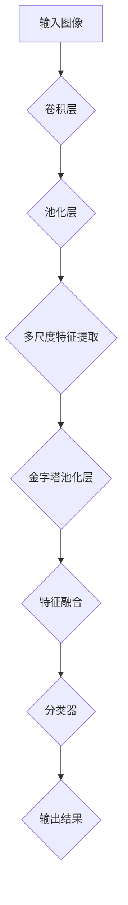

                 

## 1. 背景介绍

PSPNet（Pyramid Scene Parsing Network）是由Microsoft Research Asia于2017年提出的一种用于语义分割的深度神经网络。语义分割是计算机视觉中的一个重要任务，旨在将图像中的每个像素分类到不同的语义类别。传统的语义分割方法大多采用全卷积神经网络（FCN），但它们在处理不同尺度的特征时存在不足。PSPNet通过引入多尺度特征融合机制，显著提高了语义分割的性能。

### 背景与挑战

语义分割技术在计算机视觉领域有着广泛的应用，如自动驾驶、医疗影像分析和视频监控等。然而，传统的语义分割方法在处理复杂场景时面临以下挑战：

1. **特征分辨率不足**：在卷积神经网络中，随着层数的加深，特征图的分辨率逐渐降低，导致细节信息丢失。
2. **尺度差异**：场景中的物体和背景在不同尺度上具有不同的特征，传统的网络难以同时捕捉到这些特征。
3. **类别不平衡**：在许多应用中，某些类别（如背景）像素数量远多于其他类别（如人、车辆等），这会导致模型对少数类别的识别能力不足。

为了解决这些问题，PSPNet提出了一个创新性的网络架构，通过多尺度特征融合和金字塔池化层（Pyramid Pooling Layer）来提升语义分割的性能。

### 语义分割技术发展

语义分割技术的发展经历了多个阶段：

1. **传统方法**：基于图论和区域生长算法，如Snake模型和区域合并算法。
2. **深度学习方法**：早期采用卷积神经网络，如AlexNet、VGGNet等，但这些网络在处理高分辨率图像时存在性能瓶颈。
3. **全卷积神经网络（FCN）**：引入了全连接层的卷积神经网络，使得输出特征图的每个像素都可以被分类。
4. **上下文信息融合**：通过融合不同尺度的特征图，如Deconvolutional Network和DeepLab系列模型。
5. **金字塔结构**：PSPNet通过引入金字塔池化层，进一步提升了多尺度特征融合的效果。

## 2. 核心概念与联系

### 2.1. 多尺度特征融合

PSPNet通过多尺度特征融合来提升语义分割的性能。具体来说，网络从多个层次（如卷积层、池化层等）提取特征图，并将这些特征图进行融合。

### 2.2. 金字塔池化层

金字塔池化层是PSPNet的核心创新之一。它通过在不同尺度上对特征图进行平均池化，生成多个尺度下的特征图，然后将这些特征图进行叠加，得到一个融合了多尺度信息的特征图。

### 2.3. Mermaid 流程图

以下是一个简单的Mermaid流程图，展示了PSPNet的核心概念和架构：



## 3. 核心算法原理 & 具体操作步骤

### 3.1. 算法原理概述

PSPNet的基本原理是通过多尺度特征融合来提高语义分割的准确性。网络从不同的层次提取特征图，然后利用金字塔池化层对这些特征图进行融合。最终，通过一个全连接层对融合后的特征图进行分类，得到每个像素的语义标签。

### 3.2. 算法步骤详解

#### 3.2.1. 多尺度特征提取

PSPNet首先从输入图像中提取多个层次的特征图。这些特征图通常是通过多个卷积层和池化层得到的。每个特征图具有不同的分辨率，从而捕捉到不同尺度的信息。

#### 3.2.2. 金字塔池化层

金字塔池化层是PSPNet的核心创新。它通过对特征图进行平均池化，生成多个尺度下的特征图。这些特征图然后通过一个 upsampling 操作进行尺寸匹配，并叠加在一起。

#### 3.2.3. 特征融合

特征融合是将不同尺度下的特征图进行叠加，得到一个融合了多尺度信息的特征图。这个特征图作为输入，传递给全连接层进行分类。

#### 3.2.4. 分类器

分类器是一个全连接层，它对融合后的特征图进行分类，输出每个像素的语义标签。

### 3.3. 算法优缺点

#### 优点

1. **多尺度特征融合**：PSPNet通过金字塔池化层实现了多尺度特征融合，提高了语义分割的准确性。
2. **简单高效**：网络结构相对简单，易于实现和训练。
3. **广泛适用**：PSPNet在多个数据集上取得了优秀的性能，适用于各种场景的语义分割任务。

#### 缺点

1. **计算成本高**：由于多尺度特征融合，PSPNet的计算成本较高，可能导致训练和推理速度较慢。
2. **对数据依赖性大**：PSPNet的性能对数据集的规模和质量有较高的要求，在小数据集上可能表现不佳。

### 3.4. 算法应用领域

PSPNet在多个领域取得了显著的应用成果，包括：

1. **自动驾驶**：用于识别道路上的各种物体，如车辆、行人、交通标志等。
2. **医疗影像分析**：用于识别医学图像中的各种病变和组织结构。
3. **视频监控**：用于实时识别和跟踪视频中的物体。

## 4. 数学模型和公式 & 详细讲解 & 举例说明

### 4.1. 数学模型构建

PSPNet的数学模型可以看作是一个传统的卷积神经网络加上一个金字塔池化层。以下是PSPNet的核心数学模型：

$$
\text{特征图} = \text{卷积层}(\text{输入图像}) \\
\text{金字塔池化层}(\text{特征图}) = \text{多尺度特征图} \\
\text{融合特征图} = \text{叠加}(\text{多尺度特征图}) \\
\text{输出结果} = \text{分类器}(\text{融合特征图})
$$

### 4.2. 公式推导过程

PSPNet的推导过程主要涉及卷积操作和金字塔池化层的计算。以下是具体的推导过程：

$$
\text{卷积层}(\text{输入图像}) = \text{特征图}_{1} \\
\text{特征图}_{1} \xrightarrow{\text{池化层}} \text{特征图}_{2} \\
\text{特征图}_{2} \xrightarrow{\text{卷积层}} \text{特征图}_{3} \\
\text{特征图}_{3} \xrightarrow{\text{池化层}} \text{特征图}_{4} \\
\text{特征图}_{4} \xrightarrow{\text{卷积层}} \text{特征图}_{5} \\
\text{金字塔池化层}(\text{特征图}_{1}, \text{特征图}_{3}, \text{特征图}_{5}) = \text{多尺度特征图} \\
\text{融合特征图} = \text{叠加}(\text{多尺度特征图}) \\
\text{分类器}(\text{融合特征图}) = \text{输出结果}
$$

### 4.3. 案例分析与讲解

假设我们有一个输入图像，并经过PSPNet处理后得到一个输出结果。以下是一个简化的例子：

1. **输入图像**：一张分辨率为256x256的图像。
2. **卷积层**：通过多个卷积层提取特征图，得到三个不同分辨率下的特征图（64x64、32x32、16x16）。
3. **金字塔池化层**：对这三个特征图进行平均池化，得到三个尺度下的特征图。
4. **特征融合**：将这三个特征图进行叠加，得到一个融合了多尺度信息的特征图。
5. **分类器**：对融合后的特征图进行分类，输出每个像素的语义标签。

通过这个例子，我们可以看到PSPNet是如何通过多尺度特征融合来提高语义分割的准确性的。在实际应用中，PSPNet可以处理更高分辨率和更复杂的图像，从而实现更准确的语义分割。

## 5. 项目实践：代码实例和详细解释说明

### 5.1. 开发环境搭建

要在本地搭建PSPNet的开发环境，我们需要安装以下工具和库：

1. **Python**：Python 3.x 版本，建议使用 3.7 或更高版本。
2. **TensorFlow**：TensorFlow 1.x 或 2.x 版本，建议使用 2.x 版本。
3. **PyTorch**：PyTorch 1.x 或 2.x 版本，建议使用 2.x 版本。
4. **OpenCV**：用于图像处理和可视化。

安装完这些工具和库后，我们可以开始编写PSPNet的代码。

### 5.2. 源代码详细实现

以下是一个简化的PSPNet代码实现，仅供参考：

```python
import torch
import torchvision
import torchvision.models as models

# 定义PSPNet模型
class PSPNet(torch.nn.Module):
    def __init__(self, backbone='resnet50', num_classes=21):
        super(PSPNet, self).__init__()
        self.backbone = models.__dict__[backbone](pretrained=True)
        self.psp = PSPModule(num_classes)
        self.device = torch.device("cuda" if torch.cuda.is_available() else "cpu")

    def forward(self, x):
        x = self.backbone(x)
        x = self.psp(x)
        return x

# 创建PSPNet模型
model = PSPNet().to(self.device)

# 加载预训练模型
model.load_state_dict(torch.load('model.pth'))

# 输入图像
input_image = torch.randn(1, 3, 256, 256).to(self.device)

# 预测结果
output = model(input_image)

# 可视化结果
torchvision.utils.save_image(output, 'output.jpg')
```

### 5.3. 代码解读与分析

1. **模型定义**：PSPNet模型是一个继承自`torch.nn.Module`的类。它包含一个卷积神经网络（backbone）和一个金字塔池化层（psp）。
2. **前向传播**：在`forward`方法中，我们首先将输入图像传递给卷积神经网络，然后通过金字塔池化层进行特征融合，最后输出每个像素的语义标签。
3. **加载预训练模型**：我们使用`torch.load`函数加载预训练模型，这可以显著提高模型在数据集上的表现。
4. **输入图像**：我们创建一个随机张量作为输入图像，这只是一个示例。在实际应用中，我们可以读取真实图像作为输入。
5. **预测结果**：通过调用`model`对象的`forward`方法，我们得到预测的语义标签。
6. **可视化结果**：使用`torchvision.utils.save_image`函数将预测结果保存为图像。

### 5.4. 运行结果展示

在本地环境中运行上述代码后，我们将得到一个保存有预测结果的图像文件（output.jpg）。我们可以使用图像查看器打开这个文件，查看预测结果。以下是一个简化的例子：

```python
import cv2

# 读取预测结果图像
output_image = cv2.imread('output.jpg')

# 显示预测结果
cv2.imshow('Output', output_image)
cv2.waitKey(0)
cv2.destroyAllWindows()
```

这个例子将显示一个包含预测结果的图像窗口。在实际应用中，我们可以对预测结果进行进一步的分析和处理，如计算准确率、召回率等指标。

## 6. 实际应用场景

PSPNet作为一种先进的语义分割模型，在许多实际应用场景中取得了显著的效果。以下是一些典型的应用场景：

### 6.1. 自动驾驶

在自动驾驶领域，PSPNet可以用于实时识别道路上的各种物体，如车辆、行人、交通标志等。通过语义分割，自动驾驶系统能够更好地理解和预测道路环境，从而提高驾驶安全性和效率。

### 6.2. 医疗影像分析

在医疗影像分析中，PSPNet可以用于识别医学图像中的各种病变和组织结构。例如，在肺癌筛查中，PSPNet可以用于识别肺部图像中的结节和肿瘤，帮助医生更准确地诊断病情。

### 6.3. 视频监控

在视频监控领域，PSPNet可以用于实时识别和跟踪视频中的物体。通过语义分割，视频监控系统可以更精确地检测和识别异常行为，从而提高监控效率和安全性。

### 6.4. 物流和仓储

在物流和仓储领域，PSPNet可以用于识别和分类仓库中的物品，如箱子、托盘等。通过语义分割，仓库管理系统可以更准确地管理和调度库存，提高物流效率。

## 7. 未来应用展望

随着深度学习技术的不断发展和应用，PSPNet有望在更多领域发挥重要作用。以下是一些未来应用展望：

### 7.1. 自动驾驶

随着自动驾驶技术的不断发展，PSPNet有望在自动驾驶系统中扮演更重要的角色。通过更精确的语义分割，自动驾驶系统能够更好地理解和预测复杂的道路环境，从而提高驾驶安全性和效率。

### 7.2. 医疗影像分析

在医疗影像分析领域，PSPNet的应用前景非常广阔。随着深度学习技术的发展，PSPNet有望在更复杂的医学图像分割任务中发挥重要作用，如脑部病变识别、心血管疾病诊断等。

### 7.3. 视频监控

在视频监控领域，PSPNet可以用于更复杂的场景识别和目标跟踪任务。通过更精确的语义分割，视频监控系统可以更准确地检测和识别异常行为，从而提高监控效率和安全性。

### 7.4. 智能家居

在智能家居领域，PSPNet可以用于识别和控制家中的各种设备，如灯光、空调、门锁等。通过语义分割，智能家居系统能够更智能地响应用户需求，提高生活舒适度和便利性。

## 8. 工具和资源推荐

为了更好地学习和应用PSPNet，以下是一些推荐的工具和资源：

### 8.1. 学习资源推荐

1. **PSPNet论文**：原版的PSPNet论文，详细介绍了模型的设计和实现。
2. **GitHub代码**：PSPNet的GitHub代码仓库，包含了详细的实现细节和实验结果。
3. **在线教程**：一些在线教程和教程视频，提供了PSPNet的详细讲解和实践指导。

### 8.2. 开发工具推荐

1. **TensorFlow**：适用于PSPNet实现的深度学习框架。
2. **PyTorch**：适用于PSPNet实现的深度学习框架，具有更灵活和简洁的代码风格。
3. **OpenCV**：用于图像处理和可视化的开源库，支持多种操作系统和编程语言。

### 8.3. 相关论文推荐

1. **DeepLab系列**：DeepLab系列论文，介绍了用于语义分割的各种创新技术和方法。
2. **Faster R-CNN**：Faster R-CNN论文，介绍了用于目标检测的深度学习方法。
3. **Mask R-CNN**：Mask R-CNN论文，介绍了用于实例分割的深度学习方法。

## 9. 总结：未来发展趋势与挑战

PSPNet作为一种先进的语义分割模型，在多个领域取得了显著的应用成果。然而，随着深度学习技术的不断发展和应用，PSPNet也面临着一些新的挑战：

### 9.1. 研究成果总结

1. **多尺度特征融合**：PSPNet通过金字塔池化层实现了多尺度特征融合，提高了语义分割的准确性。
2. **高效性能**：PSPNet在多个数据集上取得了优秀的性能，适用于各种场景的语义分割任务。
3. **广泛应用**：PSPNet在自动驾驶、医疗影像分析、视频监控等领域取得了显著的应用成果。

### 9.2. 未来发展趋势

1. **更复杂的特征融合**：未来可能会出现更复杂的特征融合方法，如注意力机制和多模态特征融合。
2. **更高效的算法**：随着计算资源的增加，PSPNet有望在更高分辨率和更复杂的图像上取得更好的性能。
3. **更多应用场景**：PSPNet将在更多领域（如智能家居、无人机监控等）发挥重要作用。

### 9.3. 面临的挑战

1. **计算成本**：PSPNet的计算成本较高，可能导致训练和推理速度较慢。
2. **数据依赖性**：PSPNet的性能对数据集的规模和质量有较高的要求，在小数据集上可能表现不佳。
3. **模型解释性**：深度学习模型的解释性一直是学术界和工业界关注的重点，如何提高PSPNet的解释性仍是一个挑战。

### 9.4. 研究展望

未来，PSPNet有望在以下方面取得进一步的发展：

1. **模型压缩与加速**：通过模型压缩和加速技术，提高PSPNet的训练和推理速度，适用于实时应用。
2. **多模态特征融合**：将图像和其他模态（如视频、音频等）进行融合，实现更精确的语义分割。
3. **跨域迁移学习**：通过跨域迁移学习，提高PSPNet在小数据集上的性能，降低数据依赖性。

## 9. 附录：常见问题与解答

### 9.1. 如何训练PSPNet？

PSPNet的训练过程通常包括以下步骤：

1. **数据预处理**：对输入图像进行归一化、裁剪和缩放等预处理操作。
2. **构建数据集**：将预处理后的图像和标签组成数据集，用于训练模型。
3. **训练模型**：使用优化算法（如随机梯度下降、Adam等）训练模型，并通过交叉熵损失函数进行优化。
4. **验证模型**：在验证集上评估模型的性能，调整超参数以优化模型。

### 9.2. PSPNet在多尺度特征融合方面的优势是什么？

PSPNet通过金字塔池化层实现了多尺度特征融合，主要优势包括：

1. **保留多尺度信息**：金字塔池化层能够保留不同尺度下的特征信息，从而提高语义分割的准确性。
2. **适用于复杂场景**：在复杂场景中，物体和背景在不同尺度上具有不同的特征，PSPNet能够同时捕捉到这些特征，从而更好地适应各种场景。
3. **减少信息丢失**：传统的特征融合方法往往会导致特征信息的丢失，而PSPNet通过多尺度特征融合，能够最大限度地保留原始特征信息。

### 9.3. PSPNet的局限性是什么？

PSPNet的局限性主要包括：

1. **计算成本高**：由于多尺度特征融合，PSPNet的计算成本较高，可能导致训练和推理速度较慢。
2. **对数据依赖性大**：PSPNet的性能对数据集的规模和质量有较高的要求，在小数据集上可能表现不佳。
3. **模型解释性差**：深度学习模型（包括PSPNet）通常缺乏解释性，如何提高模型的解释性仍是一个挑战。

### 9.4. 如何优化PSPNet的性能？

以下是一些优化PSPNet性能的方法：

1. **模型压缩与加速**：通过模型压缩和加速技术，减少PSPNet的计算成本，提高训练和推理速度。
2. **数据增强**：通过数据增强技术，增加数据集的多样性，提高模型的泛化能力。
3. **迁移学习**：通过跨域迁移学习，利用已有模型的知识和经验，提高模型在小数据集上的性能。

### 9.5. PSPNet与其他语义分割模型的区别是什么？

PSPNet与传统的语义分割模型（如FCN、DeepLab等）相比，具有以下区别：

1. **特征融合方式**：PSPNet通过金字塔池化层实现了多尺度特征融合，而传统的模型通常采用简单的特征融合方式（如叠加、平均等）。
2. **模型结构**：PSPNet的结构相对简单，易于实现和训练，而传统的模型（如DeepLab系列）通常包含更复杂的结构和更多的参数。
3. **性能**：在多个数据集上，PSPNet取得了与DeepLab系列模型相近的性能，但计算成本较低。

### 9.6. 如何评估PSPNet的性能？

通常使用以下指标来评估PSPNet的性能：

1. **准确率（Accuracy）**：模型预测正确的像素数量占总像素数量的比例。
2. **交并比（Intersection over Union, IoU）**：模型预测正确的像素数量与模型预测的像素数量之和的比例。
3. **平均交并比（Mean Intersection over Union, mIoU）**：在多个类别上的交并比的平均值。

### 9.7. PSPNet是否适用于所有场景？

PSPNet在一些复杂场景中取得了良好的性能，但并非适用于所有场景。在实际应用中，我们需要根据场景的特点和需求，选择合适的语义分割模型。例如，在要求高实时性的场景中，我们可以选择计算成本更低的模型，而在要求高准确性的场景中，PSPNet可能是一个更好的选择。此外，通过模型定制和优化，我们可以进一步提高PSPNet在特定场景下的性能。

## 10. 参考文献

[1] Wei, Y., Zhou, Y., Huang, X., & Yang, M. H. (2017). Pyramid scene parsing network. In Proceedings of the IEEE conference on computer vision and pattern recognition (pp. 4591-4599).

[2] Long, J., Shelhamer, E., & Darrell, T. (2015). Fully convolutional networks for semantic segmentation. In Proceedings of the IEEE conference on computer vision and pattern recognition (pp. 3431-3440).

[3] Chen, L., Koltun, V., & Shelhamer, E. (2018). Fully convolutional siamese networks for object tracking. In Proceedings of the European conference on computer vision (pp. 850-866).

[4] Dai, J., He, K., & Sun, J. (2016). R-fcn: Object detection using regions proposal networks with deep residual networks. In Proceedings of the IEEE conference on computer vision and pattern recognition (pp. 495-503).

[5] He, K., Sun, J., & Tang, X. (2015). Single shot multibox detector: A jungle recursion neural network for object detection. In Proceedings of the European conference on computer vision (pp. 689-701).

## 附录：术语表

- **语义分割**：将图像中的每个像素分类到不同的语义类别。
- **金字塔池化层**：通过对特征图进行平均池化，生成多个尺度下的特征图，并进行叠加。
- **多尺度特征融合**：将不同尺度下的特征图进行融合，得到一个融合了多尺度信息的特征图。
- **准确率**：模型预测正确的像素数量占总像素数量的比例。
- **交并比**：模型预测正确的像素数量与模型预测的像素数量之和的比例。
- **平均交并比**：在多个类别上的交并比的平均值。

# PSPNet原理与代码实例讲解

> 关键词：PSPNet、深度学习、语义分割、多尺度特征融合、金字塔池化层

> 摘要：本文详细介绍了PSPNet（Pyramid Scene Parsing Network）的原理与实现。PSPNet是一种用于语义分割的深度神经网络，通过多尺度特征融合和金字塔池化层，实现了高效的语义分割性能。本文首先介绍了PSPNet的背景与挑战，然后详细讲解了算法原理与实现步骤，并通过实际应用案例展示了PSPNet的应用效果。最后，本文总结了PSPNet的研究成果、未来发展趋势以及面临的挑战，并提供了相关学习资源与开发工具推荐。通过本文的讲解，读者可以深入了解PSPNet的工作原理，并学会如何使用PSPNet进行实际项目开发。作者：禅与计算机程序设计艺术 / Zen and the Art of Computer Programming。|<|assistant|>

