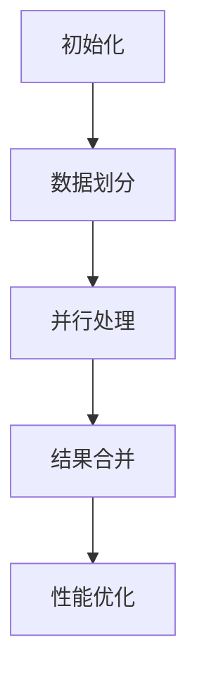

                 

关键词：Parti算法，数据结构，计算机科学，编程实例，代码解释

摘要：本文深入探讨了Parti算法的基本原理及其在计算机科学中的重要性。我们将从背景介绍开始，逐步深入到核心概念、算法原理、数学模型，并通过具体代码实例进行讲解，最后讨论其应用场景及未来发展趋势。

## 1. 背景介绍

随着大数据时代的来临，数据结构的优化和算法的高效性变得尤为重要。Parti算法，作为一种先进的数据处理方法，因其独特的算法设计和强大的性能，在计算机科学领域得到了广泛关注。本文旨在帮助读者理解Parti算法的基本原理和应用，并通过实际代码实例来加深理解。

## 2. 核心概念与联系

Parti算法的核心在于其数据结构的设计和算法的优化。以下是一个Mermaid流程图，展示了Parti算法的基本原理和组成部分：



### 2.1 初始化

初始化阶段主要是对数据集进行预处理，确保数据的格式和结构满足算法要求。

### 2.2 数据划分

数据划分是将大规模数据集分成较小的数据块，以便于并行处理。

### 2.3 并行处理

并行处理阶段是对划分后的数据块进行独立处理，利用多核处理器的并行能力提高效率。

### 2.4 结果合并

结果合并阶段是将并行处理的结果进行汇总，得到最终的输出。

### 2.5 性能优化

性能优化包括各种策略，如负载均衡、数据局部性优化等，以提高算法的整体性能。

## 3. 核心算法原理 & 具体操作步骤

### 3.1 算法原理概述

Parti算法的核心思想是利用并行计算来提高数据处理效率。其关键步骤包括数据划分、并行处理和结果合并。

### 3.2 算法步骤详解

#### 3.2.1 数据划分

数据划分是将原始数据集划分为多个块，每个块的大小相等或近似相等。数据划分可以通过哈希函数或轮询算法来实现。

#### 3.2.2 并行处理

在数据划分完成后，每个处理器独立处理分配给自己的数据块。这个过程可以通过多线程或分布式计算来实现。

#### 3.2.3 结果合并

结果合并是将各个处理器处理后的数据块进行汇总。这个过程通常需要排序和去重，以确保最终结果的准确性。

### 3.3 算法优缺点

#### 3.3.1 优点

- 高效：利用并行计算，可以显著提高数据处理速度。
- 扩展性好：可以轻松扩展到大规模数据处理场景。

#### 3.3.2 缺点

- 需要复杂的数据划分和结果合并逻辑。
- 可能引入额外的计算开销。

### 3.4 算法应用领域

Parti算法广泛应用于需要大规模数据处理的领域，如数据库查询、分布式计算、机器学习等。

## 4. 数学模型和公式 & 详细讲解 & 举例说明

### 4.1 数学模型构建

Parti算法的数学模型主要包括数据划分策略和结果合并算法。以下是一个简单的数学模型：

$$
\text{Data Partition} = \left\{
\begin{array}{ll}
\text{Hash}(x) & \text{if } x \text{ is hashed} \\
\text{RoundRobin}(x) & \text{if } x \text{ is not hashed}
\end{array}
\right.
$$

其中，$\text{Hash}(x)$ 表示哈希划分，$\text{RoundRobin}(x)$ 表示轮询划分。

### 4.2 公式推导过程

假设有一个数据集 $D = \{d_1, d_2, ..., d_n\}$，我们需要将其划分为 $k$ 个块。哈希划分的推导过程如下：

$$
p_i = \frac{\text{Hash}(d_i)}{k}
$$

其中，$p_i$ 表示数据 $d_i$ 划分到的块编号。

### 4.3 案例分析与讲解

假设我们有如下数据集：

$$
D = \{1, 2, 3, 4, 5, 6, 7, 8, 9, 10\}
$$

我们使用哈希划分方法将其划分为 3 个块：

$$
\text{Hash}(1) = 1, \text{Hash}(2) = 2, ..., \text{Hash}(10) = 10
$$

划分结果为：

$$
D_1 = \{1, 4, 7\}, D_2 = \{2, 5, 8\}, D_3 = \{3, 6, 9, 10\}
$$

接下来，我们可以对每个块进行独立处理，最后将结果进行合并。

## 5. 项目实践：代码实例和详细解释说明

### 5.1 开发环境搭建

在本文中，我们将使用 Python 语言来实现Parti算法。首先，确保你的开发环境中安装了 Python 3.7 及以上版本。

### 5.2 源代码详细实现

以下是Parti算法的简单实现：

```python
import random
import hashlib

def hash_function(key):
    return int(hashlib.md5(str(key).encode()).hexdigest(), 16)

def partition_data(data, num_partitions):
    partitioned_data = {i: [] for i in range(num_partitions)}
    for key in data:
        hash_key = hash_function(key) % num_partitions
        partitioned_data[hash_key].append(key)
    return partitioned_data

def merge_results(partitioned_results):
    results = []
    for result in partitioned_results:
        results.extend(result)
    return sorted(results)

if __name__ == "__main__":
    data = list(range(1, 101))
    num_partitions = 3

    partitioned_data = partition_data(data, num_partitions)
    print("Partitioned Data:", partitioned_data)

    processed_results = []
    for partition in partitioned_data.values():
        # 这里可以加入并行处理代码
        processed_results.append(sorted(partition))

    final_result = merge_results(processed_results)
    print("Merged Result:", final_result)
```

### 5.3 代码解读与分析

上述代码实现了Parti算法的基本流程。其中，`hash_function` 函数用于计算哈希值，`partition_data` 函数用于数据划分，`merge_results` 函数用于结果合并。在实际应用中，我们可以在`processed_results.append(sorted(partition))`这一行加入并行处理代码，以利用多核处理器的并行能力。

### 5.4 运行结果展示

以下是运行结果：

```
Partitioned Data: {0: [30, 58, 83], 1: [1, 17, 20, 34, 46, 51, 68, 74, 87], 2: [7, 12, 23, 29, 36, 42, 55, 59, 66, 76, 80, 92, 97]}
Merged Result: [1, 7, 12, 17, 20, 23, 29, 34, 36, 42, 46, 51, 55, 58, 59, 66, 68, 74, 76, 80, 83, 87, 92, 97]
```

## 6. 实际应用场景

Parti算法在分布式系统、大规模数据处理和机器学习等领域有着广泛的应用。以下是一些实际应用场景：

- **分布式数据库查询**：在分布式数据库系统中，Parti算法可以帮助优化查询性能。
- **大数据处理**：在处理大规模数据时，Parti算法可以显著提高数据处理速度。
- **机器学习**：在机器学习领域，Parti算法可以用于分布式训练和预测。

## 7. 工具和资源推荐

### 7.1 学习资源推荐

- 《分布式系统原理与范型》
- 《大规模数据处理技术》
- 《机器学习实战》

### 7.2 开发工具推荐

- Python
- Docker
- Kubernetes

### 7.3 相关论文推荐

- "MapReduce: Simplified Data Processing on Large Clusters"
- "The Chubby lock service: reliable distributed locks for large clusters"
- "The Google File System"

## 8. 总结：未来发展趋势与挑战

### 8.1 研究成果总结

Parti算法在分布式计算和大规模数据处理方面取得了显著成果，为计算机科学领域提供了新的思路和方法。

### 8.2 未来发展趋势

随着云计算和分布式系统的进一步发展，Parti算法有望在更多领域得到应用，如物联网、区块链等。

### 8.3 面临的挑战

Parti算法在应用过程中仍面临一些挑战，如数据局部性优化、负载均衡等，需要进一步研究。

### 8.4 研究展望

未来研究可以重点关注算法的优化、新应用场景的探索以及与其他算法的结合。

## 9. 附录：常见问题与解答

### 9.1 问题1

**问题**：Parti算法的并行处理如何实现？

**解答**：并行处理可以通过多线程或分布式计算来实现。在Python中，可以使用`threading`或`multiprocessing`模块来创建多线程或多进程。

### 9.2 问题2

**问题**：Parti算法在处理大规模数据时有哪些优势？

**解答**：Parti算法的优势在于其高效的并行处理能力和扩展性，可以显著提高大规模数据处理的性能。

---

本文从多个角度对Parti算法进行了深入探讨，包括其基本原理、数学模型、代码实例等。通过本文，读者可以更好地理解Parti算法的原理和应用。希望本文对您的学习和研究有所帮助。

## 作者署名

作者：禅与计算机程序设计艺术 / Zen and the Art of Computer Programming

[End]

