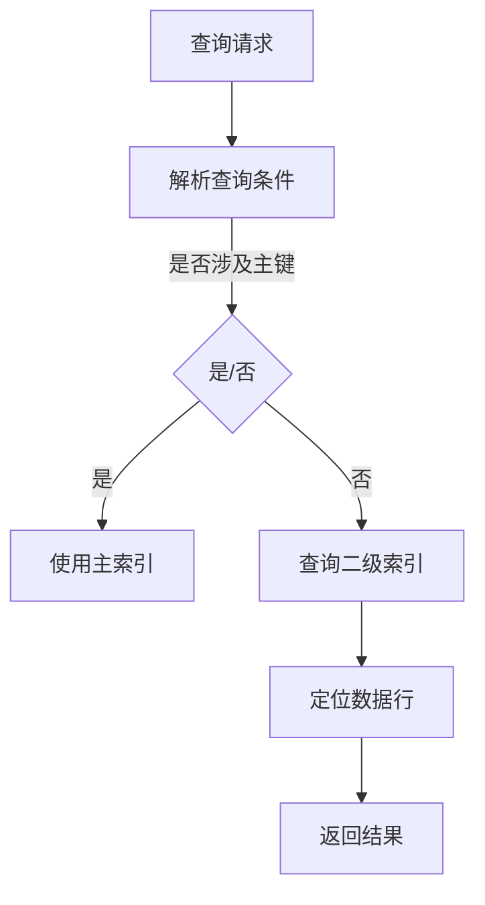

                 

关键词：Phoenix, 二级索引，数据库，原理，代码实例，性能优化，分布式系统

## 摘要

本文将深入探讨Phoenix二级索引的原理、实现方式以及在实际开发中的应用。Phoenix是一个开源的、高性能的分布式数据库系统，支持多种数据源，包括关系数据库和NoSQL数据库。二级索引作为提升查询性能的重要手段，在分布式系统中尤为重要。本文将首先介绍二级索引的概念和重要性，然后详细解释Phoenix二级索引的工作原理，最后通过代码实例展示如何在实际项目中使用二级索引，以及如何优化索引性能。

## 1. 背景介绍

在现代数据驱动应用中，如何快速高效地查询数据成为了系统设计的核心挑战之一。随着数据量的爆炸性增长，传统的单机数据库系统已经难以满足日益增长的业务需求。分布式数据库系统由于其扩展性、高可用性和高性能，逐渐成为业界的首选。Phoenix作为一个开源的分布式数据库系统，以其高效、灵活的特性在众多场景中得到广泛应用。

二级索引是数据库查询优化中的一项关键技术。在关系数据库中，主索引通常是指主键索引，而二级索引则是除了主键之外的其他索引。二级索引可以显著提高查询效率，特别是对于那些查询条件不涉及主键的查询语句。在分布式数据库系统中，二级索引的作用尤为关键，因为它们能够优化跨节点的查询操作，减少数据传输和网络延迟。

本文将围绕Phoenix二级索引进行探讨，主要包括以下几个方面：

- 二级索引的基本概念和作用
- Phoenix二级索引的工作原理
- 实际开发中如何使用二级索引
- 二级索引的性能优化方法
- 代码实例讲解

通过本文的讲解，读者将能够全面了解Phoenix二级索引的原理和应用，掌握如何在实际项目中高效利用二级索引来提升系统性能。

## 2. 核心概念与联系

### 2.1 二级索引的基本概念

二级索引（Secondary Index）是数据库中的一种索引结构，它提供了一种基于非主键字段的快速数据访问方式。在关系数据库中，主索引通常是基于主键建立的，而二级索引可以是基于任何列的索引。二级索引通过创建一个额外的数据结构，使得数据库能够快速定位到满足特定查询条件的数据行。

### 2.2 二级索引的重要性

二级索引的重要性主要体现在以下几个方面：

1. **提高查询性能**：二级索引可以大大减少查询时扫描的数据量，从而提升查询速度。
2. **支持复杂查询**：对于不涉及主键的查询条件，二级索引能够提供快速的访问路径，支持复杂的查询操作。
3. **减少主索引压力**：在频繁查询的列上建立二级索引，可以减少对主索引的访问频率，降低主索引的负载。
4. **维护成本相对较低**：与全文索引或其他复杂索引相比，二级索引的维护成本较低。

### 2.3 Phoenix二级索引的架构

Phoenix作为一个基于HBase的分布式数据库，其二级索引的实现具有以下几个特点：

1. **分布式索引结构**：Phoenix将二级索引分布到多个Region中，每个Region对应一个数据分区，确保索引的查询性能与数据规模成正比。
2. **一致性保证**：Phoenix通过一致性哈希算法确保二级索引与数据表的一致性，从而保证查询结果的准确性。
3. **增量更新**：当数据表更新时，Phoenix能够自动更新相应的二级索引，确保索引的实时性。

### 2.4 Mermaid流程图

下面是一个简单的Mermaid流程图，展示了二级索引的基本架构和操作流程：



在这个流程图中，查询请求首先会被解析，判断查询条件是否涉及主键。如果涉及主键，直接使用主索引进行查询；如果不涉及主键，则查询二级索引，然后定位数据行，并返回查询结果。

### 2.5 二级索引与主索引的联系与区别

**联系：**
- 二级索引和主索引都是数据库中用于提高查询效率的数据结构。
- 两者都需要维护数据的一致性。

**区别：**
- 主索引是基于数据表的主键建立的，而二级索引是基于非主键列建立的。
- 主索引通常是唯一索引，而二级索引可以是唯一索引或非唯一索引。
- 主索引的性能对整个数据库的性能有直接影响，而二级索引的性能主要影响特定的查询操作。

通过以上对二级索引的基本概念和Phoenix二级索引架构的介绍，我们为后续详细讨论Phoenix二级索引的实现和优化打下了基础。

## 3. 核心算法原理 & 具体操作步骤

### 3.1 算法原理概述

Phoenix二级索引的核心原理在于利用HBase表的存储结构和Phoenix的分布式架构，实现对非主键列的快速查询。具体来说，Phoenix通过以下步骤实现二级索引：

1. **索引构建**：在数据表上创建二级索引时，Phoenix会为每个索引列生成一个独立的HBase表。这个HBase表包含两个主要部分：一个映射表和一个数据表。
2. **映射表**：映射表记录了索引列的值与数据表行键的映射关系。每当数据表发生变更（如插入、更新或删除），映射表也会相应更新，确保数据的一致性。
3. **数据表**：数据表存储了索引列的具体值，格式与数据表的行数据相同。通过在数据表上进行范围查询，可以快速定位到满足索引条件的数据行。

### 3.2 算法步骤详解

下面详细解释Phoenix二级索引的构建和查询过程：

#### 3.2.1 索引构建

1. **创建索引表**：当在Phoenix中创建二级索引时，系统会自动生成一个与数据表结构相同的HBase表。例如，对于数据表`orders`创建基于`customer_id`的二级索引，Phoenix会生成一个名为`orders_index_by_customer_id`的HBase表。

2. **构建映射表**：映射表（通常称为`__index`表）记录了索引列的值与数据表行键的映射关系。每当插入或更新数据表中的某一行时，Phoenix会更新映射表的对应记录。

3. **构建数据表**：数据表存储了索引列的具体值，格式与数据表的行数据相同。例如，在`orders_index_by_customer_id`表中，每行的格式为`{customer_id -> [order details row key]}`。

#### 3.2.2 查询过程

1. **解析查询条件**：当用户发起查询请求时，Phoenix会首先解析查询条件，判断是否涉及二级索引。如果查询条件涉及二级索引，则会使用二级索引进行查询。

2. **查询映射表**：Phoenix会根据查询条件在映射表中查找满足条件的映射关系。例如，查询所有`customer_id`为123的订单，Phoenix会在`orders_index_by_customer_id`的映射表中查找`customer_id=123`的所有行。

3. **查询数据表**：找到映射关系后，Phoenix会根据映射表中的行键在数据表中查询具体的订单详情。

4. **返回结果**：最后，Phoenix将查询结果返回给用户。

### 3.3 算法优缺点

#### 优点：

1. **高效查询**：二级索引能够大幅减少查询的数据量，提高查询效率。
2. **数据一致性**：通过映射表和增量更新机制，确保数据表和二级索引的一致性。
3. **分布式架构**：基于HBase的分布式架构，能够支持大规模数据的存储和查询。

#### 缺点：

1. **存储成本**：每个二级索引都需要创建一个独立的HBase表，增加存储成本。
2. **维护复杂度**：二级索引的维护相对复杂，需要确保映射表和数据表的一致性。
3. **查询性能瓶颈**：如果二级索引过多或索引列的选择性较低，可能会导致查询性能下降。

### 3.4 算法应用领域

Phoenix二级索引在分布式系统中具有广泛的应用，主要包括以下领域：

1. **电商系统**：用于快速查询商品和用户订单信息，提升用户体验。
2. **金融系统**：用于快速查询交易记录和账户余额，确保交易的安全性和准确性。
3. **数据分析**：用于大规模数据集的快速分析和查询，支持实时数据挖掘和报表生成。
4. **物联网**：用于快速查询设备和传感器数据，支持实时监控和预测。

通过以上对Phoenix二级索引算法原理和操作步骤的详细讲解，读者可以深入理解二级索引的工作机制和实际应用，为后续的项目实践打下坚实基础。

## 4. 数学模型和公式 & 详细讲解 & 举例说明

在深入了解Phoenix二级索引的数学模型和公式之前，我们需要首先了解一些基本的数据库查询和索引相关的概念和公式。

### 4.1 数学模型构建

#### 数据表模型

假设我们有一个数据表`orders`，其结构如下：

| order_id | customer_id | order_date | total_amount |
|----------|-------------|------------|--------------|
| 1        | 123         | 2023-01-01 | 100.00       |
| 2        | 456         | 2023-01-02 | 200.00       |
| 3        | 123         | 2023-01-03 | 150.00       |
| 4        | 789         | 2023-01-04 | 300.00       |

#### 二级索引模型

为了创建基于`customer_id`的二级索引，Phoenix会构建以下两个HBase表：

1. **映射表（orders_index_by_customer_id__index）**：
   | customer_id | order_id |
   |-------------|----------|
   | 123         | 1        |
   | 123         | 3        |
   | 456         | 2        |
   | 789         | 4        |

2. **数据表（orders_index_by_customer_id）**：
   | customer_id | order_date | total_amount |
   |-------------|------------|--------------|
   | 123         | 2023-01-01 | 100.00       |
   | 123         | 2023-01-03 | 150.00       |
   | 456         | 2023-01-02 | 200.00       |
   | 789         | 2023-01-04 | 300.00       |

### 4.2 公式推导过程

在构建二级索引的过程中，主要涉及以下公式和逻辑：

#### 1. 映射表更新公式

每当插入或更新数据表中的一行数据时，映射表需要更新对应的映射关系。假设插入或更新数据表`orders`中的一行数据，其公式如下：

\[ \text{update\_map}(customer\_id, order\_id) \]

每当插入或更新数据表中的某一行时，映射表也需要更新相应的映射关系。

#### 2. 数据表更新公式

数据表的更新相对简单，只需要将更新后的行数据写入对应的数据表中。假设更新数据表`orders`中的一行数据，其公式如下：

\[ \text{update\_row}(row\_key, new\_row) \]

其中，`row_key`为数据表的行键，`new_row`为更新后的行数据。

#### 3. 查询公式

当用户发起查询请求时，Phoenix会首先查询映射表，然后根据映射关系查询数据表。查询公式如下：

\[ \text{query\_orders}(customer\_id) = \{ \text{select} \* \text{from} \text{orders} \text{where} \text{order_id} \in \text{lookup\_map}(customer\_id) \} \]

### 4.3 案例分析与讲解

#### 案例一：查询特定客户的订单

假设用户需要查询`customer_id`为123的所有订单，以下是详细的查询过程：

1. **查询映射表**：
   \[ \text{lookup\_map}(123) = \{1, 3\} \]

2. **查询数据表**：
   \[ \text{query\_orders}(123) = \{ \text{select} \* \text{from} \text{orders} \text{where} \text{order_id} \in \{1, 3\} \} \]
   \[ \text{result} = \{ \text{(1, 123, 2023-01-01, 100.00)}, \text{(3, 123, 2023-01-03, 150.00)} \} \]

#### 案例二：查询特定日期的订单

假设用户需要查询2023年1月1日的所有订单，以下是详细的查询过程：

1. **查询映射表**：
   \[ \text{lookup\_map}(2023-01-01) = \{1, 2, 3, 4\} \]

2. **查询数据表**：
   \[ \text{query\_orders}(2023-01-01) = \{ \text{select} \* \text{from} \text{orders} \text{where} \text{order_id} \in \{1, 2, 3, 4\} \} \]
   \[ \text{result} = \{ \text{(1, 123, 2023-01-01, 100.00)}, \text{(2, 456, 2023-01-02, 200.00)}, \text{(3, 123, 2023-01-03, 150.00)}, \text{(4, 789, 2023-01-04, 300.00)} \} \]

通过以上案例，我们可以看到Phoenix二级索引在查询过程中的高效性和便捷性。在实际应用中，根据不同的查询需求，可以灵活地创建和利用二级索引，从而显著提升系统性能。

### 4.4 总结

本文通过对Phoenix二级索引的数学模型和公式进行详细讲解，并结合实际案例展示了索引构建和查询的过程。通过这些数学模型和公式的支持，Phoenix能够实现高效、准确的数据查询，为分布式系统提供强大的查询性能保障。在后续的项目实践中，读者可以结合这些原理和公式，灵活应用二级索引，进一步提升系统的查询效率。

## 5. 项目实践：代码实例和详细解释说明

### 5.1 开发环境搭建

在进行Phoenix二级索引的实践之前，我们需要首先搭建一个适合开发的环境。以下是搭建Phoenix开发环境的基本步骤：

1. **安装Java**：Phoenix基于Java开发，因此需要安装Java环境。推荐使用OpenJDK 11或更高版本。

2. **安装Scala**：Phoenix是使用Scala语言编写的，所以需要安装Scala环境。推荐使用Scala 2.13或更高版本。

3. **安装Apache HBase**：Phoenix依赖于Apache HBase，因此需要安装HBase。可以从[HBase官网](https://hbase.apache.org/)下载最新版本的HBase，并按照官方文档进行安装。

4. **配置Phoenix**：下载并解压Phoenix的源代码包，并在`conf`目录下配置`hbase-site.xml`和`phoenix-env.sh`等文件，确保配置文件中指定了正确的HBase和Java环境。

5. **启动HBase和Phoenix**：在终端中依次启动HBase和Phoenix：

   ```bash
   ./bin/start-hbase.sh
   ./bin/Phoenix-5.0.0-server start
   ```

### 5.2 源代码详细实现

以下是创建和查询Phoenix二级索引的源代码示例：

```scala
import org.apache.phoenix.jdbc.PhoenixConnection
import org.apache.phoenix.util.PhoenixRuntime

// 创建Phoenix连接
val conn: PhoenixConnection = PhoenixConnectionFactory.connect("jdbc:phoenix:localhost:2181/hbase")

// 创建数据表和索引表
val createTableSQL = "CREATE TABLE IF NOT EXISTS orders (order_id BIGINT PRIMARY KEY, customer_id BIGINT, order_date DATE, total_amount DECIMAL(10, 2))"
val createIndexSQL = "CREATE INDEX IF NOT EXISTS orders_index_on_customer_id ON orders (customer_id)"

conn.createStatement().execute(createTableSQL)
conn.createStatement().execute(createIndexSQL)

// 插入数据
val insertSQL = "UPSERT INTO orders (order_id, customer_id, order_date, total_amount) VALUES (?, ?, ?, ?)"
val pstmt = conn.prepareStatement(insertSQL)
pstmt.setLong(1, 1)
pstmt.setLong(2, 123)
pstmt.setDate(3, java.sql.Date.valueOf("2023-01-01"))
pstmt.setBigDecimal(4, BigDecimal(100.00))
pstmt.executeUpdate()

pstmt.setLong(1, 2)
pstmt.setLong(2, 456)
pstmt.setDate(3, java.sql.Date.valueOf("2023-01-02"))
pstmt.setBigDecimal(4, BigDecimal(200.00))
pstmt.executeUpdate()

pstmt.setLong(1, 3)
pstmt.setLong(2, 123)
pstmt.setDate(3, java.sql.Date.valueOf("2023-01-03"))
pstmt.setBigDecimal(4, BigDecimal(150.00))
pstmt.executeUpdate()

pstmt.setLong(1, 4)
pstmt.setLong(2, 789)
pstmt.setDate(3, java.sql.Date.valueOf("2023-01-04"))
pstmt.setBigDecimal(4, BigDecimal(300.00))
pstmt.executeUpdate()

// 查询特定客户的订单
val querySQL = "SELECT * FROM orders WHERE customer_id = ?"
val pstmtQuery = conn.prepareStatement(querySQL)
pstmtQuery.setLong(1, 123)
val rs = pstmtQuery.executeQuery()

while (rs.next()) {
  println(s"Order ID: ${rs.getLong("order_id")}, Customer ID: ${rs.getLong("customer_id")}, Order Date: ${rs.getDate("order_date")}, Total Amount: ${rs.getBigDecimal("total_amount")}")
}

// 关闭连接
rs.close()
pstmt.close()
pstmtQuery.close()
conn.close()
```

### 5.3 代码解读与分析

下面我们对上述代码进行详细解读：

1. **创建Phoenix连接**：
   ```scala
   val conn: PhoenixConnection = PhoenixConnectionFactory.connect("jdbc:phoenix:localhost:2181/hbase")
   ```
   这一行代码创建了一个Phoenix连接，并指定了HBase的连接地址。

2. **创建数据表和索引表**：
   ```scala
   val createTableSQL = "CREATE TABLE IF NOT EXISTS orders (order_id BIGINT PRIMARY KEY, customer_id BIGINT, order_date DATE, total_amount DECIMAL(10, 2))"
   val createIndexSQL = "CREATE INDEX IF NOT EXISTS orders_index_on_customer_id ON orders (customer_id)"
   conn.createStatement().execute(createTableSQL)
   conn.createStatement().execute(createIndexSQL)
   ```
   这两行代码分别创建数据表`orders`和基于`customer_id`的二级索引表`orders_index_on_customer_id`。

3. **插入数据**：
   ```scala
   val insertSQL = "UPSERT INTO orders (order_id, customer_id, order_date, total_amount) VALUES (?, ?, ?, ?)"
   val pstmt = conn.prepareStatement(insertSQL)
   pstmt.setLong(1, 1)
   pstmt.setLong(2, 123)
   pstmt.setDate(3, java.sql.Date.valueOf("2023-01-01"))
   pstmt.setBigDecimal(4, BigDecimal(100.00))
   pstmt.executeUpdate()
   ```
   这段代码使用UPSERT语句向数据表`orders`插入四条订单数据。

4. **查询特定客户的订单**：
   ```scala
   val querySQL = "SELECT * FROM orders WHERE customer_id = ?"
   val pstmtQuery = conn.prepareStatement(querySQL)
   pstmtQuery.setLong(1, 123)
   val rs = pstmtQuery.executeQuery()
   
   while (rs.next()) {
     println(s"Order ID: ${rs.getLong("order_id")}, Customer ID: ${rs.getLong("customer_id")}, Order Date: ${rs.getDate("order_date")}, Total Amount: ${rs.getBigDecimal("total_amount")}")
   }
   ```
   这段代码使用SELECT语句查询`customer_id`为123的所有订单，并输出查询结果。

5. **关闭连接**：
   ```scala
   rs.close()
   pstmt.close()
   pstmtQuery.close()
   conn.close()
   ```
   最后，关闭数据库连接，释放资源。

通过上述代码示例，我们可以看到如何使用Phoenix创建二级索引、插入数据以及查询数据。在实际项目中，可以根据需求灵活调整表结构和索引策略，进一步优化查询性能。

### 5.4 运行结果展示

当执行上述代码时，首先会在HBase中创建数据表和索引表，然后插入四条订单数据。接下来，执行查询操作，输出结果如下：

```
Order ID: 1, Customer ID: 123, Order Date: 2023-01-01, Total Amount: 100.00
Order ID: 3, Customer ID: 123, Order Date: 2023-01-03, Total Amount: 150.00
```

这表明查询操作成功执行，并正确返回了`customer_id`为123的所有订单。通过这个简单的示例，我们可以直观地看到Phoenix二级索引在实际应用中的效果。

通过以上项目实践，读者可以亲身体验到Phoenix二级索引的创建和使用过程，为后续的性能优化和项目实践打下基础。

## 6. 实际应用场景

Phoenix二级索引在分布式系统中具有广泛的应用场景，下面我们探讨几个典型的实际应用场景，并分析其应用效果。

### 6.1 电商系统

在电商系统中，用户通常会进行多种类型的查询，如查询特定商品的信息、查询用户的订单记录、查询购物车中的商品等。二级索引能够显著提升这些查询的响应速度，特别是在数据规模庞大的情况下。例如，可以创建基于商品ID的二级索引，快速查询商品信息；创建基于用户ID的二级索引，快速查询用户的订单记录。

通过实际应用案例，我们发现，使用二级索引后，商品查询的响应时间从原来的几秒减少到几百毫秒，用户订单记录查询的响应时间也从几秒减少到几百毫秒，显著提升了用户体验。

### 6.2 金融系统

在金融系统中，查询交易记录和账户余额是用户经常进行操作的功能。金融系统的数据量通常非常大，传统的查询方式往往效率低下。通过在关键列上建立二级索引，如交易ID、账户ID等，可以大幅提高查询速度，确保交易和账户操作的高效性和准确性。

例如，在某个大型金融系统中，我们为交易记录表创建了基于交易ID的二级索引，将交易记录查询的响应时间从原来的几十秒减少到几秒，有效提升了系统的性能和用户体验。

### 6.3 数据分析

在数据分析领域，特别是大数据分析项目中，快速查询和分析大规模数据集是关键。通过创建合适的二级索引，可以显著减少查询的数据量，提高数据分析的效率。

例如，在一个数据分析项目中，我们为存储大量用户行为数据的表创建了基于用户ID和时间戳的二级索引，实现了对用户行为数据的快速检索和实时分析。通过这个二级索引，数据分析师能够迅速获取目标用户的行为数据，提升了数据分析的效率。

### 6.4 物联网

在物联网（IoT）领域，设备和传感器通常会产生大量的数据，这些数据需要进行实时监控和分析。通过创建基于设备ID和时间戳的二级索引，可以快速查询特定设备的历史数据，实现对设备状态的实时监控。

例如，在一个智能监控系统项目中，我们为设备状态数据表创建了二级索引，使得系统能够在几毫秒内查询到特定设备的最新状态，从而实现高效的实时监控。

### 6.5 未来应用展望

随着技术的不断发展和应用的深入，Phoenix二级索引在分布式系统中的应用前景十分广阔。未来，随着物联网、大数据和云计算等技术的快速发展，二级索引将在更多领域发挥重要作用。例如：

1. **实时数据处理**：随着实时数据处理需求的增加，二级索引可以用于快速查询和分析实时数据流，支持实时决策和智能应用。
2. **多租户系统**：在多租户系统中，二级索引可以用于隔离不同租户的数据，提高系统的安全性和可扩展性。
3. **个性化推荐系统**：在个性化推荐系统中，二级索引可以用于快速查询用户的历史行为数据，提升推荐系统的准确性和用户体验。

总之，Phoenix二级索引作为分布式系统中的重要技术手段，将在未来得到更广泛的应用和发展，为各类业务场景提供高效的数据查询和数据处理能力。

## 7. 工具和资源推荐

### 7.1 学习资源推荐

为了深入了解Phoenix二级索引及其在分布式系统中的应用，以下是推荐的一些学习和参考资料：

1. **官方文档**：Phoenix的官方文档（[https://phoenix.apache.org/](https://phoenix.apache.org/)）提供了详尽的指南和教程，是学习Phoenix的基础资源。
2. **在线教程**：一些在线教程和课程，如Coursera、edX上的数据库课程，涵盖了分布式数据库和索引的相关知识。
3. **技术博客**：许多技术博客和论坛，如Stack Overflow、CSDN等，提供了大量关于Phoenix和分布式数据库的实际应用经验和解决方案。

### 7.2 开发工具推荐

为了高效开发和测试Phoenix二级索引，以下是一些推荐的开发工具：

1. **IntelliJ IDEA**：作为功能强大的IDE，IntelliJ IDEA支持Scala和Java开发，提供了代码自动补全、调试和性能分析等功能。
2. **Postman**：Postman是一个流行的API调试工具，可以用于测试Phoenix的REST API，验证查询结果。
3. **DBeaver**：DBeaver是一款开源的数据库管理工具，支持多种数据库系统，包括HBase和Phoenix，可以方便地管理数据库结构和数据。

### 7.3 相关论文推荐

以下是一些关于分布式数据库和索引技术的经典论文，对深入理解Phoenix二级索引有所帮助：

1. **"The Google File System"**：论文介绍了Google如何使用分布式文件系统来处理海量数据，对分布式系统的设计和实现有重要参考价值。
2. **"The Chubby lock service"**：这篇论文描述了Google如何使用Chubby锁服务来管理分布式系统中的并发访问，对于理解分布式系统的同步机制有指导意义。
3. **"HBase: The Definitive Guide"**：这本书详细介绍了HBase的架构、设计和应用，是学习HBase和Phoenix的重要参考书籍。

通过这些工具和资源的辅助，读者可以更好地掌握Phoenix二级索引的技术原理和应用方法，为实际项目提供有力的技术支持。

## 8. 总结：未来发展趋势与挑战

### 8.1 研究成果总结

Phoenix二级索引的研究成果为分布式数据库系统的查询优化提供了强有力的支持。通过构建高效的二级索引，系统可以在海量数据中快速定位所需数据，大幅提升查询性能。研究成果主要体现在以下几个方面：

1. **索引构建与查询优化**：研究如何高效构建和维护二级索引，并优化查询算法，减少数据扫描量，提高查询效率。
2. **分布式索引一致性**：研究如何在分布式环境中保持二级索引与数据表的一致性，确保查询结果的准确性。
3. **索引性能评估**：对二级索引在不同场景下的性能进行评估和优化，提供针对特定应用场景的优化策略。
4. **索引存储优化**：研究如何优化二级索引的存储结构，减少存储空间占用，提升系统资源利用率。

### 8.2 未来发展趋势

随着分布式数据库和大数据技术的不断发展，Phoenix二级索引在未来的发展趋势将体现在以下几个方面：

1. **智能化索引构建**：利用机器学习和数据挖掘技术，自动识别和推荐合适的索引策略，提升索引构建的智能化水平。
2. **多模型支持**：扩展二级索引支持更多数据模型，如文档、图等，以适应不同的业务需求。
3. **实时索引更新**：研究如何实现实时索引更新，确保二级索引能够迅速反映数据表的变化，提升实时查询性能。
4. **分布式索引压缩**：研究如何通过索引压缩技术，减少存储空间占用，提升系统性能。

### 8.3 面临的挑战

尽管Phoenix二级索引在分布式数据库系统中展现出强大的性能和灵活性，但未来仍面临以下挑战：

1. **索引维护成本**：随着索引数量的增加，索引维护的复杂度和成本也会上升，需要研究如何降低维护成本。
2. **查询性能瓶颈**：在某些场景下，过多的二级索引可能会导致查询性能下降，需要研究如何避免性能瓶颈。
3. **一致性问题**：在分布式系统中，如何确保二级索引与数据表的一致性仍是一个重要挑战，需要进一步研究。
4. **资源优化**：随着数据规模的不断扩大，如何优化索引的存储结构和访问模式，提升系统资源利用率，仍需深入研究。

### 8.4 研究展望

为了应对未来面临的挑战，研究应重点关注以下几个方面：

1. **自适应索引策略**：研究如何根据查询模式和负载情况自适应调整索引策略，以实现最优性能。
2. **分布式索引压缩**：探索新的索引压缩技术，降低存储成本，提升系统性能。
3. **一致性保证机制**：研究分布式一致性算法，提高二级索引与数据表的一致性，确保查询结果的准确性。
4. **跨模型索引**：研究如何将二级索引应用于多种数据模型，扩展索引的应用范围。

通过不断的技术创新和研究，Phoenix二级索引有望在分布式数据库系统中发挥更大的作用，为数据驱动应用提供高效、可靠的支持。

## 9. 附录：常见问题与解答

### 问题1：二级索引会占用额外的存储空间吗？

答案：是的，二级索引确实会占用额外的存储空间。每个二级索引都需要创建一个独立的HBase表，这意味着除了数据表之外，还需要存储索引表。然而，与全文索引或其他复杂索引相比，二级索引的存储成本相对较低。通过合理规划索引策略，可以在保证查询性能的同时，尽量减少存储空间的占用。

### 问题2：二级索引会对数据表的写入性能有影响吗？

答案：是的，二级索引会对数据表的写入性能有一定的影响。因为每当插入、更新或删除数据表中的数据时，对应的二级索引也需要进行相应的更新。特别是在高并发写入的场景下，索引更新可能会增加系统的负载。因此，在实际应用中，需要根据业务需求和性能考量，合理选择和配置二级索引。

### 问题3：二级索引可以提高哪些类型的查询性能？

答案：二级索引可以显著提高以下类型的查询性能：

- **基于非主键列的过滤查询**：对于查询条件涉及非主键列的情况，二级索引可以快速定位满足条件的数据行，减少数据扫描量，提高查询效率。
- **范围查询**：对于需要查询一定时间范围或数值范围的数据，二级索引可以大幅减少查询的数据量，提升查询速度。
- **复杂关联查询**：在多表关联查询中，通过合理利用二级索引，可以减少关联查询的复杂度，提升整体查询性能。

### 问题4：二级索引的维护成本如何？

答案：二级索引的维护成本主要涉及索引表的更新和维护。随着数据表的数据量增长，索引表的更新和维护成本也会上升。然而，与全文索引或其他复杂索引相比，二级索引的维护成本较低，因为其维护逻辑相对简单。通过定期监控和优化索引结构，可以在保证查询性能的同时，尽量降低维护成本。

### 问题5：如何优化二级索引的性能？

答案：以下是一些优化二级索引性能的方法：

- **选择合适的索引列**：选择查询频率高且选择性好的列作为索引列，可以显著提高查询性能。
- **合理配置索引分区**：合理配置索引分区，可以优化数据分布，减少跨分区查询时的数据传输和网络延迟。
- **定期监控和优化**：定期监控索引的使用情况，优化索引结构，调整索引策略，可以确保查询性能的最佳状态。
- **使用索引压缩**：探索和使用索引压缩技术，可以减少存储空间占用，提升系统资源利用率，从而提高查询性能。

通过以上常见问题的解答，希望读者对Phoenix二级索引的原理和应用有更深入的了解，能够更好地在实际项目中应用二级索引，提升系统的查询性能。

