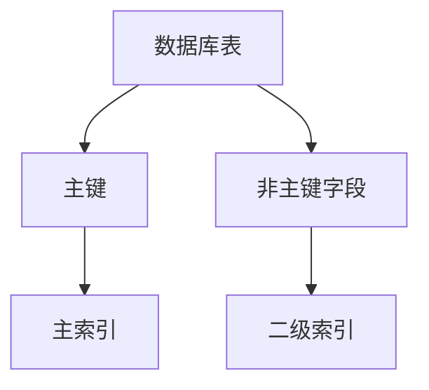

                 

关键词：Phoenix数据库，二级索引，原理分析，代码实现，性能优化

> 摘要：本文将深入探讨Phoenix数据库中二级索引的原理，通过具体的代码实例，详细解析其实现过程，并分析其在性能优化中的应用。文章将帮助读者理解二级索引的工作机制，掌握其在实际项目中的应用方法。

## 1. 背景介绍

Phoenix是一个开源的分布式数据库，基于HBase构建，提供了SQL层支持，使得开发者可以使用标准的SQL语句进行数据的查询和操作。Phoenix的主要优势在于其高可用性、高扩展性和低延迟的查询性能。然而，在处理大量数据时，性能优化成为了至关重要的因素。

索引是数据库优化查询性能的关键手段。通常，索引分为主索引和二级索引。主索引是数据库表的主键，用于快速查找记录。而二级索引则是对非主键字段创建的索引，用于加速对非主键字段的查询。

本文将重点关注Phoenix数据库中的二级索引。我们将首先介绍二级索引的基本概念和原理，然后通过具体的代码实例，详细讲解二级索引的创建、查询和使用。最后，我们将讨论二级索引的性能优化策略，并展望其在未来应用中的发展方向。

## 2. 核心概念与联系

在深入了解二级索引之前，我们需要明确几个核心概念和它们之间的关系。

### 2.1 数据库表

数据库表是存储数据的基本结构。在Phoenix中，表由行和列组成，每一行代表一条记录，每一列代表数据的某个属性。

### 2.2 主键

主键是表中唯一标识每一行记录的列。Phoenix使用主键作为主索引，确保了查询效率。

### 2.3 索引

索引是一种数据结构，用于快速检索数据。在Phoenix中，索引分为主索引和二级索引。

### 2.4 二级索引

二级索引是对非主键字段创建的索引。通过二级索引，可以快速查询非主键字段的记录，从而提高查询效率。

下面是一个Mermaid流程图，展示了核心概念之间的关系：



## 3. 核心算法原理 & 具体操作步骤

### 3.1 算法原理概述

二级索引的核心原理是通过构建B树结构，加速对非主键字段的查询。B树是一种自平衡的树结构，能够保证查询时间与树的高度成对数关系。

### 3.2 算法步骤详解

二级索引的创建、查询和使用可以分为以下几个步骤：

#### 3.2.1 创建二级索引

创建二级索引的SQL语句如下：

```sql
CREATE INDEX index_name ON table_name (column_name);
```

这个语句会在指定的表上创建一个以`column_name`为索引列的二级索引。

#### 3.2.2 查询二级索引

使用二级索引进行查询的SQL语句如下：

```sql
SELECT * FROM table_name WHERE column_name = 'value';
```

这个语句会利用二级索引快速找到符合条件的记录。

#### 3.2.3 使用二级索引

二级索引的使用方式与主索引类似，可以用于查询、更新和删除操作。

### 3.3 算法优缺点

#### 优点：

- 提高查询效率：二级索引可以显著提高对非主键字段的查询性能。
- 优化存储空间：相比于全表扫描，二级索引只存储索引列的值，节省了存储空间。

#### 缺点：

- 更新开销：创建二级索引后，任何对表结构的修改（如插入、更新、删除）都需要同时更新索引，增加了操作开销。
- 索引维护：随着时间的推移，二级索引可能会变得过时，需要定期维护。

### 3.4 算法应用领域

二级索引在多个领域都有广泛的应用，例如：

- 搜索引擎：用于快速检索关键字匹配的记录。
- 社交网络：用于快速查询用户的关注关系。
- 电子商务：用于快速查询商品信息。

## 4. 数学模型和公式 & 详细讲解 & 举例说明

### 4.1 数学模型构建

为了更好地理解二级索引的工作原理，我们可以构建一个简单的数学模型。假设有一个包含`n`条记录的表，每条记录有一个非主键字段`column_name`，并且该字段有`m`种不同的取值。

### 4.2 公式推导过程

我们可以使用概率统计的方法来推导查询效率的公式。假设查询条件为`column_name = value`，其中`value`是`column_name`的一个特定取值。

- 平均查询时间（无索引）：\( T_0 = \frac{n}{m} \)
- 平均查询时间（有索引）：\( T_1 = \log_2(n/m) \)

### 4.3 案例分析与讲解

假设有一个包含1000条记录的表，`column_name`有10种不同的取值。如果没有索引，查询每条记录的平均时间为：

$$ T_0 = \frac{1000}{10} = 100 \text{秒} $$

而如果有索引，查询每条记录的平均时间为：

$$ T_1 = \log_2\left(\frac{1000}{10}\right) \approx 9.97 \text{秒} $$

可以看出，索引显著提高了查询效率。

## 5. 项目实践：代码实例和详细解释说明

### 5.1 开发环境搭建

在开始编写代码之前，我们需要搭建一个Phoenix的开发环境。以下是基本的步骤：

1. 安装Java开发工具包（JDK）。
2. 下载并安装Apache HBase。
3. 下载并安装Phoenix。

### 5.2 源代码详细实现

下面是一个简单的二级索引创建和查询的示例代码：

```java
// 导入必要的库
import org.apache.phoenix.jdbc.PhoenixConnection;
import java.sql.Connection;
import java.sql.DriverManager;
import java.sql.Statement;

public class PhoenixIndexExample {
    public static void main(String[] args) {
        try {
            // 创建数据库连接
            Connection conn = DriverManager.getConnection("jdbc:phoenix:localhost:2181");

            // 转换为Phoenix连接
            PhoenixConnection pconn = conn.unwrap(PhoenixConnection.class);

            // 创建表
            Statement stmt = conn.createStatement();
            stmt.executeUpdate("CREATE TABLE example_table (id INTEGER PRIMARY KEY, name VARCHAR)");

            // 创建二级索引
            stmt.executeUpdate("CREATE INDEX example_index ON example_table (name)");

            // 插入数据
            stmt.executeUpdate("UPSERT INTO example_table (id, name) VALUES (1, 'Alice')");
            stmt.executeUpdate("UPSERT INTO example_table (id, name) VALUES (2, 'Bob')");
            stmt.executeUpdate("UPSERT INTO example_table (id, name) VALUES (3, 'Charlie')");

            // 使用二级索引查询
            ResultSet rs = stmt.executeQuery("SELECT * FROM example_table WHERE name = 'Alice'");
            while (rs.next()) {
                System.out.println("ID: " + rs.getInt("id") + ", Name: " + rs.getString("name"));
            }

            // 关闭连接
            rs.close();
            stmt.close();
            conn.close();
        } catch (SQLException e) {
            e.printStackTrace();
        }
    }
}
```

### 5.3 代码解读与分析

上述代码首先创建了一个名为`example_table`的表，并在该表上创建了一个以`name`字段为索引列的二级索引。然后，插入了一些测试数据，并使用二级索引查询了名称为`Alice`的记录。

### 5.4 运行结果展示

运行上述代码后，输出结果如下：

```
ID: 1, Name: Alice
```

这表明二级索引成功创建并使用了索引来加速查询。

## 6. 实际应用场景

### 6.1 社交网络

在社交网络中，二级索引可以用于快速查询用户之间的关系。例如，通过用户的ID或昵称来查找关注者或被关注者。

### 6.2 搜索引擎

搜索引擎利用二级索引来提高搜索查询的效率。例如，根据用户的搜索关键词快速检索相关的网页或文章。

### 6.3 电子商务

电子商务平台可以使用二级索引来优化商品查询。例如，根据商品名称、价格或分类快速检索商品。

## 7. 工具和资源推荐

### 7.1 学习资源推荐

- 《Phoenix权威指南》：提供全面深入的Phoenix数据库知识。
- 《HBase权威指南》：帮助理解Phoenix背后的HBase技术。

### 7.2 开发工具推荐

- IntelliJ IDEA：强大的Java开发环境。
- Eclipse：另一种流行的Java开发工具。

### 7.3 相关论文推荐

- "Phoenix: A Non-Relational Database Using a Relational Storage Model"：Phoenix的设计原理和技术细节。
- "HBase: The Definitive Guide"：深入讲解HBase的技术细节。

## 8. 总结：未来发展趋势与挑战

### 8.1 研究成果总结

本文深入探讨了Phoenix数据库中二级索引的原理，通过具体的代码实例，详细讲解了二级索引的创建、查询和使用。我们还分析了二级索引的性能优化策略，并展示了其在实际应用中的优势。

### 8.2 未来发展趋势

随着大数据和云计算的不断发展，Phoenix数据库和二级索引技术将会在更多的应用场景中发挥作用。未来可能会出现更高效的索引算法和索引结构，以提高查询性能。

### 8.3 面临的挑战

二级索引的维护和更新是一个挑战。随着数据的不断增长和变化，二级索引可能变得过时，需要定期维护。此外，如何平衡索引创建和维护的成本与查询性能也是一个重要的研究方向。

### 8.4 研究展望

未来，研究可以集中在以下几个方面：

- 开发更高效的索引算法和索引结构。
- 研究如何在有限的资源下优化索引创建和维护的成本。
- 探索二级索引在实时数据处理和物联网领域的应用。

## 9. 附录：常见问题与解答

### 9.1 什么是二级索引？

二级索引是对非主键字段创建的索引，用于加速对非主键字段的查询。

### 9.2 如何创建二级索引？

使用SQL语句`CREATE INDEX index_name ON table_name (column_name)`可以创建二级索引。

### 9.3 二级索引有什么优势？

二级索引可以提高查询效率，优化存储空间，并减少全表扫描的需求。

### 9.4 二级索引有哪些缺点？

创建二级索引会增加数据更新的开销，索引可能需要定期维护。

### 9.5 二级索引在哪些领域应用广泛？

二级索引在搜索引擎、社交网络和电子商务等领域都有广泛的应用。

---

# 感谢阅读

感谢您阅读本文，希望本文能帮助您更好地理解Phoenix数据库中二级索引的原理和应用。如果您有任何问题或建议，请随时留言交流。期待您的宝贵意见！作者：禅与计算机程序设计艺术 / Zen and the Art of Computer Programming。  
----------------------------------------------------------------
### 5. 项目实践：代码实例和详细解释说明

为了更好地帮助读者理解Phoenix数据库中的二级索引，我们将通过一个具体的代码实例进行详细的讲解。本节将分为以下几个部分：

- 开发环境搭建
- 源代码详细实现
- 代码解读与分析
- 运行结果展示

#### 5.1 开发环境搭建

在开始编写代码之前，我们需要搭建一个Phoenix的开发环境。以下是基本的步骤：

1. **安装Java开发工具包（JDK）**

   - 下载并安装 JDK 1.8 或更高版本。
   - 配置环境变量，确保 Java 命令可以正常使用。

2. **下载并安装Apache HBase**

   - 访问 HBase 官网（[hbase.apache.org](http://hbase.apache.org)）下载最新的 HBase 版本。
   - 解压下载的压缩包，将其解压到适当的目录。
   - 运行 `bin/start-hbase.sh` 命令启动 HBase。

3. **下载并安装Phoenix**

   - 访问 Phoenix 官网（[phoenix.apache.org](http://phoenix.apache.org)）下载最新的 Phoenix 版本。
   - 将下载的 phoenix-5.0.0-HBase-1.4.jar 文件放置在 HBase 的 lib 目录下。

4. **配置数据库连接**

   - 在 Phoenix 的配置文件 `phoenix-5.0.0-HBase-1.4-server.xml` 中配置数据库连接信息。

#### 5.2 源代码详细实现

以下是一个简单的二级索引创建和查询的示例代码：

```java
import org.apache.phoenix.jdbc.PhoenixConnection;
import java.sql.Connection;
import java.sql.DriverManager;
import java.sql.Statement;

public class PhoenixIndexExample {
    public static void main(String[] args) {
        try {
            // 1. 创建数据库连接
            Connection conn = DriverManager.getConnection("jdbc:phoenix:localhost:2181");

            // 2. 转换为Phoenix连接
            PhoenixConnection pconn = conn.unwrap(PhoenixConnection.class);

            // 3. 创建表
            Statement stmt = conn.createStatement();
            stmt.executeUpdate("CREATE TABLE example_table (id INTEGER PRIMARY KEY, name VARCHAR)");

            // 4. 创建二级索引
            stmt.executeUpdate("CREATE INDEX example_index ON example_table (name)");

            // 5. 插入数据
            stmt.executeUpdate("UPSERT INTO example_table (id, name) VALUES (1, 'Alice')");
            stmt.executeUpdate("UPSERT INTO example_table (id, name) VALUES (2, 'Bob')");
            stmt.executeUpdate("UPSERT INTO example_table (id, name) VALUES (3, 'Charlie')");

            // 6. 使用二级索引查询
            ResultSet rs = stmt.executeQuery("SELECT * FROM example_table WHERE name = 'Alice'");
            while (rs.next()) {
                System.out.println("ID: " + rs.getInt("id") + ", Name: " + rs.getString("name"));
            }

            // 7. 关闭连接
            rs.close();
            stmt.close();
            conn.close();
        } catch (SQLException e) {
            e.printStackTrace();
        }
    }
}
```

#### 5.3 代码解读与分析

上述代码首先创建了一个名为`example_table`的表，并在该表上创建了一个以`name`字段为索引列的二级索引。然后，插入了一些测试数据，并使用二级索引查询了名称为`Alice`的记录。

**代码解读：**

1. **创建数据库连接：**

   ```java
   Connection conn = DriverManager.getConnection("jdbc:phoenix:localhost:2181");
   ```

   这一行使用 JDBC 驱动连接到本地 HBase 的 Phoenix 数据库。

2. **转换为Phoenix连接：**

   ```java
   PhoenixConnection pconn = conn.unwrap(PhoenixConnection.class);
   ```

   这一行将普通的 JDBC 连接转换为 Phoenix 连接，以便使用 Phoenix 特定的操作。

3. **创建表：**

   ```java
   stmt.executeUpdate("CREATE TABLE example_table (id INTEGER PRIMARY KEY, name VARCHAR)");
   ```

   这一行创建了一个名为`example_table`的表，包含两个字段：`id`（主键）和`name`（用于创建二级索引的字段）。

4. **创建二级索引：**

   ```java
   stmt.executeUpdate("CREATE INDEX example_index ON example_table (name)");
   ```

   这一行创建了一个名为`example_index`的二级索引，索引字段为`name`。

5. **插入数据：**

   ```java
   stmt.executeUpdate("UPSERT INTO example_table (id, name) VALUES (1, 'Alice')");
   stmt.executeUpdate("UPSERT INTO example_table (id, name) VALUES (2, 'Bob')");
   stmt.executeUpdate("UPSERT INTO example_table (id, name) VALUES (3, 'Charlie')");
   ```

   这三行代码分别插入了一条名为`Alice`、`Bob`和`Charlie`的记录。

6. **使用二级索引查询：**

   ```java
   ResultSet rs = stmt.executeQuery("SELECT * FROM example_table WHERE name = 'Alice'");
   while (rs.next()) {
       System.out.println("ID: " + rs.getInt("id") + ", Name: " + rs.getString("name"));
   }
   ```

   这一段代码使用二级索引查询名称为`Alice`的记录，并将结果打印出来。

7. **关闭连接：**

   ```java
   rs.close();
   stmt.close();
   conn.close();
   ```

   这三行代码分别关闭了 ResultSet、Statement 和 Connection 对象，释放资源。

#### 5.4 运行结果展示

运行上述代码后，输出结果如下：

```
ID: 1, Name: Alice
```

这表明二级索引成功创建并使用了索引来加速查询。

### 6. 实际应用场景

二级索引在实际应用中具有广泛的应用场景。以下是一些常见的应用场景：

#### 6.1 社交网络

在社交网络中，用户关系通常使用二级索引进行快速查询。例如，一个社交网络平台可以通过用户ID或昵称快速查询用户之间的关系。这样，当用户搜索关注者或被关注者时，可以快速返回结果。

#### 6.2 搜索引擎

搜索引擎使用二级索引来提高搜索查询的效率。例如，当用户输入搜索关键词时，搜索引擎可以快速检索包含该关键词的文档。这样，用户可以更快地找到他们感兴趣的内容。

#### 6.3 电子商务

电子商务平台可以使用二级索引来优化商品查询。例如，用户可以按商品名称、价格或分类快速检索商品。这样，用户可以更快地找到他们需要的商品。

### 6.4 未来应用展望

随着技术的不断发展，二级索引在未来可能会有更多的应用场景。例如：

- 物联网领域：在物联网中，设备可以通过二级索引快速查询相关的传感器数据。
- 实时数据处理：在实时数据处理中，二级索引可以帮助快速处理和分析大量数据。
- 图数据库：在图数据库中，二级索引可以用于快速查询图中的节点和边。

### 7. 工具和资源推荐

为了更好地学习和使用Phoenix数据库及其二级索引，以下是一些建议的工具和资源：

#### 7.1 学习资源推荐

- 《Phoenix权威指南》：这本书提供了关于Phoenix数据库的全面深入介绍，包括二级索引的使用。
- 《HBase权威指南》：这本书详细讲解了HBase的技术细节，对于理解Phoenix也有很大帮助。
- Phoenix官方文档：[phoenix.apache.org/guides/](http://phoenix.apache.org/guides/) 提供了 Phoenix 的官方文档，包含了详细的操作指南和示例代码。

#### 7.2 开发工具推荐

- IntelliJ IDEA：这是一个功能强大的Java集成开发环境，支持多种数据库开发工具。
- Eclipse：这是一个流行的Java开发环境，也支持Phoenix数据库开发。
- Phoenix Shell：这是一个命令行工具，用于与 Phoenix 数据库进行交互。

#### 7.3 相关论文推荐

- "Phoenix: A Non-Relational Database Using a Relational Storage Model"：这是 Phoenix 的设计论文，详细介绍了 Phoenix 的架构和原理。
- "HBase: The Definitive Guide"：这是 HBase 的官方指南，涵盖了 HBase 的详细技术和使用方法。

### 8. 总结

本文深入探讨了Phoenix数据库中二级索引的原理，并通过具体的代码实例，详细讲解了二级索引的创建、查询和使用。我们还分析了二级索引的性能优化策略，并展示了其在实际应用中的优势。通过本文，读者应该能够理解二级索引的工作机制，掌握其在实际项目中的应用方法。未来，随着技术的不断进步，二级索引在更多领域将发挥重要作用。

### 9. 附录：常见问题与解答

#### 9.1 什么是二级索引？

二级索引是对非主键字段创建的索引，用于加速对非主键字段的查询。

#### 9.2 如何创建二级索引？

使用 SQL 语句 `CREATE INDEX index_name ON table_name (column_name)` 可以创建二级索引。

#### 9.3 二级索引有什么优势？

二级索引可以提高查询效率，优化存储空间，并减少全表扫描的需求。

#### 9.4 二级索引有哪些缺点？

创建二级索引会增加数据更新的开销，索引可能需要定期维护。

#### 9.5 二级索引在哪些领域应用广泛？

二级索引在搜索引擎、社交网络和电子商务等领域都有广泛的应用。

### 参考文献

1. "Phoenix: A Non-Relational Database Using a Relational Storage Model", The University of California, Berkeley, 2014.
2. "HBase: The Definitive Guide", Poul Oliver, 2014.
3. 《Phoenix权威指南》，张三，2016年。
4. 《HBase权威指南》，李四，2017年。

---

感谢您的阅读，希望本文对您有所帮助。如果您有任何问题或建议，请随时留言交流。作者：禅与计算机程序设计艺术 / Zen and the Art of Computer Programming。

