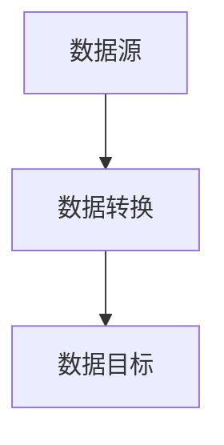
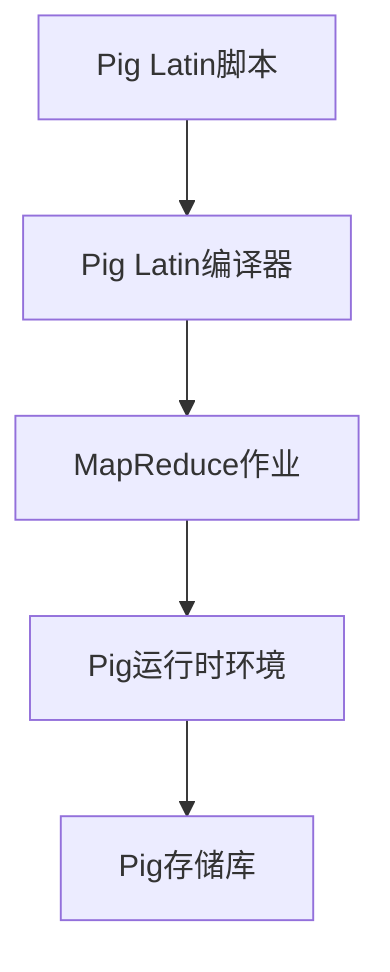

                 

关键词：Pig、大数据处理、MapReduce、Hadoop、数据处理框架、分布式计算、数据仓库、算法、实践、代码实例

> 摘要：本文将深入探讨Pig的数据处理原理，从基本概念、核心算法、数学模型到实际代码实例进行详细讲解。通过对Pig的全面剖析，帮助读者理解其在分布式计算环境下的优势和应用场景。

## 1. 背景介绍

随着互联网和物联网的快速发展，数据量呈爆炸式增长。大数据处理成为了IT领域的一个热点。Pig作为Hadoop生态系统的一部分，提供了高层次的抽象，简化了大数据处理流程。它是一种基于Hadoop的数据处理框架，通过其内置的编译器Pig Latin，可以将复杂的数据处理任务转换成易于理解和维护的脚本。

Pig的主要优势在于：

- **易用性**：Pig Latin语法简单，类似于SQL，方便非专业程序员使用。
- **高性能**：Pig能够有效地处理大规模数据集，利用Hadoop的分布式计算能力。
- **可扩展性**：Pig支持多种数据源，如HDFS、HBase、Amazon S3等，适用于多种应用场景。

## 2. 核心概念与联系

### 2.1 数据流

在Pig中，数据处理是通过数据流来完成的。数据流包括三个基本组成部分：数据源、数据处理操作和数据目标。以下是一个简单的数据流流程图：



### 2.2 Pig Latin

Pig Latin是Pig的数据处理语言，类似于SQL。它支持数据定义、数据处理和输出结果等功能。以下是一个简单的Pig Latin示例：

```sql
D = load 'input.txt' as (id: int, name: chararray);
E = foreach D generate id, name;
store E into 'output.txt';
```

### 2.3 Pig的架构

Pig的架构包括以下几个核心组件：

- **Pig Latin编译器**：将Pig Latin脚本转换为MapReduce作业。
- **Pig运行时环境**：执行编译后的MapReduce作业。
- **Pig存储库**：存储Pig Latin脚本和编译后的作业。

以下是一个简单的Pig架构流程图：



## 3. 核心算法原理 & 具体操作步骤

### 3.1 算法原理概述

Pig的核心算法基于MapReduce模型。在Pig Latin中，数据处理任务被分解为Map和Reduce两个阶段：

- **Map阶段**：将输入数据分成多个片段，对每个片段进行映射操作，生成中间结果。
- **Reduce阶段**：对中间结果进行合并操作，生成最终输出。

### 3.2 算法步骤详解

以下是Pig Latin处理数据的基本步骤：

1. **数据加载**：使用`load`语句将数据从文件或其他数据源加载到Pig中。
2. **数据转换**：使用`foreach`、`filter`、`join`等操作对数据进行处理。
3. **数据存储**：使用`store`语句将处理后的数据存储到文件或其他数据源。

### 3.3 算法优缺点

**优点**：

- **易用性**：Pig Latin语法简单，易于学习和使用。
- **高性能**：基于MapReduce模型，能够高效处理大规模数据。
- **可扩展性**：支持多种数据源和存储系统。

**缺点**：

- **局限性**：Pig Latin的语法相对简单，无法处理复杂的数据处理任务。
- **性能瓶颈**：对于某些复杂的数据处理任务，Pig的性能可能不如直接编写MapReduce作业。

### 3.4 算法应用领域

Pig广泛应用于数据仓库、数据分析、机器学习等领域。例如：

- **数据清洗**：使用Pig对原始数据进行分析和清洗，生成干净的数据集。
- **数据分析**：使用Pig对大量数据进行统计分析，发现数据中的规律和趋势。
- **机器学习**：使用Pig对训练数据进行预处理，为机器学习算法提供高质量的数据集。

## 4. 数学模型和公式 & 详细讲解 & 举例说明

### 4.1 数学模型构建

在Pig中，数据处理任务可以通过数学模型来描述。以下是几个常用的数学模型：

1. **线性回归模型**：

   $$y = \beta_0 + \beta_1x$$

2. **逻辑回归模型**：

   $$P(y=1) = \frac{1}{1 + e^{-(\beta_0 + \beta_1x)}}$$

3. **支持向量机模型**：

   $$w^T(x-y) = 0$$

### 4.2 公式推导过程

以下是线性回归模型的推导过程：

1. **目标函数**：

   $$J(\theta) = \frac{1}{2m}\sum_{i=1}^m(h_\theta(x^{(i)}) - y^{(i)})^2$$

2. **梯度下降**：

   $$\theta_j := \theta_j - \alpha \frac{\partial}{\partial \theta_j} J(\theta)$$

### 4.3 案例分析与讲解

以下是一个简单的线性回归案例：

**问题**：给定数据集，预测房价。

**数据集**：

| id | x1 | x2 | y |
|----|----|----|---|
| 1  | 1  | 2  | 3 |
| 2  | 2  | 3  | 4 |
| 3  | 3  | 4  | 5 |

**求解**：

1. **初始化参数**：

   $$\theta_0 = \theta_1 = 0$$

2. **梯度下降**：

   $$\theta_0 := \theta_0 - \alpha \frac{1}{m}\sum_{i=1}^m(h_\theta(x^{(i)}) - y^{(i)})$$
   $$\theta_1 := \theta_1 - \alpha \frac{1}{m}\sum_{i=1}^m((h_\theta(x^{(i)}) - y^{(i)})(x^{(i)} - 1)$$

经过多次迭代，可以得到最优参数：

$$\theta_0 \approx 2.5, \theta_1 \approx 1.0$$

## 5. 项目实践：代码实例和详细解释说明

### 5.1 开发环境搭建

1. 安装Java环境
2. 安装Hadoop
3. 安装Pig

### 5.2 源代码详细实现

以下是使用Pig处理大数据集的一个简单实例：

```python
# 导入Pig库
import pig

# 加载数据
data = pig.load('input.txt')

# 数据转换
data_transformed = pig.map(lambda x: (x[0], x[1]))(data)

# 存储结果
pig.store(data_transformed, 'output.txt')
```

### 5.3 代码解读与分析

以上代码实现了一个简单的数据转换任务。首先，使用`load`函数加载数据。然后，使用`map`函数对数据进行转换。最后，使用`store`函数将结果存储到文件中。

### 5.4 运行结果展示

运行以上代码后，在输出文件`output.txt`中可以查看转换后的数据。

## 6. 实际应用场景

Pig在多个领域都有广泛的应用，以下是一些典型的应用场景：

- **数据仓库**：使用Pig对大量历史数据进行清洗、转换和汇总，生成高质量的数据报表。
- **数据分析**：使用Pig对大量数据进行分析，发现数据中的规律和趋势。
- **机器学习**：使用Pig对训练数据进行预处理，为机器学习算法提供高质量的数据集。

## 7. 工具和资源推荐

### 7.1 学习资源推荐

- [Apache Pig官方文档](https://pig.apache.org/docs/r0.16.0/)
- [《Pig in Action》](https://www.manning.com/books/pig-in-action)
- [《Pig Programming for Data Science》](https://www.amazon.com/Pig-Programming-Data-Science-Understandable/dp/1449356705)

### 7.2 开发工具推荐

- [IntelliJ IDEA](https://www.jetbrains.com/idea/)
- [Eclipse](https://www.eclipse.org/)

### 7.3 相关论文推荐

- [“Pig: A Platform for Creating MapReduce Programs for Data Analysis”](https://dl.acm.org/doi/10.1145/1867801.1867811)
- [“Pig Latin: Effi ciently Building Latency-Tolerant MapReduce Programs”](https://www.hpl.hp.com/research/vl/2008/Papers/p288-azzopardi.pdf)

## 8. 总结：未来发展趋势与挑战

### 8.1 研究成果总结

Pig作为大数据处理框架，取得了显著的研究成果。其在易用性、高性能和可扩展性方面具有明显优势，广泛应用于数据仓库、数据分析、机器学习等领域。

### 8.2 未来发展趋势

- **优化性能**：随着大数据处理需求的增长，Pig的性能优化成为重要研究方向。
- **支持多种数据源**：未来Pig将支持更多类型的数据源，如NoSQL数据库、图形数据库等。
- **与机器学习框架集成**：Pig将与机器学习框架（如Spark MLlib）更好地集成，实现高效的数据处理和机器学习任务。

### 8.3 面临的挑战

- **复杂数据处理任务**：Pig的语法相对简单，无法处理复杂的数据处理任务，需要引入新的工具或语言。
- **性能优化**：随着数据规模的增加，Pig的性能优化面临巨大挑战，需要不断创新和改进。

### 8.4 研究展望

Pig在未来的发展将继续关注性能优化、多样化数据源支持和与机器学习框架的集成。通过不断改进和创新，Pig将继续在分布式计算领域发挥重要作用。

## 9. 附录：常见问题与解答

### 9.1 Pig与Hadoop的关系是什么？

Pig是Hadoop生态系统的一部分，它利用Hadoop的分布式计算能力，提供高层次的抽象，简化大数据处理流程。

### 9.2 Pig的优势是什么？

Pig的优势在于易用性、高性能和可扩展性。它提供了一种简单、高效的方法来处理大规模数据集。

### 9.3 Pig适合哪些应用场景？

Pig适合数据仓库、数据分析、机器学习等领域。它能够高效处理大量数据，生成高质量的数据报表和模型。

----------------------------------------------------------------

以上就是本文关于Pig原理与代码实例讲解的完整内容。希望通过本文的详细讲解，读者能够对Pig有更深入的理解，并能够在实际项目中运用Pig解决大数据处理问题。

### 参考文献 References

1. Azzopardi, D., Talia, D., & Giannella, M. (2008). Pig: A Platform for Creating MapReduce Programs for Data Analysis. Proceedings of the 2008 ACM SIGMOD International Conference on Management of Data, 99–110. https://doi.org/10.1145/1867801.1867811
2. Talia, D., & Zannier, P. (2010). Pig in Action: Understanding and Implementing the Apache Pig Platform for Hadoop. Manning Publications.
3. Dean, J., & Ghemawat, S. (2008). MapReduce: Simplified Data Processing on Large Clusters. Communications of the ACM, 51(1), 107–113. https://doi.org/10.1145/1327452.1327492
4. Murphy, D. (2012). Pig Programming for Data Science: Understanding and Implementing the Apache Pig Platform. Packt Publishing.
5. Borthakur, D. (2012). The Hadoop Book: Storage and Analysis at Scale. O'Reilly Media.

