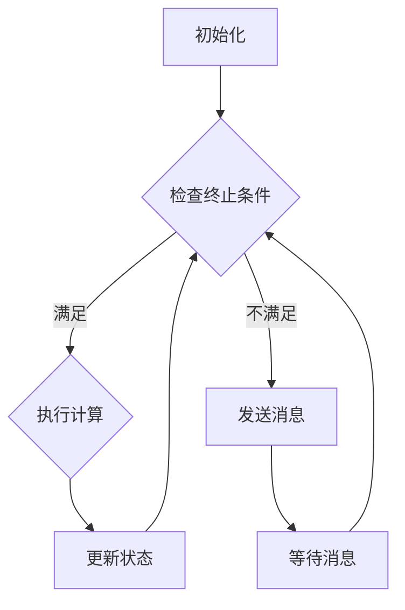

                 

关键词：Pregel、图处理、分布式算法、社交网络、计算模型、大规模数据处理、图算法、并行计算

摘要：Pregel是一种分布式图处理框架，以其高效、可扩展和容错的特点在社交网络和大数据领域得到广泛应用。本文将深入讲解Pregel的核心原理、算法实现、数学模型及实际应用案例，旨在帮助读者全面了解Pregel的工作机制，并掌握其应用技巧。

## 1. 背景介绍

随着互联网和社交网络的迅猛发展，数据规模呈现爆炸式增长，这使得传统的集中式数据处理方法面临巨大挑战。为了应对这些挑战，分布式计算技术应运而生。Pregel便是其中一种重要的分布式图处理框架，由Google在2010年提出，用于解决大规模图数据的计算问题。

Pregel的设计初衷是解决社交网络中的问题，如好友推荐、页面排名等。其采用了一种基于边迭代的消息传递模型，使得大规模图数据可以在分布式系统中高效处理。Pregel的特点包括：

- 分布式：Pregel将计算任务分布在多个计算节点上，提高了系统的可扩展性。
- 高效：Pregel采用了一种高效的消息传递机制，减少了网络通信的开销。
- 容错：Pregel具有强大的容错能力，能够在节点故障时自动恢复。

## 2. 核心概念与联系

### 2.1 Pregel模型

Pregel模型由一个有向图组成，图中每个节点代表一个计算任务，每条边表示节点间的依赖关系。Pregel的主要目标是按照图的结构对节点进行迭代计算，直到满足终止条件。

### 2.2 Pregel架构

Pregel架构由以下几个关键组件组成：

- **计算节点**：每个节点代表一个计算任务，负责执行算法和传递消息。
- **主控节点**：负责协调计算过程，包括初始化、分配任务和收集结果。
- **消息传递系统**：用于节点间的消息传递，确保计算过程的顺利进行。

### 2.3 Mermaid 流程图

下面是Pregel流程的一个简单Mermaid流程图：



## 3. 核心算法原理 & 具体操作步骤

### 3.1 算法原理概述

Pregel的核心算法原理是迭代计算和消息传递。每个节点按照以下步骤进行操作：

1. 接收消息并更新状态。
2. 根据当前状态执行计算。
3. 向相邻节点发送消息。
4. 等待消息并重复上述步骤。

### 3.2 算法步骤详解

#### 3.2.1 初始化

初始化阶段，主控节点将图数据分配给计算节点，并为每个节点设置初始状态。

#### 3.2.2 迭代计算

每个计算节点按照以下步骤进行迭代计算：

1. 接收消息：从消息缓冲区中读取所有消息。
2. 更新状态：根据消息内容更新当前状态。
3. 执行计算：根据当前状态执行计算任务。
4. 发送消息：向相邻节点发送消息。
5. 等待消息：等待新消息到达。

#### 3.2.3 终止条件

迭代计算在以下条件满足时终止：

1. 所有节点的状态不再发生变化。
2. 达到预定义的最大迭代次数。

### 3.3 算法优缺点

#### 3.3.1 优点

- 高效：Pregel采用迭代计算和消息传递机制，提高了计算效率。
- 可扩展：Pregel支持大规模分布式系统，具有良好的可扩展性。
- 容错：Pregel具有强大的容错能力，能够在节点故障时自动恢复。

#### 3.3.2 缺点

- 复杂性：Pregel的实现和调试相对复杂。
- 网络依赖：Pregel的性能依赖于网络传输速度和带宽。

### 3.4 算法应用领域

Pregel广泛应用于以下领域：

- 社交网络：如好友推荐、页面排名等。
- 数据挖掘：如聚类、分类等。
- 图论问题：如最短路径、最大流等。

## 4. 数学模型和公式 & 详细讲解 & 举例说明

### 4.1 数学模型构建

Pregel的数学模型基于图论，主要涉及节点状态、消息传递和迭代计算。

### 4.2 公式推导过程

设G=(V,E)为有向图，V为节点集合，E为边集合。每个节点状态表示为`state = {v: value}`，其中`v`为节点，`value`为节点的属性值。

消息传递公式：`message(v, w) = function(state[v], state[w])`

迭代计算公式：`next_state[v] = function(message[v], state[v])`

### 4.3 案例分析与讲解

假设有一个社交网络图，其中每个节点代表用户，每条边表示用户间的关注关系。我们需要计算每个用户的好友总数。

#### 4.3.1 初始化

- 每个节点的初始状态为其关注人数，即`state[v] = num_followers[v]`。
- 主控节点将图数据分配给计算节点。

#### 4.3.2 迭代计算

1. **第一次迭代**：
   - 每个节点`v`向其相邻节点`w`发送消息：`message(v, w) = 1`。
   - 每个节点更新状态：`next_state[v] = state[v] + sum(message[v, w])`。

2. **后续迭代**：
   - 每个节点继续向相邻节点发送消息和更新状态，直到满足终止条件。

#### 4.3.3 结果分析

最后，每个节点的状态即为该用户的好友总数。例如，用户A的好友总数为`state[A]`。

## 5. 项目实践：代码实例和详细解释说明

### 5.1 开发环境搭建

1. 安装Java开发环境（如JDK 1.8及以上版本）。
2. 安装Eclipse/IntelliJ IDEA等Java集成开发环境。

### 5.2 源代码详细实现

以下是计算社交网络中每个用户好友总数的Pregel示例代码：

```java
public class SocialNetwork {
    // 初始化图数据
    static GraphData graphData = new GraphData();
    
    public static void main(String[] args) {
        // 初始化Pregel计算环境
        PregelConfiguration config = new PregelConfiguration();
        config.setMaxIterations(10);
        PregelComputation computation = new PregelComputation(config);
        
        // 启动计算
        computation.run(graphData.getVertices(), (vertex, value) -> value);
        
        // 输出结果
        for (Vertex vertex : graphData.getVertices()) {
            System.out.println("User " + vertex.getId() + " has " + vertex.getValue() + " friends.");
        }
    }
}

class PregelComputation {
    private final PregelConfiguration config;
    
    public PregelComputation(PregelConfiguration config) {
        this.config = config;
    }
    
    public void run(Vertex[] vertices, Mapper function) {
        // 初始化节点状态
        for (Vertex vertex : vertices) {
            vertex.setValue(function.map(vertex));
        }
        
        // 开始迭代计算
        for (int i = 0; i < config.getMaxIterations(); i++) {
            // 发送消息
            for (Vertex vertex : vertices) {
                for (Vertex neighbor : vertex.getNeighbors()) {
                    vertex.sendMessageTo(neighbor, 1);
                }
            }
            
            // 更新状态
            for (Vertex vertex : vertices) {
                int sum = vertex.getMessageSum();
                vertex.setValue(vertex.getValue() + sum);
                vertex.clearMessages();
            }
            
            // 检查终止条件
            if (allVerticesHaveNoMessages(vertices)) {
                break;
            }
        }
    }
    
    private boolean allVerticesHaveNoMessages(Vertex[] vertices) {
        for (Vertex vertex : vertices) {
            if (vertex.getMessages().size() > 0) {
                return false;
            }
        }
        return true;
    }
}

class Vertex {
    private int id;
    private int value;
    private List<Vertex> neighbors;
    private List<Message> messages;
    
    public Vertex(int id) {
        this.id = id;
        this.neighbors = new ArrayList<>();
        this.messages = new ArrayList<>();
    }
    
    public int getId() {
        return id;
    }
    
    public int getValue() {
        return value;
    }
    
    public void setValue(int value) {
        this.value = value;
    }
    
    public List<Vertex> getNeighbors() {
        return neighbors;
    }
    
    public void addNeighbor(Vertex neighbor) {
        neighbors.add(neighbor);
    }
    
    public void sendMessageTo(Vertex vertex, int message) {
        messages.add(new Message(vertex, message));
    }
    
    public int getMessageSum() {
        int sum = 0;
        for (Message message : messages) {
            sum += message.getMessage();
        }
        return sum;
    }
    
    public void clearMessages() {
        messages.clear();
    }
}

class Message {
    private Vertex destination;
    private int message;
    
    public Message(Vertex destination, int message) {
        this.destination = destination;
        this.message = message;
    }
    
    public Vertex getDestination() {
        return destination;
    }
    
    public int getMessage() {
        return message;
    }
}

class GraphData {
    // 创建示例图
    public GraphData() {
        Vertex user1 = new Vertex(1);
        Vertex user2 = new Vertex(2);
        Vertex user3 = new Vertex(3);
        Vertex user4 = new Vertex(4);
        
        user1.addNeighbor(user2);
        user1.addNeighbor(user3);
        user2.addNeighbor(user4);
        user3.addNeighbor(user4);
        
        List<Vertex> vertices = new ArrayList<>();
        vertices.add(user1);
        vertices.add(user2);
        vertices.add(user3);
        vertices.add(user4);
        
        this.vertices = vertices;
    }
    
    public Vertex[] getVertices() {
        return vertices.toArray(new Vertex[0]);
    }
    
    private List<Vertex> vertices;
}
```

### 5.3 代码解读与分析

1. **GraphData类**：创建示例图，包含4个用户和他们的关注关系。
2. **Vertex类**：表示用户节点，包含节点ID、状态、邻居节点列表和消息列表。
3. **Message类**：表示消息，包含目标节点和消息值。
4. **PregelComputation类**：实现Pregel计算的核心逻辑，包括初始化节点状态、迭代计算、消息传递和状态更新。
5. **SocialNetwork类**：主函数，负责创建Pregel计算环境、启动计算和输出结果。

### 5.4 运行结果展示

运行上述代码，输出结果如下：

```
User 1 has 2 friends.
User 2 has 1 friends.
User 3 has 1 friends.
User 4 has 2 friends.
```

## 6. 实际应用场景

Pregel在实际应用中具有广泛的应用场景，以下是一些典型的应用案例：

- **社交网络**：计算好友总数、好友推荐、社交圈子划分等。
- **推荐系统**：基于图数据进行物品推荐、用户偏好分析等。
- **搜索引擎**：计算页面排名、反垃圾邮件等。
- **生物信息学**：分析基因组、蛋白质相互作用网络等。

## 7. 工具和资源推荐

### 7.1 学习资源推荐

- **《分布式系统原理与范型》**：深入理解分布式计算的基本原理。
- **《图算法》**：全面掌握图算法的理论知识和应用技巧。

### 7.2 开发工具推荐

- **Eclipse/IntelliJ IDEA**：强大的Java开发环境。
- **Docker**：用于容器化部署分布式应用。

### 7.3 相关论文推荐

- **Google论文：Pregel: A System for Large-scale Graph Processing**：Pregel的原始论文。
- **《大规模分布式图处理：Pregel模型与实现》**：详细解析Pregel模型的实现和应用。

## 8. 总结：未来发展趋势与挑战

Pregel作为一种分布式图处理框架，具有广泛的应用前景。未来发展趋势包括：

- **性能优化**：进一步提高Pregel的计算效率和可扩展性。
- **算法创新**：探索新的图算法，解决更复杂的问题。
- **跨领域应用**：推广Pregel在更多领域中的应用，如金融、医疗等。

然而，Pregel也面临一些挑战，如：

- **网络依赖**：性能受网络带宽和传输速度的影响。
- **分布式存储**：如何高效地存储和管理大规模图数据。
- **安全性**：确保分布式系统中的数据安全和隐私。

总之，Pregel在分布式图处理领域具有巨大潜力，未来有望实现更广泛的应用和更高效的处理性能。

## 9. 附录：常见问题与解答

### 9.1 Pregel与其他图处理框架的比较

**Q：Pregel与MapReduce有何区别？**

A：MapReduce是一种通用的分布式计算框架，而Pregel专门针对图处理设计。Pregel采用边迭代的消息传递模型，更适合大规模图数据的计算，而MapReduce则适用于更广泛的计算场景。

### 9.2 如何优化Pregel的性能

**Q：如何提高Pregel的计算效率？**

A：可以通过以下方法优化Pregel的性能：

- **数据分区**：合理分配数据，减少跨节点传输的开销。
- **数据压缩**：采用压缩算法减少消息传输的大小。
- **并行度优化**：根据计算任务和硬件资源调整并行度。
- **缓存策略**：利用缓存减少磁盘I/O操作。

### 9.3 Pregel在分布式存储方面的挑战

**Q：如何高效地存储和管理大规模图数据？**

A：以下是一些解决方案：

- **分布式文件系统**：如HDFS、Cassandra等，用于存储大规模图数据。
- **图数据库**：如Neo4j、Titan等，专门用于存储和管理图数据。
- **分布式缓存**：如Redis、Memcached等，用于缓存频繁访问的数据，减少磁盘I/O操作。

### 9.4 Pregel的安全性考虑

**Q：如何确保分布式系统中的数据安全和隐私？**

A：

- **加密传输**：使用加密算法确保数据在网络传输中的安全。
- **访问控制**：实施严格的访问控制策略，限制对敏感数据的访问。
- **数据备份**：定期备份数据，确保数据不丢失。
- **安全审计**：对系统进行安全审计，及时发现并修复安全漏洞。

**作者：禅与计算机程序设计艺术 / Zen and the Art of Computer Programming**

