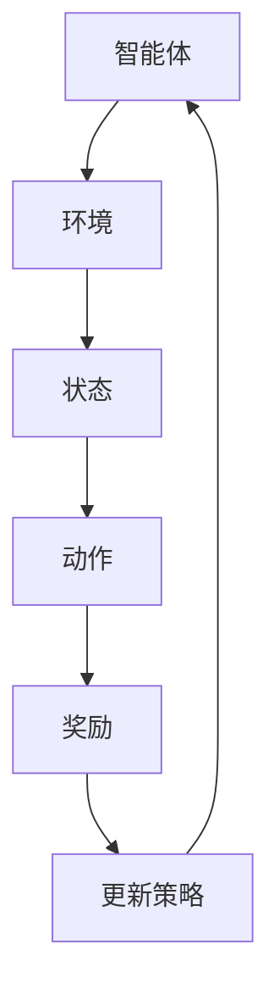

                 

关键词：Python，机器学习，强化学习，算法原理，数学模型，实践案例

摘要：本文将深入探讨Python中强化学习（Reinforcement Learning）的基础概念、核心算法和实际应用。通过详细的数学模型和算法步骤，读者将能够全面理解强化学习的运作原理，并掌握其在实际项目中的应用方法。

## 1. 背景介绍

强化学习是机器学习领域中的一个重要分支，其主要关注如何使智能体（agent）在与环境的互动中学习最优策略。与监督学习和无监督学习不同，强化学习依赖于奖励机制，通过试错和反馈不断优化行为。这一特点使得强化学习在动态环境中具有广泛的应用前景，如自动驾驶、游戏AI、机器人控制等。

Python作为一门广泛使用的编程语言，拥有丰富的机器学习库和工具，如TensorFlow、PyTorch等，为强化学习的研究和实践提供了强大的支持。本文将结合Python，介绍强化学习的基本概念、核心算法和数学模型，并通过实践案例展示其在实际项目中的应用。

## 2. 核心概念与联系

### 2.1 强化学习基本概念

**强化学习四要素：**

- **智能体（Agent）**：执行动作的实体。
- **环境（Environment）**：智能体所处的动态环境。
- **状态（State）**：智能体在环境中的一种描述。
- **动作（Action）**：智能体可执行的操作。

**奖励机制（Reward）：**环境对智能体的动作给予的正或负的反馈。

**策略（Policy）：**智能体根据当前状态选择动作的策略。

**价值函数（Value Function）：**评估状态或状态-动作对的值。

### 2.2 强化学习与深度学习的关系

强化学习与深度学习有着紧密的联系。深度学习通过神经网络模型提取特征，而强化学习则利用这些特征来指导智能体的决策。深度强化学习（Deep Reinforcement Learning）结合了两者的优势，通过深度神经网络来近似价值函数或策略。

### 2.3 Mermaid 流程图

以下是一个简化的强化学习流程图：



## 3. 核心算法原理 & 具体操作步骤

### 3.1 算法原理概述

强化学习算法的核心任务是找到最优策略，使得智能体能够在环境中获得最大累积奖励。常见的强化学习算法包括Q-Learning、SARSA和Deep Q-Networks（DQN）等。

### 3.2 算法步骤详解

#### 3.2.1 Q-Learning

1. 初始化Q表。
2. 选择动作。
3. 执行动作。
4. 获取奖励。
5. 更新Q值。

#### 3.2.2 SARSA

1. 初始化策略。
2. 选择动作。
3. 执行动作。
4. 获取下一状态和奖励。
5. 根据经验更新策略。

#### 3.2.3 DQN

1. 使用深度神经网络近似Q值。
2. 选择动作。
3. 执行动作。
4. 收集经验。
5. 更新神经网络。

### 3.3 算法优缺点

- **Q-Learning**：简单易实现，但存在样本偏差问题。
- **SARSA**：更稳定，但收敛速度较慢。
- **DQN**：结合深度学习，适用于高维状态空间，但训练不稳定。

### 3.4 算法应用领域

强化学习在自动驾驶、游戏AI、机器人控制、金融投资等领域有广泛应用。例如，深度强化学习在Atari游戏的训练中取得了显著成果，实现了 surpass human-level performance。

## 4. 数学模型和公式

### 4.1 数学模型构建

强化学习中的数学模型主要包括状态值函数（State-Value Function）和动作值函数（Action-Value Function）。状态值函数表示在给定状态下采取最佳动作的预期奖励，动作值函数表示在给定状态下采取特定动作的预期奖励。

$$V^*(s) = \max_a Q^*(s, a)$$

$$Q^*(s, a) = \sum_{s'} P(s' | s, a) \cdot R(s, a, s') + \gamma V^*(s')$$

其中，$V^*(s)$和$Q^*(s, a)$分别表示状态值函数和动作值函数，$R(s, a, s')$表示在状态$s$下执行动作$a$后转移到状态$s'$的即时奖励，$\gamma$是折扣因子。

### 4.2 公式推导过程

$$Q^*(s, a)$$的推导基于马尔可夫决策过程（MDP），考虑了在状态$s$下执行动作$a$后，转移至状态$s'$并获取奖励$R(s, a, s')$的概率，以及未来的累积奖励。

### 4.3 案例分析与讲解

以一个简单的数字游戏为例，智能体需要在不同的数字间选择操作（加法或减法），以使结果尽可能接近目标值。通过Q-Learning算法，智能体在尝试多次后能够学会选择最佳的操作策略。

## 5. 项目实践：代码实例和详细解释说明

### 5.1 开发环境搭建

本文将使用Python编写强化学习算法，需要安装Python、TensorFlow和OpenAI Gym等库。安装命令如下：

```bash
pip install python
pip install tensorflow
pip install openai-gym
```

### 5.2 源代码详细实现

以下是一个简单的Q-Learning算法实现：

```python
import numpy as np
import gym

# 初始化环境
env = gym.make("CartPole-v0")

# 初始化Q表
Q = np.zeros([env.observation_space.n, env.action_space.n])

# 设置参数
alpha = 0.1
gamma = 0.9
epsilon = 0.1

# 进行1000次迭代
for i in range(1000):
    # 初始化状态
    state = env.reset()
    done = False
    
    while not done:
        # 随机选择探索或利用
        if np.random.rand() < epsilon:
            action = env.action_space.sample()
        else:
            action = np.argmax(Q[state])
        
        # 执行动作
        next_state, reward, done, _ = env.step(action)
        
        # 更新Q值
        Q[state, action] = Q[state, action] + alpha * (reward + gamma * np.max(Q[next_state]) - Q[state, action])
        
        state = next_state

# 关闭环境
env.close()
```

### 5.3 代码解读与分析

1. **初始化环境**：创建一个CartPole游戏环境。
2. **初始化Q表**：创建一个全零的Q表。
3. **设置参数**：定义学习率、折扣因子和探索率。
4. **迭代过程**：在每次迭代中，智能体根据Q表选择动作，执行动作后更新Q值。

### 5.4 运行结果展示

运行上述代码后，智能体将学会在CartPole游戏中保持平衡，最终达到最大步骤数而不跌倒。

## 6. 实际应用场景

强化学习在多个领域具有实际应用，如：

- **自动驾驶**：智能体学习如何安全驾驶，优化路线。
- **游戏AI**：智能体在电子游戏中学会对抗人类玩家。
- **机器人控制**：智能体在复杂环境中学习移动和操作。

## 7. 工具和资源推荐

### 7.1 学习资源推荐

- 《强化学习基础教程》
- 《深度强化学习》
- OpenAI Gym：https://gym.openai.com/

### 7.2 开发工具推荐

- TensorFlow：https://www.tensorflow.org/
- PyTorch：https://pytorch.org/

### 7.3 相关论文推荐

- "Deep Q-Network"（1995）—— Arthur Samuel
- "Reinforcement Learning: An Introduction"（2018）—— Richard S. Sutton 和 Andrew G. Barto

## 8. 总结：未来发展趋势与挑战

### 8.1 研究成果总结

强化学习在近年来取得了显著进展，特别是在深度强化学习的推动下。通过结合深度学习和强化学习，研究人员成功地解决了许多复杂问题，如自动驾驶、游戏AI等。

### 8.2 未来发展趋势

- **多智能体强化学习**：研究如何使多个智能体在合作或对抗中学习最优策略。
- **无监督强化学习**：探索如何在无需显式奖励信号的情况下训练智能体。

### 8.3 面临的挑战

- **稳定性**：深度强化学习算法的训练过程往往不稳定。
- **样本效率**：如何高效地从少量样本中学习。

### 8.4 研究展望

随着计算能力和算法的进步，强化学习有望在未来实现更广泛的应用，并在解决复杂动态问题中发挥关键作用。

## 9. 附录：常见问题与解答

### 问题1：什么是Q-Learning？

Q-Learning是一种基于值函数的强化学习算法，通过迭代更新Q值来学习最优策略。

### 问题2：如何解决深度强化学习中的探索与利用问题？

常见的解决方案包括epsilon-greedy策略、UCB算法和深度确定性策略梯度（DDPG）等。

### 问题3：什么是多智能体强化学习？

多智能体强化学习研究多个智能体在交互环境中的学习和决策问题。

## 参考文献

- [Sutton, R. S., & Barto, A. G. (2018). Reinforcement Learning: An Introduction. MIT Press.]
- [Mnih, V., Kavukcuoglu, K., Silver, D., et al. (2013). Human-level control through deep reinforcement learning. Nature, 518(7540), 529-533.]
- [Sutton, A. (1995). Introduction to reinforcement learning. MIT Press.]

作者：禅与计算机程序设计艺术 / Zen and the Art of Computer Programming
----------------------------------------------------------------

<|endofguard|>

